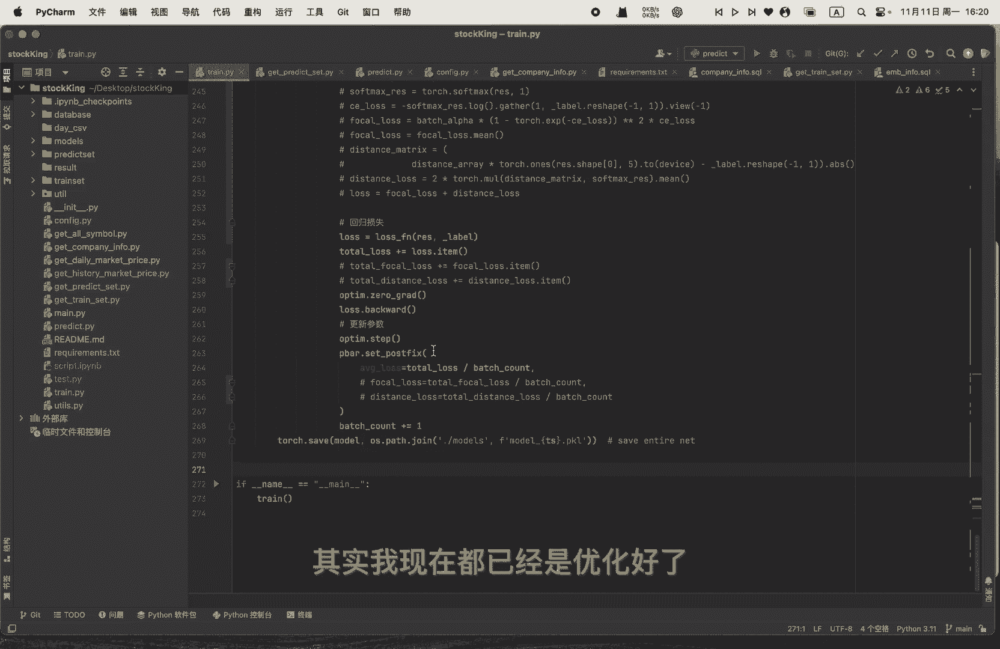
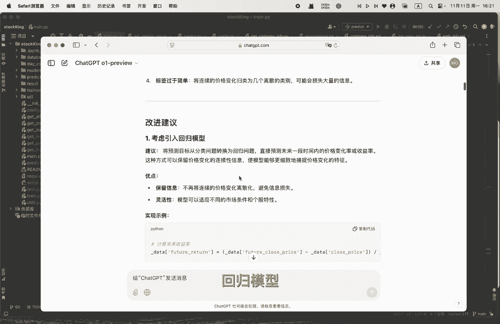
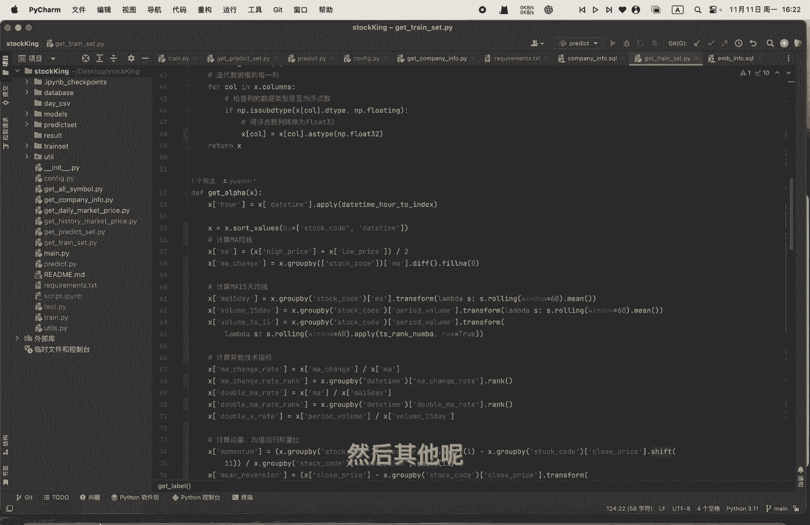
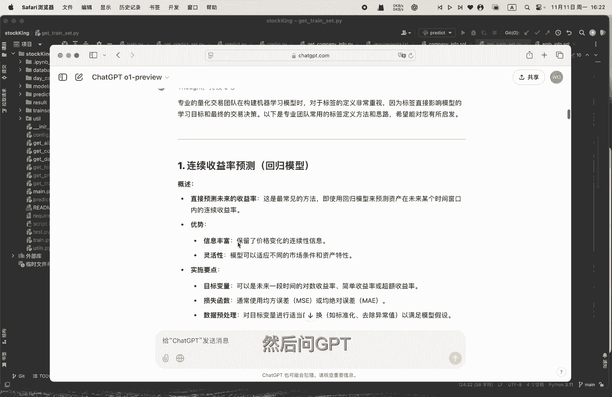
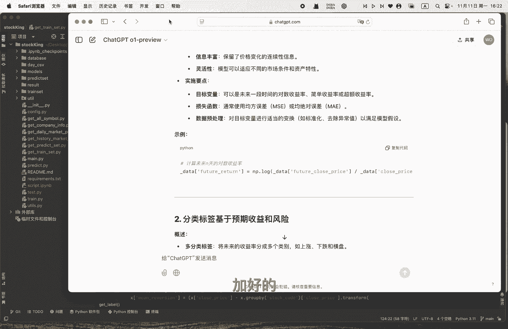
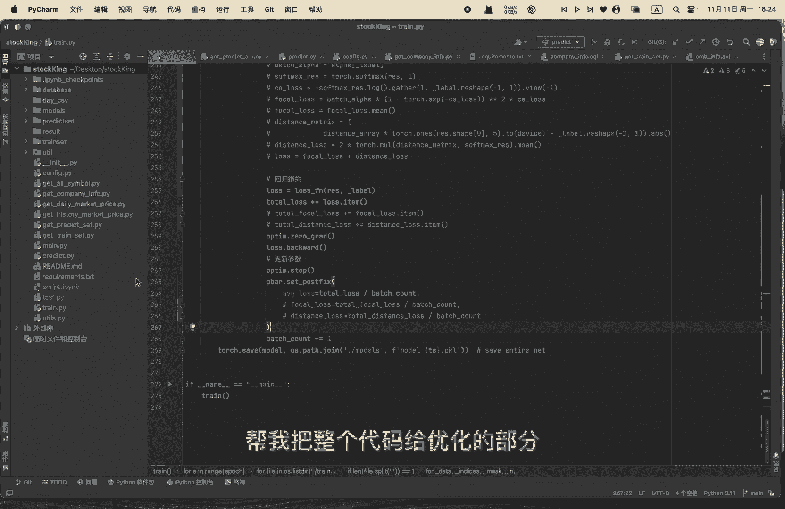

# 从零开始做量化｜6 利用GPT优化代码 - P1 - 小蓝帽go - BV1BUUPYiEFS

OK我们这一节讲的就是利用CHEGBT，来优化整个模型啊，整个stock king的一个这个项目，其实我现在都已经是哦优化好了。

那我们可以来看一下，我的一个优化过程是怎么样子的哦，我就是去问那个拆GBT哦，用到了一个，还应该是他最近最最好的一个模型O1，然后我就把他的那个代码，我就把我的代码给贴上去。

然后让他帮我review一下啊，可以看到哦，他这边呢是应该是理解了这个模型啊，这段代码，然后嗯对然后一步一步来，然后我就先问一下他，我的这个标签的定义问题，我问一下他有什么更好的办法，然后他就嗯还说了。

我这个多分类的问题还是有一些有一个问题吧，就是说标签过于简单，并且呃类别不平衡，或者说是太依赖依太依赖于这个绝对阈值，其实我当时考虑那个用那个distance loss。

其实就是啊这个绝对阈值这个设置不太好，因想把嗯相近的啊训练，让让模型就理解相近的一个概念，就理解它不是一个纯粹的一个呃分类，而是一个序列的一个分类，但是GBT可能还是会让我考虑，引入这个回归模型。

那我最后呢也是把它改成了这一个，可以看一下哦，嗯该label可以把它改成了，用这个啊未来收益率的一个logo，去当做我的一个label，然后其他的我就不赘述了。

也也是一一把这个代码填上去，然后问GBT。

然后问一下他，有就是寻求他，有觉得让他觉得有什么更加好的一个嗯。

优化或迭代一个思路，然后整体的话还是增加了很多的，主要在训练过程中呢增加了这些哦，应该也是常见的一个啧啧或者一些一些指标吧，就GBT觉得我这些指标虽然但都还OK，是make sense的。

但是还是要还是可以考虑，增加一些其他一些额外的一个指标，然后包括模型这一边啊，然后把整个这个attention自注意力呢都给改掉了，都直接用那个transformer啊，去去训练这个序列的这个部分哦。

序列transformer的这个这个结果啊，在和这个类别特征嵌入层呢进行一个呃连接吧，可以看到这个forward这边啊，transformer的output和我的这些其实还是一样，因为我无非是上面。

这我之前是无非上面部分用了一个LSTM，再加一个自注意力，然后啊，GBT帮我改写成了一个transformer的一个架构，然后下面的话还是一样的，就是把它拼接在一起，然后用全连接层给它输出输输出来。

然后因为他的这个base size，他的那个shift是base size1，因为他的那个呃，我把它设成一个连续的一个问题，让他训练出来是一个连续的值，只有一个单一的一个值了呃，把他那个因此呢。

把他那个loss也给改成一个回归损失了，那这一步呢就是这些呢就是GBT啊。

