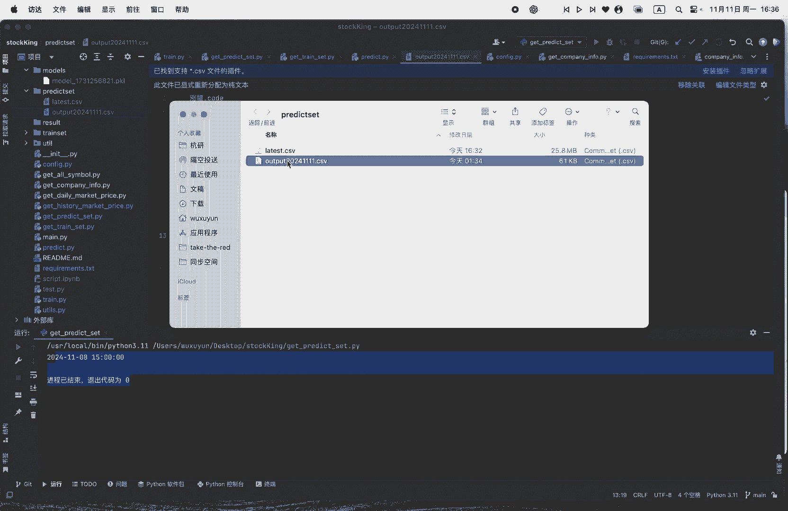
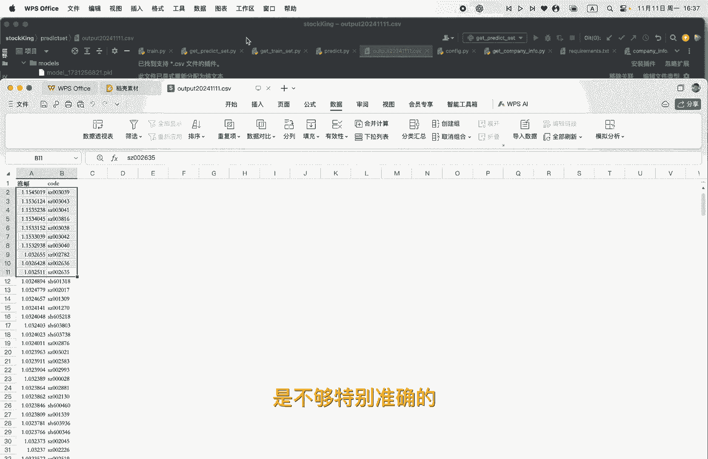

# 从零开始做量化｜7 个股预测 - P1 - 小蓝帽go - BV1QMmZYzEuo

OK那这一节的话，就是我们整个从零开始做量化的最后一节了啊，你把模型训练完以后，你就可以开始去预测了，可以看到这个预测期前呢，需要运行一下这个get predict set哦，我这边已经运行好了。

运行好以后，它会产生一个latest csv的一个呃需待遇测数据，其实这个数据跟这两个代码几乎完全一样，无非这个是取到八天以前，这个这部分数据还是取到，可以看到sequence练习32。

应该是取了八天之前，而这get predict set，在这个部分呢是呃控制它只取最呃，就最大的一个daytime，也就是最最最近的一个daytime，然后当他的一个预测机，然后全部结束以后呢。

你就可以开始去预测了，预测的代码，在这里面，你就把你的那个呃models给啊替换一下就OK了，我们可以看到啊，Output csb，哎可以看到。

嗯打开语音放大，Ok。

排序哦，哦我已经排序好了，可以看到，那我呢是做一个啊做了一个排序，就是说然后选择了十只股票呃，去做一个量化交易的一个组合嗯，我们现在是11月10，11月11号做完这一期额从零开始的。

然后我整个数整个训练数据呢，就是最最近最近的，然后预测数据呢是截止到11月8号，也就是上个礼拜五，因此也就是说我现在预测这个涨幅呢，就是我今天的一个额交易日的一个数据，其实其实最后呢可以开去验证一下。

然后这个模型到底准不准确哦，模型肯定是不够特别准确的。

我这边所以说我只是提供一个呃思路吧，就是做一个量化的一个思路，然后中间的过程呢肯定也有很多不对的地方，无论是你去找阿尔法因子也好，或者说你这个模型的搭建适不适合这个模型，结构适不适合这个数据也好啊。

都是可以去，都是需要需要去优化的，然后也整个这个量化的这个框架呢，也没有去做那个可视化的一个部分啊，所以还是提供一个小小的思路吧。

