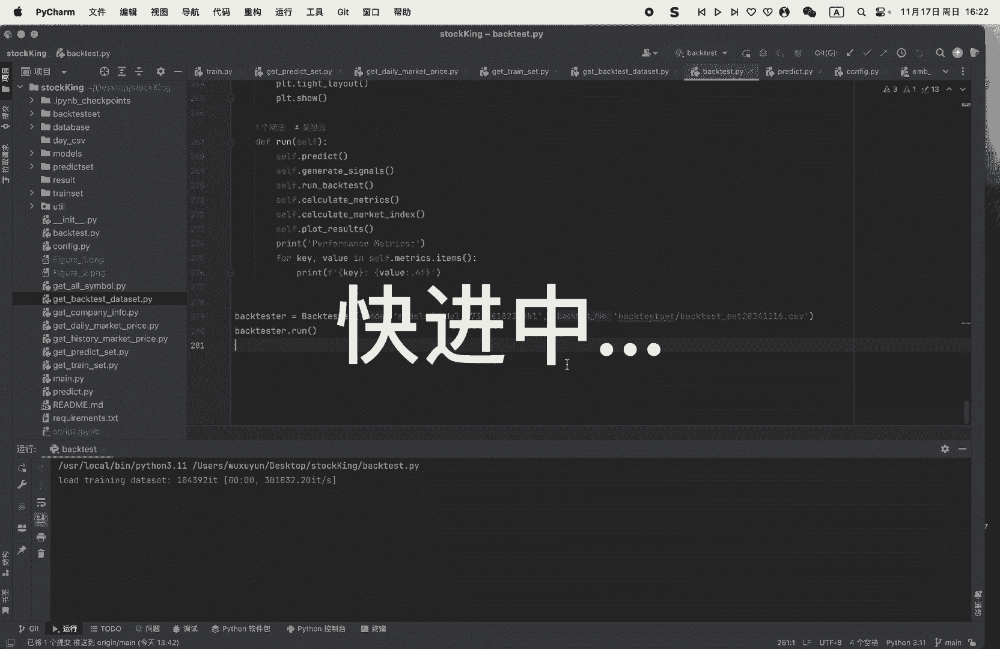
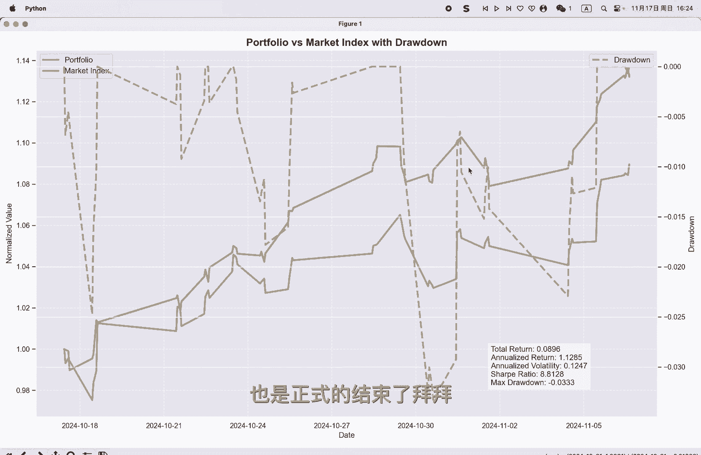

# 从零开始做量化｜8 经典！跑输给了大盘 - P1：8经典！跑输给了大盘 - 小蓝帽go - BV1kCU6Y1E6D

哈喽大家好，上次原本是最后一期，然后我在评论里说，有空会把回测模块给做好，想想的话，我还是把它给做出来吧，然后回测的模块的话主要是由两部分组成，第一个是这个get back test dataset。

这部分就不细说了，其实和之前差不多，就是获得哦回测的数据，然后我主要是来讲这个回测的模块，回测模块的话主要是就是这个back test的类，我们可以看一下它有哪一些方法和函数哦。

第一个predict也可以不用细说，其实就是对那个啊回特数据生成，未来的对数收益率，然后主要的话是这个就是generate signals，和下面这个run back test，这个的话。

这个函数的话就是生成股票的那个买卖信号嗯，主要有两个，两个要说的，就是一个是我会对那个对数收益率预测的，对数收益率的预测值设置一个阈值呃，我这边分别是设了0。01和负的0。01，其实就是涨1%和跌1%。

但这里的涨跌幅并不是物理意义上的涨跌幅，因为涉及到数据不平衡的问题，模型预测呢是会往一这个这个靠近的，就是说不涨不跌，这里靠近的嗯，也就是说这个的话，只是大概的会预测它是会涨还是会跌啊，不过没有关系。

我设置了一个最大的持有量，就是max stokes，就是max stock holding啊，差不多就是会额最大的持有数量的预，大概是百分，大概是20只股票，然后呢我这边会对它进行额排序，然后呢是对呃。

取超过涨幅阈值前20%，并且超过1%的股票呢生成买入信号，其他的是生成这个卖出信号，然后我们这边的话就是这一个呃，运行它的那个回撤的一个函数了，这个就是真正的回测，回测部分还是比较复杂的呃。

首先这里会每天都会去更新它的持仓的市值额，计算剩下的资金嗯，出于简单的考虑的话，我这边是一个等权重的分配资金的方式，意思就是说平均分配给每只股票相同的资金嗯，可以看到嗯，其实是相同的资金。

然后因为差不多就是要维持满仓的概念，并且是20只股票的一个概念，然后因为A股是T加一的交易情况，所以我卖出的时候要注意一下呃，主要是这个卖出的时间呢，他要是满足T加一，就是说卖出的那个日期。

是要比那个买入的日期大于一天的，其他倒还好，这个回测模块的话，其实嗯说起来很复杂，其实主要的功能的话就这一个部分，然后我们可以来看一下，最后两个模块呢是哦生成这个指标。

这个还是要感谢那个TENGBT帮我生成了呃，帮我把这边的代码写出来了，我这边的话会输出呃，这个话是大盘的一个指数，然后他的收益这里的话会有它的收益情况呃，回撤情况，还有一些指标，比如说预期的年化。

还有夏普率等等等等，我们可以来运行一下。

好的，我们最后的这个呃，这个回撤的这个图就给大家给画出来了啊，这个蓝色的虚线呢是它的这个最大啊，回撤的一个呃曲线，然后这个绿色的是它的收益的曲线，黄色的是他的那个大盘的一个情况，很遗憾。

我这个这个投资组合呢是并没有跑赢大盘啊，不过没有关系，我们还是把它这个功能给实现出来了，然后模型的话还是可以去啊给它慢慢的优化，OK那我们这个嗯回测的这个模块呢，也是正式的结束了。

