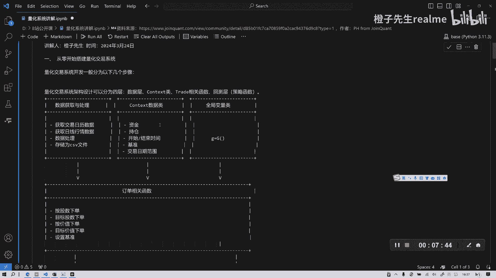
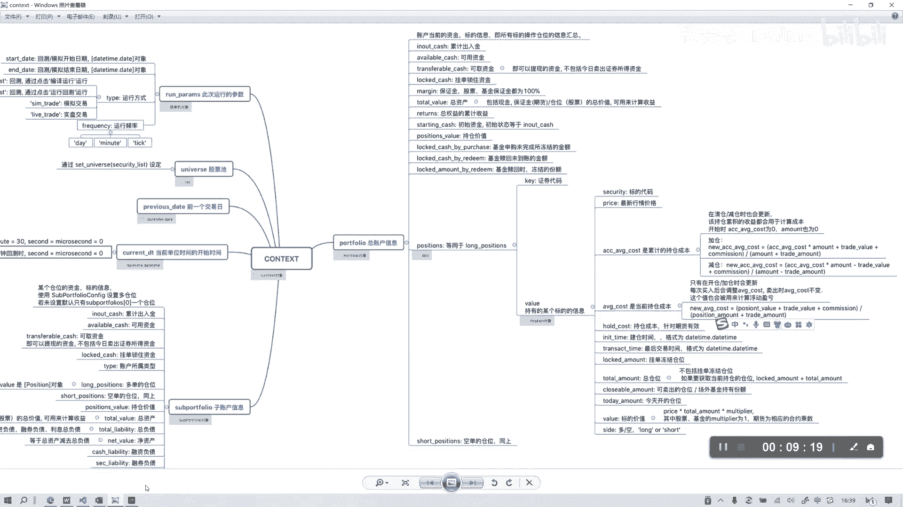
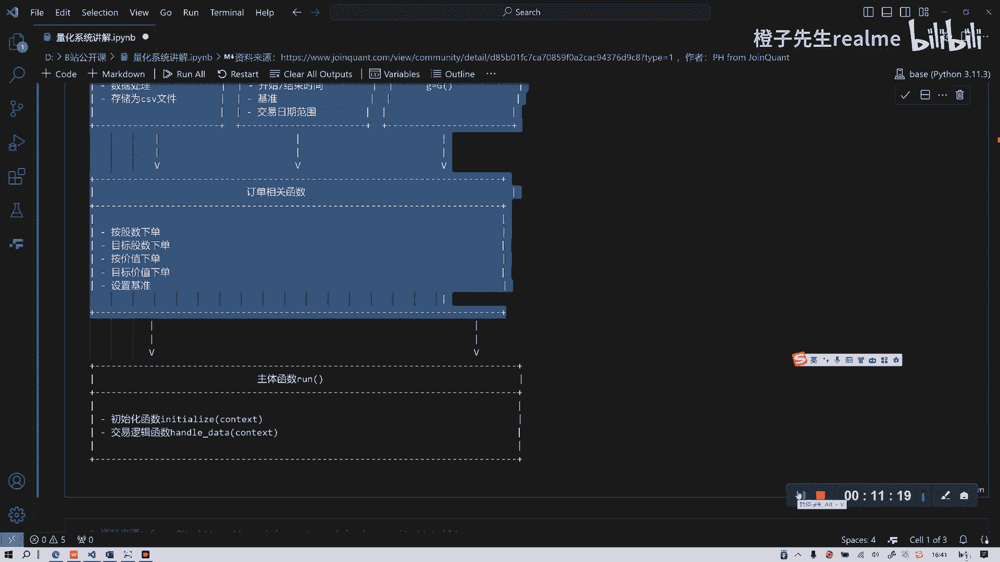

# 从零开始卷量化系统01 Motivation - P1 - 橙子先生-量化 - BV15j421d7qu

各位朋友大家下午好，今天我们讲一下，从零开始搭建自己的量化交易平台，讲一个比较基础的，但是这个麻雀虽小，五脏俱全，我们这个策略呢是从巨宽的论坛上参考的啊，主要是从他那个参考的PH或者为PH啊。

你大家可以从这个网址去找到它的源码呃，因为距宽上基本上是开源的嘛，所以我们就引用过来讲一下啊，为什么讲呢，这个相对于初学者来说呃，还是比较复杂，所以可能要花四节课左右的时间来讲一下，这个呃。

这个课适合于有两年左右的这种基础的朋友，就是你在平台上还是你学过之前的我，我的课都都已经吸收好了，然后你想在进阶来搭建自己的量化平台，可以来学这个课，如果大家基础不够。

还要回去补补一补编程和数据分析这些东西好，我们首先要讲一下，为什么要为什么要搞量化平台，要做自己的量化平台呃，很很多人可能会质疑我，尤其是学金融的，学经济学的朋友，可能会觉得这个过于复杂。

就是IT工程师干的事，不是这种传统的金融学专业，或者说文科生做的事，其实这是不对的啊，当然我们讲确实很多it行业的朋友，通过这个就能就能找到一份工作，因为量化工作分为四类，能找到一类什么工作呢。

就是量化软件开发工程师，这类工作是比较常见的，比较适合于学计算机的朋友，那么还有一类呢就是更擅长，更适合于这种我们有经济背景的这些同学啊，朋友是什么专业呢，是什么，是什么岗位。

大家应该知道就是量化研究员或者量化分析师，就是研究策略的，我们之前不是说过吗，策略是很关键的，是非常核心的，那么还有一般大的量化机构里，还有一类岗位，大家想一想是什么叫量化交易员，但有些小的岗位。

可能小的机构会把几个岗位合在一块是吧，一般是这三类，当然如果还是分的很细的话，还有管风控的等等吧，这个我就不再讲了，主要是三类，就是说呃如果你是经济学背景的，比如你是公募基金，你是一些研究员啊。

券商研究员，你如果不会搭建自己的平台，你只能用一些呃线上的平台，比如我们之前介绍的呃这个聚宽啊，铀矿啊等等这些包括半框等等，但是这些平台的什么问题呢，就是你你的这些平台，你跑的数据啊。

你跑的这些信号策略都是在人家平台上啊，虽然这些平台都是，我相信都是有这种职业道德的，不会去看你的策略，但是你自己总感觉不是很踏实，就你的感觉心里感觉可能是不踏实，对吧啊，这就是一个保密性的问题。

因为量化这个行业它保密性非常重要，策略一旦曝光，他立马阿尔法就消失了，所以商业机密是很重要的对吧，大家如果看过新闻，就知道有一些机构，美国一些机构离职的量化研究员，他就把策略给偷了嘛。

然后自己成立公司挣了钱，然后也发生了一些诉讼，所以这个非常重要，保密很重要，这是第二点，第三点就是个性化需求呃，我不知道大家有没有熟悉这些量化的平台，如果用的比较熟的话。

我觉得国内比较好的就是巨宽啊等等，冠况也比较专业，但他们都有问题，他们一个什么问题呢，就他们的数据是非常标准化的，同质类的同质化的就很像，全都是都是什么基本面数据，宏观数据，市场行情数据等等。

还有一些技术指标，什么阿尔法101等等，这些东西都是非常相似的，那么相似的你就很难获得一些好的收益啊，你只能说获得一个平均，平均或者平均偏上的收益，你如果有特别好的想法。

你有特别另类的数据或另我之前讲就上节课，大家如果不懂可以去看一下，因为你特别好的另类数据，产生特别另类的阿尔法，这个时候我相信可能不管是机构还是个人，也不会把这个事告诉我呃，平台对吧，你告诉平台。

平台就可以办理策略，拿去卖钱等等吧，有可能哈，因为这种这种东西是不便于和人分享的，像这种这种东西需要干什么，需要保密，需要你自己做，就是你一定要有个性化需求，个性化需求要求什么，要求一个。

哪怕你是一个经济学出身的，一个金融学出身的这个同学啊，你都必须得为自己搭搭建平台，哪怕不是那么面面俱到，但至少你要有一个方向上的，就你回测的时候，你的方向上要准，之前我在过年前后。

讲过好几期的这种向量化的回测，向量化回测好是好啊，但是它有一些问题，它与这种基于事件驱动的回测，这种循环回测它有很大的区别，就是它很难刻画这种带可变成本的，不变成本的，包括华点这些东西很难刻画的呃。

他快是快，但是它的缺点就是，然后呢它很它非常方便，在做个单个股票的这种回撤，但如果你说资产组合呢，比方说我你看咱们之前讲的，那所谓的双曲线策略，指的是你买一只股票，5日和10日之间的关系来来选择。

如果你筛选这个沪深三百三百只股票，你一天要把300只循环一次，你找到有这个金叉信号的股票构成组合，那么之前的这种销量化就做不到吧，很难做到，包括你用贝壳你也做不到，也比较麻烦。

那个吹的也是可以做到比较麻烦，那么这时候你是不是想想，要自己的这种电话平台对吧，所以呢这是第三个原因好了，我们原因讲了已经有5分钟了，就是学任何东西都有目的性嘛，对吧，不能跟你讲一些没有意义的东西。

然后了解了这个目的，我们再来学就更有动力好吧，我们看首先我们在做这个系统，其实这个也是借鉴了这个朋友的这个系统，我觉得写得不错，当然还有完善之处，我们一会讲我们就讲在基础上，到时候再完善，怎么完善。

我会再讲，就是以他作为一个PANCHMARK吧，首先呢这个量化系统呢包括四个部分，它这也是仿仿照这个zip line和那个巨宽嘛，就这种风格的最先都是美国的，美国那个公司的，上节课介绍过。

大家如果不熟悉的话，可以再看看，还有三个开源工具对吧，阿尔法length和simple line，还有那个PYFOLIO啊，三大工具，那么这种回测的结构呢，我们可以把它画成一个简陋的图啊，简陋的图。

第一部分第一个模块我们就要获得数据，就是对数据进行一个函数的封装，第二有了数据之后呢，我们要对抗，我们要定义一个context，上下文，数据类，上下文类，这个上下文context类是非常常见的。

你在任何的量化平台上，你几乎都能看到这个他这个主要作用是什么呢，就是储存一些信息呃，你可以把这些信息看成一个全局变量吧，可以看成全局变量，就是他要在当然说全局变量不准确。

就他这些信息要通过变量在其他函数进行传递，比方说在handle data，在initialize这种开始初始化函数，当你传递传递哪些信，当比方你的开始资金量，你的持仓情况，你的这个交易开始时间。

交易结束时间，然后等等吧。

我给大家下载了巨宽的这个context类，大家看一下呃，context类它就是包括了非常多的呃，为什么要看区块呢，因为区块它是比较专业的，然后它比较全嘛，我们可以参照他这个来写自己的context类。

我们先往右看了他这个context的类呢，包括p for folio，他这个是相当于一个资产组合的一个对象，folio对象，然后自然组合对象里面还有就还嵌套了一些，往往里面走还有深层的结构。

有这个test就累计输入进cash，Available，cash可用资金等等吧，这些所有资金情况，然后有他有position情况，就是仓位的情况，有long long shot，他是这是干什么。

这是做期货的有效呃，国内股票基本上就是浪对吧，然后呢position里面还有key value，它怎么取到下一层呢，就用一个点，比方说context点portfolio，点position点等等等吧。

点这个一直点那个，这样就可以取到，这相当于是他定义的一种数据结构，我们Python它传统数据结构不就是那几种字典啊，列表啊对吧，元祖等等，还有集合是吧等等这些东西，但是那就它那个结构呢。

Python传统的那个数据结构，它不足以来保存，像证券交易这么复杂的这种数据的结构，所以就要自定义这种context类，然后呢接下来我们要对它进行实例化，我们再回到我们的代码啊。

这是第二，第二个模块，一定刚开始一定要把这个模块搞清楚，然后我们知道他这样逻辑，第三就是定义一个全局变量，这个可能在这没有用上，但是呢如果在复杂策略，在更加全面系统下，它是可以用上的嗯。

然后第四步就是要生成一些，就要就要生成一个什么模板呢，就是订单相关的函数，就是交易跟交易相关的订单函数啊，包括我们之前也讲过呀，比如说order是吧，all the value根据价值下单。

all the target下单到什么什么价值等等，还根据数量下单，就这些相下单相关的有五函数，这五个函数封装在这个模块里，当然他一个一个写的啊，那么就是最后的一个，或者说咱们在量化平台上。

我们敲的代码是非常少的，因为这些平台把上面这些东西啊，它都封装起来了，你看不到你看不到它全封装起来了，给你给你一个接口，然后你就选选择时间就行了，选择这个资这个资金多少，比方说10万开始实现什么什么。

他给你做成了一个可视化界面，其实咱们在量化平台里写的东西就这样，是不是就一个初始化函数，一个交易逻辑函数，所以很简单，其实他给你封装的可能有上千行代码，或者几百行代码，就就这个来看一下这部分好。

这就是第一节课，第一节课我们讲了两个，我们我们来回顾一下，我们讲了两个东西，一个是为什么要学量化平台搭建，或者说为什么要从零开始搭建，而不用量化那些什么宽三大框的那个平台，第二个就是为什么要学这个。

不仅是IT程序员要学这个，传统的学经济金融学的朋友也要学这个，包括什么研究员啊对吧，也要学这个，因为学这个很重要，它有三大目的，一个找工作，第二个是什么，保证你的策略的安隐隐私，就你一个人知道自己知道。

第三个就个性化，他能搞出很多另类的策略，另类的数据，你必须得自己搭建策略对吧。

你另类，你不能告诉别人吗。