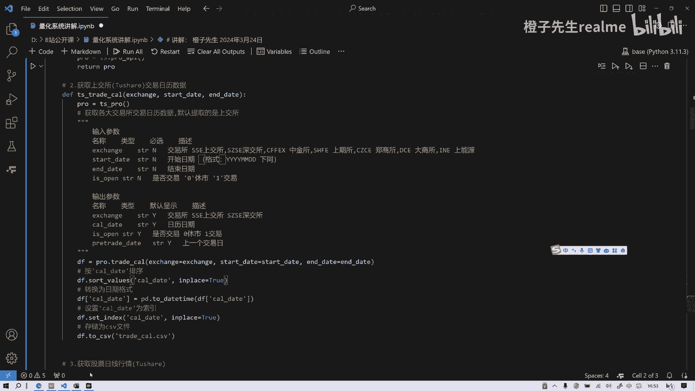
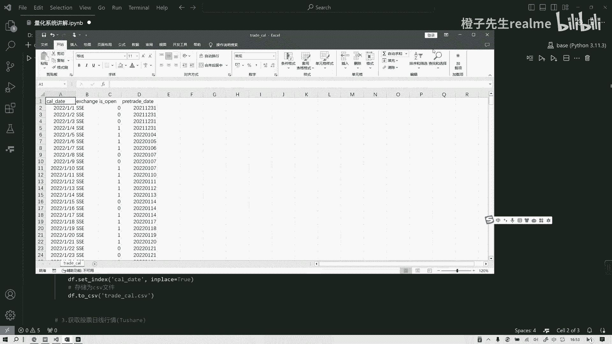
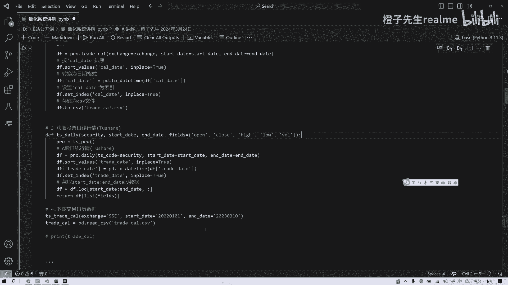

# 从零开始卷量化系统02 数据获取模块 - P1：从零开始卷量化系统—02数据获取模块 - 橙子先生-量化 - BV1Ni42197DD

啊啊这是第二节课，我们讲一下，在啊就刚才我们不是讲了这个基本的模块吗，我们今天来讲一下模块的第一部分数据获取啊，我们看一下数据取，它，首先是不是应该把这些相应的数分析库给引入，是吧。

还有一些数据to share，数据要引入，还有MATPLOTLIB这些画图的库，时间的库全部引入，这是第一步啊，然后呢第一个模块数据获取，那数据获取呢，我们首先要呃要定个要要登录这个，如果大家没有啊。

如果大家没有登录to share，没有注册的话，请点击HTTP点share，这个点一下我的给我一点支持好吧，然后能重点积分是吧，你点完以后注册注册了，你就进入个人主页，在主页中点我的。

然后上面就会有一串像密码一样的东西叫token，然后你复制复制我的你的token，然后替换我的这块your token，把这两个把这个单词啊替换住，替换覆盖就可以了。

这样你就可以调用它的to share数据API接口，这样你就可以通过这个在线的数据库来来完成，自己的数据调用，这是第一步已经给封装了，你看我们原来之前我讲了很多次回测。

我都是都是直接把这个写写一行一行写的对吧，没有没有封装，封装的好处就是可以复用，提高效率对吧，这是嗯这个Python编程的思想，第二步呢，就是要获得我们A股的交易日历数据啊，这里可以取上交所没问题。

上交所深交所都可以，因为是同步的吗，好吧，把上交所的这个交易数据取来，首先第一步函数第一步调用这个接口，数据接口pro，第二步我们通过pro点trade cl这个函数呢，就把日历给它弄出来。

弄出来以后呢，根据日历的日期cl date来排序，单排序，然后排序完了以后把它转化为DTIME格式，这个跟之前一样的就不说了，然后设置索引，把这个日历日期设置为索引，然后就是就是true原地修改。

最后呢把它数成了这个trade kill csv，给大家看一下下载完以后什么样子啊。

就这样放大一下，放大一点，就这么一个就这么一个数据吧，看到没有，就是日期，这个是什么，前一日是吧，前一日这是否开盘是吧，交易所名称上海交易所，所以这是我们下载完以后打开的。

就是这个，所以你把这个函数给它运行了，调用了就会出现那个刚才我们说的那个表格，这是很简单的，就第二个功能就获得呃，上交所交易日历数据，然后第三步呢，第一模块第三步干什么就获取股票日线数据。

就你你有了日历，你是不是还得获得你想投资的这个股票，股票标的的数据啊，那就比较简单了，依然是先调用pro这个接口图像下的接口，然后呢我们用pro点daily，如果大家之前听过课。

就会很熟悉这个pro daily获得什么，获得行情的数据，关于什么，关于某一只股票或者某一股票池的开盘，我们FS是哪些啊，就是他的那些属性，开盘收盘最高最低交易量是吧，把数据取来以后呢。

我们就要做一个切片，怎么切呢，是根据这个横轴，根据时间来切，就是比方我们取了10年的数据，我们全取下，但是我们可能回撤只用了两年，就是这个state start date和end date呢。

就是你回测需要用的时间，就是你把这些需要用的时间和这些嗯，叫什么字段给它切回来，就变成了一个你需要操作的DFDF，然后类似DF这个可以看成一个DF1是吧，这个就是这个函数。

就是获得股票的在指定区间的日行进行数据，确定好吗，OK这是第三个，第四个呢就是刚才我们已经不是下载下来了吗，我们已经定义了这函数，但是函数你如果不调用的话，它就不会出来，它就不会运行。

所以你要你要给它给它们叫类叫实例化，这个不叫这不叫实例化，这叫调用调用，它把这参数啊给它放进去是吧，参数放交易所开始日期，结束日期，然后呢我们还要读它pd v csv，我们可以读取他这个数据是吧。

读取它的数据好，因为它这是什么情况，因为他先存了对吧，他先存了，你调用这个函数，它先存一下，它并没有给你return是吧，没有给你return，所以你存完以后，你还得读它，它是这样的方式。

你也可以用return什么什么呃DF，然后你就把这个return这个DF再给他也行，付给他也行，但是这呢咱们就没有那样做，知道吧，没有那样做好。

第一个模块我们讲完了，我们下一节课讲第二模块。