# 从零开始卷量化系统03 Context类与相关函数 - P1 - 橙子先生-量化 - BV1qj421R71n

各位朋友各位同学大家好，今天是讲第三个context l啊，这个是要按顺序听啊，就是第一个听完听第二个，第二个听完听第三个呃，context类是非常常见的，它会存在于各种各样的量化交易平台。

所以呢它的好处是什么，它的好处是能把所有的信息全部封装在一起，然后通过一个类的这种形式的变量进行传递，那么在这在那个策略当中，写起来就会比较方便好，我们这个做了一些修改，在原来基础上做一些修改。

是为了给大家展示，因为可能有些朋友对这种Python的这种，面向对象的编程思路啊，他不是很熟悉，我来就想讲的通俗一点，让大家一次听懂，不要再去翻教材，所以我可能要讲的细一点啊。

首先class context就是定义一个类，一类叫context上下文是吧，那么我在这里写了一行没有用的，其实是对于这个策略没有用，但是是为了展示类的一些功能吧，就相当于类的属性，类属性。

就类似于这个，你不管到最后你要生成这个实例吗，实例化的时候，这个是不可以不可以改的，就相当于你类似于你从你父母遗传来的一些DNA，变不了的一些一直遗传下去的东西，不可变的东西，我们可以这么写。

那么下面呢就是，in it这个函数呃，这个函数是就你每生成一个类，都是必须要生成的，它是它是什么意思呢，我来举个例子通俗解释一下啊，就假就假设你有一个工具玩具工厂，你要专门生产小汽车。

比如这个小汽车类汽车类对吧，那么你每生产一辆汽车，比方说新能源汽车，什么油车，它就相当于一个实例化对吧，那你甭管是新能源汽车还是油车，它都会有一些基本的功能是不变的，比方说车车的颜色，车轮的颜色。

还有这个车子的高度宽度，就那么说吧，长度这些属性都是不会变的，就是每个每个车都要有这个属性嘛对吧，虽然可能大小不一样，但它属性都要有，所以只要你调用这个类比car这个类，它在ENGLISH函数里面。

它都会给你把这些应该有的对象的属性，全部组装起来啊，这这个就是以汽车为举例啊，那在量化也是这样，就是你只要调用这个context类，他都会把这些东西，这些信息全部给你准备好，就很方便，就不用再再次写了。

就是可以复用吧，这是这里面的属性呢，这个函数里面的属性叫做实例属性，就是你每个实例的对象的属性，和类的对象的属性，随机对象的属性。

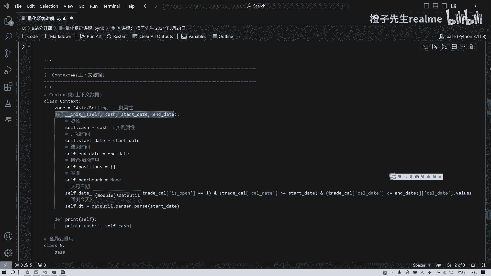

那么我在底下又写了两行与这无关的哈，与这个整个无关，但是为了展示这种面向对象的编程方法，就是你一般在定义了index函数之后呢，还要定义一个，这叫属性是吧，那么下还有方法。

就是你这个类有很多方法就做很多事，比方说你我们就一个简单的方法，就是打印我们现在有多少钱，就你只要一调用这个类，他就会打印出我们现在有多少钱，就有多少多少的市值，多少的余额是吧，这个其实是不需要的。

所以我们给它来给它取消，这也是不需要的好吧。

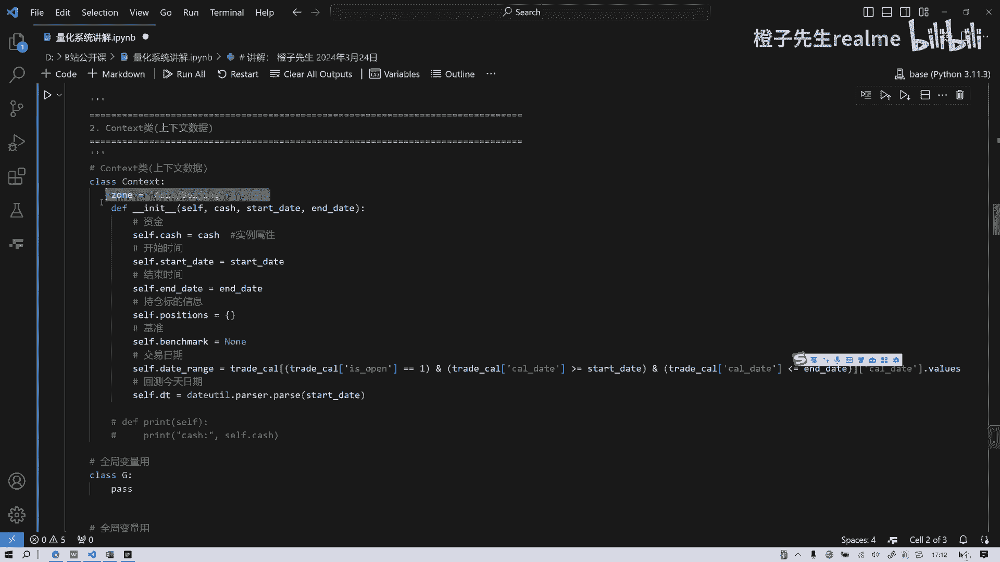

只为了大家好好理解，那么接下来我们定义一个全局变量，这里就是随机变量，就是在各函数中它都是可以用的，可都是有效的是吧，除非你对，除非你在这个函数里面，对他做了一些什么global的声明是吧。

不然的话他在各函数之间都是可以覆盖它。

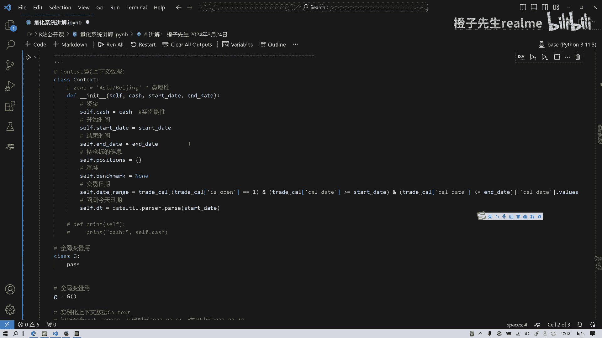

整个都有效的，知道吧，那么在实例化一个实例化一个好，接下来我们就要对context对象实例化，context对象实例化，为什么要实例化，因为你不实例化，你就无法来对，一开始就是你策略在做开始之前。

你都有一些信息是是是不可变的，比方说你要投资，你投资股票的话，你是不是得先存存一笔钱，有一笔钱，比如说你有10万或者20万，这笔钱就我们在量化平台上会有一个框，让你填这三个数对吧，填cash多少。

study多少，看看这多少，实际上它就是把上面的封装了，就给给你一个这个接口，可视化一个字母接口，那么我们在面向对象的这种量化系统，搭建过程中呢，我们要对这个类进行实例化，这样便于之后来来使用，明白吗。

便于之后使用，那么这节课核心做了这个。

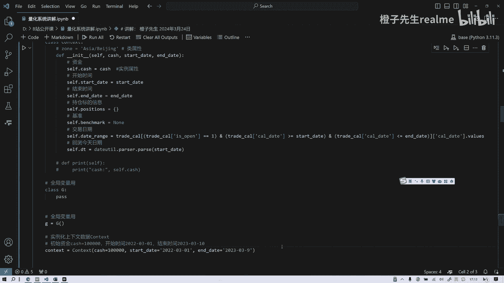

然后我们就把这个旁边的一些，就是相关的一些函数，我们再讲一下，然后我们一般在做这个展示的时候，大家知道啊，它不是一条线，它两条线就是你对一个基金经理，或者说对一个策略进行评价的时候。

你不是看它绝对收益的高低，一般是和沪深300或中证500这种指数，国外也有什么这个纳斯达克指数来做对比，你只有跟他对比，你才有意义是吧，还有阿尔法，不然你怎么定义阿尔法呢，所以这是设置一个这个函数。

就是目的就是干嘛就设置一个基准，当然呃，这个策略这个例子举得是用一个股票作为基准，其实你直接用沪深300指数指数价格来做基准。

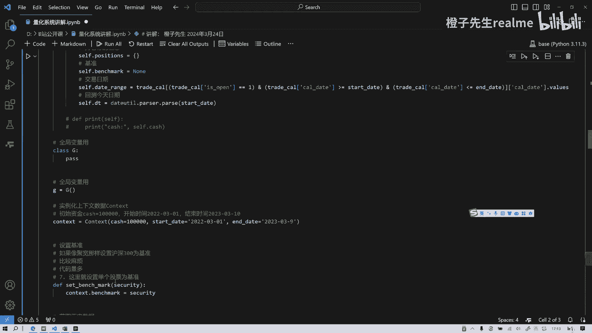

一样的，大家可以改一下，然后呢，接下来我们还要获得历史数据。

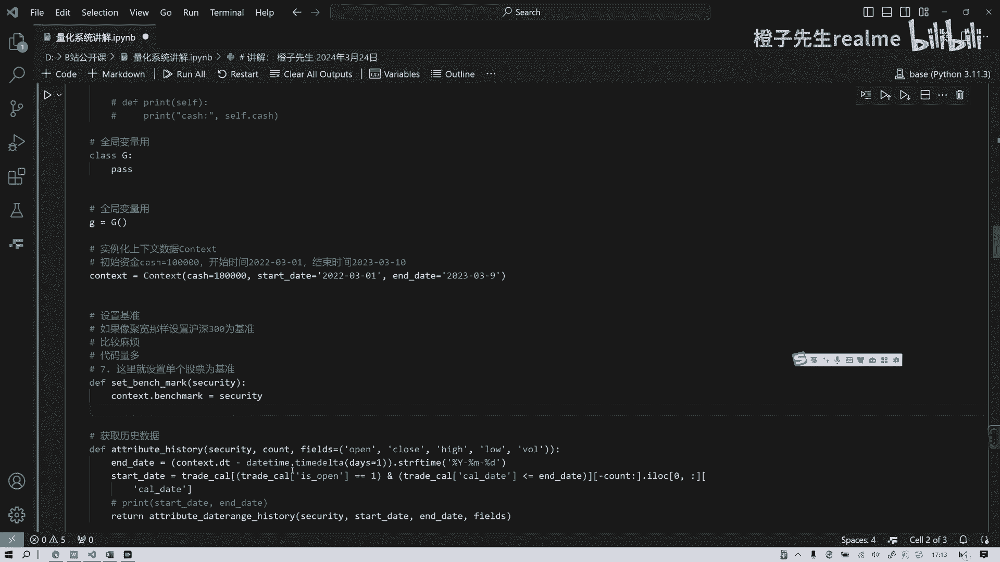

这个数据attribute history，这其实就是仿照嗯，跟区块很像对吧，那网络区块的这个名字一样。

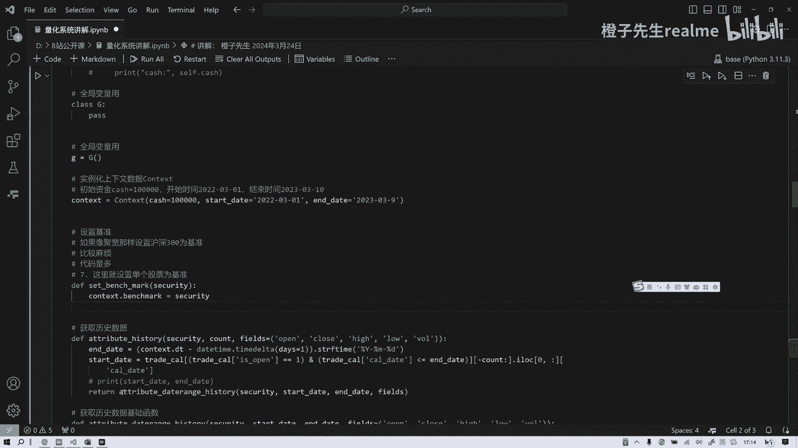

获得历史数据的函数，定义这个函数，这都是为了后面准备的。

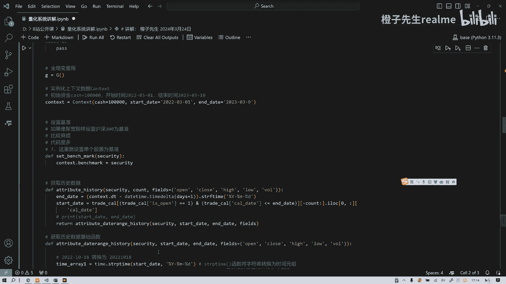

现在可能还不知道用用作干什么对吧，然后获取历史数据基础函数嗯。

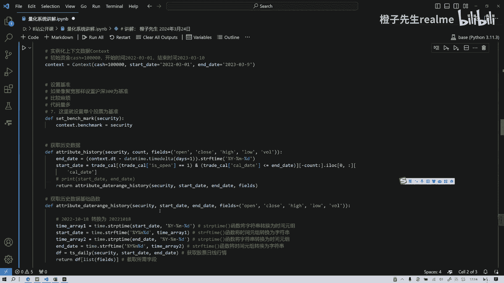

既然是呃这个有四行，我大概解释一下啊，既然是这个函数s e r p time，就是把那个字符串转化为时间元组，然后再把这个时间元素转化为字，实现了字符串，这也是同样的两个作用，就是通过两次处理。

让它能够函数能够识别它究竟是什么，对吧，你要让计算机能读懂它是什么，然后呢，他所有的目的就是为了做这件事情，就是获得他的股票日线行情，然后再对它截取他所需要的字段，就是获取历史数据函数。

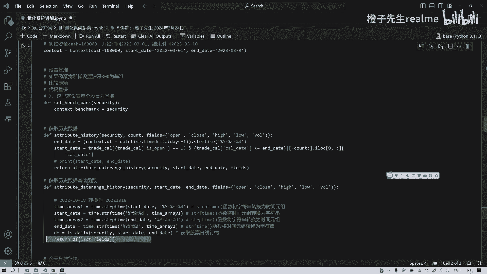

这跟我们上节课讲的就有点像了，那么做一个判断，就是今日行情。

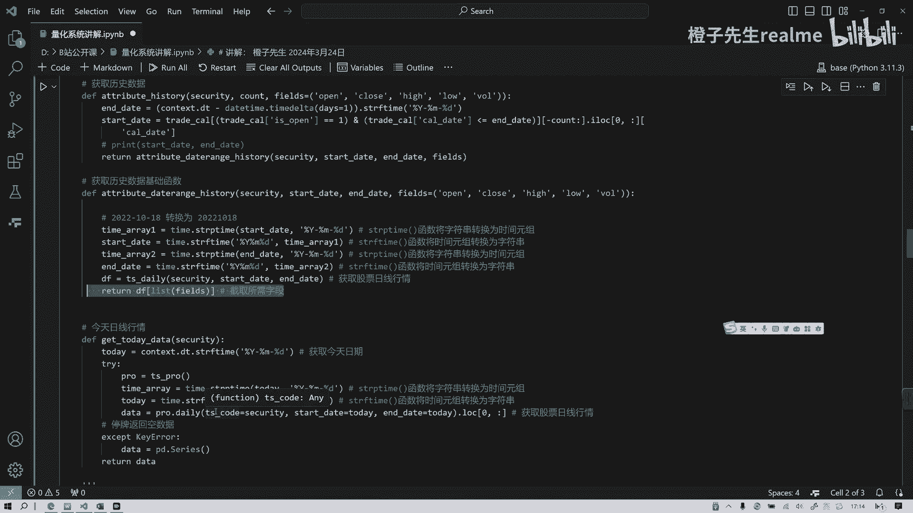

如果今天这个第一行代码是获得今天的日期，或者今天日期来调用API接口，然后在这个这个处理跟他一样的，这是一个标准化处理，我就不讲了啊，对时间标准化处理处理完以后传进去，把参数传进去。

我们就可以获得了这支股票的日线行情对吧，这是try，为什么要try except呢，就是万一今天不不交易呢，万一今天是周末是吧，他这就是错错，那他就会返回这个key error有错误，总而言之。

然后他return data，return data data好。

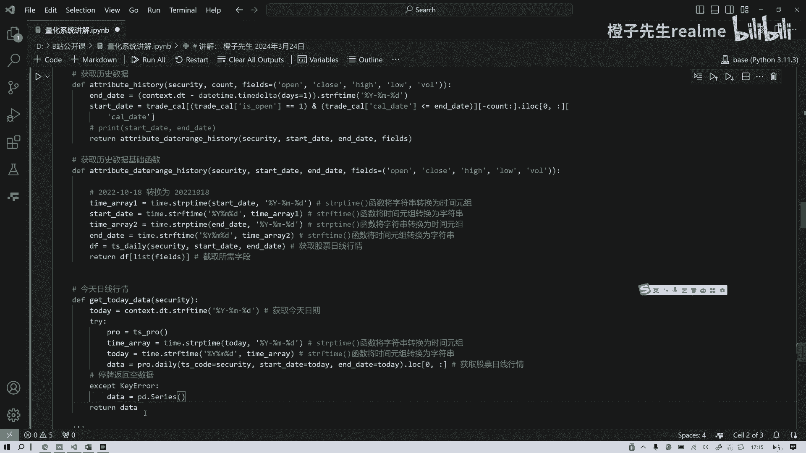

那么第二个模块咱们就讲完了。

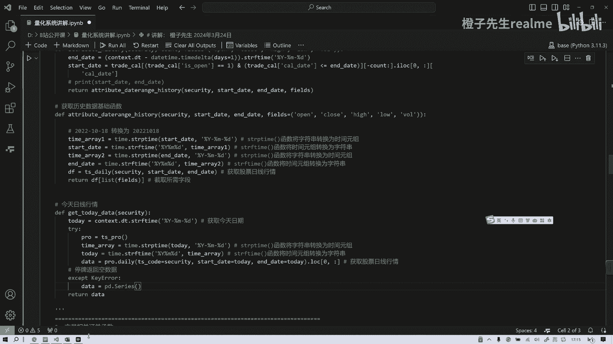

谢谢大家哦，第三啊，第三第一第二第三第三节课吧。