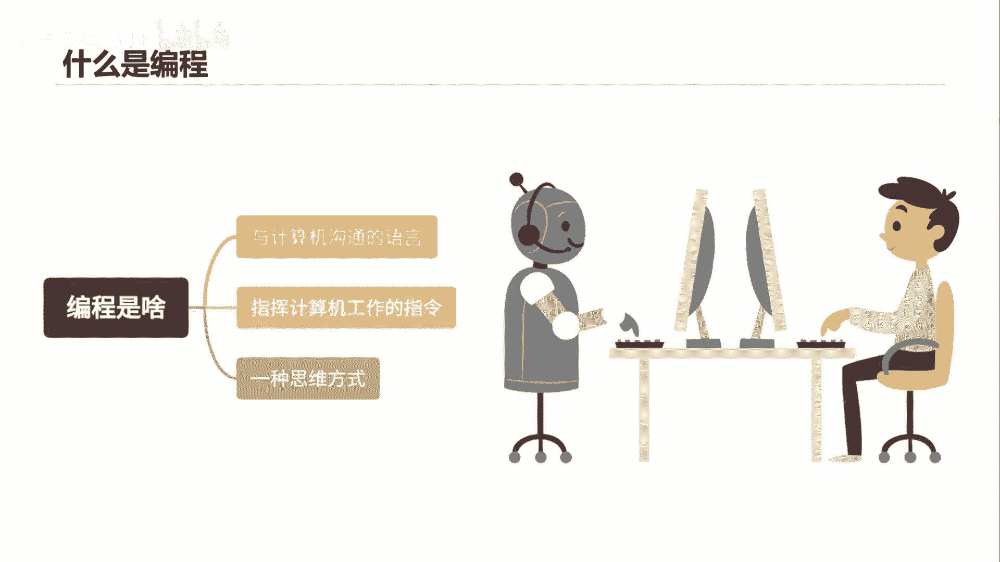
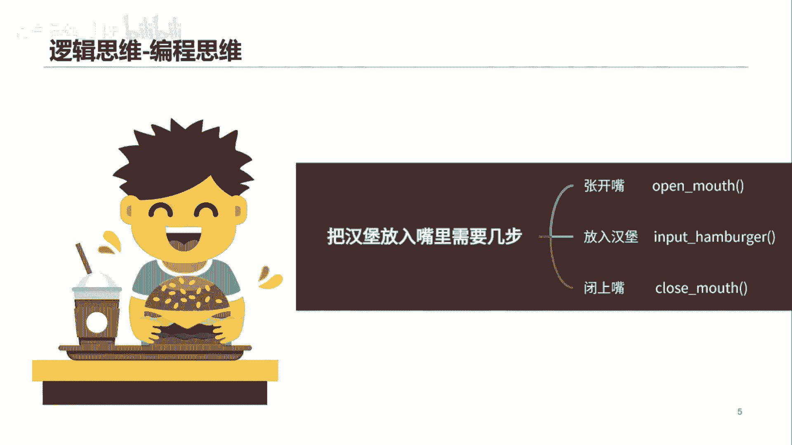
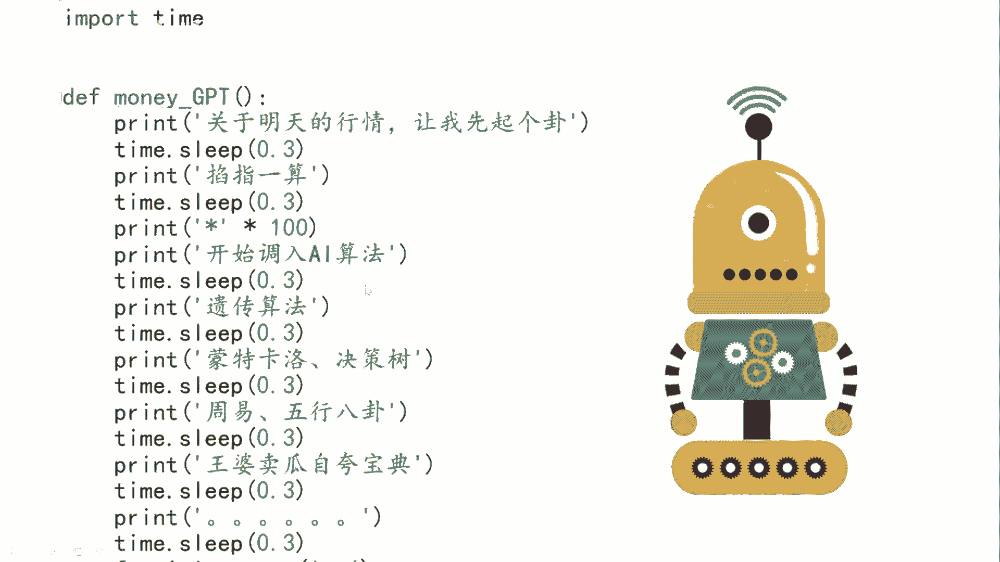
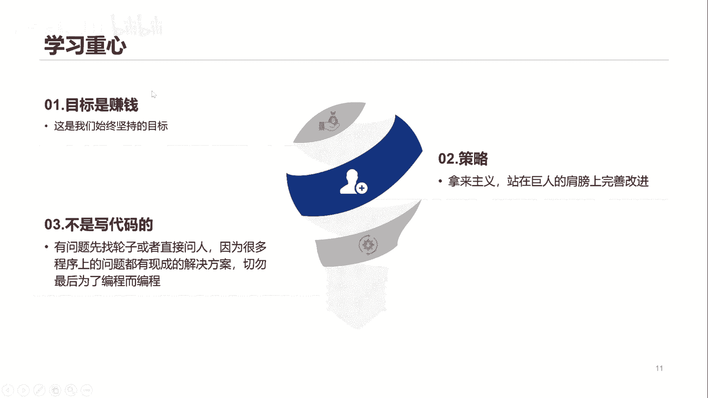

# 从零开始期货量化--天勤：1.0什么是python - P1 - 客户经理_小陈 - BV1kSsNe3E4y

大家好，我是爱搞钱的佟掌柜，这节课呢我们来详细讲解一下什么是Python，首先呢我们来看一看什么是编程。

编程究竟是个啥，其实就是人与计算机与电脑沟通的一种语言，因为人呢咱们是擅长于这种抽象思维，具有这种创造性的思维的能力，而电脑呢它没有这种能力，他其实还是比较笨的，但是电脑的优势呢。

就是说呢它能高效地执行这种重复的命令，不管一个问题有多么的复杂，只要人呢可以把这个问题逐步的拆解出来，就是一步步拆解，跟剥洋葱一样，然后把这件事情呢，然后给电脑讲清楚，它就可以高效地去执行这个命令。

然后不断重复重复的执行，这样他的执行效率是比人高的，所以呢整个编程的过程呢。

其实也是一种思维方式，咱们来呢举一个例子，比如吃汉堡这件事情呢，对于咱们人来讲呢，可能都不用去想，就非常简单的一件事情，但是呢你要交给电脑呢，就要需要把这件事情呢具体进而能分成几步。

那就变成了一个把汉堡放进嘴里，需要几步，第一步呢张开嘴，第二步呢放入汉堡，第三步闭上嘴，通过这种方式呢，电脑才能理解你需要他做什么，进而来如何去做。

Python就是编程语言的一种，那么为什么学Python呢，主要呢基于三个原因，第一个呢是简单，因为它十分贴近自然语言，什么是自然语言呢，就是咱们平时怎么说话，那么它十分贴近咱们的说话的方式。

第二个呢就是好用，因为呢咱们做这个量化交易呢，需要有数据库，金融的数据分析，搭建咱自己的回测系统，同时呢还要进行就是说实盘的交易，这些功能呢通过Python这一种语言，就可以全方位的全面应对。

就基本全解决了，同时第三个最重要的是它的轮子十分多，因为本身Python的用户特别多，那么很多功能性的应用都有了很好的开发，比如pandas和南派是专门进行这个金融工具，金融数据分析的这种工具。

包括南派啊，这些是数学金融工具分析，然后我们呢专注点就在于，只要能够学会如何使用就可以了，咱们呢还是通过预习之前举的案例呢，来直观的感受一下Python的简单好用，咱们逐条来讲解一下。

就是from从这一个地方呢，import导入这么一个功能函数，你看都能看得懂，然后question就是问题，input就是写入，或者说你要写入问题对吧，请输入你的问题，中文咱也可以看得清楚。

print打印也可以当输出，讲输出这种如果说有问题输入，那么就运行这个函数，其他的情况呢就是说要输出或打印出，老板你还没有提问题呢，你看非常符合咱们的直观的，就是说自然语言，咱们来看下面对吧。

我们来看一看那个money i g b t，就是上面的这个函数究竟是个啥，然后呢print仍然是首先输出关于明天的行情，让我先起个卦，然后time点sleep，time是时间，sleep是睡眠，0。

3就是0。3秒，其实这个意思就是说什么，当输出这一行之后呢，等待0。3秒再输入下一行，后面这样以此类推，然后非常的直观明了。

基本上都能看得懂，最后呢我们来看一下，咱们的学习重点应该放在哪里。

那么量化呢其实只是工具，那么最终的目标呢还是通过这种工具呢，能够实现高效的赚钱，这是我们始终坚持的目标，所以我们的重点应该是在策略这一块，而且呢这个交易本身来讲并不是新鲜事情。

很多经典的交易模型或交易策略呢，其实已经是长期有效的，咱们只需要站在巨人的肩膀上呢，结合自己的切身条件进行完善改进即可，那么千万不要陷入最后就是说写代码，因为咱们本身拼的最后还是策略。

而不是说咱们最后变成了，就是说变成了一个coding对吧，有问题呢，咱可以先找轮子，或者说呢去直接问人，因为很多问题本身都已经有现成的方案，所以不要把过多的时间去浪费在编程上面。

而是要放在策略的研发上面，书归正传，讲了这么多，最终咱们的目标还是围绕咱们红色的里面，标注的这块，就说只有赚钱是王道。

感谢大家，希望咱们后面加强交流。

