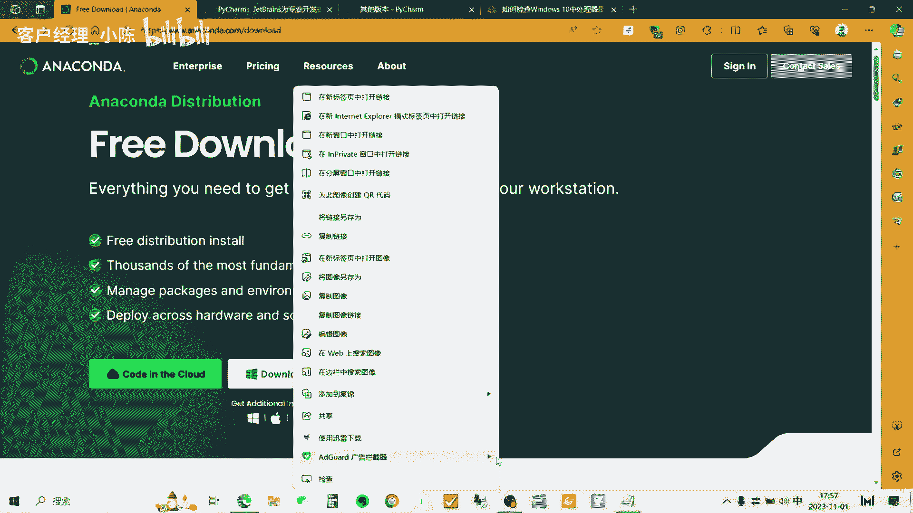
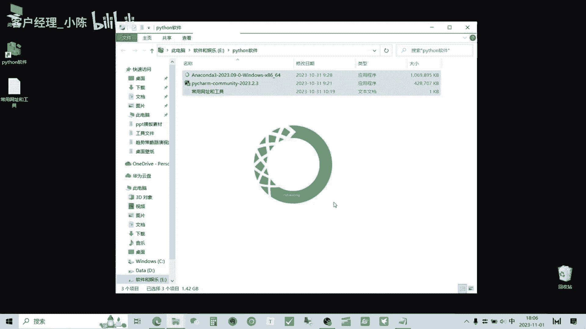
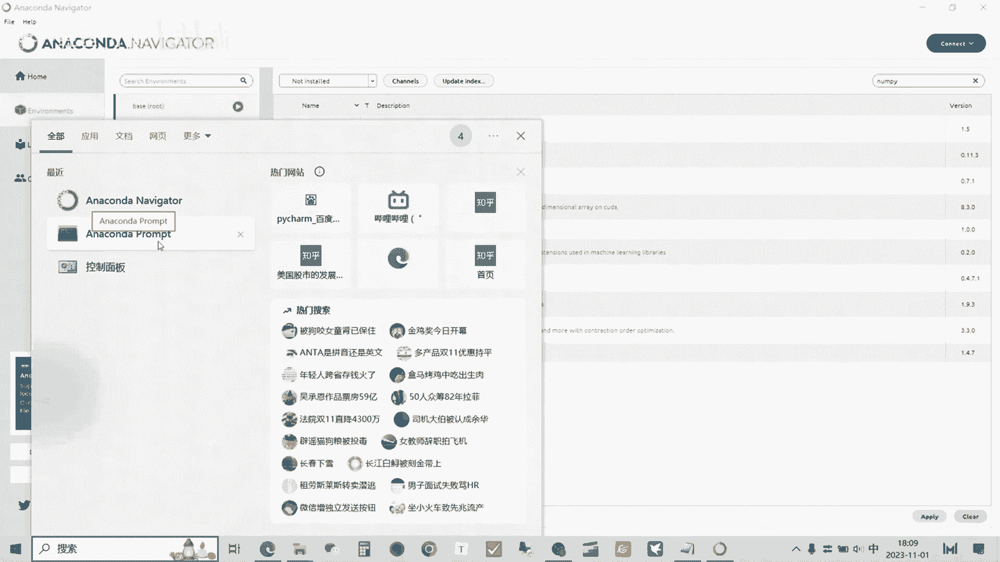
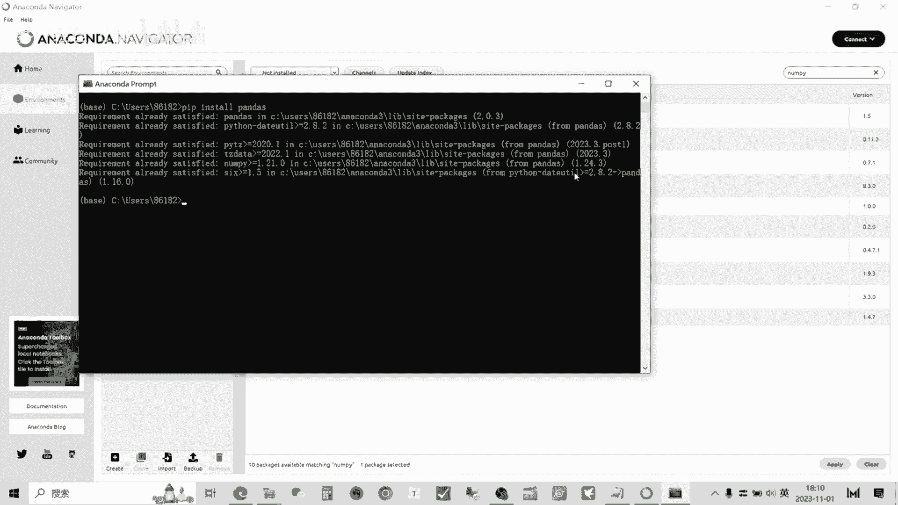
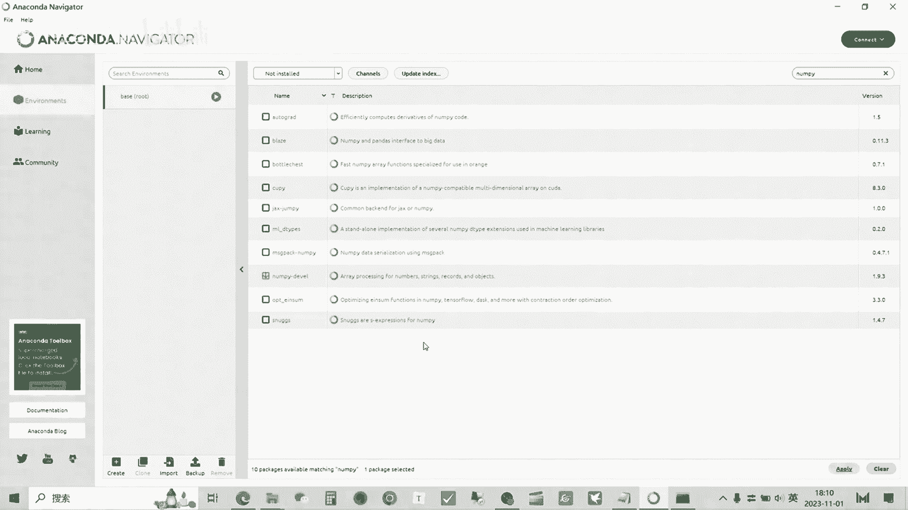

# 从零开始期货量化--天勤：1.1anaconda的安装 - P1 - 客户经理_小陈 - BV1onsNecEUJ

大家好，我是专注于量化搞钱的佟掌柜，这节课呢我们来讲一下anaconda的安装。

以及如何使用它来进行Python编程，我们首先来看一下ANACONA是什么，ANACONA就是一个安装管理Python相关包的软件，其中呢它还自带这个Python啊，JUPITER啊。

spider啊这种相关的工具，那么anaconda呢主要有两个功能，第一个功能就是集成开发环境，什么是开放环境呢，举一个例子，就是说咱们学习看书需要在书房当中，咱们做菜呢需要在厨房当中。

而这个开发环境呢就是说咱们需要编程，用Python进行编程的这么一个嗯工具使，然后呢第二个功能就是管理库的功，能库呢就是我们俗称的造轮子，那么这个库就是咱们就是说以往，因为很多的人已经用了Python。

当面对一些普通具体的问题，就比较普遍的问题的时候，已经有前人给我们开发出了，就是说应用工具，咱们只要拿出来直接用就可以，这样这样就不用重复的去造轮子，或重复的做这种同样的工作，方便咱们提高效率。

反正总体其实就两点，第一个是简单，第二个就是好用。

咱们先通过这个网址呢来下载，安娜康纳这个文档里面的这些内容啊，是咱们将来进行这个Python编程，会经常运用的一些软件以及相关的，就是说一些文档，后面的会以课件附件的形式提供给大家，这里咱就不用记了。

好我们打开安娜康纳的下载界面，可以直接点击download进行下载，然后呢还有一种方式，就是右键通过迅雷的方式进行下载，这样的速度相对会比较快一些。

下载完毕之后呢，我们双击进行安装，第一次安装的时候呢好看打开这个，咱们就next下一步下一步下一步，那么在安装的这个地址，咱们就放到C盘，因为本身啊Python的编程和运行，主要是在C盘进行的。

如果按照其他盘呢，可能在未来咱们的编程过程中呢，会产生一些咱们不可预知的问题，同时呢，那个佟掌柜建议大家把C盘留的稍微大一点，佟掌柜的C盘基本都在200G以上，因为后续后续呢会加入一些库啊。

和随着咱们编程能力不断的提升，它的C盘容量，就是说占用的空间会越来越大，咱们下一步下一步，好的，下载完毕，我们继续下一步，下一步，第一次启动安娜康纳的时间呢也会比较长，所以还是继续的耐心等待。

我们来看一看啊，这个安娜康达navigator，它整个的布局，像现在看到这些呢，就是说它自带的一些软件，主要都是跟未来的这个咱们Python相关的，然后我们主要看这个environments。

点击这里面我们看到这个base RT，那么这里面刚才咱们看到底下进度条，就在进行这些库的索引，后续的来讲，就是说它相当于就是把这些库呢都提前帮咱们，就是说安装好了，咱们只需要专注于编程就可以了。

好他索引完毕，我们可以查一查，我们先看一看，找一找Python，好我们看到了Python，在这里他给咱预装好的是3。1，应该是最新的版本，再看一看咱后面将要学的这个pandas，pandas也装好了。

是2。0的版本，那么这个作用里面install就是说已经安装的，未来呢就是说咱们怎么使用呢，比如说咱们去查找某些库好，这是已经给咱们安好的南派，那么当然呢跟南派相关的，还有一些未安装的，或者打个比方。

就是说咱们要选择其中的哪些库进行补充，就apply就可以点击前面这个小箭头，然后apply他就会给咱们，就是说去进行自动的安装，这是一种方式，还有另外一种方式，咱们先把这个取消先不等。

另一种方式就是点开这个ancona prompt。

咱们还是以这个pandas举例，然后呢如果没有装pandas这个库呢，咱们是这样安装pip install，Pandas，回车，因为这个库咱们已经安装过了，所以说它显示就是说已经安装好了。

然后如果没安装的话，它会自动的就是说呢进行下载和安装，当然咱们以后用到的一些库呢，就是说嗯有很多就可以给到你，就是这样的代码，你直接复制粘贴就行了，有很多的库呢也可以通过国内镜像的方式。

这样呢安装速度比较快，好这节课呢咱们再做一个简单的总结。

就是说anaconda，它的作用其实就是帮助咱们进行这个管理，这些库搭载相应的Python的编辑环境，方便咱们的未来进行Python编辑的时候呢，给咱们提供效率，基本上这节课的内容就到此为止。

感谢大家，量化交易呢本身是一门综合性，实战性比较强的这么一门手艺，在学习的过程中呢，它是呈现一种螺旋上升的状态，所以会经常遇到问题，欢迎各位老板呢与我交流，任何关于量化交易的问题呢都可以。

咱们进行相互的探讨和学习，千万不要不好意思，也提前预祝大家通过自己的努力。

