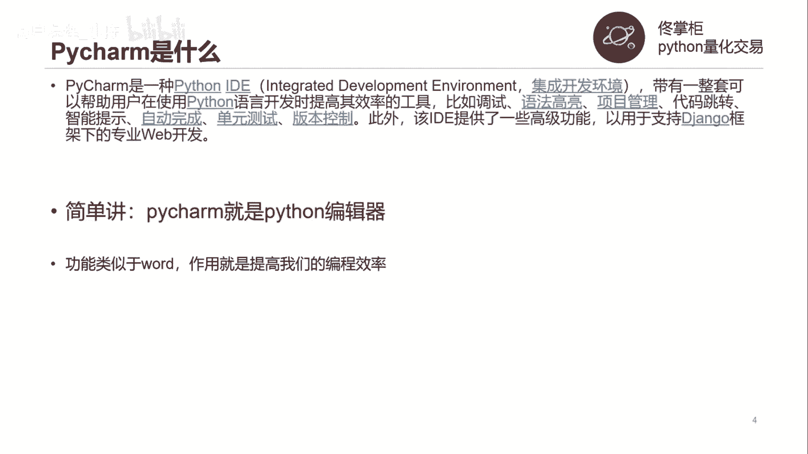
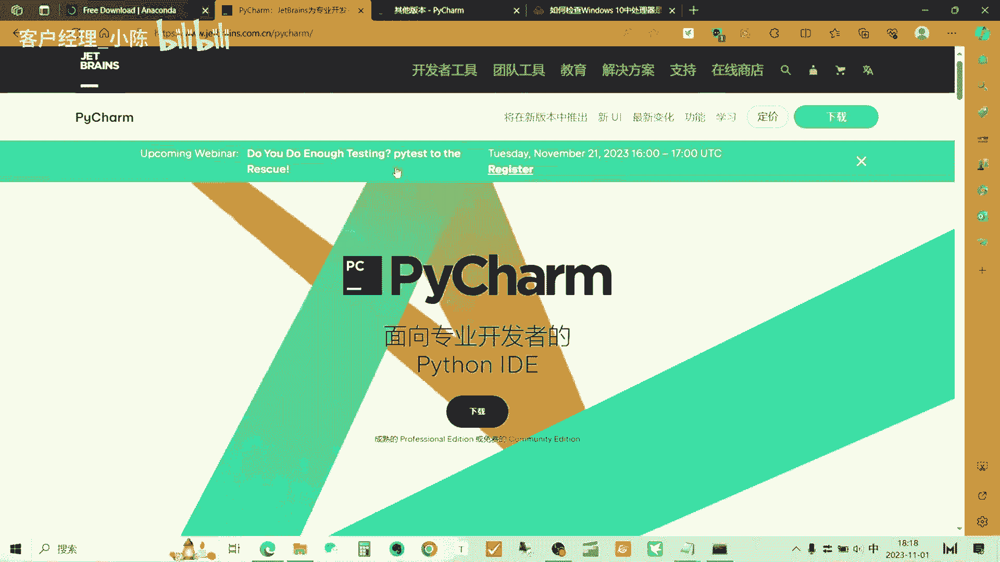
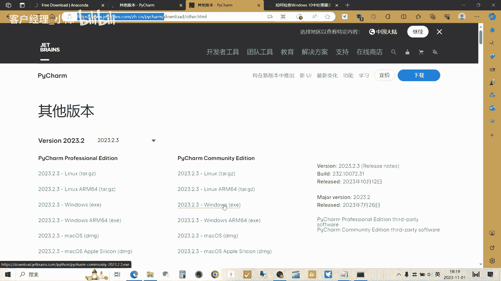
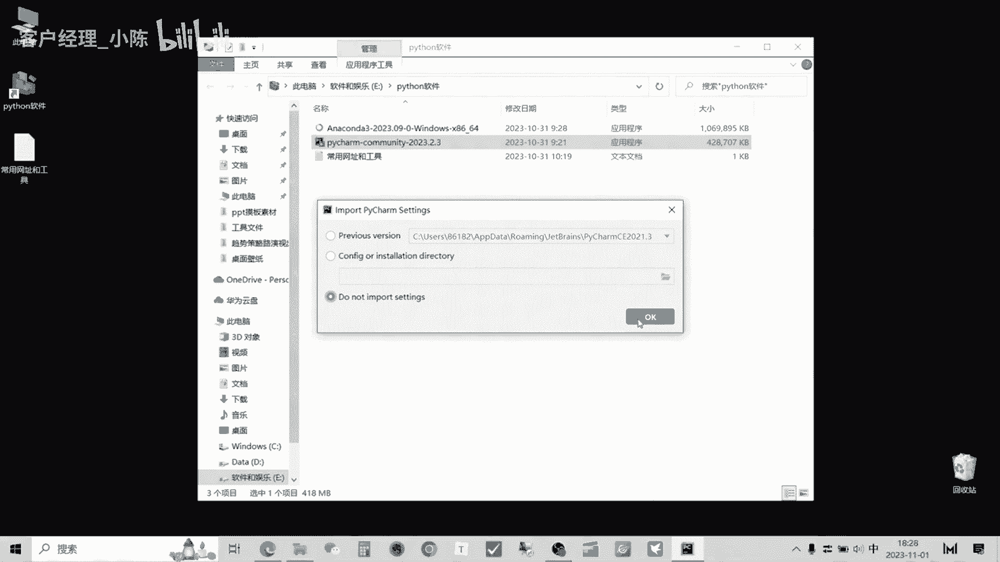
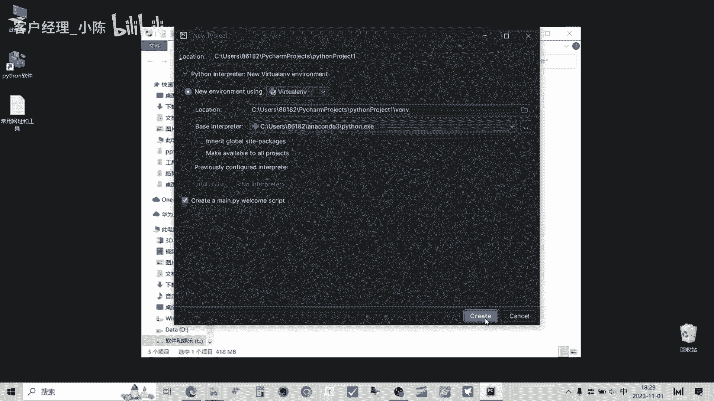
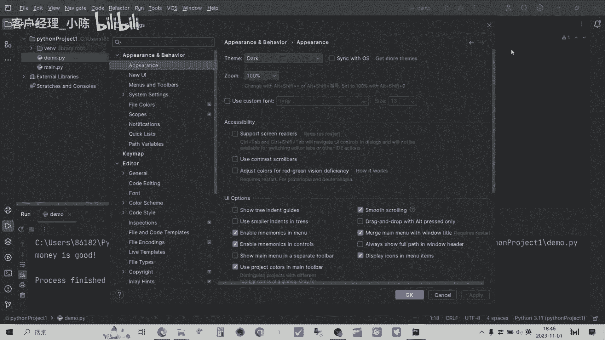
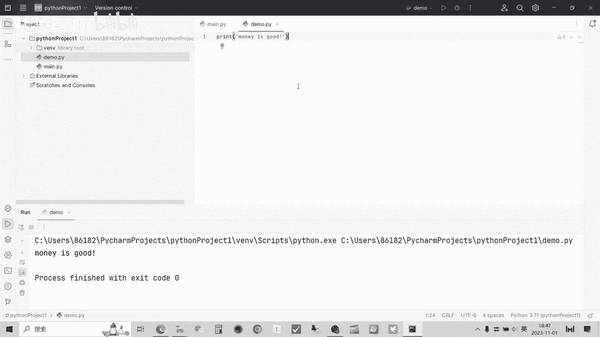

# 从零开始期货量化--天勤：1.2pycharm安装 - P1 - 客户经理_小陈 - BV1ZEsNeaECF

大家好，我是专注于量化搞钱的佟掌柜，咱们的课程就是教会大家如何从0~1，搭建期货量化交易系统，通过对于Python的学习，pandas工具的掌握以及逐行代码的讲解，每个人都可以轻松搭建自己的数据库。

进行策略回测，进而进行自动化交易，让每一个量化小白呢，最终都可以成为一个成熟的交易者，本节课我们来详细的讲解一下，如何安装PYTHM。

PYCHARM是什么，PYCHARM就是一种Python的集成开发环境，简单的讲，PYTHM就是Python编辑器，功能类似于word作用。

就是提高我们的编程效率，通过这个网址呢，我们首先进行PYTHM的下载，好这是py charm下载的中文网站。

我们来点击下载，他给咱们展示的这个是这个专业版本，专业版本的试用是30天，后面的话呢需要付费，咱们可以点其他的版本，好也就是这样给咱们提供的这个网址，就直接就到了这个界面，然后我们来看一下啊。

咱们主要下哪个windows版本呢，咱们基本上就下windows这个就可以了，那么好，有的小伙伴会问，下面的这个a arm64是怎么样的，我们可以看一看，因为咱们的CPU啊就是说有基本上有几种形式。

然后咱们最简单的方式就是右键电脑，然后咱可以看一看，如果是64位操作系统，就是差64，有的呢上面显示就是基于arm的处理器，所以基本上大部分的这个小伙伴们呢，咱们都用这个windows下载这个就可以了。

佟掌柜这边已经提前下好了，然后我们进行安装，下一步，然后这个安装呢咱们下载的是这个家庭版本，然后放在呢就是说就默认咱们就放在C盘，因为未来的编辑主要也是在C盘，跟安娜康纳的安装呢基本差不多。

建议啊还是安在C盘，因为按到其他的盘的话呢，有时候在咱们就是说编程的过程中，可能会发生一些其他意想不到的一些错误，好继续下一步，下一步下一步就可以了，第一次安装呢它的时间呢可能稍微长一点。

咱们耐心的等待，好现在安装完毕，我们来运行一下，首次启动呢会进入这个界面，咱们点击最后，这个也就是说呢不不去导入相应的配置，咱们自己配置一下。

点击OK，会弹出这个界面，咱们主要用的就是说第一个是new project，就是新的项目或者已有的项目呢进行open，咱们点击new project，创建一个新的项目，好，当进入这个界面的时候呢。

咱们首先要进行的就是说环境的配置，咱们上节课进行的anaconda的安装呢，就是为这节课就这一部分来做准备的，那么如何配置呢，我们点击这个三个小点点，点开它之后呢。

就是说按照上一节课咱们安娜康纳的安装呢，就是说可以点击小房子，然后自动的就会到这个就是呃文件夹，咱们往下找，找到ANNA康纳three，点击Python，点EXE，就完成了咱们这个后续编程的这个呃。

虚拟环境的安装，咱们创建一下。

好现在他就是在创建虚拟环境，后续咱们编程都是在这样的环境下进行的，好我们来看一下，就是说ph charm大概的结构，左边呢就是相当于咱们的这个任务管理器，然后呢他会对项目进行一个管理。

采取的是树形的结构，然后现在的这个main main点PY，它就是一个，就是说咱们进行编辑的这么一个文档，然后这里面是一个例子，咱们来看一看啊，它是一个简单的Python的这种脚本，然后我们来看一看嗯。

按F10和shift，好程序就运行了，咱们简单来看一下，就是说它运行出来就是hi拍唱，其实这就是一一条咱们输出的结果，打印的结果，那么第三个咱们先简单看一下这条语句，代表，就是说它整个的就是这个运行的。

程序的运行完毕，而上面的第一条呢，其实咱们不用管它，它就说咱们的这个嗯这个脚本它运行的地址，我们来进行下面的这一点介绍，咱们看看show all，就第一次咱们运行PYTHM的时候呢。

他会对这个咱们已经安装的库呢进行这种index，也就是检索，那在这里呢提醒各位老板一下，就说像360这一类的软件呢，当就是说它会清理缓存，所以说呢每次就是说重新启动这个，PYCHARM的时候呢。

他有可能要每次重复的读取，而其他的呢就是就不会产生这样的一个问题，所以大家呢还是建议大家用，可以用其他的软件来替代一下，了解了整体的基本结构之后呢，我们创建一个PY文件，咱们直观的感受一下。

可以在这个Python project里面new，然后呢Python file点击这个，然后第一个咱们就是创建一个demo演示文档，好在上面就出现了，咱们简单的做一个输出吧，print小括号。

它自动帮你补齐，那么这就是拍charm的好处，它相当于其实就跟咱们写文章时的，word的作用是一样的，就说提高咱们自己的效率好，点击这个小引号，咱们输入money is good。

我们来运行一下这个程序好，他现在目前还在索引阶段，当一会索引完之后呢，这会就就会出现run的这么一个命令，我们稍微等一下，好的这个拍up我们索引完毕之后呢，我们可以看到点击右键之后。

就有一个run的这么一个额选项，这就是运行可以运行咱们刚才进入的程序，我们点击一下，我们可以把这个结果放大来看啊，它打印出来money is good，print呢是咱们这个Python的核心函数。

它就相当于是打印或者输出，然后小括号内呢就是咱们输出的内容，那么这个引号中间的就是一串引一行字符串，也就是说所见即所得，你输入什么呢，它就会给你输出什么，大概是这样，我们现在来看一下咱们的这个拍。

charm的基本功能，我们可以点击这里，然后呢看看setting这里的搜索就可以搜索，我们想要的就是嗯想要的一些选项，我们看看，先看看最基本的吧，比如说我们看一看后面的布局，现在目前是黑黑的。

酷酷的这种布局，那么后面的佟掌柜比较喜欢这种亮色的布局，后面咱们编程可能也会以亮色为主啊，这可以就可以换到布局了，基本上啊PYTHM呢，它的功能就跟刚才咱们介绍一样，它跟word是非常一样的。

然后呢它主要的功能其实word是编辑文字，而PYTHM主要就是进行咱们编程的，这么一个管理工具，而且呢就是说拍charm呢，它的更新迭代的速度比较快，但同时呢咱们做这种量化交易的。

对于这种金融方面来讲的这个量化来讲，其实稳定是最为重要的，咱们不必每次都追寻，就是说追求最新的版本，只要能代码能跑，能解决咱实际问题就可以了，好这节课基本的内容呢就到此为止。

感谢大家，量化交易呢本身是一门综合性，实战性比较强的这么一门手艺，在学习的过程中呢，它是呈现一种螺旋上升的状态，所以会经常遇到问题，欢迎各位老板呢与我交流，任何关于量化交易的问题呢都可以。

咱们进行相互的探讨和学习，千万不要不好意思，也提前预祝大家通过自己的努力。

