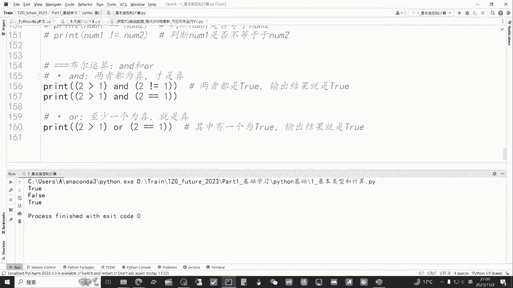

# 从零开始期货量化--天勤：2.1python基本类型和基础运算-通稿 - P1 - 客户经理_小陈 - BV1n5sNeKE3V

大家好，我是专注于量化搞钱的佟掌柜，这章节呢我们重点学习一下Python的基础好，这一课呢我们来学习下基本的类型和基础运算。

咱们课程中所涉及到的所有代码，都会放到佟掌柜future2023这个文件夹当中，其中包括基础学习和实战案例，那么这一章节，我们主要学习这个基础学习中的Python基础，如何打开这个文件夹。

我们可以通通过拍charm file，然后点击open，然后点开，然后这个佟掌柜future2023这个文件夹即可好，我们正式开始这节课的学习，我们呢还是首先点开这个Python的基础前言。

在这里呢佟掌柜呢把Python的中文文档分享给大家，我们打开看一眼，这里面呢有这个Python整体的介绍，包括他比较贴心的课前填检解释器，以及Python的应用和举例。

它是非常有对咱们的学习是非常嗯非常有助的，所以说呢佟掌柜的建议就是说还是以战代练，在实战中呢要多查文档，多思考，咱们打好基础之后呢，才能够灵活地使用，然后呢多思考，多查文档，多去尝试。

因为咱们用这个软件或者用拍charm的，这个好处就在于什么，咱不怕犯错误，不断的尝试，不断的运行程序，不断的调试，然后呢有思考，有针对性的多问人，然后上来其实并不追求完美，先把程序写好。

然后不断的改进完善好，咱们进正式进入这节课的就是主要内容，就是基本类型和计算，我们来看一看，我们来首先看一下Python的注释是什么，注释呢就是说Python中不会运行的文字。

那么它的作用其实就是对于咱们代码进行解释，或者进行一种备注的方式，然后呢在每一行的开头加上一个井字，那么就是对于该行进行单行的注释，还有一种方式就是说在行末进行注释，然后就是对这行代码进行注释。

好我们来看一看啊，然后咱们先用快捷键，快捷键就是CTRL加这个斜杠，咱们把这行注释去掉，看看是如何的，然后颜色大家伙发现它变了，然后这个时候呢就是由原来的注释，像这一这一行它就变成一行代码。

但后面的还没变，然后我们运行一下，引用华尔街的一句名言，grade is good对吧，那么这行代码就是说，把这个这行字符串打印了出来，大伙看的比较清晰，那好我们现在把它注释掉，CTRL加斜杠。

这个时候如果再运行的话，什么都没有，也就是说Python对于注释来讲，它是不运行的，我们来看一下如何同时取消多行注释，或同时呢把多行一起注释好，我们通过这三行代码把它选中。

然后还是点击快捷键CTRL加斜杠，就一并把他们的注释取消了，我们还是运行一下好，整体都运行出来了，如果要多行注释呢，一样就说把这三行选中，然后CTRL加斜杠就实现了多行注释。

那么注释咱通过这个方式的演练呢，大伙就非常清楚了，它主要的作用就是作为一个，就是说文字的标记或者代码的标记与解释，一个是在行头，一个是在行尾，还有一个注释是这种方式，打入三个应该是六个冒号，上面三个。

下面三个，这种注释就是上面给大伙演示的是这样，从这里到这里，一般这种注释呢就基本是放在整个程序的，就是开头，那么里面可以打任何东西，比如说同佟掌柜是吧，巴拉巴拉巴拉巴拉，你可以打一篇小说都没有问题。

然后在这里面呢，主要就是说对整个这个开篇的这个解释，也可以作为咱们日常有时编辑这个嗯，相应的代码的时候呢，作为一个整体的一个思路的解释都可以，而且它可以把它缩小起来，并不影响后面所有的变化。

进行注释呢我们还要注意一下格式，比如说在行尾注释的过程中呢，一般呢这个井号和代码之间的是两个空格，然后呢井号和后面咱们写的文档的这个注释，文字之间呢是一个空格，那么它的作用的好处。

就是说让代码整体来讲呢更加的简洁和美观，方便咱们之后的管理，如果说咱们只是一个空格，那么拍charm呢有比较贴心的这么一个设定，咱们可以看见有一个比较小的波浪线，这种浅浅的波浪线。

那它不会对代码的运行产生影响，只是提示咱们就是说要注意相应的格式即可，下面呢咱们进行这个print函数的介绍，它相当于是Python中比较重要的这么一个输出工具，我们来看一看它的作用是什么。

好我们可以先运行一下这个代码，那print空的小括号，哦下面我没有注释掉，我先把它注释掉，这个一并删除，再次运行啊，什么都没有，它其实呢就是说输出了一个空行，也并不是什么都没有，咱们把它注释一下。

把这个咱们可以定在这里，现在呢基本是两行，我们再运行一下哦，就没有了，所以呢他就是输出一个空行，然后我们运行一下这个程序好，PYTHM很贴心的给你出现了红色，为什么呢。

因为他这个咱们用的是中文的这个括号，咱们记住就是说所有代码建议都是用英文的，可能注释上面咱们用中文，这样的话呢，如果说在代码上用中文的话呢，它里面是不识别的，会报错，咱们仍然运行一下，哎。

很清晰的看到他就报错了，告诉你这边有一个这个典型的，这算是嗯编程的代码错误，我们看看啊，这行代码咱们运行一下，我们在括号里面打了一个一，那么他就会输出一个一，那输出一二呢，那么就是打一个一逗号。

又到了格式规范的时间，就中间一般呢我们平时就是说中间有一个空格，没有空格，是这样，他仍然会有一个小的波浪线，习惯性的就是加一个空格，我们看看输出是什么，是一二，这行代码输出的是123。

理论上呢它是无限的输出元素，就你给他什么，他就输出什么，用逗号来进行间隔啊，这个用红色波浪线了，我要把它改成英文的，如果要输出这个嗯字符串呢，一定要加入这个冒号，比如说佟掌柜很帅，咱们来看一看。

好它输出出来了，这就是print主要的作用，对print函数呢有一个基本的理解之后呢，我们看一看这个代码的执行的顺序是怎么样的，我们把这三个一并解释掉好，我们运行一下，看一看好，他输出的是刘备，关羽。

张飞啊，刘关桑三哥仨，那么我们调换一下他的顺序，比如说把关羽排到老大，我们运行一下好，这个时候就是关羽排在第一个，就变成了关刘璋了，这代表它的输出的顺序是什么，就是说是逐行的运行，相应代码先运行47行。

48行，然后呢49行，50行是按照这样的顺序一步步去运行下的，然后呢各位小伙伴拿到代码之后呢，也可以自己调整一下顺序，直观的去感受一下，接下来我们看一看代码中的换行，换行是什么意思。

就是空行是没有含义的，它不会有任何输出，就像刚才这样对吧，咱们细心的小伙伴一定会看到了，佟掌柜在这边留了一行，但是输出呢他中间是关羽，刘备，张飞，中间并没有空行，那么它的空行的意义在什么呢。

空行的意义就是为了我们方便的，就是说后面的代码进行排版，就更加的美观，对吧，通过空行我们可以看到啊，一小节一小节我们就说讲完这个知识点，下一个知识点就方便我们就是美观的进行排版。

好咱们把关二哥返回到他的位置，把这三行注释掉，我们看一看啊，就是说他的空行用这个来尝试着运行一下，一二是紧挨着，没有问题，空行呢就直接跳过了，那么这样的空行呢他是没有问题的，咱们来试一试。

这个代码底下出波浪线了，就证明这里面有语法的错误，就说print一定要中间他们是要断开的，这样连着编写是不行的，在Python当中一定要是这样点回车对吧，一行一行的去输出，这样是没有问题的。

所以呢各位老板就会清晰的看到这个空行，主要就是为了结合注释进行排版的美观，让更加的清晰，我们来看一看代码中的空格是什么，它有的空格会产生报错，有的空格不会产生报错，我们来运行一下，又出现了这根小红杠。

嗯再次报错，因为那print必须要连到一起，他才是一个命令，变成了蓝色，如果打开了，它就本身就不是一个命令结构发生改变，所以必然报错，那我们看一看，在这里面就是说在字符串之前有空格，会有没有问题。

哦没有问题，仍然输出了佟掌柜，他只是形式和这个排版不美观而已，然后接下来我们看一看Python的主要类型，我们先看数字类型，数字类型的主要分为两种，一个是int，一个是float。

int其实就是整数类型，而float就是浮点，也就是我们时常说的小数，我们来看一看，比如说future number，就是说咱们的期货有多少数量，主联吗，主联数据呢现在目前有79个。

包括咱们的这个股指期货，我们来打印一看，看一看好，那么print future number79输入了，然后class我们可以看到type type，就是说呢会对这个数据呢进行，就是呃就看它是什么类型。

它的主要功能就是看数据的类型，然后呢，我们把这个变量放到type这个小括号当中呢，它输出的就是int类型，咱们看完整数类型之后呢，我们看一看小数类型，也就是float，我们用铁矿石来举例。

铁矿石的这个代表就是I，然后呢i price，然后呢咱们看是926块五，然后我们把它输就是打印出来，看一看好926。5，它的类型是float，也就是小数类型，我们再结合上面我们来同时把它输出啊。

比较清晰，79，然后没有小数点，这是整数类型，然后呢这一个是他的这个小数类型，我们再来看一看啊，就是说float的，就是说输出的方式是我们先把这个注释掉，比如说铁矿石涨了2。56%。

那么我可以直接写0256，就是这个点前面这零可以省略，那么小数点这些前的零可以省略，就是说这种形式和0。0256它是一样的，我们来输出看一看，它自动的给你补齐了，也是float类型，那如果说是负数呢。

跌了呢，同样只要在数字之前加一个负，加一个斜杠，就加一个减号就可以了，我们输出看一下，好没有问题，好接下来我们看一看啊，这个string就是字符串string类型。

那么字符串的定义就是说可以以这个单引号，双引号和单引号进行开始，然后同样已结束，我们来运行一下，先把这两行注释掉，Future name，也就是说期货的名称2B2401，就相当于螺纹钢。

RB是螺纹钢的这个嗯缩写字母，就是说在期货中的代表，2401呢是合约的期限，我们看看啊，这个RB2401它是绿色的，是在这个两个单引号之间的这么一串，这就叫字符串，我们来输出看一看，哦上面忘注释了。

我先把上面先注释掉，我们重新再运行一下，好我们看到了，就是说引号没有输出，只是输出引号中的内容，这一串就是字符串，简单说就是所见即所得，你在这个引号中间不论打什么，比如说咱们再打其他的英文的。

就是你打入什么，它输出的是什么，那所有的他的这个就是type，咱们type出这种数据的类型，他就是string，就是字符串的类型，我们再看一看下一行symbol name，那么我们来定义的是螺纹钢。

然后就是品种的名称，我们来看一下，同时输出好仍然是所见即所得，输出的是螺纹钢，那这里面呢各位老板的细心老板可以发现，那么双引号和单引号有什么区别，其实在Python语言中呢，双引号和单引号是没什么区别。

只是在C语言的过程中有一些区别，这两个string包括int和float这几个类型对吧，那么聪明的这个小伙伴肯定会有一个问题，就说为什么这个Python要分这么多类型，那么实际上来讲呢。

就是说计算机语言就是为了处理问题，提高效率，那么如何提高整体的效率，当很多的问题就是形成了普遍性之后呢，只有制定统一的规则，这样的话呢才能实现，就是说整体的高效协作，就说规则都是一样的。

大伙都是在同样的一个规则下形式进行编程，沟通和交流就能实现，就是说整个社会或者整个编程的界的这种统一，能够整体上面提高效率，好我们接下来再看一看这个，布尔值是什么，布尔值只有两个，一个是true。

一个是false，就说真或假，或也就是咱经常说的对与错，那这里呢那个布尔值呢，这个false和true咱们一定要注意，就是说第一个字母一定要大写，如果小写的话，它会报错，它会报错啊，好咱们恢复成大写。

咱们打印出来看一看它究竟是什么，哦是布尔值，那么布尔值的作用呢，就是说就是为后面的逻辑记，就是逻辑运算，或者说一些条件判断做准备的，那么它输出就是真或假，那接下来呢我们看看空值是什么。

空值只有一个就是none，然后仍然是大小写敏感，none就代表没有值，我们运行一下哦，None type，它就一个值就没有值，那么各位老板呢一定非常轻易的发现，像none true false这些。

它呢上面这个颜色，因为现在咱们这个嗯这样的就是风格呢，它可能显示的不太清楚，那么它的颜色就相当于是深蓝色，咱们把它注释打开，对吧，这几个值就说这几个写法在Python里面呢属于。

接下来我们再来看一看变量究竟是什么，其实上面像future name，symbol name这些都是变量，我们来看一下，那么后面的RB2401以及这个螺纹钢，都是对他这个变量进行的赋值。

那么变量的意义何在，我们通过一个简单的例子来看一看，我们打开这个构建商品数据的这么一个嗯，一个文件我们可以非常清晰的看到啊，比如说symbol name在里面一共有14个，这种黄色标注的都是。

那么这个蓝色上面写的是应该就是14个，11个，咱们可以看看上面都是，那么通过变量我们把变量带入到程序当中，如果未来我们需要去修改，比如说这次我们用螺纹钢，下次可能是铁矿石，那么我们只需要给变量。

在最开始进行赋值就可以了，就像这样，而不需要对程序的每一次进行修改，这样是大大简化咱们的操作，而且呢相对来讲，对未来的代码管理也是十分高效的，我们再回到这里，看到了刚才举例子之后呢。

想必各位老板对变量有一个，比较初步和清晰的认识，那么变量定义的原则就要简明扼要，方便识别，比如说大伙看这个，比如说future name，Future，在期货里面它的翻译就是期货对吧，期货名称简单明了。

也非常直接，那规则呢是什么呢，规则就是说它变量可以以字母来开头，比如说A，等于比如说一这没有问题，或者B等于二，也可以也可以这个下划线来开头，等于三，这是没问题的，但是数字开头应该是不可以。

比如说2A等于C或等于四，我们看它底下会出现红色的波浪线，代表这样的命名，这样的变量开头就说它是不可以的，所以它的规范呢就是以数以这个字母，或者以这个下划线进行开头，进行变量的编辑，好的。

接下来我们来看一看啊，Python的计算是怎么实现的，我们来举几个例子，比如说现在有79种的期货品种，然后呢新天五个期货品种，那么最后计算应该就是79+5=84，我们用代码实现一下。

就是所有的期货品种等于以前的期货品种，加上新增的期货品种，我们输出看看是不是等于八十四啊，没有问题，这就实现了就是Python基本的加法，我们来看看如何取余数，取余数的就是说符号呢用这种百分号。

那7÷3应该是余一，这好没有问题，乘方呢乘方的方式是两个乘号对吧，二的十次方应该是1024，看看佟掌柜的计算能力哦，果真是1024，那比如说我们提问，假设每天获取1%的收益，那365天之后呢。

总收益会多少，就在print里面可以打出，就是1÷100，就是1%加上一，然后他的就是1。01的365次的乘方，我们来看一看，是37倍，效果还是比较惊人的，这就是复利的魅力，通过这个我们可以直观的看出。

当然Python中呢还有一些简便的写法，我们通过这个例子来简单看一下，首先呢期货品种future number是79，然后如果说要加新的品种呢，加一个品种，它相当于是future number。

加等于一，它的效果等于就是说future number加上future，就等于future number加七，就在原有的基础之上再加加一，我们看看输出结果是不是等于80+7，也可以。

咱们看看是不是等于86，好，没有问题，OK然后呢它其中的这个运算呢还可以实现什么，就是整数和这个float类型是可以相加的，我们来看一下，哦把上面我还是要注释掉，咱们看看66+8。8，74。8。

我们看看下一行代码，七乘以刘关张这个是什么，就说哎等于是int类型乘以这个string，最后能产生什么样的效果哦，它发生了化学反应，就刘关张复制了七次，连接到刘关张，刘关张的刘关张一共七次。

我们看一看啊，如果是加法效果是如何的好，这里面就报错了，它的意思就是说什么呢，就是说int类型和这个string类型，它不能用这种加法的逻辑进行整合，接下来我们来看一看啊，逻辑运算。

我们先看一看比较运算，我们整体的把它好，取消注释，然后呢我们可以看简单的，咱们运行一下，咱们先简单看下代码吧，首先number1等于一，number2等于二，那么一大于二，那肯定这是错的对吧。

应该是false，一大于等于二，就是number1大于等于二，这也是不对的对吧，应该也是false，number1等于等于二，一肯定是不等于二的，所以这应该也是false。

然后呢number1这个一个叹号等于号，这是就是是否不等于二，它代表的是否不等于二，那他肯定是真的，就是不等于我们来运行一下，看一看好，咱们再看一看，第一个就是一大于二肯定是错的false。

然后呢一大于等于二也是不对的，是假的，一等于二，两个等号就代表它等于是否等于二，对这个事件进行判断，那肯定也是不对的，然后呢叹号加这个，就是说对于它不等于这个事情是否是对的，那肯定一不等于二。

所以最后一个是对的，那么像比较运算，还有后面的布尔运算，后面咱们在做策略的时候进行条件判断，也就是说是否是产生这个交易信号的时候，他用的相对会比较多，我们把它注释掉，看看布尔运算。

仍然是咱们先直接先运行一下吧，咱先简单介绍一下，就是and and是什么意思，当两者都为真的时候，那么才是真or呢，就是说一个为真，他整个输出的就是真，我们来把这三行代码都输出来。

直接看一看好第一个呢他是真的，第他是什么呢，就是说第一个就是二大于一，首先这个括号就是一个条件，那么它是真，然后二不等于一，那么这个条件也是真，两个真合到一起，就真真为真，就是出第二个是什么，二大于一。

这肯定是真的，二等于一，这件事情它是一个false，也就是真和甲它组合起来呢，这就是false是假的，然后下面就是说二大于一，这是一个真的条件，二等于一，这是一个假的条件，但是他用的是all。

就这种逻辑的运算，那么只要有一个为真，那么就是真，那输出的就是TRU。

好的至此，本节课的内容呢就讲解完毕，通过本节课的学习呢，相信各位老板对于Python的基础以及他的基础运算，都有一个直观的了解，遇到问题呢，欢迎大家直接联系我，咱们呢一起探讨。

共同进步。