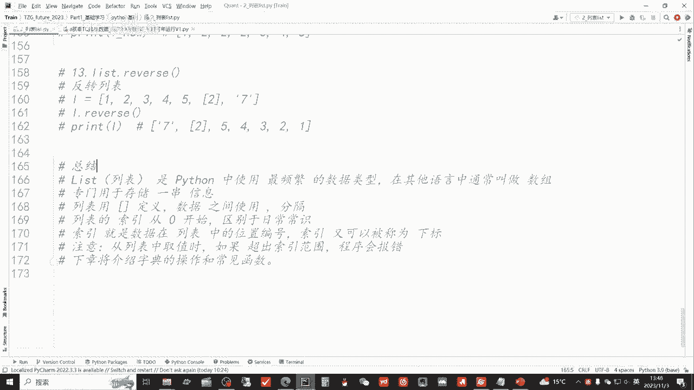

# 从零开始期货量化--天勤：2.2 Python基础：列表list操作讲解 - P1 - 客户经理_小陈 - BV1wusNezEkx

大家好，我是热爱量化，更爱搞钱的佟掌柜，这一节课呢我们来讲解一下Python基础的。

第二课就是列表list的操作，老规矩，我们还是通过拍charm，首先打开佟掌柜future2023这个文件夹，然后呢点开列表list，可以通过file open，然后打开这个文件夹，好。

我们开始这节课的讲解，这节课我们的主要内容看一看，首先什么是列表，列表的创建以及常用函数，并通过实际的例子呢，让大家更直观地感受，列表在量化交易中的一些应用，提供给大家。

这个PY程序呢也可以当做一个简单的文档，然后常看常新，因为多练才能掌握，熟练掌握这一项技能，首先我们来看一看啊，就是说本章主要介绍就是列表的创建，那什么是列表列表呢。

就是在中括号之间用逗号分隔开的这种元素，列表，可以打一个比方，它就像一个抽屉，咱们把咱们需要的文件呢，各方面就都可以呀逐步的放进去，它里面可以放数字，可以放string，可以放int float。

也可以在列表中放入列表，包括字典元组，等于可以放入各项咱们需要放进去的东西，接下来我们来看一看啊，如何创建列表，好，我们来看这几行代码list，那么首字母是L，咱们还记得上节课咱们讲到的就是说变量吗。

然后咱们就简单的以L来代表list两种方式，第一个就是L等于list小括号，然后第二方是L2等于这么一个中括号，我们来输出，看看情况好，这两种方式哦，下面有一个应该没有注释，咱们一会看一下啊。

然后这样的话呢就是说都可以创造为，就是都可以创建list，现在两个list为空，先把这两行咱们先注释掉好，咱们看中括号这一块，我们来先看看这几行代码吧，现在L1等于中括号。

然后呢L2等于1234five5这几种方式，咱们把它们打印出来看看情况好，第一个呢就是中括号list是为空的，第二个咱们可以看到这个list里面，就像刚才咱们说的这list啊。

这中括号中间呢它就相当于一个抽屉，咱可以把相应的就是说各种各样的数据放进去，首先有一有这种字符串形式的，有3int形式，有这个嗯，就是说在list里面我们也可以放一个list。

然后呢还有five这种dict，也就是字典的形式，我们分别啊把这里面的元素打印出来，看一看他们分别是哪种类型的，我们先把上面简单注释一下，这里面呢用到了一个是循环的方式，在后续的课程中会详细讲解。

我们先打印一下，好出来了，第一个就是说L2，咱们如上面所展示，我们看看一是int的类型，当然咱们也可以把它再修改一下，比如说1。0，这样的话呢形式会更多一点好11。0好，float类型。

2string类型，因为它是有这个嗯单引号的，三是int的类型，就是整数类型，四是list列表类型对吧，可以把一个列表放进去，五呢是dict，dict是字典的类型，这就是说呢就是说非常直观的向大家展示。

在这个字典当中呢，我们可以放入各种类型的数据，下面呢咱们进行这个常用函数的讲解，第一个我们先看看list insert，比如说咱们还是创建一个list，L等于这个123456789啊，全是数字的也简单。

那么l insert其实就是list insert，然后零六它的意思呢，就是说在索引零的地方插入六，我们来运行一下好我们可以看见啊，在这个123456789之前增加了一个六，就在零的位置。

在这里呢就是说给大家讲解一下list中的位置，我们还是来看一看啊，这个就说L这么中括号，也就是说这种形式的零，它代表了就是说输出输出，就是说这个list里面第零位的位置。

他的D0呢就是说跟其他的表示不同，它这个list的开始这个就一他是零位，二是一位，三是二位，是这样的一个形式，为什么这样排列呢，因为计算机啊，就是说它都是01012进制最基础的。

所以说如果说不把这个零的位置用上的话呢，会造成很多内存的浪费，所以这样的话呢它就是从零开头的，也就相当于咱们可以看到啊，list中的ABC它分别代表什么，我们还是输出一下，直观看一眼，好我们可以看到啊。

就是说零这个位置就是单独的，它代表的是一一的位置，代表的是二，那么后面就会有变化，比如说0~3的位置是不是代表1~4呢，其实不是，也就相当于咱们在这个注释里讲的A的位置，它相当于是什么。

如果输入零的话呢，就是0+1，就是它是加一代表位置，那么相对来讲的话，零呢就代表第一个位置，那么在B这个是它是几就是几的位置，所以这样的话呢咱们就非常简单，就是123，下面输出的也是123。

那么C代表什么呢，C代表就是跳跃，就隔几个，比如说咱们输出的位置是1~9，那么各位老板们可以想一想，一是从哪里开始啊，从二开始，九呢正好是第九个位置，也就是输出2~9，那中间是跳跃的。

就是每两个输出一个，那么从二开始就2468，那下面输出的就是2468，没有问题，我们再往下看啊，然后呢这里面咱们讲一下append这个函数的应用，咱们仍然用这个举例子，其实是L等于12345。

那么把这个list我们通过append a加入六七，这里面比较有意思的地方，就是说呢append是相当于把中间的这里面，这list当成一个元素加入到上面的list当中，我们允许下看下情况啊。

最后输出就跟注释中的是一样的，就是他把就是括号中的整体当成一个整体，输入到了这个位置，六七，那么我们可以可以改一下，比如说我们就单纯输入个六，他是这样的变化，那如果说我里面加入六，咱加个八吧都可以。

咱们非常直观的感受到，就是说他把最后的这个就是判断里面，当成一个元素插入进去，咱还是还原成为原来的，这是append的应用，那么相应的呢还有一个extend的应用，咱们跟它进行一个对比。

那么extend等于是相当于把这个L2，这个list就是中的元素加入到第一个里面，而不是把它们当成单一的一个元素，比如说这里面有四个元素统一的加到进去，咱们看一看打印出的结果好非常直观，是1~9。

也就是说在原来五个元素的就是基础之上，又添加了四个元素，所以这就是extend和这个append的不同之处，append呢是就是说把括号中的这个不管是什么，都当成一个元素加入到上面。

就是原有的这个list当中，而extend呢是把这个列表当中的这些元素，就说增添进去，这是它们之间的不同，讲到这里呢，相信各位老板呢一定有一个疑问，就是说你对list这个列表，有这么多的这个讲解和操作。

那具体咱们怎么用，咱还是用一个实际的案例来讲解，通过这个案例呢，咱们可以直观的看到啊，就是说嗯这个代码，咱们主要作用就是说下载这个日线数据，就是期货品种的日线数据，那么比如说我们通过就是写一次代码。

下载一个品种的日线数据，那么如果说有79个品种呢，难道我就要写79编代码代码吗，其实没有必要，我们就通过这种，list的形式，比如说像这个，这是ICIC那么就是股指期货就是1000嘛。

1000的指数IFIF是300对吧，包括我们看一看啊，就是这里面都有嗯，2B螺纹钢对吧，就你需要哪一种就是期货品种的数据呢，你就直接的就可以把他的这个代码，写到例子当中，那么就相当于写一遍程序。

就可以把所有的这个品种的代码，所有的日线数据全部下载起来，非常方便简洁，所以说呢它历史的作用就可以在这里面有，很好的灵活应用，看完了上面的这个应用举例，我们还是继续来看list。

这个就是说这些函数的应用，list里面的元素呢是可以更改的，那么比如说第一个list，咱们是这样一个情况，那么通过对零的位置进行赋值，比如赋值零，我们就可以把这个一改成零，我们来输出看一下好。

我们可以看到了它进行了改变了，list的元素呢不仅可以就是说赋值增添增添，然后也可以删除改变，你可以对他进行各种各样的操作，那我们如果要删除怎么办呢，就通过这个方式对吧，DEL就像delete。

然后我们把这个零位置元素删除，我们看一看，删除之后呢，他就由原来的五个元素变成了四个元素，而零的位置呢就变成了二了，我们再看一看啊，删除的方式有很多种，比如说像这个remove。

remove的意思就是说删除出现的第一个二，比如12345，后面又出个二对吧，如果你没给增添其他的，他就删除第一个，我们来看一下，好把第一个重复的二你赋值就复制到这种，就里面放放什么呀，比如放二。

那你就删二，如果咱们放三呢，咱看一看，他就会把三去删除，就是这么个意思，咱们再看一看啊，就是list点pop，它的作用是什么，它的作用呢也是删除元素不传入参数，默认删除最后一个元素，传入这个索引的参数。

则删除对应的索引元素，我们来看一下，还是通过举例，然后我们运行一下程序，首先我们来看啊，就是说第一个就是123452对吧，不传入参数，咱们看看输出是什么，输出的是12345。

它是默认把最后一个元素删除了，那么第二个就是说呢咱们举个例子，就是说789十十一，咱们删除这个位置一的元素，位置一，刚才咱们大伙应该是比较清晰的，记得就是位置一是在哪里，咱们默默的可以想一秒钟好。

没有错误，位置一应该是八，咱们看看啊，果然是把八删除，就七九十十一，list点clear，它的作用就是说整个把所有的列表全部清空，不管里面里面有什么元素对吧，统一的清空好，输出的是一个空的列表。

干干净净，咱们来看一看啊，就是LENLN它的作用是什么，它的作用是统计在你这个列表中，究竟呢有多少个元素，比如说12345，咱还是把它变成六，这样比较直观的看一看，那么非常直观看到他是有六个元素。

咱们输出一下，好是六，它的应用呢其实也比较比较多，我们还是拿刚才这个嗯日线数据，股指期货的日线数据，我们先简单的赋下值，因为当数据比较多的时候，我也不知道里面有多少个品种，那么假如说我们就复制一个A吧。

没有什么意义，咱们来看一看究竟有多少个品种，好我们看一看，好整体有79个品种，就直接就知道咱们已经有多少个，就是说需要下载和更新的数据，List account，它是统计在整个列表中出现。

这个就是说咱们输入值的元素有几个，你像这个我们输入二，那就是123有三个，好有三个咱们可以换一换啊，比如说输入三，它只出现了一次，它起到就是统计数据的作用，List salt，它的作用是做什么的。

就是说列表的排序，它不传入参数的时候，默认的是升序，然后如果传入这reverse等于true呢，它是降序排列，咱们还是直接应用一下，我们来整体看一看，好第一个1234522，那么他给咱排序，咱们就通过。

就是说升序排序呢就变成了1222，然后345它把它整体排序了，第二个就是说呢咱通过这个倒叙的形式对吧，这个比如说24254139对吧，倒序就954321，他通过这个形式进行排序，我们来看一看啊。

就是说通过排序的方式呢，第一个可以用list点salt这种方式，还有另外一种排序方式是sorted，我们来看一看效果，对啊，比如说L等于是这样一个列表，然后呢l new新的列表等于sorted的列表。

L我们来输出原来的L呢，它仍然跟原来是一样的，就12345是这种乱乱的，没有排序，然后呢我们输入l new，那么它帮你排序好，那么大伙有没有发现啊，就是说通过这个比如说点salt list点salt。

它跟之前之后的这个salted有什么不同，那么salted呢，就是说呢它是不改变原来数据的形式的，就是说你看你只有说对新的，通过新的变量进行赋值之后呢，它才有所改变，而原来这个就是list点salt。

它是对原来的这个list它会改变的，就改变原来的数值，这是两个不同的地方，那么究竟是用salted还是用salt，最后呢会根据咱们在量化交易中实际的需求，灵活使用，你有正序的这个排序。

同时呢有没有相应的反转列表，当然也有，比如说我想把这个列表里面就反转一下，反转并不是排序，只是说把他们的这个位置进行反转，比如咱们把这个数字改一改吧，改个七，同时呢再加上变成string类型。

把这个R呢咱们变成list类型，咱们输出看一看，这样更加直观好，他的位置发生改变了，千万不要混淆，因为它这个并没有排序，只是说把他位置对倒一下，输出是这样的，咱们把这个程序也改一下，这个方便后面的观察。

好咱们再把它注释掉，好至此呢，就是说咱们就基本上对于咱们在量化交易中，所应用到的历史的操作呢，就给大家进行了整体的介绍，那么总结就是说呢，首先啊list是Python中咱用的比较重。

就是比较频繁的这种数据类型，然后呢专门他就是用于啊储存，储存这种一串信息的，就像上面咱们介绍的，它里面可以放入各种元素的信息，同时呢列表呢是用这种方括号进行定义的，而且它的特点呢就是它的索引。

就是说第一个位置是从零开始的，跟咱们的常识呢还是有所区别的，然后呢这里面呢给大家介绍一些小tips，也就是小小的建议，就当咱们比如说遇到，咱可能就是说暂时没有遇到过的问题，咱们可以通过网站。

就是在咱们课程中给大家提供的经常用的网站，比如说CSDN对吧，打开网址，比如说我们要查询list应该查询的元素对吧，我们可以在里面进入咱自己的问题好，这里面就会给咱们很多的就是说答案或建议好。

我们可以打开对吧，就会找到查找元素，就是说如何进行查找元素，通过这里面解释呢，我们非常可以看清楚，就说list就像刚才咱们做的这个嗯，简单的设的变量可以l index就输入这个功能。

然后后面object就是说咱们要查找，比如是二或三或元素对吧，输入这个start和end，也就是说它起始的位置我们可以看一看，比如说这个这是numbers对吧，这么一串数字。

那么它就输入index查找二的位置在哪里，咱们可以想一想啊，正常的位置是0123，应该是在三的位置啊，果然输出结果是在三，那么查找100他是从第三个位置到第七个位置，那么就是从0123从这里开始查找。

然后呢咱们看看他是在第几个位置，3452输出应该是在第五个位置，然后后面呢是通过这个D咱们查找七七呢，它是通过第四个位置，那么就是0123454啊，应该是从这里开始查找，然后他是在第六个位置。

当输入55的时候呢，里面不存在，那么它里面可能会报错，55，Is not in list，就是不存在value error，至此呢就是说整体的list呢咱们就讲解完毕了，后续呢在学习的过程中呢。

咱们只要是不停的用，如果有的遇到问题的时候，也可以通过这个PY文件呢进行查找，只有多学多用，多思考，咱们才能取得，就是说更好的才能更好的掌握这项技能，好吧这节课咱们就到此为止。

感谢大家通过本节课的学习呢。

相信各位老板，在量化交易之路上又前进了一大步，有任何问题呢都宣欢迎大家呢直接联系佟掌柜，千万不要不好意思，量化呢只是工具，后面大伙会发现的策略才是关键。

也预祝各位老板的早日实现财富自由。