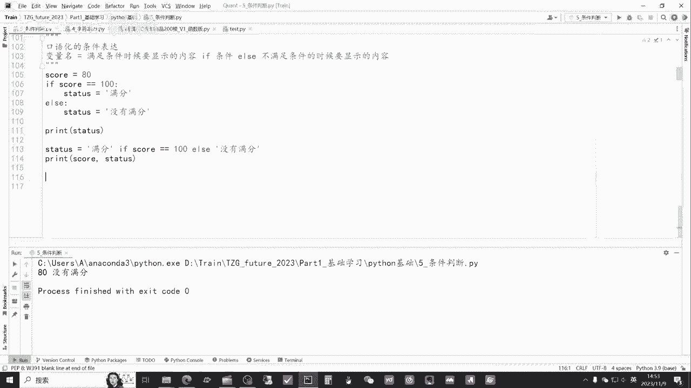

# 从零开始期货量化--天勤：2.5python中的条件判断if - P1 - 客户经理_小陈 - BV15bsTeeE1X

大家好，我是专注于量化搞钱的佟掌柜，本节课呢我们重点来讲解一下条件判断，也就是if的使用，本节课的重点内容主要在就是逻辑这一方面，那么未来呢对于咱们进行量化编程，无论是回测还是实盘交易上面呢。

会有很多的应用，建议给各位老板呢，还是反复的观看。

依然是老规矩，通过拍charm file open，打开佟掌柜future2023这个文件夹，然后点击，点击条件判断好，我们开始本节课的内容，本节课呢我们还是重点来讲解一下条件语句，if的应用。

它更多的是涉及到就是说逻辑上面的一些介绍，我们呢还是通过实际的案例，来直观感受一下它的应用，首先我们来看啊下面的一个问题，list z l也就是主联，那么这个list里面它包含了。

就是说所有的这种主联的品种，那么现在的问题就是说，如何筛选出上期所的主要品种对吧，从这么多巴拉巴拉里面对吧，把上期所的品种挑选出来，那么咱们从逻辑上来讲呢，咱们找一找上期所的特点。

它都包含SHFE这样的，就是说包含这样字段的，它就是上期所得品种，那么融合融条件语句if来筛选出呢，也就是说，如果它的品种代码中包含这个SHFE，那么我们就把它打印出来，挑出来就是这么一个简单的逻辑。

那么咱们具体代码应该如何实现呢，就这几行代码对吧，首先用一个for循环，后面咱们会具体的介绍，现在先简单看一下I呢就是临时变量对吧，这行代码意思就是说呢，for循环就是I在这个主联的list里面。

那么这I呢就相当于就是一个一个的这个呃，就是说临时变量就一个一个把它挑出来，然后呢，if如果SHFE在这个，就是说咱挑出的就一次挑一个嘛，合约当中，那么我们就把它打印出来，如果不是呢，就跳过进行下一步。

就是把咱们上面的逻辑用代码直接表述出来，我们来看一看，运行一下好，我们打高一点，看看好，这样的话呢，他就把就说咱们在这个整个主联数据中，所有的品种，包含SHFE的这个品种全部都挑出来。

那么就实现了咱们上面说的，筛选出上期所的全部品种，通过这个实际的案例呢，我们可以直接看到，就说if的应用，也就是说当满足就是如果是什么样的情况之下，也就满足这样的条件之下呢，它会运行后面的代码。

如果不是呢，那么就会pass掉或直接滤过，我们呢再通过，其他的例子来更加直接的看到，if呢可以单独使用，那么这行代码就说输入一个数字，如果他的分数大于90，那么就显示优秀，也就是if的单独使用。

我们试一下好95他满足条件，他就输出了优秀，第二种应用就是说什么就可以，if和else联合一块使用，那么这里也是让你输入一个数字，它的意思就是说如果对吧，这个叫余数，就这个数字你输入除以二，余数等于零。

那么它就会打印出这个数字，并告诉你是偶数，那如果余数不等于零呢，那么很自然的话它就是奇数，我们来运行看一看，比如说打一个六好，这个时候他输出的是偶数对吧，他满足就是说是三嘛，他的余数是零。

那么咱们再试一遍，打出一个五好，这个时候呢因为它的最后的余数呢不等于零，那么相应的它就是奇数，那通过这个方式来讲，if else的方式呢，我们就可以对具体情况呢进行一个判定。

接下来呢我们来看看还可以通过as if l if和else，这个三个阶段的判断来解决实际的问题，好我们来看一看啊，就说这个例子打个比方，在现实世界中对吧，很多情况呢，他的考虑的条件实际上是超过两个的。

比如说一个按照年龄分段的收费游乐场对吧，六岁以下的儿童免费，6~18岁收八元，18岁以上收16元，这样单纯的用if或者就是说if else，那么肯定就说很难解决，那么它分段吗，咱们就加入l if。

那么代码就是这样，首先输入年龄，当年龄if，当年龄小于六的时候，咱们免费对吧，当年龄大于等于六或者小于18的时候呢，半价收八元钱，然后呢其他情况，那就是说肯定是大于18岁的，那么收16元钱。

我们来运行一下，比如我们输二十二十岁，那么收16元没有问题，如果三岁，免费也可以再运行一次，咱们十岁，那就是半价八元，那基本上来讲的话呢，就是按照咱们的设想是完美的，解决了这一个实际问题。

通过以上呢这么几个简单的例子，我们对这个if它的应用有了比较直观的感受，然后呢，我们还是用这个呃抽象的给大伙解释一下，比如说来讲，它语法就是这样，if条件A当满足条件A的时候。

然后呢执行这个下面的这一行代码，然后呢l if条件B就是说当满足B的时候，他执行这行代码，当然l if f可以有CDEF都是可以的，然后呢最后就是说剩下的条件，以上的条件都不成立的时候。

他就执行else这块的代码，然后咱们把这个再打开看一看，他的书写是有特点的，首先if空格，然后面写上相应的条件，然后这里有一个冒号，应该是必须是英文的，各位老板要清楚的记得冒号之后，下面这点它是四个。

就是四个空格，相当于是tab键就行了，比如我们去掉1234，或者呢直接就是点击tab tab键对吧，这样他就是一个完整的if的这么一个模块，一个书写的标准格式，那因为呢咱们用的是palm。

如果写完这个这个if条件之后呢，点回车，它自动的就帮你把它空出来，还是比较方便的好，再回到这个具体的解释，我们看一看啊，就是说如果条件A为true，也就是当条件满足条件A的时候。

那执行就说一就这边的相关的操作，然后程序结束，如果条件A是false，就是它不满足，而条件B满足也就到这里，那么他执行的是第二段代码，如果A也不行，B条件也是false，就都不满足的情况之下。

他执行就是else这一块的代码，我们再来看一下，就是if的表达方式对吧，它的比较运算符就像咱们上面用的对吧，当它有大于等于也有等于，就这些都叫运算符，我们可以清晰的看到它的运算符有几个呢。

有这个双双等号一定要注意啊，各位老板就说双等号代表等于，然后呢一个叹号加等于号是不等于包括大于号，小于号，大于号，大于等于和小于等于，这些都可以用逻辑运算符，有and or和not。

也就是与或非这样的使用，还有in not，In is is not，对吧，这些是主要if判断中呢经常会使用的这些符号，我们呢还通过一个更加复杂的例子来看一看，就是if的高级使用。

咱们还是用一个实际的例子来看一看嵌套，就是什么叫嵌套用法，也就是说在if else之下，还可以用if和else这样的手法来，我们来简单看一看代码，这里的意思就是说呢，当你的分数大于90的时候。

你输出的是优秀，那其他情况呢在其他情况下面又有分化，就是说当你的这个分数大于等于80的时候，是良好，然后如果这个不满足，他后面还有分发else，然后继续分，当你大于等于70的时候是中等。

那其他的情况呢继续分，当你的分数大于等于60是及格，那当然小于60就不及格了对吧，通过这样的这么一个代码的形式，我们可以清晰的看到，就是说并不是说只有一层的关系，只要是逻辑严谨。

我们可以在if else下面不断加新的if else，还有l if，当然呢咱们就是说很多聪明的老板，聪明的小伙伴都会就说有疑问，就说需要这么复杂吗，是不是用其他的方式可以更更加的简化。

咱们可以思考三秒钟，没错，这个情况呢也可以按照上面，就是说咱们刚才说收费的这个方法，用一层的方式，就if elf l if else方式呢也可以做到，为什么这样举这样的一个例子呢。

就是通过这样的例子告诉大家呢，就是有些问题他可以用嵌套的方式来解决，我们呢说了这么多，还是运行一下看一看，比如咱们就是哦下面没有注释掉，把它先注释，好我们再次运行好成绩，咱假如说这次考的不好。

40他直接输出的就不及格，没有问题，那咱们来个100优秀也没有问题，中间咱们再来个75，好中等，那证明呢虽然它看上去结构复杂，但是呢能够完整的解决咱们所需要解决的问题，后面呢给大伙介绍一下。

就是说稍微更高级的一样的写法，这个也是突出Python的一个特点，就是它更加的口语化，那么还是看这个具体案例，比如score，也就是说咱们得到的分数是100分，当分数等于等于。

也就是说等于等于就是说它是一个逻辑判断吗，就它等于100的时候，然后咱们输出status就等于满分对吧，如果说他没有等于100，那其他情况肯定就没有满分好我们来输出一下，我们先把这个注释掉。

好因为咱们最开始赋值的这个变量就是100，所以他直接输出的是满分，那如果90呢，也就是没有满分，那么这是一种表达方式，有没有更加口语化和简化的方法，可以就直接输出，这个改成还是100分，就直接输出。

就是status，就他的状态等于满分，那么如果他的分数是等于100的话，那么他THEUS等于满分，那其他的方式就是没有满分，我们还是这样输出一下，好把分数和他现在状态都输出了，就是100分满分没有问题。

那我们再改成80，看一看啊，也没有问题，输出是这样，就这两种方式下面的更加符合口语化，上面的这些代码就逻辑性更强，随着咱们就是说各位老板，他最后咱们进行的项目越多，那每个人运用的项目和对代码的掌握程度。

越高的情况之下呢，咱们就可以根据需求，然后呢进行书写，至此呢就是咱们本节课的主要内容，那么本节课的内容的难点，主要就在于逻辑性相对比较强，那么各位老板不用担心，你们可以在拿到代码之后呢，反复的练习。

反复的使用，去深刻的体会他这个if条件的使用，因为未来呢的确在咱们的就是说条件判断，比如说产生交易信号，以及咱们实盘交易过程中呢，要大量的用上if else这样的情况，所以呢没有关系。

只要在实践中呢不断的反复观看，反复练习，终有一天各位能够很好地掌握这项基本技能，再次感谢大家。

通过本节课的学习呢，相信各位老板在量化交易的成功之路上呢，咱们又前进了一步，有任何问题都欢迎大家直接联系佟掌柜，千万不要不好意思，量化呢只是工具，策略才是关键。

