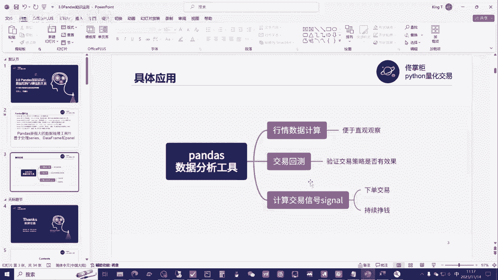
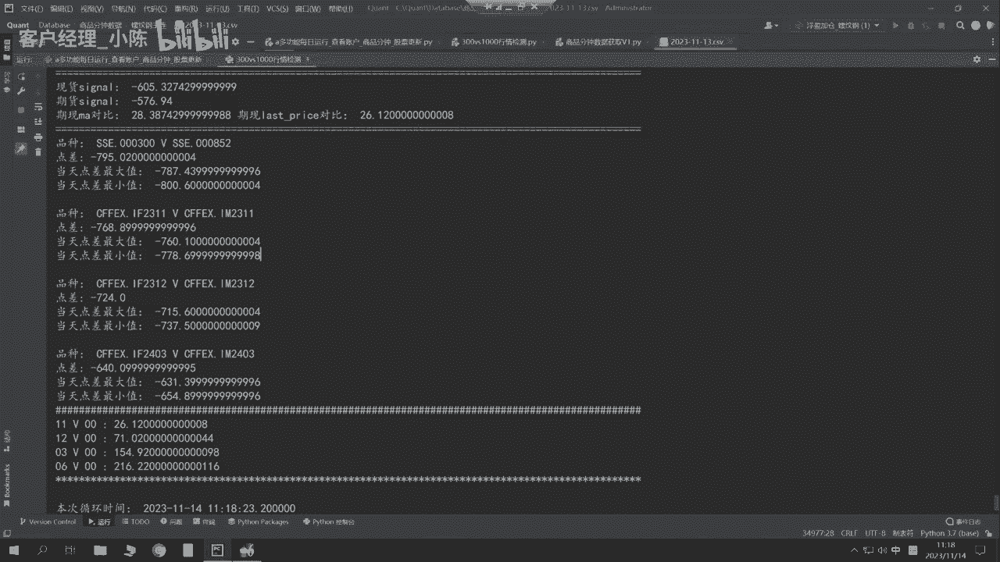
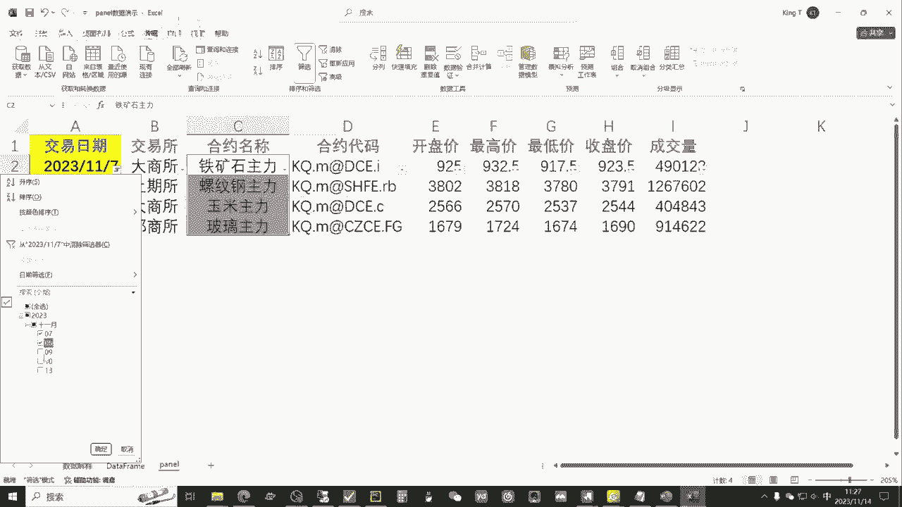

# 从零开始期货量化--天勤：3.0Pandas知识总论：数据分析与赚钱的关系 - P1 - 客户经理_小陈 - BV1SzsTedE7k

大家好，我是专注于量化搞钱的佟掌柜，从本章节开始，咱们的重点只有一个，就是将咱们的知识应用到实盘交易当中，实现稳健盈利，在正式学习pandas之前呢，我们先看一下知识总论。

也就是说数据结构与赚钱的关系，首先我们来看一看啊，pandas究竟是什么，pandas其实就基于Python语言的一种扩展库，简单说就是一种工具，它呢主要是就是说进行这种面板，数据和基础数据的分析。

也就是panel data analysis，它本身是一个强大的一个工具集，基础就是南派，它可以呢就是说从各种的这个呃形式中，比如CSVJASON，或者说excel导入数据。

那么基本操作就是对这些数据进行归并啊，成型选择，简单的说就是说数据的清洗和数据的加工，跟咱们比较密切的，也就是说它在金融环境中或金融领域中的应用，那么简单的说呢。

pandas就是一个强大的数据的这么一个，梳理的工具，他善于处理呢就是series啊，data frame和panel data就善于处理这样的数据类型，咱们呢还是结合具体的应用来直观的感受一下。

就是pandas究竟能干什么，那么pandas作为这么一个数据的分析工具，它主要的功能跟咱们结合主要是三方面，第一个就是说行情数据的计算，也就是便于咱们直观观察，第二个就是说呢交易回测。

可以验证咱们的交易策略呢它是否有效，第三个呢就是可以计算交易信号，尤其在实盘的过程当中呢，下单交易最终的目的都是为了咱们持续挣钱，我们还是通过具体的实例啊，来看一看这三个应用具体是怎么样的。

首先呢咱看一看就这个行情数据的计算，我们可以打开这种，就是说软件不管是期货还是股票的行情，我们可以非常清晰的看到，就是说比如说这些均线对吧，它整体是怎么计算出来的。

那么它的计算实际上就是根据就说每一天的，咱们可以看到，就是说左侧的这一边就说开高低收，这些数据对它进行，有的是加权平均，有的就是简单的算术平均，然后来计算出相应的数据，进而把它画成线。

这样的话呢我们看起来呢就更加的直观，它的意义在于哪呢，因为比毕竟呢人嘛，其实呃对于像如果是这种数据，他看的不直观对吧，咱们从这里面如果要发掘一些这个这个趋势啊，或者策略各方面的话呢。

可能就是说呃无法直观的看出，但是通过这个行情数据，那么我们可以直观的看到，比如说咱行情的走向，那么进而来讲的话呢，通过一些这个变化再结合，不管是基本面或技术面的方法呢，可以来构思。

甚至于说完善咱自己的策略，进而呢有了自己的策略呢，咱们才能指导咱们更好的进行交易，那么既然有了这个数据之后呢，我们可以看一看，就说他第二个应用也就是交易回测对吧，它究竟是怎么样的，那么交易回测电脑呢。

可能更擅长于处理这种这种类型的数据，那么我们打开咱们的回测的这个框架，比如说我们初期投入10万块钱，那么每个品种每次只加入，就说20%的仓位也就0。2，那么呢华点交易成以及交易成本呢。

咱们统一就算到一块，比如说是每次15，那么c rate也就是说CARCERATE，也就是说咱们每次的这个交易佣金对吧，咱们要给这个交易所，或者说给这个期货公司，咱得支付交易手续费。

那么咱杠杆不要太高对吧，咱就0。15的比率也就大概在七倍左右，对比如说每跳的价值啊，或者说咱们爆仓比率设的高一点的呢，咱们的模型就更加的稳健，我们来运行一下，就这些参数设计完之后对吧。

你的设定最后都是基于就这些数据，咱们可以清晰的看到对吧，在什么时候买入，什么时候卖出，然后你的价格计算，最后形成你的这个资金曲线，都是基于这些数据，那么背后的这些分析工作。

都是由这种pandas或南派的组合应用来进行的，我们来回测看一看，通过它的快速的计算，我们就可以看到啊，将近这个嗯不到10年时间，9年的时候对吧，30倍整体，那么它最大回撤20%。

那么有了这样的这个图形，你就知道你自己本身的这个策略，究竟是有用还是没有用的，在哪方面需要调整对吧，调整完之后的结果和效果是如何的，有了工具的辅助，有了这种pandas的分析工具。

可以极大的提高咱们的效率，因为一个品种可能如果要手工的话，你要花很长时间，但是如果十个品种，几十个品种，上百个品种，尤其类似于比如说期货的品种还少一些，股票的可能是这种嗯几千种的品种。

那么有时候那种计算量是你没有办法去人工，手工去计算对吧，它的效率实在太低了，那么借助工具，我们可以对咱们的交易策略进行很好的开发，应用以及后续的完善，有了交易策略之后呢，我们看一看如何计算这个交易信号。

既然指导咱们下单好，打开佟掌柜这个服务器，我们可以看到，就说昨天收盘时的返回，也就是夜盘的返回，咱们看看账户的最新情况嗯，盈利总和将近30万，28万赌，那么在铁矿石这个上面，因为佟掌柜主要是趋势交易。

它的交易的频率不是很高，主要就是说有盈利呢，就是浮盈加仓，同时拿得住，所以它的利润积累还是比较丰厚的，这个这个品种将近是24万5，那么它的持仓均价是837。5，昨天的收盘。

那么这个基本上要保证金来讲的话，基本就翻倍了，那么股指期货赚的稍微少一点，总体还不错，然后我们再看一看，比如说行情的跟踪，那么他目前也是对股指期货进行行情的跟踪，进而在后台会计算。

把计算的结果呢输出出来，可以指导我们进行，不管是手动或自动的交易，都是非常直观的这么一个嗯。

参照意见好，咱们看完这个，咱们再结合这个股票软件看一看好，因为它的行情目前呢还是在这个呃，咱们的期货软件，它的这个行情还在计算继续走，所以说呢他后面的这个福音呢也整体会在变化。

那么因为初始的本金呢大概在50万左右，所以咱们看看资金曲线，那么这个月的收益还是比较不错的，那么26。4%还不到两周的时间，也就是说半个月不到，那么整体的资金曲线收入是不错的，那么主要来自的收益呢。

还是咱们可以看到就铁矿石的这一步啊，那么结合佟掌柜的这种趋势交易策略，包括咱们可以回顾一下刚才的咱们这个，比如说回撤，就这个回撤对吧，整体的回测，那它就是在这个趋势发生的初期介入。

然后呢有了利润并买入持有，那么通过呢这个咱们运用这个pandas，强大的工具，我们就可以通过行情的观察对吧，制定咱们自己的策略并验证，最终呢进行这么实盘的交易之后，我们就可以获得比较好的收益。

这就是说咱们pandas学习以及咱们Python啊学习，进而呢咱们通过咱们建立自己量化系统，最后要需要达到的这么一个整体，这么一个目标和目的，接下来呢我们还是通过实际的案例来看一看。

这个pandas的数据结构，在讲这个数据结构之前呢，我们简单看一看咱们后续的课程，那大概就是说前面咱们讲的，就是说这个Python的应用基础，然后后面呢咱们现在这一章节。

主要还是集中于这个pandas的应用，包括刚才咱们举的例子，后续呢都会提供给大家，就逐行给大家讲解，包括咱们构建这个期货的日线数据库，但如何你构建自己的回测系统，以及后面的API的介绍。

如何咱们进行实盘交易，这些部署和下单，这些呢都会给大家在后面呢进行详细的讲解，好，我们现在还是回到就是说呃，咱们这个实际的案例，来看一看这个pandas的数据结构是什么，首先呢我们看看啊。

就是说嗯直观的感受这整体的这个数据，大伙可以清晰的看到这整个的数据，这个叫data frame，它的形式就是有什么有这个像这个竖的，这叫index，也就是它的索引，那么这里面咱们是日期。

当然我们也可以看这个excel，那直观的来讲，index也就第几行，第几行，第几行它是行的这么一个标识，那么横着的，比如说交易日期呀，交易所呀，合约名称啊，这叫columns。

实际上它其实就是说什么就是这个列，那么按照底下的数据，各我们可以比较直观的看到对吧，那么index就是上面这个一竖，这叫index，那么每一个数据呢就是一个标识record对吧。

那么上面呢这个黄的部分呢就是columns，就是裂，那么整个这一这一串对吧，这这一丢丢它都叫data frame，那么series的这个数据结构是什么，就是这个哎这一列这每一列对吧。

他都叫是series，这就是它的数据结构，我们可以通过这张图可以直观看，比如说mango对吧，芒果这是series1苹果series2对吧，banana香蕉series3。

然后他们整个这个每一个series都组合到一起，这就叫data frame，这就是咱们进行pandas分析的，这么一个基本的数据形式，那么我们来看一看啊，就说用形象的例子解释一下对吧。

当然咱们最后未来来进行数据分析呢，还有几个就是说不同的情况，你像这个data frame，它是比如说罗尔钢的这么合约，咱们可以看到日期对吧，7号八号九号十号13号，它是这个按照日期的顺序对吧，由远及近。

或者说由小到大这么排列的，而且他的单个的合约这是什么，这单个合约就只是螺纹钢，像这种合约的形式，就这种data frame的形式，它叫时序数列，时序数列也就是说品种只有一个，但是它的日期是什么。

就是说它的日期是变化的，也就是说通过日期的变化，我们可以对单一品种它的变化进行考量，那么这种就是说品种单一，但是时间是排序的，这叫时序数列，那么什么叫截面数列呢，我们可以看一下啊。

就是说用这个叫panel data，panel data是什么，就是说面板数据，比如说我们2023年11月7号，只看2023年10月7号对吧，我们可以简单的进行一下数据的筛选，比如筛选好。

我们只选这个7号，这个时候我们可以清晰的看到看到什么，就说他都是7号对啊，我们可以放大看一看对吧，他都是11月7号，那么但是他的合约名称不同，那这样的类型的数据，就是说在同一个时间周期下。

不同的品种排列到一块，也就是说在同一个时间下，我们可以对比这不同的，比如说涨跌幅啊，成交量啊，收盘价对吧，对它们不同品种进行对比的，这个叫什么，这个叫截面数据，也就是说在这一个时间点我们切一刀对吧。

因为它时间是连续的嘛，我们就切这一刀就看这一个截面，然后对比各个品种的不同，那么这个叫截面数据，刚才这个例子，这叫时序数据对吧，咱们一对比时序数据呢就是时间连续，但是品种单一。

那么截面数据呢就是哎在同一个周期下，那么不同的品种，这叫截面数据，那如果我把它恢复一下呢，就是说全选上。

那么既有像这种颜色，咱们可以清晰看到对吧，这就是铁矿石的这种数据，它就相当于叫什么呢，这叫时序数据，既有这种时序数据，又有截面数据对吧，既有时序有截面的数据，它们共同组成的数据就叫panel数据。

也就是我们所说的面板数据，那么我们通过形象的例子呢，咱们来解释一下对吧，截面数据就是什么呢，对就它就相当于在同一时间下，比如说好友记对吧，老友记这六个人都放到一起对吧，也相当于六个期货品种。

或者说比如说股票来讲的话，几千个都一样放到一起，那么咱们在同一时间下对他们进行观察，这个就叫截面数据，时序数据呢就是一个人，但是他的时间不同，假如说时间是非常连续的，也就是说通过时间的变化。

对单一的这个咱们的对象或者品种进行观察，那么这个就叫时序数据，那最后的面板数据，也就是说将这两个数据结合到一块儿，它里面既有就是截面数据，就单一时间下这些人的变化或这些品种的变化，也有对吧。

时序数据也就是说每个人对吧，在不同的时间点上面，它的变化进而组成的这个面板数据，那么各位老板一定要说对吧，佟掌柜给你讲了这么多，那它的意义何在，那么实际上这些数据为什么最后要有面板数据，又有时序数据。

又有截面数据，还有series这些情况，他都是为了解决问题，打个比方，比如说咱们现在要从这几个期货的品种当中，我要选出，比如说这五天内涨幅最高的对吧，那我们就要对这个每一个品种进行计算对吧。

他对对于计算来讲的话呢，就说吼咱换一个例子，就是说比如说咱们超过他5日均线，对不对，超过5日均线我们就把它筛选出来，比如说我要做多对吧，那么我们就要对它的这个收盘价进行一个计算，那么如果对它时序数据。

5日均线进行计算来讲的话，我们就需要时序数据，比如说我们算出一个数来，比如说996对吧，比如我们铁矿是996，那么比如说我们的螺纹钢，比如是3838，然后呢再假如说我们大商所得玉米。

咱就2500简单一点对吧，然后呢咱们正商所比如说是1616对吧，你需要通过时序数据的方式对吧，算出这些5日均线，至少在11月13号的时候，你要算出5日均线，进而可能后续增加的数据就要跟它对比。

你对比完之后超过比如说均线的，咱们就要做多对吧，如果低于均线的，咱可要就要做空，那么在这个问题上面就会有什么，就会有时序数据的计算，同时呢还会有咱们的截面数据对吧，而且呢除了咱们超过均线。

因为咱们最后要筛选品种嘛，根据你的策略对吧，我们要把比如说超过这个额均线的挑出来，那同时如果要更复杂呢，比如我们还可以看到他们在这个均线基础之上，或涨跌幅基础上，我们可以看他的增速。

他甚至计算这个相应的这个呃standard，也就是说它的标准差，那么通过这些横纵多方面对比，因为随着你的策略越复杂，可能你就要求他的这个纵向啊，横向啊，这种就是互相的这个计算量，也就是说你计算完之后。

你还要给它加入一些系数，然后最后呢通过你的这个策略的筛选，你可能是筛选品种，有的呢可能就是说你要突破某一个指标，所以说当你的策略越复杂，或者说当你的情况越多的情况之上之下。

咱们就需要对这个panel数据进行这个多方面，立体化的处理，那么这种处理单纯用excel目前是解决不了的，或者说解决的效率十分低，那么用pandas，用咱们现在这个量化的方式对吧。

用Python的这个方式呢，我们可以对不光是一张表，对我可以几十张表，几百张表，甚至上千上万种表上进行统一的处理对比，这样呢就能极大的提高咱们的这个执行效率，而且把以前很多不可能的事情呢。

现在就基于一个平台和一个语言，以及一个分析工具之下呢，咱们实现了可能，那么总体的目的都是为了提高效率，辅助咱们实盘交易，进而呢最终达到咱们资产的稳健保值增值，好了，这节课呢。

就是对于pandas总体介绍的这么一个总论，那么后续的课程呢，咱们会重点详细的逐步讲解它的具体的功能，那这样这节课咱们主要内容就到此为止，感谢大家通过本节课的学习呢。

相信各位老板在量化交易的成功之路上呢，咱们又前进了一步，有任何问题都欢迎大家直接联系佟掌柜，千万不要不好意思，量化呢只是工具，策略才是关键。

