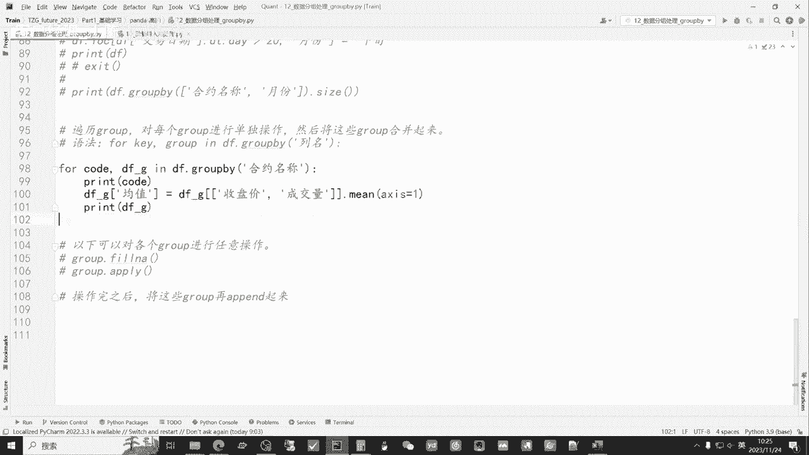

# 从零开始期货量化--天勤：3.12Pandas中的数据分组处理 - P1 - 客户经理_小陈 - BV1avsTe8Epv

大家好，我是专注于量化搞前的佟掌柜，本节课呢我们来讲解一下，如何用pandas进行数据的分组处理，这节课的知识呢，未来咱们在进行策略回测的当中呢。

会经常使用到我们呢，还是首先通过PX打开佟掌柜，future2023这个文件夹，通过fail open，然后点击，佟掌柜这个文件夹，然后OK打开，然后选择咱们12数据的分子处理好。

我们正式开始本节课的讲解，那么我们这节课主要讲的就是分组处理，也就是group by，那么group pp我们应该怎么用呢，我们首先来直观的感受一下，我们结合我们第十节课，当时呢我们是把这样的这个列表。

也就是说这样的单品种的数据，一个一个的这种类似于复制粘贴或者整理过来，形成这样一个大表，也就是panel data，那么这节课我们要做的事呢，就是说针对这个大表。

panel data里面包括所有的品种加上时序的数据，我们要在这个大表当中呢去做文章，做整理，比如说来讲，我们想把11月7号所有的品种都抽出来，然后进行一个这个相当于当日的这种，横向的对比。

那么我们应该怎么做，就需要group by的操作，我们首先呢还是导入我们今天所需要的数据，就是在给大家准备的测试数据当中呢，这个全品种日线数据，右键copy path，Absolute path。

然后放到这个地址栏当中，那这个时候呢encoding等于JBK，我们呢在导入数据之之后，然后要对数据做一个简单的处理，也是方便的，与后面的展示进行数据的对比，我们根据之前讲的课程呢。

通过salt value的方式呢，把先以合约代码进行排序，然后以交易日期排序，我们把整体的这个数据打印出来，这里面我们先200行，然后直接观的看一眼，好这个时候呢相对就是比较清晰。

因为他每一个数据的品种，它的时间周期可能相对会较长，那么咱们是以这个先以合约代码，那么它就会以这个C相对靠前，会他来先排序，那么这个时候咱们打印出来的数据类型的，就相当于是这样，就是说先以一个品种。

然后呢时序数据这样逐步的向下排列，好我们还是回到我们的数据，这个时候给大家提供的就是整体的，所有合约的一张大表，我们来看看接下来的操作，首先我们来直观感受一下什么叫group拍。

那么我们先把它打印出来看一看，我们以交易日期进行group，啊这个时候什么都没有，他只是输出了一个group by object，它相当于是什么呢，就是说没有进行实质性的操作。

而是把这个group分组呢，类似于放到这个地址或内存当中，那么接下来我们都是基于这个group by，就说他分组之后对它进行了整体的一个操作，好我们接下来看一看，如果我们想统计每天交易的合约品种。

我们应该怎么做，那么既然每天那么进行统计，那么我们就根据这个交易日期进行分组，分组之后呢，只要统计就说它每个交易日期下有多少行数据，那么就相当于呢它有每天的交易合约，品种是多少，我们直接打印出来看一眼。

好这个时候呢他非常清晰的为咱们展现出来，比如说1998年1月5日，在这一天当中呢，他只有三行，就相当于呢他给咱们抽出了一个截面数据，我们直观感受一下，就是这样对吧，他当天有多少个品种，它都放到一起。

像这样呢有六个人，那就相当于有六个品种，也就六行数据也能在这个数据中当当中，就相当于把11月7号对吧，这边有一条两条，三条四条对吧，它通过对日期进行分组，然后统计里面的行数，进而呢他输出是这样的类型。

我们看看如果最新的话，最下面好，这里面有66个数据，就66个品种，这个是当天没有更新完的，所以呢咱们先看这些，咱们对照这样的输出呢，把上面的这个salt类型，也就相当于这个咱们的这个重新的整理一下。

我们把它进行一个简单的更改，这样就更加的直观，我们都放在这里，这个时候呢我们是以交易日期放到前面，好这样的，如果我们输出一下，就相对的比较直观了，后面的是以日期统计它相应的交易的品种。

那么下面呢我们以日期先进行排序，然后我们可以清晰的看到对吧，一1998年1月5号，他只有三个品种，那么下面呢，他统计的就是三对吧，这样的话呢就是相当于每个日期之后，它显示的是不同的品种。

那比如说11月13号甲醇菜油短鲜，这样的话它给咱们展示的就是一个截面的数据，同时呢咱们也可以通过就是刚才的方式呢，清晰的看到两种不同的排序的方式，显示的这个数据的情况是不一样的，好接下来我们看一看啊。

就是说如果说我们要按照这个合约代码或者，合约名称进行统计，我们先看一看每个合约之下，他有多少个交易的天数，怎么办，那这个时候就通过这个合约的名称，就相当于我们通过第一个先排序合约名称。

再排序交易日期的方式对吧，这个时候我们要看一看每个合约，它究竟有多少的交易天数，我们输出看一看，好先看上面对吧，他先排的是合约，然后呢再排交易的日期，我们要统计，就是说同样的合约在这个数据里面。

它究竟有多大的数据量，也就是说它的交易天数有多少，那么下面给咱们直观展示的就是，比如说我们以合约名称排序，那么LP这主力呢，它目前的数据量只有881天，也就是交易日，在这个数据库里面只有881天对吧。

每个品种的数据量不同，比如说咱们的中证1000主力合约连续合约，它的上市时间比较晚，所以只有318天，而三百五百和五零的主力，他们是同时上市的，那么他们的这个呃上市天数是一样的。

进行了这种基本的查看操作之后呢，我们看一看还有其他的哪些灵活的操作，比如说我想通过这个交易日期分组之后呢，只把其中的一个组别拿出来，就是拿出来一个截面数据，打个比方，我们就可以用get group。

用这个函数，然后后面填入你想取得当天的交易的这个日期，那么你得到的就是当天，就这一天交易日期的所有品种的组成的，相当于一个截面数据，我们来运行看一下，我们把上面的这个调小一点，方便咱们的观看，就20吧。

然后呢这个DF呢先不给它输出出来，把它先注释掉好，我们单纯先运行这个啊，只拿这一天的数据，我们看一看，好这个清晰的给咱展示出来，就说他只拿了11月1号，就是本月月初的这一天的数据。

同时呢把每个品种都罗列在这里，这样的话呢它就形成了一个就是截面数据，那反过来亦然，如果说我这个时候只按照合约的名称，比如说我只看整个大表当中，只看螺纹钢主力连续，它的这个情况是怎么样，我们打印一下好。

这个时候呢它所有的数据都是主力合约，就罗尔钢主力合约，但这边呢给咱们是一个时序的数据，那么看到这里呢，我们各位老板一定有一个直观的感受，这个GROUFLY，他的操作就相当于把一个大表。

按照咱们的需求呢进行切分，那么直观的感受，就相当于呢就是把这个大表反向切分，比如说我们按照合约名称的话呢，反向就切分到相应的就是嗯这种时序数据对吧，因为咱们合并了是吧。

就是单个每一个交易品种呢合成一张大表，那么通过这个大表，怎么样反向的又推导出这样的一个小表，比如说我只要主力合约名称的话，就刚通过刚才的咱们展示这种group by，然后输入合约名称的形式对吧。

get group就可以得到这样的这么一个表，进而我们在这个基础之上，再对这个表进行整体的操作，那么就是后续咱们需要就是细化的过程和工作，好接下来呢我们来看一看，其他的一些常用的函数。

首先这个describe，相信呢每个老板看完之前的课程呢，都非常的直观，对他也非常熟悉，那么我们通过group bye合约名称，然后describe就相当于对每一个品种，在大宝中进行输出和对比。

我们看一看，好这个时候输出的相应的信息就比较多了，比如说LPG的主力合约，那么count也就是说它有880一个数据min对吧，它是平均standard，然后呢最小值中位数就是25分位数。

那么这一串他的数据是在最高价值下，当然还有最低价收盘价成交量，那么它就相当于原来对单品种进行describe，之后呢，他这就对多品种，并且放到了统一的一张大表当中进行对比，好这个时候我们看一看啊。

这个如果说我们只需要按照合约名称排序之后，只输需要输出前三行，那么这个时候就用head three head3的方式，好这个时候我们可以清晰的看到，他只输出了合约的前三行，并放到大表当中。

那么上面这边我们可以看到，他好像顺序有一些变化，跟咱们想象底下稍许稍许有些不同，是因为它每个group的这个行的顺序会保留，所以说呢咱如果让他都输出这种，每个品种三行三行的情况。

需要在之前进行一个这种salt values的这种排序，我们把它排序一下，重新再输出，也可以相互对比一下，好这个时候呢各位老板可以清晰的看到，他是按照这个合约名称，合约代码进行排序。

我们再看下面排序之后，那么整体就舒服了对吧，三个500的，三个300的，三个50的五零，然后三个不锈钢，三个线材，三个护心对吧，我们通过这些横向纵向的对比操作呢，也可以发现。

其实呢整体咱们在对于基础知识掌握之后呢，可以对咱们整个的数据进行，灵活的安排和灵活的处理，只要符合咱们最后的要求，满足咱们需要解决的问题就可以了，好那么直观看完之后呢，我们在既然有开头。

那如果尾巴呢就收出最后的三行，就用tail对吧，Three，好这个时候呢他就是把最新的三行输出出来，那么咱们数据是到11月14号，后续呢，相应的数据库的更新的代码也会发给各位老板。

那到时候咱们自己更新一下就可以，那我们再看看first和last，好他就相当于呢把每个合约，在这个大表中，他第一行数据输出出来，也就是每个合约，它整体它就是首个在咱们大表中出现的，这个数据。

咱们也可以看看last，好基本上都是11月14号，因为当时更新数据的时候呢，有夜盘，有的品种没有夜盘，是在夜盘时候更新的，所以呢他稍微可能有的是差一天数据，这个没有关系，后续呢咱们通过这个数据库的代码。

直接更新一下即可，那如果说我们需要更加灵活的输出数据，比如说像单品中，我们不输出第一行或最后一行，我们想输出第二行或第三行，那这个方式我们应该怎么做，我们可以通过这个摁死的方式，我们可以先输出一下。

看一看好，这时输出的数据就相当于比如说LPG主力，那么它应该是按照排序来讲，实际上是第三行，因为从零开始的，他会把每个数据，比如说单个数据，这种时序数据它会输出这样的第三行。

这就是这行代码的这个作用和意思，我们可以整体来查一下，我们可以通过get group，然后和他进行对比，好首先我们把这个LPG的主力合约输出出来，我们看到他012，那么4月1号应该是ins的第二行数据。

那么对应下面来直观看一下啊，好4月1号，所以他这个的这个ens2的这个方式呢，就说我通过这个写标注，比如说我们要用sun呢，那他应该输入输的是4月2号，好这个时候出入的就是4月2号。

也就相应的他应该是第四行0+1嘛，就是从0123，在4月2号这样一个情况，我们可以看到通过各种各样的操作，我们对于这种pandle data的大表的处理，相应的方法和方式还是比较多的。

这个时候呢我们也可以清晰的看到，他的这个输出，通过N次这个three n S3的这种输出呢，它把相应的合约名称变成了输出的index，如果呢我不希望把它变成index，只是一个列，那应该怎么做呢。

我们可以通过这个方式就加入S，index等于false的方式，好这个时候呢，他就把之前的数字行数作为index输出，而相应的就是说咱们的这个之间的合约名称，还是保留成原来的列，跟上面的这个有所区别。

就这些所有的参数和所有的这个函数的使用，最终都是根据咱们自己的需求，那么我们在进行group之后呢，取一部分变量呢可以对它进行计算，它的计算方式，实质上跟之前咱们在基础当中进行的。

这个列的操作和计算大体是相通的，基本上以前的这个基础的知识呢，结合group外都可以进行操作，我们首先来看一下，我们打印出来看一看，我们首先呢对吧，对这个合约名称进行取值，就以合约名称进行分组。

进而呢我们来看一看收盘价和成交量，分别取他们的这个平均价平均值，我们打印出来看一看，好，这个时候他输出就说LGPG的主力，连续它的收盘价的平均值是这样，成交量的平均值是这样。

那么这个时候就是说各位老板有没有一个想法，就是咱们在做这个列的操作的时候，当时有一个操作方法，就需要把这两个数据，比如说目前它是单列，就说单个品种的一列求收盘价，所以最后呢它出来了两个均值。

那如果说我想把收盘价和这个成交量两个相加，进行这个横向的这样的这么一个对比，我们应该怎么做，等于零的时候呢，他是把一列做，然后等于一的时候，我们可以看一看，好这个时候呢它发生了一些小问题。

也就是说在这里面没有这个参数的使用，那么我们应该如何在group by里面，对它进行这个横向的求他们的这个平均值呢，我们可以用其他的方法代替一下，好我们可以往下面先简单的看一眼。

这个时候我们可以通过这种方式，以一个for循环的方式，比如说code，然后它其实输入的是合约名称对吧，DFG就相当于d f group，在group by中它输入的就是这个合约名称下的。

相应的就是一个品种的持续的数据，那么我们在这里面可以通过这种方式进行操作，对啊，我们给它单加一个均值，就是对于新出的这个合约品种，每个GROU派中的合约品种的话，的均值就等于收盘价，成交量。

求它们之间的这个平均值，然后xis等于一，这个时候我们看看能不能输出好，这个时候我们非常直观的就输出了，就说比如说咱们看最后一个对吧，它输出的是扣的，比如是咱们的合约名称，那么就是鸡蛋的主力。

连续我们看到他把鸡蛋的数据呢，按照时序的排序都输出出来，而最后的均值是什么样的，就相当于收盘价与成交量的相加除以二，我们来简单算一下，26968+3868除以二，好等于15418，没有问题。

那么每一列都有一个值，那么这个时候如果说我们在group下面，如果把它想得到两个数值怎么样，就是上面的咱们往最上面看对吧，想得到这个两列，按道理是两个数值怎么样，我们是来计算一下好没有数值。

他没有办法计算，所以如果说你既要得到，就是说他们单列的平均价，又要得到他们两个相加的平均价，那有什么方法呢，这就要结合到咱们之前的这个第十课所讲，就是说我们可以呢。

通过这个在导入每一个品种数据的过程当中呢，对每一个数据先在它自身的情况之下，进行一个整体的计算，然后呢比如说我们先用XX等于一的方式，就是把这个在它单品中的情况之下呢，先把它们的均值计算出来。

然后呢group by之后呢再计算，他们收盘价和成交量，然后再想办法把它们组合到一起，所以为什么说有这个各种各样的操作，最后的这个结果还都是为了，满足咱们进行数据回测的这么需求好。

我们再继续上面的这个函数的讲解好，既然有mean in，那肯定就有平均值最小值，最大值，那么它的意思都是一样，我们来输出看一下啊，这个时候他就输出收盘价的最大值，和成交量的最大值，当然我们呢。

经常还会要对他们的这个成交量进行加总，我们输出看一眼，啊，这个时候他就对成交量这一列的大小，进行了加总，我们在做这么多操作的，就是目的是什么，目的就是为了将来，比如说我们做这个多因子策略回测的时候。

要对他们这个进行排序对吧，就我们计算出来的相应的这些技术指标，或者我们的这个signal这个交易函数，最后的交易的指标呢，我们要对它进行一个排序和进而的筛选，筛选出在这个相应的时间点上。

我们应该究竟选择哪个品种好，我们可以对这个成交量进行一个排序，通过rank的方式，好他就会按照相应的排名，有整体这么一个输出，咱们这行代码的意思就是说，他以这个交易日期进行分组之后呢。

然后对成交量进行排序，那相当于呢在这行数据里面呢，它这个品种的成交量在当天他是排第18名，因为目前咱们这样看的，可能不是特别的直观和清晰，是因为咱们上面的这个像分这个排序，Salt value。

咱们是以这个合约代码先排序，再排这个交易日期的，我们重新排一下，我们以交易日期来排，然后进而是合约代码，好这个时候就比较直观了，他前面的index是01234567，就是这么一个顺序往下排的。

然后呢当天的交易量就相当于截面数据，在当天的这个交易日期当中，它是排第一的，这是以相应的这个数字去排，我们也可以用百分比，因为之前以数字排呢，有的就是说当天的交易量，就是当天的交易品种。

可能有的是66个品种，它是按照这样的去排，从一到这个66，那么我们加一个PCT等于初，那么它是以百分比的形式，这个时候他就是以百分比的形式进行排列，对吧，进行排名，好接下来我们再看一看啊。

就是说也可以通过多个变量对这个group，咱们进行这个嗯操作，我们把上面的还是输出出来一部分，这个时候我们多输出一下，我们还是输出200个，好这个时候咱们还是依然以这个交易日期。

每个交易日期有不同的品种进行排序，我们来看一看，就是说接下来的操作他的意思是什么，首先呢我们可以对这个交易日期进行什么，进行格式化的这个改编，把原来的这个交易日期现在变成了这个时间的，变成时间类型好。

我们通过这个给它赋值新的列，然后呢进行通过多个变量进行group的操作，那这里来讲呢我们给它赋值的方式啊，就通过时间周期，比如说小于十天的，就小于10号的，我们定为上旬，那么小于大于10号。

同时呢小于20号的是中旬，大于20号，那么那就是下旬我们把数据输出来看一眼好，这个时候呢我们可以清晰的发现，对于我们更改过的数据，我们把上面的先注释一下，不让它打印出来，只看最后面。

那么我们新复制了一列，那么对于这个来讲的话，我们就有判断，包括上旬，中旬和下旬，是完全根据之前的这个咱们的这个交易日期好，我们来看一看如何通过多个变量进行group，这个时候比如说我们想看第一个。

首先进行合约名称的group，也就是把这个合约名称单不读都拿出来，同时呢再进行月份的group办，然后最后呢我们想看看就是在合约名称下面，它的月份数据有几个，我们来输出，直观看一看，啊。

这个时候呢它就相当于输出了一个是复合的index，那首先是主力名称，我们在LPG的主力合约之下，我们相当于把这个这个表，就分别把大表都整成一个一个的小表，单个品种，进而我们再把这个在这个单个品种之下。

对每个日期进行分组，分为了上旬中旬下旬啊，上旬呃，上旬中旬下旬，他是这样这样输出的，也没有问题，那么每一个这个分组之后，它里面分别有多少数据，通过这样的操作呢，我们就可以就是用多个变量。

对整个的大表进行复合的分组，咱们通过以上啊这种各种各样的操作呢，其实最终的目的就是为了实现，对于这个整体的一个panel data，进行一个横向纵向的对比，打个比方，就像最开始介绍的功能。

我们用size的方式呢，就想统计在同一个交易日下，那么当天有多少个品种交易，那么这样就必须需要把这些大表呢，进行合并之后呢，然后通过这个group派的方式进行截取对吧，通过这样的方式呢。

它的操作效率最高，同时呢打个比方，我们要做这个要看到每天涨跌幅最高的，这个相应的品种是哪一只呢，就需要比如说在原来的单表当中，把每个涨跌幅计算出来，进而呢又是放到大表当中。

然后再通过group by的方式呢，把每天的截面数据抽取出来，进而呢对它的这个涨跌幅进行排序和对比，所以呢我们讲了这么多的操作，都是为了进行咱们未来进行策这个策略的回测，以及呢找到按照咱们的标准。

筛选出相应的这个交易品种，这个合约品种，他的目的呢就是说为了满足咱们的回测的需求，那么之前的单一的操作是无法进行的，所以就需要通过这个纵向横向group by。

或者说之前的咱们concept这种合并的方式，最终呢高效的完成咱们所需要的数据类型，就像刚才之前咱们举到的这个mean的方式对吧，我们通过group by的方式呢，可能没有办法取得这个收盘价和成交量。

他们横向的嗯这种相加之后来求均值，那这个时候呢我们可以通过之前的方式，第一个就说在原始的这种单品种的数据之下呢，我们先计算好之后再合成大表，那么后面相应的数据都有，那么也可以通过呢这种方式。

也就是说把这个code和单独的每一个group by，合约名称之后的品种呢，单独拿出来，进而在其中进行操作，然后你把操作好的数据就是我们再输出一下，看一看它新增加的这一列啊，每一个它新增加的这一列。

这个均值A列，就说你把它单独计算出来之后呢，你可以分别的保存，同时呢再把它们合并起来，也可以达到咱们所需要的这么一个数据类型，以实现咱们回测的目的，当然呢对于这个分组的处理。

后面还有好多的函数需要结合咱们实际的案例，后续呢咱们根据咱们的实战项目，也会逐步的为大家进行详细的讲解，好本节课的内容呢到此为止，感谢大家通过本节课的学习呢。

相信各位老板在量化交易的成功之路上呢，咱们又前进了一步，有任何问题都欢迎大家直接联系佟掌柜，千万不要不好意思，量化呢只是工具，策略才是关键。

