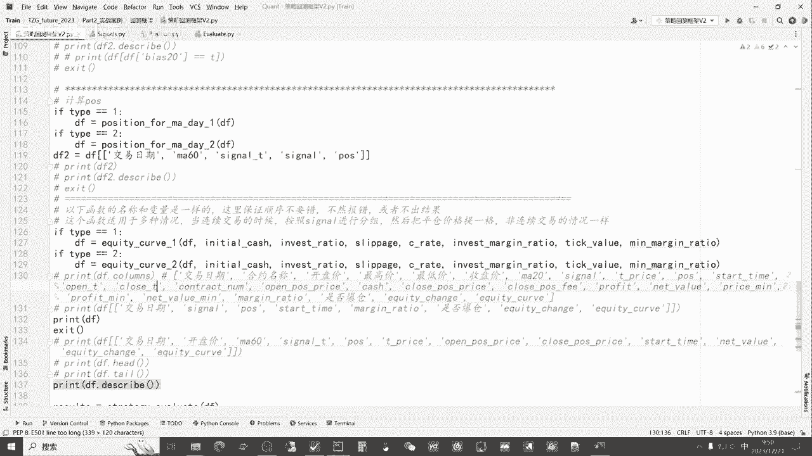
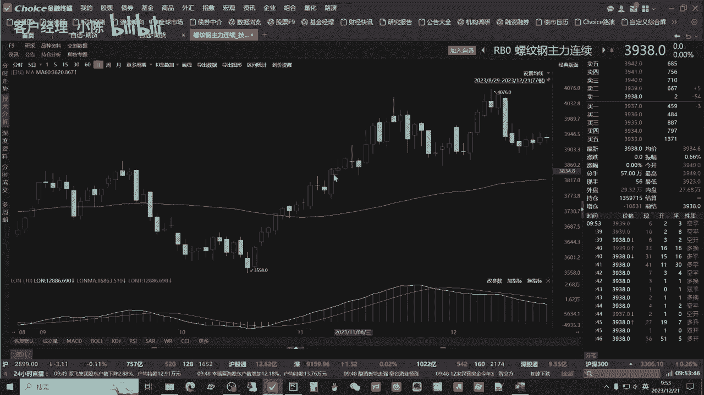
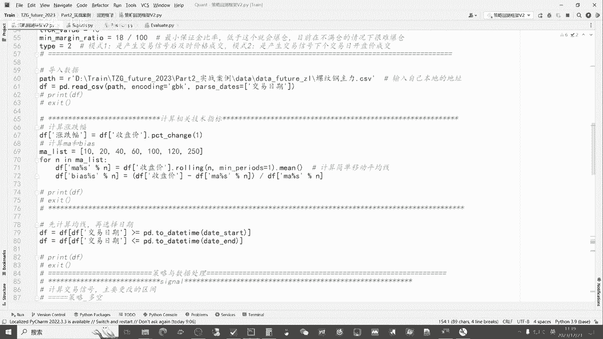

# 从零开始期货量化--天勤：4.6如何计算资金曲线 - P1 - 客户经理_小陈 - BV13isTefEa4

大家好，我是专注于量化搞钱的佟掌柜，本节课呢我们来讲解下回测框架中，我们如何来进行资金曲线的计算，以及对计算出来的资金曲线呢。

咱进行策略的评价，好，我们开始本节课的学习，我们首先呢还是打开佟掌柜future，2023这个文件夹，我们通过file open，然后呢打开这个文件夹，然后打开咱们的实战案例回测框架。

把接下来的这个相应的四个脚本文件呢，我们打开好，我们正式开始本节课的学习，那么上节课我们通过对于signal和position的讲解，我们可以计算出相应的持仓信息，我们可以把它打印出来看一看。

好这就是我们产生交易信号之后，我们相应的持仓，也就是产生了交易信号的，第二天，我们在开盘价的时候呢进行买入收盘，比如说下一个交易信号的时候呢，我们仍然是在下一个交易日的开盘价进行补卵，是做多或做空。

通过反手来做，基本上这是我们上节课的主要内容，那么这节课呢我们就来计算一下，就是说有了交易信号和我们的持仓信息之后呢，我们如何计算最后的净值表现，也就是说，当我们计算完策略信号和持仓信息之后呢。

我们如何来计算净值，并把它的曲线画出来，那么这节课呢我们主要内容就是讲evaluate，evaluate里面的两个函数，一个是资金的曲线的计算，另外一个就是咱们的策略评价好。

我们先看一下咱们资金曲线的计算，主要是这个函数，我们在讲这个函数之前呢，我们来进行一下原理的讲解，好我们通过这个图表，我们可以很清晰的看到，比如说我们在这一天我们开多仓，这是仓位。

然后呢到这一天我们呢平仓，假如说开盘价格是4014，那么平仓价格是4199，那么后面呢我们到这一天我们开的是空仓，也有开仓价格和相应的平仓价格，我们就计算这两个周期，那么正常的逻辑我们是怎么计算的呢。

就相当于呢假如说我们投资总额是100万，那么在这里呢，我们用100万除去我们的开仓价格，计算出相应的它持仓的手数，然后进而呢在整个的过程中呢，随着每天的收盘价，我的净值会有波动。

也就是说我们的资金总额会有波动，到最后一天，那么我们卖出相应的就是我们的持仓，然后呢用我们的平仓价格减去开仓价格，再乘以我们的手数，刨去相应的手续费，这个时候呢我们得到资产的总额，比如说是110万。

打个比方，那么我们下一次又有交易信号的时候呢，这个时候我们需要比如说在这点，我们以24011开空仓，那么这个时候，咱们因为资产总额已经变成了110万了，那我们就需要拿110万÷4011。

这个价格又形成了我们的交易手数，然后到最后咱们平仓的时候，那么仍然是跟上面是一样的方式，用我们的平仓价格和我们的开仓价格相减，然后再乘以一，这个时候可能到这个时候呢会亏损，打个比方是变成了九十九十万。

那么这只是两个开仓和平仓的周期，像咱们的这个60日均线的单策略呢，首先咱们这两个周期是不断的循环往复的，那它周期又非常多，比如说我们策略是非常正常的一个事情，再加上我们的这个额相应的风控措施。

所以呢后续的这种阶段非常的多，如果按照咱们这种正常的方式，或者说这种最直接原始的方式，就不断的计算开仓平仓，开仓平仓，那么最后的结果肯定是没有问题的，但是这个过程呢是过于复杂的。

也就是说通过我们的程序呢很难去实现，所以呢这里咱们为了方便咱们，计算相应的净值呢，我们改换了一个思路，仍然是把每一次它的交易周期呢，我们都给它框起来，这里用颜色呢方便呢，各位老板呢更好的观察。

那这个时候不论咱们去投入多少钱，那么我们都以净值为一来开始，打个比方，那么最开始我们是一的净值买入之后，那么到这里如果是一点一，那么中间可能有各种各样巴拉巴拉的变化，那么我们不管未来呢也可以把它计算出。

我们重点关注，就说这一个交易周期，我们是从一变成了一点一，那么对于下一个交易周期呢，我们仍然从一开始，那么最开始比如说一后来比如说变成了，假如说还是一点一，那么最终的资金曲线我们应该怎么计算呢。

就相当于把这两个周期的资金曲线，帮他拼接出来，那么这里我们现在是一点一，实现了10%的增幅，那么下一个仍然是10%的增幅，因为相较于咱们其实也是一嘛，那么最终我们的收益应该是多少呢。

就相当于把这两个阶段的净值一拼接，也就是1。1×1。1，最后是1。21，也就是1。1×1。1，我们通过这样的方法，也就是把每一个交易周期，我们分别计算它的净值，然后最后呢将所有的交易周期拼接到一起。

就相当于实现了一种复利的情况，那如果这边是0。9呢一样，也就是1。1×0。9，那么最后净值应该是0。99，这里面就是负的10%，我们通过这样的一个方法就可以完美地解决了。

不管你有多少个这种开平仓的交易周期，哪怕里面有更多的咱们的风控措施，那么咱们把每一个交易周期，都形成自己的资金曲线，进而计算出它相应的涨跌幅，最后把所有的涨跌幅连接到几及拼接，就是我们得到最终的静止。

通过这样的方式的设计，我们就可以完美地解决，刚才最初提到的这个方案，同时呢在代码上面也可以方便，咱们就是说简明扼要的把这个事情进行实现，看完了具体的原理之后呢，我们来看一看代码。

这里呢我们用type1和type2的方式呢，来计算equity curve，也就是说资金起身的计算，后面的文件是放到以value evaluate，这个脚本代码当中，那我们简单的先看一看这个函数。

那么里面有两个注释是佟掌柜为大家列出来，因为咱们上面的配置的参数，和在咱们里面设置的函数，它中间的变量名称是一样的，所以呢，咱们这个框架就是不需要改变这些函数的位置，就顺序不要改变。

如果咱们要对这个equity curve，也就是说计算咱们资金曲线的函数进行改变呢，只需要改变里面的代码即可好，这是一个需要注意的地方，同时呢为什么是type1type2呢，在上节课我们可以讲到。

就是我们在做交易的时候呢，一个是咱们就实时成交，相当于咱们的高频交易，当产生交易信号的时候呢，我们就立刻交易，另外一个呢就相当于是持续成交，我们在本周期计算出交易信号，然后呢在下一个周期进行交易。

也就相当于数据里面，比如说咱们120行，我们这时候发出了交易信号，产生了交易的策略，那么下一行我们才开始交易，进而产生持仓，这就是一和二的区别，在这里呢佟掌柜也给大家简单介绍下。

其实一和二的函数是一样的，因为咱们后续要计算它相应的资金曲线呢，我们主要呢是跟着这个position，也就持仓来进行改变和变化，那么对于咱们持续成交和实时成交的，变化的区别。

其实我们在这个position里面已经进行处理了，这里呢这样做的原因呢，一个是方便咱们后面的多一个选择，各位老板在制作的过程中，那可能我不是以这个相应的收盘价来成交，或者说呢我们可以开盘价。

或者说是以这个平均价，那么给大家更多的选择，同时在程序上也更加的完整好，为了演示方便呢，我们上面稍微在参数上面进行一个小小的修改，我们把这个sleep page加一，也就是说我们基于产生交易信号之后。

我们的成本呢就是滑点加一就多一点的成本，方便咱们的数据的对比，接下来呢我们把这行，就是说计算咱们资金曲线之后。

我们把它相应的数据输出出来，给大家直观地感受一下，好这个时候呢它整体的数据就输出出来，我们可以往后看，咱们目前呢就是相当于是持续的交易，也就是产生交易信号之后，我们在下一个周期进行买入。

那么我们还是结合之前的讲的原理，再结合数据呢给大家过一遍，首先比如说在这一天我们产生了向下，也就是说下穿的情况，那么我们就要做空，那么我们在下一步就是下一个周期进行买入，进而产生了相应的持仓。

我们可以清晰的看到他持仓周期也就到这里，也就是说这一天产生了上传，那么就要做多，还是在下一个周期我们进行买入，所以呢做空的持仓周期就到这里，我们根据持仓来找到我们的开仓价以及平仓价。

为什么这里呢要做一个稍微这样的一个处理呢，因为咱们目前咱们的交易属于是连续交易，实际上呢真正的它发生平仓的时候呢，是在这一天就相当于反手，我平完仓之后又以这个价格进行开多仓，但是我们在交易的过程中。

或在咱程序的计算中呢，这不好算，所以呢在这里呢就算是也一个是小的技巧，小的tips，把它在这个交易周期的这个价格往上移一下，因为它的平仓价和连续的反手的开仓价是一样，我只要上一个格。

那么这样就方便咱们的计算，而且对于未来咱们有风控条件的，或者更复杂的情况之下，也就是说咱们不是永远持仓，中间会有空仓的情况，这样的结构呢是一样适用的，最后算出的净值是一样的，好我们到这里呢。

我们看看有了开仓，有了平仓价格，我们必然是在这是开仓，我们就用咱们的资金除以咱们的价格，得到我们的开仓手数，这个时候我们可以看到是2497，因为他是开空，我们当时这个华点给他加了一个成本，既然开空嘛。

那就是向下给他加了一个成本，那未来赚的就会少一跳，开始就是我们的现金，也就是说我们在这个时候，我们付出的相应的交易成本之后，剩下的钱，那接下来呢我们就要算我们的净值，这是这一天他的利润。

那么到下面如果是2600呢，就相当于把前面的抹掉，然后呢再赚，那么最后呢到这一天咱们总的净值是2600，后面呢就相当于呢是咱们净值的亏损情况，它会不断的积累，不管是正的负的。

那进而呢我们的这个net value，也就是说咱们的净值它会不断的变化，这个price in是什么意思，因为他每天的交易，比如说咱们的期货，咱们最后算的是收盘价净值的变化，就这里。

但实际上他每天是变动的，那么我们在程序里面一定要把它的极限算出来，如果我们是做多的话呢，那我们就要算它往下走的最大的极限，如果做空的，那就是往上走是亏钱，我们把它最小的净值变化要给它输出出来。

它的作用是什么，就是这里，就是我们看一看，我们的每天维持的保证金的情况，如果低于咱们的保证金比率，你像现在咱们就相当于不加杠杆，那保证金比率是150%，那绝对是安全的，妥妥的。

那如果说是低于咱保证金比率呢，那么这里面爆仓就会显示一它一旦保存，后面的净值就都是零，那接下来呢我们通过这样的一个方式，把每个周期的咱们净值的变化都算出来之后。

我们最后要得到的其实就是equally change，就是每天我的净值曲线的涨跌幅，这是最后我们需要得到的核心，然后如果我们怎么算净值呢，就是把这些涨跌幅连成加一，然后连成，这就得到我们每天的涨跌幅。

好比如说到最新的一天，目前咱们的净值0。97，这就是咱们整个计算咱们资金曲线的思路，好我们来具体看一下代码，我们可以通过CTRL点左键进入到这行代码当中，还是结合刚才咱们运行的过程。

我们来看我们把这个往下下拉一下，这样结合数据呢比较清晰，首先呢我们还是来看一下这些字段的设置，包括初始的资金，咱们投资比率，然后呢划点和成本，我们交易的手续费，保证金比率。

然后最低的保证金比率和每票的价值，我们这些字段的设置，它的原则其实有两个，第一个就是贴近，不是贴近就完美的复刻，咱们实盘当中需要设计的所有字段，另外也是为了后面计算这些字段做相应的准备，首先我们来看啊。

首先我们还是计算咱们的仓位，通过仓位的计算我们要做什么，我们要进行分组，比如说第一个condition one，首先我们来看一看结合数据，好这是仓位，那么我们如何把，也就是说当它出现了策略信号的时候。

我们如何把这个仓位形成这样的一个形式，就通过上面的代码，首先比如说第一个仓位不为零，第二个它和之前的仓位是不一样的，那么你像目前这是这个仓位不为零，它和前一个它的数据是不一样的。

那么当出现这样的情况时候，我们就在就是把open也就是我们开仓条件，这个时候我们可以把我们的这个满足，这样的情况，也就这一天筛选出来，进而呢我们赋值，比如说开仓，那同样我们这个平仓的条件。

我们可以往下看，平仓是在这一天，也就是说他首先不为零，然后呢他跟下面不一样，那么这一天其实就是咱们的平仓日，那么结合这样的条件，我们就可以把后面的平仓的价格确定下来好。

因为我们后面要计算相应的我们的净值，我们要把每一期就像咱们之前一个CEL列出来，就是说把每一期进行分组，那么我们如何进行分组呢，我们就通过这个start time，也就起始时间，当开仓的时候。

我们把当天的日期给它赋值，后面呢每一个就在此周期内，咱们把他的时间给它，fill n a就把空值给它，赋值之后都用最开始咱们初始的交易周期，这个值给整个周期进行赋值，那么通过这样的方式。

我们就可以达到什么呢，对每个交易周期用日期的方式对它进行分组，如果他的这个目前的这个持仓为零，也就没有持仓的时候呢，我们把它相应的start time变成什么空指，这样我们就实现了通过确认开仓。

开仓日的持仓情况呢，来确定相应的我们的起始的交易时间，进而通过交易时间达到这样一个目的，把每个交易周期进行分组好，我们接下来看就是说确定了开仓的条件，也就是这一天对吧，position这一天。

那么当他确定为开仓的时候呢，open t也就中间的过渡的价格等于t price，这是之前咱们设置的变量，在signal的时候，我们就知道哎，在这一天他的开仓价格是这样，那么它的平仓价格，是2524。

我们为什么加一个shift-1，就是刚才跟大家讲解的，就说因为啊咱们的这个上下穿它是连续的，它其实应该是在下面，就是说在这一天他平仓之后呢再开仓，但是从程序的角度来算呢，这样不好算，就没有办法实现。

比较难计算，我们就通过一个小技巧把它上移一个格儿，那么最后他可能会在静止中的，缺少最后一天的这个额净值的变化，但是没有关系，通过这样的方法呢，把原来不好计算的，我们现在就可以计算了，我可以告诉大家。

对整体的净值没有什么影响，为了我们最后为了，就是为了检验最终的净值的情况，而且这样的结构方式呢，我们将来加上我们的平仓的方式是一样适用的，所以它的包容性很好，也算是一个小技巧。

好我们有了开仓和平仓的价格之后呢，我们开始计算投入的资金，这里面有初始资金，也有我们的投资比例，通过这样的话呢，就更贴近咱们日常的交易的这么一个习惯，我们有了这个投资的资金。

就是我们的初始资金乘以咱们的投资比例，进而我们去干什么呢，去计算，就是按照正常的买卖的方式是一样的，我们当有了开仓的价格呢，我们就用我们具体的投资就投资多少钱去除以。

我们的开仓价进而得到了我们的开仓手数，而且在整个咱们交易周期的过程当中，我们的手数是不变的，除非我们平仓，这里呢我们还仍然有个小技巧，就是contract number等于NPFLO，他的意思是什么。

我们可以看到我们每一次开仓都是整数，也就是说有可能比如说我们100万投入10万，我们除以螺纹钢的价格，那么最后它是一个小数点形式，因为我们开仓不可能是说有小数点，都是是几手，就是几手的整数。

那么如NP点flow的方式呢，向下取整跟四舍五入不一样，它是向下，也就哪怕你是26。99，那么它也不可能是27，向下取整，就直接变成26，那么就贴合咱们实际的交易的情况。

这里面呢开仓价格包括咱们的这个计算，相应的这个咱们取得的手数里面，也要考虑到华点，就是咱们的open理论价格，再加上华点也是贴近实际的，最后再向下取整，就得到了咱们相应的咱们持仓的手数，那么接下来呢。

我们要把我们的开仓价格固定下来，开仓价格等于什么呢，就是等于咱们的这个理论价格，加上咱们sleep配置，也就是华点，再结合成本这么一个价格，咱们最开始设置的是一，那么既然是向下，为什么要乘以pose呢。

那就是如果是开空，那么咱们相较于增加的华点，那就是2497，如果是开多呢，炮子是一呢，他正好加一个华点，也就是说咱们相当于在开仓的时候，咱就是有了一一跳的成本好，接下来呢就是说开仓之后。

我们来看一看我们还剩余多少资金，像这里我们初期开仓之后呢，我们消耗掉的100万，中的消耗的其实就是手续费，那这里呢就等于最初的资金减去，我们开仓的价格乘以这个数量，再乘以价值乘以咱们SIRI。

也就是咱们要交给是这个期货公司，的手续费好，当我们开仓完毕之后，在整个的周期当中，咱们其实通过一个循环的方式，for循环的方式，那么咱们相应的合约的手术，以及咱们的open pause price。

也就是开仓的价格以及咱们的可用的资金，其实都不会发生改变的，那么咱们就把它全部的用最初的数字进行补全，当我们炮子等于零，也没有仓位的时候，我们通过一个历史的方式，那么这几行数据。

比如上面我们没有pose，我们可以看到当等于零的时候，那我们这些都是空值，也就不需要，我们再看看我们的平仓，那么当我们发生平仓的时候，平仓价格也等于咱们这个理论的价格，然后呢减去sleep page。

为什么是这样呢，就是说我们开仓的时候，如果是多仓，我们加一跳，那相当于成本提高一跳，那如果平仓的时候呢，那么减一跳也就是我们少赚一条，这样的话呢就考虑到实际的交易成本，当资金量大的时候。

那么sleep配置是必然会发生的，所以这样呢就更贴近于咱们，或者说是完美复刻咱们实盘交易，那么平仓之后，我们除了平仓，我们还要产生手续费，那这时候手续费就等于我们平仓的价格，乘以每票价值。

再乘以咱们的手数，然后乘以咱们的这个交易手续费的比率，我们可以看到在整个的周期里面，现在平仓手续费没有，只有在他平仓的时候会产生相应的手续费，这跟咱们的实际交易是一样的，那么接下来我们来算利润。

profit我们来算算利润，他每天的利润，其实就相当于呢是咱们如果以收盘价来计算，就是收盘之后来统计下，就是收盘减去咱们的开仓价，然后再乘以咱们的这个pos position，也就是咱们的建仓。

为什么要乘以建仓呢，如果说咱们是开多的话呢，收盘价减去它，当收盘价大于它乘以一的时候，那就是利润，那反过来呢，如果说呢咱们是做空的，那他就是负的，当收盘价大于它的时候，咱就是负的，也就是亏损啊。

通过这样的一个方式呢，就是说它针对做多做空都是一样的，把利润和亏损都可以直接体现，进而再以乘以咱们的手数以及每票价值，就是每日的亏损就截止到当天的亏损，比如说咱们第一天这样建仓，亏了3600。

第二天呢他不仅把相应的损失挽回了，他盈利是2600，这是每天截止到当天对于咱们最初净值的，也就是说咱利润的变化，那么在最后一天咱们需要处理是什么呢，就说不是以收盘价了。

而是以咱们平仓的价格减去开仓的价格，这样需要细节上处理一下，然后账户的净值，净值到最后就等于什么，就等于比如说net value，就咱后面的net value，账户的净值其实就是等于咱们最初的cash。

再加上最后咱的利润，在最后就可以得到咱们的net value，也就是这个当天的净值，每一行的净值，到这里呢本身还没有结束，因为呢咱们期货本身是自带杠杆的，所以呢我们要计算一下爆仓。

当我们position持仓为一的时候，我们要把最小值算出来，也就算咱们净值波动的极限对吧，那么对于做多的行情或做多的这个持仓呢，咱们最低价也就是形成的净值是净值的最低。

至少是当天咱们就是要计算出它的极限，那么反过来来讲的话，如果说咱们是做空的话，也就是我们持仓为负，那么行情越往上走，咱净值越少，所以它的最低价就是当天的最高价。

那我们通过这两个字段就是price mean的方式，我们可以得到当日我们净值的最小值，也就是说，最后咱们虽然算到了最后咱们的这个利润，但是当咱们的杠杆比较大的时候，它的净值波动比较大。

有可能在当天行情变化的过程中，就会产生什么，你的最小的净值已经低于你的保证金比例，那自然而然就爆仓了，那后面咱们再计算相应的净值，其实就没有什么意义，所以呢通过这个方式我们可以算出。

算出这里profit啊，我们可以看到，虽然最后收盘当天亏了3640，但是呢他当天的净值的最大的波动是到了负的，4420，第二天虽然收盘时候赚了2600，但是当天呢它向下波动，净值最多是亏了5980。

所以在这个过程中，因为它是变化的，并不是静态，这样跟实际呢是完全贴合的，然后通过我们计算最小的净值，我们跟持仓的总量进行一个比值计算，我们就可以得出每天的这个保证金比率，你像现在没有加杠杆，是0。1。

也就是1。5，1。5对吧，是150%，因为在之前的视频当中讲过，咱们目前的这个策略，当咱的仓位达到六成的时候，这里面会有低于18%，有低于0。18的情况，那么当出现这个情况时候呢，就像底下就是否爆仓。

就是保证金比率，像我们可以往上看啊，我们目前定义的最小的保证金比率，就是18比100 18%，当我们的这个保证金比率，就当日的波动的保证金比率，小于最低保证金比率，再加上相应的咱们的交易手续费。

这个时候就确认爆仓了，那么之后的净值呢就全部都变成零了，我们可以把这个数据固定一下，之前我们可以运行一下，看一看，比如说我们把直接就百分之百的仓位，我们运行一下，好我们往后倒一下。

我们可以看到后面都是零，我们可以往上走，好他其实在这里就发生了爆仓，基本上从最开始就发生了爆仓，波动比较大，我们把如果再改成0。6，让它运行一下，好我们可以看到之前他的保证金比率，0。240。3。

那么后面会有净值的变化，这样看的就更直观，好在这一天他的保证金比率是15%，约等于16%，低于咱们的保证金比率，那就相当于什么，就相当于爆仓了，所以这爆仓等于一，那后面所有的净值也就都归零。

所以通过咱们目前的这种，保证金设置，咱就能可以计算出，咱们未来去做进行策略开发的时候，就会来看一看咱们的极限在哪里，那么后续呢咱们在自己平仓的时候，咱们相应的net value的净值的当中。

还要减去咱们这个交易的手续费，也就平仓时的手续费，这里呢咱们佟掌柜也要考虑一件事情，就是说这种情况虽然很少发生，但是也要考虑到，也就是当发生了交易策略平仓信号的时候，有可能呢此时没有爆仓。

但是在下一个周期开盘的时候，他突然有一个大的这个反跳，那这个时候就会导致net value一下子小于零，那么此时我们这种情况，那是否爆仓也把它复制为一，也就是说我们爆仓。

一个是通过咱们的保证金比率去比较，第二也要考虑到他突然反跳，而且幅度巨大的情况之下，我们也要把这样的事情考虑，这样就更加的完美，也更加的贴合实际，对于爆仓来讲的话，我们还可以有二次处理。

通过股入数败的方式，我们可以考察到在每一个交易周期中，是否有爆仓的情况，也便于我们之后的观察，那后面不用说当是否爆仓对吧，我们通过df lock的方式，如果说产生了爆仓，就像这里当此时产生爆仓的时候。

它的net value的净值我们可以往前看，应该是这一列对吧，它就变为了零，那么后续来讲，当这些我们日常的情况，正常的交易以及爆仓情况都考虑完之后呢，我们主要来计算咱们最核心的。

也就是咱们资金曲线每天的涨跌幅，Equally change，我们就可以用net value就是每天的净值，我们计算每天的涨跌幅，那么这里面有一个小技巧，我们当net value变成零的时候。

那相当于呢涨跌幅就是一，也就是说当我们爆仓的时候呢，我们收益率一，那基本就全亏没了，所以这一天不管之前的净值是如何，那么从这一天开始爆仓，这一天开始我们的净值就统一归零，因为最后咱们净算计算净值的情况。

就是相当于一加上咱们当天的收益率，然后把它连乘起来，之前呢因为没有归零，所以呢它会有正常的净值波动，一旦在当中发生了任何一天发生爆仓的时候，收益率都是零，因为1+-1嘛就等于零。

那么后面连成也都全部归零，它也就会出现，像之前我们来看一下啊，后面，咱先注销一下，也就这样一个情况，当它发生爆仓的时候，比如说在这一天，那么后面的净值全部归零，它起到的就是这样一个作用啊。

好我们继续回到相应的数据，那么对于资金曲线的计算呢，对于第一天我们要稍微处理一下，也就是说他第一天的静止是咱们的net value，比上最开始投入的资金再减一，就第一天净值的情况，也就这个数值。

最后的处理就是说在我们交易的过程中，有的是没有开始交易，有的是空仓的时候，那么当出现这样的情况了，那他的当天的变化是没有的，我们统一把这一列用FNA的方式value就等于零。

in place等于true，把它统一变成零，那么在遭将来就是说连乘计算资金曲线的时候，也就1+0=1，那么就相当于连乘的过程中，就1×1乘1×1乘乘一，那么净值就没有变化，通过以上的这一系列的计算啊。

我们就可以把我们现实交易中的这种相应的策，略产生的净值曲线完美的计算出来，讲到这里呢，相信各位老板一定发现了，那么计算一个净值，原来要计算这么多字段，为什么要这么麻烦，因为只有把你自己的这个整体的程序。

包括回测系统以及计算净值曲线的函数，做得越贴近实盘，那么你自己在做策略回测的过程中，你的信心和底气也就越大，就能更加的支持自己，未来制制作出研发出咱们应用到实盘，能够稳健盈利的策略，佟掌柜呢。

给各位老板提供的这套框架呢已经非常细致了，那么各位老板如果有更加复杂的要求，或者更加复杂的策略，只需要在这个模板上面，进行一些细微的更改即可，为什么呢，把相应的咱们资金曲线计算的这个过程。

原原本本的给各位老板讲清楚，就是方便各位老板，你只有在理解了整体的程序和数据，之间的联系之后，咱们才能够更好地进行策略的开发，最后呢我们来讲解一下策略的评价，首先呢我们把资金曲线输出出来，我们来看一眼。

因为是策略评价，其实呢我只需要两行，一个是他的交易时间，另外一个就是咱们的资金曲线好，我们看看如何对这个后面进行计算，我们先设立一个空的data frame。

将来把后面取得的字段呢都放到了results在里面，我们先看一看最后的结果，就后面我们要得出相应这里的字段好，我们首先来看累计净值，其实累计净值呢就是我们最后取最后一个值，也就是取到交易日的最后一个值。

就是equity curve-1，然后呢他的位置是二哦，我们是用就取两位数，用round函数，其实我们就要取到这个值，我们再来看如何计算它的年化收益率，这里呢我们首先取到交易周期最后一天的净值。

也就是我们在整个交易周期最后一天，咱们的净值剩余多少，然后如何计算年化收益率呢，就相当于最后一天的结束日，减去开始的一天的差值，然后呢用一天除以它再乘以365天，然后呢进行乘方再减一。

可能这样讲的比较复杂，我举一个例子大家就明白了，比如说我们用半年取得了20%的收益，那这里呢就是1。2净值，半年呢相当于就是182天，那么这里面就是182，我呢用一天除以120，182，再乘以365。

相当于就什么就365÷182，那么这里就是二，那么1。2的乘方，那么也就相当于1。2的平方，在这里他是1。44，再减去一，那么年化收益就是44%，也就后面我们可以看到的，年化收益就是这个数。

这样通过以上的公式，我们就可以计算出年化收益也比较好理解，因为半年呢取得20%的收益，假定夏夜半年也能取得20%的收益，那就1。2×1。2，那么复利计算呢就是1。44，再减一呢，年化收益是44%。

后面的就相当于取值也是取的百分号后，就小数点后两位数，那接下来呢我们要计算我们资金曲线，就是历史至今的最高点，为了方便看到后面的计算，后面相当于相较于历史的最高值呢，我们的最大回撤是多少，那这里呢。

我们也可以把它显示出来，我们可以看到至今最高的值它是不断的增加，而且呢比之前肯定是高，只有当之前的咱们equity curve，也就资金曲线高于历史最高值的时候，后面的值才会变化。

好我们看到这开始有逐渐的变化，那么接下来呢我们来如何计算它最大回撤呢，就相当于我们用当天的咱们的资金净值，比上历史的最高，进而得到的其实就是相较于历史最高净值，我们的最大回撤，这里都显示出来。

那么接下来呢我们要计算最大回撤之后呢，我们还要看什么，看相应他的回撤的时间，我们既然有了最大的回撤呢，我们可以先给他排个序，排序之后我们通过正序排列，因为最大的回撤其实它的值最小。

它就会假如说我们的2%，负的2%，它是最大的回撤，那他一定会排在第一位，然后我们就把第一位的日期取出来，就是我们的结束日期，那如何呢，我们看我们的开始日期呢，就我们先进行一个取值。

对这些知道了最大的日期之后呢，那么肯定是从前往后，那我们先取最小值，就是说小于，比如说2015年8月28日，Equity curve，这个数据呢把这些日期的数据都取出来，进而呢再对它们进行排序。

这个时候通过false也就逆向排，进而取值呢，取也就是说他历史最大回撤的最大值，那那个就不是回撤了，而是什么，而是它是更多的，应该是利润，那么通过最大值到最小值这个变化过程。

我们就可以计算出我们最大回撤的开始时间，它本身是下降的趋势嘛，资金曲线，那么从最大到最小，就是这么一个下降的一个趋势好，剩下的我们把相应的上面的取值都复制到results，这个data frame当中。

包括最大回撤，最大回撤开始时间，结束时间，年化回撤比，以及相应的历史的这个当日净值比，历史最高，也相当于咱们历史的最大的回车，把他们都复制到咱们的results当中，再通过。

resource点T也就是转制的方式，最后输出的就是咱们的策略评价，可以把策略评价呢方便咱们直观的观察，咱们策略最终的表现，看完策略表现之后呢，最后就是画图，我们再运行一下。

我们把之前的可以先简单的注释掉，好这时候我们再运行下策略，他就把咱们的净值曲线呢就完完整整的画呀，就是画在整个一张图上，那这里呢简单介绍一下咱们的画图，就导入这两行，那么就可以把咱们中间这些标识的中文。

输出出来，那么咱们的数据呢就通过这行代码，我们的时间就用DF交易时间，中间需要画出的，咱们的资金曲线呢就取这一列数据，label也是我们上面要输出相应的标识，通过这行代码。

也就是说我们通过PLT点plot，第一行就是时间，也就是它的X坐标，横坐标我们可以看到就是横坐标，那么中间的这些Y值，我们就用equity curve，把这两列数据投影到这张图中。

然后这些我们就直接的复制粘贴就可以，最后输出的就是这样一个图，好至此呢，我们通过几节课，把咱们的回测框架以及策略研发整体的过程的，背后的理论和逻辑呢都给大家讲清楚了，而且呢也把咱们计算signal。

以相应的资金曲线以及资金曲线的评价的，整体的代码也给大家详细的逐行讲解，那么各位老板呢在拿到框架之后，对其中的参数以及相应里面的这些函数呢，要反复的把玩，逐行的练习。

也可以在每一个练习的过程中加入print，把它打印出来，只有深刻的理解了咱们整体的回测框架之后，那么在未来的开发策略上面，才能得心应手的使用好这一章的课程呢。

咱们就到此结束，然后感谢大家的耐心倾听，通过本节课的学习呢，相信各位老板在量化交易的成功之路上呢，咱们又前进了一步，有任何问题都欢迎大家直接联系佟掌柜，千万不要不好意思，量化呢只是工具，策略才是关键。

