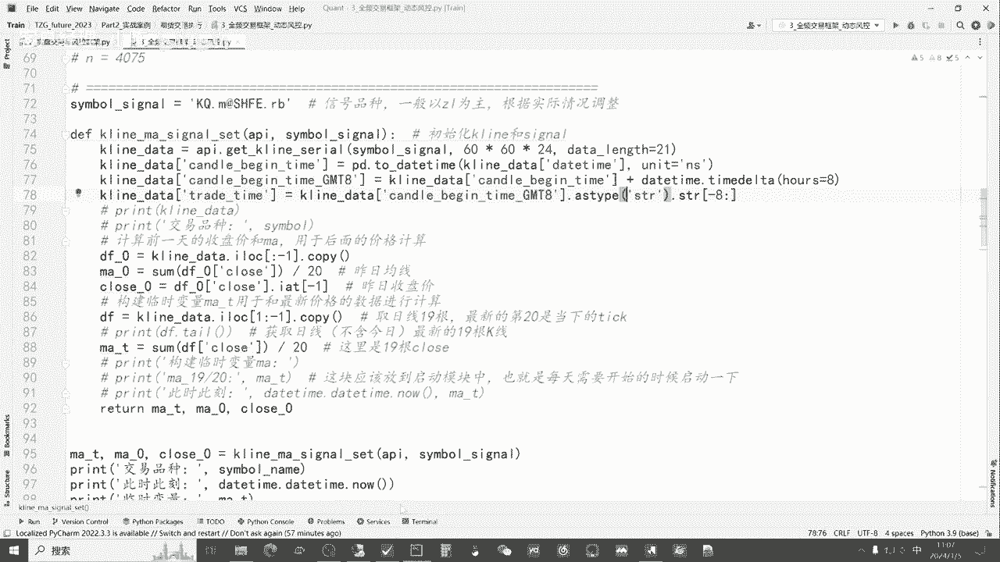
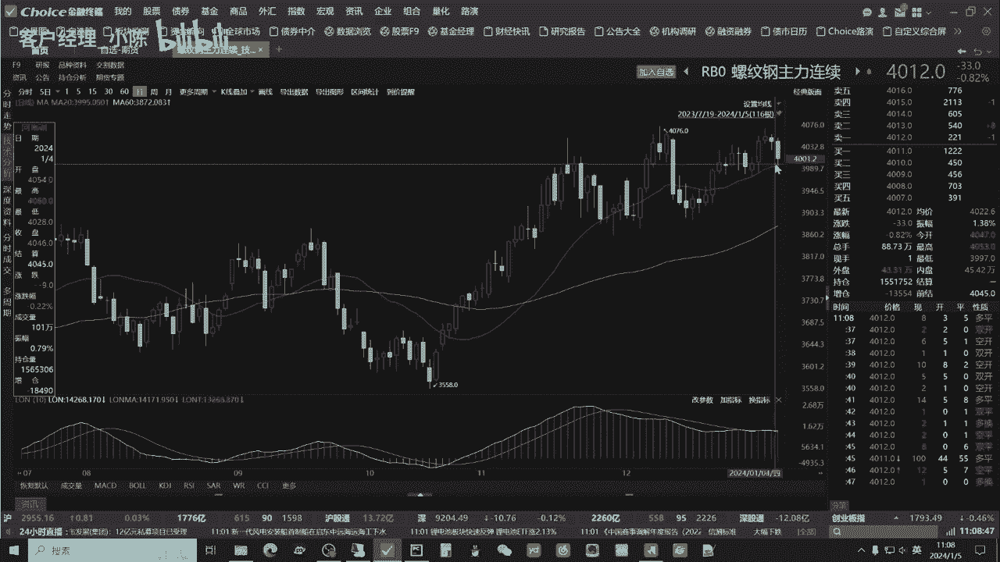
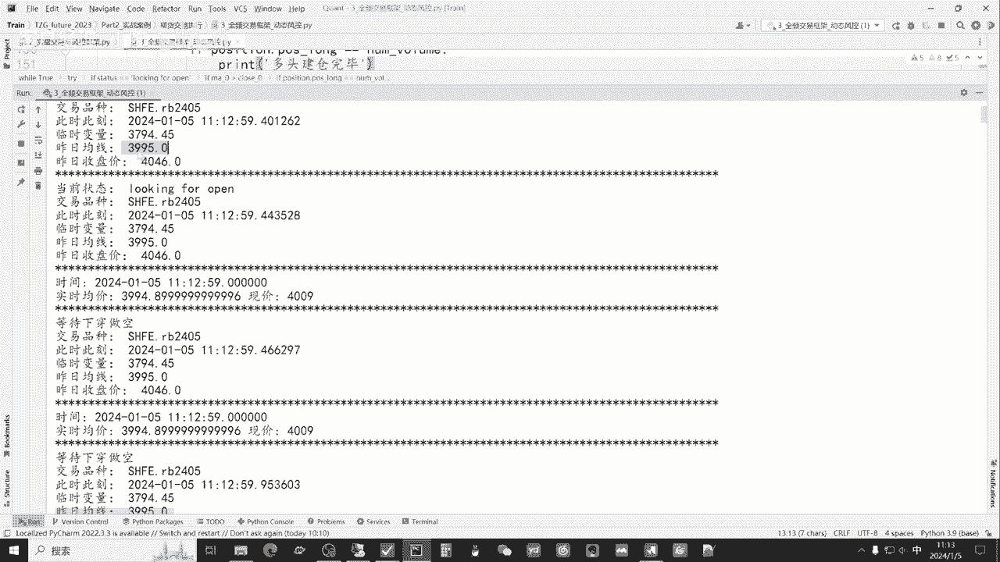
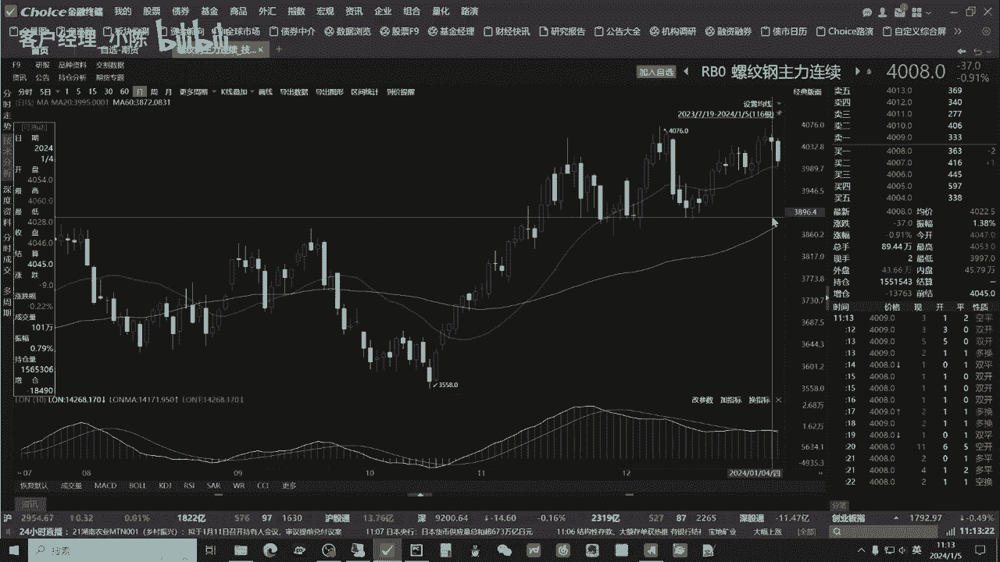
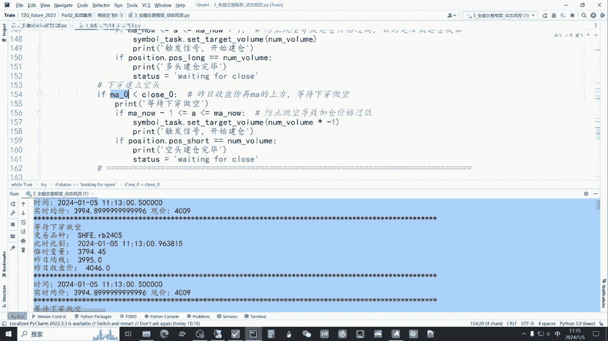
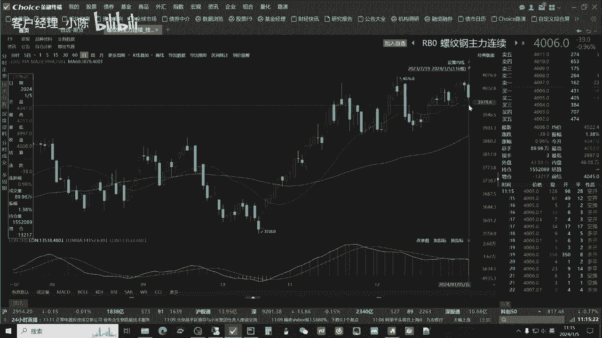
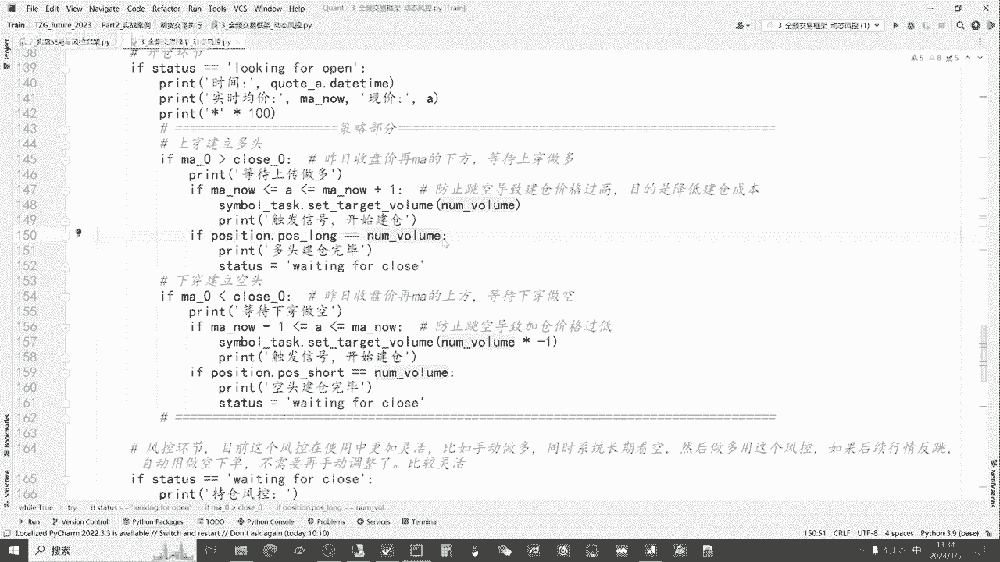

# 从零开始期货量化--天勤：5.3全频交易框架_动态风控 - P1 - 客户经理_小陈 - BV1hisTeoEuk

大家好，我是专注于量化搞钱的佟掌柜，本节课呢作为咱们基础课程的最后一节课，为大家提供全频交易的实盘框架以及动态方控，之所以叫全频交易，就是咱们这套框架适用于日内级别，tick级别的这种高频交易。

同时呢也可以做时序数列，以日线，周线月线的交易是完全没有问题，都可以罩得住的，动态风控呢就是可以根据行情的变化，它的条件在发生转变，也就是说智能的止盈和止损好，我们开始本节课的正式学习。

首先呢我们通过拍charm来打开佟掌柜，future2023这个文件夹，然后点击期货交易执行三全频交易框架，动态风控，我们来具体看一看本节课我们的主要内容，因为咱们之前采用的都是策略，是60日均线。

所以呢本节课呢我们结合咱们的交易框架，咱们做一个20日均线的日成交，然后同时介绍相应的风控条件，我们对上节课呢做一个简单的回顾，咱们的交易框架就是well true，然后呢weight update。

进行数据以及下单，报单返回值的这么一个整体的运算，那么下面主要就是两个环节，第一个就是开仓环节，也就是说在咱们的status等于looking for open，寻找交易机会的同时呢。

我们下面介入我们相应的策略以及条件，也就是我们为什么要下单，那么风控环节就当我们下单之后，检测到我们已经达到了，我们需要持有的仓数和首位，就手术之后我们会进入风控环节，在这里面我们会进行止盈止损。

灵活配置，包括固定吊灯分段都可以，所以这节课呢就是在这个主框架的基础之下，我们通过一个实际的案例向大家介绍，我们如何灵活地去配置相应的，咱们的策略以及风控条件，最后达到咱们全屏交易的这么一个手段和方法。

首先呢我们还是登录我们的API，然后呢进行一个简单的综合配置，这里面呢我们先加一个初步的止盈止损，因为佟掌柜呢比较喜欢做趋势，所以他指定条件会比较长一些，止损对吧，我们先做一个基本的配置。

咱依然是以螺纹钢2405，目前的主联合约为基础，然后呢一手咱进行测试，接下来就是说配置咱们的调仓函数，之前都做过介绍，包括咱们的position，也就是持仓情况，还要查看咱们初步的账户信息。

这里不再赘述，下面咱们就进入咱们的策略的设计，那么我们是以这个螺纹钢主力合约，来计算咱们的交易信号，因为主联合约它相对于连续，如果说我们只是以一个主力合约，那么相应如果说咱计算比较长的。

打个比方就是咱们的这个20日均线，60日均线甚至120日均线，他没有这么多数据，所以咱目前来讲，还是以主联合约来计算它的交易信号，用他的主联的这个2405进行，就是当下的主力合约，咱们进行交易。

咱们既然计算20日，咱们的，均线策略，那么我们要取值的话呢，要取21日，就是取21根，为什么呢。

我们可以看一看，那么如果说今天咱们既然要全屏框架，就要有一个条件，条件就是说当他下穿20日均线的一瞬间，我就要交易，因为原来呢咱们日线数据就是计算完，今天如果说他下穿了，我们是在第二天比看这里对吧。

他上船之后，我们是在第二天的开盘价进行交易，那这样的话由于远离均线太远，后面一旦有行情发生，就是反跳或向下的话呢，我们会容易造成亏损，同时越接近咱的信号策略，那么咱们的建仓成本呢就越有优势。

所以呢结合咱们的日线的策略，再叠加咱们想展示的这种日内交易，所以呢我做了一个综合，让大家可以更好的理解咱们的策略，那么目前策略就是说，如果说他今天在目前运行的盘中，它发生了下穿，一旦下穿。

我就要贴近它的均线进行交易，也就相当于呢每日的这种嗯，tick级别的高频交易逻辑就是这样。

我们看看如何实现的，既然我们要算20日均线，肯定要对前一天，比如说是1月4号进行一个判断，当它的收盘价大于军训的时候，那么下一个条件就是当此时咱日内如果下穿，那么就是做空，反过来，如果说他前面的像这样。

他的前一天的价格收盘价是低于均价的时候呢，第二天如果上传，那么此时我们就在这里均线的附近我就做多，只要上传我就做多，那么我们看看程序是如何实现的，逻辑比较清楚，那程序比较简单。

我们通过这个k line获取21根它的历史数据，首先我们要计算出昨日的均线，也就是我们获取21根，它其中的一根是今天的实时的行情，所以呢我们获取21根，只要把前20根计算出来，就是昨日的均线。

我们来看一下，我们获取21根，那么这行代码意思i lock对吧，从最开始到一，也就是把前20根就是我最后一根，不要我把他的数据拷贝一下，copy一下，我这里面就是用DF0作为一个临时变量。

那么我计算昨日均线呢，就是把相应我们取得前20根的数据，close除以20，这就是昨日的均线，那么昨日的收盘价呢，我们就可以用艾特I艾特I1的方式呢，取前一根好，这样我们就把昨日的这个均线。

和咱相应的收盘价计算出来，方便后面咱计算交易策略，那同时呢我要把今天的实时的这个数据，我们可以看到他的这个均线，我们点击一下，我们可以看到他左边左边这里，其实他的这个均线的数据它会实时变化的。

根据目前的这个收盘价的情况，或目前现在的实时行情的情况，它会不断变化，所以我要计算出它这个变化，我采取的就是先取19根的前19根数据，然后除以20，我们算一个今天临时的MAT。

也就是咱们的临时的均线的数值，后面它要再加上咱们当天，也就是今天它实时的价格，然后的1/20，就形成了简单的移动平均线的值，也就是说这此时咱今天通过ma at，咱们计算出的是实时的均价行情。

然后返回给咱们三个值，接下来就把相应的这些字段输出出来，好我们接下来看基础的准备做好之后呢，我们依然是通过status进行一个初始判断，是否现在如果是空仓的话呢，我们就正式的进入这个环节，就是空仓。

当然我们要寻找机会开仓，那么以下的这个框架在昨天课程已经讲解过，就是当15点和23点收盘的时候，程序会自动关闭他呢，第一是释放了相应的咱们的内存空间，第二个呢就是防止出现后续的。

就是你比如说每日的再重启他，防止咱们程序出现错误，这样比较严谨，而且实盘中的佟掌柜也是这么做的，接下来我们就把获取的这几个数，相应的mat ma0，昨日的这个均线和昨日的收盘价。

我们运用到咱整个的框架里来，我们可以简单的运行一下，然后再结合咱们这些代码，就未来各位老板要做的其实只需要改策略部分，这里面的代码就可以，我们简单的先运行一下，好此时他就输出了，咱可以往最上面开始看。

好最开始的时候他输出了交易品种，然后此时此刻的时间临时变量就是ma at，昨日的均价353995和昨日的收盘价。

我们先看这两个数值好。

我们可以清晰地看到，昨日的收盘价就是4046，均价是3995，我们再对照一下3995，4046，没问题，证明咱的数字计算的是正确的，咱们各位老板，未来在进行策略以及实盘的过程当中呢，一定要就是边写边对。

看看咱们的程序和数据呢是否对得上进，而他马上就转到looking for open，因为此时呢它是没有仓位的，所以此时来讲的话呢，他就正常来寻找仓位，那我们来看一看他此时的这个。

现在的情况啊就是说M0小于close0。

也就是昨日的收盘价在ma的上方，我们通过行情可以看得非常清楚，据说昨日的确是收盘价，从图形上看是高于咱们的均线的，所以呢如果说成交呢一定是向下寻找机会。

也就是说它只会出现做空的情况，所以咱们程序里面可以看它就是这行代码，我们把它再放小一点，也就是说如果昨日均线大于收盘价，那么咱们今天就是等待上穿做多，那么如果昨日呢，它的这个均线小于咱们的收盘价的话呢。

那么就是下穿做空，那么这里面就是把等待下穿做空，然后输出出来，我们可以看下面，那么这里都是等待下穿做空，程序运行和咱们的策略以及实盘的情况，都对得上，所以证明程序到此是没有问题的。

那么这里面呢给大家也是着重的介绍一下，在这里呢佟掌柜呢把它的价格，因为咱们要建仓呢，就是说要贴近，最好是跟咱们的这个嗯均价是一样的，MAN呢我们计算就是通过临时变量，再加上现在的实时行情除以20。

在这里呢我们也可以看一下，他现在的实时行情好，他在不断的变化，我们可以看一看，目前它的实时均价是3994。8，54008，我们简单看一看，好现在4008，然后呢。

咱们看一看这个就是左侧的左上角这个小数字，这个小数字在变化，有鼠叫一变态也变，咱们再看一看，咱看一看他是3994。80，因为右边的行情在不断变嘛，所以咱们底下的这个数据我们可以看一看。

实时均价也是在不断改变的，就根据它的现价，所以呢证明了，咱们此次就是此时的计算也没有问题，为什么在这里要给一个就是说限制呢，第一个咱们先看做空，当他现价小于均价的时候呢，同时前面还有一个要在。

以给他一跳的这么一个限制，他这样的就是设计的作用，就是防止跳空导致价格过低，因为有时候咱们各位老板呢，如果不是说无人值守或自动化不太强的话呢，他有可能在盘中运行咱们的策略，那就会导致比如说这种情况。

如果他向下杀杀的很多了，或者说这种向上的情况，他在这个时间点运行程序的话呢，它本身也会进仓进就建仓进进去，这使咱的价格呢是远高于就是均价的，那么就会违背咱们策略的初衷，所以呢我们给他限制了一个一跳之内。

也就是说如果行情是连续的，那么它贴近就是最好是贴近，甚至说跟咱们的均线是相同的时候，咱们进行建仓，它的好处，就是刚才我们说的目的是降低建仓成本，有时候可能策略是对的，但是由于建仓成本过高呢。

往往导致最后咱们亏钱，所以呢这些小细节都是通过实战经验所得，好我们来看一看啊，接下来，他此时在不断的去刷新这个行情，一旦比如说现价等于实施均价的时候呢，它必然就会发生建仓，也就是说会建一手的空仓。

因为咱们上面最上面设置的就是说，先建一手来进行程序的设计和运算，咱们呢继续让它的程序呢正正常的跑着，我们来继续，下面来看，当我们建仓完毕之后，那自然他会见到waiting for clothes。

也就是持仓的风控阶段，跟昨天的讲解呢，咱们基本一样，重点咱们讲一下分段的风控，那分段的风控的意义在哪里，因为咱们不光是要止损，咱们还要止盈，比如说咱们通过哪一种方式来进行，咱们风控的检测。

我们就通过B等于position，也就相当于呢我们用目前我们持仓盈亏，比如说现在这里面有一手2405，那么我们以它的盈亏来作为呢，咱们整体的判断依据，那它的好处就是说它我不需要判断，是多头还是空空头了。

我们只要判断利润就可以，那这里呢用profit去除以十，因为呢咱们螺纹钢每跳呢是就是每首是十呃，每首是10吨除以十，再除以相应的咱们持仓的手数，比如一手我们得到这个B就是监控他有几跳。

我们分段的空着就可以，这样比如说B如果小于30，也就是说在30的利润以内呢，我们都是20负二十，我们就止损走人，那么当它达到了30~40的时候呢，我们的临时变量lost t呢，我们就变成了二。

他是什么意思，相当于呢有两跳，当它上涨，或者说咱利润涨到了40，有300块钱利润时候呢，它很可能就行情反跳，那这个就相当于调动止损了，那么我们只保留两条利润，那如果涨到40~100之间呢。

我们保持十跳利润如果大于100呢，我们就是40跳在里面，举这样一个例子，那么接下来呢我们通过loss等于max，loss和loss杠T，因为最开始我们设置的就是，初始我们就-20对吧。

loss杠T临时变量，也就是说咱们的止损条件也是-20，当它行情发生了变化的时候，我把这两个值进行对比，我们输出其中的最大值，并赋予给loss，那么当我们的B小于等于loss的时候，这时候是什么意思呢。

就我们就立刻的平仓，也就是我们的仓位就变成零了，此时比如说我们当我们的利润对吧，为40跳和十跳，100跳的时候，那咱自然而然咱的止损条件就变成十了，他呢通过这样一个方式，不仅达到了止损的目的。

同时当他有一定浮盈的时候呢，我们也可以动态的止盈，所以我们通过这种模式的观察，我们就可以非常的清晰的看到，就说虽然咱们的框架是一定的，那么在中间的这些变化还需要细细的构思。

那同样的也可以反应过来咱们的框架呢，它的包容性是十分强大的，各位老板可以根据自己的事诉求呢，实时的去改变咱们的风控条件，都可以做得到好，我们可以看到啊，他现在仍然在这个里面来搜索行情。

我们可以看到寻找开仓的机会，那么我们来看一看如何实现动态风控，我们先把账户转换一下，我们转换一下账户，也就是跟这个账户我们保持一致，这个时候我们就可以看到动态分控的情况，我们再重新运转一下咱们的程序。

好此时你各位老板可以清晰的看到，涨账户转换之后呢，因为呢咱们这里面是有持仓的，目前他是四百一四百二的浮盈，那么在这里面他就进入了当下的风控阶段，我们结合刚才讲的，现在它因为它有420的就相应的利润。

我们可以看到，那么它的风控呢对应的就是十，也就是40跳，他除以十之后是42，也就目前呢它是40跳的这么一个情况，好没有问题，那么他此时咱们是有空仓，我们可以看到空仓成本是4047，空仓一手价差是421。

所以呢对应他的风控条件也就是十，他输出当下风控就是十，好，这就是起到了一个咱们目前可以动态风控的，这么一个情况，我们把它先暂停一下，通过这样的方式，我们就可以非常清晰地看到。

这样的结构我们在策略的部分配置，咱们的日内交易，或者说呢配合日内以及呢咱们的日线，周线都是可以的，未来各位老板在做策略和实盘交易的过程中，只要修改这一部分的代码即可，细心的老板呢一定会发现。

佟掌柜在今天的全屏框架中呢做了一个优化，因为昨天咱们的实盘框架，我们再捋一下，它是通过一个主循环里面套了两个子循环，一个是开仓环节，一个是风控环节，也就是waiting for clothes。

那么它的程序的运转，就说当我们进入主循环的时候呢，我们就寻找开仓，进而呢进行到了开仓的环节，当我们开仓之后呢，会退出第一个开仓的子循环，进而又回到了一个主循环，然后再次进入咱们的风控条件。

也就是风控的子循环，它相当于呢是一个主循环，套了两个子循环，那这样的结构呢上面比和逻辑上比较方便，各位老板进行理解，那他的劣势就在于呢，可能速度呢不会是最快，那么进行优化。

我们在全屏框架里呢就进行了一个优化，也就是说我们只有一个主循环，一个子循环，它的意思就是说我把我相应的开仓的环节，就直接放到了主循环当中，然后当开仓之后呢，他直接进入到咱们风控的子循环。

这样就由原来三个循环之间跳来跳去，变成了两个循环，快速的这么运转和旋转，那这样呢做的好处就是说，如果咱们做高频的量化，会提高咱们相应的交易的和反反应的速度，所以说讲到这里呢，各位老板就已慢慢的会发现呢。

我们在做量化交易，首先是要对咱们的策略以及风控，进行详细的设计以及实盘的实验，最终呢形成咱们自己呢成熟的策略，同时在此基础之上，又要结合咱们日常的交易经验，对咱们整体的框架呢也可以进行优化和改动。

最终的目的都是为了提高效率，以方便我们更好的去赚钱，本节课的精华部分呢，以及结合之前咱们的回测框架和策略，包括咱们目前来讲的实盘交易，就从最初的咱们的数据库建立策略回测，以及呢相应的实盘呢。

我们形成了一个完整的闭环，那么本节课的精华呢，在这节课呢也给大家呢进行了详细的展示，基础的部分，各位老板如果有稍有疑问呢，可以翻看之前的课程，当各位老板呢拿到代码之后，建议呢咱们反复把玩。

深刻地理解了整个框架的运行逻辑，以及其中咱们的策略和风控，它在逻辑以及代码上面是如何实现的基础之上，那么各位老板就可以根据自己的需求，形成自己的策略以及风控条件。

进而呢咱们就可以在实盘中呢更好地运转起来，好本节的课程内容呢到此为止，也欢迎各位老板有问题呢随时联系佟掌柜，感谢大家通过本节课的学习呢。

相信各位老板在量化交易的成功之路上呢，咱们又前进了一步，有任何问题都欢迎大家直接联系佟掌柜，千万不要不好意思，量化呢只是工具，策略才是关键。

