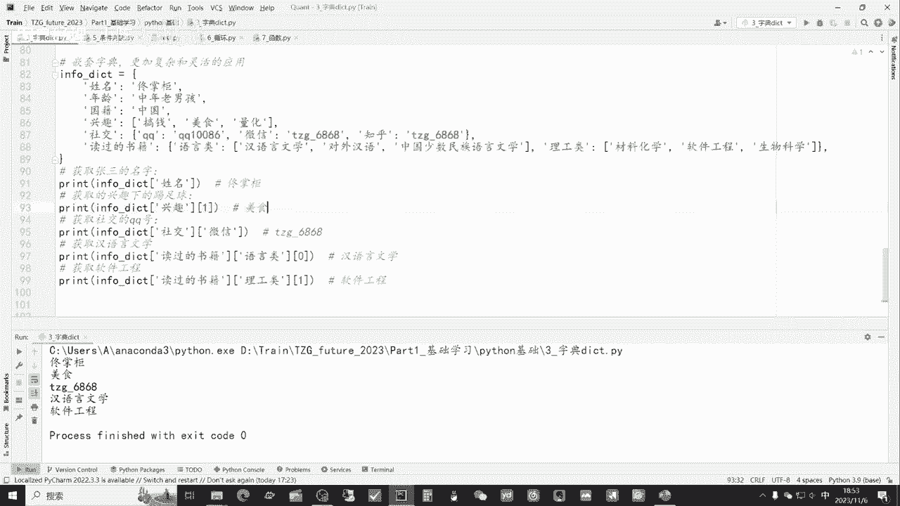

# 从零开始期货量化--天勤：2.3Python中的字典dict - P1 - 客户经理_小陈 - BV1wRsTe2ECA

大家好，我是专注于量化搞钱的佟掌柜，这节课呢咱们继续进行Python基础的讲解，我们来看一看字典，dict它的代码应用。

老规矩，我们还是用py charm打开佟掌柜future，2023这个文件夹，通过fail open，然后点开文件夹，然后呢选择dict就是字典，然后进行我们开始我们的学习，首先我们来看一看啊。

dict究竟是什么，我们创建一下来直观的感受，就是一个dict进行创建，然后我们输出看一看，好他输出的就是这样一个形式，我们可以通过后面实际的案例来，更加切实地感受究竟是什么。

他dict给大伙简单介绍一下，dict呢，它是一系列成对的对象，一个叫key，一个叫value，那么下面的例子呢，咱们首先运行一下，看一看，比如中证1000主联，然后他的这个合约代码是这样一个情况。

就是这样一号一串字符串，一个冒号加上这样一行字符串组成的，这就是一个小的dict，然后呢前面的这个行字符串它代表的就是key，也就是它的这个键位，然后后面呢相对呢对应的就是值，就是对应key的值。

了解了这个DK的基本组成之后呢，我们来看一看它还有哪些特性，首先呢字典呢它是没有顺序的，key不能重复，key是唯一的，我们来举个例子看一看，我们把这行注释呢解开。

这里面我们可以非常清晰的看到有两个key，就有两个键位都是罗尔钢主联，这里面它打印出来显示的是这样一行合约代码，然后这样呢我这里这里面改成的是我是假李逵，我们来看一看，运行一下好。

这回大家可以非常清晰的看到，就是说他螺纹钢主连后面的值改成了，我是假李逵，这说明什么呢，就是说如果它的这个key是一样的，它后面的这个值会把前面进行覆盖，只是显示后面这块新纸，同时呢字典呢还有一个特性。

它是没有顺序的，然后我们来用代码运行一下，它不像咱们上节课所讲的list，它没有顺序呢，如果说咱们运行这行代码，就取它这个灵位的这个呃，咱们就说一组一组字典吧，咱们看一看运行的效果啊，它会报错。

就是说不能取零位置的元素，因为它没有顺序，那么咱们通过这个简单的讲解，到现在呢，大伙就想这个dict就这种字典，它的应用主要是什么，我还是举个例子，它相对的应用就是说把一些，比如说比较大的内容或复杂的。

把它精炼的这个内容提炼出来，就相当于一个小标签一样，如果内容非常多的话呢，可以通过关键字来查找里面很多内容，比如说咱们四大名著对吧，完全都可以放到这个值里面，然后呢把他们的名字放到这个键位当中。

然后当我们要查某一些比如说小说的名称，或者往里面更细致的查找之后呢，我们只要查找这个键位就可以了，我们输出看看好，把这个咱们注释掉好，我们输出看一下，就是说那么它的键位可能就是西游记串台版本，对吧。

他后面的故事内容可以是一，就是很多几10万字的小说是完全没有问题的，那么未来比如说我们要查找，肯定不会是查找这个后面这个小说整个的原版，我们只要查找，比如西游记串台版。

那么后面的小说自动就会给咱们展现出来，这就是说这个咱们字典主要的应用，接下来我们来看一下，就是说相关字典的一些其他的操作，我们可以通过两行代码分别输出它们的key和value。

就这两行代码就可以kiss，然后小括号values，小括号我们输出看一看，好他分别输出了他们的这个key，第二个呢就是说分别把它们整理成这个值，就分别输出，我们呢也可以通过循环的方法进行输出。

我们来看一下，这个循环的功能，会在后面的课程进行详细的讲解，下面现在呢咱先不求甚解的简单看一下，他的意思，就是说把这个key和value，在这个咱们字典的这个呃项目当中。

然后分别打印出key和value，然后进行循环就逐条打印，咱们打印出来看一看，好他逐条打印出来了一个key，一个value，一个key，一个value，这样是一一对应的关系，还可以用这种方法二。

就是item直接把它打印出来，然后后面来讲的话呢，用的就是type type item，咱们看看打印出来它的这个呃，具体的类型是什么，好它是以这种方式打印出来，它的类型是元祖的类型。

然后这两种方式呢都可以把它打印出来，咱们对比一下，看看有什么区别，在这里呢我也加了一个注释，把它解开，也可以更好的看到，就是说两个输出的形式，它们分别的类型究竟是什么，好这是上面的第一个类型。

这是方法一进行了输出，那么输出的所有的这个内容啊，都是string类型，也就是字符串类型，而第二个是元组类型，那么各位小伙伴一定要问对吧，佟掌柜为什么要介绍，就是说不同的这个方法。

那么在后面咱们做这个量化交易的过程中呢，会会根据咱们编程过程中，有时需要就是遇到的问题需要如何解决，采取不同的形式，进而呢保证咱们程序啊就正常的运行，咱们掌握的基本操作越多。

那么未来呢解决问题的方法就越多，更多的就是灵活使用，好接下来咱们来看一看啊，就是说如何来查询相应的通过键位来如何查询，就是相应的值，我们来运行一下这两行代码，一个是什么，就是说你需要查询的这个键位。

比如我要查罗尔钢的主联，也就是查他合约代码，或者说用第二种方式直接加个中括号，然后里面加上这种嗯，把这行字符串儿不要忘了这个冒号，我们来运行一下嗯，好效果是一样的，那如果我们查询的这个key他不在里面。

也就是说在咱们的这个字典中，是没有查询的这个字段的，它可能会产生，就是说什么样的情况呢，我们仍然是两种方式，我们试一下，好咱们可以看到啊，其实第一种方式它没有这样的，就是key它会返回一个NN值。

告诉你是没有，那么第二种方式呢，他直接就报错了，它报错也是key error对吧，是这种情况，其实它的情况是一样的，也是没有对吧，那么这两个代码的作用，就是说第一个它会给你一个返回值。

而这个第二个这种方式它是直接报错的，接下来我们来看一看啊，如何添加与修改相应的这个key和value，那么它的基本形式就是属于这个嗯字典，然后呢在这中括号加入key，然后后面的是value。

加上新的这个value值好，我们把前面的这个也同样的打印，然后后面我们来直接添加，比如说我们把这个玻璃珠联添加上，看看后面的新的这个字典，它有什么变化，好咱们就是说原来的这个主联的。

原来的咱们的这个字典是这样一个形式，然后新添加的玻璃主联，在这个就是说后面它是完全给添加上的，接下来呢我们看一看方法二，方法二呢是用这个update的方式进行添加，同时它还有一个功能，就说进行修改。

咱们把这个最先最最最初的这个字典，然后刚才添加完玻璃主联的这个字典，以及这个添加和修改之后的，咱们都打印出来，对比一下好，这里就可以非常清晰的看到了，这是最初的这个咱们的字典，然后呢添加了玻璃主联。

然后又通过update的方式呢把佟掌柜给添加进去，同时呢又通过这个update玻璃主连，我是玻璃，最后这个就说对原来的其中的一，些元素进行了修改，既然有这个添加和修改的功能呢，同时也会有删除的功能。

我们来看一下，先把他们注释掉，我们来看看如何删除，就通过pop，然后删除key的方式，好我们仍然是把原来的这个字典和新就删除完，棉花主联的字典同时打印出来，看一眼，好，非常直观的，看来，就是说。

这个原版的原始数据里面是有棉花竹联的，而新版的数据通过pop的方式，已经把棉花主连给删除了，接下来我们来看一看啊，就是说判断有哪些这个键位，是不是在咱们原来的这个DK当中，比如说中正1000主联。

第二个就是书中自有颜如玉，颜如玉，看看在不在咱们自己的这个DK当中，咱们运行一下，好分清，非常清晰的看到对吧，然后呢中正1000主联是在的而言，入使不在的，所以一个是true，一个是false。

以上呢就是说咱们字典DK的主要知识，以及一些主要的应用，那么后续的在咱们量化交易过程中呢，重点还是在于零和应用，下面呢，我们通过一个就是说可能相对更为复杂的例子，咱们来直观地感受一下如何就是灵活使用。

咱们先对上面进行一个注释，好这个新的例子呢相对会复杂一点，首先呢从最外面来看啊，这是你看他这个拍charm的好处，就是说自动给你标识出来了，然后这里面就是说首先这是一个大字典，然后字典里面的一个键。

包括直键值，键值，这些呢都是组成一组一组的，后面我们可以看到啊，就是说剑是这样的，而它的值呢是一个list，然后这个呢就更加复杂一点对吧，它的键就是string类型，后面呢又是一个小的字典。

也就是字典里面实际上是可以套字典的，那么再往下看对吧，又是一个键，那么里面套了字典，结果字典里面呢又套list，是这样逐级深入的这么一个呃结构，然后我们可都可以运行一下，然后呢咱们首先看一看啊。

就说首先这个字典我们通过这个键位要查找，咱们再想一想他应该输出什么，直接应该输出的就是佟掌柜，对吧，有键位，然后直是佟掌柜，然后呢后面的兴趣兴趣有很多，因为后面兴趣是一个。

就是说他肯定输出的是一个list，我只要选其中的一个呢，比如说是一，还记得上节课吗，一的键位应该对应什么，应该对应的是美食，然后后面呢这个方式呢，就首先还是通过先找社交好，找到了社交对吧。

然后又进入到下一层的list，他又输入一个键位，微信好，我们看看，那他应该输出的就是佟掌柜，下划线6868，那后面的这个就是说读过的书籍，我们仍然是一层层，就像剥洋葱一样对吧，那么到这里来讲呢。

大伙儿可以非常清晰的看到，其实编程啊就是说什么逻辑性非常强，然后呢很多时候都是逐层深入的，然后一方面是向里，另一方面也是向外，然后通过这种层层深入，然后把咱们需要解决的问题呢，然后逐步解决好。

咱们还是回到这里啊，读过的书籍好，找到读过的书籍，语言类那里面又是个dict，咱们可以看到找到了语言类，那下一层的值呢，这个时候输出的其实是一个list，然后里面灵位，那应该是汉语言文学。

下面的这个方式一样，读过的书籍理工类，然后呢查找一，那么应该是这个位置，那应该是软件工程，好我们呢通过刚才帮助大家呢，整体理整理了一下逻辑，然后呢把可能的答案咱们写出来，然后咱们正式运行一下。

看看对不对，我们看看啊，佟掌柜好，第一个对得上美食，OK然后这个佟掌柜6868没有问题，汉语言文学软件工程，那么通过刚才的展示，目的就是说什么呢，咱们编程的好处就是它不怕错误，它可以无数次的这么试验。

这么循环，你通过就说不断的这么尝试，把你自己在这个就对于代码的理解，以及其中的逻辑要完完全全的整理清楚，这样的话呢才能保证，就是说才能就是说你自己心里有数，这个知识我是完全掌握并且能灵活运用的。

到此呢就是本节课的全部内容。

感谢大家通过本节课的学习呢，相信各位老板在量化交易的成功之路上呢，咱们又前进了一步，有任何问题都欢迎大家直接联系佟掌柜，千万不要不好意思，量化呢只是工具。

策略才是关键。