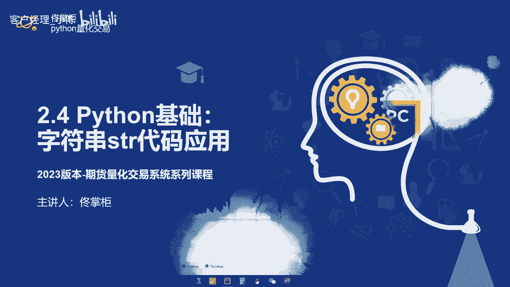
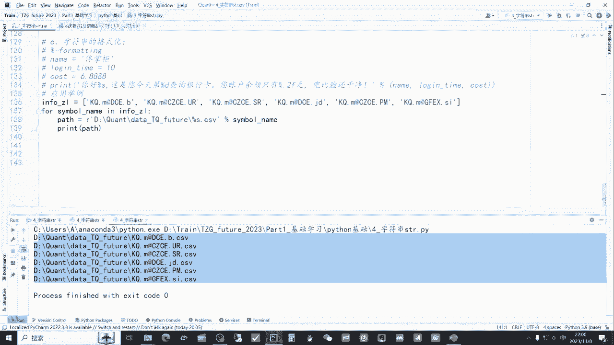

# 从零开始期货量化--天勤：2.4Python中的字符串str - P1 - 客户经理_小陈 - BV1vusMeKEL5

大家好，我是专注于量化搞钱的佟掌柜，这节课呢我们继续Python的学习，我们来学习一下字符串string，它的相关知识以及代码应用。

依然是老规矩，我们通过拍char来点开佟掌柜future，2023这个文件夹，通过file open的方式打开这个文件夹，然后呢选择string打开这个文档，我们来开始今天的课程学习。

我们首先来看一看啊，就是说本节课的内容，首先就是说什么是字符串，然后呢包括它的这个函数，拼接大小写转换，常用的检索方法，字符串的分割修剪以及格式化，通过这几个内容的应用和讲解呢。

我们来具体了解一下字符串的应用，好我们首先来看看什么是字符串，我们通过这个代码的方式，其实字符串呢就是说相当于在这个就是说呃，咱们看单引号和双引号之间，这些组成就是字符串，我们把它打印出来。

通过打印出来我们可以直观的感受，比如说string1对吧，佟掌柜微信，然后是这样的一个情况，然后呢二呢这是一个双引号，然后他直接打印出来就是we love money。

然后呢三呢它打印出来有list这种形式的，有这个呃，上面上上次课程，咱们学的就是说字典的形式，还有这个巴拉巴拉，这一串其实呢它字符串的意思就是说呢，在这个就是双引号或者单引号之间呢，咱们所见即所得。

包括空格也是一样对吧，你给他什么，他就帮你输出什么好，接下来我们来看一看啊，什么是拼接，我们把这些代码注释掉，好我们首先运行一下来看一看啊，佟掌柜热爱搞钱，那么首先呢这个list value。

它就里面呢包含的其实三个元素，一个是佟掌柜热爱搞钱，它分别是三个元素，然后通过这个drawn的这个函数对吧，然后呢还有就是说这个方式它里面什么都没有，什么都没有，就是说他之间就是不加任何的东西。

然后呢把它们粘合到一起，然后呢我们打印出来就是这样一个形式，就佟掌柜热爱搞钱，那么当然还有其他的几种方式，我们全部都打了，输出一下，看一看，哦第一个方式这个加了一个点儿，我把它去掉好。

第二个呢我们可以看到，就比如说3w i love money com对吧，我们通过这个加了一个点的方式，就是通过这个点把它粘合到一起呢，它能形成一个网址，那么第三个方式，就是说我们在中间呢加入一个斜杠。

然后呢grade is good，那么它中间会有斜杠，这就是说通过这些代码，然后我们可以将就是说提供的list，或者就用元组的形式呢将它粘合到一起，接下来呢我们来看一看啊，什么是这个字符串的转义符。

我们依然是用这些代码进行讲解，我们可以首先输出一下，比如说第一个就是what is up，因为大伙都知道，就说嗯字符串它主要是在这个引号之间，然后输出，那么如果说想输出what's up。

这种方式里面有一个引号，那么我们就需要用这个反斜杠的转义符，然后为什么要用转义符呢，如果说没有这个转义符，我们把它就是说咱们delete掉对吧，包括咱们都delete了，你会发现它会出现红色的波浪线。

就是打印不出来，咱们试一试，啊他就报错了，就在这边，他就告诉你有这种语法性的错误，为什么呢，就是说它相当于这个额和这个两个是成对儿的，然后这样的话呢，就是说只能打印出what，但是is up打印不出来。

那么如何把这个后面打印出来呢，我们就需要用这种转义符的形式，就加这么一个这个呃反斜杠，他就在这个就是说引号的时候，单引号的话呢他就依然是所见即所得，后面的这个呢，就是说他的意思相当于tap符号对吧。

我们还是打印出来看一看好，我们看出来what's up给你打印出来，同时呢后面有一个这个反斜杠T，那后面他是有两个空格，相当于对吧，非常清晰的能够看到，那下面因为后面他没有反斜杠T。

它后面是没有东西的对吧，后面就不会有亮光，就是说咱们就没法选取，那么下面这个两个反斜杠，那他只出出了一个反斜杠对吧，因为本身转义符的意思，就是说把后面的就是呃内容，以字符串的形式输出对吧。

下面这个加了一个R，加了一个R呢，它的作用是什么呢，相当于就是说在里面的这个反斜杠，它的意义就没有了，而是把它们就统一当成一个字符串打印出来，那为什么要就说举这个例子，尤其是在这个就是加R的这种方式。

我给大家举一个例子就能清楚了，因为啊咱们未来在做这个，咱们可以看啊这这两块，因为未来咱们在做数据库的时候，不管是说提取数据或者保存数据，咱经常会用到这个就是地址，也就是path咱经常会用到用到这个地址。

那么地址中呢就是说大家可以清晰看到，就是有很多的反斜杠，所以呢我们在持就是如果说不加二的话呢，它有时候就会变成类似于转义符的这种作用，当然有时候也会不变，那么加一个R9比较保险。

这样的话我们就可以把地址啊输出出来，这样就非常清晰，就是未来的数据呢就可以清晰的保存到，就是相应的这个地址下的文件当中，它主要起到就是这样一个作用，然后呢接下来呢咱们来看一看啊，字符串的选取。

它就相当于把字符串当成list，跟历史的操作呢几乎是一样的，我们来看一看，首先呢比如说name就是佟掌柜I量化，然后呢在name里面我们选取第零位，那么应该是同，那么第二行。

比如选取就是说嗯到第四个位置，这个咱们在历史上详细讲过，就说他的第零位，第四位都代表什么，那么就相当于数四个数，同掌柜按应该输出到这儿，佟掌柜按对吧，这个里面呢应该是从第二位，那就是佟掌柜，这是012。

贵艾应该是贵爱量化，也就是第三行输出的第四行呢就是说LEN，LEN呢就是说它的长度，这一共是六个字，那应该输出的是六，然后呢这个这行的意思就是输出是最后一个字，也就是画好我们整体输出来对照一下。

没有问题，零位对应的是铜，第一个咱们是铜，第二个呢从最开始到就说第四，第四个位置1234，因为这个是后面他是几，就代表第几个位置，那么佟掌柜爱就是这样，然后呢二他是012贵爱量化就是从这到最后。

然后第三个第四个就是说呢它一共长度是六个，最后一个就是说咱输出的是最后一个元素，那么看完了就是说它的整体操作，就是说他的操作跟list基本上是一样的，好现在我们讲一讲。

就是说它的大小写转换大概有几种特殊的方法，也比较有意思，相对比较灵活，我们还是通过代码整体运行一下，因为呢咱们通过基础，比如string0，咱给了一个i love Python，其中的既有大写也有小写。

我们来看一看这几种方法，第一种方法通过这个apple的方式，它将小写的字母全部转化为大写字母，那么第二个方法呢是lower的方式，他却将大写的字母呢转化成小写的字母，第三种方式叫title。

他是将所有的就是单词的首字母进行大写，其余小写，第四个是capitalize，将字符串的第一个字母字符串转为大写，其它都小写，还有一个这个swap应该是swap case，将字符串中的大写转化成小写。

小写转换成大写，好，咱们通过还是通过这个代码举例，就i love Python，既有大写又小写，再结合上面的方法，我们来运行一下，看一看，把上面哦注释一下，注释掉，再重新运行一下，OK我们可以看到了。

就说第一个upper好，全部都是大写的，第二个lower全部都是小写的，第三个title，咱们把所有单词的首字母ILP都是大写，没有问题，第四个方法就是说将字符串第一个字母大写，这整个是一个字符串。

第一个字母就是I只有I大写，第五个方法就是大写转小写，小写转大写好，可以清晰的看到，因为是Python嘛，咱们最开始给的这个最初的变量，那么只有P是大写，而到了最后一个的话，它就是只有P是小写。

这样就实现了，就是说整个这个嗯字符串里面的大小写的转换，接下来呢咱们讲一讲，就是说他常用的一些检索的方法，仍然用代码举例对啊，我们可以看到啊，就是count，count其实就是数数嘛。

然后咱string等于i love Python对吧，我们可以看看第一个O在里面出现过几次，小P出现过几次，那么直观的发现就是O出现过两次对吧，所以输出的是二而P呢他就一次也没有出现过，因为这是小P。

所以他分大小写的，那么他这里就是零好，我们现在来看一看这个index的用法，他的意思就是说查找某字符串里是否包含，被查询的子字符串，仍然通过这个代码的例子，我们来运行一下好第一个呢咱们查P它。

咱们就是说跟list的意思是相关的，咱们可以数啊，零一，2345啊，正好在第五个位置，所以它输出的是五，不仅呢他输出了，它就是含有这个大写的P，同时呢把他的位置输出了那么大写的X，因为是不存在的。

所以这里面就报错了，然后我们来看看这个start with和answer with，它们俩的用法是什么，他的意思就是说，咱们的字符串是不是以某一个字符对吧，作为开始，比如说i love Python。

它的第一个大写字母是I的大写，那么它的开始就是以大爱为开始，那么O肯定是不对的，所以说呢第一个应该输的输出的是true，就是为真，第二个呢就是说他应该是为甲，咱们试一下，好输出的就是说一个是true。

一个是false，没有问题，那么相应的有开头的判断，就有结尾的判断，像既然有start with，就会有answer with对吧，我们来看一看i love Python，它的结束是不是以N结束对吧。

或者是以O结束，那么咱们直观的可以看到第一个肯定也是true，而第二个应该是false，好整体输出是这个样子，没有问题，我们来看一看啊，字符串的分割究竟是什么，它字符串的分割，就是说。

split用这个方式对这个字符串呢进行切割，什么是切割呢，我们可以看啊，比如说我圈起来就是我爱你，Python对吧，这一长串包括中间的空格，咱们可以相当于把它当成一个面包，然后呢对它进行切割。

就把它切开切片，我们来运行一下，哦把前面还是咱们重新运行一下好，那么比如说split里面什么都不填，它以什么进行切割呢，它是以这个空格，咱们可以看到对吧，他会把这个string切成了什么。

切成了一个list，把其中的每一个元素放进去对吧，空格变成了逗号，变成了我爱你，PY这个THON大概是这样对吧，这里面呢给大家介绍一下，就是说它split里面加的是分隔符，然后后面还可以加分格次数。

你像第二个，比如说我老爱你了，老拍老森，就这种，如果呢它咱们是以老来切割，那么就通过这个把这老去掉，因为后面的次数是三次，所以咱们可以看到就是把只要有老的地方，他就给你切，那么我把这老去掉。

就是爱你了对吧，这里又有一个老，又切一下，下面就是PY，然后又有一个老，那后面是森对吧，T h o n，他帮你切好，咱们可以试试啊，如果是二，咱们可以看到就说他只切了两次，第三次呢他没有切对啊。

所以后面讲的是分隔次数，而且呢split呢咱们可以看啊，这行解释就是它默认的是切空格对吧，同时呢就这个分隔符可以代表什么，里面有空格，还有这个反斜杠T，反斜杠N和反斜杠R，各位感兴趣的小伙伴可以呢。

就是说查一查这几个符号究竟代表什么，非常容易也算留一个脑筋小急转弯吧，然后咱们正常得用一下，之前佟掌柜给大家提供的网站对吧，锻炼一下咱自己的自学能力好，咱们还是用这个来举例，刚才呢因为它默认的是空格。

那我把相应的这几个符都放进去，咱们看一看，最后打印出来是什么呢，哎依然是我爱你，PYTHON这几个说明什么，它默认的是这个分隔符，默认的是空格，那同时如果是其他的这种分隔符，他就依然会把他们。

就是说作为一个就是切割的方式，也会把它们切掉，好接下来我们来讲解一下这个字符串的修剪，通过这个strip的方式呢，比如说您看咱们看这行字符串对吧，它其实呢在这个里面有内容的情况之下呢，它前后都有空格。

都是有空格的，通过strip的方式呢，我们可以把它前后的空格中间它是消不掉，但是可以把它的前和后的空格呢帮你消掉，我们来打印出来看一看，好第一个呢就是原版的，就是说呢他前后咱们看捋一下，有两个空格。

那么后面呢因为把它的通过strip的方式呢，把它前后空格消掉之后呢，后面是没有的，是是选不出来的，拉不出来的对吧，咱们可以看的非常清晰，大概是这个样子，接下来我们来看一看啊，字符串相加和相乘的操作。

咱们看看三个字符串，刘备关羽张飞，我们把他哥仨加起来，看看是怎么样的输出，同时呢把刘备乘以十，然后最后呢就是说乘号乘以100，我们输出看一看好第一个就是哥仨加一块，刘备关飞张羽形成一个长的字符串。

然后后面就是说刘备乘以十，那不就是相当于复制了十次嘛，然后连成一个长的字符串，下面这个就是说把乘号乘以100，那么它起到的作用呢更多就是一个修饰的作用，为了隔离，然后我们后面看的比较好看一些。

接下来呢我们来看一看判断对吧，仍然是用例子来举举例，就比如说佟掌柜，我们看看铜是不是在这个呃变量当中，name当中，C是不是在name当中，我们直接可以观观看，观看到就是说同是在的，所以是true。

然后scene，那么就是false，好的一真一假也没有问题，接下来呢我们来看一看啊，就是说如何在这个string字符串里面进行替换，我们第一个来看啊，佟掌柜很丑，然后我们来替换一下。

就用点replace的方式，前面渐入被替换的值，后面换成就是你想要替换的值好，就一行代码就可以把佟掌柜变帅了，就把丑变成帅，同时底下呢把这个佟掌柜，佟掌柜爱量化呢变成把佟掌柜变成李老板，我们输出一下哇。

非常神奇的事情发生了，佟掌柜用一行代码就变帅了，后面就是李老板，李老板很爱量化，讲到这里呢，相信各位老板都会有一个疑问，我们来学习了这么多字符串的操作，我们的作用和意义在哪里，那么它主要的意义就是在于。

比如说咱们举个例子，未来咱建立自己的数据库，那么可能数据呢会从，就是说不同的网址或不同的渠道过来，那么咱们就需要通过这种字符串，或者各方面其他的操作，将这个不统一的这个数据标准呢。

统一成咱们所需要的样子，那么简而言之，其实就是说什么呢，咱们字符串的操作以及其他的这种基本操作，就是为了实现整个这个数据，以及未来咱们输出一些格式的标准化，起到了清洗和整理的这么一个作用。

我们来看一看啊，字符串的格式化的应用，他这个应用呢，后续呢咱们在应用中也会经常使用到，我们依然通过举例子的方式，首先呢我们设几个变量啊，Name，然后是佟掌柜，然后呢login time对吧。

几次十次cost对吧，6。8888对吧，大概咱们设几个变量，我们看一看啊，下面咱们输入的输出，这里面是个字符串，然后我们通过这个这种形式对吧，百分号第一个是S，第二个呢套的是D。

第三个是点2F百百分号这种形式，后续呢我们通过一个百分号进行连接对啊，比如把name这些变量log time和cos放到里面去，咱们看看输出是什么，好他输出，你好，佟掌柜，这是你今天第十次查询银行卡。

您银行余额只有六块八毛九，兜比脸还干净对吧，他的意思就是说呢相当于呢把name放到了这里，第一个部分就是说这个百分S，然后把log time，login time放到了这个百分号D的这里。

然后呢把cost放到了百分号点2F这里是吧，进而呢看你看它就自动的输出了，那么像这个呢细心的小伙伴一定可以看到，就点2F是什么意思，因为咱们给他的是六点，后面是四个八对吧，是这个小数点，后面四位2F呢。

就强制的把它就相当于四舍五入，保留两位非常的智能，我们还是通过一个这个实际的应用举例，来看一看具体的应用对吧，举个例子咱仍然是在数据库的建立当中，打个比方，info主联对吧，ZL主联他呢是后面。

这就是123456这几个合约对吧，我要下载这几个就是啊合约的数据，我们可以通过这个什么的方式呢，就可以通过这个for循环的方式，把每一个他的合约，最后要保存到相应的地址当中对吧。

如果我一个一个这样就输入，可能我要写五个对吧，甚至如果后面比如70个，如果4000只股票的话，我不可能写4000遍，但是我通过就是说这种循环加上这个字符串，格式化的，就这种百分号的形式呢。

我只要写这样一行代码就可以了，非常的方便给大家呢输出来看一看，好123456对吧，把六个合约他全部输出出来，只需要通过这种短短的几行代码，它即使是几千个几万个，就是说合约就是咱们需要的数据的话。

只需要在这个list里面进行添加就完了，就至此呢大伙就可以看到啊，虽然有这么多的操作，它每一个操作代码的应用，都会对应的一个非常实际的问题，最终呢它整体的目的呢也是为了帮咱们更好。

更高效的解决编程中的这些具体的问题，好本节课呢咱们就到此结束。

感谢大家，通过本节课的学习呢，相信各位老板在量化交易的成功之路上呢，咱们又前进了一步，有任何问题都欢迎大家直接联系佟掌柜，千万不要不好意思，量化呢只是工具，策略才是关键。

