# 从零开始期货量化--天勤：4.0数据获取与神奇的API - P1 - 客户经理_小陈 - BV1gisTefErB

大家好，我是专注于量化稿前的佟掌柜，咱们第四章节呢，主要学习数据库的建立与策略回测，从本章节开始呢，我们就正式进入了量化交易的实战，然后我们首先来看一看数据获取与神奇的API。

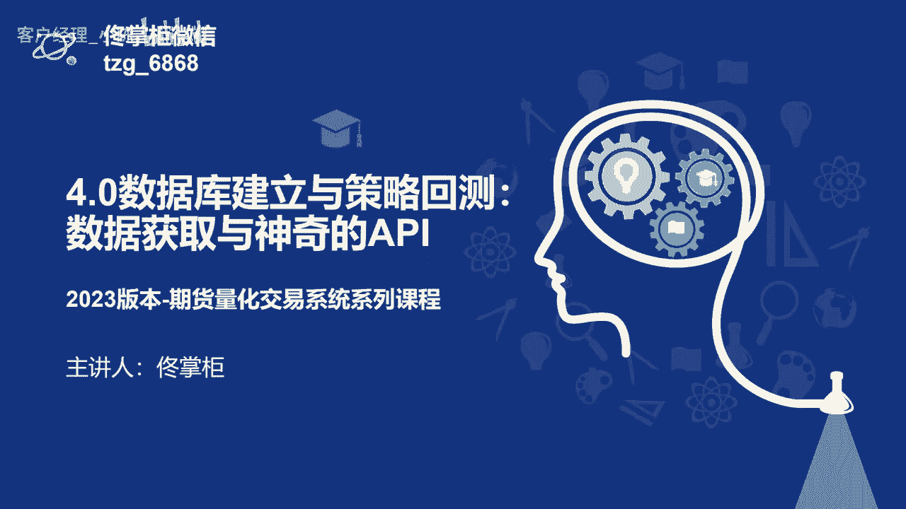

那么量化交易呢那最关键的就是自动化，那么如何实现自动化，我们需要哪些条件，其实主要呢就是进行三方面的工作，首先是数据的获取，然后就是计算分析，最后呢在此基础之上呢，咱们就进行自动交易，那么数据的获取呢。

我们有历史数据和实时数据，历史数据呢我们主要就是进行策略的回测，而实时数据呢就是计算在实盘当中计算signal，也就是交易信号，当产生了交易信号之后呢，我们就要进行下单，并对这个成交进行一个。

就是他的这个信息的反馈，然后我们就知道下单成功了，不管是买还是卖还是平仓或开仓，进而呢，就是说最后就是对咱们的整个账户，进行查看和管理，基本上呢把这三个部分做好之后呢，就可以实现自动化的条件。

也就是能进行完整的量化交易。

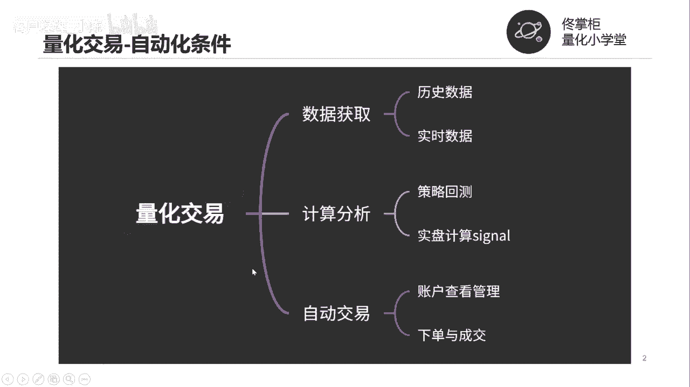

目前呢咱期货软件的底层呢都是CDPCCTP，什么呢，CCTP简单的来说它就是期货的交易通道，它是由上海期货信息技术有限公司开发的，那么上海呢这个期货信息有限公司呢，它就是上期所的全资子公司。

可以说是系出名门，然后他的这个总体的全称就叫综合交易平台，实际上呢它就是一整套的，期货经纪业务的管理系统，主要由三个部分组成，就是交易风险控制和结算，那么像咱们现在用的就是这个目前的所有的。

像咱们期货软件啊，或者说行情软件都是基于这一套系统，就是CCTP系统。

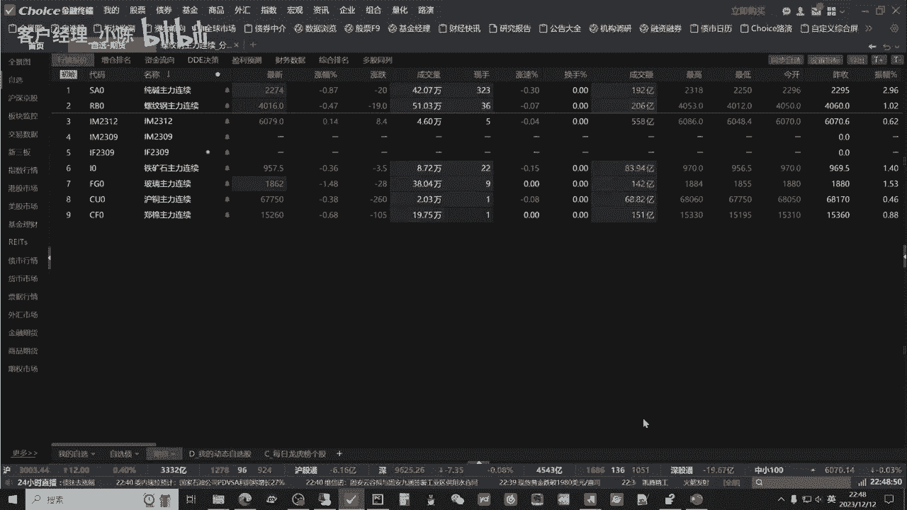

我们来看一看啊，它主要就是，就是这个就开发的目录和文档对吧，客户端开发指南是基于整体的交易规则，就这套软件规则，基于这整体的软件规则来进行开发，相应的系统，包括它的API。

我们可以看到主要其实就两个两块，一块是咱们的这个行情接口，一块是交易接口，我们可以简单看一眼，这是它的源代码，那么目前不管是这个交易软件也好，还是咱们后面要进行的这个嗯，咱们Python的交易框架。

都是基于这一整套的API的基础之上，进行二次开发和完善。

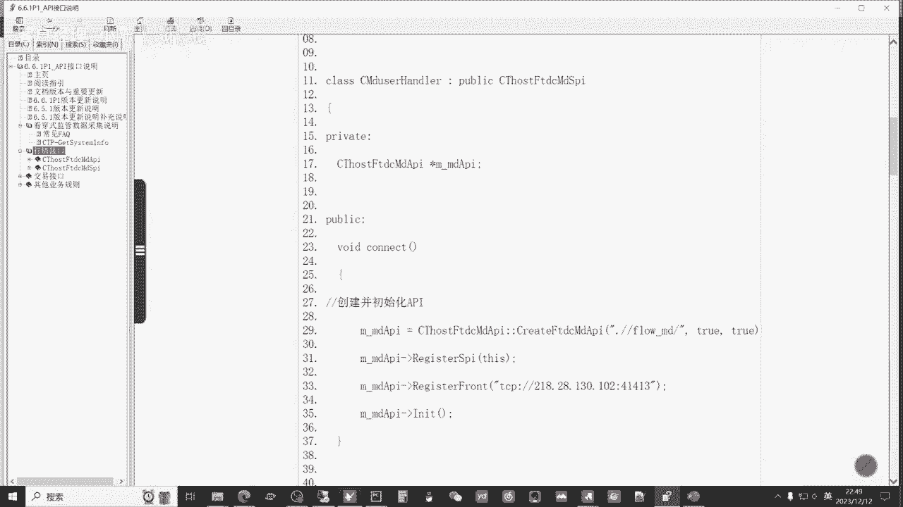

那么所有的包括这个行情的交互啊，以及未来的下单呢。

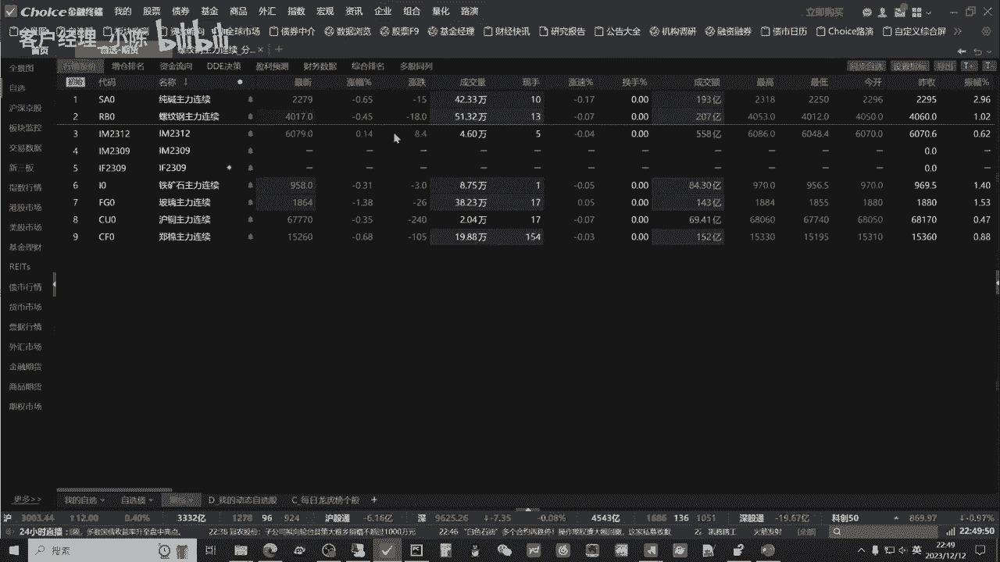

也是基于整体的这一套规则来进行的，有了咱们的CCTP之后呢，咱们就可以获取相应的行情，以及进行下单的交易处理，那么有一个问题就是在于呢，CTP他的问题就在于它是非常基础，或者说呢底层的这么一套程序逻辑。

包括它提供的API，有行情的接口，然后呢交易的接口我们可以简单的看一下，他用的是C加加进行编写的，因为咱们做量化交易呢，重点和未来的核心还是在于策略的研究，我不可能就是说咱们为了做量化交易。

又把自己培养成一个程序员，这样的时间太长，而且呢学习成本也比较高，那么如何解决这个问题，我们就可以用拿来主义和使用现有的轮子，然后呢现成的API他的意思就是说什么呢，肯定咱们做量化交易的。

咱们不是第一个人，那么之前的前人他们是如何解决这样一个问题，那么市场上就会有比较成熟的解决方案，咱们把这些方案呢拿过来直接使用就可以了，我们可以直观的感受一下API的魅力。

我们呢还是通过这个拍charm，然后呢打开佟掌柜future2023这个文件夹，用file open的方式，然后呢打开文件夹之后，我们来选取，就是说咱们的实战案例，然后呢期货日线数据构建V2第二个版本。

然后呢点这个APITQ演示与讲解好，我们首先来直观感受一下，就说API的魅力，那么在这里呢我们用的是天琴的API，我们把相应的这个他的文档放到这里，方便大家去读取，就是这样一个情况。

我们先直观的运行一下程序，让大家对这个API有一个直观的了解，那么首先就是登录，输入你的账号，然后呢我们可以先看一下获取账户的信息，对啊我们三个功能，一个就是说我们可以看一看，我们获取账户的信息。

那么这一个就代表它是模拟模拟账号，然后呢还有一个订阅行情，其实各位老板非常清晰的也可以看到，基本上啊，就是你给他一个就是咱们需要的品种的名称，然后一行代码我们就可以获取行情，那下面就是K线的处理。

大概这个三个演示，我们把它一并打印出来看一看，好我们运行一下。

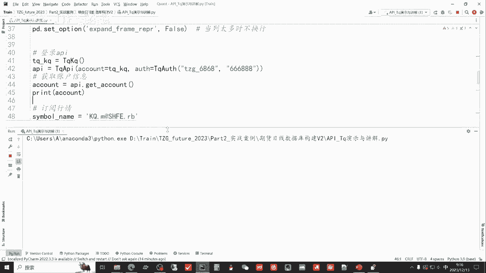

我们先拉到最上方，他会告诉你这边使用天琴，然后呢已经代表登录成功，我们首先看一看我们的账户信息，我们用这个小图标最左边的这个soft web，这样了就可以把它就是在后面的这个数据，如果你看我们点开它。

就是后面要拉拉底下这个进度条，然后呢我们点击一下这个，就可以把它整个的罗列下来，这个时候呢第一个呢我们是account，account是API，Get account，非常直观。

就是获取咱们的账户的信息，然后把这个账户呢打印出来，这个时候其实第一个就是蓝色的部分，这里面就是咱们的账户信息，我们可以看到对吧，Currency c n y，也就是人民币pre balance。

就之前比如说前一天咱们里面有多少钱，现在是零，static balance对吧，目前咱们有多少钱balance，现在你是有多少钱，available就可用值多少钱，那么后续咱们所做的所有的处理。

都是说从这里面给咱们的基础的数据，提取相应的字段，然后再进行再处理，那么第二个咱们可以看到，这相当于也是一个字典里面，他就是说给到咱们的，就是说是咱们的最新的行情，比如刚才咱们运行的时候。

就是是12月13号对吧，09：16分56，这个时候呢就是说已经是开盘了，咱们用的还是这个2B，也就是说螺纹钢的主连数据，我们可以打开软件看一看，好我们打开螺纹钢的主连。

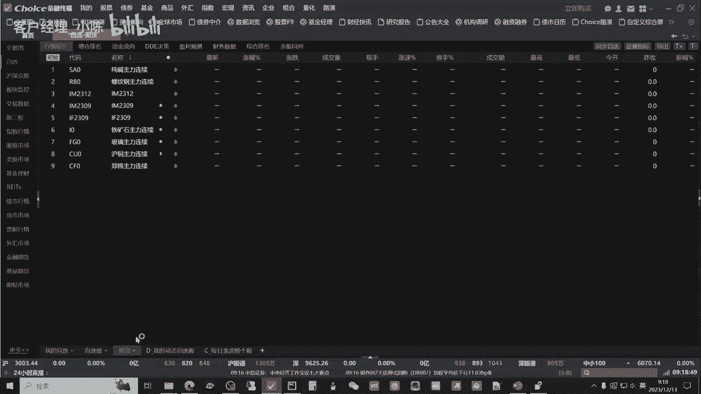

这里面有买一卖一卖二卖三卖五，那么同样这里面它有ask price one的price1，其实这个就是卖一，那么有卖一有相应的他这个volume也就是成交量，就是他的这个应该是手术单子，还不是成交量。

就后面的这个单子也就盘口厚度，然后呢后面还有be的be的price one，也就是说他的这个是买一对，有买衣有卖衣，这些都有，这就是订阅行情，行情是实时的，那么通过这一行代码对吧，Get quit。

我们就可以得到这个相应的这个行情，获取K线也就要咱们获取历史数据，通过也是一行代码对吧，Get killsa，那么我们就可以获取它的K线数据，那么这里面呢，就是我们把品种的这个名称打入进去。

那么它的基础是以秒来计算的，我们要日线呢就是60秒乘以60分，一小时，再乘以24，那么他这就是一天，像后面这个8万6400秒，它代表其实就是一天，然后这个是data length。

data length是什么呢，就是说我们获取多少根数据，那么目前来讲咱们免费版的呢是3000根，基本上啊对于百分之，就绝大部分的用户来讲的话，即使是专业的也够用。

那我们可以看一看前面这些没有没有数据呢，就证明就是额获取3000根，就是他的日线数据是不到3000根，至少是数据库，并不是说嗯他这个最早的，比如说有螺纹钢的这个时时间，也就是说目前它构建的数据库来讲。

最早像这里面呢这个叫date time，也就是时间，它采用的就是之前咱们讲过的时间类型，后面需要进行一个处理，那么这种时间类型叫时间戳，不便于咱们的观看，那么这几行代码在之前的课程中呢，咱们进行过处理。

然之所以现在给大家这样打印出来，就说让大家看一看，咱们获取的原始数据是什么样子，然后进而呢在这样的原始数据之下呢，再进行就是横向纵向以及说列的更改啊，列名的更改就处理，以方便咱们后面的进行策略的回测。

好这本身来讲就是API的作用，我们可以通过一行或几行代码，非常轻松的就可以获取咱们所需要的数据，那么剩下的问题咱们就是结合底下的这些数据，根据咱们的需求进行呢加加减减进行更改。

这样的话呢能极大提升呢咱自己的效率，而不需要像这个最初的这个呃CDP底层，咱们还需要做很多的构建和变化，那我们来再直观看一看啊，这个API里面到底是什么，我们可以点开这个API，比如get line。

就是它自带的这个函数，也就是天琴对这个CPT的封装之后呢，形成的函数，我们打开看一眼它这里面呢有很多的解释，那么这个就是咱们就是已经给咱们造好的轮子，我们可以简单看一看对吧。

天琴接口Python封装在这里，它提供下面的这个几个基本的功能，都为咱们封装好了，那么大概有多少行呢，就是将近4000行，通过它的封装，把很多基础的功能我们可以回到上面再看。

主要的还是提供这个行情以及数据的推送，还有呢基本的就是下单，就刚才咱们看到的CDP的里面的基础的功能，把咱们所需要最核心最基础的功能提供给咱提，就可以帮助咱们极大的效率提高效率，然后进而呢进行量化好。

我们把上面的先简单的注释一下，我们先简单的来看一看，就说天气量化呢，其实还给咱们除了提供这个API之后呢，也给咱们提供了一个基础的这么一个交易结构，然后后续的包括其中的这个里面的函数，以及交易结构呢。

我们会具体的讲解，现在我们先简单的看一个例子，就如果我们想获取最新的行情，咱依然是螺纹钢的主连数据，我们应该怎么做呢，通过while true就是一个循环，然后呢API weight update。

这个weight update在这个整个的这个API中呢，就是咱们的交易结构中呢属于最核心的函数，它起到的作用就是说有两个，第一个就是当数据更新的时候，你整体的数据去运行一下。

第二就是比如说咱们有报单对啊，我达到了这样的一个价格，我需要下单了，他要把你挂起的，目前的咱们需要执行的这些任务，通过这个wait update发送出去，那么while true呢。

就是说这个要咱们要循环的进行。

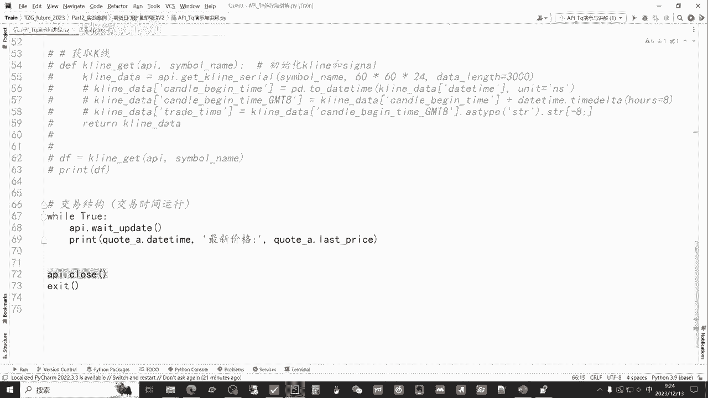

比如说咱举个例子，我要打印出，就是像咱们右侧看到这个价格是随时变化的。

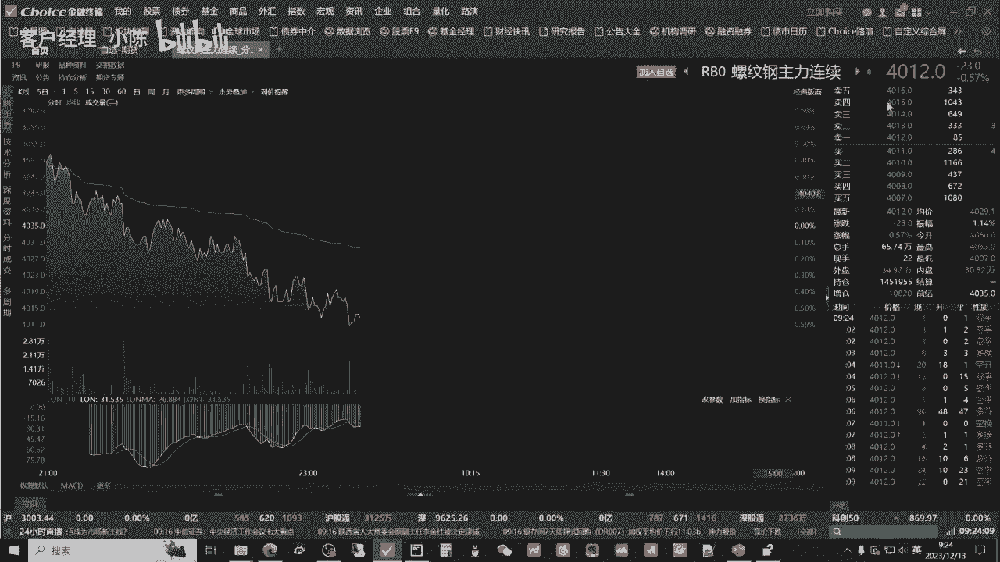

它的成交价对吧，要实时的打印出，那么我们就通过这个quit a，然后呢date time，然后呢后面还有一个last price，last price是最新价，date time是时间对。

我们把这个实时打印出来，我们看运转一下，好这个时候各位老板就可以清晰的看到，那首先是时间，2023年12月13日，09：24：35，因为目前呢咱们的行情是0。5秒呢，刷新一次，也就是快照的形式。

这就是交易所提供给咱们的数据的，这个时间间隔也就0。5秒一次，就说你的计算机哪怕再快，那么它本身也是0。5秒，咱们获取一次数据，所以你看每次都是0。5秒的间隔，然后最新价格也就最新的成交价。

我们往下看一看，好现在是4015，我们看一下对4015就是说它是实时变动，这就咱们就相当于呢，未来不管是咱做这个高频交易也好，还是做这个日线的交易，那么咱们都可以实时的获取最新价格。

而且呢跟软件所有软件它的传输都是同步的，也就用上了这么一个结构就可以解决问题，就while true循环，只要是有其中的，不管是时间变化还是价格变化，他都会把这个相应的最新的数据打印出来。

就通过这么一个结构就可以实现，咱们行情的实时获取，非常的方便，我们来看一下什么是SDK和API，STK呢就是说软件开发的工具包，API呢就是应用程序的编程接口，那么相对于咱们上面的案例来看呢。

针对咱们的量化交易，SDK呢就相当于一个超市，然后其中呢有相应的不同的货品，可以满足我们做量化交易的各种需求，然后AAPI呢就相当于是一个购物车，我们通过这个购物车。

就可以从这个超市当中呢获取我们所需要的，比如说相应的数据，以及我们需要实现某些功能的函数，比如说下单函数，还有这个获取最新行情的函数，以及呢查看咱们的账户信息的函数对吧。

那么这就是API和SDK它们之间的这么一个关系，咱们课程中啊主要使用的SDK呢就是天琴的SDK，主要有三个原因，第一个就是说他除了基本功能外呢，它的自由度很高，更适合咱们做量化。

第二个就是说呢相对于其他目前这个市场上的，不管是软件还是API也好，那么咱们这个天琴的SDK呢，它的策略可以在本地运行，也就是说能够保证咱们的策略的安全和私密性，那么第三个就是说呢比较稳定。

而且最为关键就是它免费，我们来简单看一看啊。

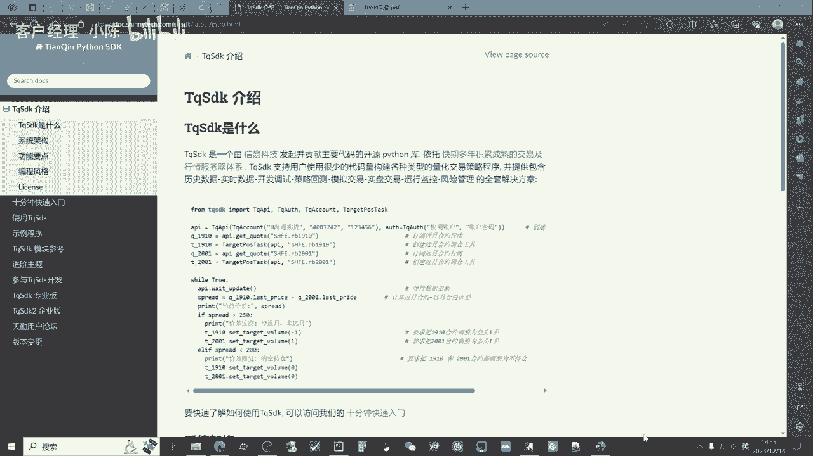

这个天启SDK的它的介绍，这个网址呢是他的这个中文的文档。

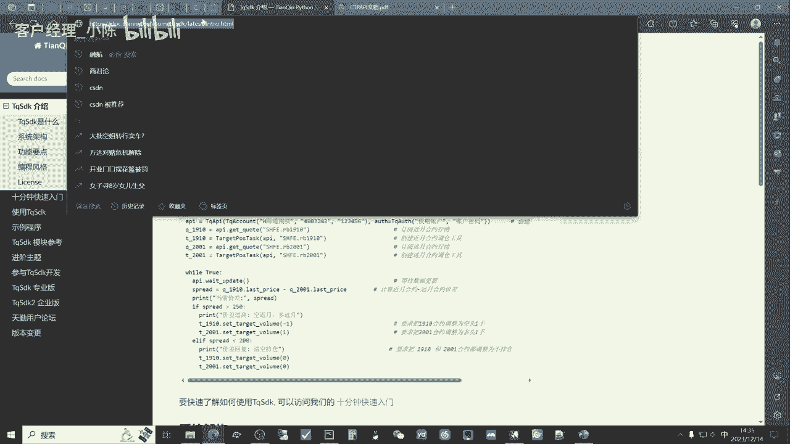

然后呢，我也把他这个网址呢放到了咱们的课件当中，非常方便使用，好我们简单看一下这个TQSDK，它是由信义科技开发的，一套整个基于Python的这么一个库对吧，也就是咱们后面要调用函数API。

都是基于这一套的软件，心怡科技呢它另一个产品，相信很多做期货的老板比较熟悉，就是这个快七会计软件，就针对不会编程的话呢，那么各位老板可能更多就选择用这种软件，进行整体的交易。

包括下单行情以及就是经常使用的交易报告，好最近的运气不错，整体的翻倍了，好，然后我们使用的主要就是说呢用SDK，也就是说针对于咱们量化交易者使用的。

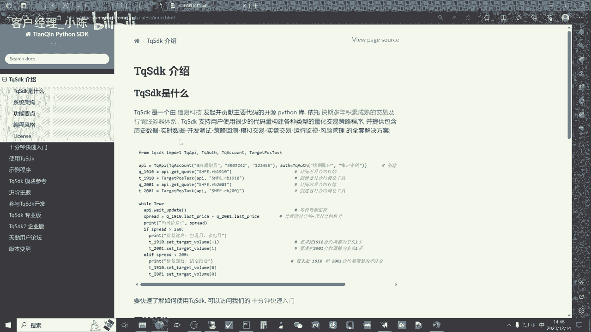

这个产品，那么咱们可以看一下，运行一下哦，这是服务器，那么服务器版本呢咱们就用SDK，然后获取相应的这个账户的信息。

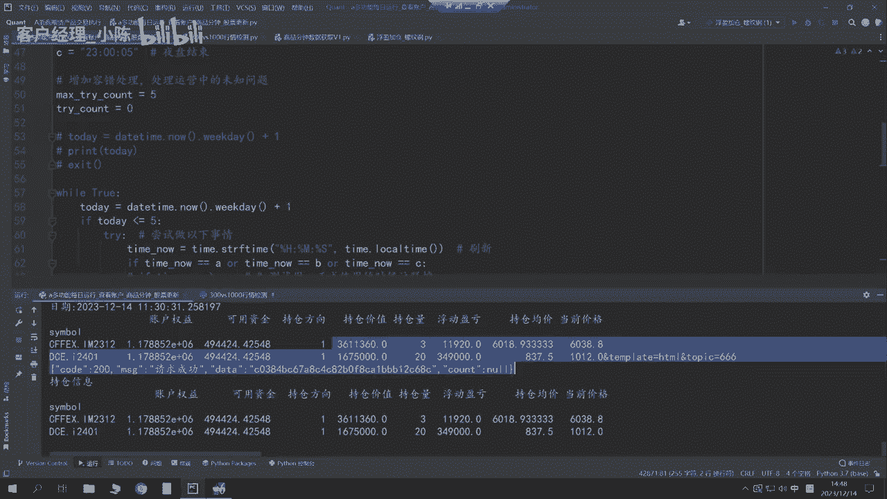

目前的持仓情况和数据，这是呢这个这家公司他两个主要的产品，咱们后面呢主要还是用这个TQ的SDK，我们来看一看，就说TQSDK它主要实现的功能，一个是历史数据和实时数据。

这主要是我们是主要使用的最主要的功能，然后呢包括还包括这个开发调试策略的回测，模拟交易，那么实盘交易肯定就说也是极为重要的，最关键的他还免费，那么相对于目前的免费版本，那么针对于绝大多户。

基本上百分之应该是98%，甚至95以上的，这样的这个用户呢基本都够用，就是千万资产呢其实足够用了，那么这里呢，佟掌柜呢也贴心的为大家呢争取了一些福利，就是说如果有各位老板，希望。

就是说购买这个天琴的专业版或者企业版的话，可以联系佟掌柜，那么我也对比了一下，然后他专业版就是说可以实现更多的实盘账户，也就是说比如说咱们有的老板希望用一个账户，A账户去做这个趋势突破。

用B账户呢做日内，然后用C账户呢我要去做这个震荡的趋势，就是他想把策略分开，然后呢，分别的统计就需要这样的一个相应的功能，然后还有就是说呢历史数据的下载，它这个专业版呢还包括股票数据，交易单元权限。

其实就是可以把不同的策略呢区分开来，也是方便咱们进行策略的分析，然后就是说呢期权交易和交易所结合，大概是这样，然后他的那个企业版，咱们通过名称就可以看到呢，他企业版主要针对的就是这种有大资产的公司。

因为他可以直接连入这个资管平台，实现ff和mom的功能，这种功能呢主要还是这个私募公司，公募公司，还有就是券商，或者是咱们的这个期货公司的资管公司，可以使用上这个功能，大体呢这就是TQSDK的。

就是整体这么一个介绍，对于咱们课程里面来讲，咱们各位老板呢基本上使用咱们的免费版，它的功能也是非常强大的，基本就够用了，包括数据库，后面我也会教大家如何去建立自己的数据库，也就基于免费版。

也可以建立咱们自己进行回测后续的交易，然后我们如何使用这个天琴的SDK呢，我简单的给大家做一个演示，就点到他的这个中文文档的官网当中，我们可以点击左边这个10分钟快速入门，然后呢我们可以先来安装。

可以用这个网址，这个网址相当于国内镜像对吧，我们CTRLC把它拷贝下来，之前的课程也给各位老板见，就是介绍过咱们安装完这个anaconda之后呢，我们可以通过这个anaconda prompt。

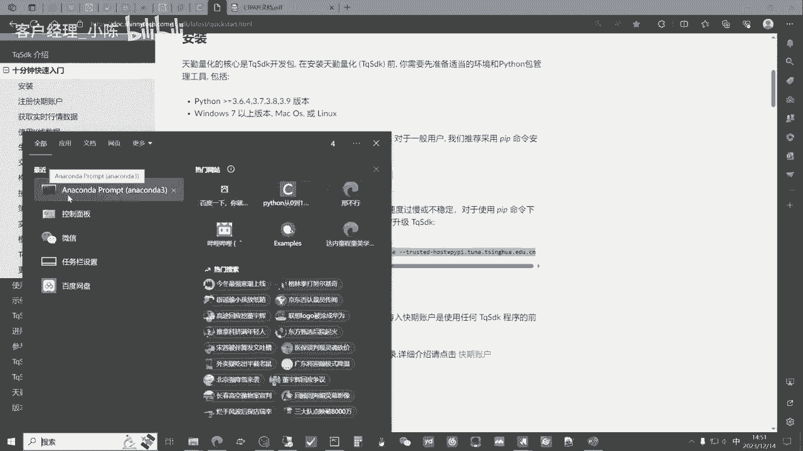

然后把它启动，把刚才咱们复制的这个网址CTRLV复制到这里。

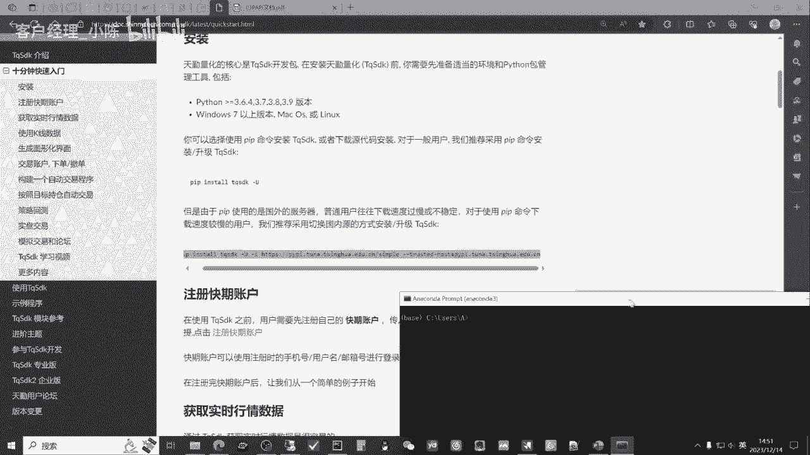

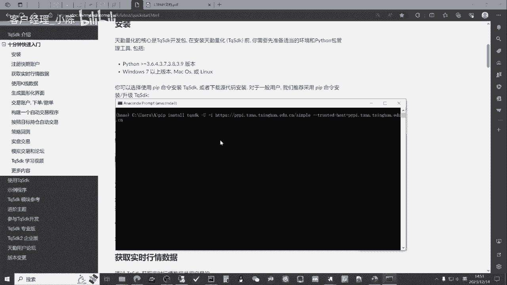

因为呢佟掌柜已经安装完了，然后直接回车就可以，它就会帮你自动安装，这不是already，就是已经都安装好了，如果没有安装的话，它会帮你自动安装，包括后续，如果说咱们要去对这个SDK进行更新。

因为过一段时间，每过一段时间，这个天启呢就会更新一下它的这个SDK库对吧，咱们同样用刚才的方法就可以实现自动的更新，安装完SDK之后呢，我们可以点击这里就注册快期账户。

通过这个页面呢我们输入相应的手机号，然后呢短信验证码就可以实现快速的注册，以及未来的登录也是相应的页面，然后注册完之后呢，我们会进入到这样一个比较简洁的页面，这里呢就是咱们的登录的号。

也就是咱们的账户号，然后呢如果我们想进行实盘交易的话，我们就把咱们的个人的这个交易账户，那么机构的话呢把产品户也可以，就直接在这边示范绑定就可以了，就非常的简洁和高效，那么注册完之后呢。

我们刚才已经演示了，如何使用anaconda去把他的这个库进行下载，以及未来的更新也是同样的步骤，然后导入库就可以正式使用，也就是最初咱们向大家展示的这个整体的案例，那么导入这一行代码之后呢。

那么基本上咱们天气SDK的主要功能，咱们在后续的应用当中呢，基本就都可以满足了，包括了最开始咱们像咱大家展示的，这个获取的账户信息对吧，行情的定义，像这些具体的函数，我们会在第五章为大家进行详细的讲解。

也就是在咱们第五章主要内容，就是实盘交易框架当中，那么第四章咱们重点还是在于数据库的建立，以及回测系统的搭建，那么其中用到的一些函数呢，我们会在后续的具体的实战案例当中呢，再给大家逐步的拆解好。

本节课的主要内容就是这些。

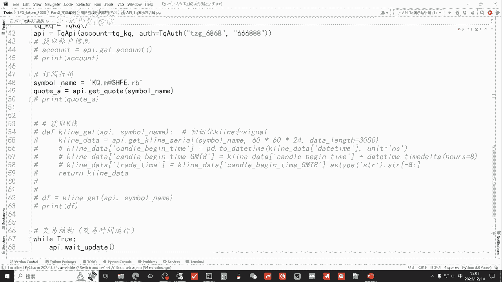

再次感谢大家，通过本节课的学习呢，相信各位老板在量化交易的成功之路上呢，咱们又前进了一步，有任何问题都欢迎大家直接联系佟掌柜，千万不要不好意思，量化呢只是工具。

策略才是关键。