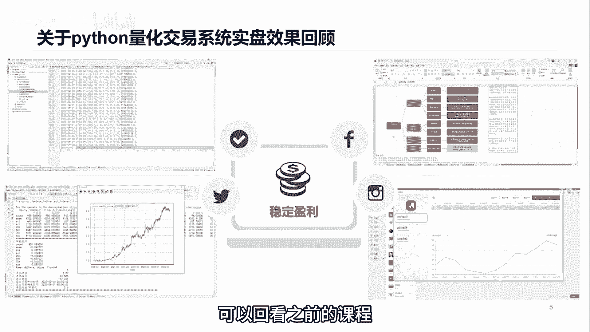
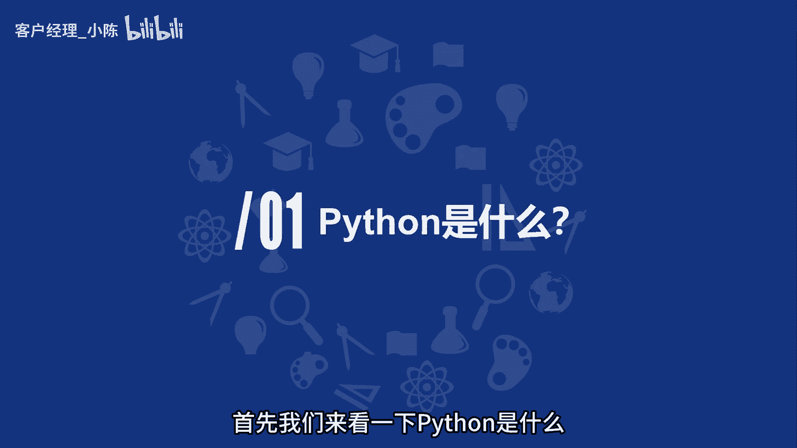
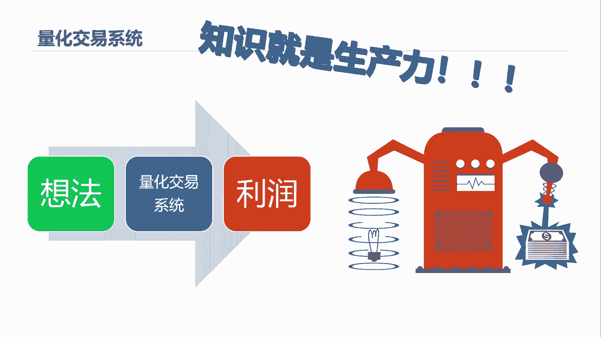
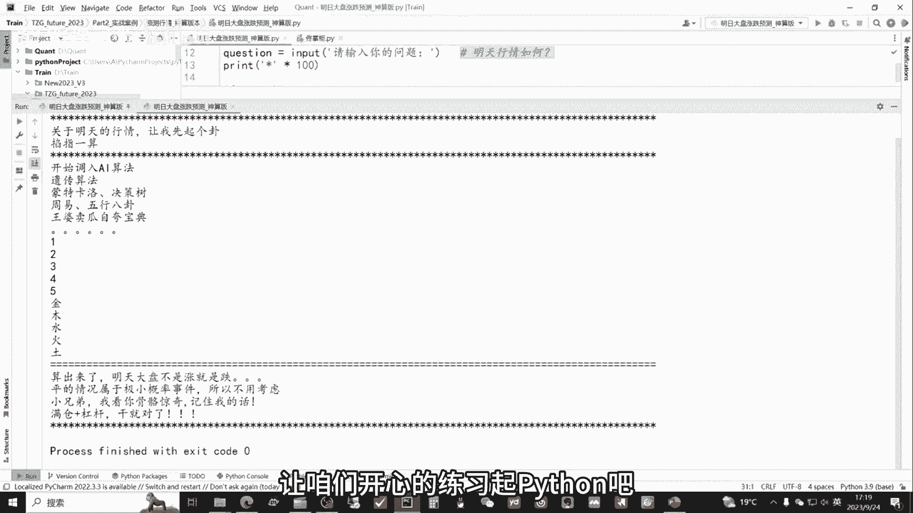

# 从零开始期货量化：2_课程python与money_GPT精准预测市场行情 - P1 - 客户经理_小陈 - BV1misAeGEhw

大家好，我是专注于量化交易的佟掌柜，本节课呢我们通过一个具体的案例，看看Python是怎么样预测市场行情的，来具体阐述Python是什么。

佟掌柜课程的特色呢就是简单实用，可操作，所有的内容呢来自于实战，最终呢也要应用到实战当中，首先我们对上一节课内容呢，进行一次简单的回顾，我们通过数据库的搭建，策略的制定，回测系统的观察以及实盘的展示。

来形象的直观地感受什么是量化系统，对这些内容比较感兴趣的老板呢，可以回看之前的课程。

首先我们来看一下Python是什么。

Python呢就是我们和机器沟通的一种语言，通过Python机器可以很好地理解我们的指令，并完成我们交给他的具体的任务，有了Python，我们可以非常轻松地将脑中绝妙的想法，转化为自己的量化交易系统。

进而转化为利润，完美地诠释了知识就是生产力好。

我们还是用一个实战的案例，来直观的感受一下Python的魅力，让我们来看一看什么是基于Python的money i jp t。

佟掌柜始终本着一个原则，就是哪里有热点，咱们就蹭哪里，那么结合当下火爆的chat gtp，佟掌柜呢基于Python语言制作了money i g p t，它主要作用就是预测市场行情，让我们来看一看。

他是怎么样实现百分之百预测成功的，也就是明日大盘预测的神算板好，我们先把它运行一下，看看效果，他首先出来的就是说让你输入你的问题，咱们看他智不智能啊，咱们不输入问题好，还比较智能。

他告诉你老板还没有提问呢，好咱们再运行一下，那么明天呢是周一，咱们呢是看一看明天的行情如何，咱问一问他走，你，好他开始运算了，好整体他就算出来了，他给的结论是明天大盘不是涨就是跌，平的概率呢还极小。

所以不用考虑，整体呢预测呢绝对是百分之百完美，不仅呢预测的情况呢是全部考虑清楚，而且呢离极小概率事件的他也考虑进去了，说明他的逻辑还是比较严谨的，赶紧拿个照妖镜看看我是不是照妖镜，哼骗我。

这根本就是猪啊，通过刚才的演示呢，各位老板一定可以发现，Python编程呢本身并不是一件枯燥的事情，它可以通过咱们的编程呢，实现非常多有意思的事情，好咱们书归正传啊，咱们的程序麻雀虽小，但是五脏俱全。

后面呢我会逐行的来讲解，咱们程序是如何实现的，阿布拉佟掌柜，import money i g这一行代码的意思就相当于呢，首先从左边这个文件夹，佟掌柜这个脚本当中导入money g p t这个函数。

那函数是什么呢，咱们做量化做一个比喻，就跟做菜是一样的，那么咱们主要就是进行的是什么数据的处理，那么数据如果是咱们的这个呃菜的原材料呢，那这些函数就相当于咱们做菜的锅碗，瓢盆儿刀和叉，这些就是它的作用。

其实就是说实现某一项功能，把它封装成一个函数呢，像后面咱们直接调用，也就直接拿出来，就用他的目的和方法呢，其实就是为了提高效率，同时也让整体代码看上去呢简洁简单。

首先呢我们来介绍一下Python的运行顺序，它是从上到下逐行运行，跟咱们读书的顺序是一样的，好我们来看这行代码，Question，question就是问题，它这个相当于咱们自己定义的变量。

因为Python呢是面向于这个嗯，就是面向于更接近于自然语言，就相当于通过说人话来控制计算机，实现咱们需要的目的，那么这一行代码，就是最开始咱们运行代码的时候的这一行，就让咱们输入相应的内容。

咱们看下一行，Print，print是Python中的核心的这个函数，它主要作用就是不管咱们做任何的运算，到最后你要把结果要输出出来，或者说打印出来，那么需要用到print函数。

在这里面小星星呢乘以100呢，就是为了让它好看，大家看到就是方便咱们阅读和好看，那接下来呢，if和else这个函数呢相当于是一个逻辑函数，那么就是英文的意思嘛，就是如果其他，那么这行代码的意思就是说。

如果这个question就说有人提问题，那么他来执行money i g p t这个函数，如果没有人提问题，那么他就输出就是老板，你还有没有问题呢，你还没提问题呢，最后呢有一个收尾。

咱们呢再运行一下这个程序，直观地感受一下，好咱们先运行一下，没有问题的情况，就是问题为空啊，各位老板看到了，他说老板你还没有提问呢，好咱们再运行一下，咱们把问题提到里面。

好咱们看到了它整体的运行也是从上到下，从左到右逐行运行的，跟咱们读书的情况是这样是一样的，好的，我们接下来看一看这个money g p t的函数，究竟是怎么样的，那么方法就是点control。

然后呢点左键好，我们进入了佟掌柜的这个脚本当中，看到了这个函数的情况，首先呢是import time time，大伙都知道就是时间嘛，相当于导入了时间函数。

那define define呢就相当于是定义他，翻译过来就是定义的意思，定义了money i g b t的这个函数，这个就相当于咱自己的变量，你可以随便编写，那么print大伙都清楚了，Time。

咱可以把这个函数用上，就time点sleep0。3，就相当于打印完这一行这个字之后呢，他会睡眠就休息0。3秒，为什么这么做呢，是因为，在这里呢，咱们加入这个时间睡眠的函数的作用是什么呢。

咱们先把它去掉看看效果，假设把这些时间的这个函数呢把它都注释掉，就相当于没有，咱们看看情况是怎么样的啊，好咱们再运行一下这个程序啊，输入问题一下就出来了，这样是不是感官特别不好，通过这个事情也说明什么。

佟掌柜是一个非常追求细节的人，接下来呢我们来看这个函数，For i in range，这个函数它属于一个循环函数，它的意思是什么呢，就是说当你做同样的事情三次以上的时候，你可以采用这种循环的函数。

循环函数这种方式，那么它的作用就相当于是，这里就输入12345输出这样，然后后面还有一个佛TE印金木水火土，这个的作用也是一样，输入输出金木水火土这几个字，好，咱们最后呢再简单的复习一遍。

咱们这个行情预测神算板的这个程序嗯，有这个from import，就是导入函数的这么一个功能，有自定义变量的设置，有print主函数的输出，有if else这种逻辑的判断结构。

同时呢还有这个定义函数的这个功能，就如何去定义自定义咱们需要的函数，然后有这个时间模块的导入和应用，还有循环模块的使用，咱们最后再直观地感受一下，OK不灵不灵，结果十分完美。

通过这个事情呢也说明了一件事情对吧，咱们吹牛也是要经过详细的打草稿，这么一个过程的，所以各位老板，让咱们开心的练习起Python吧。

再次感谢各位老板的耐心倾听，课程中的所有代码呢，后面也会完全的分享给各位，欢迎各位呢添加我的微信与我交流。

