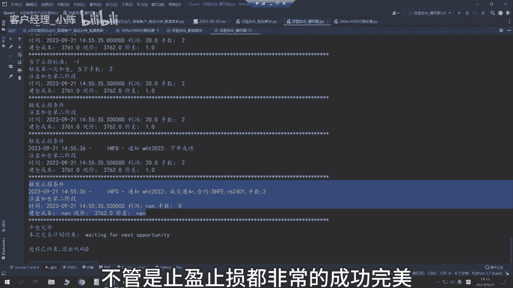

# 从零开始期货量化：1_从0到1股票期货python量化交易系统_实战展示V2 - P1 - 客户经理_小陈 - BV1n5steeEqV

大家好，我是专注于量化交易的佟掌柜，本期视频呢作为系列课程的总论，我们将会用实际的案例向大家形象的展示，即使作为一个小白，也可以从0~1构建自己的量化交易系统。

课程中的所有知识呢全部来自于实战，对于每一个知识点，将会以一个实际案例的形式进行展开，会用通俗简明的语言呢，确保每一个人都能通过学习掌握一项硬核技能，最终形成自己的量化交易系统，实现稳健盈利。

当然课程中的所有的代码框架呢，也会全部分享给各位老板，也希望通过这样的一个方式呢构建起圈子文化，与志同道合的朋友，咱们共同进步，本期内容呢我们分为四个部分，量化交易可以做什么。

数据库如何搭建交易策略的研发与回测。

以及最终的交易执行，首先我们来看一下量化交易究竟可以做什么。

他就是将策略形成可以每天执行的交易计划，具体来讲就是说构建自己的数据库，每天全自动的交易优点就是杜绝人性的弱点，总体来说就是提升效率，解放双手，将知识变成利润，接下来我们将会通过一个有趣的视频。

来直观感受一下。

好我们接下来看一下如何构建自己的数据库。

主要分为三个步骤，第一呢从数据源抓取数据，第二就是整理成我们需要的数据格式，然后呢进行保存和日常的更新，闲话少说，咱们上实盘，首先呢大家看到的就是Python的编辑器，咱们呢不要被这种看似高大上的布局。

以及白不次拉的背景呢所迷惑，它本质呢就是一个编辑器，功能类似于word，我们来看一看左面这一块啊，它主要就是对一个文件的管理，这也是未来咱们的课程的总体规划，先有基础学习，然后呢这些呢有实际案例。

我们先看一看啊，这边大家能看到的，就是说你需要哪个股票的，股票的数据或者指数的数据呢，你又把相应的这个代码写到里面，咱们运行一下，看看效果，好程序开始，整体运行速度还是比较快。

好整体的数据呢咱们里面都抓取完毕了，而且呢咱们的程序里面还带一些清洗的功能，就是说要保证数据的准确有效，我们来看一看结果好，这是上证的这个指数的数据，我们看看结果如何，咱打开股票软件对一下。

这个是开高低收四个，咱们看一看啊。

开是3103。18，啊今日开盘3103。18没有问题。

那么最高是3113。49。

3113。49也没有问题。

最低是3086。20，3086。2对二零。

然后呢收是3095。31，这里稍微有一点不一样的话，说明咱们现在爬取的数据，下载的数据呢是实时数据。

当收盘的时候呢，这个数据就基本就不变了，这就是股票指数数据的下载和应用，有了数据之后呢，我们应该如何的应用，我们首先来运行一下这个脚本，好运行完毕了，我们来看这张图，通过这张图我们可以非常清晰的看到。

从13年1月1号开始，如果我们去买中证能源，就这条灰色的曲线，那么持有到今就不动，咱们看右上角最右上角，那么它的收益在13%，也就净值是1。13，那么看粉色这条线，对应的应该是新能源车这个板块。

如果我买了这个指数，那么到最后的话，现在是0。759，就相当于0。76，那么赔的是24%，通过这个脚本呢，我们可以非常的直观的观察，有了数据之后呢，我们可以非常清晰的看到，就说各个指数的对比。

那么这是一年的，可不可以几年之间的都可以，我们改成15年，好通过这个我们就可以更加直观的看到，从15年的1月1号，然后到2023年，就至今整体的这些指数的变化，那么我们可以看到。

如果从15年1月1号买的话呢，到现在比较强的是红色，是哦白酒，白酒还是比较强的，那么它的净值能够能翻五倍，5。76倍，但是这近几年的话呢，从2021年可以看到，就是说从2021年到现在。

他整体的表现其实不是特特别的好，看完了股票的数据库呢，抓取咱们看看期货的数据库，我们先简单看一下期货的品种相对较少，那么主力合约一共是79，咱们运行一下，好爬取完毕了，速度还是比较快的。

那么爬取完这些主力合约的数据之后呢，我会根据我经常交易的品种进行二次整理，我们运行这个脚本看一看，哇这个速度更快，这样呢我们就完成了这个嗯，期货数据的爬取工作，看到这里呢，相信各位老板一定有一个疑问。

就这样每天打开程序呀，运行啊，然后下载啊，太麻烦了，有没有办法让它实现24小时呢，自动的去下载，那当然有啦，咱们做量化的目的，就是为了满足咱们这些懒人的想法，实现解放双手，提升效率，怎么办呢。

上服务器整活儿，是不是一下子更加的高大上了，完美的实现了5+2，白加黑，全年整活不打折，好我们看一看啊，这个脚本就相当于一个框架，我们定好时间，然后把我们需要更新的数据的程序，包括咱们看一看啊。

这是更新商品数据的，就是每日收盘之后更新商品分钟数据，这个这这串代码是更新咱们的指数数据，和股票的日线数据，这一行呢就是说每日收盘之后呢，我们可以查看咱们的实盘账户里面收益情况，我们看一下运行情况吧。

这就是每天的运行，我们看一看啊，嗯这是昨天的运行情况，这是，这是商品数据的这个下载，而且呢这是分钟数据下载，然后下面它运行完商品数据下载之后呢，这是股票数据的下载，OK没有问题，相当丝滑。

我们看一看具体的数据，咱们打开商品数据，拿螺纹钢为例。

2023年9月20日，昨天咱们看一下，没有问题，完美非常的流畅，第三章呢，我们来介绍一下交易策略的研发和回测，这一章是整个量化交易系统里面最为复杂，也是最为核心的一部分，我们先看一看我是如何做策略。

首先呢定性分析，我们从股票和期货两个方面去考量。

会有整体的一个框架分析，比如说我想投资证券行业，我会对证券行业有一个总体的分析，期货也是一样，对它的交易系统，包括它里面的杠杆，包括这些基本的情况都会有分析，比如说农产品它的基本面，他现货的一些特性。

然后市场里面参与方他们的特性分析，有了定性分析之后呢，然后呢会确定自己的交易理念和交易的原则，最后把这些定性的分析呢转化为定量分析，你会对每一个策略进行资金的配比，以及相应的就是说风控措施的确认。

然后当这些工作都具体做完之后呢，把这些嗯咱们形成的量化交易的策略呢，形成可以执行的交易方案，也就是形成具体的可以执行的交易策略，一股脑呢放到咱们的这个脚本当中，我们来进行一个回测，现在的回测呢。

我们还是以这个呃期货的大品种螺纹钢，咱们进行一个这个交易的回测演示，咱们看一看，好效果出来了，回测时间是从2020年的1月份到至今，我们看一看啊，整体的表现形式，累计净值是3。97，将近达到了四。

它的最大回撤是17。25%，那么就是说最多呢就是如果说你的运气不好，买在了高点，在这个过程阶段的高点，它发生的时间是，2022年的2月10号到4月21日，整体还是可以接受的，有了回测报告之后呢。

我们应该怎么使用这个回测报告，我们来详细的看一看啊，我们不光要看到它的累计净值，我们还要看它的最大最大回撤，那怎么用呢，因为本身啊这个期货交易它是自带杠杆的，现在呢我们的这个本金投入只是20%。

也就相当于是两成的比例，因为它是带杠杆呢，相当于是加了一倍的杠杆，好，我加大杠杆，比如加到0。8，就是说把我的本金基本上都投入进去，这样的杠杆比率应该在五倍以上，我们看看咱们来看一看啊。

最后它的净值表现，OK一下干到底干到零了，说明一个什么问题呢，杠杆加的过大，在整个的投资过程中，咱们爆仓爆仓了，那只能调小杠杆，咱们看一看，调到0。6，0。6将近是四倍杠杆，咱们看看效果，Ok。

他的这个净值表现，由刚才的四倍一下变到了31倍，这个提升是非常巨大，但是他的最大的回撤也变成了42%，也就是说在整体的资金的这个投资过程中，它会出现将近一半的这个就是嗯亏损情况。

虽然他的这个累计净值非常的高，但是在这个中间过程出现这么大的回撤，一般人是坚持不住的，其实这个还是就是说，通过咱们的回测来讲的话呢，这个杠杆的比例还是相对比较高的，我们把杠杆呢再次调整为正常比例。

这一次呢我们拉长时间来进行一次回测，通过回测结果呢，我们可以清晰地发现这个策略属于长期有效的，这是一个非常好的策略，但是呢在这个阶段，也就是说16年到19年的这个阶段呢，它整体的表现呢比较平稳。

也就是说收益并不是很高，那么我们后续呢可以根据，把这个策略当成一个基础的策略，然后通过呢要么就是增加品种，或者呢部分的更改策略，或增加条件等多种方式呢，再降低波动率或者降低风险的情况之下呢。

尽可能的提高这个这一块的收益，然后呢形成咱们最终的更完美更好的策略，这个过程是一个需要长时间打磨和不断磨的，这么一个过程，需要咱们更多精心的投入啊，工作之后呢，还有一项最为重要的工作需要做。

就是将我们之前的回测记录，或者是实盘交易的记录呢，完全的整理并打印出来，然后用我们的肉眼观察大法，一条一条的去顶对比，去真正做到什么呢，就是说每一笔的盈亏我要做到心里有数，是因为突发情况。

比如说行情的突然转变，是因为客观的原因还是市场的原因，还是突然来了一个，就说咱们无法预料的原因，导致它不管是盈利还是亏损，只有我们做到了这一步，你看这是我之前做的品种，就几千条信息。

就一条一条一条自己去过滤，去找到原因，找到它在哪一天，为什么亏损，有大亏，为什么大赚，这样你只有做到这样的一个就是精细度，你才能对你自己本身的策略，完完全全的做到心里有数，心中有底。

只有完全理解并掌握自己的策略之后，才能当净值表现不佳的时候呢，大胆加仓，这个是一种阶段性的境界，只有达到了这种境界，那基本上你的量化交易的这个本事，也基本练成了，未来就可以实现稳健盈利。

数据库有了交易策略有了，咱们现在直接上实盘，来直接感受一下量化交易的魅力。

我们来通过呢具体的程序来看一看呢，它是如何进行实盘交易的，现在呢咱们看到呢，这是对于股指价差合约的这个行情监控，基本呢就是说一秒钟呢刷新两次，也就是0。5秒刷一次。

那么咱们看到他的这个数字是在不断变化的，它有各个合约的价差，也有各个合约，就是价差和这个现在的现货之间的这么点差，它都会实时帮你计算出来，你看这是实时更新的，那么围绕你监控的这个行情来讲的话呢。

配合你的策略，我们看一看啊，这个现在正在运行的是浮盈加仓策略好，那么根据策略它咱们量化来讲的话，交易一定有明确的价格，那么它计算出来的就是说现在是看多，它的价格是计算的，目标价格是6100。

但是现在的实时的价格，就是行情价格是5926。2，这是行情价格，那么跟咱们的目标还差173。8，也就是说没有达到咱们的预期价格，所以他现在是处于监控的状态，不交易大号可以看到呢，这个是实时更新的。

这么一个状态好，大概是这样，咱们刚才看到的是股指期货的监控环节，然后咱们现在用螺纹钢啊进行一手的交易，咱们看看效果嗯，首先呢咱们自定义一下，然后呢咱交易这个主力合约，咱们看看当下的价格是3758。

那么他合约是2401，好，咱们配置为2401，咱为了让他交易给大家看一下，然后咱们就交易一手吧，咱就设为3760，这个呢是浮盈加仓的模块，然后呢直观一点，咱们把步长设小一点，为了加快它的交易。

而且呢我的浮盈加仓，在每一个过程中呢做得比较细，它是自带止盈止损的，咱们先运行一下，看看效果，哦一开始他就交易了，现在已经是第一阶段，也就是说现在买了一手手术是一手，他买了买了买它。

然后现在呢咱利润是十，因为价差是向下的嘛，然后向下止损的标准是-20，咱看看它有没有可能，然后后续的话呢会加仓。

好像行情不太配合一点啊，没关系，咱们把他的补偿再调小一点啊，不行，二的补偿应该是最小的，这样咱把风控的那个调小一点，为了给大家演示啊，咱们调小一下风控风控，那么初步风控咱们调一跳就止损。

咱们继续运行一下，看一看，好现在是有利润，它不止损，应该很快可能就会止损，他刚才反而加仓了，大伙看到了吗，这个行情还是比较配合的，那么加仓完加到两手之后呢，因为我是只赢一跳就走人，如果说他反跳的话呢。

最后他两手是平仓的，相当于一跳就走人，好运行非常丝滑，不管是止盈止损都非常的成功完美。

最后呢我们以实盘总结来作为本次课程的结束，正像佟掌柜所说，咱们的课程和内容全部来自于实战。

我们来看一看实盘表现如何，用不到一年的时间呢，净值达到了34，承认我有赌的成分，但是我赌对了，最引以为傲的地方并不是赚了多少钱，而是自己的风控体系，那么单笔亏损呢控制在总资金的2%以内。

最大的一笔亏损呢达到了5%，是因为呢隔夜反跳造成了就是5%的亏损，那么总体来讲呢就是小亏大赚，只有在浮盈的情况之下，才会采取浮盈加仓的模式来增厚利润，也把最近正在试运行的策略呢，给大家简单的看一下。

有一个直观的感受嗯，9月5号开始试运行啊，净值亏了0。97，啊持续亏0。95，然后往后看的话，咦好1。03了，咱们看一看账户情况，可能会比较直观，哦初级权益整体来讲，他这个量化其实本身也不是说不亏。

只是说呢你相对具备优势的情况之下呢，是震荡上行的，总体就是这么一个情况，然后呢收益是8。31，最大回撤是6。37，还可以符合咱们的趋势策略，完美。

内容全部来自于实战，最终也要应用到实战当中，相信各位老板在学习之后，都能够搭建自己的量化交易系统，最终实现长期的稳健盈利，再次感谢大家。

