# 【python数据分析精华版来了（附文档代码）】10小时学会Python数据分析、挖掘、清洗、可视化从入门到项目实战（完整版）学会可做项目 - P42：04 mysql库和表的操作 - Python万能胶 - BV1YAUuYkEAH

讲解哈，刚才给大家稍微啊稍微的介绍了一下啊O我们介绍今天的数据库部分哈。那我们在讲数据库啊，我们之前已经学过了哈，所以我们讲的速度会快一些哈啊，我们会中间啊会有提问哈，所以说大家认真听讲啊。

那我们之前讲数据库，我们都知道什么是数据库啊，数据库其实就是科学的组织和存储数据，然后高效的获取和维护数据，什么意思呢？就是说我们之前没有数据库的时候，我们是不是用文件，对吧？我们是用文件来操作的啊。

那文件啊文件有一个什么问题呢？就是它其实是放在本地的，对不对？那如果说别人想用这个文件，别人你还得给别人拷过去，对不对啊？如果说是我们独立做一个项目的话，那这样实现肯定是不行的。所以我们需要一个什么呀？

我们需要一个单独的服务器，对吧？

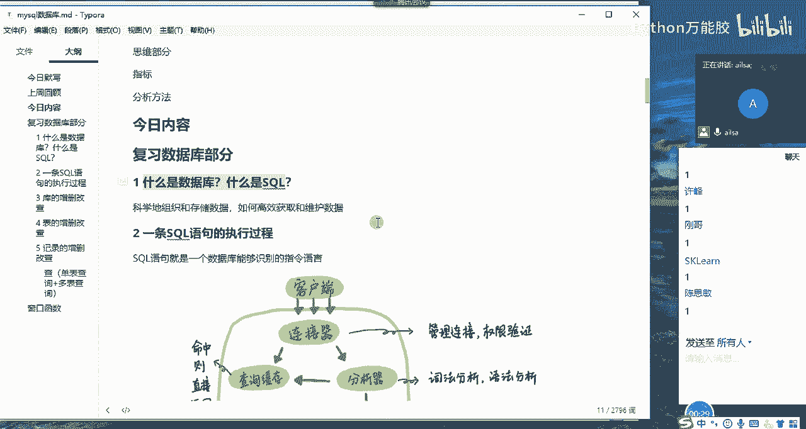

啊，我们需要一个单独的服务器啊，然后我们把我们所有的数据都放在这里，对吧？放在这里之后啊，然后我们通过什么呢？通过socket，大家都学过sockcket哈，我们通过socket。

然后让我们的客户端都来访问他，都来访问他，都来访问他，对吧？这是我们的客户端。啊，客户端都来访问它，然后大家共同在这个数据上去在这个台服务器上去获取我们所想要的数据，然后去返回回取这样的一个过程。

那我们把数据放在这里之后，我们再对数据进行一个增删改查的时候呃，如果说呃单独用我们整个的一个sockit来实现的话，其实还是比较慢的那我们应该开发这样的一套软件，对吧？

开发这样的一套软件专门用来管理数据库来呃就是实现并发呀啊，然后等等各方面的一些操作，来达到我们呃对数据进行增山改查的一个效率的最大化。那这个啊这个软件啊，这个软件或这个系统，就叫数据库哈。

数据库管理软件。啊，数据库。啊，数据库。啊，管理啊软件啊，我们所说的数据库管理软件呢就是指的是myqcle circlecle serveroracle哈这样的一些关系性啊指关系型数据库。

那还有非关系型数据库，也就是我们的呃mongo B对吧？res啊这样的非关系型数据库都是可以的哈。那我们在学习的过程当中，今天所学的都是关系型的数据库。我们讲过的就是mysqcle啊。那关系型数据库啊。

我们学习关系型数据库的话，需要再学一个知识叫什么呢？叫circle。为什么要学习circle呢？啊，我们想一想，那既然说它是一个管理软件，我们可以高效的实现数据的一个呃组织和存储。

并且能够呃方便的进行数据的正常改查。那我作为一个客户端，我该怎样对这个数据管理软件进行一个正常改查呢？他们之间有什么暗号没有，对不对？我不能往这一站说中文，对吧？我不能说哎。

你给我一下学生表里面ID唯一的数据，我不能这样，对不对？那他们之间应该是有行话的这个行话就叫circle，对吧？也就是说一个数据库管理软件能够识别的一个指令，就叫circlecircle语句哈。

只有关系型的数据库哈，关系型的数据库才会有circle。那对于不同的数据库而言，你比如说my circlecle oraclecicle server他们的circle语句几乎都是差不多的。

只是有略微的差别，类似于普通话和方言的差别哈，类似于普通话和方言的差别。所以说你只要学会了circle这样的一个标准的语言啊，你就可以基本上可以操作各个不同类型的关系型的数据库。

O那大家对于数据库和circle都了解了吗？

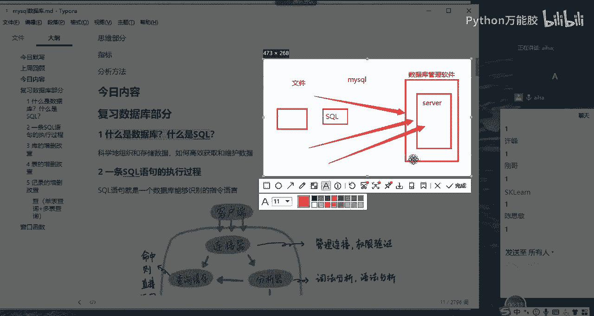

啊，谁俩差别。嗯。同志们对于数据库和circle了解了吗？粤语听不懂是吗？我只是简单举个啊举个例子哈啊，因为在呃circleso和oracle当中，他们确实是略略有差别的哈啊。

就那你就类似于啊啊普通话和河北话吧。因为河北话跟普通话特别像啊，就有点像普通话和方言这样的一个差别哈，比就近的差就近的方言吧，你比如说粤语闽南语，还有那个傣语什么的，那咱们就不说了哈。

你这个有点跟我较真了哈，我只是简单举个例子啊。😊，橘子。嗯。Oh。哎呀，妈呀，我差点没有get到你们的点哈。okK啊。😊，下回我举个南瓜，好吧。嗯，让你们看清楚一些嗯。

OK那既然我们讲明白了数据库和circle之后，我再介绍一个呃我们一条circle语句，它的执行的过程是怎么来实现的哈。你比如说啊其实我不知道大家有没有好奇过哈，在我在我了解到数据库了之后。

然后我就会在想你这个作为一个数据库管理软件，比如说你是买circle。

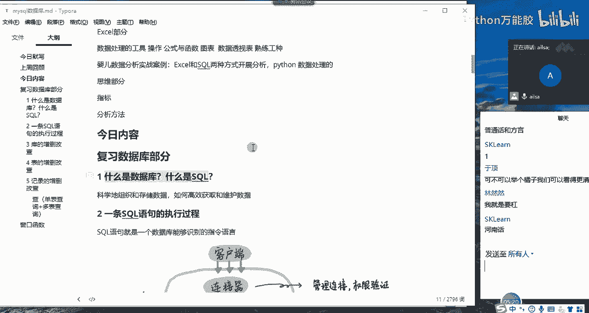

对吧你是买circle，然后你发我作为一个客户端，然后我发送了一条指令啊，发送了一条circle语句哈。啊，发送了一条 circlecle语句。啊，他是怎么来工作的呢？

就是他怎么他怎么就能够说哎他就能识别到这个sQ语句，然后再给我返回一个结果给我。这里呢，其实我还是挺好奇的啊，所以说因为这个好奇心呢，所以说我研究了一下，我研究了一下一条sQ语句的执行过程。

那这边呢主要是针对查询哈select啊这样的一个sQ语句的执行过程。因为对于更新啊还不是特别一样哈。那我们先说查询是怎么来实现的。因为查询比较简单。

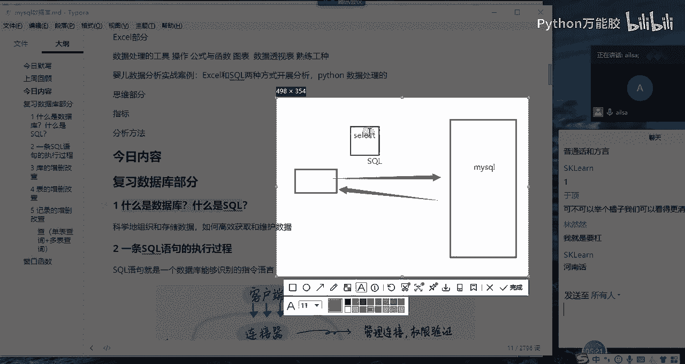

我们看一下哈，首先呢哎这个我们要先建立连接，对不对？你只有二者建立起连接了，你才能够相互通信。所以说我们要有客户端跟我们的服务端建立连接。那在我们的实际的操作过程当中是怎么建立连接呢？哎。

你比如说现在给大家演示一下。

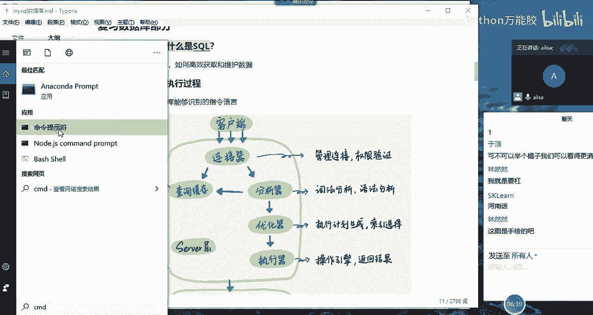

嗯，那我现在考一下大家吧，我们怎么建的连接？

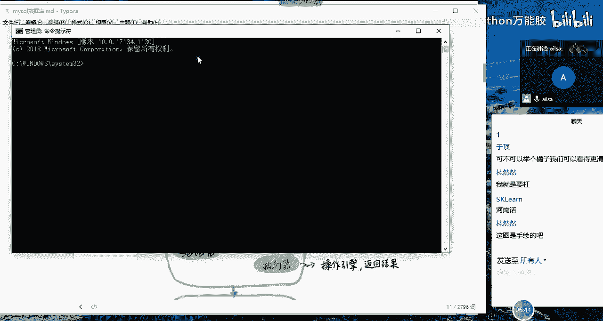

同志们，如果说现在我想连接我的mysql的 server了，我该怎么办？嗯。OK买 circle，然后我的用户名和密码，然后还有我的端口，对不对？因为我整个的1个8。0的话。

它的端口跟我不是默认的3306了。所以说我要加上我的端口，也是杠UROT对吧？杠大P啊，3308啊，然后是杠小P啊，我为了不让大家看到我的密码，所以我在这里面输入密码。OK哈。

这个时候我是不是已经建立好连接了，那就是我们的马scle杠U啊，就输入我们的账号啊，输入我们账号，输入我们的密码，输入我们的端口啊，这样我们就可以。好。

这样我们就可以打开我们整个的一个呃数数据库的一个客户端了。相当于我们已经跟服务端啊已经建立好联系了哈。因为我的my circleql服务端是啊启动计算机的时候自动启动的哈，所以说就不用开服务了。

大家也知道我们在哪开服务是吧？在我们的服务里面。

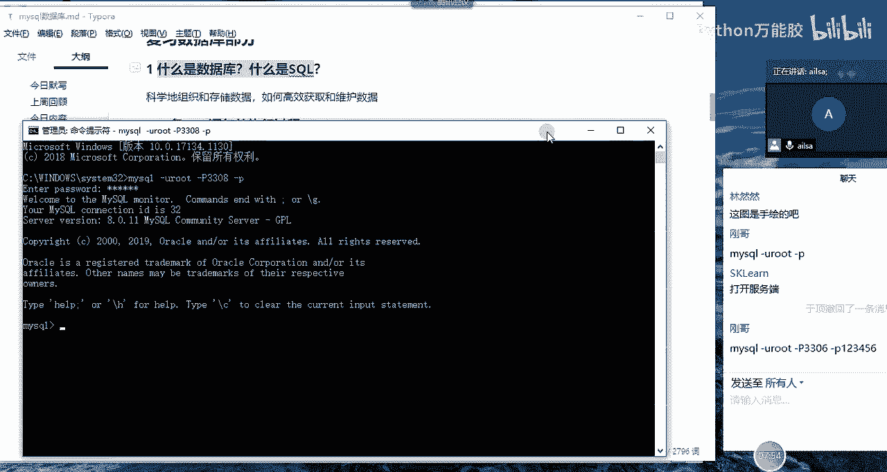

在我们的服务里面是可以开的哈。OK那现在我启动了之后，相当于我建立好连接了。然后我在这里面写了一条哈，这个时候我们需要定位到数据库，对不对？我们看一下有哪些数据库哈，s data basis。

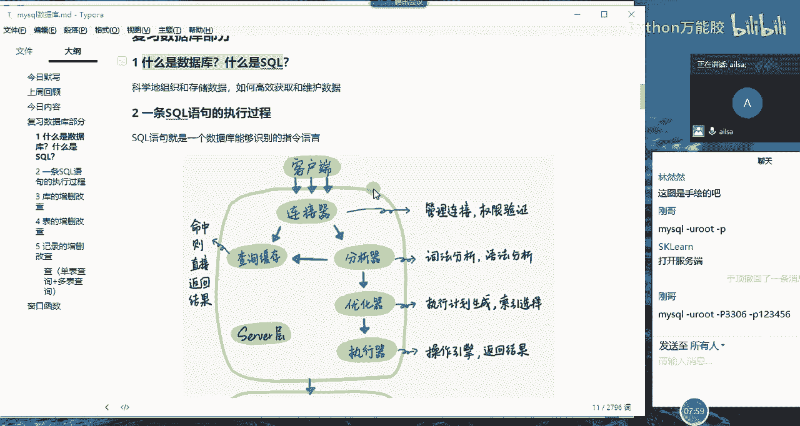

还记得吗？啊，是不是很熟悉，sho the visit看一下哪些库哈。假设现在我使用的是STU杠 infofer哈。use哪个数据库STU杠infer。嗯，好的啊。啊，这个时候我们聚焦到这个数据库下面。

然后show tables，看一下这个表里有哪些内容。OK有我的学生的相关信息表。现在我发送一下啊s语句s from。From S T U STU表。ID啊应该是SID。等于一啊。

我们看一下能不能成功哈。啊。OK可以的是吧？你看我这边发送了呃一条cicle语句，select星 from STU where啊SAD等于一哈。大家看到这个这个数据怎么感觉跟自己看的不太一样哈。

这个STO是一个视图哈。啊，我在。我们等会会讲哈ITUDENT studentdent表哈。OK哎，这个时候我就找到了我的一个学生哈啊呃一个学生的呃SID然后性别，然后他的整个的一个班级的ID。

还有他的他的一个姓名哈，叫理解哈。这个这个名字起的哈。OK那我发送了这条思科语句，它是怎么给我返回过来的呢？哎，我们看一下它整个的一个执行流程哈。首先啊他会先去缓存里面去查一查啊，什么意思呢？

就是说他看看我之前是否有这样的一个查询的语句的结果。如果有的话，它会放到缓存当中。那呃如果我在查询的时候缓存里面刚好有的话，他就会直接返回结果。但是我跟大家说一下。

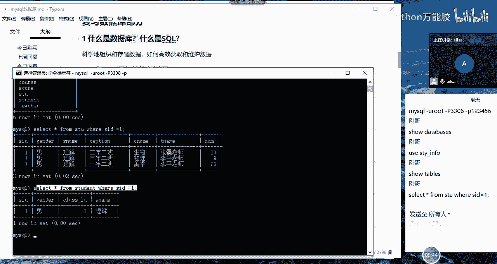

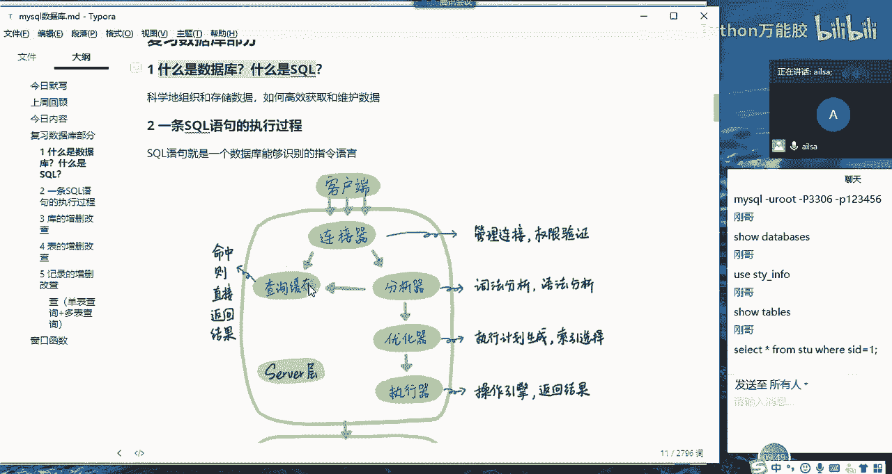

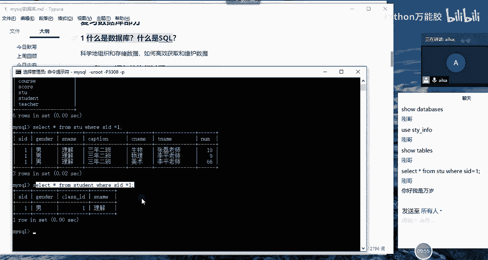

但是我跟大家说一下，这个缓存里面的一个命中率是非常低的，为什么呢？是因为我你想一下，缓存肯定是基于上一次的查询结果。那如果说这个数据里面的内容是有更新的同样一条查询语句。

缓存里面是获取不到的你比如说你查询的呃打假设哈你查询的class ID唯一的。假设你在第一次查询的时候是这样的一个结果，后面你对数据库进行了一个更新，那在缓存里面它肯定不会更新的。

但是它只要判断出来你这个数据class跟ID啊，这个数据是有更新的话，那你这条查询语句，然后它在缓存里一看哎这个数据是不全的，然后它就不会命中，它又会跑到这里面去执行。那所以说我们数据库当中的数据。

你想一下，它是基于每某每个项目而建立的整个的一个内容。所以说每个项目每次的就是它是在线上跑着的。所以说它的数。

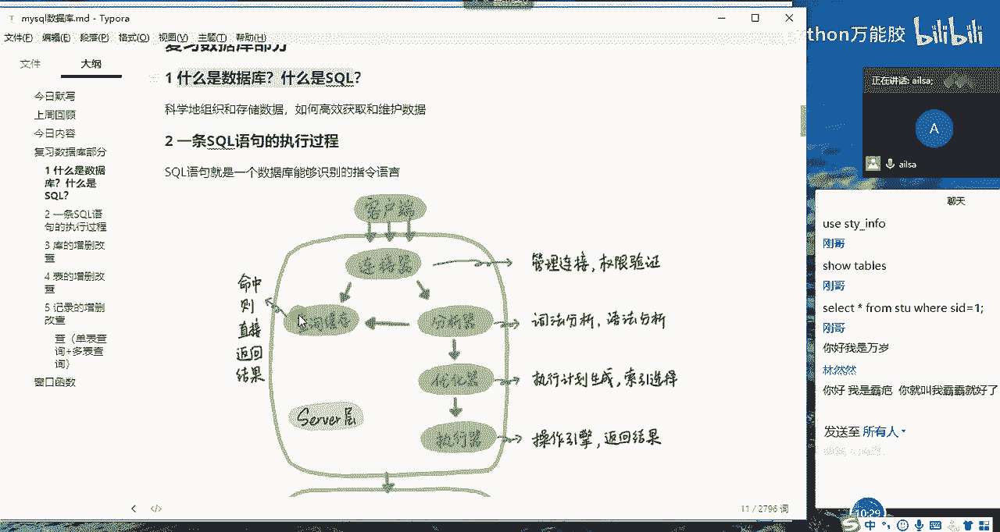

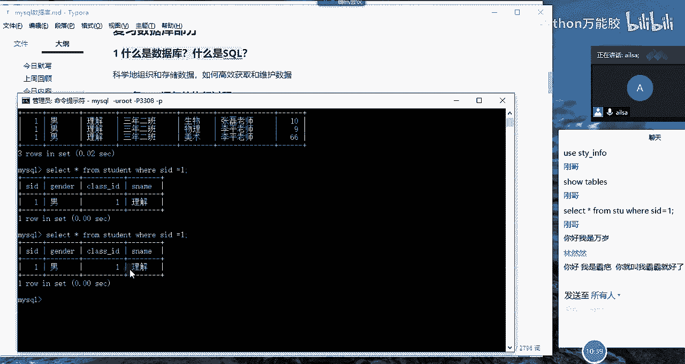

数据是不断产生的，它整个数据都是处于更新的状态。所以这个查询缓存的命中率是很低的，它的效率也不高。所以说基本上走这一步都是白走啊。所以你知道就好了，这个查询缓存的命命中率不高，让他也会走啊。

然后如果说在缓缓存里这边查不到，然后他会走接下来的这一步操作，就是他先到分析器分析器里面去看一下你的词法分析和语法分析，什么意思呢？什么叫词法分析呢？就是他过来之后是看一下你到底是select呀。

你到底是upd dateate呀，你到底是呃什么什么这样的关键词，哎，他想知道你到底是想过来干嘛的。然后这是词法分析，如果是语法分析，就是他看你的这个整个的一条circle语句写的是否正确。

你比如说你在这里面写select from student，然后where你少了一个E。

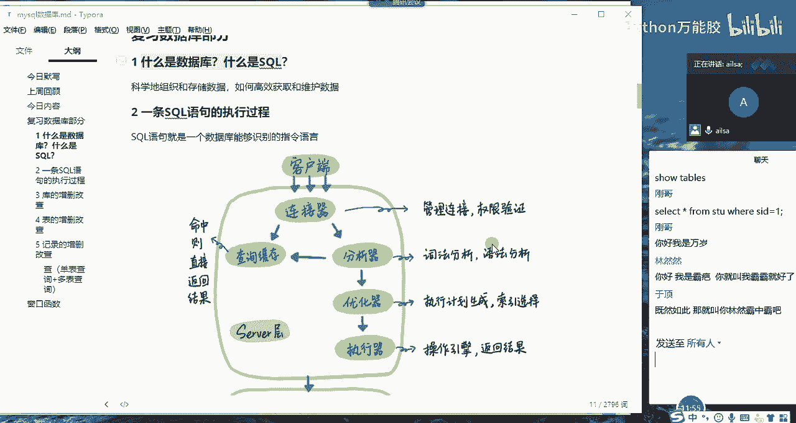

🎼哎，你看它会报错，哎，你这个有have an arrow in your circle啊，这就是语法的意思哈啊。SNTX是语法的意思，哎，你这语法有错误啊，你回去自己再看看吧。

相当于是我们走到这里就返回回去了。因为它这边一分析出来，你语法有问题啊，所以就给你报了一个语法错误。那如果说你这边啊语法没有问题之后，它接着会往下走，走到优化器这里。

就是它会根据你整个一个slack语句，然后它会执它会生成一个最优的执行计划，生成完了之后，它会给到执行器，然后执行器跟存储引擎进行一个交互，就是到存储引擎这边去获取数据，然后再返回回去。

然后一步一步再返回到我们的整个的一个客户端啊，应该不是一步步返回哈，就是获取到数据之后，然后就返回啊，直接在执行器这里直接返回给客户端这样的一个结果就实现了。那其实这个就是一条的执行的过程。明白了吧？

你比如说存储过程这里，大家应该也学过。

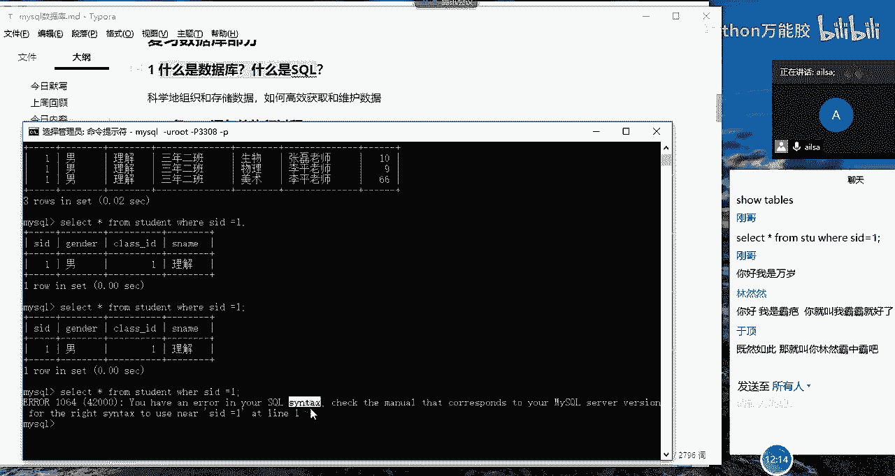

就是说我按索引去查找，对不对？假如设你的整个的一个V条件删索引啊，索引来实现的那它的查找的效率就会高一些，就会在这里去实现。如果说啊你的索引没有命中，他整个查找的一个速度就会慢一些啊。

是在这个过程里面去执行的过程当中去实现的。也就是说执行器走到这里之后，他会给到存储引擎，存储引擎去发动啊发送它的能量，或者帮他的动能，然后去获取到这个数据，具体是怎么获取的。

就是根据B加属的原理来获取到获取到之后返回什么叫接口呢？就是他给到这个他给到他的需求，然后他返回结果，给到这个执行器执行器再直接给到我们我们就获取到我们所想要的结果了啊。

大家对于一条sQ的执行过程都听明白了吗？之前老师有没有讲过。之前老师讲过吗？同志们。讲过不相信。呵啊，今天听明白了吗？啊。😊，今天听明白了吗？哪点不明白，我可以再讲。嗯，懂的吗？是不是没听明白。

都没有人说话。啥意思啊？这是还是没听明白吗？没听明白哪哪没听明白，你不能让我再讲一遍。嗯，都没听明白吗？听明没听明白给抛出一个问题。然后如果听明白了，给我扣个一。嗯。哎有。什么情况？是白牙卡了吗？啊。

嗯，那我再简单的串一遍哈，再简单的串一遍啊，也就是说嗯也就是说嗯我们作为呃客户端啊，我们作为客户端啊，然后我们发了送了一条ciQ语句，叫什么呢？啊，叫slect啊。

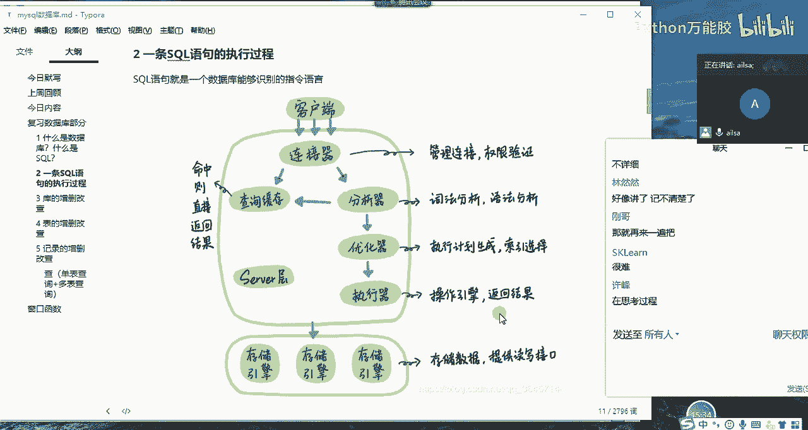

星啊from STUDNT student然后where IDD等于1okK我们发送了这样一个srcle语句，然后给到我们的servver端啊。

通过我们的sockcket底层通过我们sockcket来实现的。给到servver端之后，它第一步过来之后，它第一步先分析你的词法和语法。什么是词法呢？

就是select就是它主要分析的是关键字select啊where啊这样的关键字。比如说update什么。等等这些他先分析这些东西，看你到底是想干什么，大概判断一下你此次来的目的。然后判断完了之后。

他大概知道了你想干嘛之后。然后再看你的一个语法分析的情况。也就是说他看你这条语句写的有没有毛病哈。你比如说你这个select少了少了一个T，或者少了一个E。

然后where尔少了一个E少了一个R等等这些如果说有问题，它会直接返回回去告诉你语法在某个什么什么附近，哎，有问题。你比如说啊我刚才给大家看了哈，有问题。然后这个时候你走到这一步就已经结束了。

但是如果说你语法没有问题，它会到优化器这里什么大家不用去太过于深入的去研究这个东西。因为它底层你想一下，myscle或者是circleserv和oracle这些它是一个系统，是一个软件。

是别人在不断的进行优化迭代的过程当中实现的高效进行数据管理的一个工具。所以说它整个的一个代码含量比咱们所做的系统要复杂很多。它中间的功能是我们想象不到的。

或者说是我们目前无法去探究的那它到优化器这里之后呢，它会执行计划生成。也就是说它大概。嗯，他大概知道自己该怎么干了啊，比如说我到底呃到底是呃哪一走哪一步走哪一步啊，所以的选择。

然后就以最优的那种方式然后去执行他自己大概有这样的一个思路了啊，就跟我们做分析似的。我大概的分析思路已经已经已经设计好了，设计好了之后呢，我就开始干活了，哎，就是操作引擎啊，就是说我要执行的时候。

我是给到存储过程，让存储过程啊，把我需求给到存储过程之后，存储过程通过它整个的一个呃存储的原理啊，存储的原理数据存储原理，是不是我们的必加数的呃就是必加数的原理。他通过这样的一个存储引擎的操作方式。

然后把数据结果获取到获取到之后给到执行器，然后执行器返回结果。那他就会返回我们刚才所想要的这个结果啊，就是我们刚才啊。

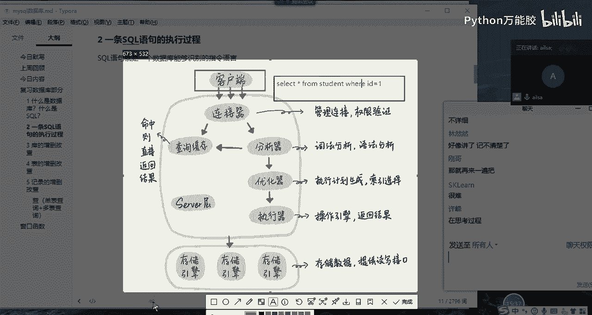

from student where SID1这样的一个结果就给到我们了，这就是整个的一条circle语句执行的过程。执行器就是按此法操作。存储眼擎，更新删除进去。啊，对啊，其实这个这个不是的。

其实这个词法分析和语法分析呢，就是哎怎么说呢？它就类似于呃它就类似于呃呃大家都知道我们一条s的执行，就lect from什么什么表where什么什么go by什么什么，它是有顺序的，知道吧？

它是按照一定顺序去执行的那这个时候其实就是通过词法分析来实现的。然后他分析一下整个的一个过程，然后按照最优的那种执行方式。比如说你的整个的查询语句，还有连表查询。

比如说le join right以及内连接整种过程，它它会有一个方案确定到底先查哪个表，结果出来了之后，我再查哪个表，然后这个词法分析就类似于说我就是先过来之后。

我先看看你整个的一个呃就是要调用我哪哪哪些功能。

似于这样啊，就是你到底想干嘛啊，然后我就会在后面的时候，就是说我执行的时候，我就调我这一部分功能就可以了。比如说你是过来slag，还是过来upd dateate的。

还是过来deleate的啊这样的一个过程，不用去详细的不用去详细的去探究这些东西，只要知道。这样的一个执行过程就可以了啊，你在跟面试官描述的时候，就按照我这个思路啊，完全是没有问题。

而且很少有人去探究整个一个一个个的操作步骤啊。呃，这个明白了吗？明白给我扣个一。嗯，同志们。没明白。又没想明白。啊。明白了明白了明好嘞。好嘞好嘞嗯。你就讲比较浅显的就行啊。

底层的咱们也没办法去探究太审啊。OK那我们讲了它整个一个原理之后，那接下来我们就通过啊库的正善改查表的正善改查，以及记录的正善改查这三个不同的维度，然后带着大家然后去简单的回顾一下哈。

首先哈首先我们先跟库库就比较简单了啊。嗯，那我们直接就看第三个，就是说我们如何创建一个库呢啊。

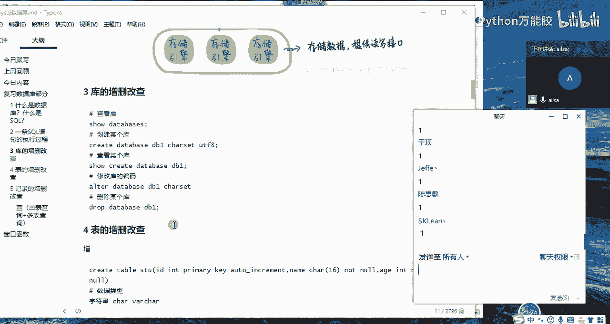

我们如何创建一个库？啊，我们都知道对于DDL的这样的一个操作方式的话，啊，create CRENTE啊。Create。放这儿吧。对 createre a database。Create data。

base啊 databasebasecreate database，然后是我们的库名，对吧？比如说我们两场day啊。对01，然后我们创建数据库的时候，可以指定我们的编码叉s，然后UTF8对吧？

我们可以指定编码，也可以不指定啊。那我们在修改数据库的时候，也是只能修改编码，名称是无法修改的。嗯，这个时候我们在修d basiss。这s the basis就是查看啊所有的库。哎。

我们看啊day0已经出来了，对不对？那我们想查看某一个库该怎么去操作呢？how啊create。Database。啊，然后是day01，哎，是不是这样子？哎，这样的话我们就查看了这个库库的一些。

基本的信息。你比如说他默认的编码是UTF8这样的查看和创建。然后我们看如何修改，修改的话就是out啊。对于DDL这样的一个操作语句，就是out修改out databaseb啊dbase。

然后是day01啊，我们只能修改它的啥呀，我们只能修改它的。啊，它的编码对不对？

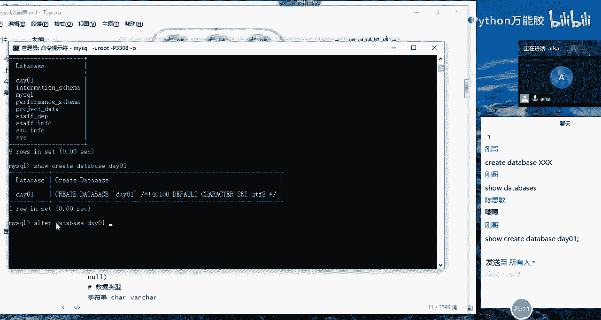

啊，看一下啊啊out databaseDBE叉et哈叉et。

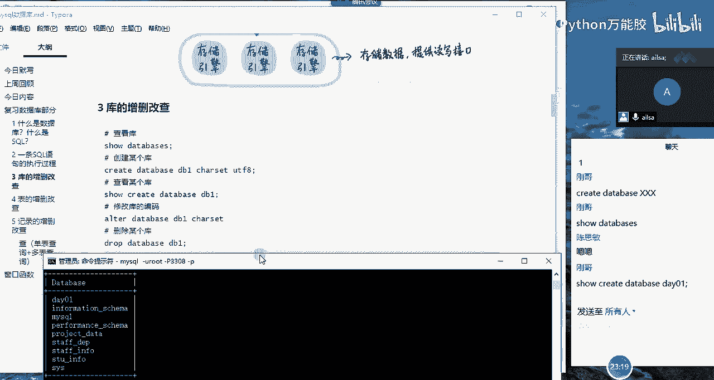

etUTF8，因为我这边只能改拉丁什么，还有一个是吧？啊，GBK也可以。GBK。OK哎，我们再一次s create database呃01，这个时候它的编码就变成了GBK啊，那我们如何删除一个库呢？

其实就是dropDROPd databasease啊，dase day01。db database day01哪里错了呢？dabbaseDROP打错了哈。DROPOK啊，然后我们再修。

修 databases看一下已经没有了，对不对？那这是我们在呃整个的一个终端，也就是我们的客户端进行编码操作的时候啊，你看大家都还记得哈，说明还可以哈，没有完啊对。

那对于整个的一个库数据库的一个操作的话，我们呃新增是create。然后我们修改的话是out，但我们只能修改编码名称是无法修改的。然后嗯删除的话是drop对吧？啊。

还有什么删改查的话是修 databases是查所有的库，然后修 createate database啊，什么什么啊是查某一个库那这是在终端进行一个代码编写的时候是这么来操作的，可以看得出来啊。

就是还是需要大家去记一下了，对不对？那如果说是在这样的一个啊，我跟大家介绍一下是一个。

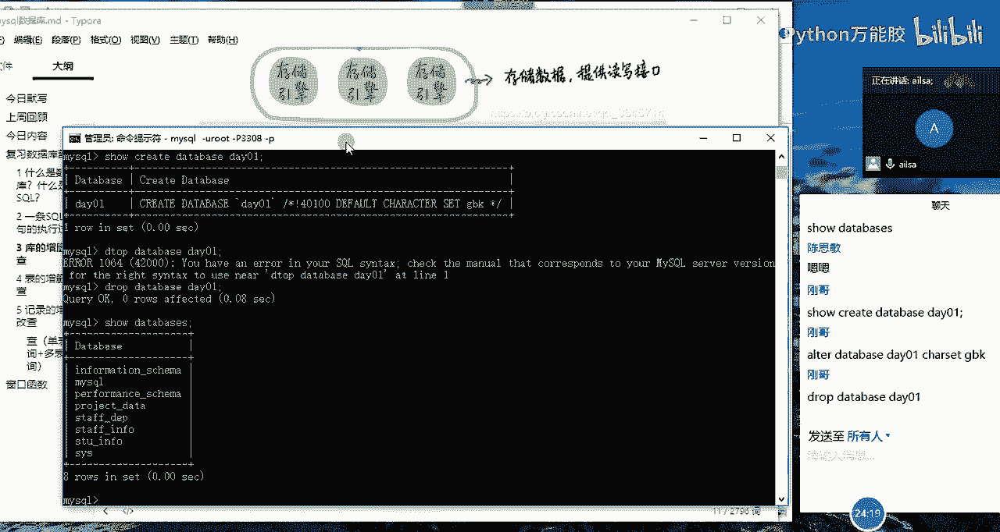

啊，是一个开发好的工具类的关于数据库的啊这样的一个可视化的啊操作软件啊，是是它就是为了方便我们在工作当中，嗯，工作当中啊就是嗯就是降低我们编写代码的一个难度。

然后提高我们整个的一个circle编写的速度啊，这样的一个啊这样的一个工具还很好用。那我们在呃na里面如何创建一个库呢。有机啊新建数据库，然后把名字一写啊，这个可以选择默认的也可以自己选。

是不是就完事了，非常非常的简单哈。所以说啊所以说我们在工作当中，大家看一下整个难度系数还是比较低的哈。但是为什么说老师在讲的时候，一上来就给你用终端呢，其实就是为了练你哈。

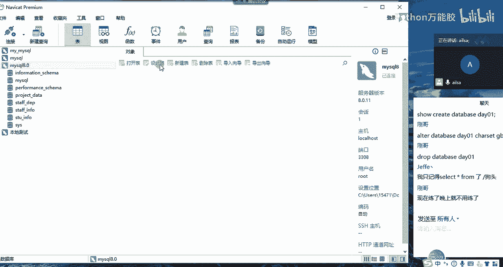

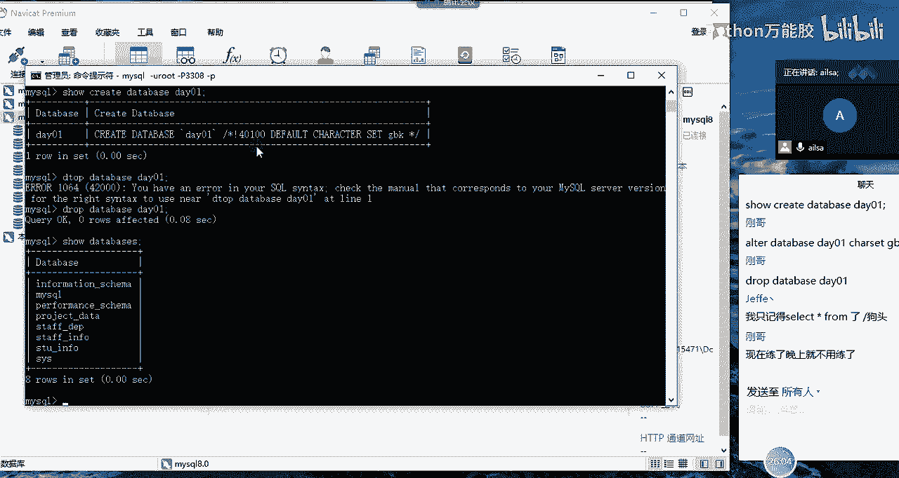

对，就是为了练啊。如果说你一上来用namecast，你的整个编码你都问完了，所以说还是要用终端啊，我现在也比较习惯性的用终端哈。呃，但是我们作为数据分析师，用namecast也多一些。

也会有很多公司都在用哈。

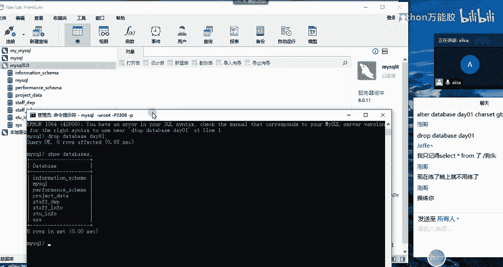

对，就是列你哈。OK那我们这是库的操作，我们就讲到这里哈，比较简单。我们的征删改茶异就讲完了。然后我们看表的操作哈，表的操作的话，哎。

你比如说现在我再新建一个哈create CREAT createate data。

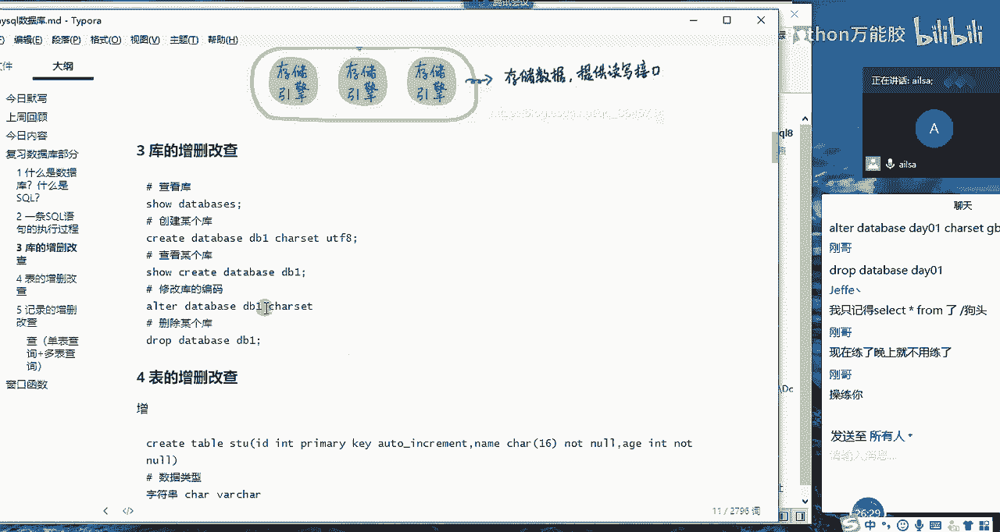

对，01哎，我们创建一个这样的库，然后我们创建表啊，大家现在都可以跟我一起去打这个东西哈啊不要看笔记哈，create啊。Table。我看谁写的比较快哈，create table啊。啊。

对等于1OK这是创建库可 table，然后是表明对吧？比如说我们创建1个ITO吧，student哈表明，然后啊我们后面跟的是字段，对不对？那首先基本上先跟一个IDID是字段名，后面跟它的数据类型。

然后再跟它的约束条件。PRIMAMARYprimary key哈，我们还可以给它设置成自增auto an inement，不知道大家还记不记得哈out increment哈，这是自增。

然后我们再设置个name啊，name是char我们可以设置成char啊类型，基本上16应该够用了哈，然后我们还可以设置age age是int类型，我们可以给它加个约束条件，not none对吧？

我们还可以再加一个bo啊，both杠data啊，出生日期，它可以是data的数据类型，对吧？哎，那这么多之后，其实我们就差不多了。哎，语法错误，我们看一下哪有错哈呃， near both啊可没有加逗号。

啊，这个其实啊这个会很常见一些，可以加个逗号，然后我们再看okK这 already已经存在了啊，我们看一下哈。稍等啊。我用的这个库不是刚才已经删完了吗？哦，刚才已经创建了是吧，s tables。

因为刚才报错，还可能给你穿建裤了哈。我用的啊，我没有切到啊，我没有切到这个。day01下面，我现在还在呃这个ITU杠infer下面，所以我要切一下哈，有 day01。啊，这个时候我再进行创建。

OK就可以了，对吧？没有一个人能跟得上哈。😊，啊，都在写，是不是OK大家都可以跟着我一起写哈。😊，我们这个时候再show tables。T表 yes。OK ok这个时候我已经有SSTO这样的一个表了。

那我有了这个表之后，哎，我是不是要往数据里面插入数据哈，这就是我们的啊iner into啊插入数据。O刚刚写出来了，我看一眼。

Create a table until I different making out the inement。啊，不是ok没有问题跟我的一样哈。😊，好，那我们接着往下插入数据啊。

插入insert啊int啊in啊in表是我们的STU对吧？啊，然后如果说我们想每个字段都插入的话，直接写values就行了。我们如果想指定字段的话，我们可以在这里面指定。因为我们的ID是自增的。

所以我们在这里面就不写了，直接写name。啊，name age对吧？还有一个borth。Borth date。Bor gun date。OK哎，这三个又没有加逗号？A句没有加逗号。嗯。我给这中文的。

OK嗯。加完了之后，我们后面是values，对吧？values我们可以加啊什么呢？嗯。刚哥。啊，然后刚哥的年纪，刚哥是95的是吧，那应该是嗯。呃，25。嗯，然后出生日期95的。

那就是2021995-02959595995几月。嗯，几月？让大家知道你的生日，回头记着一下。暗恋的人可以给他过生日吧。刚哥几月的？2月30啊，跟我妈在见。202啊，谁认识刚哥的，一定要记得他的生日哈。

啊，阴历阳历啊。日期是不是要加双引号？朋友加上一号。1995讲。不加双引号吗？我试一下啊，杠呃2月30啊，我们先我们先弄一个啊，弄一个进去试试。OK啊，出了问题，wherea values VAL。

values VALUy，这写错了，所以它报语法错误的时候，你要看它VA。How you， yes。🎼OK又错了，是在b data里面错了，那就是不加双引号。没关系啊，我们报错的话，就去找原因就可以了。

🎼我K又错了from birth刚data，我写错了吗？2月没有30号。は。对呀，二瑞没有30号。骗子我看啊，先别着急，19values increment1963。嗯。不好意思。😊，2月28现。啊。

1973，我看看啊。1973forour birth。bo杠data，我看看我的表。DDC。DC。At you。看看啊。😔，大家找一下是引号的问题吗？加引号吗？不是不加吗？我加了吗？我没加呀。我看啊。

稍等一下。OK那呃。😊，好嘞哈，那刚才报错的这个原因是因为我们在输入日期的时候是要加上双引号的啊，所以说啊刚才一直报错哈。OK现在就可以了哈，我们插入了两条数据，因为这里我们的主件是我们的主件是ID。

所以说它会自增啊，然后我们再查询一下数据哈。嗯，Select。O然后看一下是不是两条数已经进来了。那我们ch入数据这样的一个呃语法就是insert into啊表明。然后这是指定的字段名。

如果不指定字段名，就默默认是全部都有，你后面都需要填。如果你指定了部分字段名，你就只只需要填部分就可以了。然后带一个values啊，这是我们的ch入数据，然后。

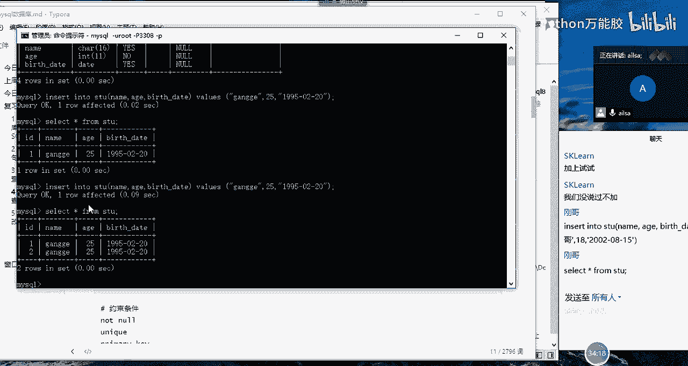

那我们创建啊创建表了之后，那接下来我们看哈啊那我们在创建整个表的过程当中啊，我们会发现我们需要啊需要回顾的有两个知识点。一个叫数据类型，一个叫约束条件啊，那对于数据类型而言。

我们啊应该讲了大概这么几种哈，一个是字符串差和挖叉，我在这里面就不举例子了哈。因为之前已经讲的很详细了。然后整形是int啊，小数呢是float dis和 doubleou啊，一般情况下用的是float。

然后它的组成的话是这样的，一定要记住这一点。首先第一个组成部分是它的所有的啊数字的长度。你比如说我写了一个5，然后小数部分你写了一个2代表总共长度是5小数部分是2，那也就是整数部分为3嗯，然后em的话。

它实际的本质存储内容是字符串的形式。所以说它能够实现非常精确。的一个实现效果。但是我们也不需要实现这么精确哈。那double跟fat相比而言，double更精确一些。但是我们也不需要。

所以说fat足够了啊，在我们的啊在我们整个的一个数据存储当中f足够啊，那日期呢我们分date和d time啊，这两个就没必要去讲了啊date的话就是到日期daate time就是日期加时间。

那还有一个枚举inum inum，还有一个set两者区别在于一个是单选，一个是多选，也就是呃你在如果它设置的是set里面的类型的话，它可以选择其中的呃任意多个啊，一个两个3个4个都可以哈。

那inum呢它就是只能二选一。你比如说性别啊，你就可以用这个类型。那你比如它的爱好你就可以用这个类型哈用set类型set本身代表集合的意思哈。含应面目是枚举的意思。OK这就是我们的数据类型。

那再对于数据类型而言，常考的就是我们的字符串啊，字符串呢分差和Y叉。那它两者之间有什么区别呢？首先第一个啊就是它的呃它的一个呃存储的呃存储的长度吧，我们可以这么去理解，一个是定长，一个是不定场。

什么意思呢？那差它如果说嗯都是比如说你指定的是同样啊，同样二者啊，假设二者指定的都是6哈。二者指定的都是6，那它们的区别在于什么呢？那差这里面如果你的内容是小于6的那它也会按六去存储。

不足的会空格去填充。那挖叉呢它是按照实际的长度去存储的。比如说你这个是三，那它叫存储的是3啊，它要小于6的话，它是存储的实际的长度，那二者如果说存储的内容都大于6的话，大于6的话。

如果我们设置的整个的一个circle mode mode哈，srcle mode哈，我相信你们还能想得起来哈。circle杠 mode，也就是我们的模式，如果是严格模式会报错。如果是某糊模式。

它就会截断。自己回去再看看啊，supermo哈会截断啊会截断。也就是说模糊的这种的话，它就认为你只取前半部分就可以了啊。那第二个区别在于什么呢？它的存储的底层原理，那差呢它其实就直接存的是内容。

那挖叉呢其实它分了1到2个字节给到它实际的存储的长度啊，你比如说它前面1到2个字节存储的是啊这个内容是三哎是四或怎样，然后给它一定的长度的一个存储，以便它按照它实际的一个长度去存储。

那按二者最终啊效果上啊，对，爆头，那没问题哈。那二者最终效果上有什么差别呢？差更快啊，挖叉更节省空间啊。这只是相对来说哈是相对来说没有绝对的。如果说你的内存不不足或怎样的时候，你可以使用挖叉。

如果说你追求效率，你可以使用叉，那以目前的一个呃条件来说啊，磁盘的内存已经不是一个问题。所以说越来越多的人采用差作为我们整个的一个效率提升的关键。然后也就是所谓的。嗯，一啊空间。换时间啊。

以空间换时间来发现我们想所想的效果哈，这就是我们数据类型我就介绍到这么多。然后约束条件我们讲过的有not none啊，就是不为空啊，unique唯一也就是去重的操作。

那primary key也就是我们的主件啊， key是我们的外键，对于主件而言，它跟索引哈，它跟索引密切相关啊，那跟索引相关，就会跟查询效率啊密切相关啊啊，所以说大家知道这个啊。

以上信也都已经讲的很详细了哈。所以说我在这里就不进行一个详细的讲解了啊，那这就是我们对于新增而言啊，表的新增而言，我们需要掌握的内容。那对于差和挖差的区别，我刚才也已经讲过了，好吧。

OK那我们看一下表的操作哈啊，我刚才啊表的更改操作哈，我们新增啊是create，那我们修改一个表，哎，那就是还是al哈outer。哎，我们来试一下哈。

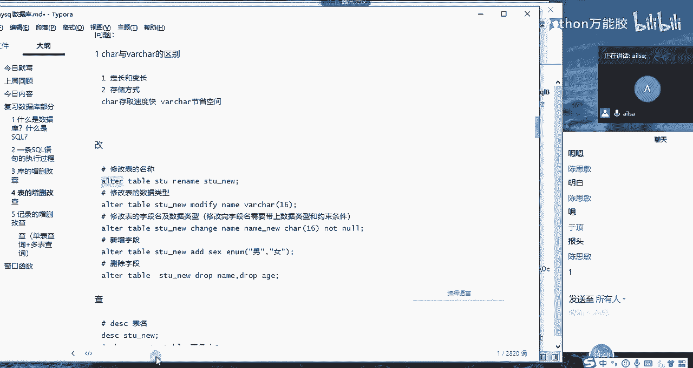

嗯，比如说呃现在我只是修改哈，大家的我要因为表的操作的话，可能很多人记得不是特别清楚了哈啊比如说现在我想修改一个表的。嗯，这表的数据类型只修改啊，它的数据类型应该有什么？out table哈STU啊。

只修改一个表的类型，我们有model five MODIFY对吧？model five。然后比如说我们想修改age的数据类型啊，我们修改它为。差哈假设哈我们修改它为知不算，然后差差几呢？叉4啊。

这样应该是可以的吧啊，我们看一下啊，我们的设计的应该是没有问题的。然后我们按按键试试。OK错了哈，我们看一下我们最开始设计的它的整个的一个。嗯，age啊，它还有一个notote none哈。

因为我们在这边修改。嗯，应该不至于吧啊，modelify可以修改它的数据类型。需要加上no number吗？啊。

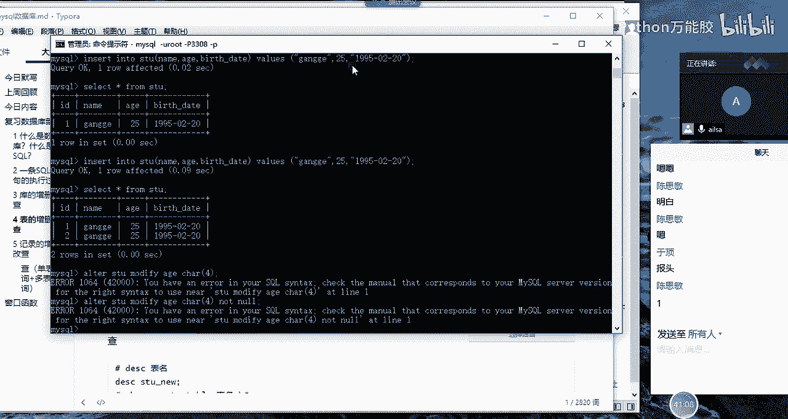

嗯， I'm a DY。

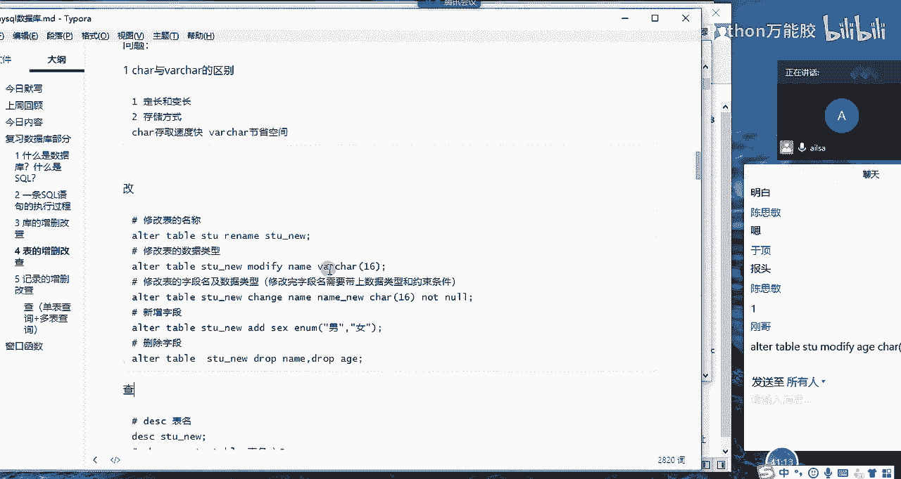

Outder table model M D I F Y，我 table。我还要加上pa，sorry啊。out table哈，我以为是 table不明。我说呢。out table啊。

我们要加上table啊，跟out database是一样的哈。out table STO那就是我们的表名，然后model fine，然后后面是我们的字段，然后是我们的约束条件A啊就可以了。

这个时候我们再看DEIC。Table。啊，tableable。DSC。还提有。

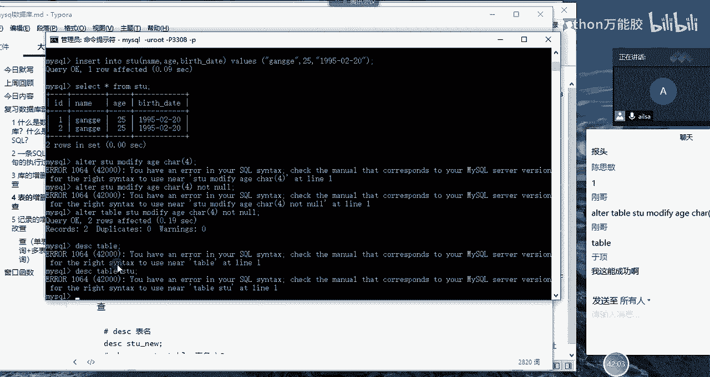

查看。表达查看我都不会了吗？DSC啊不用加推宝。

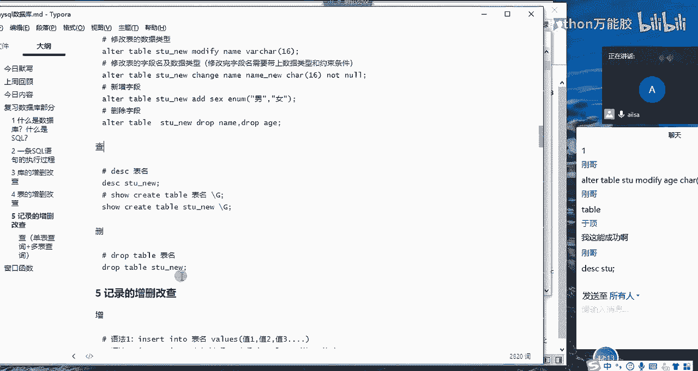

我被你们。搞混了。😊，哎。嘎的一批啊，OK哈DNC表明就行了哈。刚才少加了个table，我现在又一脑子里只有table这个词了哈。OK我们再看一下这个age的数据类型是不是改成了叉啊。

那这就是我们第一个改我们的数据类型的操作哈。那接下来我要改字段名，哎，或者是呃加上我的数据类型，或者不加我的数据类型都行啊。这个时候我应该用哪个啊，哪个单词，大家想一下，我要改整个的一个字段名了。嗯。

😊，Out the table。哪个单词不用打全字了。把他退不。out ITUchange哈change是可以改字段名的，而mod它只能改数据类型啊，我不知道当时你们老师讲的时候有没有区分过这个哈。

因为我自己确实是试了试，发现确实是这样的哈，change。比如说我现在啊改我的age哈，改成H一啊，我试一下是不是这个哈，现在我只改啊字段名。

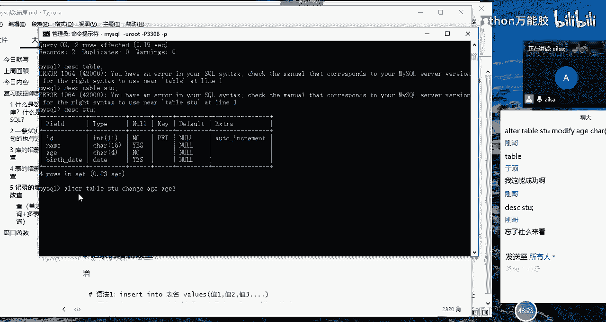

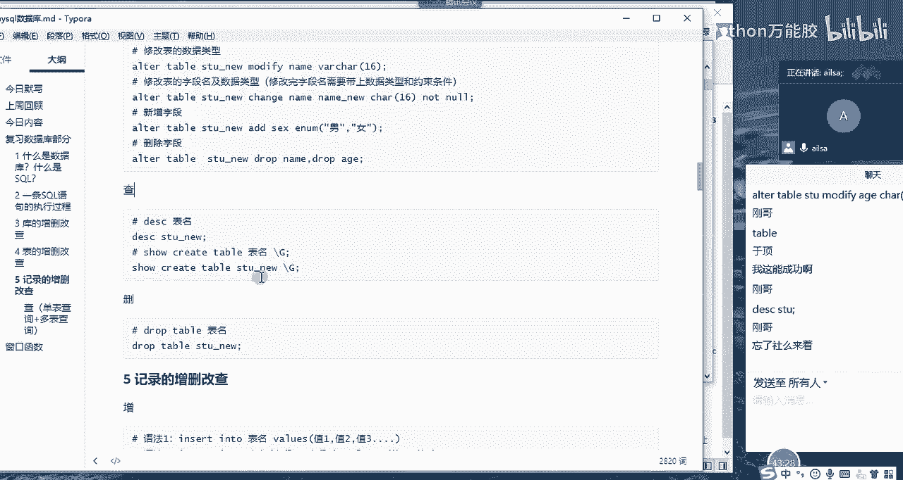

Change。我要指定他的数据类型才行吗？啊，我们这边把它改成in。OK是可以的哈。那也就是说你要改它的一个字段名的时候，你要指定它的数据类型。然后如果说你指定一个新的数据类型，代表你改了它啊。

就是连字段名和数据类型都改了。如果说你要指定原来的数据类型，相当于就是说你只改了它的字段名，数据类型，还跟原来的保持一致。但是你需要写上啊，你需要写上啊。因为你不写的话，你看刚才不写，他就报错了哈。

他报错了。自己可以回试一下，因为这个确实是用到的不多哈，我们主要用到的是表的查询哈。我看我今天能翻几次车哈。烦的我都出汗了。OK啊，这是我改表的字段名啊，然后以及我的数据类型。

那接下来啊我们还可以对表进行一个新增字段啊，新增字段的话就是ad啊添一个字段哈。比如说现在out table。

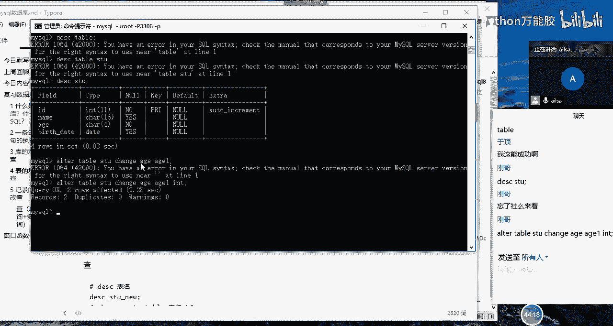

table ITU然后ADD啊ADD哪个呢？我们添一个我看添一个sex是吗？填一个sex啊，然后嗯这是我们的字段名，它的类型是我们的枚举，然后是。男女吧。男。女啊，O。我们试一下哈。😊，OK可以了。

这个时候我们在DNCIQU。哎啊这边的话S啊那个它整个新增一个字段名就出来了啊，这是新增一个字段名。那我们删除呢啊删除一个字段名。

就是还是我们的drop哈out table啊table STU然后drop好，我们把刚才那个字段名删掉，也就是sex试一下。哎，这样就可以了。然后我们在DSC看一下，是不是已经删除了。

那其实这就是表的啊一个呃就是修改的话，我们可以新增。然后我们可以修改修改它的呃字段名，修改它的数据类型啊，数据类型啊，还有个默认是没有问题的对，有个de是默认的O呃，那这是修改操作。

那接下来我们看一下查的操作查的操作主要有两个。第一个就是我们常用的DSC那第二个的话就是修 table表明哈这个跟我们的数据库是一样的，cate table啊STU啊，这是我们看一下，哎。

大家出来这几个不好看对吧？我们还可以对它进行一个格式化或者是那个内容的优化，就是杠G看一下。

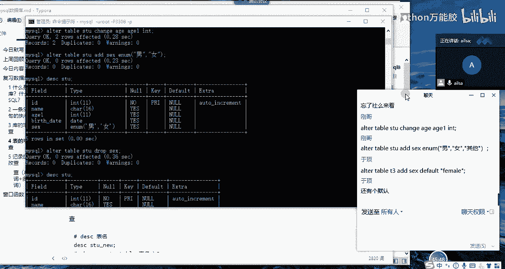

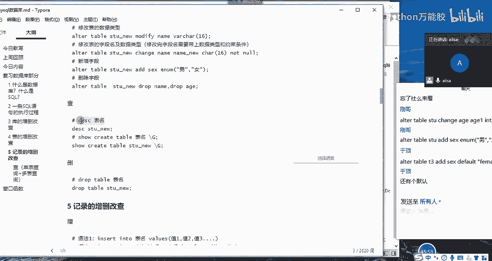

哎，这样的结果就出来了，对吧？啊，这样的一个显示啊会更加的规范一些。我们可以看到它那个内容会更详细一些，包含它每一个字段的数据的呃类型约束条件以及它的存储引擎，还有它的呃它的呃编码对吧？啊。

它的编码这样子啊，自征啊自征啊。大概是这样啊，这就是我们查看一个表的结果。那删除一个表啊，删除一个表就是d啦。drop table TROP。D，R，O P， drop table S， T U。

okK啊，就删除了。那我刚才所有的操作就已经完事了哈，征删改查我们再看一遍。嗯，那呃就是先看呃新增的话就是create create table，对吧？

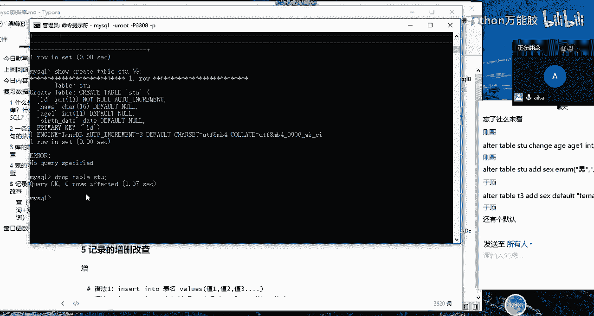

嗯。我们新增是re table，然后修改的话就是out table。然后我们可以改表的数据类型啊，我们还可以改表明哈rename可以改表明rename然改改表的数据类型是mod然改表的字段名和数据类型是chan但是改的时候需要带上数据类型和条件。

你看修改完字名需要带上数据类型和条件，说明我当时在自己做测试的时候应该是采过这个坑，然新增字段是ad out table后删除字段是out tableout table明dd一个字段逗号再d一个字两个字段都可以删掉这样结。

其实也一样在里面可以加个逗号，然后再ad新增这样的一内容不是一下多你要单独添加新增结果。然查的话就是D明。然后s table表明杠G这样的一个结果，删除是drop drop table。

这个就比较简单了。那以上就是我们库和表的操作，相对来说还是说比较。简单一些哈，其实难点在于记录的征删改查哈，难点在于记录的查哈，增删改都不难哈那我们需要休息一下了哈。

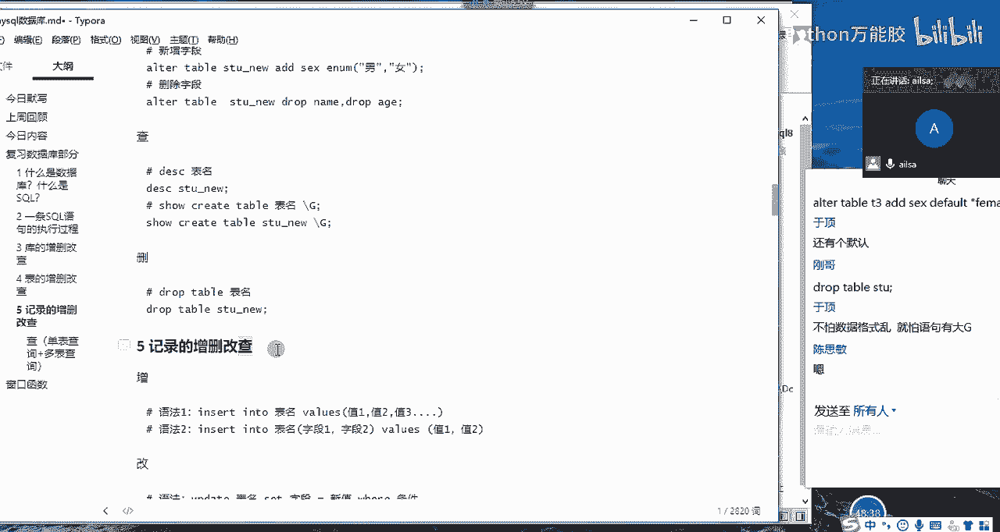