# 以前嗤之以鼻，现在逐字学习！缠论量化代码大公开！｜ 全网独家！用Python量化缠论，一键自动生成交易信号 ｜ 缠论基础知识讲解 【量化投资邢不行啊】 - P1 - 量化投资邢不行啊 - BV1yT421S7QW

1000个人眼中有1000个哈姆雷特。

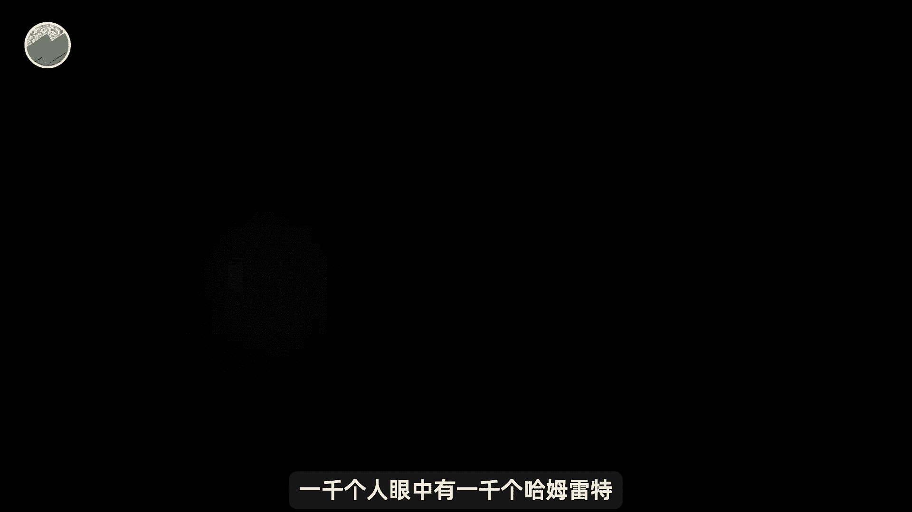

我们只是尽可能的去量化，我们理解的部分的缠论的思路。

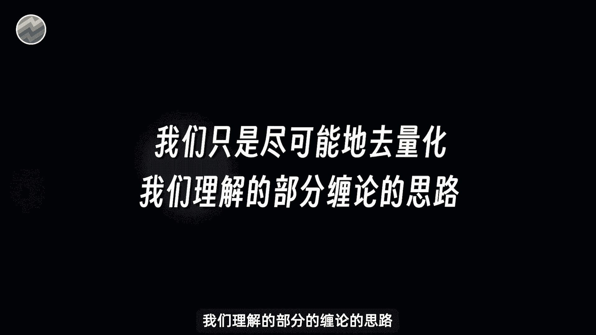

争取让大家能更直观的了解缠论，大家好，是专注于量化投资的，行不行。

之前我们出过很多期视频聊技术指标，像MACDKDJ之类的，也讲过一些K线的形态，比如跳空回锤子线这些，然后就会有很多人在评论区或者微信上面。

私信问我，能不能量化一下缠论，这个在很多A股投资者心中极其特殊的存在。

那我们本期视频就来做一下相关的尝试，当然还是在视频开始前我说的那句话，对于缠论的理解，跟千面我讲的肯定有和大家不同的地方，也只是尽可能的去量化我自己理解的缠论。

首先呢我们来介绍一下到底什么是缠论，缠论是由网络名人缠中说禅。

教你炒股系列文章整理而来，于2006年6月7号正式面世，据说适合一切具有波动走势的投资市场。

比如说股票，权证和期货等，根据某百科的介绍呢。

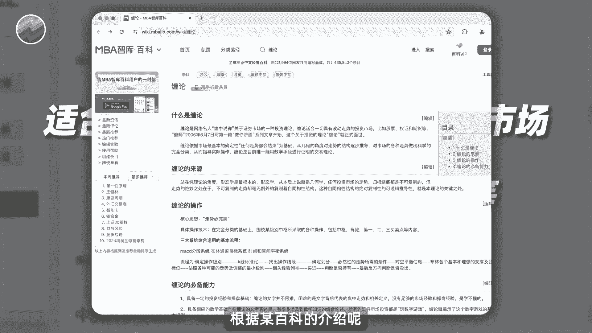

缠论依据市场最基本的确定性，任何走势都会结束为基础，从几何的角度对走势的结构逐步推导，对市场的各种走势做出科学的完全分类，从而指导实际操作，是目前唯一能用数学手段进行证明的交易理论。

看到数学手段这几个字。

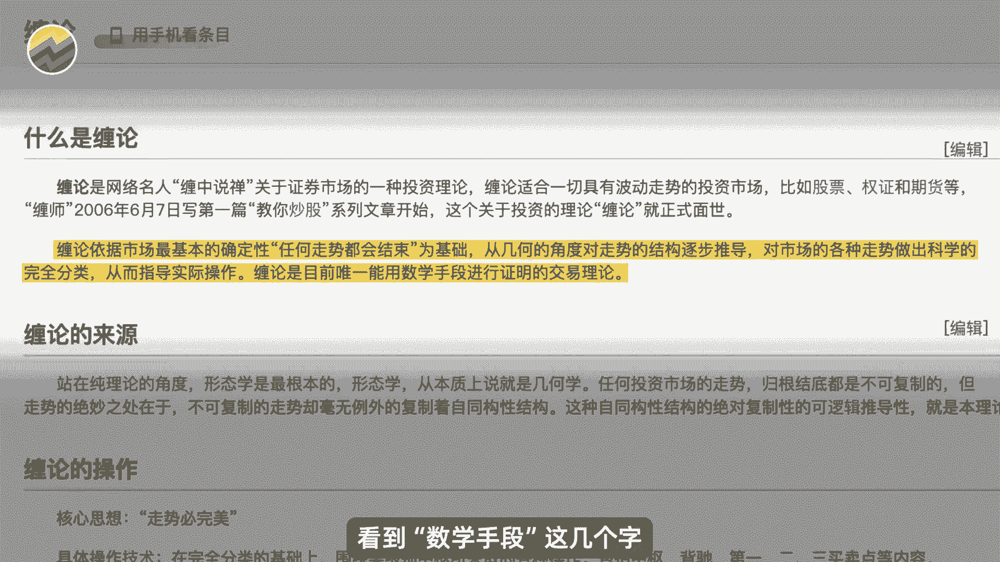

我就不禁想插一句，那这不就是在说亮话吗，然后缠论的作者禅呢。

他在2008年停更后便再未出现，网上传闻，他的真实身份是大A，当年第一支百元股票科技的操盘手李彪，但是这个和缠论是否有用一样。

他的身份也同样是众说纷纭，有了解的朋友可以在评论区聊聊你的看法，但是不管怎么样啊。

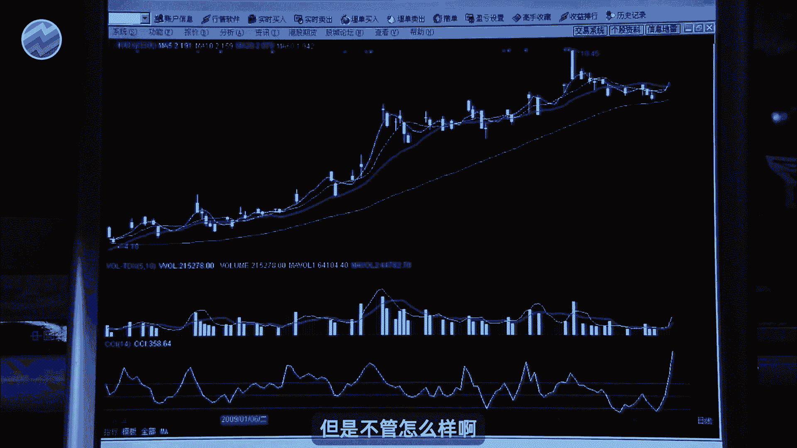

在2006年，那个投资者普遍相信技术指标和形态的时代，缠论一经问世就受到了无数人的追捧，认为是全世界最有用的技术形态分析体系，时至今日，还有很多人在进行研究和学习，了解了缠论的来历。

我们就可以尝试通过它的用法去量化它，我们可以大概的把缠论体系分为分型比线段，中枢与走势四层结构，这些要素一起构成了缠论最后的买卖判断，但如果都要讲的话，就会非常复杂，需要大量的时间。

我们今天就只讲缠论中的分型是什么。

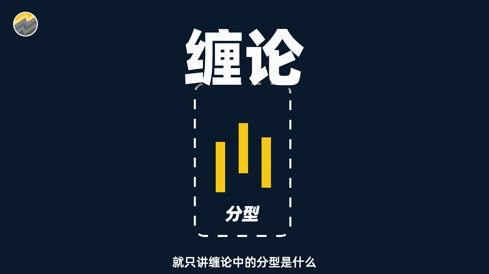

并把我们自己量化分析的方法给大家，如果你觉得这个思路是对的，那之后就可以用我给的代码来判断，所有缠论中的分行了，如果你觉得我的方法有错，你也可以像我一样用量化的思路，自己尝试着去将缠论量化试试看。

在了解分析前，我们首先需要给大家做一个小科普，传论中所说的K线和我们寻常的K线并不相同，传统的K线中，我们通过上下影线和箱体来表现，股票当天的开高收低和涨跌幅，并且区分阴线和阳线。

但是在谈论当中的K线只看最高价和最低价，他认为其他的都是无效信息，因此画出的K线呢就被简化成，只保留了最高价和最低价的柱体，这样看上去确实比较简洁一点，然后呢我们来观察两根相邻K线之间的关系。

这个关系呢缠论把它分为两种，第一种是有趋势关系的，比如说这样我们叫它不存在包含关系，还有一种呢是没有趋势关系的，像这样子称作是包含关系。

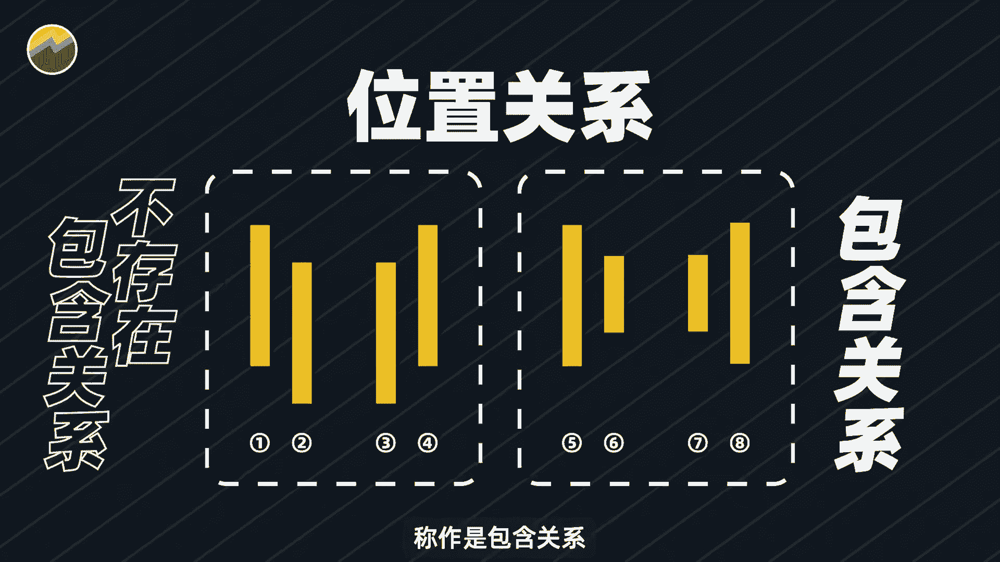

然后啊敲黑板，重点来了，缠论的作者缠中说禅呢，他觉得包含关系的K线太乱了。

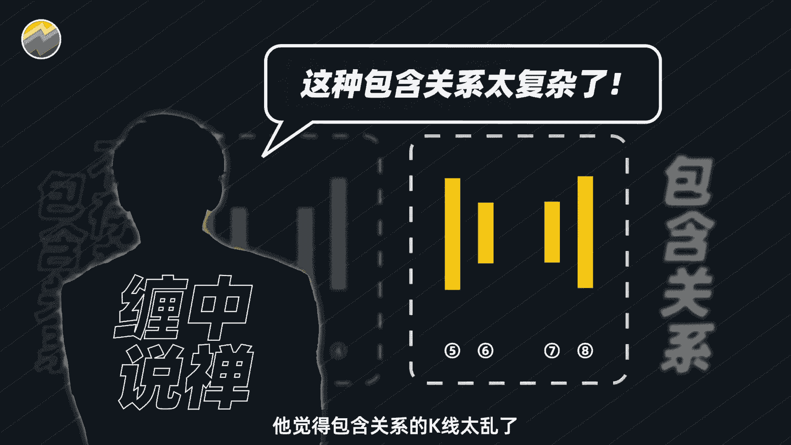

影响分析价格的趋势，所以呢再去简化一下，一直到所有K线两两之间都不是包含关系。

比如说这样，我只能说一句啊，强迫症狂喜，有相同想法的小伙伴可以在弹幕上打一句舒服，那我们应该如何去处理包含关系的K线呢，其实也很简单，我们先找三根K线，比如说是这样子的，或者说是这样的。

这两组K线呢其实是一样的，都是K线一和K线三上升的趋势，同时K线一和K线二则是相互包含的关系，那遇到这种情况呢，缠论中的处理也比较简单粗暴，直接新的K线四来代替K线一和二，K线四的最高价和最低价。

分别取自K线一和二中，相对较高的最高价和相对较高价最低价，最后原有的三根K线，就变成了一个两根K线组成的包含关系，同样的还有一些K线是这样的，也就是K线一叫K线三呢是下降趋势的。

我们的处理方式也和上面一样，只不过我们这次生成的K线四，取的是K线一和K线二中，相对较低的最高价和最低价，总结来说就是八个大字，上升取高，下降取低，更具体的解释我也帮大家列了出来。

感兴趣的可以暂停截图观看，我们只要通过上述的方法，根K线的向后处理，就能得到相邻K线之间，只存在清晰的上升或者下降的位置关系，的新K线组合，上述的内容对于部分学过缠论可能基础了一点。

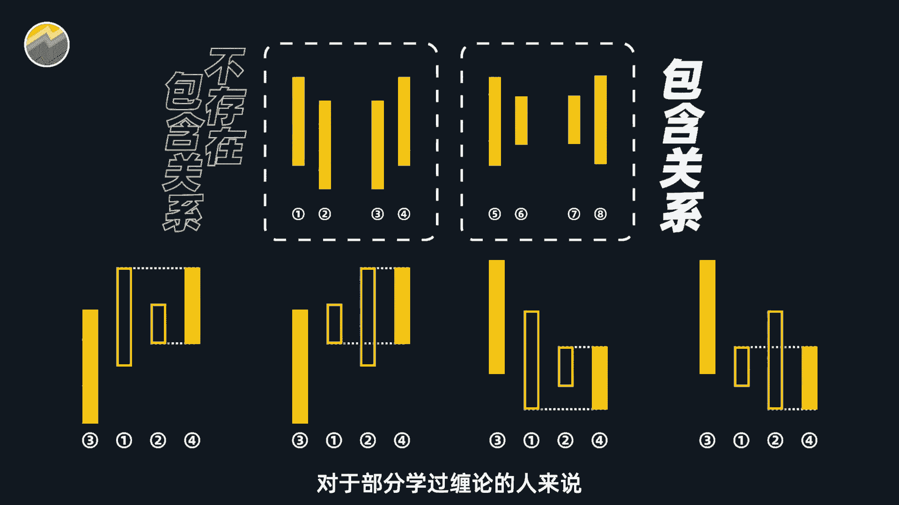

但是理清这些是我们量化缠论的关键所在，我这里也再明确一下，以上所讲的都是我自己理解的缠论，如果大家有不同的看法也指正和探讨，然后呢，我相信90%以上用论交易的人啊，都还处在自己在行情软件上画图。

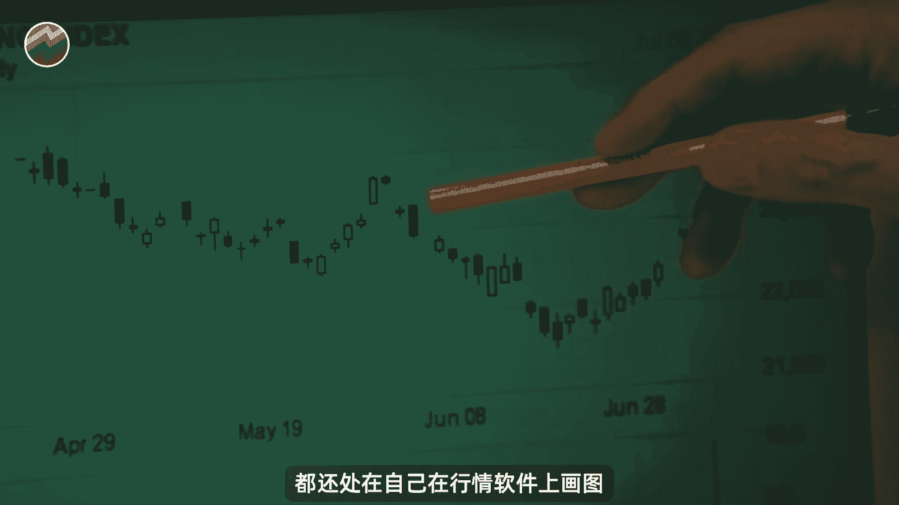

找买卖点的阶段，这样做呢耗时耗力，如果是去看一个股票全部历史K线。

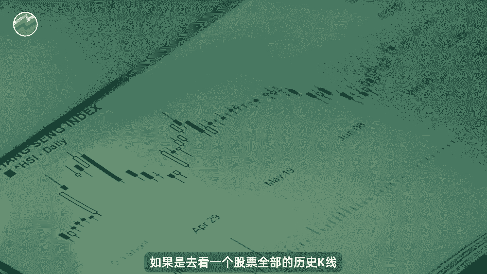

特别是上市多年的一些股票，估计撞墙的心都有了，在市面上找了一圈也没找，找到什么可以处理常用K线的工具，那我们是做量化交易的，肯定不会自己手工去一根根的处理K线。

所以我们还是要借助A股历史数据和Python代码，去帮我们处理好K线，并把它画出来，画图所需的具体数据呢我已经帮大家准备好了，这里面包含了A股历史上所有5000多只股票。

甚至是那些已经退市的，你可以打开其中任意一个文件啊，它包含了这个股票从上市第一天至今，每天的开高收低的价格，并且你可以计算复权价，非常的完备，画图的代码也不复杂，你只要打开这个PY后缀的文件并点击运行。

就可以得到处理好的传统K线数据和图了，如果你需要这个数据和代码的话，可以加屏幕右下角或者置顶评论区，我的微信都是可以直接免费发给你的好，那么我们来运行一下程序。

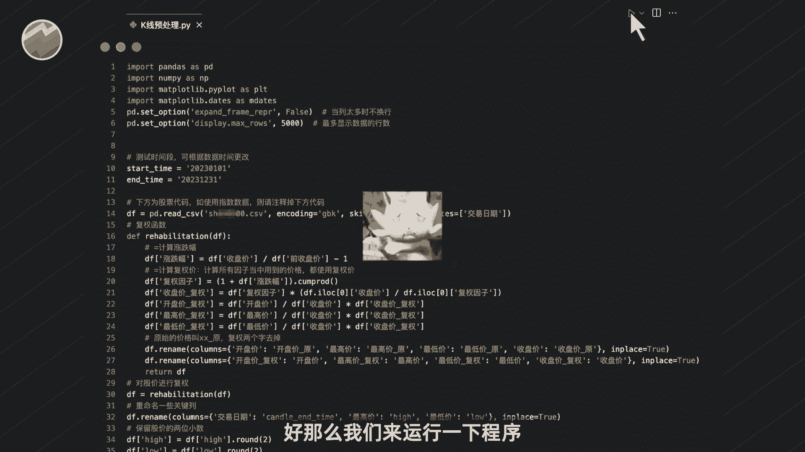

看看结果如何，在看程序运行结果之前，先插一个题外话，经常有人问我，某某技术指标的量化效果到底如何，或者能不能帮他验证某某指标的用法，为此我特意为大家准备了一个技术指标。

测试大礼包，你打开大礼包文件，它包含了非常多的内容，首先量化的基础就是准确的历史数据，我会送你一份股票交易数据，你可以用它来像我一样去测试所有的技术指标，看完了数据，我们再来看这个表格。

文件里面共记载了125个技术指标，有它们的名称，详细的计算公式以及他们的中文描述，甚至关于这个指标到底如何使用，如何产生买卖信号，也帮大家整理好了，非常的全面，为了让小白也能自己写出指标代码呢。

我还为大家准备了一份技术指标编写说明，按照这段说明，就可以完全看懂技术指标的计算公式，并将它们都用编程实现。

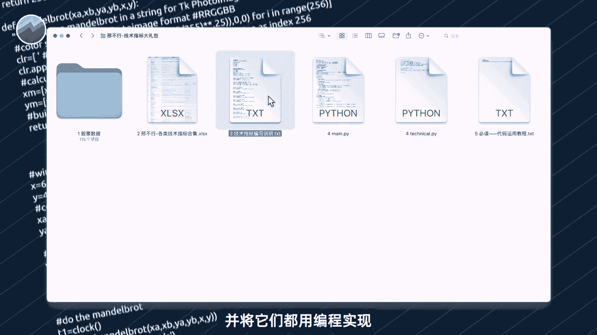

也推荐大家自己去尝试一下，再然后就是我们用来计算技术指标，和验证它效果的拍THON代码了。

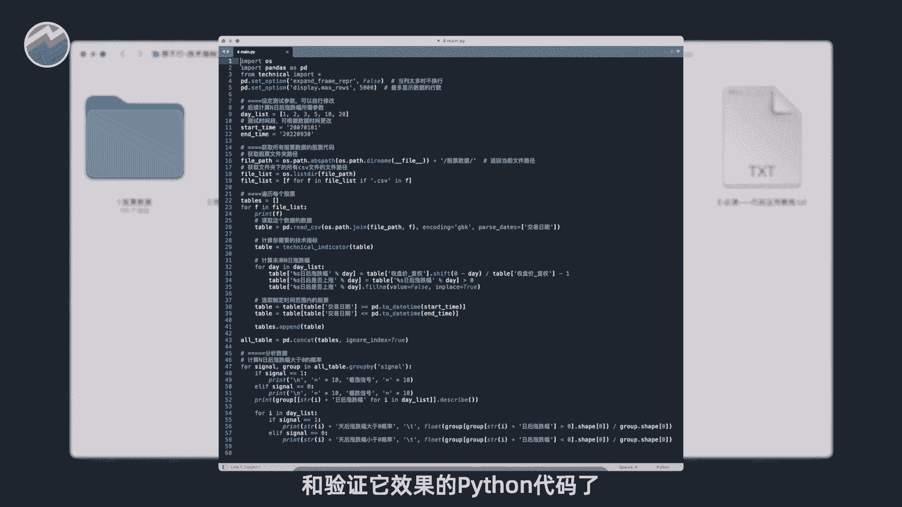

大家不要听到代码就害怕，不用担心这个代码是傻瓜式的教程，哪怕你没有任何编程基础，参照我们的编写说明，也一定是可以搞定的，最后也是最关键的，我还为大家准备了相应的教程。

根据我准备的上述资料以及教程视频的讲解，你可以零基础的学会如何计算所有的技术指标。

并且测试它的效果，看看哪个更有效，所以这个大礼包的内容真的非常的丰富，如果你需要的话。

可以加屏幕右下角或者置顶评论区，我的微信都是可以直接免费发给你的程序，结果就如图所示，经过我们的处理啊，相邻的K线之间都只有上升和下降的关系，十分的清晰明了，这样的一张图。

就是完全符合缠论处理K线的思想，想必对于很多就很多人来说，看到这样的图会非常的开心，毕竟大家之前只能照着行情软件的K线去处理，无法很好的表达缠论的K线的特点，会有这样那样的不便。

而我们这个K线不仅包含了全部的历史数据，而且异常的简洁明了，没有一点的多余信息，懂行的人想必发现这个数据和代码的珍贵了吧。

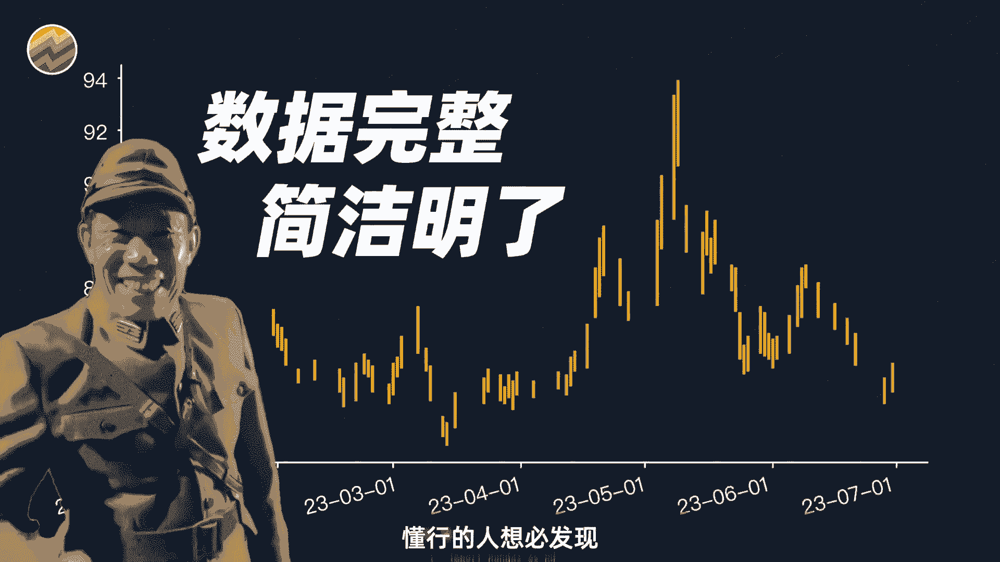

有了它，再也不用自己在行情软件上面不断地画图了，只要一键运行代码，就能直接画出K线图，找到缠论的买卖点也就一蹴而就，至此我们完成了缠论中所有K线的预处理，接下来我们就可以用它来，找出历史上所有的分型了。

在缠论中。

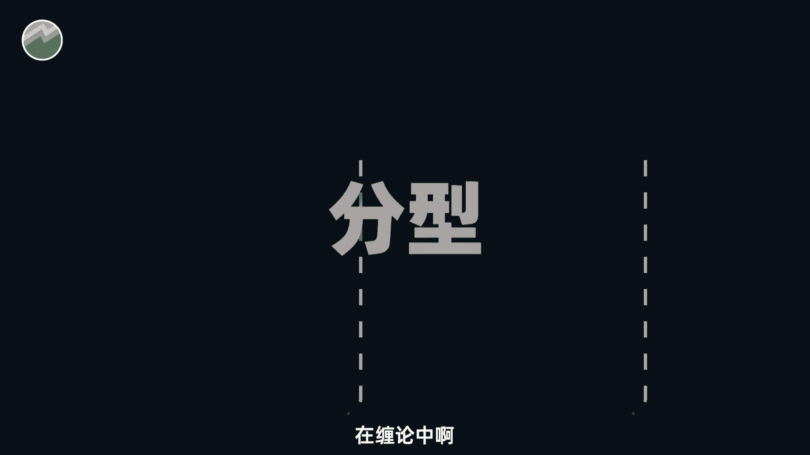

所谓的分型是由相邻的三根K线构成的，这三根K线并不是连续的上升或者下降趋势，而是呈现走势反转的形态，分型呢又被分为底分型和顶分型，它们两者的定义就如图所示，相应的图形也比较好认，我就不做详细介绍。

然后呢在谈论当中啊，底层型的出现意味着股价跌至低位即将反弹，是抄底和建仓的信号，顶分型的出现了，则相反，意味着股价即将见顶，是卖出的信号，当然风险结构还比较基础，不能完全作为买卖点的信号来做判断。

但缠论中真正的买卖点，就是以分型为基础来构建的，这个我会在下期视频给大家做详细的介绍，回到我们的顶底分型啊，既然我们知道了如何定义顶分型和底分型，就可以用之前处理过的K线数据。

并借助Python代码来帮我们找到所有股票在历史上，所有的顶底分型，注意啊，我这里说的是所有历史的全量，具体的代码我已经帮大家准备好了，只需要点击运行就可以得到想要的，如果需要这个代码的话。

可以加屏幕右下角或者置顶评论区，我的微信都是可以直接免费发给你的，程序运行的，就如图所示，红色方块标记的就是顶分型的位置，绿色三角呢则是底分型，记住这个图啊，我们肉眼就能很直观的看到指定时间内。

当前股票的所有分位置，非常的清晰明了，相信有了这个图啊，就能够帮助使用缠论的你节省大量的时间，去做更有意义的研究，当然肯定还是会有人觉得，我说的缠论的量化是不对的，就像我开头说的一样。

每个人眼中的缠论本就各不相同，因为作者他本身就没有讲的很详细，很完备，1000个人看缠论可能会有1000个结果，我也只是按照我的理解去尝试介绍并且量化它，仅此而已，也很欢迎有不同意见的朋友在评论区留言。

做相应的交流，我们大概介绍了一下传说中K线的处理方法，并对新的K线做了最基础的分型应用，当然谈论的内容很多啊，不止于此，时间有限。

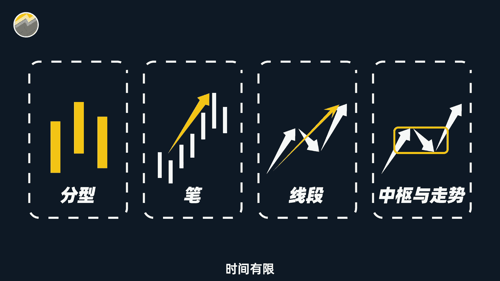

我们今天就先讲到这里，大家觉得这期视频如果对你有帮助的话，欢迎多多点赞，破5000的话呢。

我们下期视频就来讲讲，缠论中对分型的进一步应用，也就是缠论中划线分析的最基本结构。

那看的人不是很多呢，那后续我们可能就不会再讲缠论了，好那么本期视频就到此结束，最后感谢大家的点赞，投币收藏和转发。

