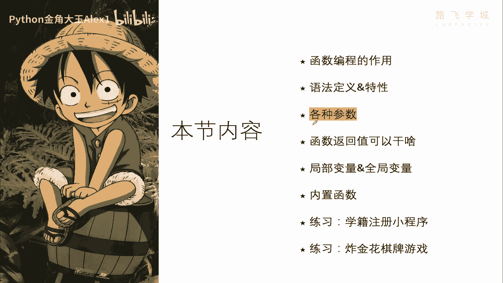
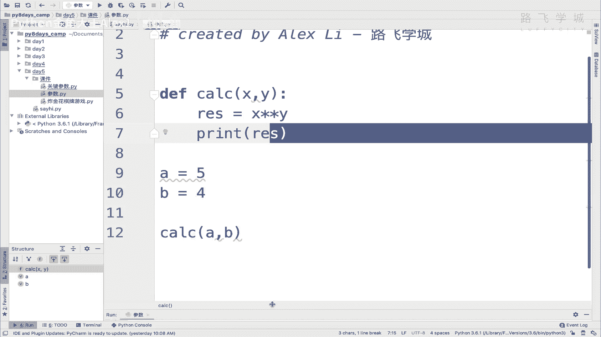
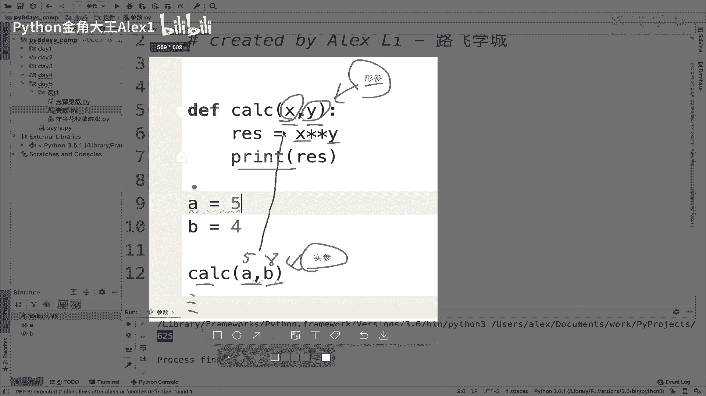
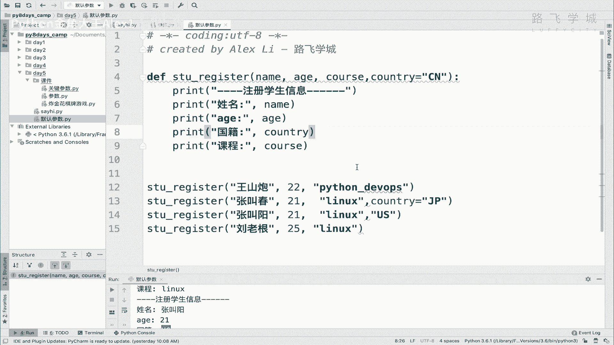
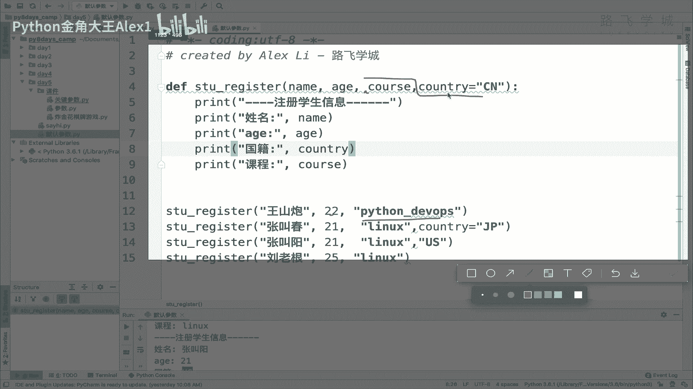
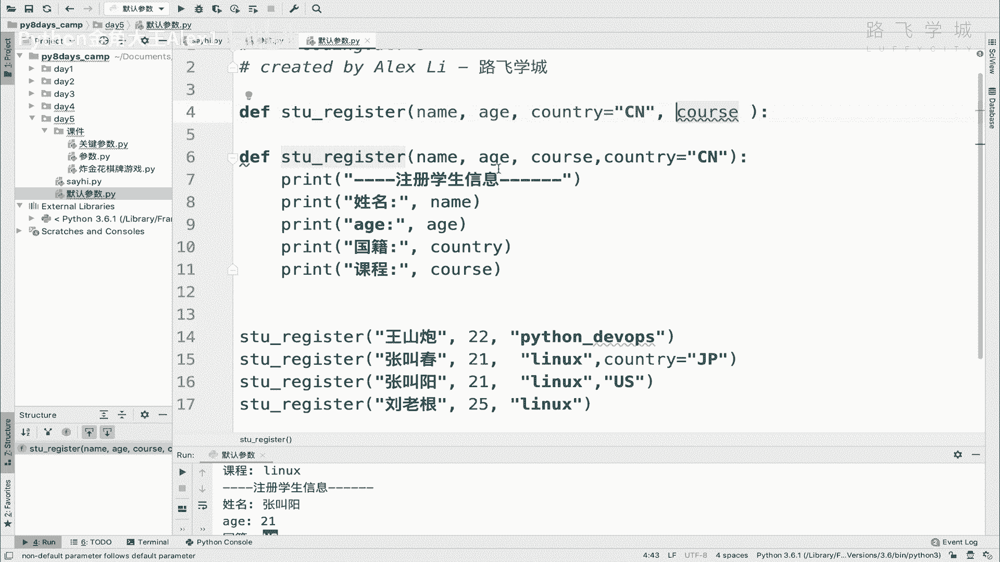
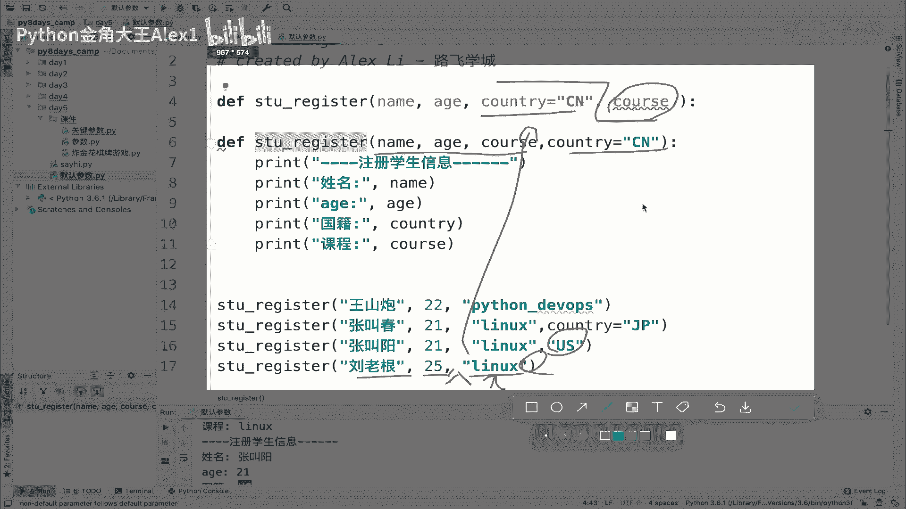
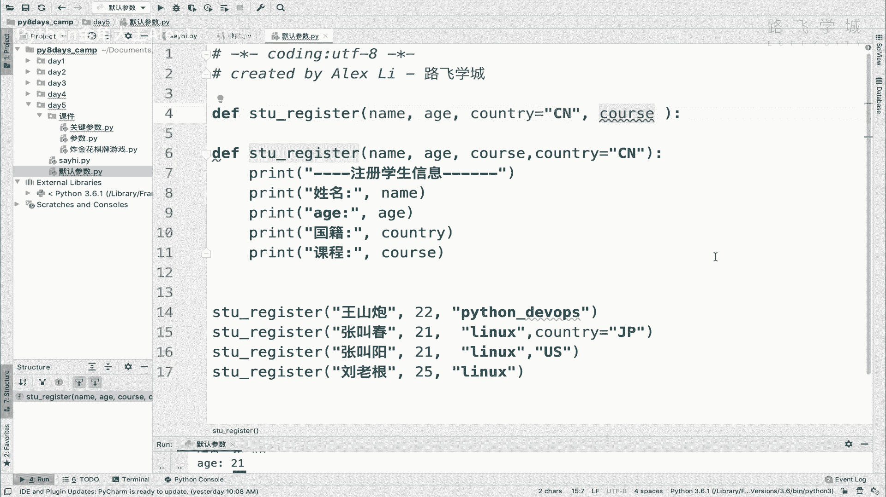

# 【2024年Python】8小时学会Excel数据分析、挖掘、清洗、可视化从入门到项目实战（完整版）学会可做项目 - P58：03 函数参数-形参&实参&默认参数 - Python金角大王Alex1 - BV1gE421V7HF

OK同学们，这个小节我们来学函数的各种参数啊，那它有这么多啊，形参实参默认参数关键词是非固定参数，这小节我们学这个好吧，这两个呃进入到这里，那首先先来看这张图啊，这张图写的很清楚了啊。

这是我在这定义的函数，然后里面两个参数啊，这个地方接下来是调用，在调用的时候呢，我付了两个这个这个A这个B啊，A这个BA和B我没有把它引过来，A和B是两个数字啊，啊这样吧，我直接给大家写一个好吧。

写一个，Uh a r t，参数，然后就跟他这个一样，define一个CCLCACL，就是计算一个X1个Y啊，定义好两个参数，然后呢RES等于一个XX的Y次方好吧，我们打印RES好不好。

然后这个就是它的呃什么，然后A1比如说是5B等，一个是四好吗，然后我调用的时候就是可以传进去，A和B明白吗，啊这样这个这个代码是可以理解的，对不对，没问题吧，啊我定义两个变量，然后把两个变量传进去。

然后传到这里啊，这里相乘执行是不是啊，那我来执行一下好。

625是五的四次方，是不是，那现在我们就来围绕这个东西来说一下，首先这个参数是一一对应的啊，这里定义了一个X就是这里的这个A看到没有，它是按这个顺序的啊，按位置从左到右按顺序啊，这俩是一一对应的。

然后Y就是这里的这个B可以吗，好，那这两个，这两就是就是这个参数在这儿和这个参数，在这叫法上有什么不同呢，叫法上有不同，这个地方的这个参数叫做哎呀呀呀呀，画画我画的特别好，结果就呃就为什么了。

这个地方的这两个参数看到没有，这个叫什么呢，叫做行参形参，形参是个什么东西啊，形参啊，那形态是指指什么东西呢，就是呃你你可以理解为它就是一个占位符，占位符总能理解吧对吧，我在这里呃，这个放一个。

相当于我在这里先放那么一个东西，就是就是就是要占着这个味儿对吧，因为后面有数据就有有数，有实际的值给我传进来，对不对，所以他就更像是一个，它就是一个占位符的那么一个概念是吧。

你可以理解为形态就是占位符的概念，但是呢这个参这个参数一旦被调用的时候，它就被赋了值，赋了值之后，它就有实际的相当于是实际的值了，实际值它就在这个函数里面可以调用，对不对，可以调用，那呃但是注意了。

这个参数它只在函数内部有效啊，只在函数内部，也就是说你XY你你理解为它是两个变量的，两个变量的话，因为你在这能调用，你你认为它就是两个变量了，对吧，诶你把它认成两个变量的话。

但是这两个变量只能在函数内部使用，也就是说如果这个函数执行结束了，函数走到这儿，是不是执行结束了，结束完了之后就又返回到这个主主流程上了，对不对，你你在这里一定要用对吧，然后就进入了函数里面。

函数执行结束之后又返回到这个主流程，然后接下来执行执行下面的东西，所以函数一结束，这XY就被释放掉了，就没了，3D存储就找不到了，明白意思吗，所以XY的这个形参的存活周期，只限于在函数的这个存货周期。

函数结束了，这个变量就没了，OK吗，这是形参的一个特性，那这两个值在这里叫实参13是什么意思，就是实际的值就这么简单，10G10G啊，看参数啊，实际参数对吧，它就是实际的值，对不对。

甭管你在这里放的A变量还好，或者是直接放上两个数字对吧，五个八或者类似这种，它都叫实参，所以区别一下这个叫实参，这个叫形参啊，当然你也不用刻意死记硬背说啊，什么叫神态什么。

你只需要理解它代表的是什么意思，就是这就是个占位符，这个就是实际的值传进去，跟这个X就是A和BA和X，B和AB和Y11对应就可以了好吗，不用我再给你划线了吧，哼看到没有。

OK好，这个就是这个什么呀，呃形参和实参的一个啊，一个一个一个一个一个一个东西是吧，这个什么return，你不用管，我们现在没想到这是一个返回值，我把它放在这里了啊，放在这里，OK好啊。

形参实参我们就讲明白了，对不对，接下来给大家讲一个叫默认参数啊，默认参数大家可以看以下这段代码，以下这段代码啊，那我在这里住，我在这里写了一个叫什么呀，学学生注册的一个register是注册的意思啊。

学生注册的那么一个小函数里面有几个参数啊，姓名年龄，country和cos就是课程，然后这个在里面打印学生的这些，填的这些参数对吧，那我执行了三次，执行了调用了三次，把山炮叫春和刘老根儿啊。

这三个人都填进去了，大家会发现一个问题，没有什么问题，就是CNCN都是代表中国吗，也就是说country这个值它都是一样，也就这三个人填的都是一样的，想象一下，想象一下咱们中国，如因为中国14亿人口。

那你都是中国人，对不对，中国人在填那个注册的时候，注册一个类似这种网站用户啊，或者什么的话，填国籍肯定都是选中文，对不对，那有的时候呢为了这个网站，有的网站为了方便这个叫用户，就是就是快速填写嘛。

所以他把一些信息啊，比如说呃就就比如说像国籍这种东西，它就自动的在那里有一个你你接的网站下拉框，它自动有一个选国籍吗，默认他给你选到中国，默认对吧，就你选了之后，但是你可以改，你说我加入日本国籍了对吧。

成为汉奸了，成为汉奸了是吧，那你就可以说哎我选一个是日本对吧，我和我选一个美国，whatever就这种，但是默认就是中国的，所以中国大多数人都是都是中国国籍的话，那也就是说如果大家都注册。

你这个少这一个选框，用户不用改，不用改，就省了一步，是不是啊，所以那在网站上啊可以实现这样的东西，在咱们函数里可不可以也有类似的，也就是说，如果即便既然大家都默认是那么一个啊。

是那么一个这个参数是那么同样一个值的话，我把它定义成一个叫默认参数，可不可以啊，啊我不填，他就给我认，按CN中国来算，如果填的话对吧，他就按我填的那个值，明白吗，这是可以的，这个东西就叫默认参数。

它的改法是什么呢，看到没有，直接把这个country给它赋一个值，看到没有，country等于一个CN，明白吗，country等于一个CN就可以了，你这样不填的时候啊，不填的时候就呃这个什么呀。

就是CN了，你这样我来给大家试一下，好吧好吧，呃默认，Sorry eu，不会写了啊，Pencil，然后copy过来，大家看一下，现在的话那肯定是怎么讲，我打一下吧对吧，每个人都是CN。

是不是我把这个参数给它改掉，把这个country直接给它改成一个什么呢，CN看到没有，哎，注意了，你看这里红的报错了，我要把它移到后面来，移到最后啊，你不要问为什么，先不要问为什么啊。

你现在你就先记住这个这个这个要求，就是你要写默认参数，必须写到这个函数的最后面，一会儿我给大家解释为什么，那好我这个默认参数就写到这里了，写到这里了之后，同志们，我告诉你哦，他们你们在注册的时候呃。

你你你怎么讲，你在注册的时候，这个这个你现在呃，相当于这里有已经有一个默认参数了，然后跟着这个参数写在最后面了对吧，所以你要改的时候，你要注册的时候，你把这个参数当然也要写到后面，如果你什么也不填。

你看我现在把这个都去掉了啊，我什么也不填，你看它会报错吗，大家发现一个问题没有，他根本就没有报错，看到没有啊，他没有报错对吧，他就选的是CN，因为你这里写了一个默认值，那有的同学那好。

我就我有同学说我看我，我我想加入一个外国国籍对吧，比如说像张教春，看着就像汉奸是吧，我们就可以给他改，看着汤水直接写，或者你不会，Yes，Sorry，你在这里给你写这个什么呢，就是叫GP啊，GP对吧。

那这个时候我们来执行，大家看一下，你看叫春儿，从成功地把他的国籍改成了日本，成了一个汉奸，是不是还要对，所以这个就是，你可以给这个默认参数指定值是吧，你不想指定的，它就是CN想指定就按你说的来。

当然你也可以这个什么这个你也可以不写，看到，因为什么呢，它是按照这个顺序来的，第一个，第二个，第三个，第四个，看到没有，第一第二第三第四，所以你在这里加这个参数也行啊，说我指定它就叫GP是吧。

或者不加也可以对吧，你给它改成一个US对不对，张建坤张张叫呃，张叫春，张叫呃，羊吧好吧，好大家看这个张教阳是不是就改名US了，不用写这个参数名啊，也可以好吗，OK这个就是默认参数。

那现在明白这个部分参数的作用了对吧，也知道怎么定义了，哎现在回答刚才这个问题。

也就是说为什么我改了默认参数之后，刚才就把它指定成默认参数之前，其实在第三个位置，是不是在这，然后我给他移到了把他俩的，把他俩的顺序是不是我给他换了一下，我为什么要进行这样的一个更换。

我为什么要进行这样的一个更换，大家思考一下，你想一想为什么，啊好那我想不出来，我直接跟大家说了，首先说咱们在调用的时候，他找这些参数，就比如说咱们说的这个参数是一一对应的是吧，是按顺序从左到右对吧。

你这个王山炮它就是对应内，就是对应22对吧，这个这个cos就是对应这个cos，然后CTRL对应ctr，但是现在你这个CTRL变成一个默认参数了对吧。

你变成了一个默认参数之后呢，那假如说你这个参数名还在这儿对吧，你的这个参数sorry，你的这个参数名还在这呢，这个问题啊。

看着啊呃看一下你这个参数名在这，然后但是你这个参数名是可以不写的对吧，因为你你不写的话，他不就默认CN了嘛对吧，然后你这个是第四个参数好不好，那你同学们咱们再在这个在这个调用的时候。

因为country我可以不写，那我就只写三个值，是不是我就只写了这个哪三个值呢，我就只写了这个姓名，然后这个年龄，然后加上后面这个LINUX，对不对，加上这个LINUX。

但是中间其实有一个country的，对不对，我是没写的，因为它是默认参数，我不用写，但问题是你这个函数也就是Python解释器，在解释这段代码的时候啊，解释代码的时候它就懵逼了，怎么懵逼了，懵逼了。

你看说第一个我能对应上name，第二个我也能对应上，但是第三个我就懵逼了，说你第三个这个LINUX这个值你是到底给这个country的，还是给这个cos的，注意了啊，他是到底给country是给cos。

有的时候我我肯定是给这个cos的呀，No no no，你凭什么这么说呀，你说呃因为因为我这个我这个CTRL是默认参数，我不用填呀，没错你的CTRL是默认参数不用填，但是它允不允许你填，就是你可以不填。

但你是不是也可以填呀，他怎么知道你你你这个参数是代表是是对吧，你你你你你在这空口白牙的说，我我我我我我没钱，但是人家解释器不知道解释器，他认为说你这个参数，你这个LINUX代表就是改了我这个默认参数。

我明明是CN，你非得给我改成LINUX，所以那我认为你这个什么，第三个，这个这个这个这个值就是对应的这个什么呀，对应的这个country明白吗，哎那你就是对应的country的话。

那好那你第四个值怎么办，第四个值是必须要填的参数，你不填就报错啊，这个参数叫做什么呀，就是这个这个参数是必须要填，它不是默认参数对吧，默认参数可以不填啊，这个参数必须要填，所以那问题就来了。

那解释器就说我操，那你少了一个参数，少了一个参数，我就报错，明白意思吗，小学参数报错好，所以解释器就会懵逼，那有的同学说对，就是这样，所以那怎么办呢，怎么解决呢，唉怎么解决，就是解释器说那好。

为了防止这种歧义的产生是吧，防止我解释器不知道怎么干，分不清，你就涉及到默认参数，把默认参数全都给我扔到最后面去，所以就到这了，当你放到最后了之后，那就没问题了，你看你前三个是不是都填了，你后面不填。

后面不填，我也知道啊，前三个都是必须要填的对吧，都能对应上第一，最后这个你可填可不填，你填上呢，我就像这样一样给你加上，你不填呢，没关系，像这样一样，我就用这个CN能理解这意思吗。

这就是默认参数为什么要放在最后面，OK好吗，到此为止，关键参数sorry，这个这个这个这个这两个参数就给大家讲完了，自己试一下。

