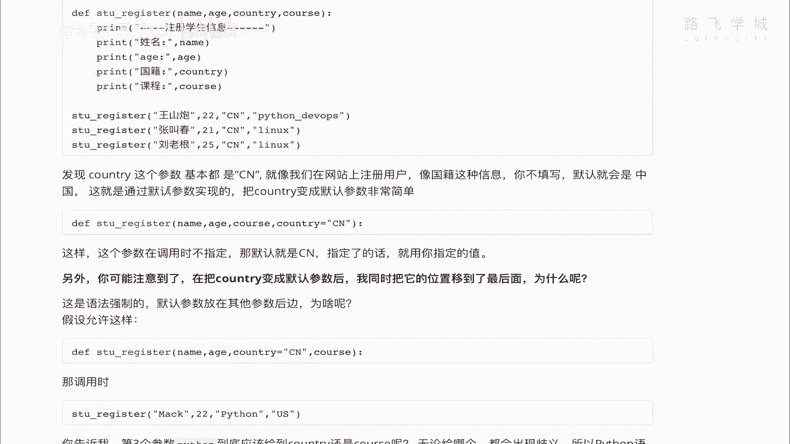
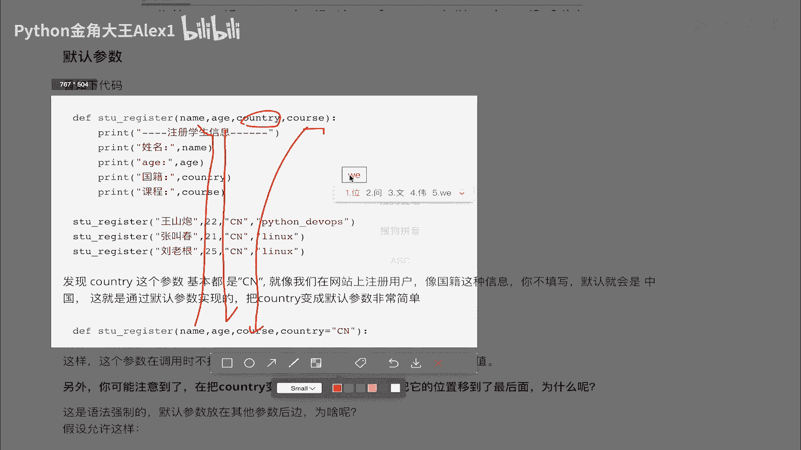
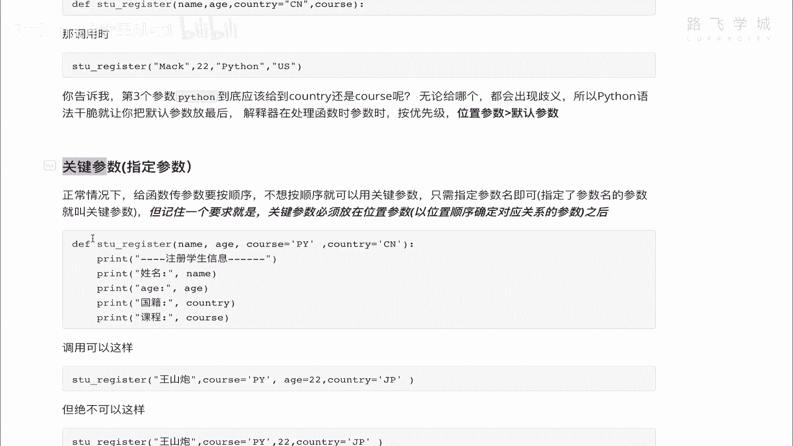
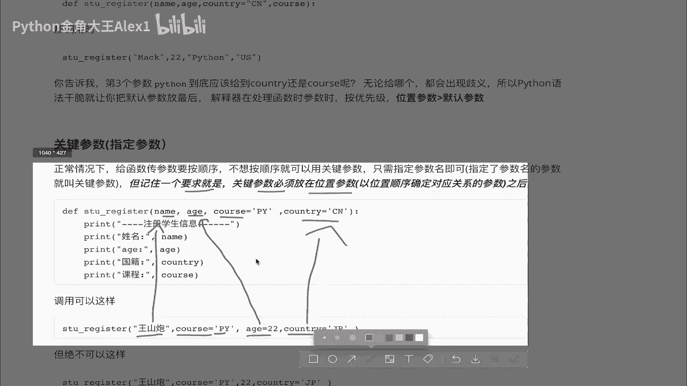
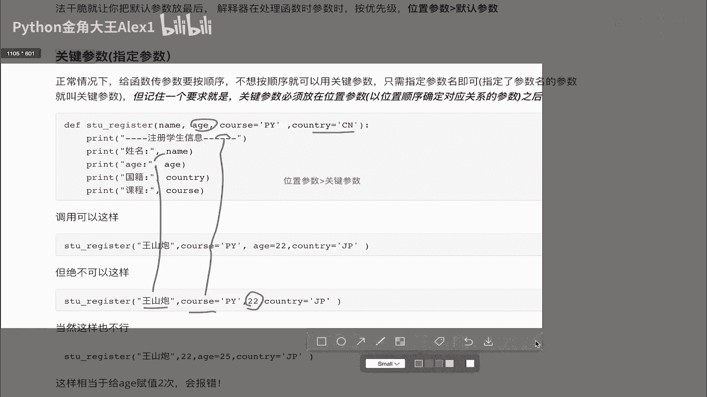
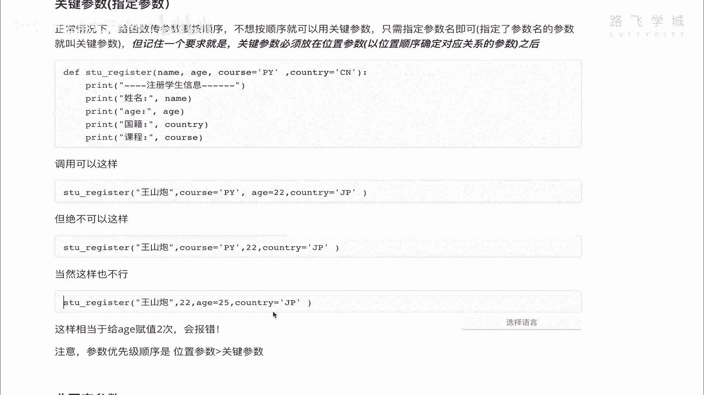
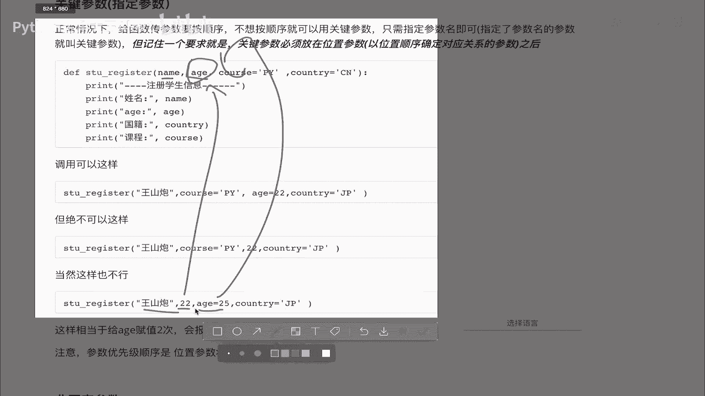
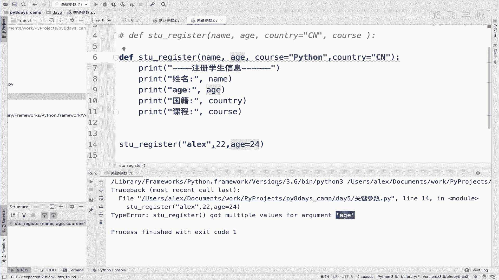
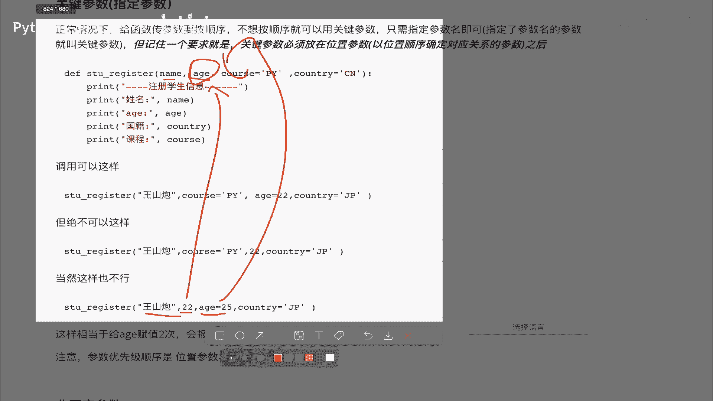
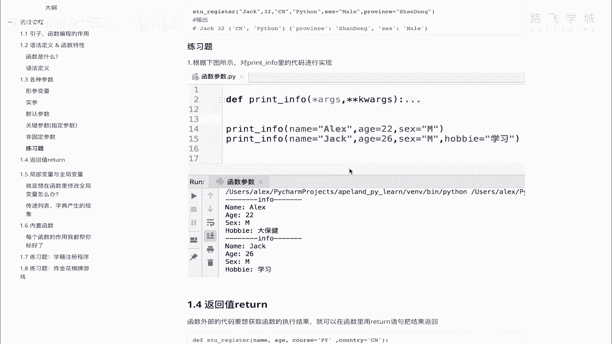

# 【2024年Python】8小时学会Excel数据分析、挖掘、清洗、可视化从入门到项目实战（完整版）学会可做项目 - P59：04 函数参数-关键参数&非固定参数 - Python金角大王Alex1 - BV1gE421V7HF

OK同学们，这一小节我们学关键参数和这个非固定参数，好吧，那什么叫关键参数呢，这里又叫指定参数啊，指定参数什么意思，就是说正常时候我们传值看着，正常时候我们传值它是不是呃这样的。

看着是不是这样一一对应的对吧，按照这个位置1111对应，Sorry，对吧一一对应啊，因为我这里因为后来改成一个默认参数了嘛，所以他那个什么了，总之它是一对应的啊，所以就按照这种位置，按照这种对吧。

这个参数所在的位置进行一一对应的，这种参数就叫做位置参数OK吗，它就叫做呃位置参数。

OK它叫位置参数，我们知道它叫位置参数了之后啊，就算它位置参数之后，那现在我如果不想按照这种顺序，我有时候我不想按顺序来去这个去给他复制，我又没有别的方式呢，也可以。

你就可以搞这种叫做啊这个关键参数对吧，这个关键参数就是说你在赋值的时候，给他指定这个名字，比如说你看在这里啊。

比如说是什么呢，你这里是name age，然后cos两个默认参数，对不对，然后你调用的时候，第一个依然是位置参数，看到没有啊，一一对应位置参数，第二个就第二个，第二个是干嘛呢，第二个这个其实就已经改了。

你在这里明确的给他付了，明天指定的说我要给这个参数名给它赋值PY，虽然这是一个默认参数，但没关系啊，默认参数是这个他在这里定义的时候自己对吧，再加一个默认参数，但是我调用的时候啊。

我调用的时候这个因为关注了关键参数，或者一个叫指定参数，它是只针对调用的时候啊，怎么去调用的方式上啊，来去来去定义的啊，跟这个跟这个没跟这个默认参数没关系啊，那我在调用的时候，你看我只要加上参数名。

加上参数名，我就叫关键参数啊，或者叫指定参数对吧，指定参数嘛就指定名字的嘛，对不对，所以你看我就不用按位置了，我就直接第二个位置上，我就在这里直接指cos等一个PY就可以了，明白吧，是不是啊。

然后我的edge明明按照位置参数的话，他应该在第二位，但是我现在给他指定了名字也就没问题了，因为通过名字能找到嘛对吧，他就不用依赖位置了，第三个这个country country没有变化啊。

它还是放在最后面，所以这种主要指定的名字，它就叫啊这个关键参数好吗，但是他这里提了一个说记住一个要求，就是什么关键参数必须放在位置参数后面，必须放在位置参数，你看我这里都是啊，都是放在这个王山炮后面的。

你不能你不能说我把cos py啊，cos等于PY写的第一个，然后把王山炮不给他指定名字写到第二个，那就会直接报错，那就会报错。

所以你是绝对不可以啊，这样的啊绝对不可以这样，比如说你看王山炮没有变，但是啊cos放在第二个，但是这里看到没有，哎你如果是这么搞，它是直接报错的，因为你的这个位置参数放到了关键参数的后面。

这个他为什么报错，依然就像默认参数调用的时候的问题一样，就是它会出现歧义，出现什么歧义，也就是说那你这个呃怎么讲，你你你先在这里按照位置参数啊，你你就Python解释器就懵逼了，说你到底是按位置来找。

还是他妈的按这个指定参数来找你，第一个按位置好，没问题，那第二个你就要又要按这个这个，这个这个叫什么呀，这个叫啊指定的，那你现在22，它是处于第三个位置，这个第三个位置我到底是赋值给这个谁呢。

赋值给这个，因为你cos已经赋值了吗，我赋值给这个country呢，还是赋值给这个值呢，他就懵逼了，明白这意思吗，所以啊那他就会要求位置参数一定要放在，因为按位置嘛一定要放在最前面，所以你可以理解为。

或者我们把它写为位置参数的优先级，位置参数啊，它的优先级大于什么呀，大于这个叫啊关键参数，对吧，大于关键参数，所以啊你要把位置参数放在前面，明白这意思吗，哎所以这样是这个啊，怎么讲。

行的不行的，这么写是不行的，当然考虑过来，当然，当然你更不可以这样啊，当然这样写也是不行的，比如说看看这个哎这个为什么不行，大家来看一下，我在这里直接算了，我这张图片不要了吧，没什么用是吧，你能记住。

那，同志们，同志们啊，为什么这样是不行的。

为什么这样是不行的，黄山炮这个对应没关系，对不对，这个对应也没关系，对不对，这是两个位置，但是这里又写了一个A值，我就是又给了一个叫关键参数，看到没有，把这个又重新复制了一遍，相当于是吧。

又给了一个25，这个22这个country啊，那怎么会不行了呢，哎这样就会报错，会报什么错呢，他会告诉你，我这个age这个参数得到了多次赋值，它不允许多次复制，你要负就只输一次，因为它又会懵逼了。

你到底是让我用这个22这个位置，参数来去给他啊，付给他对应上，还是用这个你指定的这个对应上啊，对吧，那你又解释不清啊，又会产生歧义，所以解释器不说，我不要这种歧义，你只要给我两个这样的啊参数。

我就直接报错，报的这个错大家可以来看一下，比如说我在这里直接啊SCREGISTER，然后ALEX那我这里先先写一个22，再写一个H等于一个24好吗，然后后面这俩可以都不填，这边都是默认参数。

所以我这个时候直接他就报错了，执行他说什么，你这个got multiple，Multiple values for argument，说multiple是不是多个呀，啊多个值for这个参数是不是啊。

所以他就报错了，OK在这种也是不行的，那总之啊总之大家写代码要规矩啊。

要规范位置参数优先级最高，其他的都放到后面去好吗，OK你们自己可以试一下来回的各种调用，看看看看就可以，你可以各种参数各种摆调试一下，看看出什么问题好吗，哎那咱们关键参数就给大家讲完了，讲完之后。

接下来再给大家讲一个固定非固定参数，哎这个其实特别有用，非固定参数，你看啊，举个例子，我们现在啊我们现在写的这个函数，这几个参数是写死的，对不对，这个参数写死的，比如说随着我这个程序的发展，业务发展。

我比如说我这个学籍注册的时候，我可能要再加入加入他的这个性别，他性别本来就没加，对不对，后面再加入他的住址，再加入他的这个这个爱好，再加上他的手机号，可能加很多东西，那这些东西呢在我写程序的时候。

就开始一开始设计这个程序的时候，设计这个函数的时候，并没有想到我想不到啊，我我我我我我想不到后面也会加这些东西，但是呢那以后他确实就加了，那怎么办呀，那那那我就得重新改源代码对吧。

我说你改源代码不是不行啊，不是不行，但是怎么讲，就是啊就会就会这回又得改嘛，怪麻烦的，我就不想改，我能不能提前就流出来这种扩展的空间，也就是说你即便以后你增加再增加十个参数，我对吧。

十十二这个参数我无所谓，你随便加是吧，我不用改源代码就可以支持I，那好牛逼啊，怎么实现呢，这个就是非固定参数啊，也就是说你一开始就留下这个空间啊，也就是说用用用户在定义的时候，不确定以后会传多少参数。

那好你就用这个，这个，这个也不确定用户调用的时候会传多少参数，对吧，用这个也就保证它不出错，不不会出现什么多传少传啊，就是报错了对吧，那非固定参数非固定参数啊，星ARGS星儿有两种，一种叫星ARGS。

一种叫KW星RJS星星啊，星星这个先学这种先RJS是什么呢，它会把传入的多个参数变成一个圆组织，也就是你只要写了这个，你这个函数就可以无限传值啊，无线传值咱们可以来试一下，你看着啊，然后啊大家看一下。

我这样只要一这样，你看啊，我在这里，这是咋了，我这个我这个我这个解释器出问题了，Sorry，那呃ARJS打印的时候就打印AJS，注意了，这里加了一个新号，看到没有，你打印的时候不用再写星号了。

你就直接写ARJS就行了，好吧好，那你不要问为什么有这么奇葩的写法，说什么加上信号，它就是这么写的啊，那这个时候我们直接调用直接调用啊，这个时候啊你前两个是位置参数，对不对，你的ALEX。

然后你是必须要写的，后面你可以不填，看着不填的话也没有问题，是不是不填，你看这里他有一个括号，这个括号是什么意思，也就是说你如果再填了，再填的这个你现在没填东西，再填的东西就会全部的放进去看看啊。

我的我的性别，比如说是啊，男ml，对不对，然后我的爱好是姑娘对吧，然后我的这个这个这个这个手机号，比如说对吧，1365105460多少是吧啊，4007其实是4008啊，不要给我打电话啊。

这个时候大家看是不是就传进去了，对不对，它就会全都传到这个列表里啊，想加多少加多少，你想调用的话，直接啊它是一个叫元祖啊，传的元组，但是元祖啊咱们集训营不讲，那你就知道它的调用方法跟列表一样。

你直接可以通过索引的形式，是不是就可以去调用它呀对吧，你可以你可以去这个，比如说RJS，然后一是吧，是没有问题的，大家看哦，一还不行，你不能叫一啊，他也不能这样啊，JS然后这个零看看可不可以。

应该是这样，可以诶，怎么out of range呢，哦我知道了，因为我第一个没填值对吧，没填值它不行，第二个大家看是不是把这个M掉进去了，一是可以的，可以的，OK所以这个是第一种啊，非固定参数。

然后第二种非固定参数叫什么呢，叫KWARGS啊，对哎对了，说一下，你这个ANGS不是说必须要要写成ARGS，只不过是关，是这种大家习惯写法都叫AIGS对吧，就代表可以写多个参数，你可以写P都无所谓对吧。

你写成P，你说我就是要写成P对吧，没问题没问题，只不过啊只不过别人一看你写了P，就觉得你这个人不专业，明白意思吧啊这这这你写个P啥意思啊，对不对，可以的啊，Anyway，我们给他改回去啊。

lg然后呢你还可以写另外一种叫K星星，K w i g s，注意的是星星啊，这个时候啊这个时候会出现一个什么情况啊，这个ARJS是变成一个元组，也就是一个列表的形式，然后KWIGS呢会变成一个字典字典。

大家打开看一下，你看是不是一个空字点啊，那那怎么会怎么情况下，它会往这个字典里传着呢，OK关键参数关键参数注意了，你在这里写关键参数，它就会传进去，比如说我的，比如说我的hobby啊。

别别别别我的地址吧，ABDR等于一个啊，我是来自这个啊，什么呀，山东省对吧，这个嗯德州对不对，德州扒鸡的一个小山村啊，德州有山村哎，大家来看一下，你看是不是当做一个K1个value进进去了。

你可以写很多个，对不对，你可以写很多个，就是我的我的hometown是吧啊，你可以写我的uptown叫什么，成后里存太牛逼了，再说当年汉朝的时候就有这个词，老牛逼了啊，大家看看是不是就第二个K了。

明白这意思吗，所以啊这个星ARDS是元组KWIGS是啊，这点并且这个也不是必须叫这个名字，你可以改，一般叫这么写两个星，这是固定写法好吗，一般他们都会成对出现，比如说啊这两个都加上啊。

你就可以无限的想写指令就写指令，想写这个普通的啊这个位置的啊，参数也可以写，位置参数以后里面想怎么调就怎么调用，这个还蛮有用的啊，这个还蛮有用的，我告诉你哦，这个很多很很。

咱们包括Python里面的很多，这个就是以后我们写doc都用，到处都用，咱们看看这个，看这个是不是有，你看看到没有，对不对，这是不是都有啊，是不是都有啊，随便填参数，是不是想填多少填多少好了。

你们自己可以试一下啊，可以试一下，那嗯我想想还有什么特殊要注意的啊，其他就没有了，你试完之后呢，你用这个做一个练习题，我就不给你实现了对吧，你练习题呃是什么呢，我给你把这个要求写好了，你对你。

你要根据这个我给你列出来，要求你的函数也这么定义，写那么两种参数，然后执行这么两行，最终打印出来，结果要是这样子的，所以就涉及到你要通过你在这里面代码，去取这个参数里面的值，对不对，要取应该很简单。

是不是你取这个name，你取这个你取这个name，对不对，你就是一个非固定参数，就就就就就是KI它就是一个字典了，你就直接k w i g s get name，name name是不是就可以了。

你比如说你直接在这里print，对不对，这个kw get name是不是就可以了，哦对大家看哦，我这我对盖内幕，我这没有这个name，Sorry，你要干点DDR sorry对吧，是不是取到了。

咱们在讲字典的时候，应该讲get了get就是去取这个值，取不到它也不报错，会返回一个none，看到没有，返回一个空，取不到，然后如果取到了就返回值，它相比这种直接中括号取的话会带来一个好处。

中括号取如果取不到就直接报错了，看到没有是啊，这个这个这个get不会报错好，那你们自己练出来这种效果就可以了，OK到此为止，咱们这个什么呀，所有的参数就给大家讲完了啊，这么几种，这几种理解它的意思就行。

不用非得死记硬背好吗。

