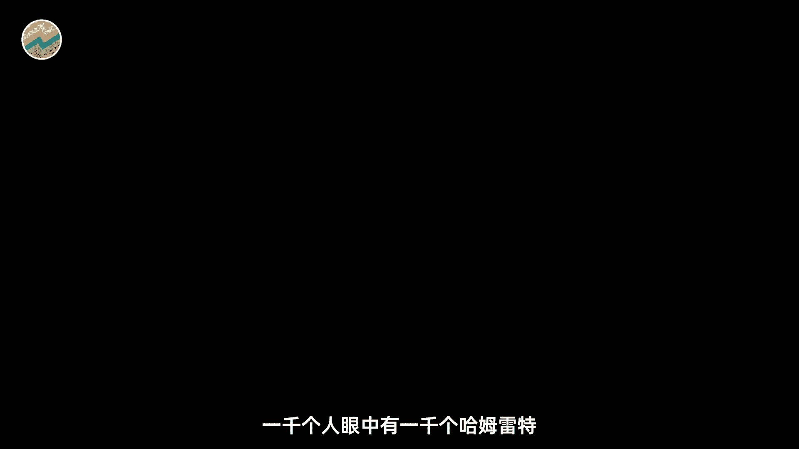
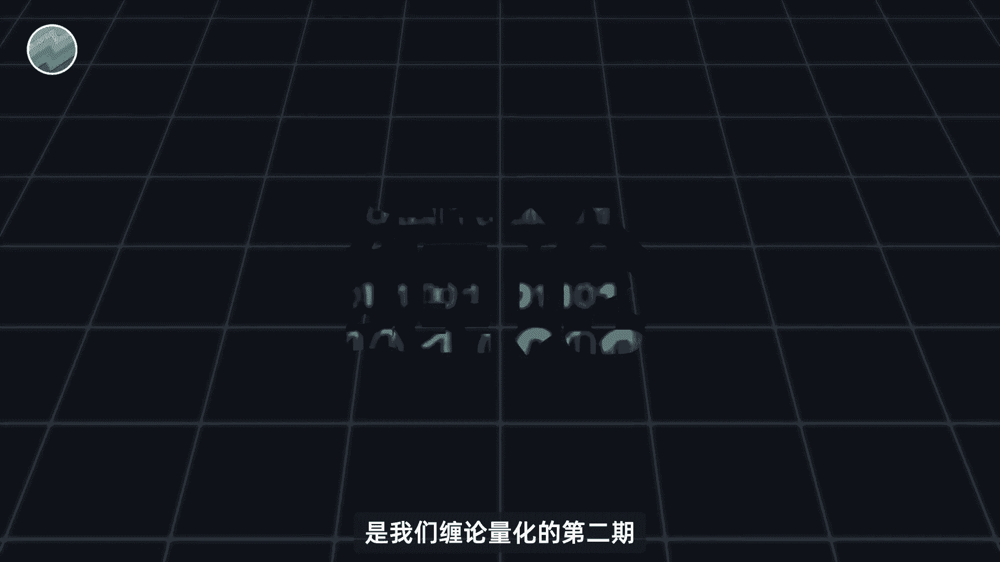
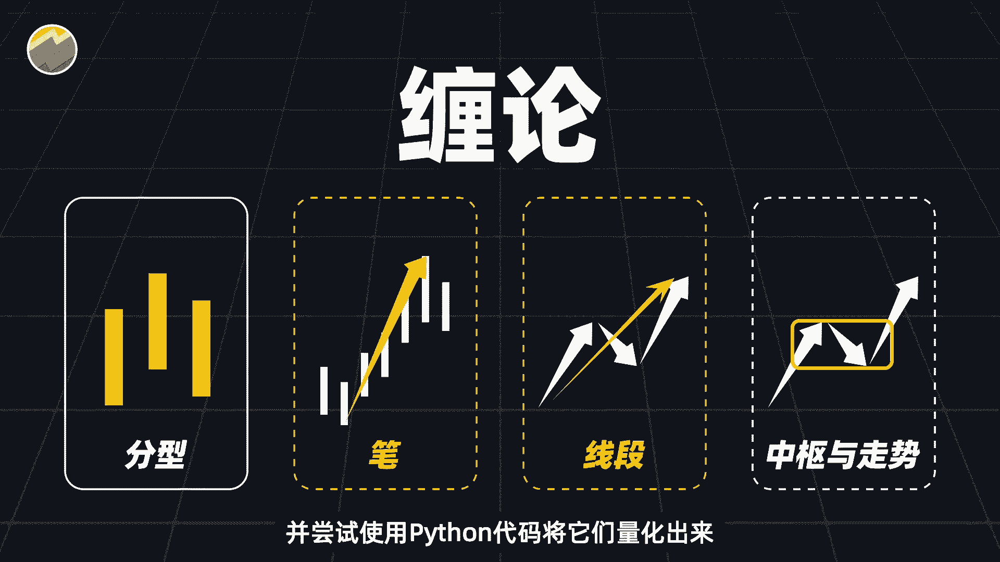
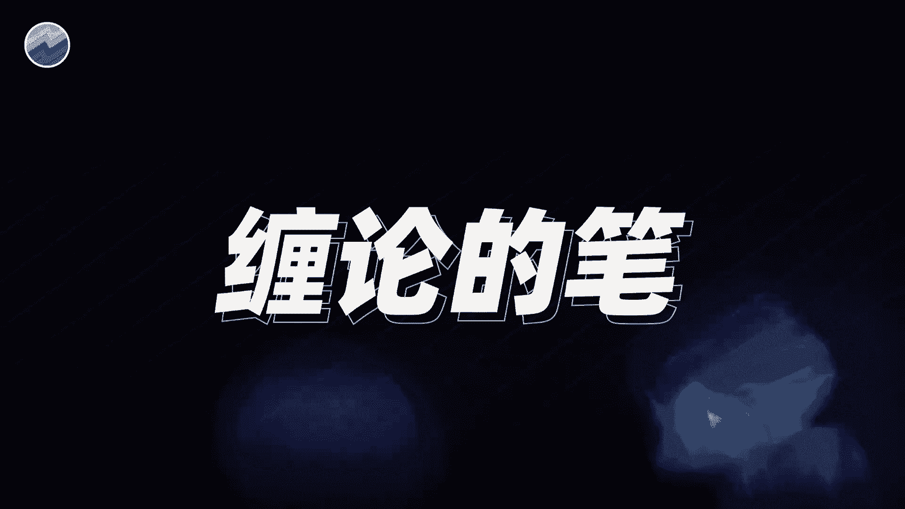
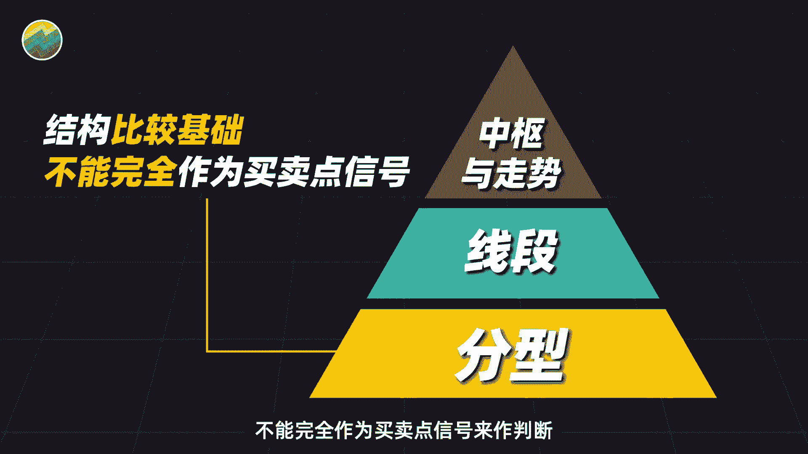
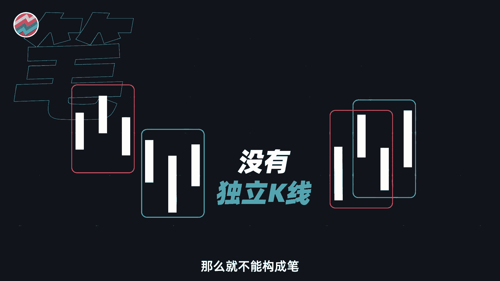
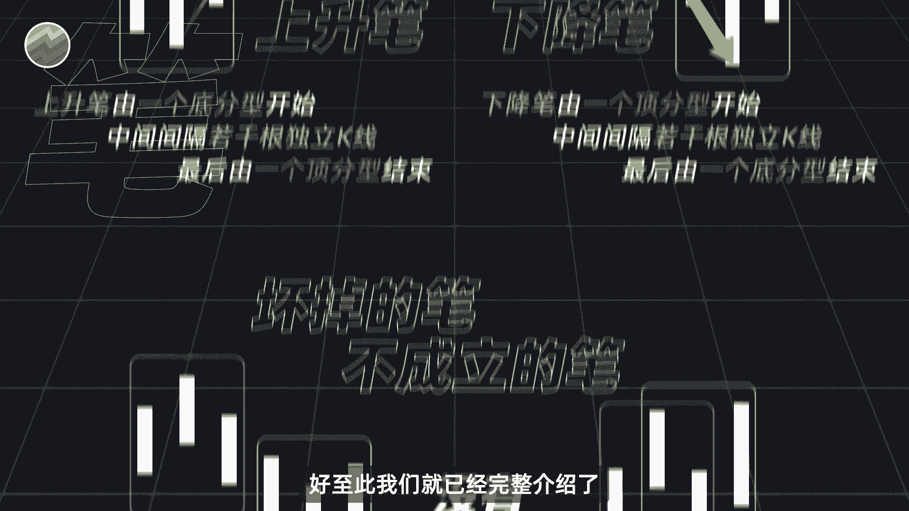
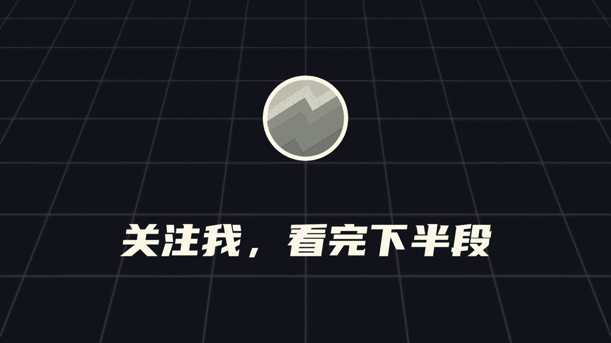

# 会缠论和不会缠论的都沉默了，缠论关键在笔和线段？ - P1 - 量化交易邢不行啊 - BV1KwDfY5EHy

1000个人眼中有1000个哈姆雷特。

我们只是尽可能的去量化，我们理解的部分的缠论的思路，争取让大家能够更直观的了解缠论。

大家好，我是专注于量化投资的，行不行，本期视频呢是我们缠论量化的第二期。

在之前的视频中啊，我们简单的介绍了一下缠论，并且记基于缠论的思想，用Python代码对所有K线都做了进一步的处理，找出了所有的顶底分型，并最终画出了对应的K线图。

大概是这样的，关于K线处理和顶底分型的具体内容呢，没有看过的朋友推荐先去看一下这期视频，看完之后使用本视频效果更佳哦，那本期视频呢我们就接着顶底分型，往下来讲解缠论当中的另外两个重要的概念，比和线段。

并尝试使用Python代码将它量化出来。

当然还是在视频开始前我说的那句话，对于缠论的理解千人千面，我讲的肯定有和大家理解不同的地方，也只是尽可能的去量化我们自己理解的缠论，抛砖引玉给大家有一定的启发，就可以。

在前面的视频中，我们说过分型的结构呢是比较基础的，不能完全作为买卖点信号来做判断。

缠论竹马真正的买卖点是以分型为基础构建的，比如说比它就是顶底分型的延续和补充，是缠论中最基础的趋势判断信号，通过识别比的走势，可以更精细地把握市场的波动，辅助交易决策，在缠论中。

比呢是由一个顶分型和一个底分型构成，且这两个分型之间啊，必须存在至少一根独立的K线，所谓独立K线，就是说这根K线它既不属于顶分型，也不属于底分型，图中的这组K线就能成功构成缠论中的比。

从底分型开始间隔了一根独立的K线，到顶分型结束非常的完美，我们可以很明显的看出啊，这一笔是呈现上升趋势的，所以呢我们把这类比称作为上升比，至于下降比的构成和原理呢也是相同的，就不多加赘述了。

我把上升和下降的比的定义和示例图，都列了出来，感兴趣的可以暂停，请截图观看，当然啊也不是所有的分型都能够组成比的，比如说这样的看似既有底分型，又有底分型，好像挺符合的，又或者是这样的。

仅仅四根K线就有两组分型的存在，但同样的问题就在于这两笔分型之间啊，连一根独立的K线也没有，那么就不能构成比。

上述情况呢就会被称为坏掉的笔，或者不成立的比好，这次我们就已经完整介绍了缠论中比的概。

这里也给大家布置一个随堂小测试，巩固一下学到的知识，请在以下几组K线当中，找出可以构成比的那几组，大家可以把答案打到公屏上，或者在评论区留言，答错的同学呢可以回退进度条再重新学习一下，言归正传。

接下来呢我们就给大家介绍笔的更高阶用法，笔的延续，我是行不行，关注我。

