# 会缠论和不会缠论的都沉默了，缠论关键在笔和线段？｜ 全网独家！用Python量化缠论，一键自动生成笔／线段，再也不用自己画买卖点了【量化投资邢不行啊】 - P1 - 量化投资邢不行啊 - BV1qGSvYxEJb

1000个人眼中有1000个哈姆雷特。

我们只是尽可能的去量化，我们理解的部分的缠论的思路，争取让大家能够更直观的了解缠论。

大家好，我是专注于量化投资的，行不行，本期视频呢是我们缠论量化的第二期。

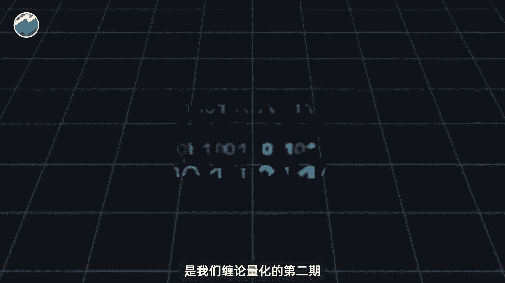

在之前的视频中啊，我们简单的介绍了一下缠论，并且记基于缠论的思想，用Python代码对所有K线都做了进一步的处理，找出了所有的顶底分型，并最终画出了对应的K线图，大概是这样的。

关于K线处理和顶底分型的具体内容呢，没有看过的朋友推荐先去看一下这期视频。

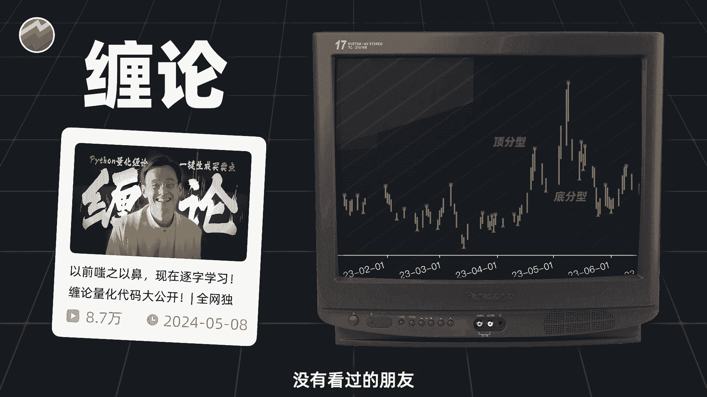

看完之后使用本视频效果更佳哦，那本期视频呢我们就接着顶底分型，往下来讲解缠论当中的另外两个重要的概念，比和线段，并尝试使用Python代码将它量化出来。

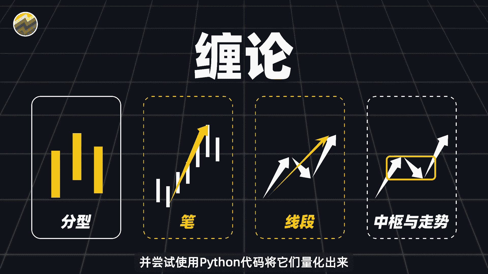

当然还是在视频开始前我说的那句话，对于缠论的理解千人千面，我讲的肯定有和大家理解不同的地方，也只是尽可能的去量化我们自己理解的缠论，抛砖引玉给大家有一定的启发，就可以。

在前面的视频中，我们说过分型的结构呢是比较基础的，不能完全作为买卖点信号来做判断。

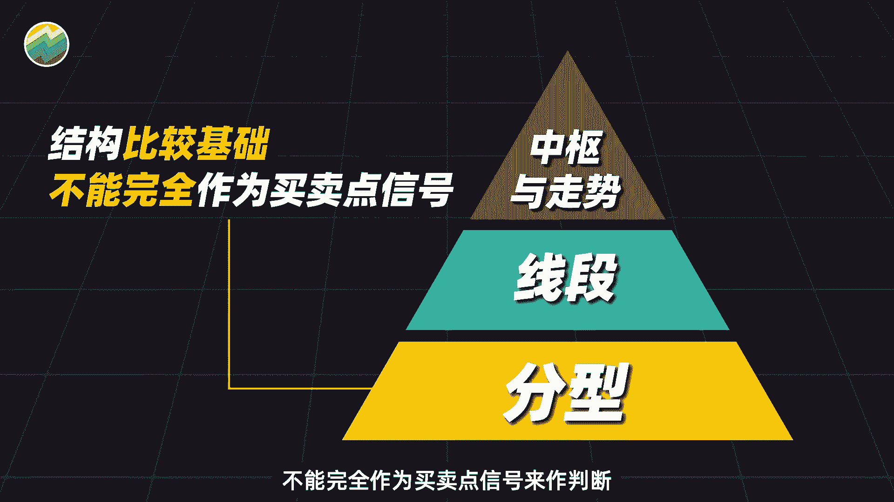

缠论竹马真正的买卖点是以分型为基础构建的，比如说比它就是顶底分型的延续和补充，是缠论中最基础的趋势判断信号，通过识别比的走势，可以更精细地把握市场的波动，辅助交易决策，在缠论中。

比则是由一个顶分型和一个底分型构成，且这两个分型之间啊，必须存在至少一根独立的K线，所谓独立1K线，就是说这根K线它既不属于顶分型，也不属于底分型，图中的这组K线就能成功构成缠论中的比，从底分型开始。

间隔了一根独立的K线，到分型结束，非常的完美，我们可以很明显的看出啊，这一笔是呈现上升趋势的，所以呢我们把这类比称作为上升比，至于下降比的构成和原理呢也是相同的，就不多加赘述了。

我把上升和下降的比的定义和示例图，都列了出来，感兴趣的可以暂停截图观看，当然啊也不是所有的分型都能够组成比的，比如说这样看似既有底分型，又有底分型，好像挺符合的，又或者是这样的。

仅仅四根K线就有两组分型的存在，但同样的问题就在于这两笔分型之间啊，连一根独立的K线也没有，那么就不能构成比，上述情况呢就会被称为坏掉的笔，或者不成立的比好，这次我们就已经完整介绍了缠论中比的概念。

这里也给大家布置一个随堂小测试，巩固一下学到的知识，请在以下几组K线当中粗可以构成比的那几组，大家可以把答案打在公屏上，或者在评论区留言，答错的同学呢可以回退进度条再重新学习一下，言归正传。

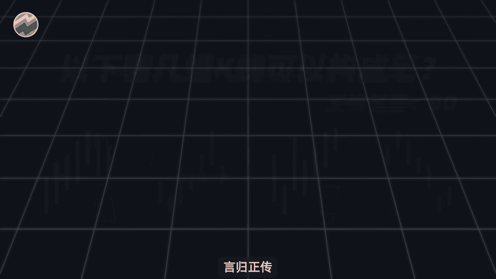

接下来呢我们就给大家介绍笔的更高阶用法，笔的延续。

前面我们讲的成功和失败的比，分别是什么样子的，那这就自然衍生出了另一个问题，刚刚做对了小册子的同学，可以很快发现，图中啊只有分型A和B可以构成一个比，B和CC和D呢则都是坏掉的笔，然后呢通过简单的观察。

我们可以发现分型D的最高点是高于B的，也就是说虽然AB形成了一个上升的比，但是上升的趋势并没有到此就结束。

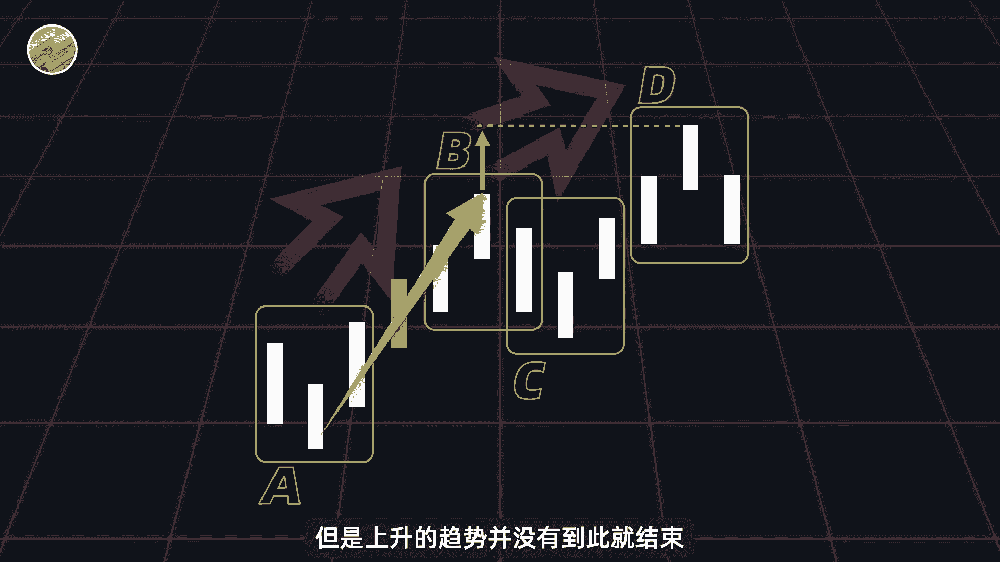

而是一直向后延续到了分型D，缠论的作者缠中说禅呢，就认为此时上升笔不应该画到ab为止，而是应该将这一笔向后延伸，形成一个全新的笔比。

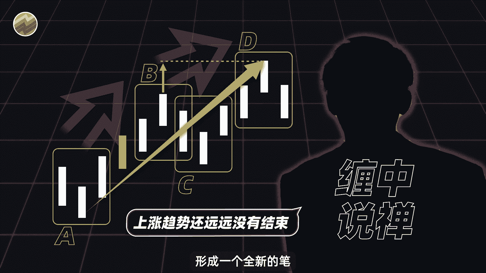

用于代替原先的ABB，我们呢则继续向后画K线，如果仍然是坏掉的笔啊，之后呢又出现了一个顶点更高的顶峰型，比如说是，那此时我们AD这一笔就需要延续为AFB了，我们可以一直这样画下去，如果一直像之前那样。

那么上升的趋势就会无限延续，这一笔也会永远画下去，子子孙孙无穷尽也，这就是缠论中所谓的笔的延续，那这样的延续何时会停止呢，也很简单啊，当然来看最初的这组K线，并同样向后画K线。

但我们这次画的K线呢和上次不太一样，这次在顶分型D之后呢，同样出现了一组顶分型E，但两者之间有一根独立的K线存在，聪明的朋友应该已经能够发现，分型D和E可以构成一个完整的下降比。

和之前的a AD的趋势呢是完全相反的，那此时呢我们就可以认为AD不会再向后，延续向上趋势了，这就是缠论中比的终结，简单来说啊，就是缠论中呢会用一个新的反方向的比的出现，来做上一个比的结束的确认。

所以啊对于比我们可以做个简单的总结，顶分型和底分型间存在至少一根独立的K线，构成比，比延续原有趋势，直到出现反方向的比作为终结，最终所有的比两两相邻，并呈现出上升比，下降比上升比的循环。

可能有人听我讲解。

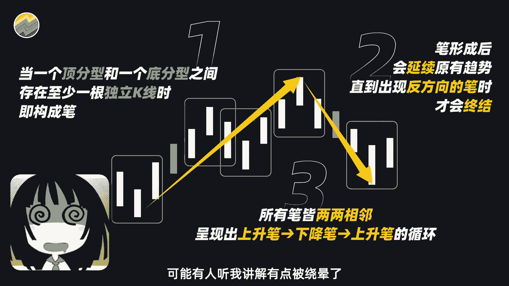

有点被绕晕了，但这其实已经是我们简化过后，并且基于可量化的标准去做了处理后的结果，你去看原版的缠论会更加的模糊不清，所以如果觉得没有听懂的话，建议可以再看一遍。

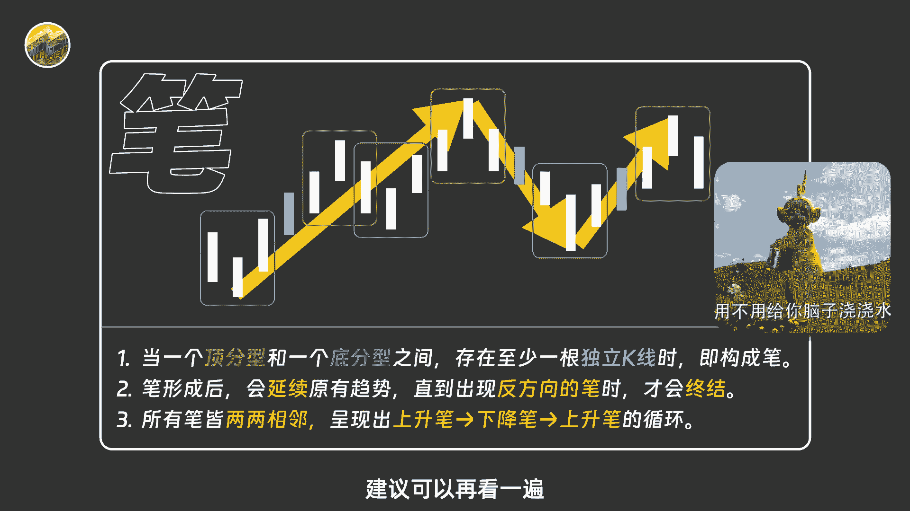

看懂了笔的构建，后面要讲的线段就可以说毫无难度了，如果我讲的内容对你有帮助的话呢。

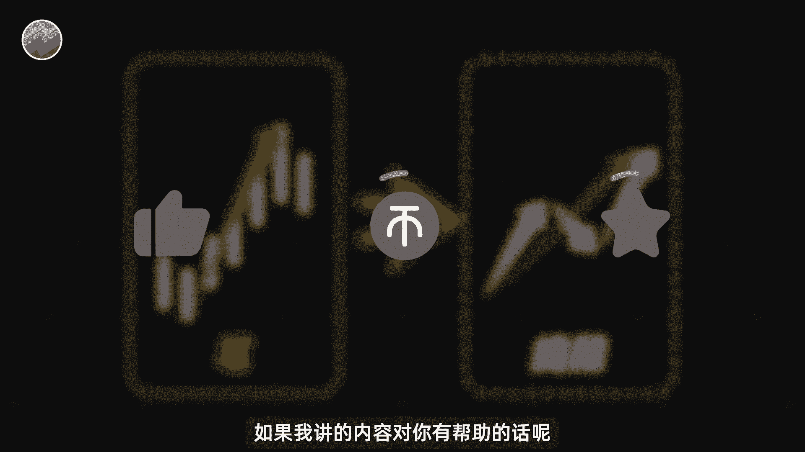

也可以三连支持一下，当然啊，肯定还是会有人觉得，我说的缠论的量化是不对的，这就像我开头说的一样，每个人眼中的缠论本就各不相同，我只是按照我的理解去尝试介绍并且量化它，仅此而已。

我也欢迎有不同意见的朋友在评论区留言，并且一起交流，回到传统的比，既然我们知道如何定义比，也就可以借助全部的A股历史数据和Python代码。

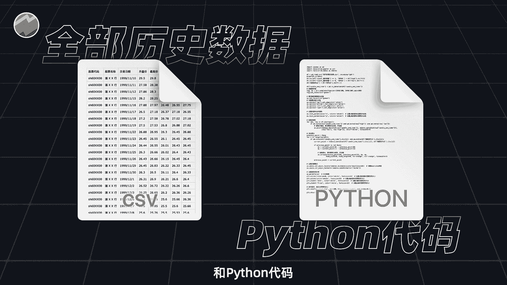

去帮我们找出历史上面所有的笔，并把它画出来，画图所需的数据呢我已经帮大家准备好了。

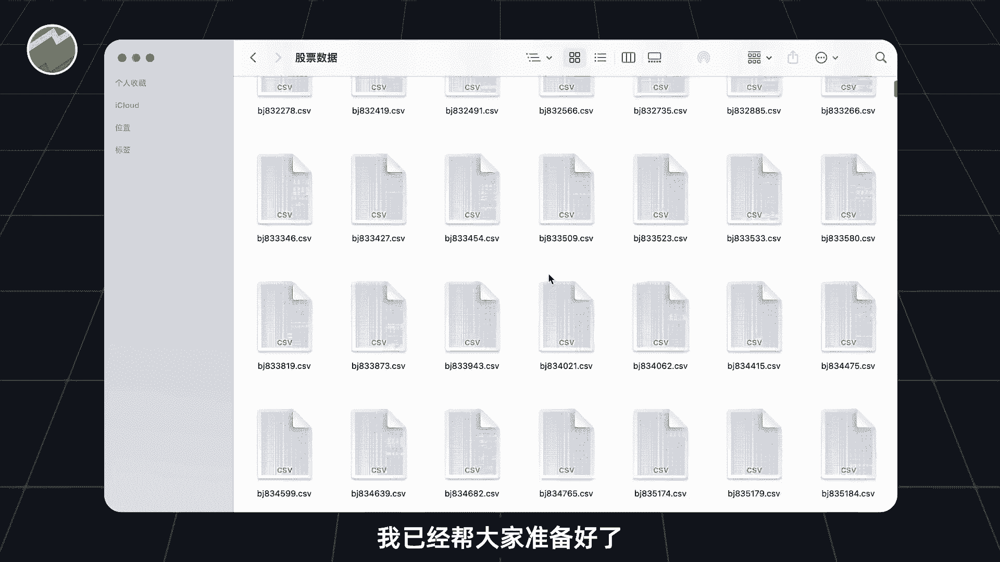

这里面包含了A股历史上所有5000多只股票，甚至是那些已经退市的，你可以打开其中任意一个文件啊，它包含了这个股票从上市第一天至今，每天的开高收低的价格。

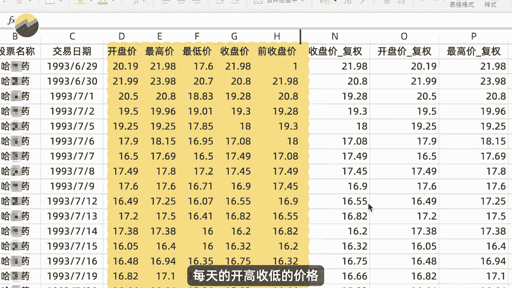

并且你可以计算复权价，非常的完备，画图的代码呢也并不复杂，你只需要点开这个Python的文件并点击运行。

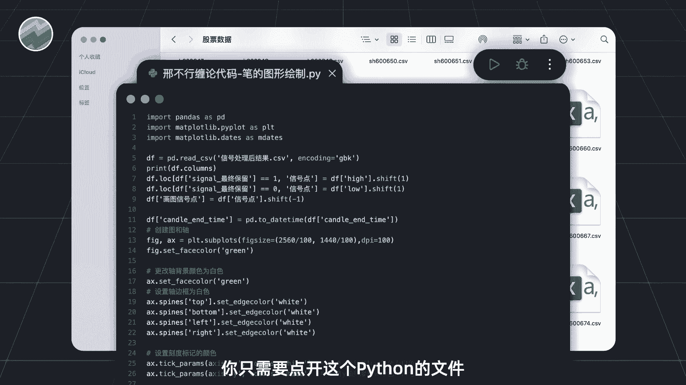

就可以得到标记出笔的K线图了，如果你需要这个数据和代码的话呢，可以加屏幕右下角或者置顶评论区，我的微信都是可以直接发给你的好，那么我们接下来就来运行一下程序。

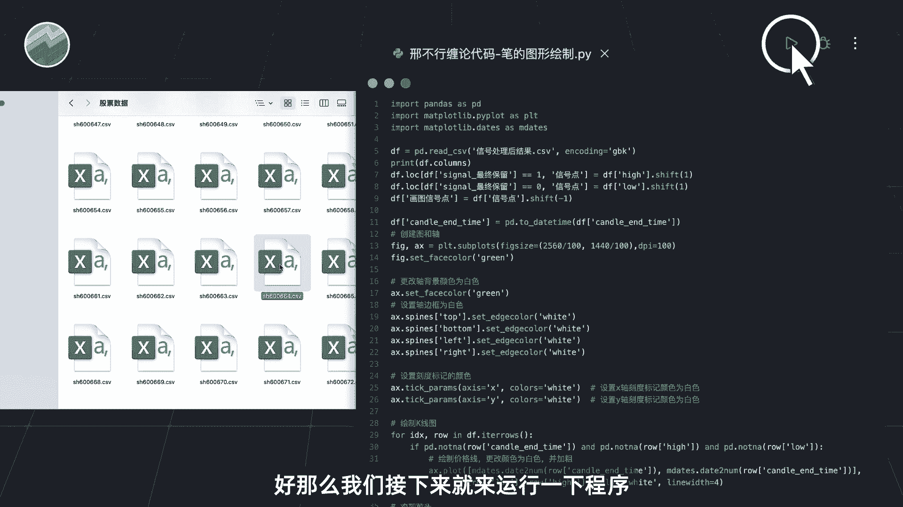

看看结果如何，程序的运行结果呢如图所示，图中的橙色的直线就是我们根据缠论的定义，画出来的笔，记住这个图啊，我们肉眼能够很直观的看到指定时间内，当前股票的所有比非常的清晰了。

相信有了这个图能够帮助使用残留，令你节省大量的时间去做更有意义的研究。

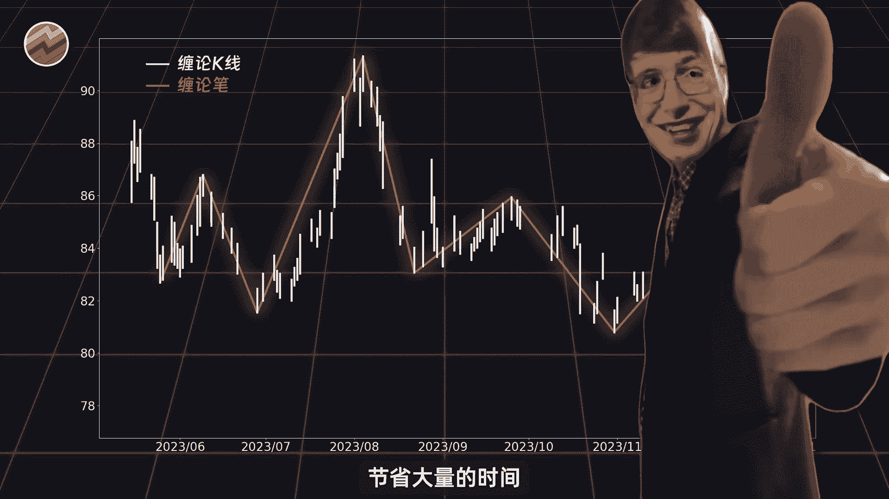

想必对于很多研究缠论的人来说，我们代码跑出来，这样的一组数据就已经很有价值了，毕竟之请大家只能够，照着行情软件的K线图去处理图形。

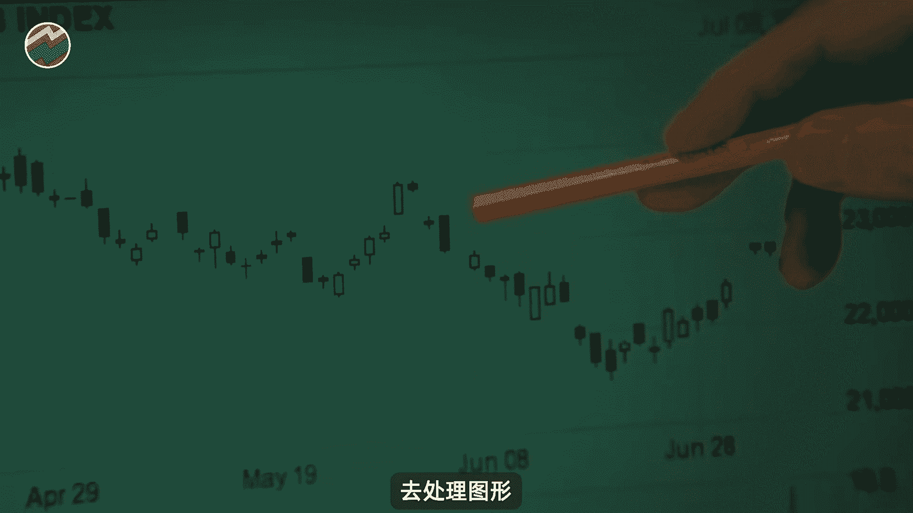

无法很好的快速找出所有的笔，会有种种的不方便，而我们这个图呢不仅包含了全部的历史数据，而且异常的简洁明了，没有一点多余的信息，懂行的人，想必也已经知道这个数据和代码的珍贵了。

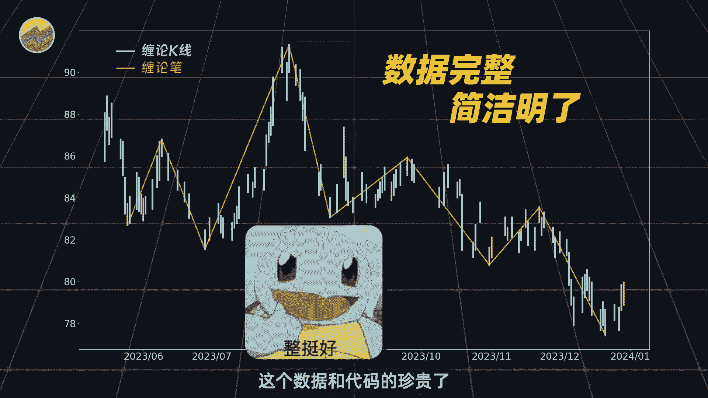

如果你需要数据和代码的话，加屏幕右下角或者置顶评论区，我的微信都是可以直接免费发给你的。

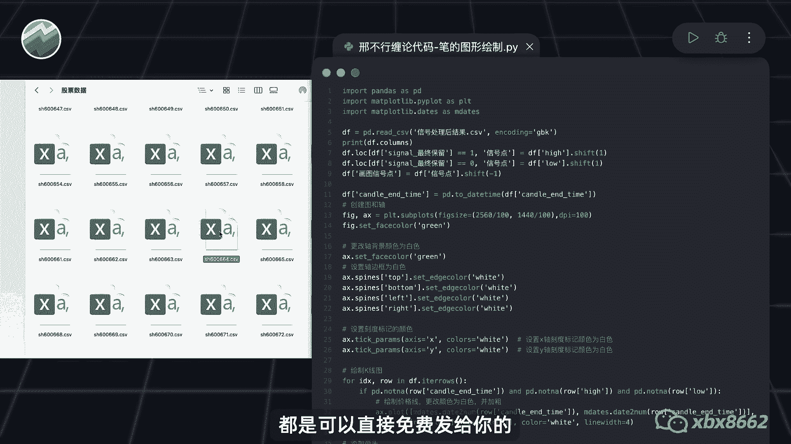

当然需要注意的是，在实际操作当中，分行的信号的确认并不在顶点或者低点，而是在顶点或者底点之后的一天，所以理论上来说，我们生成的图呢应该向后平移一天，我们这边这么画，只是为了让大家能够更直观的看出。

缠论中的每一个表，但不管怎么样，我们现在已经生成了笔的图，这个图呢看似也很完美，如果将笔作为买卖点的话，在最低点买入。

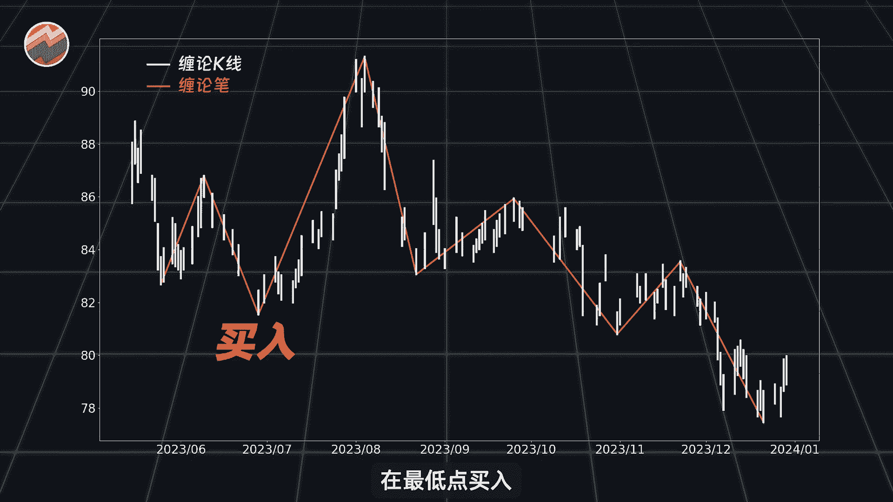

在最高点卖出，那按照缠论的理论，简直就是嬴政摸电门赢麻了，但是呢我想说的是。

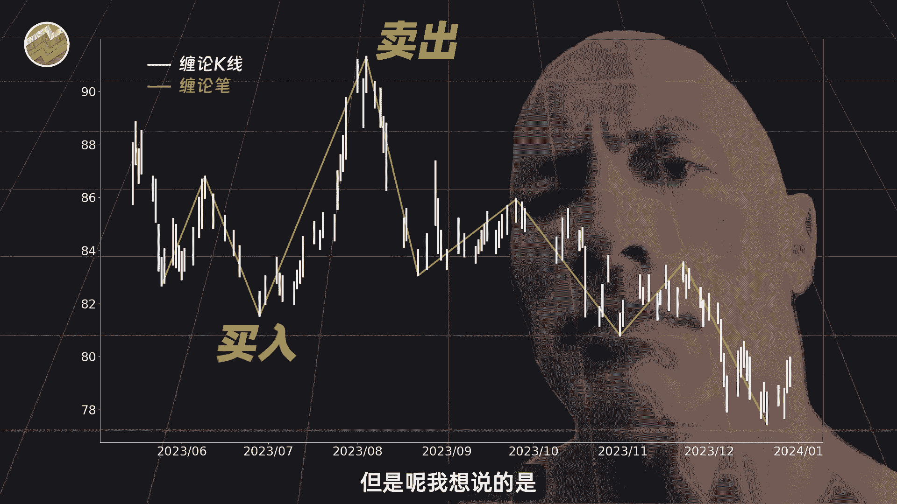

真的是这样吗，假设我们身处途中，B点这个交易日此时处于下降比之中，但我们也不能确定，这一段是否已经完整的画完了，有可能它还会延续，可能会出现上升比去终结它，而当K线走到C点的时候呢。

我们终于确认的上升比BC，我们就在BC点买入这个股票，一直拿着，直到E点，它构成了下降比第一，那么我们确认了上升趋势已经结束，就卖出股票，在C点买，在E点卖，你看似稍微赚了一点啊。

但一整波大行情你是完美错过，单纯的用缠论的比进行交易呢会有滞后性，如果用它作为买点卖点，很容易血本无归，当然啊，缠论中的比只是趋势的一个基础，我们接下来呢就来聊聊由比构成的，缠论中更高阶的结构。

也就是线段，通过前面的学习呢，我们知道了比是由顶底分型构成的，那长征中的线段呢则是由相邻的比构成，比如图中上升的比ab下降比BC和上升比CD，它们互相之间有重合的部分，也就是A点要比D点低。

此时我们就认为这三笔可以构成一个，缠论当中的上升线段，也就是a AD，同样的向下的线段呢也是由三个相邻的，互相之间有重合的比构成，只不过这三笔当中有两笔是下降的，比A点需要高过D点和分型并不是都能成比。

一样比也不是一定能成线段的，比如图中所示，ab和CD两笔呢就没有重合的区域，也就无法构成线段，我们同样也给大家布置一个随堂小测试啊，巩固一下学到的关于线段的知识。

请在以下几组比之中找出可以构成线段的选项，欢迎大家把答案打在公屏上，或者在评论区留言，然后呢和笔一样啊，缠论当中的线段也同样存在延续与终结，比如在图中，我们可以发现这些笔能构成上升线段。

a AD下比上升比EF的中点F点呢高于D点，我们就可以将线段a AD向上延伸，得到全新的上升线段AF同理啊，一直延伸得到线段A那线段会一直延续下去吗，又该如何结束呢，我们继续看后续的K线。

上升比IJ的终点呢是J点，是比我们的H点要更低的，而随后的JK比呢又是下降比H点啊，势必就会比K点更高，这样的话按照缠论线段的定义呢，就会产生一个新的向下的线段HK，此时呢我们就认为上升线段AH结束了。

做个简单的总结呢，就是三个连续且互相有重合部分的笔构成线段，线段延续原有趋势，直到出现反方向的线段，那就作为终结，最终所有线段两两相邻，并呈现出上升线段，下降线段。

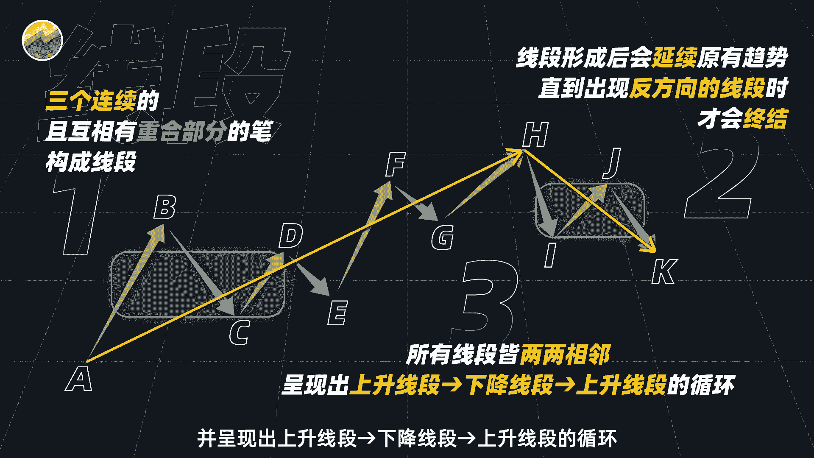

上升线段的循环，是不是觉得有点熟悉，因为笔的构建呢也是类似的过程，当然我需要说明的是。

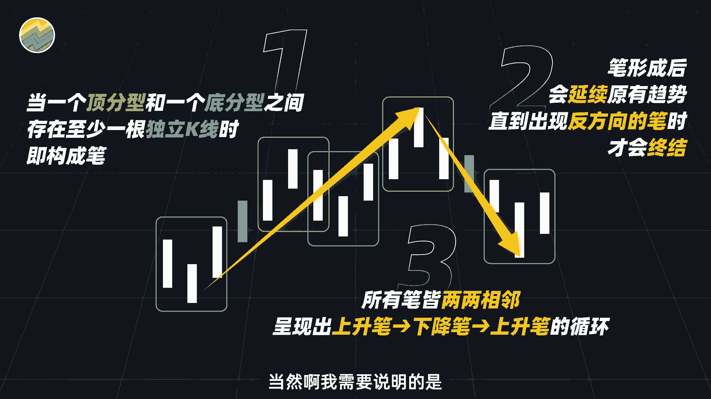

像缠论中处理线段的方法也有很多种，我们这边呢只是选取了其中一种，比较容易理解的来进行讲解，如果你有其他方法，也欢迎在评论区一起讨论，那么线段其实和笔一样啊。

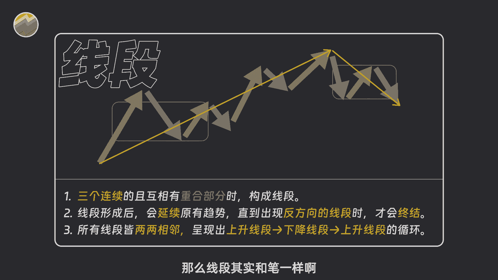

我们也同样可以借助Python代码，和之前处理过的笔的数据。

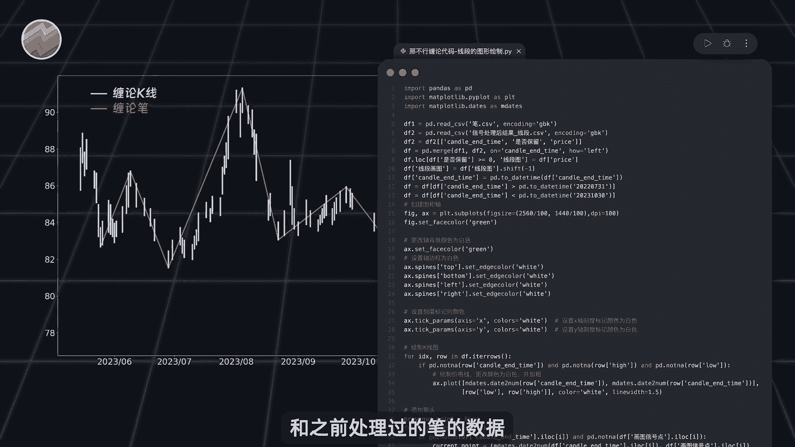

来帮我们找到所有股票在历史上所有的线段，具体的代码呢我也已经帮大家准备好了，只需要点击运行就可以得到想要的结果，如果你需要这个代码的话，可以加屏幕右下角或者置顶评论区。

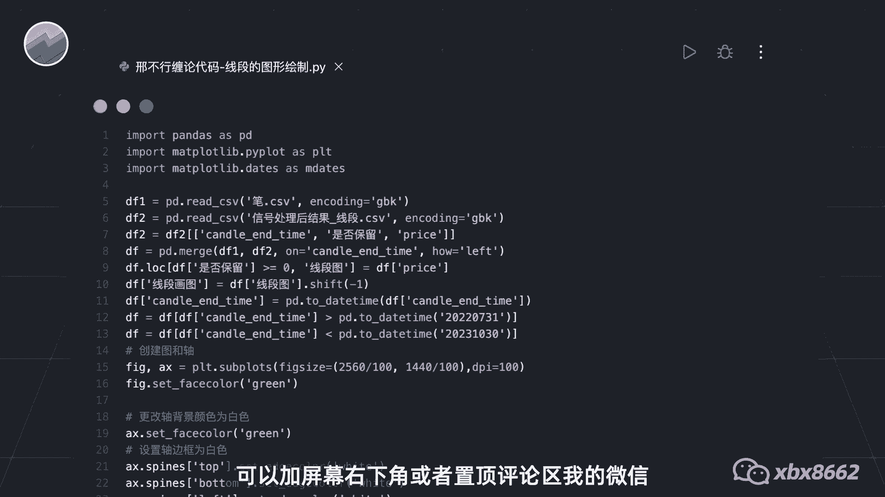

我的微信都是可以直接免费发给你的，程序运行就如图所示啊，图中的蓝色的线就是我们的线段，它是由笔构成，且一个上升线段接一个下降线段，完全符合缠论中的定义，非常的清晰明了，相信有了这个图啊。

能够帮助使用缠论的你节省大量的时间，好至此呢，我们大概介绍了一下缠论中趋势的基本构成，也就是笔和线段，我们画出来的图呢越来越简单，越来越接近缠论的买点卖点，那缠论究竟怎么买。

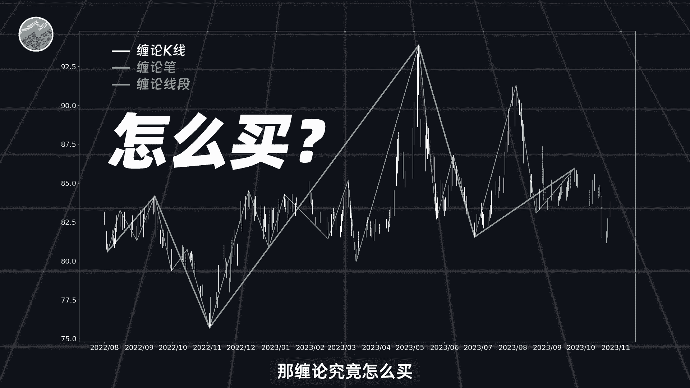

最终的效果又是如何呢，时间有限啊，我们就留到下一期进行讲解，届时我们会去讲解，缠论当中是如何判断买卖信号的，并且呢给大家分享我们验证缠论中，不同买卖点效果的代码，大家如果觉得这期视频对你有帮助的话。

欢迎多多点评，点赞破5000的话呢，下一期我们就来讲解。

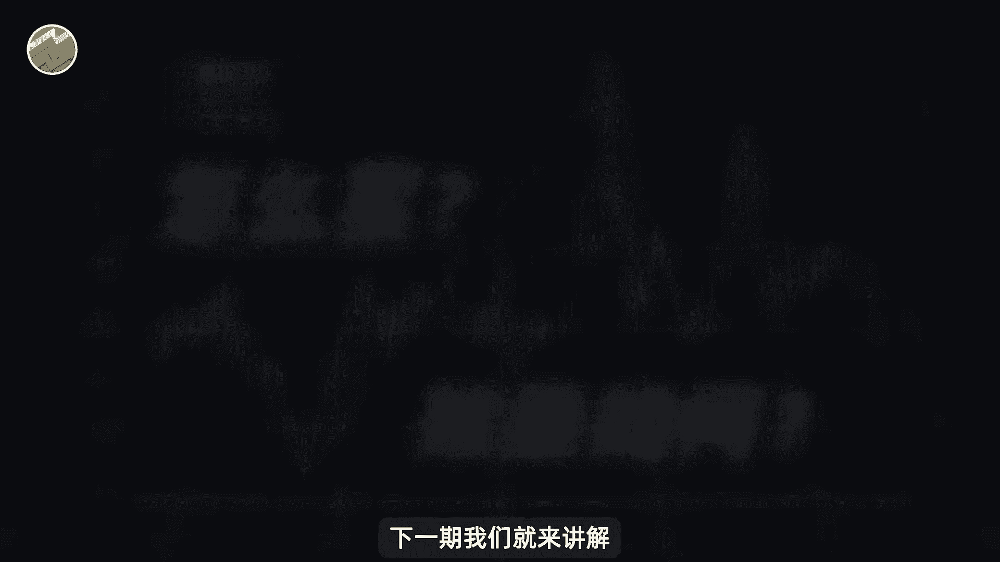

传统中对趋势的进一步应用，也就是缠论中买卖点判断的依据中枢与走势。

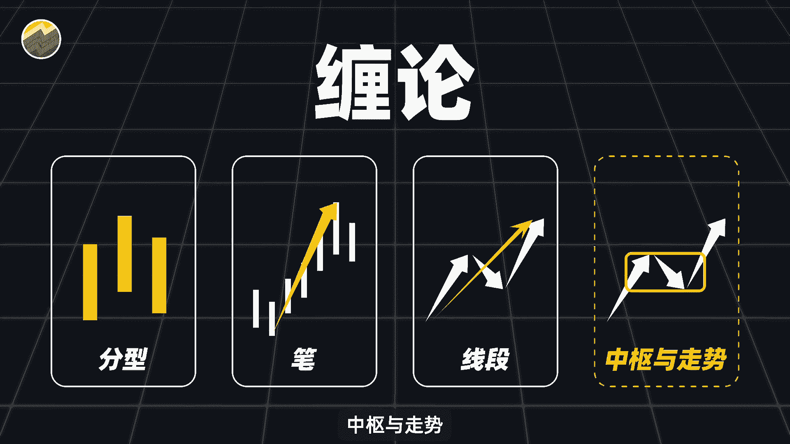

当然了，也有可能这期视频相对来说比较复杂，如果感兴趣的不是很多的话呢，后续我们可能就不会再讲缠论了，好那么本期视频就到此结束，感谢大家的点赞，投币收藏和转发。

