# 低风险、高收益？可转债缘何走上神坛？网红可转债策略能赚钱吗？ ｜ 附Python量化选债代码 ｜ 可转债双低策略，真的适合新手小白吗？【量化投资邢不行啊】 - P1 - 量化投资邢不行啊 - BV1UH4y1u7WD

2024年。

国内的电车厂卷上了天，前有比亚迪一降再降，杀入10万以内，闭门造车了，3年的小米也以21。59万交个朋友，很多人纷纷感慨啊，当下就是电车的大争之势，我们把时间回拨200年。

当时同样也有一个正在崛起中的大国，在这个国家也有一个交通行业卷上了天，不是电车，而是火车，可以说啊，整个19世纪都是属于火车的黄金时代，而美国的崛起历史呢，也可以说是由一段段铁路铺设而成的。

在铁路大发展的过程当中，以华尔街为代表的金融力量，也起到了极大的帮助，大量的融加速了铁路的建设，使美国铁路总里程占当时全世界的一半，其实啊当时的铁路上市公司，就像现在的高科技公司一样。

受到市场的狂热追捧，道琼斯指数刚发布时，80%的成份股都是铁路股，在这种背景下呢，伴随着铁路公司的融资需求，一种当当时很新的融资方式，可转债也就在1843年诞生了，在当时发生经济危机的背景下。

帮助纽约伊利铁路公司一举融资500万美元，可以算是一个很经典的融资案例了，潮来潮往，万物更迭，20世纪后，随着汽车和飞机的出现，铁路的黄金年代也落下帷幕，但可转债呢却一直延续至今。

仍然是资本市场上不可或缺的，一种常见融资手段，近年来啊更是在A股崭露头角，吸引越来越多的人参与交易，经常有人来问我，有没有什么可转债方面的量化策略，那么本期视频，我们就给大家介绍一个。

可转债相关的量化选债策略，大家好。

我是专注于量化投资的，行不行，既然我们今天要介绍科技可转债，相关的量化选债策略。

那首先我们需要了解什么是可转债，大家不要觉得我在水视频啊，也不是我针对谁，我敢说在座的各位，至少有一大半人不能明确的说出，可转债到底是什么，不信的话，我做一个小调研，可转债到底是股票还是债券呢。

给大家三秒钟的时间进行选择。

好时间到可转债啊，又叫做可转换公司债券，它本质上其实还是一种企业债券，但和传统的债券不同的是，他又不仅仅只是提供固定收益的债，你还可以在未来某个时间点，按约定的价格把它转换成股票。

我这里能把可转债和传统债券的详细区别，都列了出来，感兴趣的可以暂停观看一下，然后呢，既然可转债是债券，他就和所有债券一样，它会产生利息，那在座的各位大佬啊，平时肯定经常交易美债，银行间债券，还私募债。

应该也知道两个债券利息相同的情况下，只要不违约，买到的绝对价格越低，那最后赚的就是越多，可转债啊也是有这样的特性，那么至于可转债的股票属性呢，我们也可以简单举个例子，比如说在这个转债发行的时。

他一定会约定一个转股价格，这个价格呢一般不会发生变化，然后呢，我们就可以把手里的可转债，转换成相应价格的股票，比如啊假设某个可转债的转股价呢是十块钱，那么在股票12块钱的时候，我就把它转股，每股啊。

我就能净赚两块钱，但如果股价是九块九，这个时候我去转股呢是亏的，那我就不去转股，我继续拿着它作为债券，我去赚利息嘛，那简直就是赢政摸电门赢麻了。

而实际当中呢我们从收益的角度考虑，还是更希望股价能够变高，这样呢我去转股，我可以赚的更多，因为在座的很多各位赌狗呢，是看不上债券的收益的，一般呢我们会看转股溢价率，来判断要不要去转股。

这个转股溢价率越低。

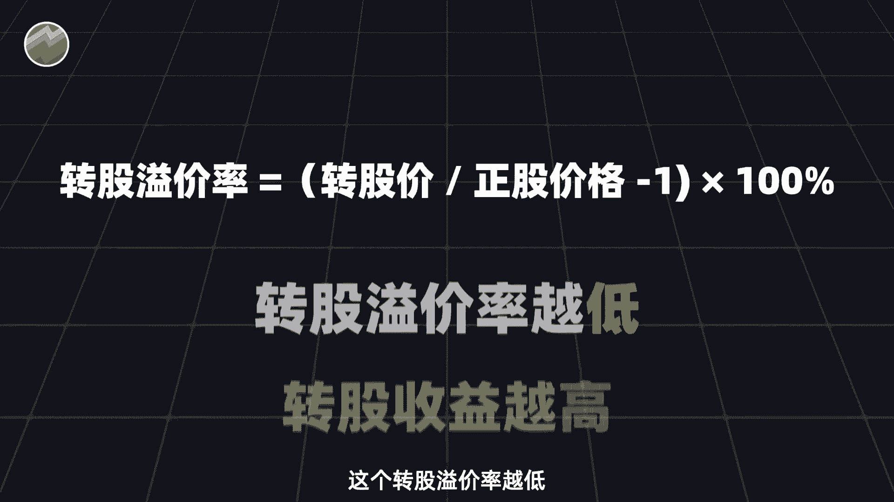

我们转股的收益也就越高，讲了这么多呢，大家别觉得我这是讲基本概念啊，因为这和我们后面的策略息息相关。

然后啊我们再来讲一下国内可转债市场的发展，在2017年啊。

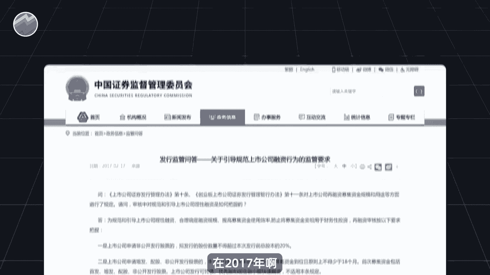

再融资规则调整之后，定增呢受到限制，这个时候可转债啊就顺势上位，成了上市公司最喜欢的融资方式。

借此啊可转债市场规模从2018年开始井喷。

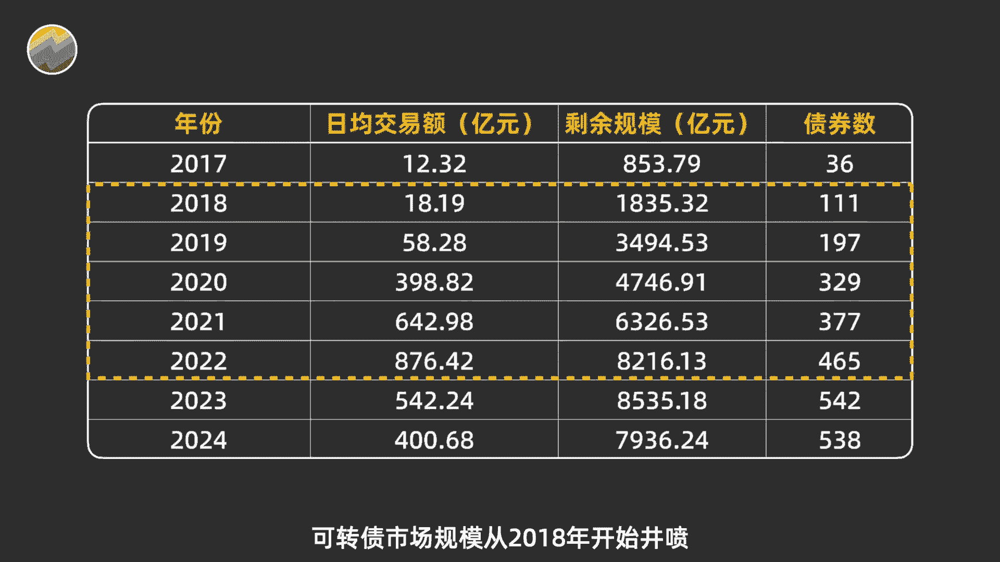

同样呢在2017年，证监会修改了可转债的打新的政策，促使大量的散户开始线上打新。

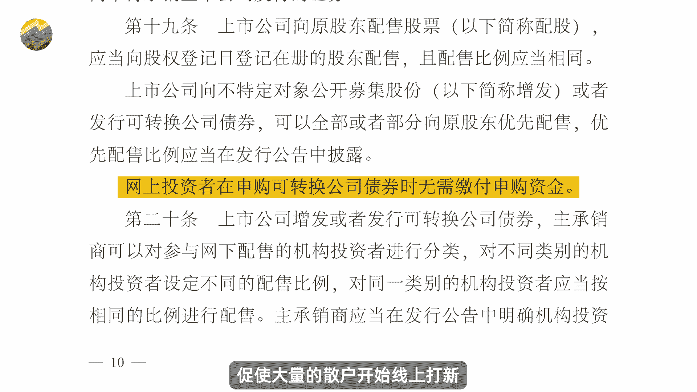

这个相信很多人都清楚，参与股，而打新的高收益和低风险呢，可转债的交易也就逐渐进入了人们的视野当中，整体成交额日益增长，很多人参与可转债的交易呢，是因为他认为可转债本质上是债券交易，风险很小。

但我想说的是啊，与A股市场不同的是，可转债市场它不设涨跌幅。

并且是T0的规则，当天买当天就可以卖，市场本身的成交量呢也很低。

远没有A股那么大，非常容易被操纵，对于没有什么投资经验，又爱好追涨杀跌的人来说，这样的市场反而会有更高的风险，当然这是我个人的一点见解啊，如果有不同的想法，也欢迎在评论区和我交流，然后呢提到可转债啊。

一般都避不开集思路这个论坛。

这是一个相对小众的投资论坛，上面的用户呢更偏向于低风险的投资方式，以讨论新股可转债ETF为主，很多当下比较热门的可转债策略，最早也是来源于此，比如这几年大家讨论了很多的可转债双低策略。

这个策略就是在2018年的时候，由集思路用户YYB凌波提出并开始实盘的，后来呢在2020年牛市中，被各类理财博主推荐。

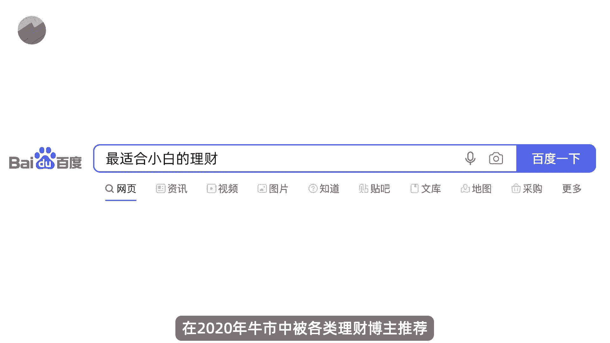

变成了最适合小白的理财策略，那这个转债策略真的那么神奇吗。

我们来看一下这个策略。

可转债本身的价格和它的转股溢价率，都是越低越好，所以呢宁波他设计的双一策略当中，就是很简单的把转债价格和转股溢价相加，得到一个双低值指标，然后呢根据这个双低值来进行选债，这个指标哪个低，我就选择哪个。

这样选出来的债券呢，保证这两个指标相对来说都是比较低的，当然那通过这样的指标来选债，到底有没有效果呢，这个我们肯定要自己去验证的，我们可以尝试着构建如下一个量化交易策略。

比如说在每周最后一个交易日结束之后，比如某个周六周日你比较空了，那你拉出所有可转债的数据，计算出他们所有的双低值，然后按照双一直呢从小到大进行排序，并且删除了当时那些正骨。

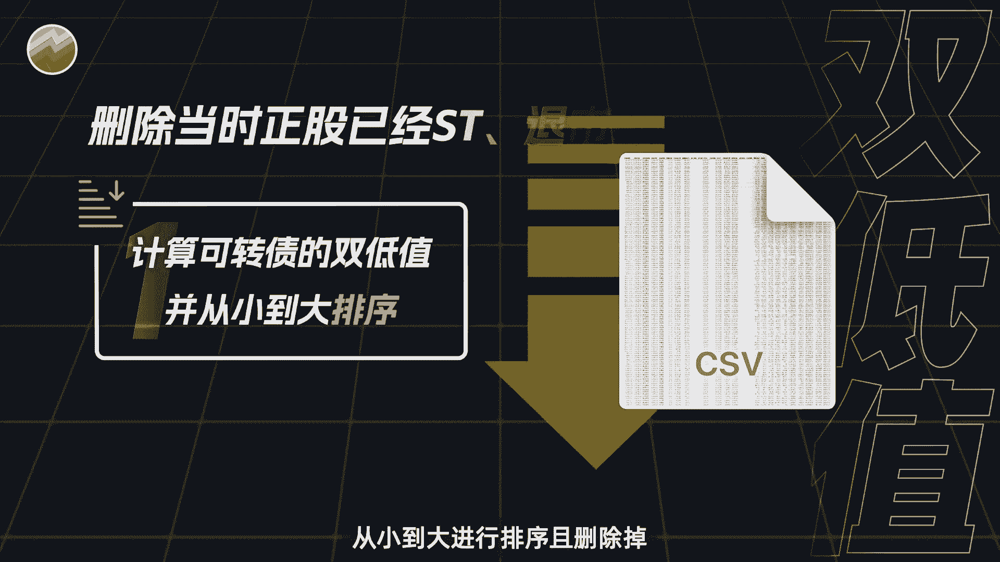

已经是T或者退市或者停牌的可转债，然后挑选出此时双低值最小的五只可转债，然后呢我们就在下周第一个交易的开盘，去均仓买入这五只可转债，并且呢会一直持有到下周一整周，下周一整周你都非常用心的工作。

没有去看盘，它涨和跌，你都不管它，直到下周最后一个交易日收盘的时候，你把它全部卖掉，不管赚钱还是亏钱，然后呢再重新去选择双地值最小的五只可转债，并且呢在下下周的第一个交易日去买入，如此循环往复啊。

比如说途中我在24年3月1号这一天，就在所有可转债当中选出了这五只转债，因为他们是此时双低值最低的支，那么我就在下周的第一个交易日，也就是3月3日，我去买入它们，然后一直持有到3月8日这一天卖出之后。

再重新选符合条件的可转债，那么这样就是一个简单的量化选债策略，假设我一开始投一笔钱去交易这个策略。

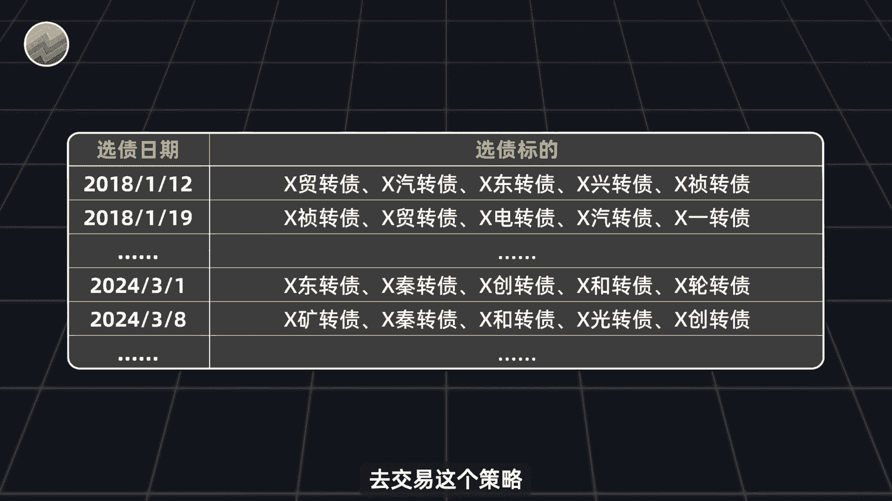

那最终是会赚钱呢还是会亏钱呢，要验证我们这个实验的想法，就需要借助全可转债历史数据和Python代码。

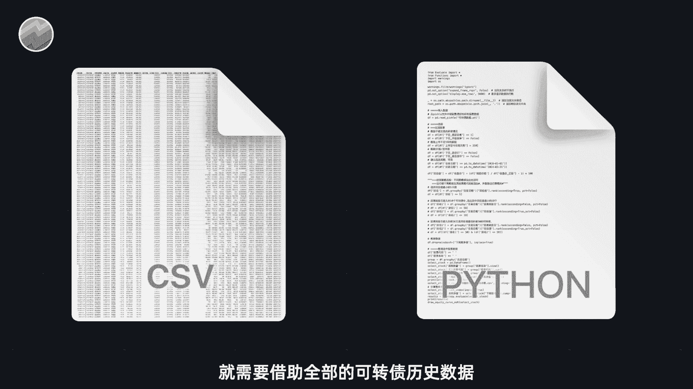

来验证它具体的数据和代码，我这已经帮大家准备好了，这里面包含了A股历史上所有的可转债，甚至是那些已经退市的可转债，你可以打开其中任意一个文件，包含了这只转债从上市第一天至今，每天的开高收低的价格。

甚至还有它的转股价格，转股溢价率等等指标，非常的完备啊，有心的同学应该知道，这份数据获取并不是那么容易，有了这个数据之后呢。

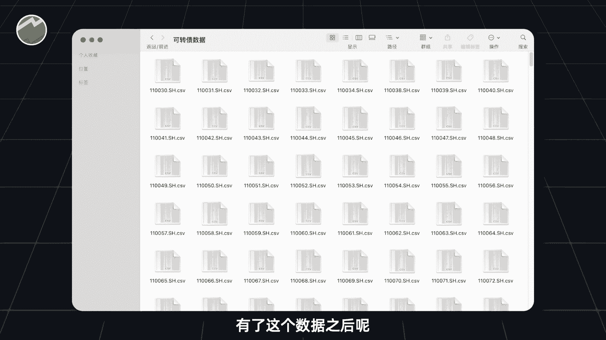

你只需要打开这个PY后缀的文件，点击阅行就可以看到结果，如果你也需要这个数据和代码的话，可以加置顶评论区，我的微信都是可以直接发给你的好，那么我们来运行一下程序。

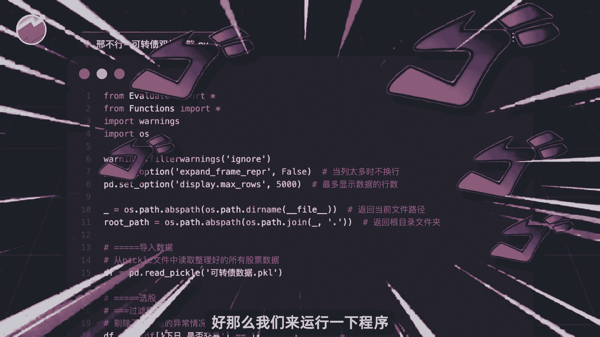

看看结果如何，在看程序运行结果之前，先插一个题外话，很多人问我小白如何入门量化投资，有什么资料分享，所以呢我特意为大家准备了一个量化投资，新手学习的大礼包。

你打开这个文件，它包含非常多的内容啊，首先这个word文档呢是我们自己总结的。

量化投资学习路径，很适合零基础的新手，让你知道自己一步一步需要达到什么样的阶段。

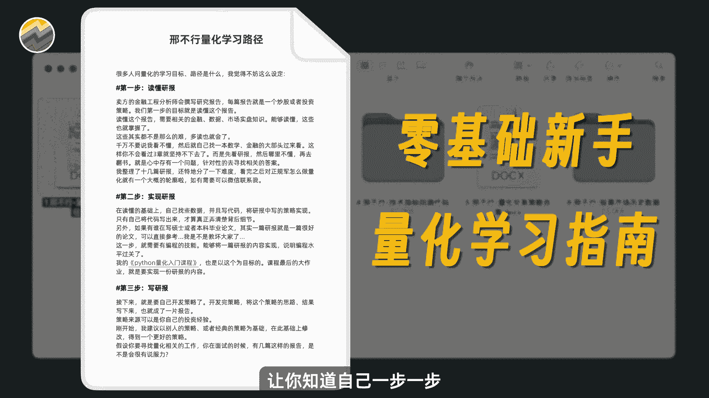

看完学习路径后呢，就可以通过我整理的量化文章合集，来更全面的了解量化投资到底是什么，然后呢，我还精选了适合各个学习阶段的策略研报合集，正如我一直说的，量化研报是很好的，量化实践项目。

深度研报可以显著提升你的量化水平，还有这一份代码呢，则适合所有喜欢技术指标的人，你可以跟着教程轻松计算出所有的技术指标，并测试这个指标是否有效，如果你有一定的基础，你还可以尝试回测一些策略。

我为你准备好了十几个不同类型的经典策略，和他们的代码，运用到实盘，当然最后也是最关键的，量化的基础就是准确的历史数据，我会送你一份股票，历史日线数据和一份财务数据，你可以用它来像我一样。

去测试所有的技术指标和财务指标，以及大部分的策略，所以这个大礼包的内容真的非常的丰富啊，如果你需要的话呢，可以加置顶评论区，我的微信都是可以直接免费发给你的，好我们回来看程序运行的结果。

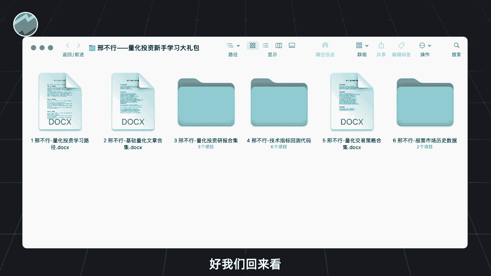

程序结果呢如图所示，代表策略的蓝色曲线，从一开始的一块钱涨到了最后的1。5亿元，跑赢了途中的橙色曲线，那是代表大盘的沪深300指数，但是啊并不能说明这个策略收益有多好，因为它的年化收益呢只有6。85%。

最大回撤呢高达51%，并且目前你可以看到还在回撤当中，这样的结果啊并不是很让人满意，而且啊可以很明显的发现啊，这个策略从18年到21年，年底都是非常有效的，这几年大概最多的时候翻了三倍。

但是21年之后呢，就一路向南，一直处于有回撤当中，那么这个转折点21年啊。

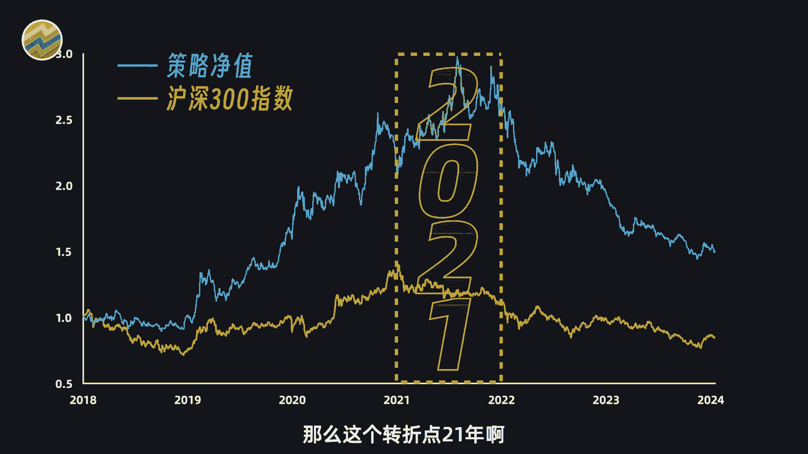

其实也是挺有意思的，如果我没有记错的话，2020年左右，可转债市场逐渐火热，连最简单的打新也能获得很高的收益，也正是在这个时候，很多人开始推荐双低策略之类的，甚至有人啊这是最适合新手散户最稳定。

收益最高的策略，但随着最近两年的回撤，你就发现很少再听人说，其实啊金融市场就是这个样子，人越多的地方越不能去，越多人吹捧的事物越要远离，你，也可以回忆一下自己炒股亏钱的经历。

很多时候都是看到朋友甚至是群友赚钱了，你就投了点小钱跟着冲进，一开始确实赚了点猪脚饭的钱，等到又赚了一顿疯狂星期四的钱之后，你就再也忍不住了，放了很多的钱进去，这个时候呢就开始亏在，然后就没有然后了。

很多人自己亲身体会过后面的经历，其实啊相关经历啊，我们也出过很多期视频，用数据去证明了类似的观点，感兴趣的朋友可以去看一看，加深下印象好。

那么回到我们策略本身，其实这个双低策略本身是没有任何问题的，逻辑非常扎实，长期来看肯定是向上的，只不过任何策略呢它都有潮起潮落的时候，但不影响我们把这个双低策略，作为一个非常好的基础策略。

我们可以在此基础上去做进一步的优化，下面呢我们就给大家提供一些相应的思路。

比如说啊，我们可以在距离转股日最久的50个，可转债当中选出双低值最小的十支，整个策略的效果呢就会有进一步的提升，又或者我们可以买入距离转股日最久的前50，又是双低值最低的前50的可转债表现也不错。

至少最近不回撤，其实啊拿双地址作为理论基础，在此基础上进一步优化魔改有非常大的空间，由于时间关系呢，这些策略我就不详细讲，感兴趣的可以截图研究，任何不懂的也可以找我交流策略的数据和代码。

我也给大家准备好了，你可以加置顶评论区，我的微信都是可以直接免费发给你。

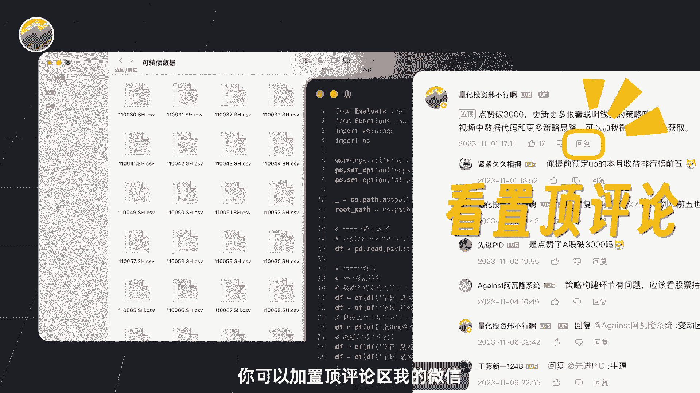

那可转债的策略除了双地值之外，还有很多很多。

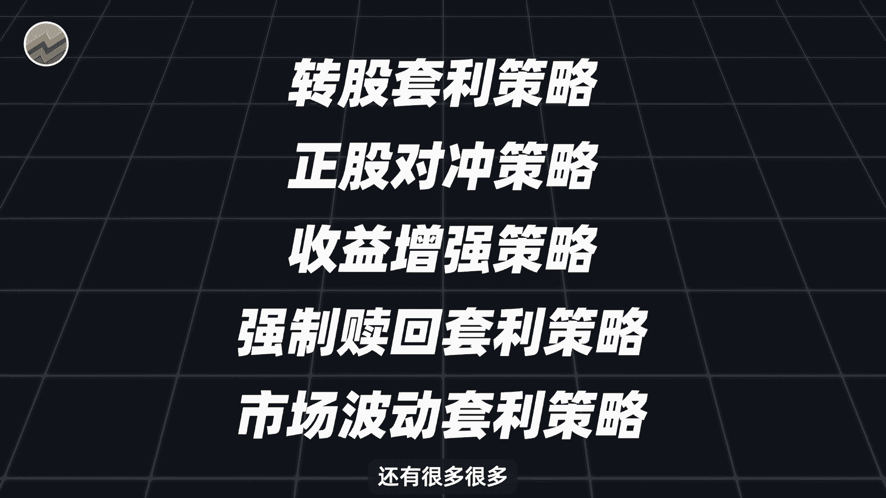

不止以上这些，感兴趣的话呢可以多多点赞，本期视频点赞人多的话呢，我们之后可以再进一步做相应的讲解好。

