# 使用 Python 和掘金量化 API 实现股票开盘强弱排名工具 - P1 - 余汉波 - BV1wj421f7GK

而这个视频仍然来讲一下这个Python和这个结晶，量化API的一个调用啊，上一个视频我们讲了，获取这个集合竞价的一个数据，这个视频的话是来讲一下啊。

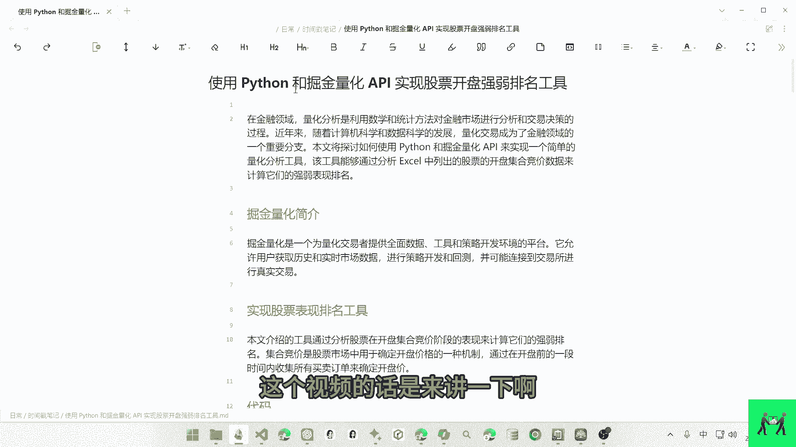

进行对这个集合竞价的一个处理，就是开盘集合竞价的一个强弱的一个排名呃，这个上面的一个自定义函数的话。

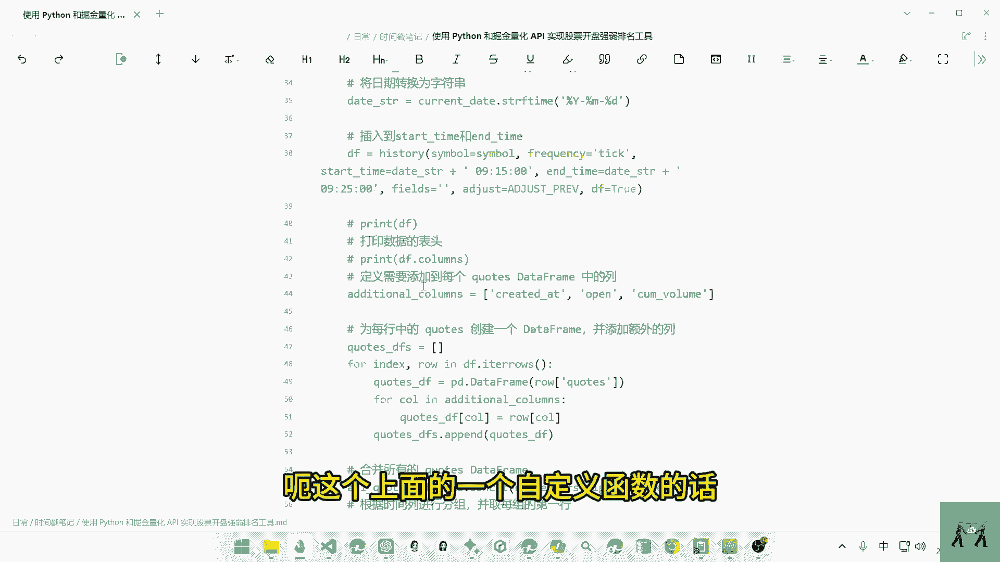

就是上一个视频讲的一个自定义函数，用来获取这个集合竞价的一个数据，三秒的一个数据，然后下面的话就是对我们自选股的一个数据。

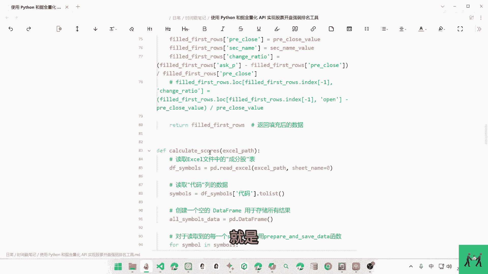

的一个排名的一个处理啊，这里的话是读取这个excel表格里面的一个啊，成分股。

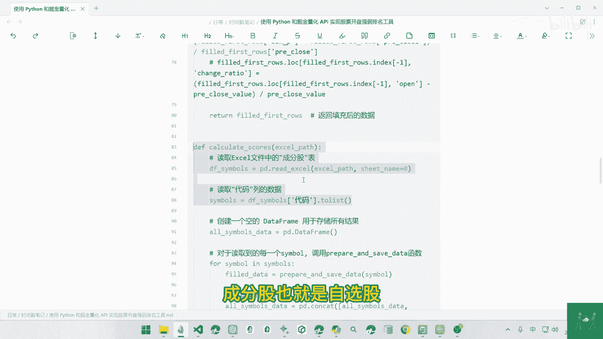

也就是自选股读取完成之后，我们进行对这个数据进行一定的加权呃，这个是对这个时间点的一个打分，注册价钱，然后这个下方的话是对这个最后一个时间点的，一个啊加钱，这里是加200倍的一个加权。

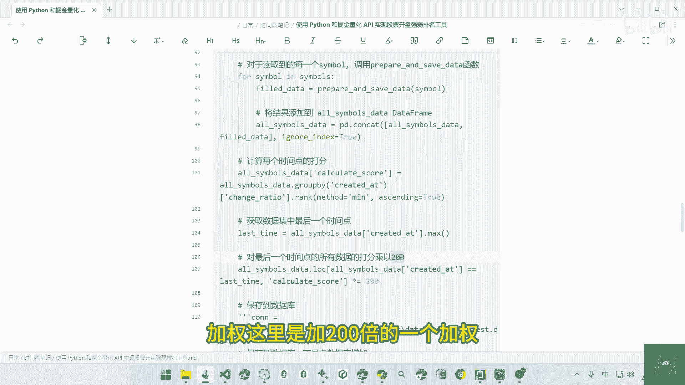

上面的话是排名之后的一个加权，这上面的话是对每三秒数据的一个加权呃，也就是他的排名的加强。

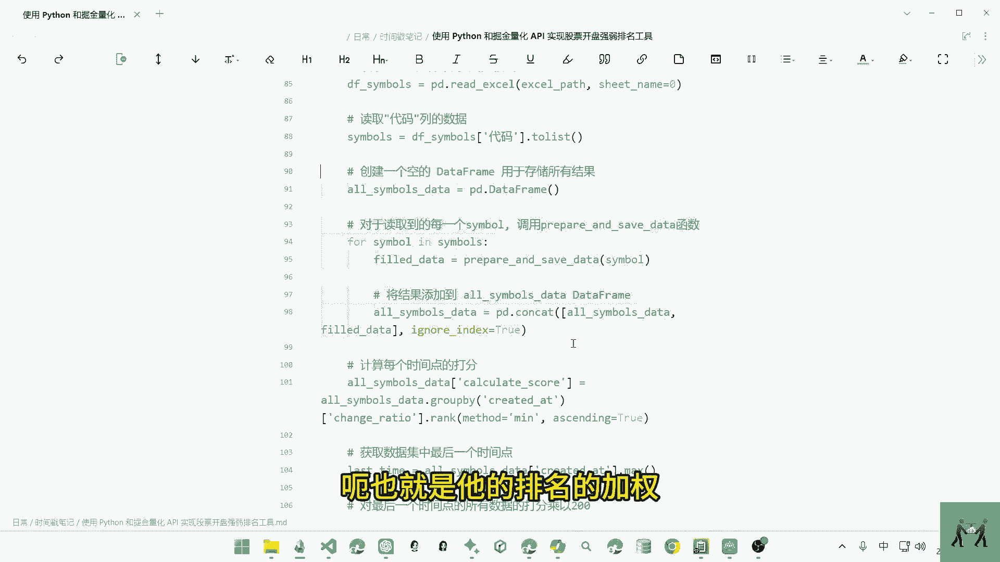

如果谁排在前面的话，就是给他的一个权重打分的话是比较高，这个代码的话是对后面的一个数据的一个加强。

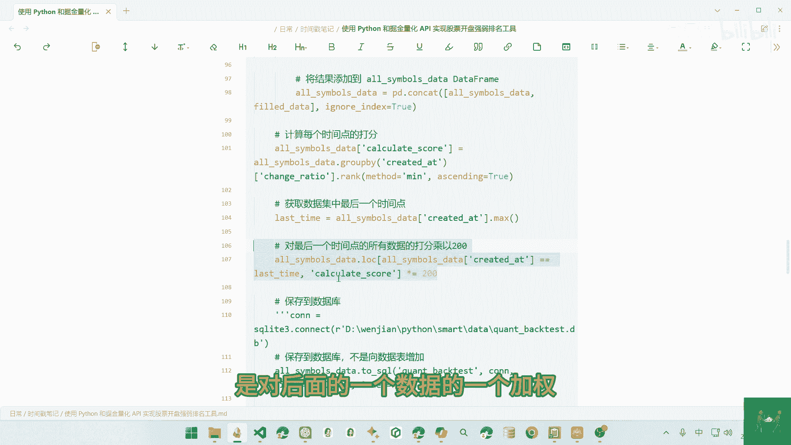

就最后一个数据就涉及和竞价结束，也就是开盘价的一个价位，进行一个乘以200倍的一个价钱啊，这个看个人的一个需求，然后进行相应的一个处理。

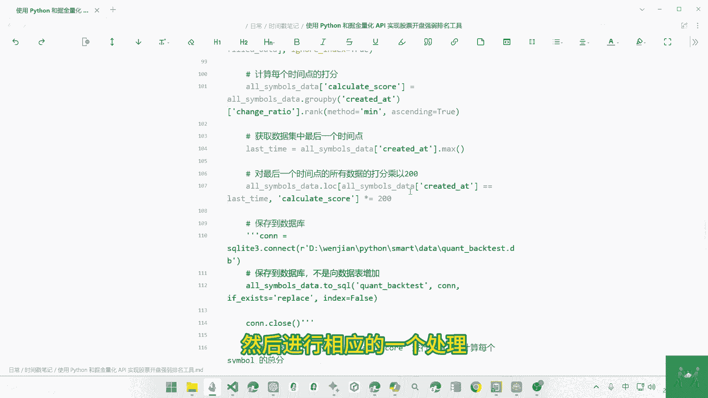

然后最后的话就是返回这个数据啊，我们可以去打印这个数据，这个代码的话就是这个代码，这里面的话我们读取的这个成分股的话。

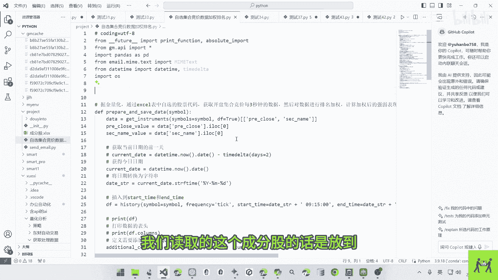

是放到这个excel表格里面来，我们打开的话，我们就设一个代码，然后这个代码的话前面要加上一个市场，然后就设一个股票的一个代码，我这里是八只股票的一个代码进行一个对比。

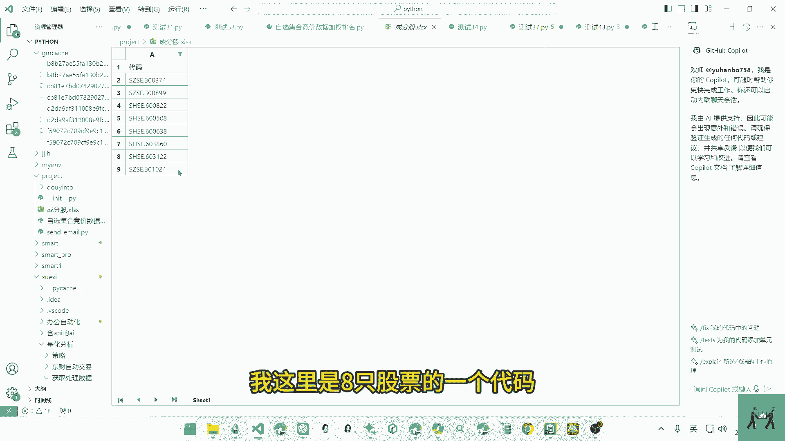

然后我们进行相应的一个运行。

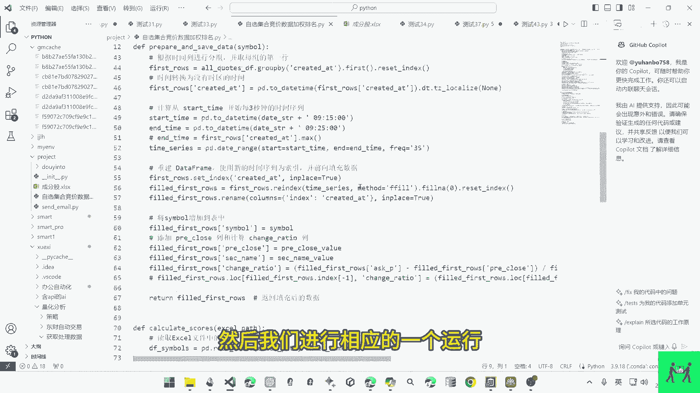

然后获取最终的一个排名数据，这个就是对啊这个集合竞价的一个打分价钱，看个人需求进行相应的一个修改啊。

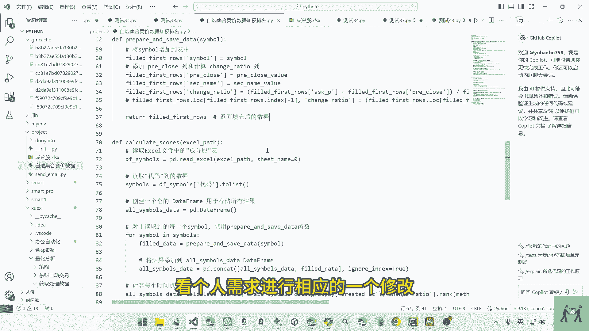

主要这里是举个例子，怎么去加钱，去筛选出四弦里面的集合竞价最强的一只股票。

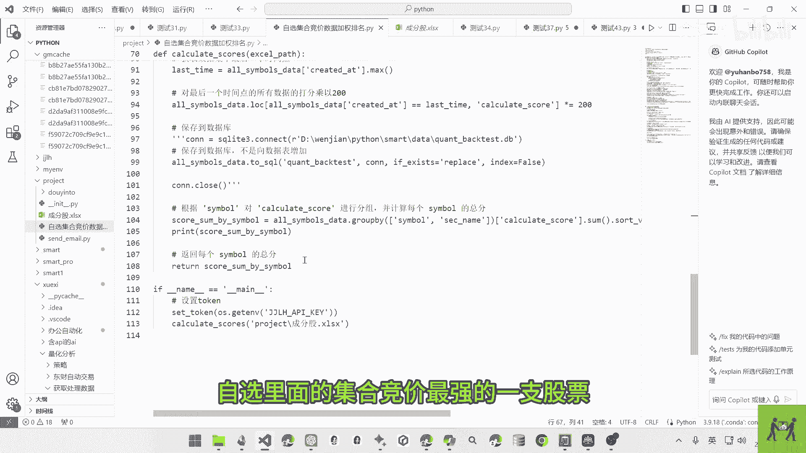

而有很多人是通过这个集合竞价去啊，开盘价买入的，看它的强弱进行一个操作，所以这个代码的话。

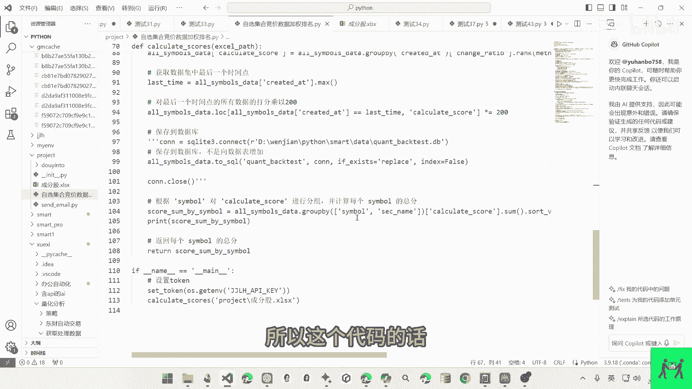

就是对这个集合竞价的一种处理呃，我们可以来演示一下，运行一下这个代码，我们点这个运行运行完成之后，他就对今天的一个集合竞价进行相应的打分，排在最前面的话，它的分数啊是最高的，也就是在集合竞价中。

它是最强势的，当然每个人的家的权重不一样啊。

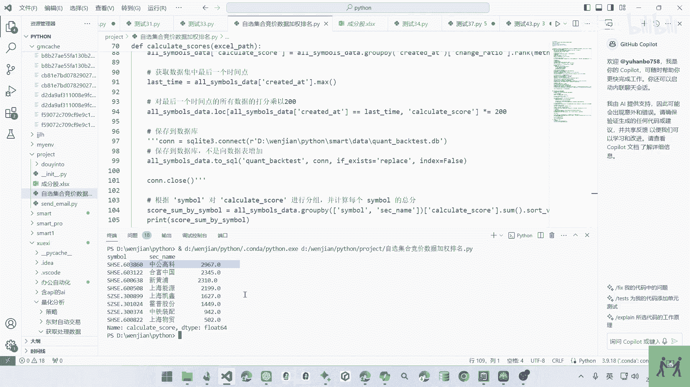

这个最后的一个得分是不一样，但是这个是他的一个排名啊，这个就是这个视频。

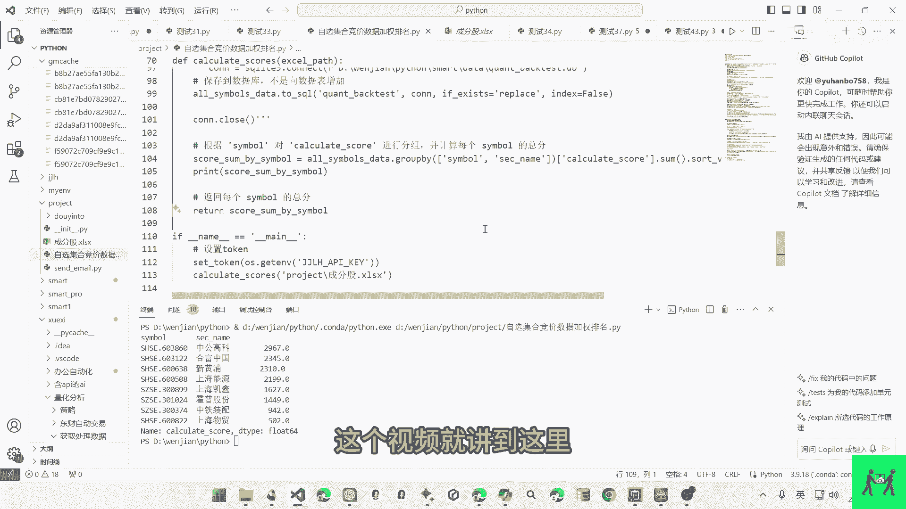