# 使用embedding向量化做数据分类（一） - P1 - neojos - BV1gviFeiEC4

今天我们一块看一下embedding，就是try的GBT的embedding接口，这边是集合时间上的一个四度为当，嗯正好看了一下他的embedding及其训练模型，所以我决定自己来嗯。

自己通过这个集合围巾的一个学习，来了解一下他他的一个过程，同时的话对最下面这一个哈理解指标，学一点机器学习小知识做一个小小的总结，嗯在这开始之前，我们可以先看一下啊，先看一下这个代码啊。

这是代码得C的话，其实首先需要一个APIKAPIK的话，嗯正常来说，我们其实嗯应该是try的GBT对吧，但是呢，但是我发现啊就是现在的话拆了GBT，他已经已经不支持了，就是国内它它不支持了。

嗯我们现在没有办法嗯，没有办法去用国外的这个try的GBT了，至少我现在没有办法，那为什么呢，因为嗯因为因为咱们可以看一下啊，因为我们登录了之后，我们其实已经申请不到他的这一个。

这个我们已经申请不到他的这个APIKE了，所以是没有办法的嗯，这个外网登录比较慢啊，比较慢，比较man，那，Thermore，不要这个。

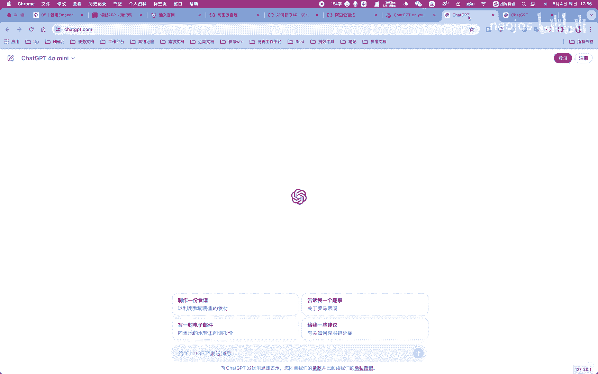

制作一份食谱，这是，好的。

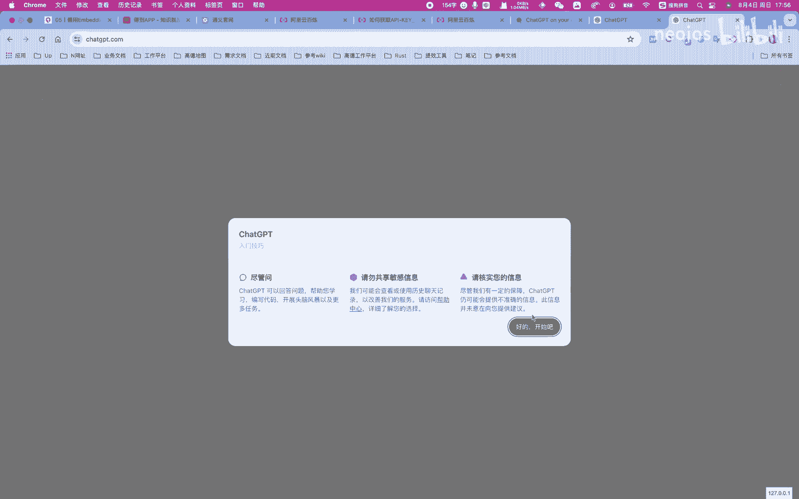

开始关闭，继续可以看一下我的ChatGPT，我感觉我好像是进到了一个错误的chat，GPT里啊，GPT看一下啊，G p d4，这个对吧。

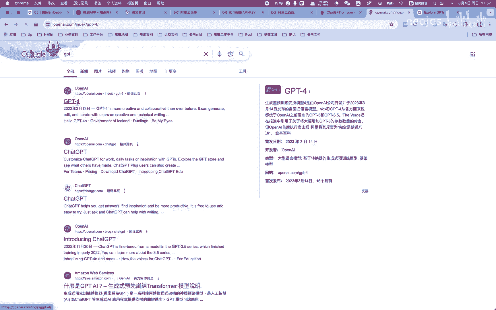

这个可能才是。

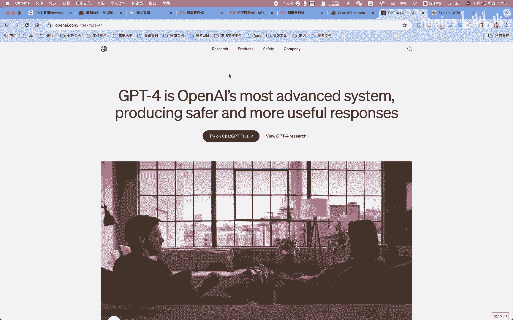

我们可以了解一下chat gbt，然后learn more，Available now on download，这不是我想要的，产品，Api login，登录一下。

查SGBTAPI对我们是要使用API嗯，你看啊，其实我们现在已经登录了这个XSGBT，这个API后台，然后呢我们来看一下这边一个API的获取过程，然后我们点查的GBT的APIKE。

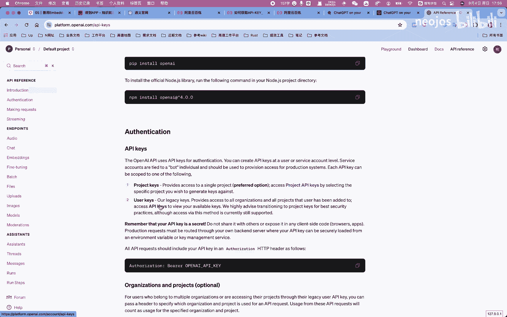

然后呢我们这边验证电话号码，其实我验证电话号码的话其实已经不行了啊，我随便输一个啊，这不是我的电话号码，1822346789吧对吧，然后SCODE他会告诉你说你看OpenAI服务不可用的，在这个地方。

所以我们现在已经没有办法去使用这一套，这一个API的一个后台了，所以我们其实嗯既然不可用了啊，但我们也保留一个截图吧，683111d d，318311893389368setcode。

就是现在没有办法去这个，我们没有办法去去做这样的一个操作了。

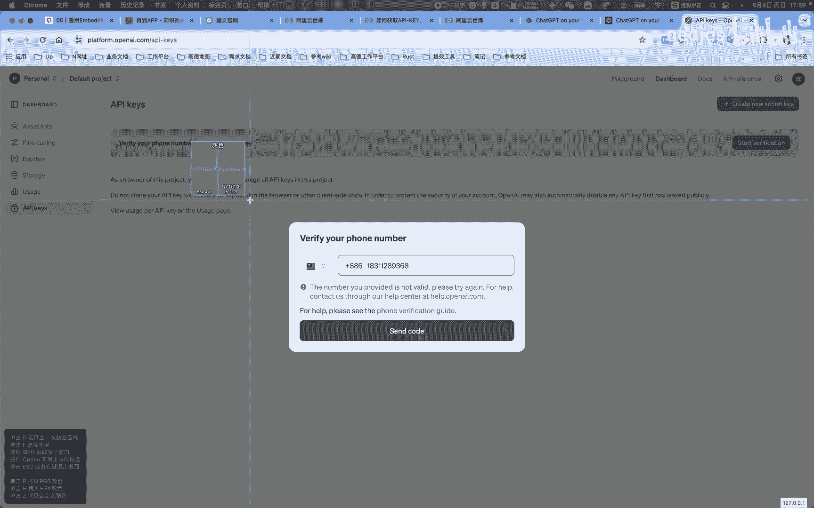

我们API key已经没有办法去做这样一个操作了。

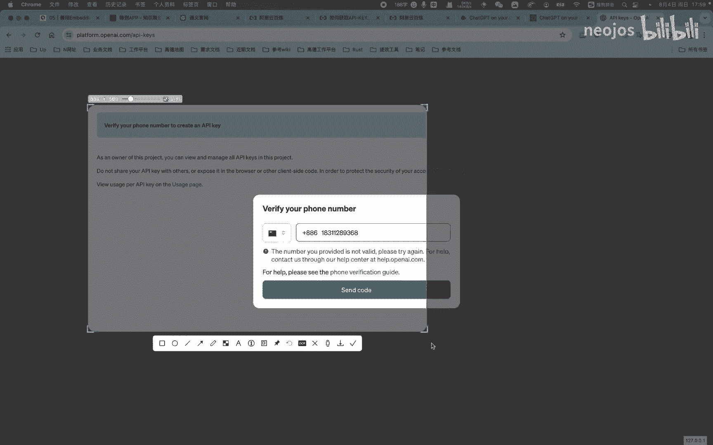

嗯那可以我的目标其实是其加一个博客啊，嗯upsetting a abs，熟悉我前面的可能都是可能都已经知道啊。

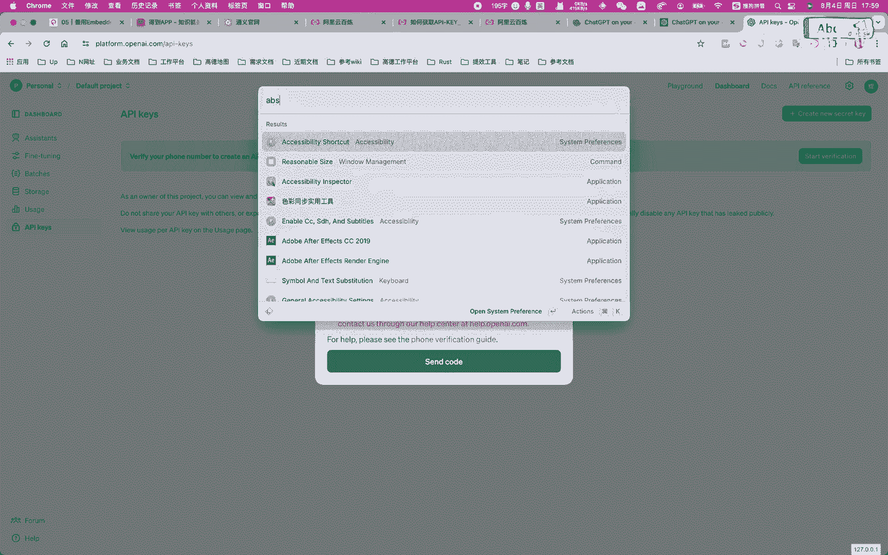

我这边会写一个博客，哎，这个博客的图片不是这个博客嗯，博客啊，这一篇博客数据统计APIK哦，我这边已经有一篇博客了啊，就是会发现这个博客嗯，就是我们要要要整理的。

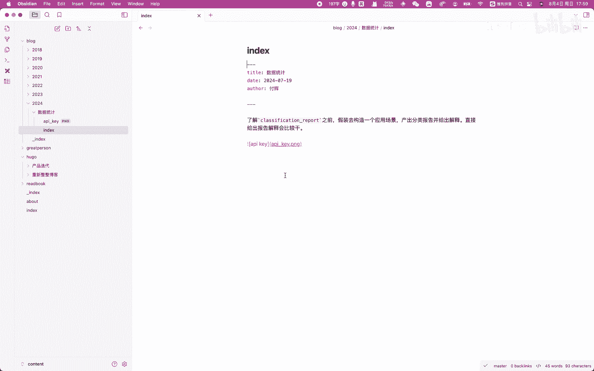

然后呢我们信仰下来，我没有办法了。

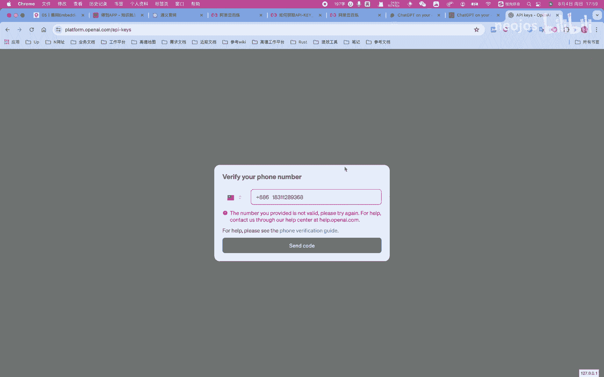

那我们只能用国内的了对吧，我们关掉它，关掉它，关掉它，那我就直接用阿里的这一个同意亲位大模型，阿里的话，我这边其实也也打开了，然后呢跳转到一个他的一个后台啊，再跳转到这里，说实话。

我觉得这一个这个把所有的这个啊就不好，没有人家OpenAI这种方式嗯，给人的整体感比较割裂，创建我的PIK嗯。

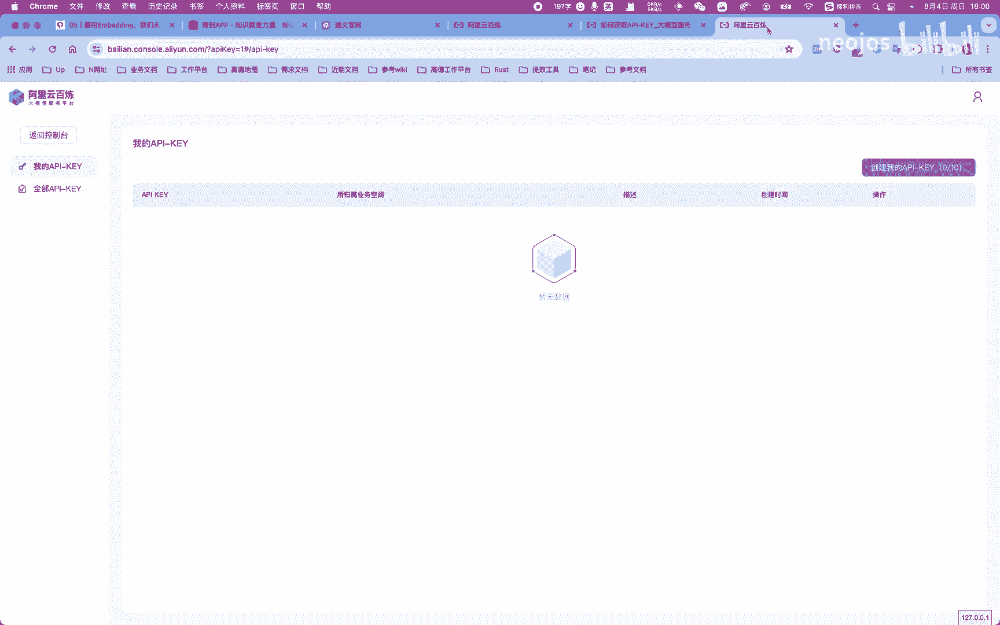

默认业务空间，然后描述一下，就是一个嗯使用使用embedding e MB，E d d i n g，使用embedding API接口，然后呢对数据进行分类，并嗯定了什么呢。

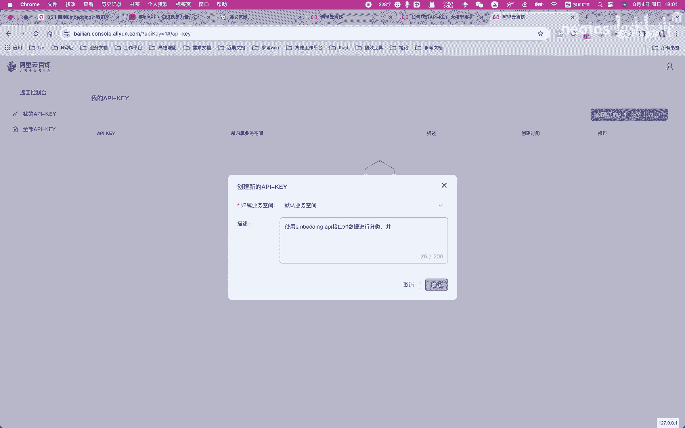

定，并学习一点机器学习小知识，并学习一点机器学习小知识。

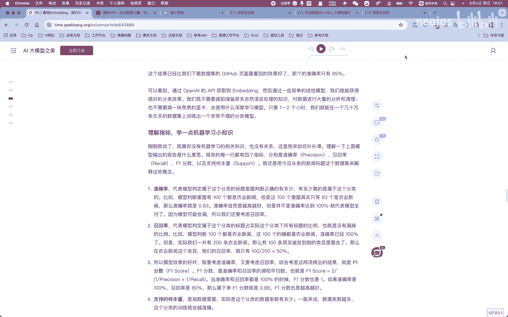

小知识小知识嗯，确定好。

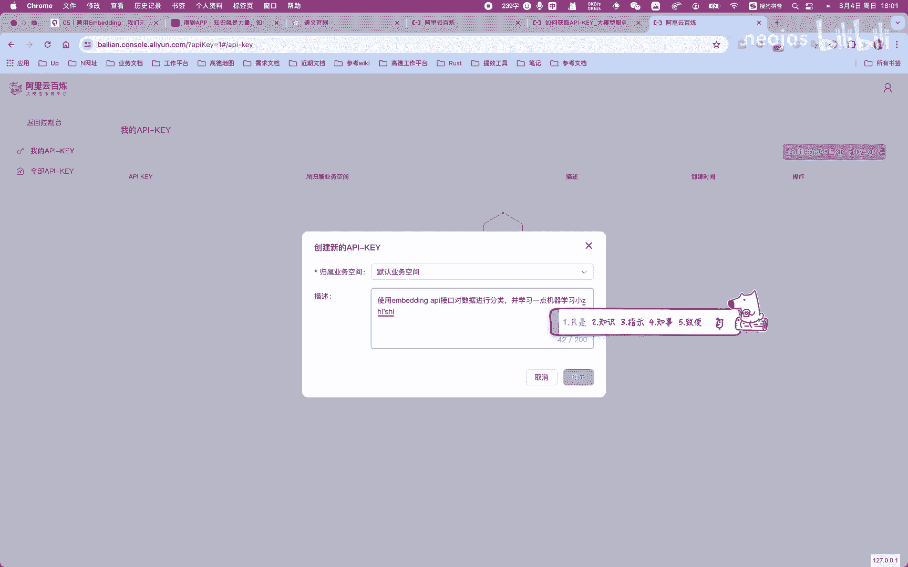

这边我们已经分享到了一个by key了，那好啦，准备工作已经只要仔细看一下怎么写代码吧，embedding的话，它本身就是获取一个向量了，利用我被获取一个向量，那我们现在首先我要模拟一个场景对吧。

模拟一个场景，模拟一个什么场景呢，模拟一个对数据进行分类，对数据进行分类，那我们的数据呢，我们的数据呢就选择啊size条数据吧，size条嗯，双色球双色球数据对吧，然后呢嗯牵强还是特别牵强嗯。

然后呢我们在其中放入嗯，放入十条，十条中奖中一等奖的数据对吧，然后呢将这个数据集分成两类，一类是中奖的数据集，一类是嗯不中奖数据集对吧，不中奖的数据集，那这个的话就这个例子就比较牵强了对吧。

这个例子比较嗯就是完全牵强，但也不需要过分纠结对吧，重要的是熟悉流程好，这是我们的草稿啊啊对应的话，其实我们可以把这个服务器起来嗯，起的话前面我也讲过了。

就是一个我这边已经有一个workflow block server，对吧起，然后呢我们这边还跳转到chrome，然后呢我们这边local host1313，嗯然后这边就是这个技术啊。

这个违章就是数据统计啊，可以看到啊，就是对数运用分类嗯，这是我们的背景，然后呢有了这个东西之后，我们就来看这个怎么调了对吧，怎么调的话，首先的话我们其实需要的是一个Python环境嗯。

Python环境来两个PYTHO，Python的一个环境，那Python环境的话，正常来说其实我们都应该是支持的啊，嗯P看一下我们的这个本地mac3。7，应该都是支持的，3。9。18对吧。

那我们来运行一下print，Hello，哎正常执行了好，我们退出一下代码哟，嗯这个怎么退出呢，不是CTRLD吗，哦是CTRLD，我们可以看一下我们本地的Python，是这样的一个版本。

那这样一个版本其实嗯也还行啦。

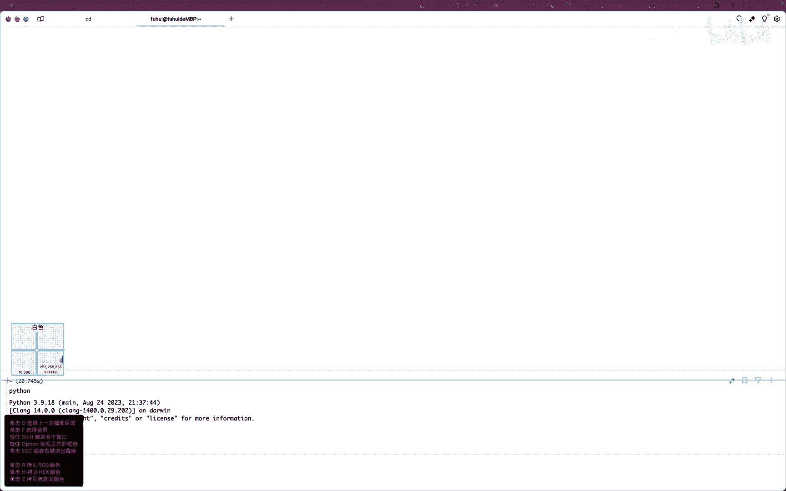

能用就行，保持800的间距吧，然后往下拽一拽行嗯，再往上转一转吧，不然这个费隔符会比较难看，好。

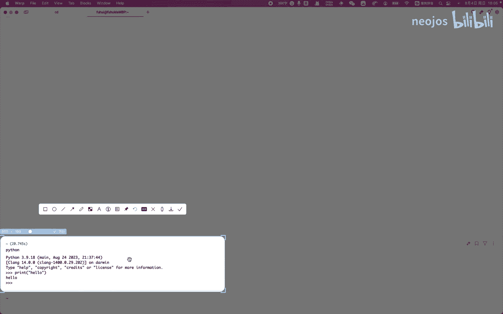

我们把这个放到这个OBSETTING下，但是这个的话其实可以看到这个这一块，也是我后面准备优化的，就是首先他这个名字，我其实不想让他做叫这样的名字，因为这个名字有空格，另外的话。

其次就是嗯它是一个block的形式来插入的，它它正常的话它不是图片对吧，所以这其实是我们需要，我们最好是能把它做成一个，不然你看我每次都需要干什么，我们每次需要把这个名字改一下，名字叫Python对吧。

然后呢Python然后呢我切到index，还需要把这个这个改成一个图片的形式，其实就其实是比较累的啊，其实而且是无效的，这样的操作非常的让人不是很舒服，可以看到啊，就是这样的一个效果啊。

好好回到我们的正题嗯，我们其实就是要看一下这个方法，这个看一下这个怎么读啊，哎回来，啊给我搞一下classification classification，然后呢我们这边回到代码。

那么我们这边首先引入这些包对吧，引入这些包，然后from OpenAI，那这些其实我们已经没有办法引了，我们现在用的是这个用的是这个嗯，用的是这一个叫什么啊，同意亲位对吧。

那么我们就需要开同意亲位的一个解释了，同意亲位嗯，登录中心，下一步配置KEPPK模型，中心模型，广场模型，训练模型部署，这好像都不是我们想要的，然后OpenAI接口金融，这个也不是我们想要的。

然后chat GB t API概览嗯，加维建，这也不是的，我们就想要个embedding接口对吧，embedding接口，然后呢API目录数据中心嗯，这是浊眼哎呦，难道难道他这个旧版旧版有吗。

Api key crate token，Delete dog listen，哎不会没有吧，来我们查找一下吧，Ebee m b e d d i yeah，有有有embedding，Embedding。

Embedding，不要embedding，通过违背向量计算的一个计量计费，embedding输入内容向量号啊，就是这一个看一下啊，然后呢可以看到它其实是有一个应用操作API。

Embedding dog，违背向量化，输入向量化，违背切片及向量化，哎我们来看一下这三个的一个区分啊，违背向量化，Embedding dog，违背向量化，来重新看一下这个接口，然后这是个post接口。

这样的一个这样的一个app group indeity，嗯首先我们遇到了一个这样的一个参数啊，我们需要看一下a p group inde，表示应用的名称也需要创建一个应用。

然后呢这是query contact，这是query the model，然后呢嗯好像就很简单啊，然后想问题，这就是我们要的这个向量化后的向量回本，那问题是我们的APIK如何放进去呢，嗯APIK没有啊。

APIK没有，那我们也行，我们看这个表示英文名，主要对对，以上UL省略了head host，Model string，可选模型选猜猜数，这是一个猜数，以上又要省略了请求header及编码等因素。

以上又要省略了host，对我们的host也没有，然后呢，好这个我们需要现在了解一下这个host怎么try，这块好像找不到结果了，我们还是来这吧啊，这是我的，我先不开，这个，让我们返回控制台。

有哪些模型应用广场舞的应用，然后数据处理，然后数据处理，数据应用模型，数据权限管理模型，体验好像并没有交代，我们的API应该是怎么传输哦，那么我们现在只能现在现在的话，我们首先要为了让我没得这个代码。

输入内容违背向量化，输入内容向量化哦，我们需要把那个APIKE给放进去，服务接d end point啊，这边有啊，开放服务的地址其实有两个例子，一个是公网的，一个是新加坡的。

那我们找到了这个IDK404例pythy client，搜索demo结构化为挡，demo向量还维维向量化，还好我们看一下配置环境变量，阿里巴巴cloud xk id和这两个KD阿里云账号。

4K访问所有API的访问权限，of china s k和xx secret，然后呢，这里使用IM，这个应该是整个的阿里这个环境变量，在阿里服务器上去执行的，执行以下命令，启动skid。

代表你的IM用户的set id，这个其实咱们不需要，不需要啊，然后这是Python的代码，它需要我们在机器上去把这个搞一下，然后看一下啊，用户识别从环境变量中读取excess。

skid和x secret，运行前必须新配置环境变量，参考文档，环境变量过程，The old type i like key secret config，哎他提供了一个SDK啊。

但其实我现在不想用SDK，我就想先用一个API直接就访问了，但是呢，他给我们提供了这样的一个这样的一个超重，这让我觉得很难受，怎么办呢，K secret access kd，还是回到这个结果。

看一下我的APIK刷新一下，默认空间业务空间查看，发现没啥用啊，删除吧，哎我先把这个复制下，删掉了，然后呢，追加四件产品维等，获取APIKE安装SDK，说明我感觉应该就是这两步了。

获取一片安装DK已I能PTHON3。8以上，阿里云板电，这怎么又变成板电了，不是同1000位吗，我对这一个简直无语了，然后java的前提，IM账号进行发售和授权，如何使用业务空间。

登陆账号阿里云百年账户，鼠标悬浮上账号管理，促账户管理，业务空间管理，然后呢新增一个业务空间，创建完成业务空间，获取业务空间id，业务空间id workspace。

业务空间id在使用APIDK调用百炼平复，如果你需要自由侠志愿，可以自定握开进行返回，在电话APIDK时请传入对应的空间，绑定的APIK，就是它需它这个APIK的话是对应一个业务空间。

然后呢我们来业务空间管理，待机上面的业务空间管理，可以在word中找到业务空间id，好编辑，右上角可以查看WORKID后，agent k授权子业务空间模型调用和部署。

home可以在另一个模型广场添加我们，我们可以调用的模型是吧，然后在模型中授权，然后呢控制它会跳转模型，将授权窗台窗，你在左侧定义也需要授权的业务弹框，并点击这个已授权的空间，点击确认。

然后呢授权模型部署业务模型，然后台框部署授权授权，又来一个XIT哎呀，这真是真是太累了啊，太太繁琐了，在获取IMSK的前提，新登录IM返回控制，这简直不是给谁用的，由于FCSK和M用户绑定。

你需要在已有的IM用户下创建SK，如果还没有被创建MK，并启用open av i调用方式方式，哎呦，科夫在尼克房SK管理页获取阿里云SK，并妥善保管阿里SK因为西药带来不必要损失，I p id。

看看背景，阿里云就做了不太好呀，我感觉，感觉做的嗯不太给力，LPIAPI太搞了，回到刚刚这个接口啊，会被向量的demo，这是排水答案，A p p t secret all type。

这个token configure，I m search，嘶哎有一个疑问啊，他这个没有指定那一个我调的哪个模型啊，我掉的是哪个模型，我也不知道啊，他可能是对应的这个。

SK和这个已经对应了一个具体的模型了，定了一个具体的模型了，但我感觉整这么一套哦，嗯但没办法找吧，继续吧吧，既然想用人家免费的，那就得继续啊，想让人家免费的，那咱们就得继续呀，我们来回到刚刚的这些步骤。

一步一步来获取app ke不对，刚刚的从哪来着，阿里百炼，们一步一步来啊，没那么复杂，这个是什，同意亲位通过API使用，同意亲位开证，你需要配the base，要按吗，你可以通过以下命令安装AICK。

通过open Python DK调用，通过OpenAI金融的GDP调用，诶这个就是我想要的，如果你需要通过OpenAI金融来app调用，需要配置完整的end point，带四。

我配置完整的appoint app怎么怎么存呀啊，客请求好boss，好这个可能就是我们要的，Can，对吧，这可能就是我们要要的，嗯搞起来，但是我们现在又遇到一个问题啊，我们调哪个模型呢，天哪，我都晕了。

我都晕晕了呀，嗯只需啊，第一步我们要找一个，回到刚刚听，按着家的要求，把这个都该配的都配一下，但是我找不到我刚刚是怎么进去的，会让人难过呀，只能，只能再来一遍啦，获取APK是这样吗。

嗯好像不是模型中心呢，应用中心也不是快速开发，好像是这，你可以通过阅读，测试体验不是这创建应用，嗯呐不是这不是这这么，哦好像是这对吧，Candon t distate scrap。

你需要开通DISCP才可以控制模型服务，零基，模型服务零机，这是什么东西，末端server maas领域，围绕AI通过API推理模型微调等等多种服务，伊列格林安利AI太守之旅。

模型服务零基建立在模型服务理念的基础上，回到AI模型，哎呦不好意思啊，就是蒙的。

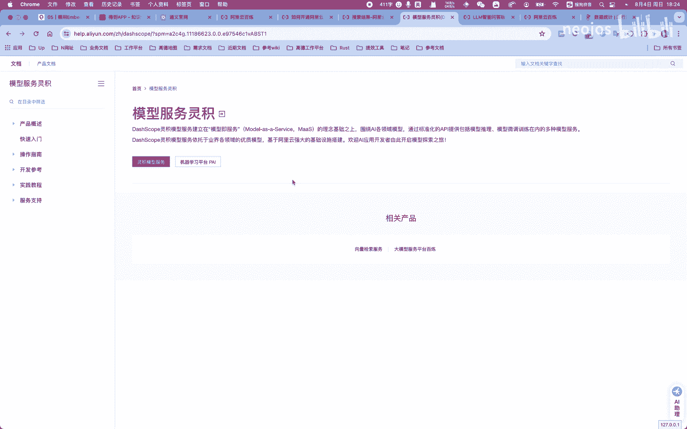