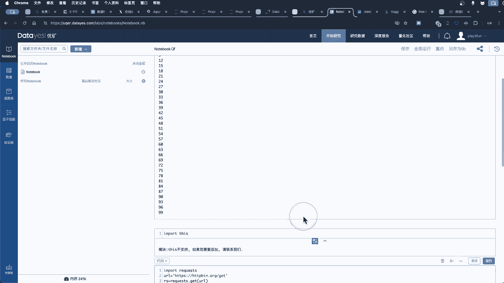
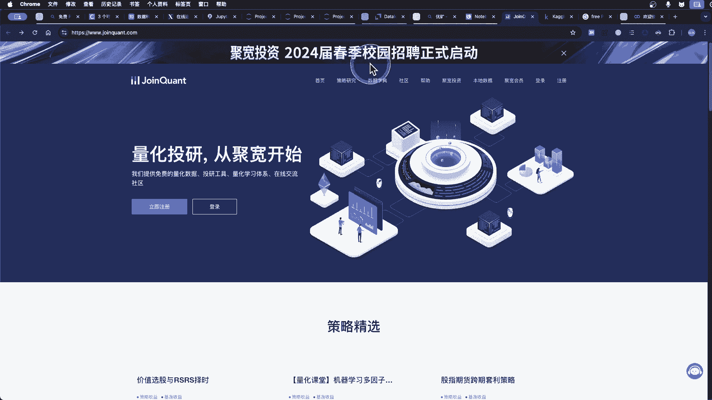
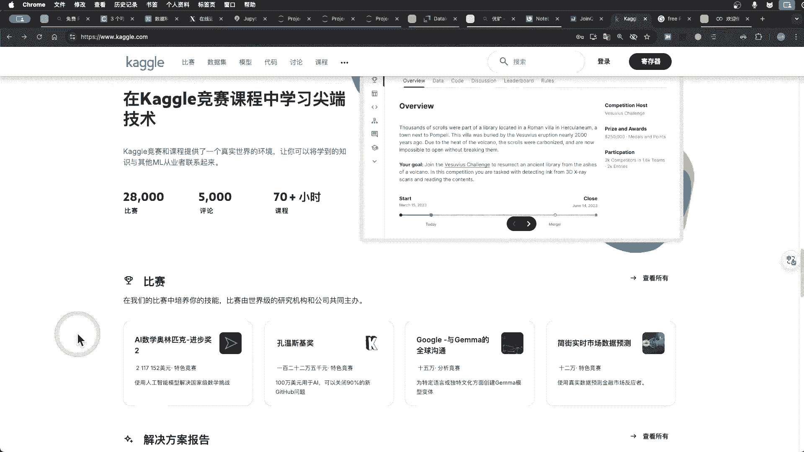
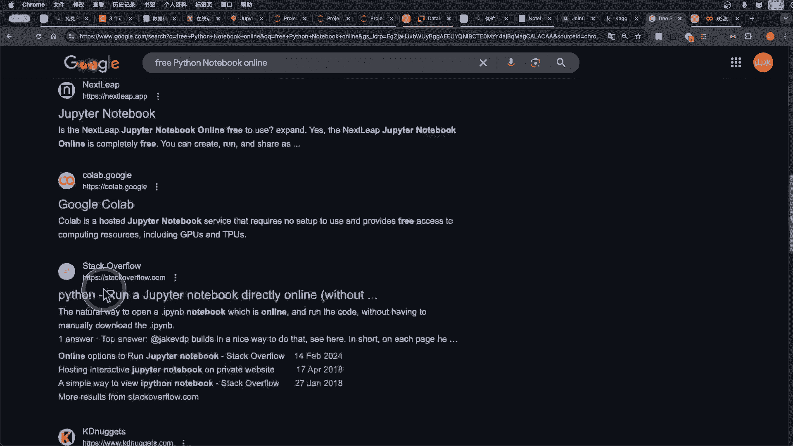
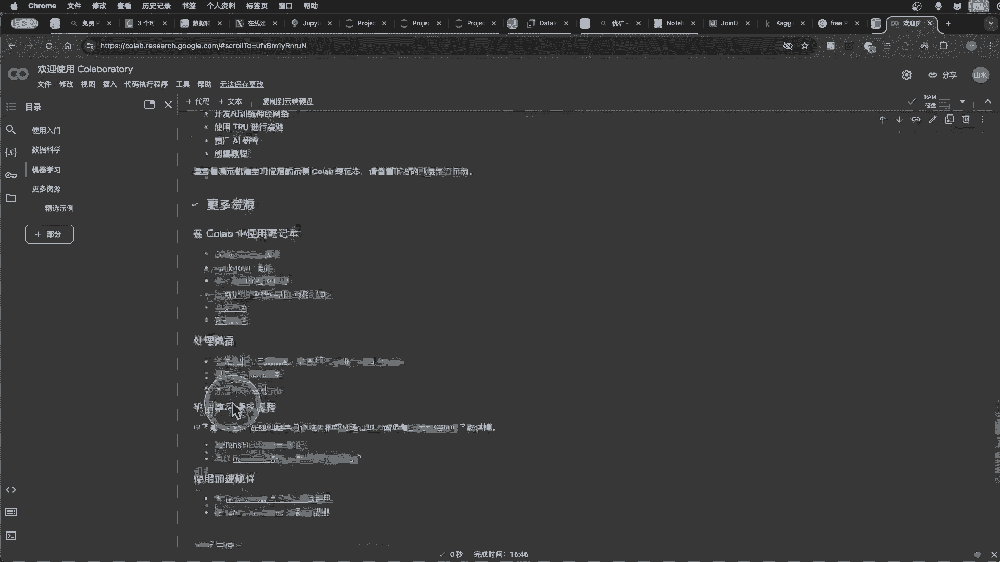
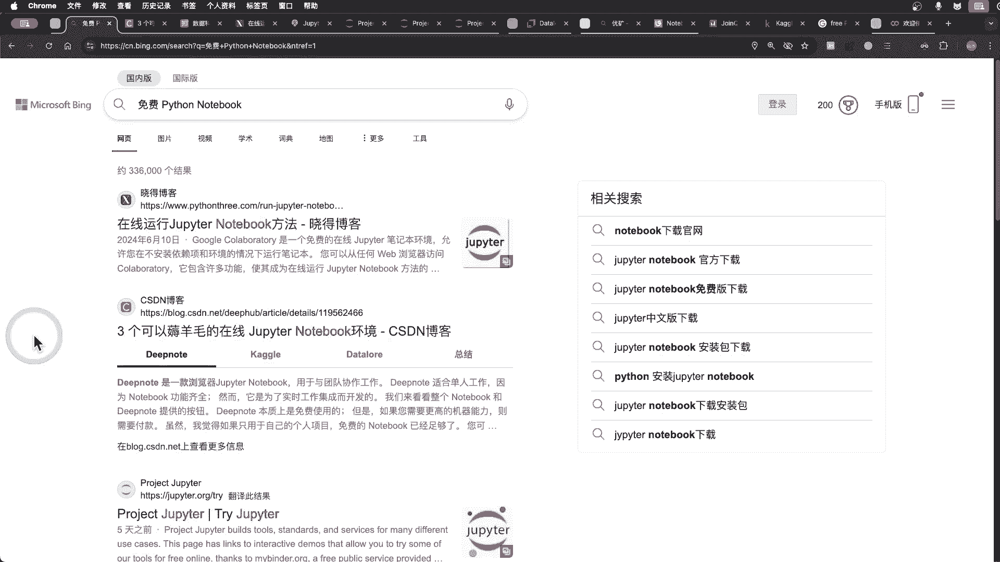

# 免费 Python Notebook在线运行，不需要自己搭建Python开发环境。Kaggle机器学习 google的colab JupyterLite - P1 - 程序员分享人生 - BV1sUkXYuE1M

大家好，再来看一下怎样拿到这个免费Python的book，免费在线运行，可以去薅羊毛，就不用自己去搭建Python环境，Python nowork是一个很好的一探讨，一个分析数据的一个东西。

一个工具就用它的话可以啊，很很好的一个更快地去学习Python，更快的去分析数据，我们来看一下有哪些啊，网站提供免费的Python nove啊，环境我们来看一下，这是第一个叫DNOTE。

DNOTE适合单人工作，功能齐全，学习工作集成，免费试用需要更高，双料二需要付费，然后呃可视化功能比较强，比较厉害，就是这个visualize csol栏创建一个格错网，然后宽狗是一个初学者和专业专业。

数据科学家都应该关注的网站，收集数据时数学数据科学竞赛定制了笔本环境，还有每周40小时这个TPU这个什么免费使用，然后还有这这个叫data data law，自动编码，帮助注册，其实都差不多都差不多。

他这个有一个提示，就是呃代码提示，这个是很好用，然后最后一个是一个非常一个cola，cola是谷歌的一个呃网站，最好的一个安东跑线，免费试用TPU和GPU，但是就有些那种不能够访问，就是需要那个梯子。

我们来看一下其他的一个也是阿里云也可以啊，阿里云，然后我免费运行google colab，这个讲过了，还有，My binner，这个也差不多，然后是COCOCO，然后CONGODNOTE最讨论，这是。

它的一个官方的一个软件，可以这个去尝试，简单运行啊，没问题，如果是要繁重的话，是个不可能，因为他是使用了vs assembled，我们来看一下，打开这个啊，就是JUPOR啊，免费试用。

免费试用就是这里后，就是我们可以就是import import this，就把那个，这模块没有执行出来，刷新一下，然后刚才的一个是叫entitle NO，要先执行一下，啊这个就出来这个是爱粉自残。

然后这里的话就是就是那个request模块，让他返回这个JSON，然后啊这个IPIP地址可以去那种更换一个网页，那这个IP地址，这个是在这里学习Python是一个很好的一个东西，很好办法。

那个我们可以去复制一个代码，或者是那个呃优酷打印打印这个代码，添加一个打印代码，那这就出来了，就是在这里学习Python知识是一个很好的东西，然后还有其他一个，这个是juice的一个官网一个试用。

它支持很多言，谢谢家还JULIA，还有啊这个是图计算的，像阿源罗比，尝试尝试这个讲过了，然后这个是在brain的一个啊软件，我们可以也可以啊，使用那个量化交易，它的一个啊网站进行一个学习。

学习Python执行noble，就是这个用空新建一个NO破所有NP，然后nob的话这个一样可以打印出来，不过他有些模块的话就是不支持，然后像request话，request模块也不支持。

因为他那个没不能跟我啊，连接肯定要选择ball，那这个是拒绝连接，不能够请求外网。

然后还有其他一些那种啊，距宽距宽投机，这个是油矿，这是距宽，是另外一个网站。

然后这个是那个宽口，宽口就是继续学习，继续学习的一个资源，很多那个什么4。5K的，一个高质量的公共数据集，阿里价格视频游戏销售，No bot，我是成本模型训练训练，竞赛有很多东西。

然后这个是谷歌的一个免费iphone note在线，然后也是用啊jp play，Data law，Data law，Uh jupital，Uh coo coco，要谷歌的一个谷歌COLABCOLLAB。

这里有没step啊，还有很多吧。

然后这个是呃谷歌官方的，谷歌官方的一个COLLA还什么，今年现在时间16。45分，就你API，他这里就讲到的是什么，是COLLABCOLLAPLY，简称，在浏览器中编写和执行判断代码，50要有配置。

免费使用GPU轻松共享，然后这是数据库写这个代码，他展示一个图片，然后我们就是在这里的话啊，Import this，哎他就没有GC吗，然后就跟刚才一样执行，然后打印这个呃代码，我们可以就是更换这个网址。

按照机型，打印出来，和机器学习，还很多。

今天就主要讲怎样去获取免费的Python啊，NO book免费在线运行，就不需要自己去部署安装这个Python环境，Python noble话是一个很好的cp Python的一个工具。

