# 免费量化开源数据源 akshare - P1 - 老湾python量化交易 - BV1tZ42147ij

各位同学大家好，我是Python量化交易的老湾，各位同学，在学习或者是实践Python量化交易的过程之中呢，肯定是需要底层的数据支持，这些底层数据包括但不限于K线数据，筹码面数据，财务面的数据。

宏观数据或者是微观的数据。

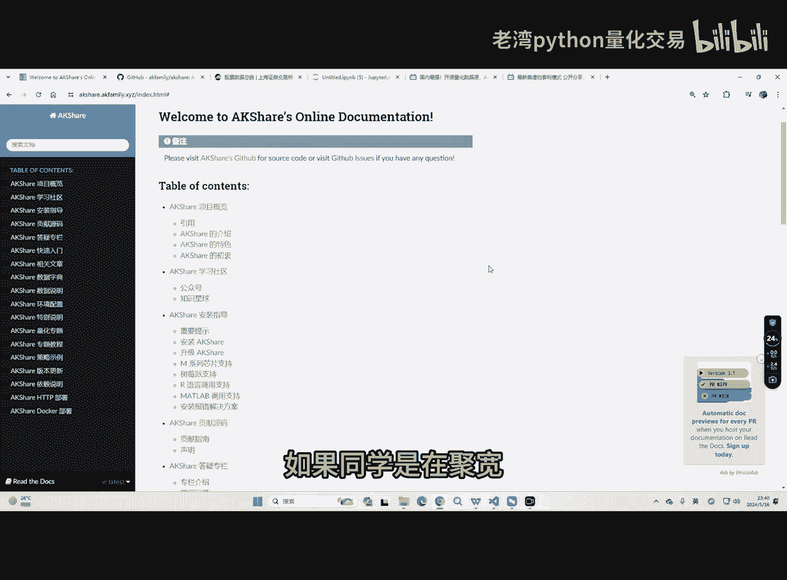

是可以提供巨宽的数据给同学，但是同学如果是在家里或者是工作，职场或者是学校里面学习Python量化交易的时候。

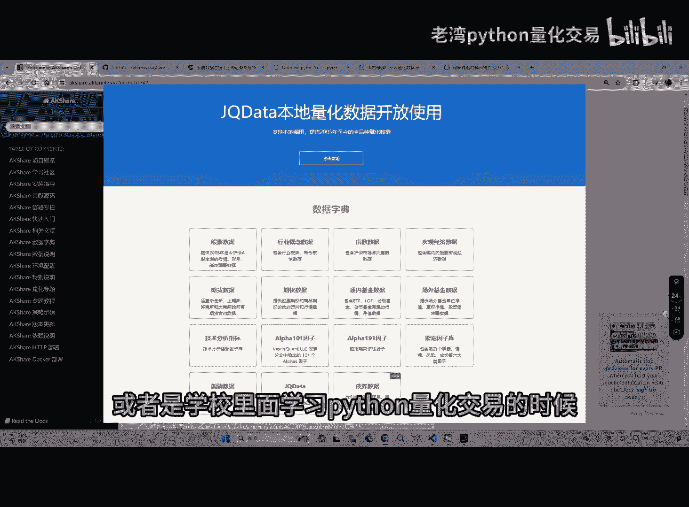

如何取得这些数据呢，今天要介绍同学一个非常好用的3M包，这是ak shell，那ak share呢它的数据源是非常广泛的，我们先看一下他的数据字典，它的数据源呢包括了上海证券交易所，深圳证券交易所。

还有新浪雪球网页上面能够取得的个数据源，它都能够帮你爬虫，我们先看一下其中一个数据源，上海证券交易所的统计数据，这是市场宏观数据，我们先看一下它的目标网址，它的目标地址也就是它爬虫的位置。

复制粘贴到网页上面来看，它要爬取的是市场的宏观数据，这是上海证券交易所的数据，那如何使用呢，我们看一下它的代码，他的代码范例呢就有帮同学示范一下，如何取得这个数据。

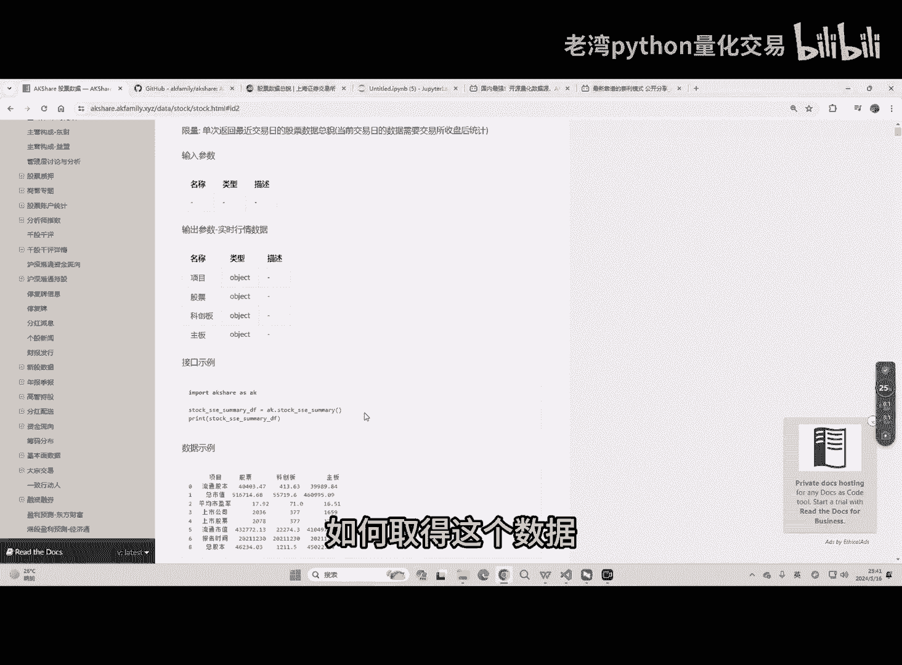

他们的范例呢是帮同学快速的认识，这个数据是怎么使用的。

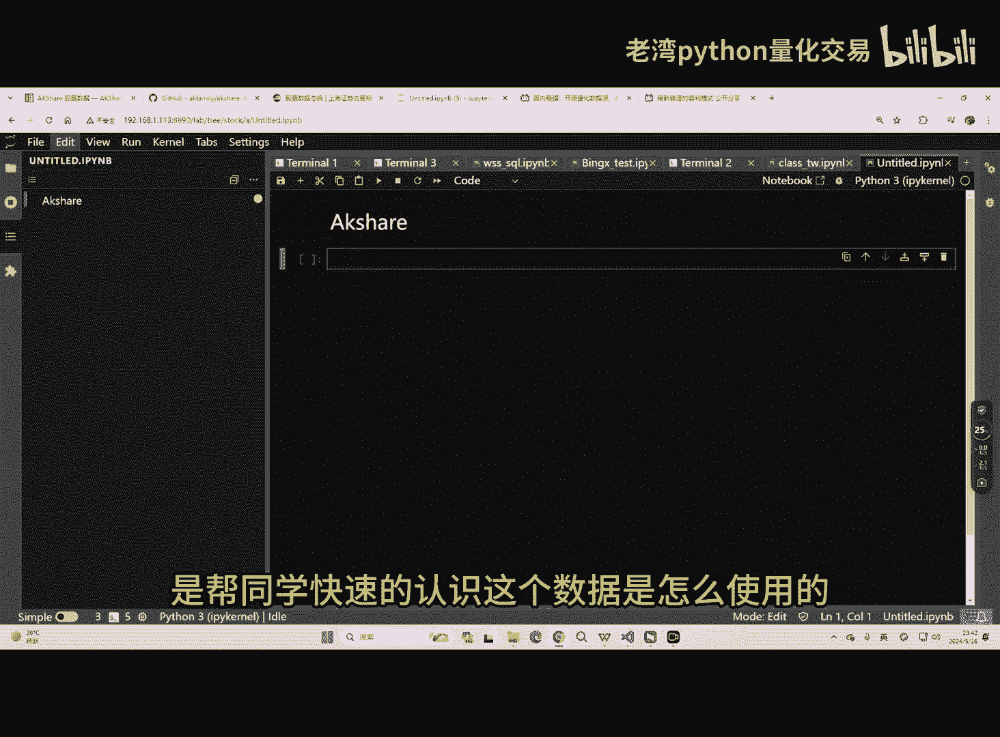

我们把数据打印出来，看看它是不是跟原始的数据是一样的，例如说呢那今天收完盘，5月16号这天收完盘之后的总市值呢，整个上海证券交易所的总市值呢是48万，5399亿。

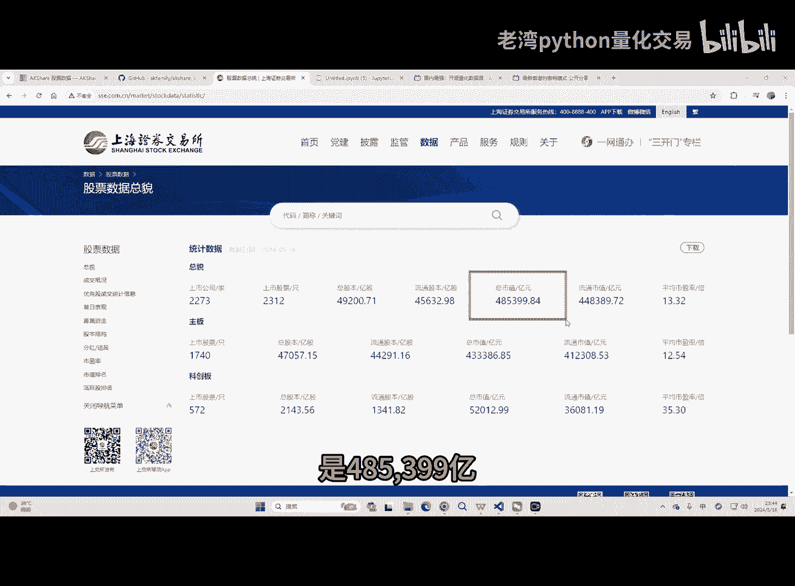

我们这边可以看到爬虫回来的数据呢，也是跟原始的数据是一样的，所以AK选它底层就是帮你爬虫的一个工具包。

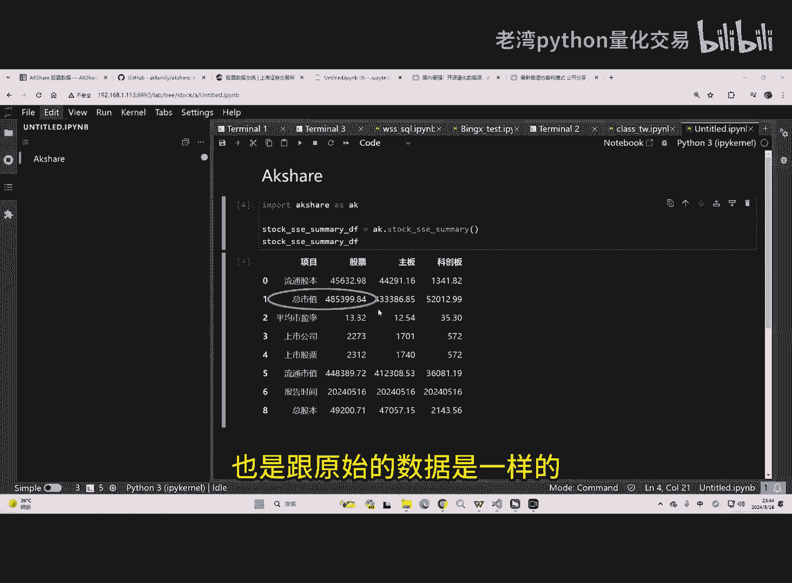

它的数据还是挺广泛的，我们看一下那个原始的数据源，他的数据包括了欢围观数据，他的气象是分分的，非常细，而且是帮你整理过的数据源，同学可以根据自己的需求，他帮你做了各项数据的分类，包括了股票数据。

期货数据，债券期权，外汇数据，公募私募，还有波动率，这些数据呢都是网页上公开的数据，它帮你爬虫爬回来的，在GIHUB上面的公开开源代码，我们点击一下里面的ak shell的代码，那随便点一个吧。

例如说我先看到的是currency，我们这边可以看到它底层的数据，就是爬虫的代码，它帮你爬取网页上的数据，因为网页上的数据呢是常常会更动的，因为只要更改了网页的配置，这些爬虫就会失效。

但是a k a share呢它是持续性的更新，这些爬虫代码，这边看到的是两个礼拜前更新的代码，上面的更新频率是挺高的，因为有时候对方的数据源位置调整了，网页更新了，或者是数据呢新增了或者是删减。

都会影响这个代码的正确运行，有发现其他的问题要跟作者反馈的话，在GIHUB上面呢，你反馈问题，他回应的速度还是挺快的，有些数据的上的需求或者是哪些接口不正确，都会尽快的回复你，或者修正他的爬虫代码。

里面有几个我特别喜欢的策略示范，那策略示范呢以BETRADER当做一个范例，去运行策略的回测，同学如果有在做量化交易或者是回撤的话。

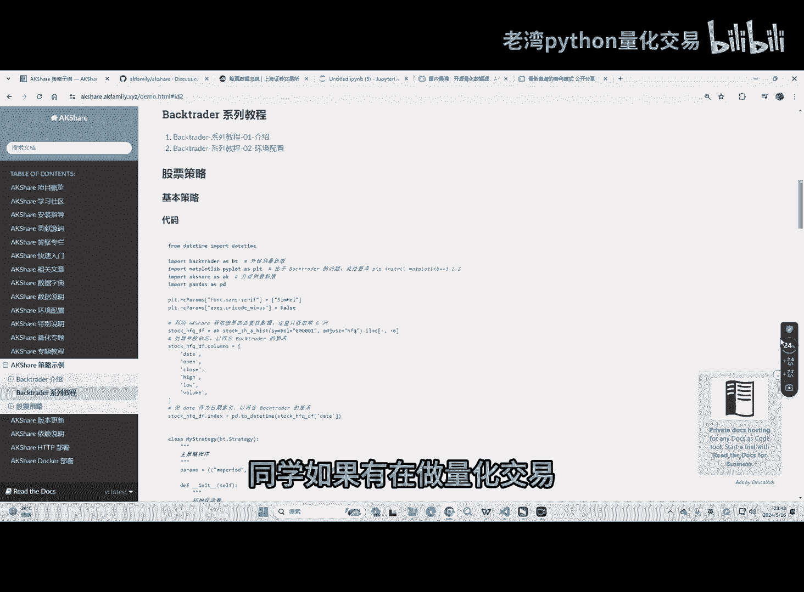

目前在聚宽掘金PHQNT上面，这些代码是zipping的回测框架。

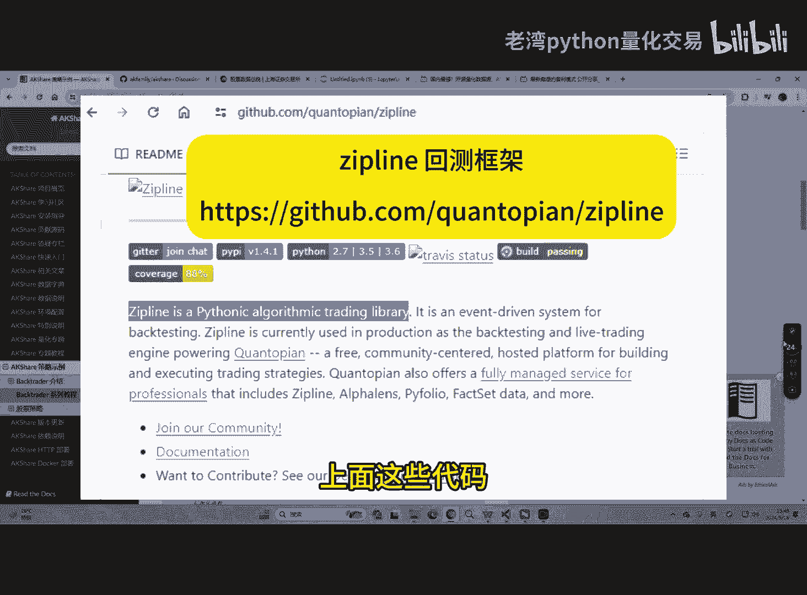

另外一个比较大家常用的是VETRADER，这个回测框架。

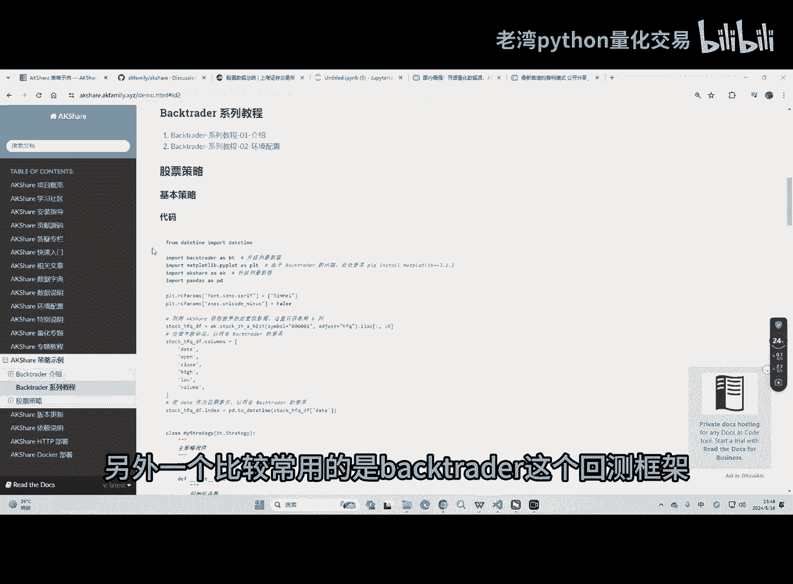

上面是用VETOR这个回测框架呢，示范了如何取得AK72的数据。

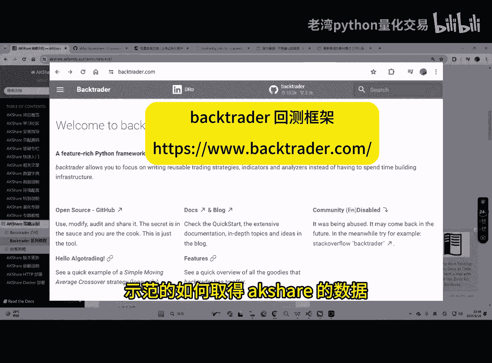

再去运行一套完整的策略，所以呢同学可以在自己的电脑上面，把这些代码复制粘贴回来，不仅一方面可以取得数据，二方面呢是可以运行回测的，上面的回撤还跑的挺完整的，还有图形的示范，这边呢帮同学做几个总结了。

ak share有优点，当然也有缺点，是他的数据源是非常广泛的，宏观微观，还有各个交易品种，它的数据源呢返回的是data frame。

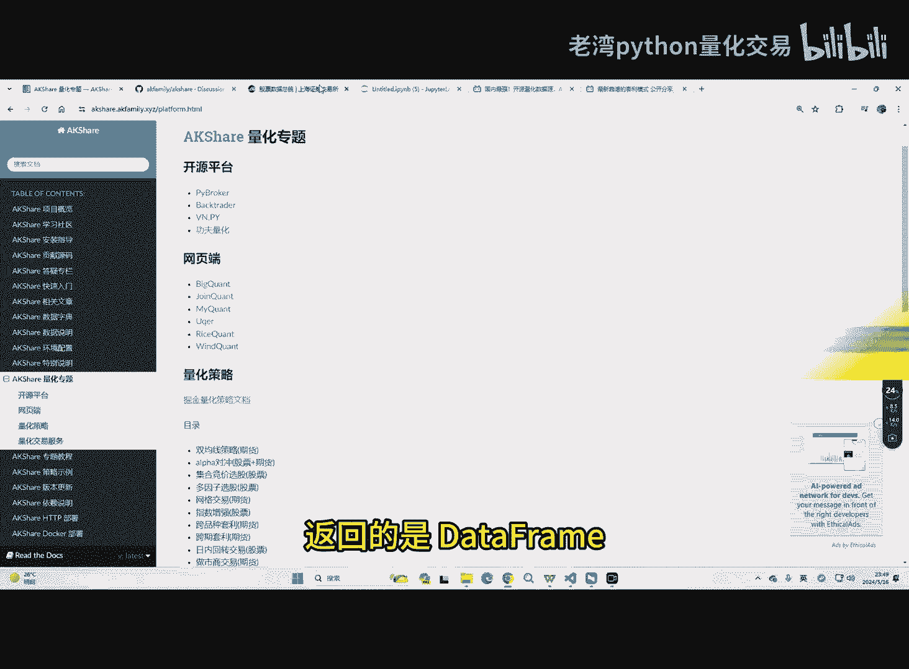

因为同学在做后续的量化交易回测，或者是计算的时候，或者做研究的时候呢，数据框data frame是最方便的格式，它帮你把网页的数据格式。

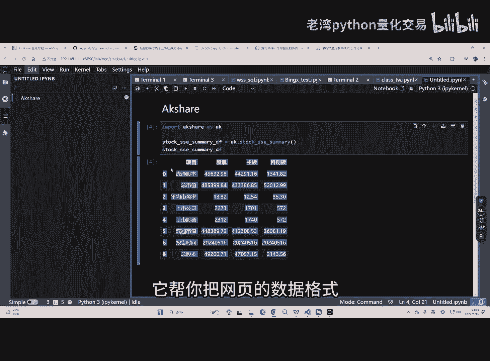

转换成data frame的数据格式，ak share的也有它的缺点，因为我们刚刚提过了ak share，它其实是不保存数据的，它是帮你爬虫的，所以它只适合研究要大批量的爬虫。

这些网站绝大部分都会有反爬虫设置的，如果你爬的太多啊，或者是爬的间隔太短，会遇到反爬虫，所以这并不适合做实盘的交易，盘中要一直爬虫的话，AKHL可能会报错或者被被封掉，那另外呢也可能出现数据口径不一致。

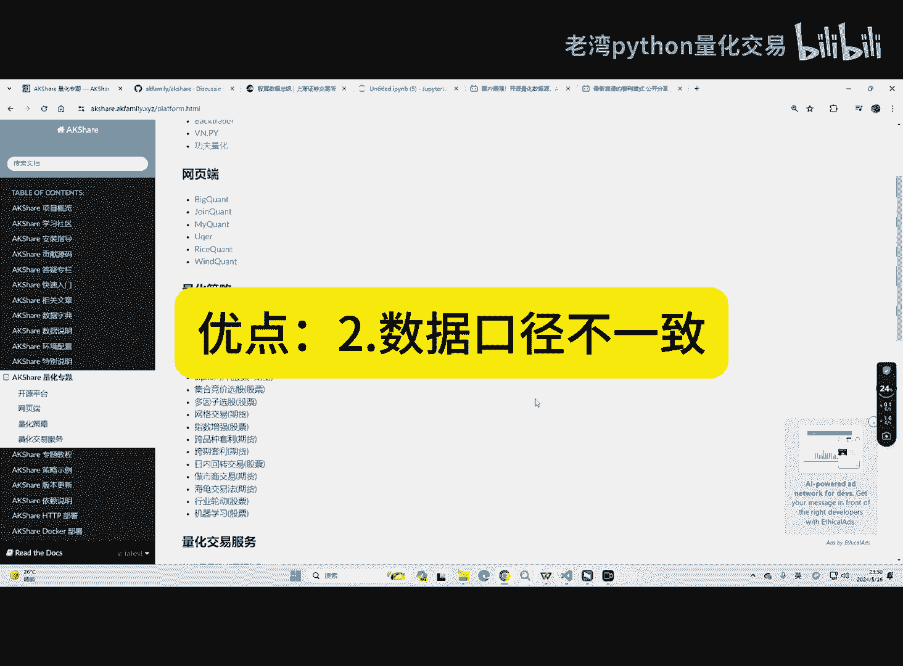

比如说有些股票是使用叉SHG，这是一个ISO的股票代码，这是上海证券交易所。

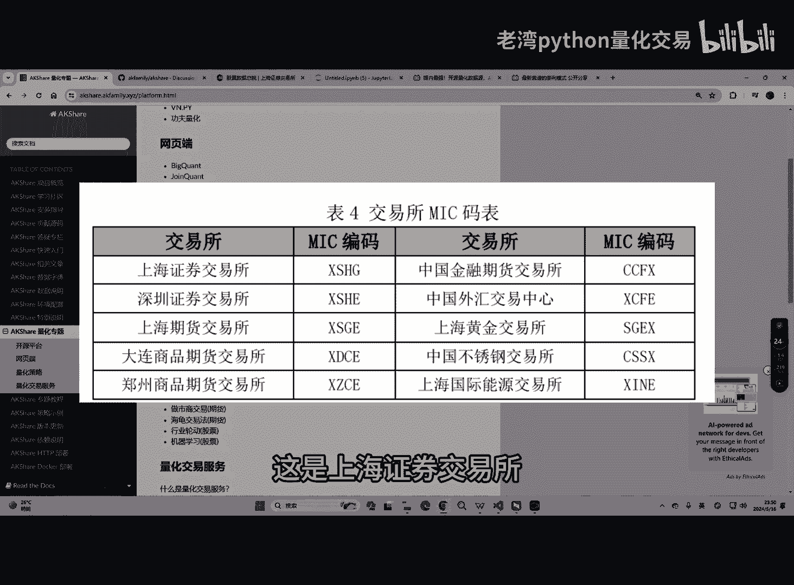

但是有接口呢是使用点SH，所以同学在使用的时候多小心，那同学在学习Python量化过程之中呢，知道如何去处理这些数据，如何进行数据的回撤，这才是最重要的，今天的分享就到这边。

我们下一期会继续介绍其他网络上免费的，或者是开源的数据源。

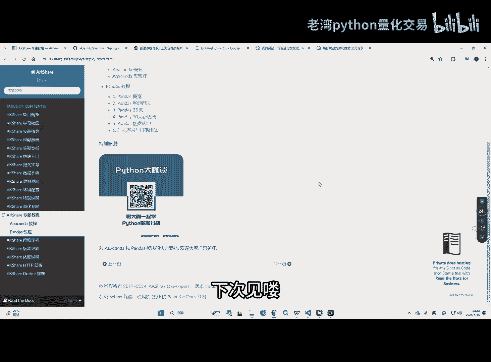