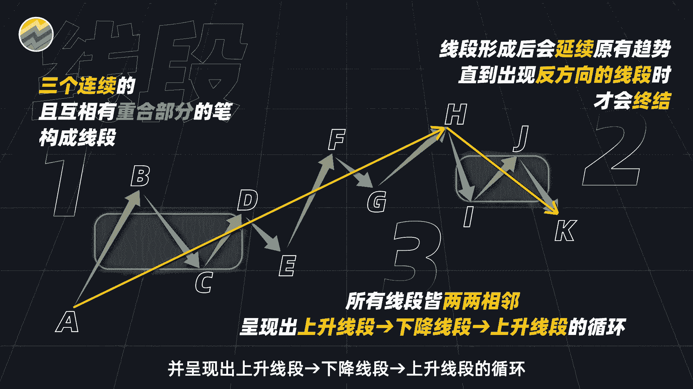
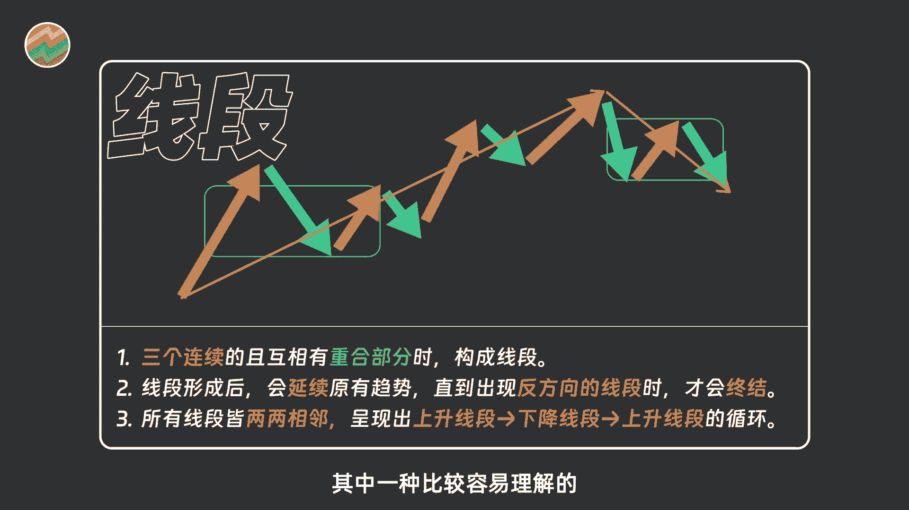
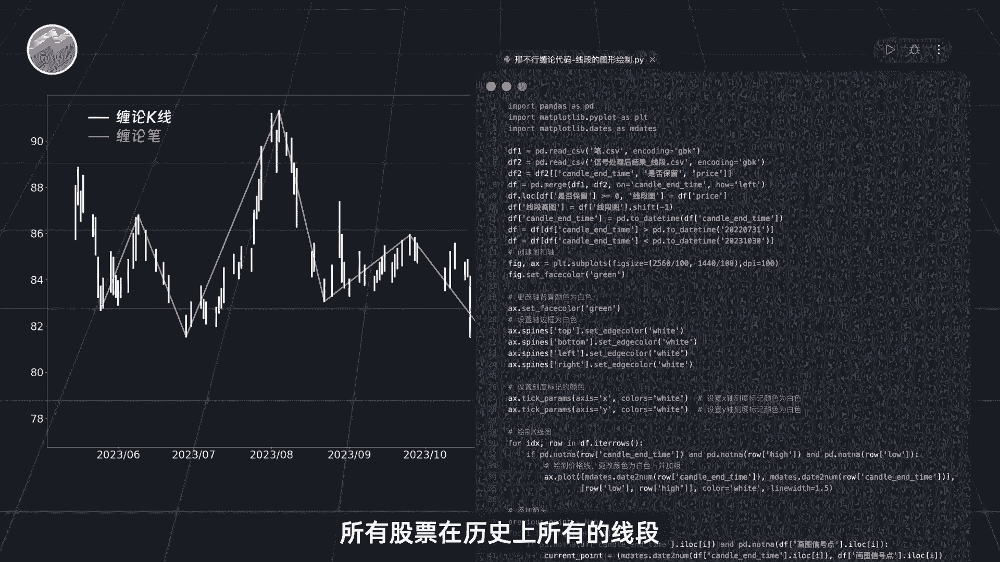
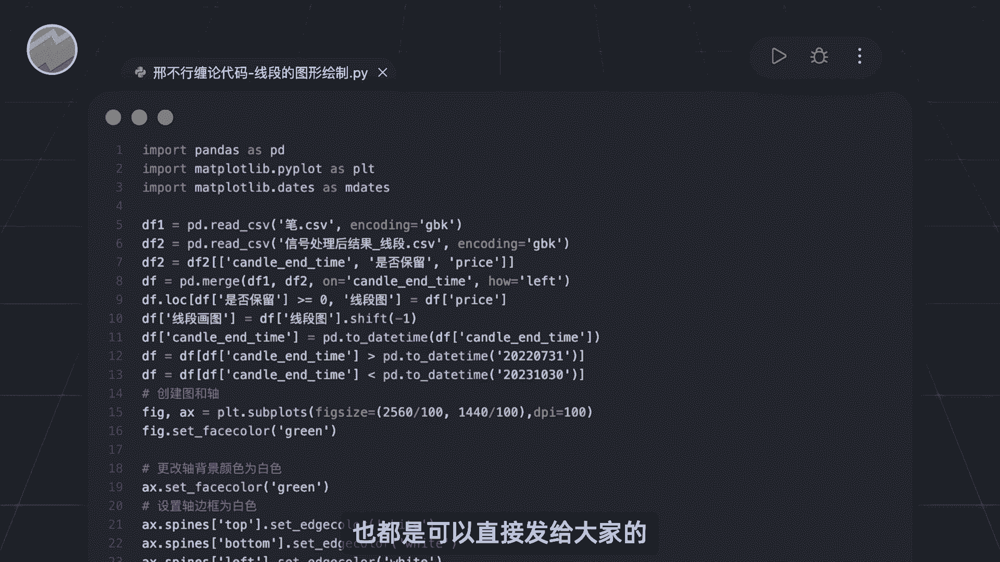
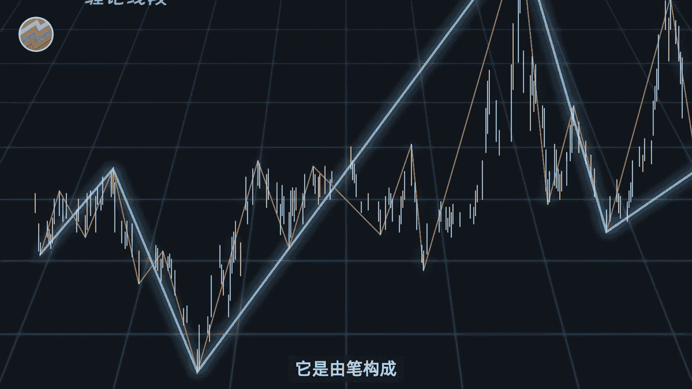
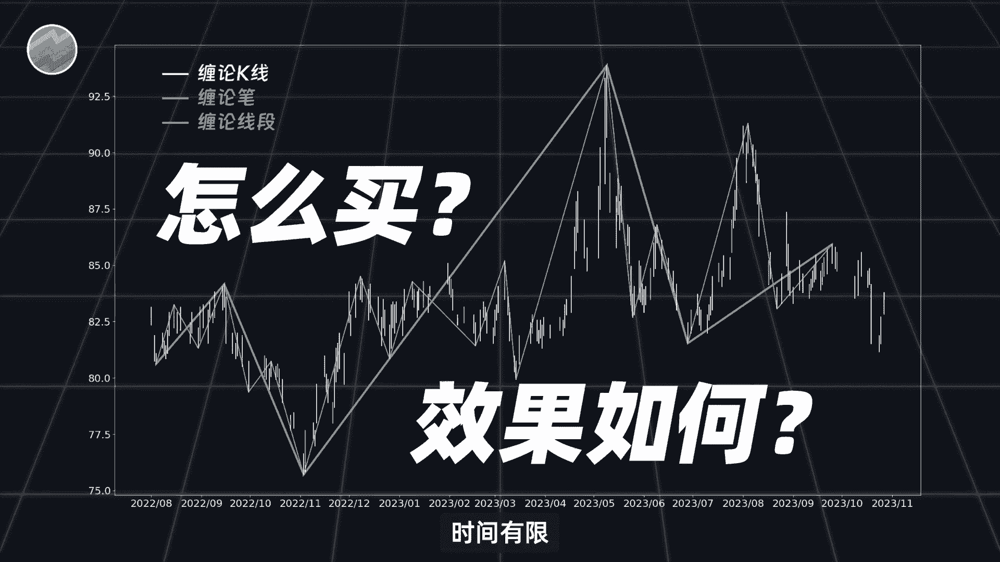
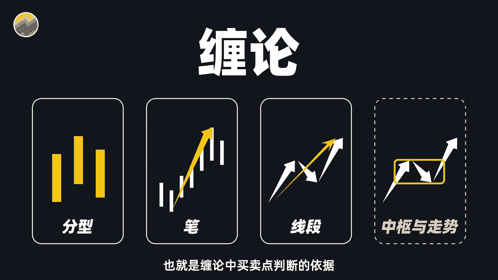

# 全网独家！用Python量化缠论，一键自动生成笔／线段 - P1 - 量化交易邢不行啊 - BV1PKDfYrEa7

大家好。

我是专注于量化投资的，行不行，关注我科学投资，不盲目，通过前面的学习呢，我们知道了笔是由顶底分型构成的，那缠论中的线段呢则是由相邻的笔构成，比如图中上升的比ab下降比BC和上升比CD。

它们互相之间有重合的部分，也就是A点要比D点低，此时我们就认为这三笔可以构成一个缠论，当用的上升线段，也就是AD，同样的向下的线段呢也是由三个相邻的，互相之间有重合的比构成。

只不过这三笔当中有两笔是下降的，比A点需要高过D点，和分型并不是都能成比一样，比也不是一定能成线段的，比如图中所示，AB和CD两笔呢就没有重合的区域，也就无法构成线段。

我们同样也给大家布置一个随堂小测试啊，巩固一下学到的关于线段的知识，请在以下几组比之中找出可以构成线段的选项，欢迎大家把答案打在公屏上，或者在评论区留言，然后呢和笔一样啊。

缠论当中的线段也同样存在延续与终结，比如在图中，我们可以发现这些笔能构成上升线段，a AD下笔上升比EF的中点F点呢高于D点，我们就可以将线段a AD向上延伸，得到全新的上升线段AF同理啊。

一直延伸得到线段AH，那线段会一直延续下去吗，又该如何结束呢，我们继续看后续的K线上升，比IJ的终点呢是J点，是比我们的H点要更低的，而随后的JK比呢又是下降，比H点啊，势必就会比K点更高。

这样的话按照缠论线段的定义呢，就会产生一个新的向下的线段HK，此时呢我们就认为上升线段AH结束了，做个简单的总结呢，就是三个连续且互相有重合部分的比构成线段，线段延续原有趋势，直到出现反方向的线段。

那就作为终结，最终所有线段两两相邻，并呈现出上升线段，下降线段，上升线段的循环。

是不是觉得有点熟悉，因为笔的构建也是类似的过程，当然我需要说明的是，像缠论中处理线段的方法也有很多种，我们这边呢只是选取了其中一种，比较容易理解的来进行讲解。

如果你有其他方法，也欢迎在评论区一起讨论，那么线段其实和笔一样啊，我们也同样可以借助Python代码，和之前处理过的笔的数据，来帮我们找到所有股票在历史上所有的线段。

具体的代码呢我也已经帮大家准备好了，只需要点击运行就可以得到想要的结果，如果你需要这个代码的话，大家可以在评去留言，也都是可以直接发给大家的。

程序运行就如图所示啊，图中的蓝色的线就是我们的线段，它是由笔构成，且一个上升线段接一个下降线段。

完全符合缠论中的定义，非常的清晰明了，相信有了这个图案，能够帮助使用缠论的你节省大量的时间，好，这次呢我们大概介绍了下，缠论中趋势的基本构成，也就是笔和线段，我们画出来的图呢越来越简单。

越来越接近缠论的买点卖点，那缠论究竟怎么买，最终的效果又是如何呢，时间有限啊。

我们就留到下一期进行讲解，届时我们会去讲解，缠论当中是如何判断买卖信号的，并且呢给大家分享，我们验证缠论中不同买卖点效果的代码，大家如果觉得这期视频对你有帮助的话。

欢迎多多点赞，点赞破5000的话呢，下一期我们就来讲缠论中对趋势的进一步应用，也就是缠论中买卖点判断的依据。

中枢与走势，也有可能这期视频相对来说比较复杂，如果感兴趣的不是很多的话呢，后续我们可能就不会再讲缠论了，那么本期视频就到此结束，我是专注量化投资的，行不行，关注我科学投资。

