# 分层不对，努力白费 - P1 - QuanTide - BV1xJezeAEjE

7年2500倍没算错，但只有少数人能赚到，大家好，这里是狂派的量化风云，上一次课，我们讲到阿尔法LTH提供了两种分层机制，按分位数或者按数值，并且提了一个问题，为什么阿尔法LX要提供两种分层机制。

难道有了按分位数的分层机制还不够吗，今天我们就来看一个实际的例子，通过分析你就会明白，为何我们要使用两种分层机制，为什么弄懂分层机制如此重要。

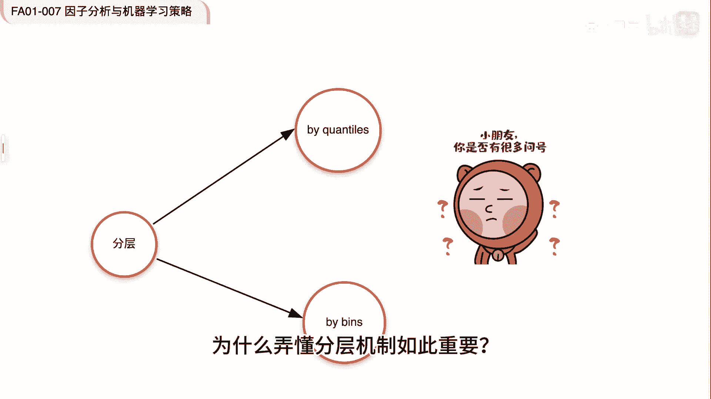

那我今天还会用一个例子，让你认识到，我们是如何将一个策略，从年化7年收益1。6倍，优化到2500倍收益的原因就是做对了分成。

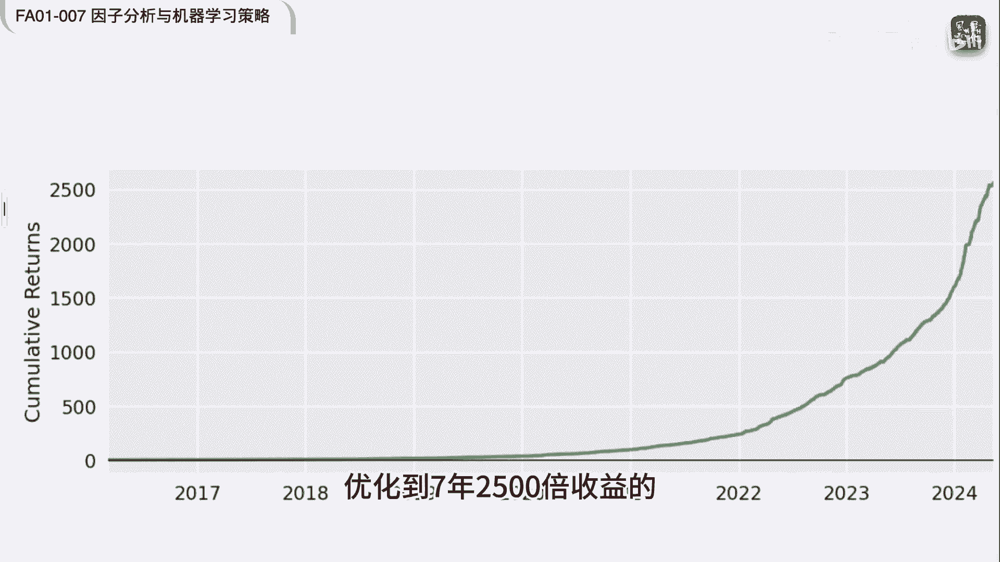

这次课我们还将学习一个新的API分层，效果好不好，就看他的输出跟往常一样，我们非常注重实战，所以会根据很多经验之谈，相信你对你的工作和面试都非常有帮助好。

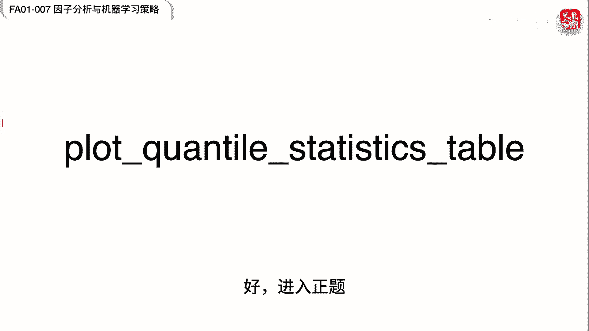

那我们就进入正题，我们先随机取400个tiger作为一个universe，用RSI公式求随因子，这里要注意两点，第一第15行我们使用的是六七的RSI，它的前18个数据是不太准确的。

所以我们要将它置为NAN，这样就不会代入因子分析，第2RSI的取值是从0~100，一般来说超过70要卖，D30要买，因此在分析之前，我们的假设是RSI与收益是成反比的，所以我们构建的因子要用这个公式。

这样才能够满足因此的单调递增，假设我们先用阿尔法认识的默认参数，来进行分层，这里我们并没有传入框ties或者ban参数，意味着将使用默认的框TX等于五，这个参数。

这个函数是我们今天要介绍的一个新的API，它的作用是显示阿尔法length，内部进行分层的结果的一个报表，当我们通过阿尔法认识创建全部失业时，最先出现的报告就是通过它生成的。

这也说明了在阿尔法认识框架中分层的重要性。

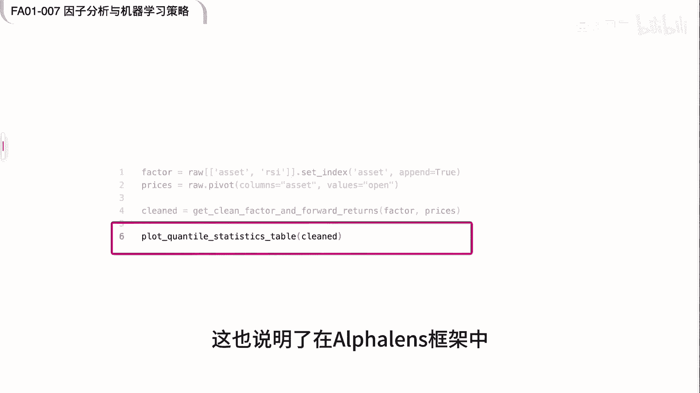

如果分层不正确，那么后面的结果就不用看了，这是我们刚刚分层的结果，那看出问题来没有，第一个分层，他的RI的跨度是从零到了78。9，从经典的技术分析来说，这一分层同时把超买和超卖的信号都包括了。

显然这个分法简直是荒谬，所以如果你不知道在这一步就已经错了的话，那么因此分析是不可能得到正确的结果的，不过我们还是看一下在这种情况下，因子分析的最终结果，我们看到7年的多空组合的累计收益率，是1。

6倍左右，这么说来。

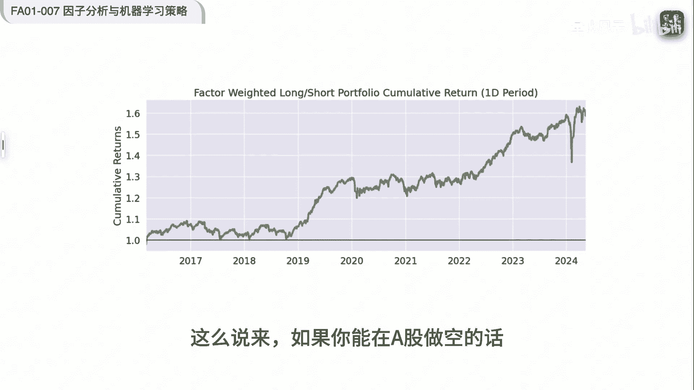

如果你能够在A股做空的话，其实也没有那么差，但无论最终的表现怎么样，我们已经知道这个做法是错误的，既然我们已经知道在rs在不同的数值下，大概表现会如何，所以我们应该按数值来进行分层，这就要用到BS参数。

在使用BS参数的时候呢，注意一定要同时传入框TX等于NN，否则就会报错，这里我们用的bans是零十二十三十，七十八十九是100，是基于一些经验的观察，然后进行了假设，也就是我们认为关注50左右的RSI。

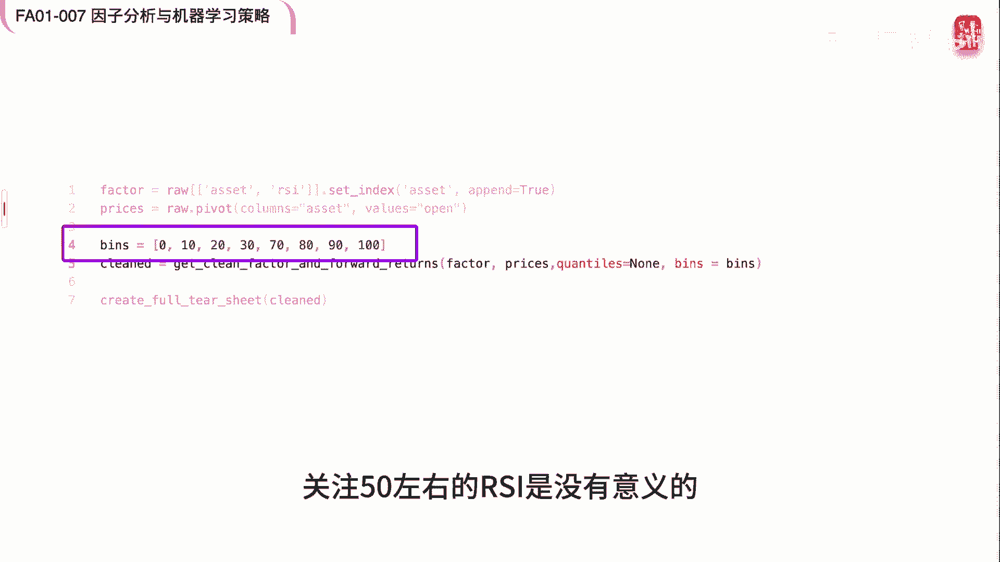

是没有意义的，现在我们再来看看分层的情况，这次的分成就非常合理了，因为我们的期望就是，如果在rs小于十二十三十的时候做多，在RI大于七十八十九十的时候做空。

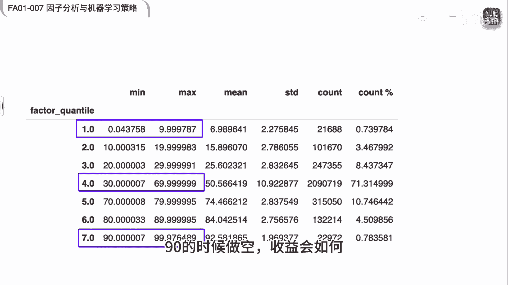

看看这个收益会怎么样，这个分层就刚好能够给到我们想要的结果，我们看看按数值分成后多空组合的结果，现在7年的收益还是1。6。

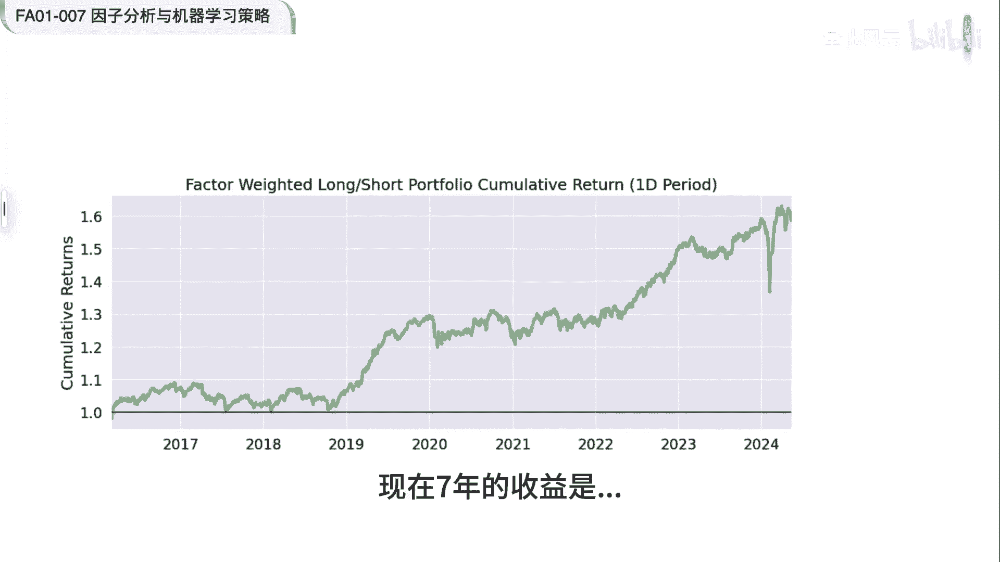

不过我们查看NPWR图的话，就会发现它的线性规律更强了，上面的是按框太OS分层的分层收益均值图，下面是病死的分成收益的均值图，很明显，下面的图是以中心为对称，出现了现明显的线性规律。

这样我们也就找到了原因，这个原因就是因子最大的组和最小的组，他们对收益的贡献是接近的，这样就不存在多空套利的可能了，但是呢，这两组刚好都与第四组，构成了比较好的一个价差。

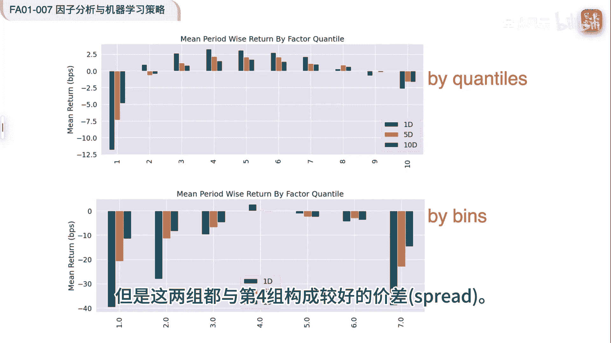

那如果我们能够让阿尔法认识对第一组做空。

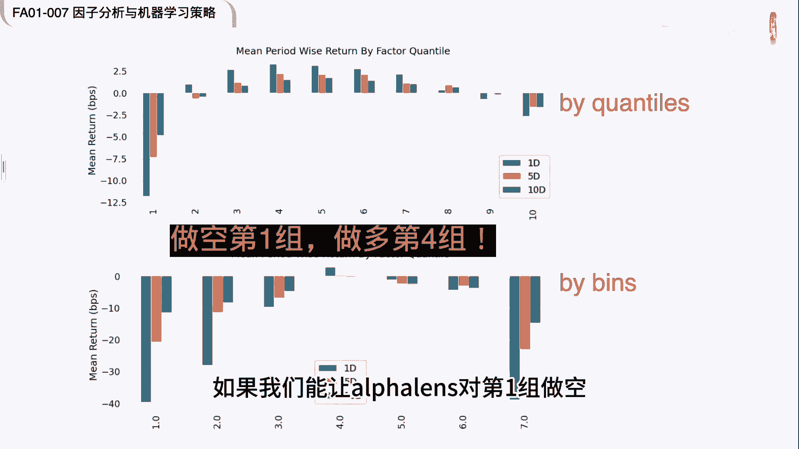

对第四组做多情况会如何，不过呢阿尔法内是并不能够执行这样的操作，我们要重构因子方法，就是我们把因子大于50的记录全部删除掉，那么我们对病程也进行了一个微调。

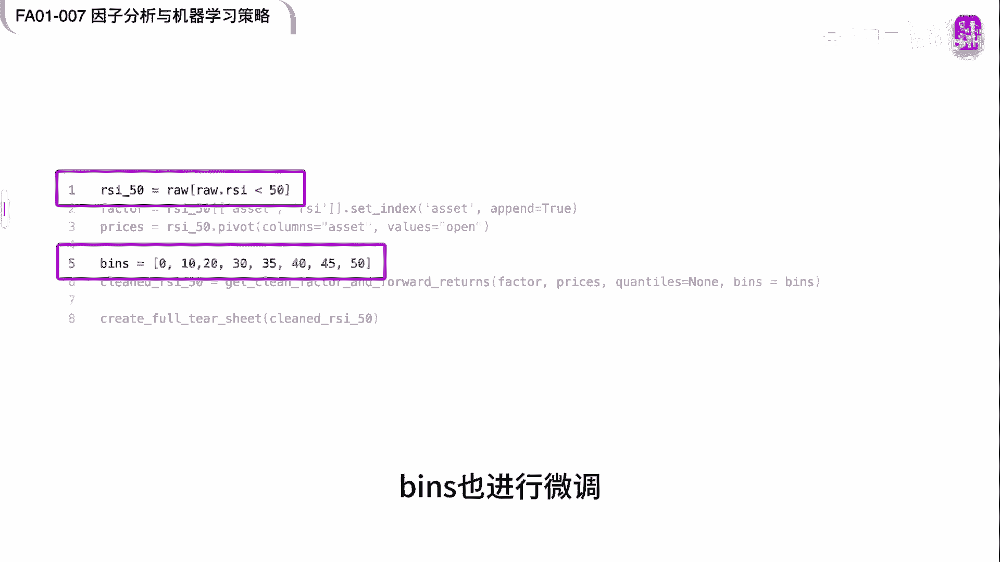

我们再来进行因子分析，这次发现因子分层就出现了比较明显的单调，递增规律，这正是我们在因子分析时，所需要寻找到的一个圣杯。

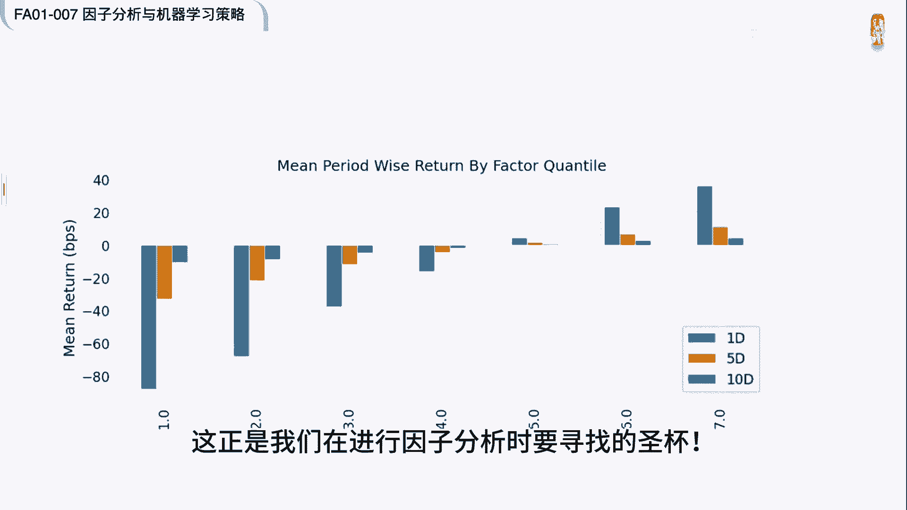

那再来看多空累计收益，这个时候7年时间就达到了惊人的2500倍，那能够超过这个收益的大约也只有涨停板指数，再来看多空累计收益，7年的时间达到了惊人的2500倍，能够超过这个收益的大约也只有涨停板指数了。

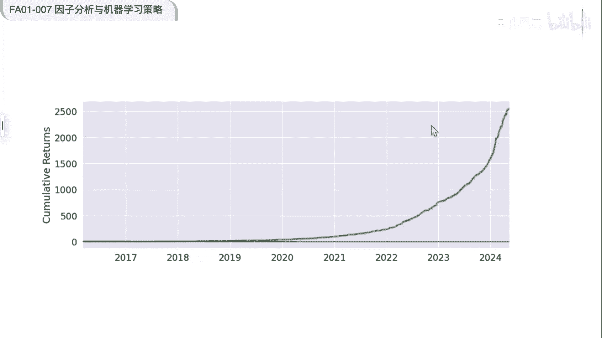

今天的实验我们可以得出什么样的结论呢，第一个要根据因子的特性正确选择分层的方法，这里再举一个例子，假如我们是做的新闻情感类的因子，这些因子往往是离散数据，此时一般都只能使用自定义的变子来进行分层。

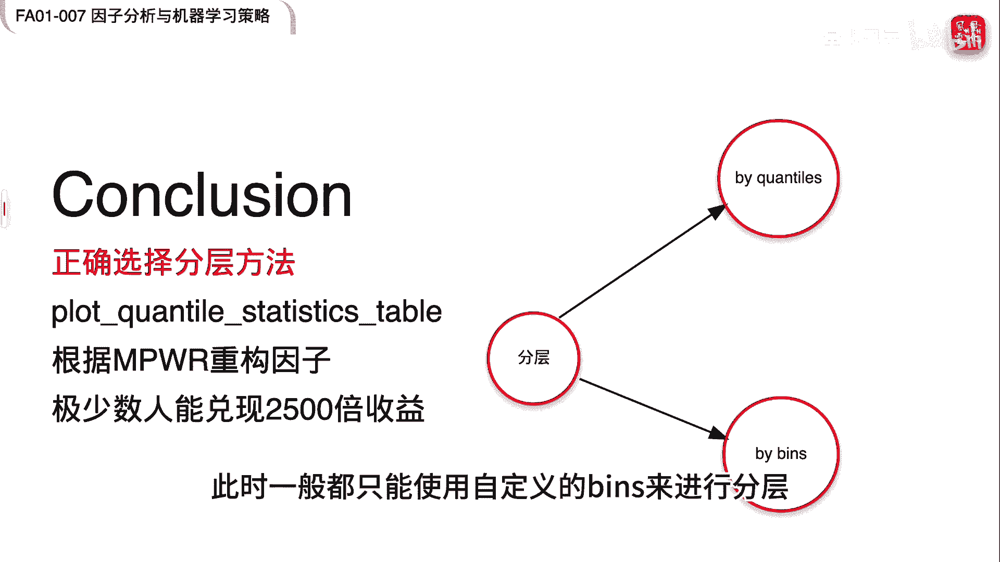

阿尔法LSE自动为我们实现了分层，因此要检查分层是否合理，需要通过他的API plot quality statistics table来观察。

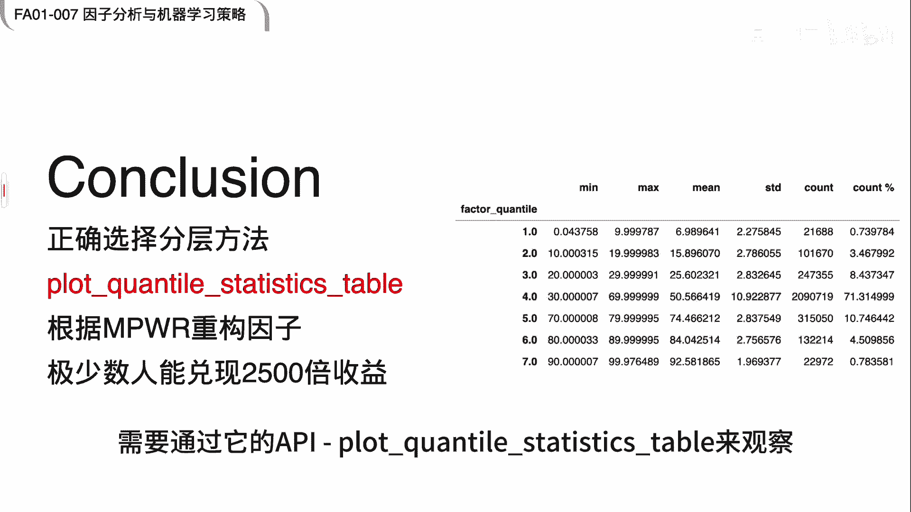

那么在分层正确的实现之后，我们通过分成收益的均值图来观察，分层是否具有线性，看看能否进行重构，使得因子分成收益满足线性要求，最后我们来讨论一下这个2500倍的收益，一般来说当我们看到这么好的收益。

就应该认为是实施步骤出了问题，在我们的实验中是否存在这样的问题呢，因此分析比较复杂，这就是为什么我们要尽可能的使用框架的原因，用对了框架再理解的结论也要接受，那么这个收益我们能否兑现。

只有极少数人能够兑现这个收益，因为他的大部分收益，是通过做空第一组来完成的，在我们的算法中，第一组实际上就是RSI大于90的那一组，这一组的股票往往都是涨停股了，平常融券就不容易，此时融券就更难。

但是从今年以来披露的一些违规案例来看，有一些机构他先通过拉涨停板再融券做空，这就是充分利用了我们这里因子分析的结果，也就是rs大于90的时候，做空的胜算很大，所以只有极少数人能够兑现这么高的收益。

做量化就是造印钞机，所以没有那么容易发现交易的圣杯，即使发现了，也不一定能够实现这个策略，不过掌握了我们今天所介绍的方法。

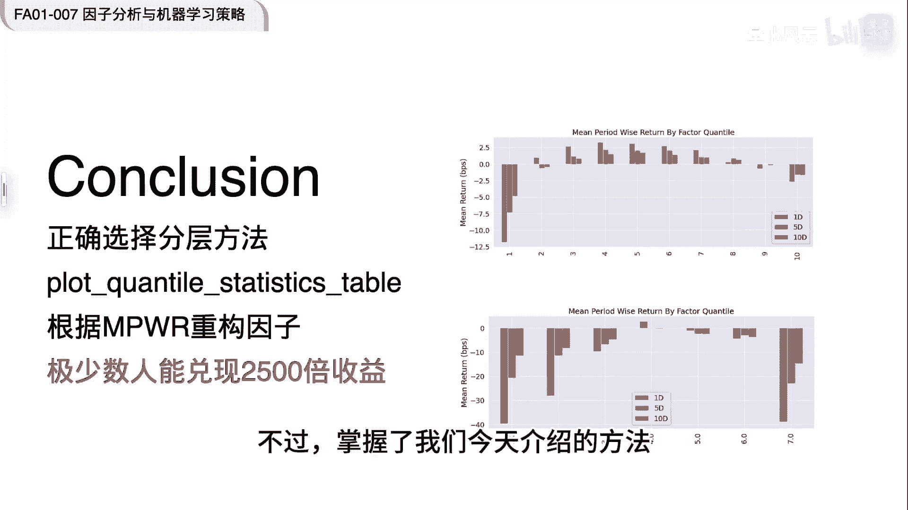

就一定能在因子的寻找过程中快人一步，今天的内容就到这里。

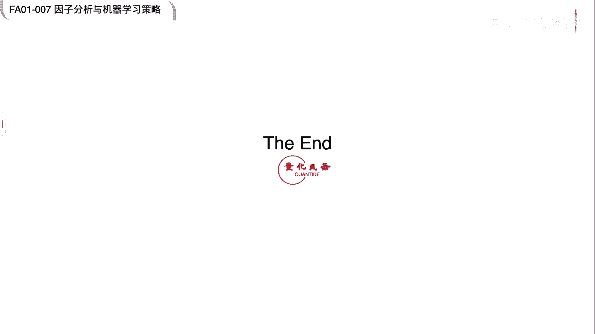