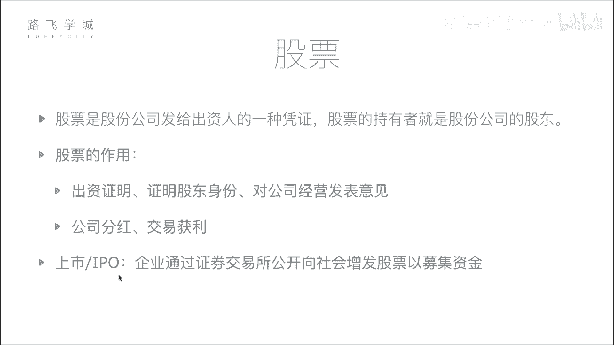
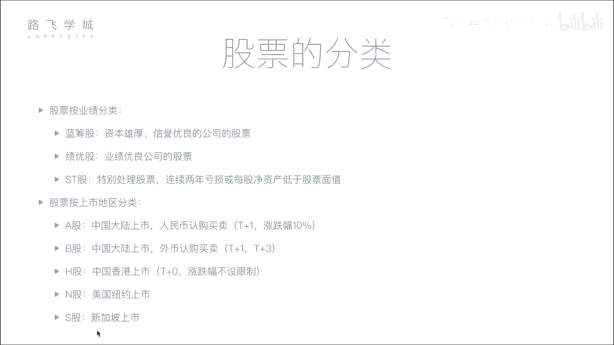

# 【量化交易教程】全100集（完整版）清华大佬耗时一月讲完的系统python金融分析与量化交易实战课程，包含基础教程，进阶学习，项目实战案例讲解，存下吧，比啃书好 - P3：02 金融量化分析-股票基本知识和股票分类 - 路飞学城Alex小助理 - BV1Zi6AYjEG8

好那接下来咱们说一下股票这个东西，好股票是什么，股票是股份公司发给出资人的一种凭证，股票的持有者就是股份公司的股东，那这是股票的定义，那我来形象地解释一下究竟股票什么，比如说我刚才举的那个例子。

刚才举的他是创业公司的老板，我是亿万富翁嗯，他做公司需要钱养，但是他自己可能没有多少钱养他怎么办呢，啊比如说我通过把我的钱给他，那他怎么证明会对我给了他钱耶，啊首先大家可能想第一个我是不是得打个欠条。

对，那这其实是一种借贷行为了，对不是金融行为，对啊，就是你我借给他10万块钱，他要还给我10万块钱，那这我不太想借给他，因为我没有收益啊，我赚的可能只是点利息，除非借高利贷，对高利贷不合法啊。

咱俩聊这张这张上网的，OK好OK好，那哎我借给他，我就赚点利息，我不值，那我怎么办，我通过我给他钱，他给我什么，他们公司的股票，你那股票表示啥，表示你对这个公司出钱了。

比如说这个公司诶可能不止我一个人给的钱呀，可能有好几个大老板都看见他了呀，都想关养他，看每个人给他1亿块钱，对比如五个人啊，他自己一分钱也是一分钱不出吧，假设你自己也来个一嗯，来1亿吧，不然不好算。

OK你也有1亿行吧，那我们行，我们四个老板每人也有1亿，好，我们一人给他1亿，现在有5亿，那整个公司5亿市值就建起来了，对那整个公司值5亿了，那我们相当于每个人每个人都出了1亿。

所以我们每个人能获得他公司的，20%的股票，对按这个这个正常的这情况，正常情况下是这个20%的股票，可能这个实际情况下，比如说他没有盈，但是他有点子，我们几个人都看他的姿色了。

说行你也有20%的股票行吧，就白给他四个亿，你们每个人出了有四个亿，但是我没有，我是我没出钱，但是这个公司是我来对吧，做这个事你们出钱，我来干活钱，我也拿20%的股份，一般来说是按照出资比例。

就是你出百分之多少钱，就给你百分之多少股票，但是有的时候可能有一些，比如说我的对干果干部不出钱，我的对我的技术，我的能力啊，我的设备等等等，姿色姿色啊，好有姿色吗，好等等，那这些就是诶我给他钱。

他发给我股票，这是我的一种凭证，相当于他也是公司的老板，对我是出了钱的，不能说以后哎你公司赚钱了，分不分给我，那不行，我拿着股票我要上法院，这所以怎么证明了，一个是说我们公司，比如说咱们可能签一个合同。

另外一个是呢是说在这个工商啊，这个就在营业执上要变更，他也是股东，直销是股东，对啊对，就这样好，那股票的作用，第一点就是我们刚才说的哎，我给钱了，我是老板，我出资证明我是股东身份啊，我既然出钱了。

我就能你这公司就能说话，我就能说话，这个股东大会我就能投票，就把他炒了，还是怎么着，等等啊，这个咱们不说了，第二一个可能大家关心的叫做公司分红，交易获利，这个就是咱们平时炒股的股民们啊。

他的股票的作用他是什么呢，我炒股，比如说我投进去10万块钱，20万块钱，可能每个人嗯你再有钱就投资几百万块钱嗯，行了吧，你能占公司的股份多少呢，嗯占不了多少，你说你你希望这个地方我可以可以这样解释。

就是我我补充一下啊，就是相当于你不是投了一个亿嘛，对不对，那投了一个亿呢，你怎么去把这个钱再挣回去，对吧嗯，就相当于你是这个公司的股股东啊，对对你最终肯定是想挣钱嘛是吧，那你挣钱方式有两种。

一种呢是分红分红，就说哎咱们这个公司做大了，挣了钱了，你占20%的股份，今年公司的利润就是说5000万，那你就分百分之，如果要全分掉，那5000万的净利润就分你20%，对对不对对，那就是1000万是吧。

对哎那你就拿回1000万的分红，但同时你还依然是我们的，明年如果投资继续挣钱，你依然分红，如果每年分的越来越多，你这几年就把回本了，对不对，并且同时还有公司的股份，那太开心了，另外一种获利方式是什么呢。

说哎呀啊什么呢，你这个这个这个这个现在公司做到一定规模了，对吧，之前我们值四个亿嗯，啊那现在变成值40个亿了，嗯40个亿呢，你就觉得哎，这个相当于你之前的这个投了一个亿啊，你现在占20%的话。

40个一个亿了，就算投涨到50亿吧，50亿，50亿，40个亿啊，不是50个亿，20%你就变成了10亿啊，对那你投资1亿变成涨了十倍，那你觉得说哎你现在又看到另外一个年轻人，哎。

你觉得我这个公司是成长空间有限吗，哎资色空不行了，老了是吧，从50亿涨到80亿很困难，对不对，从涨到100很困难了，但是你看到一个新的年轻人，你觉得他创作毕业这个事不错对啊，你现在给他投个。

比如说再投一个亿，那5年之后还能点十个亿，那你就干嘛，你就想你就想干嘛，就是虽然咱们这个公司，我这个公司值50个亿，你的钱你其实并没拿到，它只是胀力，就是好像对是值，但是好像就没拿到，所以怎么办呢。

你说哎我把这个股票卖卖一部分对，然后别全卖了，万一你能变成100亿是吧，你卖个一半对不对，你就把你这个20%卖掉，10%，对对吧，那按这个现在的市值是十个亿，你卖了花，你拿了五个亿，对不对。

你拿五个亿走了之后，你就有资别人，你去投资别人了，那相当于你就套现了，对不对，那另外五个亿，你另外一个剩下的10%，你依然是我公司的对，所以另外一种获利方式，就是说相当于你把你的这个股东身份卖掉了。

对套现了，这是那别人有接盘的，就别人买你这个东西对吧，那相当于这里面的这个交易价差嗯，你就挣这个钱，对对对对，这是艾迪斯说的，就是什么呢，对于一些大的投资者嗯，有钱人他们这个分红和在交易获利怎么样。

那我刚才想说的是一些，比如说咱们真实的股民的小股民，对啊，小股民们，那他们比如说我后边会讲啊，你什么时候能够买股票啊，这个假如说你买了股票之后啊，两种获利方式，第一种也是比如说你投进去几百万块钱。

可能没有说投一个亿啊，投几百万块钱，第一个你仍然可以投到高，但是这个分红会比较少，因为你投的钱少嘛，你占的可能就占百分之一点几，二点几，对不对啊，你你占的比例少。

你分的红相当于说你整个净利润可能是一个亿，那你分的话分1%其实也挺多的，其实是一样的，就你说的这种小股兵跟我这种一样的，只不过是说呃怎么讲，复杂程度不一样对，因为什么呢，小股民要想买公司的股票。

那必须要通过什么，就是那个证券交易所，这个你应该是在后面后面会说，后面说后面我们一会再提这个事啊，我们一会再提这个事好，那接下来我们说一下什么叫做上市，嗯啊公司要上市。

大家好像都就是在一些这个互联网公司工作的，一些人都会说都会讨论你公司上市了，上市了吗，对啊，那什么叫上市啊，所谓上市就是企业通过证券交易所，能够公开向社会增发股票以募集资金，什么意思呢，我们刚才说的。

他开公司，我要给他钱啊，这个是叫父母对吧，那他并不能说哎我今天开个会吧，我站在这个五道口哎，我开公司了，大家快来给我钱呀，不能这样，你不能就随便找个人就拿钱，这个在法律上叫你叫去查集资是要进去的。

坐牢的啊，你万一拿了钱之后，你就跑了呢对吧，你不能这样，那怎么样呢，首先你要有一个公司，对你这个公司要做到一定的体量，然后去什么呢，去给证监所，就是我要是我请求上市，证监会，证监会对证监会请求上市。

那证监会看一下啊，你把你的这个公司这几年的财务报表，然后什么你的这个像各种各样的信息都要你啊，你拿过来看啊，你的公司还好，应该呃先破产不了，证监会这么想，应该先破产不对，能赚钱好，允许你上市好。

你上市了，上市了之后能怎么样呢，能够就是哎我在证券交易所挂个牌，就是所有的股民都能看到，我这个公司股票涨还是跌，那所有的股民都能够买卖我这只股票耶，对这个行为叫做上市，对啊。

上市之后才能向所有的社会大众对征募集资金，对来发股票啊，那当然上市也是有条件的，就是你这个公司不能太差啊，因为这这就是为什么现在好多公司都想着上市，但是他们有的是上不了市，那那就说他为什么想上市对吧。

对不对，为什么呢，为什么呢啊因为说白了啊人为财死嘛，嗯融的钱更多对啊，为什么呢，因为我认识这么一个有钱人，嗯啊那但是我认识的有钱人是有限的，对对不对，即便他再有钱，他拿出一个亿来已经非对他来讲非常多了。

但是我告诉你，虽然我们这种普通老百姓钱少，但一个人凑10万，十个人就能凑十个亿，对你哈哈，1万个人就能凑十个亿，对不对对，所以就是说那全中国的股民好几千万，是不是啊，那他们相当于都聚集在一个地方啊。

聚集在一个市场上，对不对，那相当于我这个股票，如果有资格跑到那个市场上吆喝一声，哎我还上市了对吧，那这个大家如果谁都给我投一点，一人一块钱，10亿14亿，中国人14亿，对不对对啊，那前提。

但是我要获得这个到这个市场上，吆喝一生的这个资格，因为这个市场相当于是国家管的的，对国家为了保证这14亿人的些股民的，小股民的安全，你不能把钱投完之后打水漂了，是不是啊，所以他就对这个市场的。

这个相当于想上市场上吆喝的这个人，控制特别严格啊，必须要查明你的这个背景，对不对，你的公司啊，这个近几年呃相当于挣了多少钱，对不对，然后你的公司接下来几年，会不会说往下走下坡路啊，会不会呃会破产。

对不对啊，就各种风险给你规避掉之后啊，觉得哎这个小伙这个公司不错，是不是，那好，我允许你到我这个大市场上去，跟这些小股民们去融钱，对不对对，所以啊这个大市场就是A股啊，是不是对深深深股啊对吧，港股啊。

类似这种对好，那这个时候就在上市，那APO就叫做首次，这个就是你首次第一次刚上市的时候。

第一次向社会募集资金，这个项目就做IPO，你好，那接下来我们说一下股票的分类啊，有两种分类方式，首先说按业绩分类有这么三种啊，蓝筹股，绩优股s st啊，就是按照你工资业绩分类，蓝筹股指的是什么呢。

指的是资本雄厚，信誉优良的公司的股票，比如说对我们国家来说，中石油中石化大体量就是用脑，你想想人的话就是大胖子嗯，你就是体量大，就是这个有钱有很多钱，这叫蓝筹股啊，为啥叫蓝筹股呢。

因为这个这个这个在赌场上来说，去过赌场吗，去过啊，打消去了，在赌场上来说，你去赌场不是拿钱啊，不是你派100块钱起来，你是拿筹码嘛对吧，筹码的话，蓝色的筹码是最值钱的啊，所以叫蓝筹啊。

既有我们相当于指的是业绩优良公司的股票啊，他可能没有蓝筹股那么有钱，但是他一直都在蹭蹭的赚钱，对他一直在赚钱，表现很好，比如说啊这几年的古往茅台，中国茅台啊等等等等，茅台已经突破交多少来着。

7000亿市值了，我就不相信，反正他很赚钱，这叫绩优股啊，第三种就是表现比较差的股票，叫做s st股啊，这个中文叫做特别出力股票拿出来说下对，就是什么呢，你这个公司连续两年亏损。

或者每股净资产低于股票面值，换言花哨，就是你这公司做的不行，雅儿没什么钱赔钱，那你这个股票在股票交易所上交易的时候，后边是要加个ST的，就是要告诉股民这个公司现在不行，你买他的股票要慎重啊。

还是为了保护股民的权利啊，当然如果你这公司过年时间经营好了，哎你可以去申请来把我这个s st拿掉，对对就是这个啊，按业绩分类有这么常见的三种啊，按上市地区分类，我们说这个公司要上市，那你在哪里上市呢。

首先中国大陆啊，中国有首先有两个这个交易所啊，咱们后边会说大家应该可能都知道，上海深圳各有一个股票交易所，那在这两个交易所上市的，以人民币认购买卖的股票叫做A股啊，就是咱们大部分股民讨论的应该都是A股。

就是在中国大陆上市，并且用人民币买卖，那当然还有一部分B5啊，同样在中国大陆上市，但是以外币认购买，就是你美元啊，港币啊，这个这台币啊等等啊，这些买卖都是B股，这个是当年我们就是改革开放的时候。

为了吸引国外的资金嘛，对不对，你国外的钱也投进来，我也发展的好一点啊，当年这个辟谷限制还比较严，说只能是这个外籍人口，就是才能买卖，现在好像开放了，就是如果你是中国人，但是你手里有点美元。

你也可以配买啊，当然咱们大多数考讨论好像都是A股啊，还有个H股啊，就在中国香港上市，N国在美国纽约上市啊，S股在新加坡上市等等，当然还有伦敦，还有东京，这个咱们就不讨论了，就说啊怎么讲，说白了。

这个中国有一个相当于股民们交易的大市场，那美国也有对，美国日本也都有，对不对，每个人每个国家搞一个大市场，对就这种对吧啊，那对于这些股市来说啊，需要知道的一点是什么呢，就是一些他们的政策。

嗯啊我们说A股啊有两个这个限制，一个叫做T加一，一个叫做涨跌幅10%，涨跌幅10%，这这样可能清楚一点，我们中国这个炒股有涨停和跌停定数，就是你这个股票波动一天不能超过10%。

对比如说你昨天股票的股价在100块钱，你今天的股价上不能超过110块钱，下不能超跌过90块钱，对啊这个是为啥呢，这个就是中国保护股民国家的行为，对为了保护股民，防止你狂跌，然今天100块钱。

明天十块钱了，完了你你我投进去100万块钱，就剩10万块钱了，没错那个这补充就是说啊，其实这个中国刚开放股市的时候，999293年的时候，那个其实是没有涨跌幅限制的，就是说相当于啊一天就可以。

相当于股票涨涨一倍或者是跌一倍，那大家因为不知道是不是中国人的赌性很强，还是说这个怎么回事，大家就是说觉得这个事什么嘛，就就好多人其实也不懂股票，看别人挣钱，他就投进去，夸把全部家当投进去。

结果哎第二天全跌没了，那这个东西就是对啊，那时候当时九几年不富裕的中国来讲，其实还是打击蛮大的，所以就很多人受不了跳楼了，那九几年跳楼的经常有对吧，所以啊国家为了说什么呢，对不对啊，保证这个社会稳定嘛。

对不对，所以就出了一个涨跌幅限制，说哎你就最多你这个股票一天只能跌10%，那也就是说跌没了还得跌十天了，但你心里有一个有一个平缓的过程，是不是啊，不至于跳楼啊，那涨也是每次涨10%，对对不对啊。

就是那么一个限制，但是国外啊，其实国外没有这样的限制，比如说股美股啊，真的一天给可能有一些市场，有的涨跌幅20%的性呃，据我了解好像没大部分都没有，大部分都有，大部分就是直接全部开放，对对对。

所以就是你在美国，你如果买一只股票啊，你如果公司爆出重大丑闻，对不对啊，那个致命的丑闻，那个股票一天就给你跌个80%，一下子就不值钱了对吧，那就是这样，所以就是说哎不用说OK好，这是这个涨跌幅的限制。

还有一个T加一的限制啊，这个是啥呢，这个我们叫做交割日，T叫做交割日，就是说你比如说我今天买的这只股票啊，你今天不能卖出去，只能明天再卖出去，所谓交割日其实就是说你今天买的股票，唉。

这股票我明天再发给你呀，这个其实也是中国的国家，是这个对嗯，美股一些就港股他们基本上都没有这个心态，在港股它叫T加零，就相当于你今天买的股票，今天可以卖出去，可以再买进来，可以再卖出去。

就是你比如说我今天十块钱买的股票，唉可能我在股市待了，就是我待了俩小时，俩小时涨到15了，赶快卖了，卖一会儿跌又跌到13了，我又买进来一会，所以他就一天可以频繁多次交易，但是中国是不行的。

你今天买了茅台，你今天甭管它涨多少，跌多少，你不能卖，哎，跟你没有，你想卖，明天开盘的时候再买，为什么呢，也是为了叫什么减少投机行为，减少投机行为就是对，减少投机行为，也就是说你今天买的股票。

我明天再给你啊，这叫交割日，那辟谷来说啊，这个叫我写了一个叫T加1T加三啊，这个有点复杂了，T加一还是交割日期，也同样也是辟谷，也是你今天买的股票，明天发给你，明天才能卖出去。

那T加三是说的是叫交收日嗯，就是我今天卖的股票，你不是有钱吗，会给你打钱吗，对吧，那你这个钱三天之后才能提现，你就你这个钱三天之后才到账，但是已经是你的钱了，已经是你的钱了，但是他就是让你三天之后再到。

不让你那么愉快的充钱，对啊这个B股的限制啊，然后H股没有那么多限制，T加零没有涨跌幅限制啊，N股S股也基本都没有好这些啊，这是我们说的股票的一些分类，同时也顺带介绍了一下这几个股市啊，一些限制嗯。

那据我了解啊。

啊我已经这个这个不在金融行业有几年了，但据我了解，现在A股已经成为全球，这个应该是市值最大的这个盘子，嗯啊对很正常，因为中国人多有钱，OK那咱们这个股票的分类啊。

