# 分析师的嘴,骗人的鬼_年薪百万的券商分析师靠谱吗_Python量化大数据给你答案!#量化交易 #python #金融 #股票 #分析师 - P1 - 无限超人Infinitman - BV1qU4uejEHq

一定交易经验的同学。

应该或多或少都看到过，券商分析师们推荐股票的信息，甚至你在支付宝上面花59元每月，就能看到那些被认为最优秀的新财富分析师。

每天实时推荐的股票，但这些年薪百万的分师们推荐的股票，未来就一定会上涨吗。

那还是要用数据说话，所以我们收集来了历史上所有分析师推荐的，所有的股票记录视频，就用大数据来看一下那些分析师们推荐的股票，到底能不能帮我们赚钱呢。

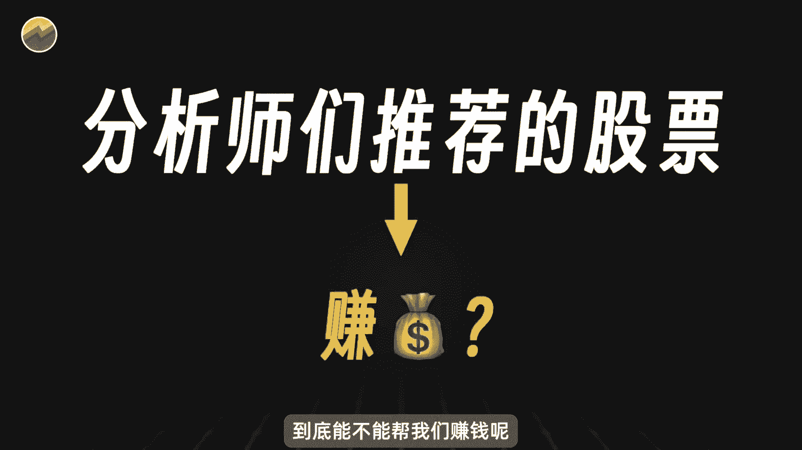

大家好，我是专注一量化投资的行不行，当你刚进入股市的时候，看到某某分析师推荐股票的研究报告，你可能会觉得哇塞分析师都好牛逼。

分析的好专业呀，但是当你在市场上待了一段时间后，再提到券商分析师，可能第一反应是这样的，这样的嗯，嗯或者是这样的。

甚至你会产生这样的想法，有这样的反应呢，可能是大家平日里对飞鹰师接触不多，或者看到的都是类似的新闻导致的，就我自己亲自接触下来呢，个人感感觉，分析师们整体上来说还是比较靠谱的，首先啊不管怎么样。

分析师的学历都很高，目前一般来说都是硕士研究生起步，同时呢不可否认。

他们当中的有些人专业度也很高，甚至是行业专家或者经济学家，最后呢相比于条等渠道。

分析师的研报确实是一个更优质的信息来源。

说到这里呢，给大家推荐一个公众号，他用了比较诙谐的方式来写，分析师和基金经理的一些日常。

通过他的文章，大家也能更加真实的了解分析师这个行业，然后呢在分析师当中，有一个群体被认为是王牌中的王牌，精英中的精英，他们就是新财富分析师。

这些分析师呢是由各类机构投资者投票，评选出的，参与投票的包括了社保，公募，保险，私募等等专业机构，这些机构呢也是分析师们的主要服务对象。

所以由他们来投票呢也是比较合理的，一般来说呢，分析师们推荐的股票，能不能帮这些服务的机构赚钱，是投票很重要的参考依据，所以可以说，新财富分析师大部分都是业内公认的佼佼者，当然啊有投票的地方就有江湖。

新财富分析师的投票也存在着很多场外的因素，比如说某分析师曾曝出，为评选新财富与客户的不雅饭局好，那么以上就是关于分析师和新财富，分析师的简单介绍，关于这个群体到底是有用还是没用，到底是专家还是专家。

大家各自有各自的看法，但是不管怎么样，分析师工作最重要的一环就是推荐股票，我们还是可以用数据说话，去看看他们推荐的股票到底收益如何，在我们做量化交易的人看来，这才是评判分析师业务能力的最佳指标。

那么正好2022年，新财富分析师的评选已经结束了，我们去看看哪些分析师获此殊荣，而他们推荐的股票到底是涨是跌，能不能帮助我们获取一定的超额收益，下面这个呢就是我帮大家整理好的。

2022年的新财富分析师名单，新财富，它是按照行业分类来对分析师进行评选的，比如说食品饮料行业，医药生物行业等，这里面的总共涉及到25个行业。

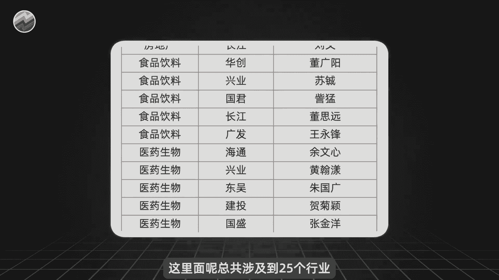

120位明星分析师，那么我们接下来就用数据来验证一下，这120多位分析师，在2022年推荐的股票，我们跟着买到底能不能赚钱呢。

想要进行这样的研究，光有这些分析师的名单是不够的，我们还需要知道，他在2022年到底推荐了哪些股票。

这些分析师他们推荐的股票呢，都是往往以研究报告的形式发布。

比如说我们看这一份研报，他在首爷爷会告诉我们哪些信息呢，他的第一页会很明确的告诉我们，孙某某这个分析师，他在某年某月某日具体推荐了某个股票。

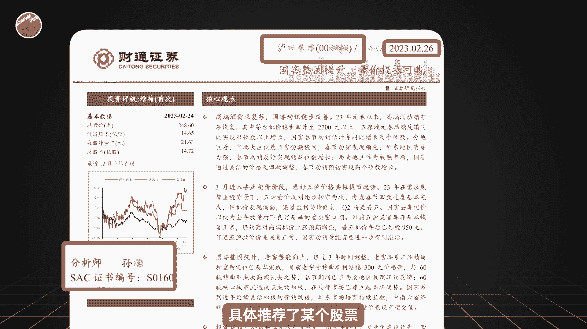

并且给入了买入的评级，整篇报告呢就是相关的具体分析，往往可能有十几页。

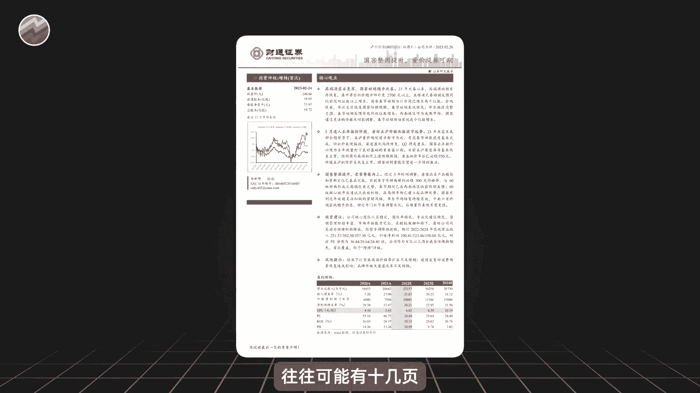

我们这里要注意的是，一般来说任意一篇报告，分析师都会明确的给出一个评级，比如说推荐强烈推荐或者是卖出，当然不同的券商他们用的评级话术是不一样的。

但你大致可以把它认为是券商的分析师们，在此时此刻。

对具体的股票给出了优良中差的一个评级，然后理论上来说呢。

我们个人投资者，一般是很难看到这些分析师研报的，想看的话呢需要去一些固定的渠道付费观看。

当然现在很多分析师也会把这些研报，发在自己的公众号上。

大家也可以自己去搜索改感受一下，我自己呢每周也都会在众多年报当中，整理出几篇。

我个人认为比较好和大家分享，如果你需要这个数据的话，可以加我抖音的群聊。

都是可以直接发给你的，另外呢就是分析师每年发布的研报，数量是非常多的。

大概在4万篇左右，如果你要一个一个的去统计，2022年的新财富分析师们写了哪些研报。

推荐了哪些股票是非常繁琐的，所以这里呢我们给大家准备好了。

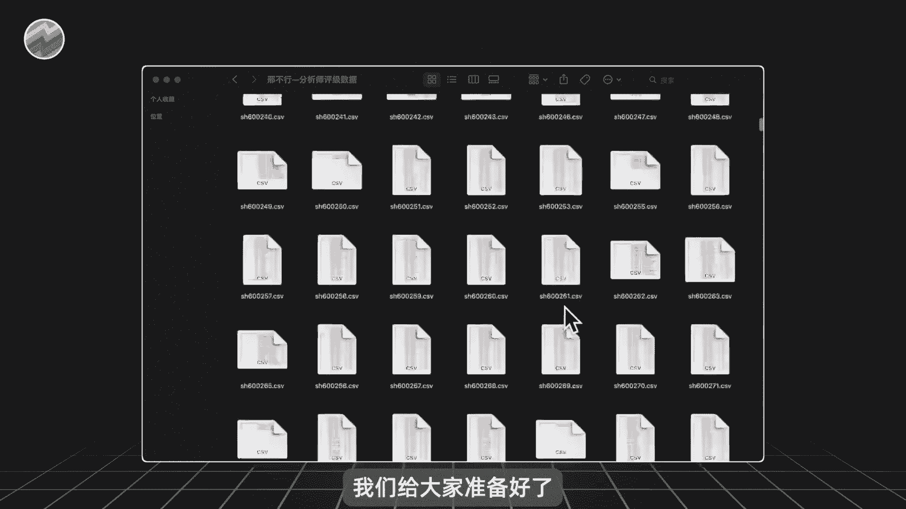

相关的完整的历史数据，这份数据包含了2008年开始至今，每个分析师撰写的每一篇研报，记录了他研报的发布的日期，以及具体推荐的股票，还有分析师相应的姓名以及给出的评级，非常的完备啊。

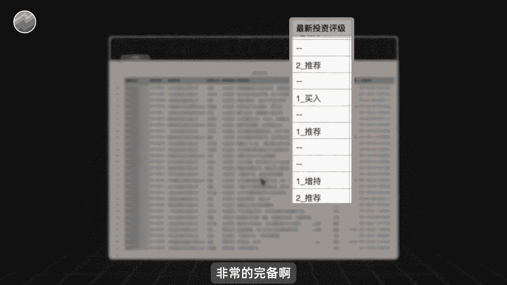

懂的同学呢应该也知道这份数据是非常珍贵的，我们呢从中把2022年，所有新财富分析师的相关数据都筛选出来。

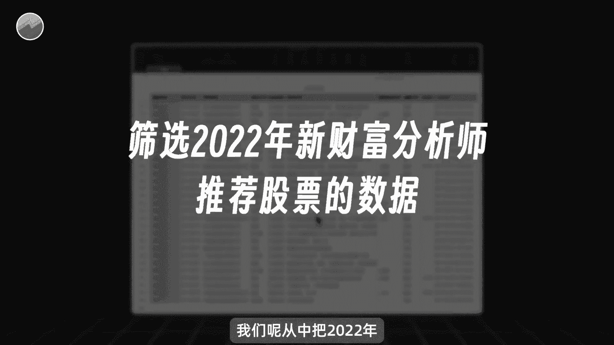

方便我们后面统计，筛选之后的数据呢，长这样，我们可以发现啊，分析师他会针对同一个股票，连续不断的发布多次的研报。

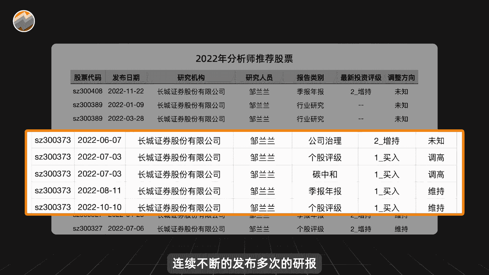

那么为了方便我们验证，我们只保留分析师在第一次给某只股票。

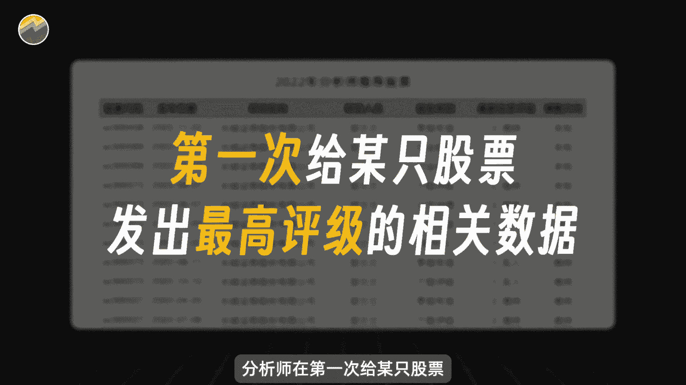

发出最高评级的相关数据，其他的数据我们都删掉，比如说某某分析师他推荐了很多次某某股份。

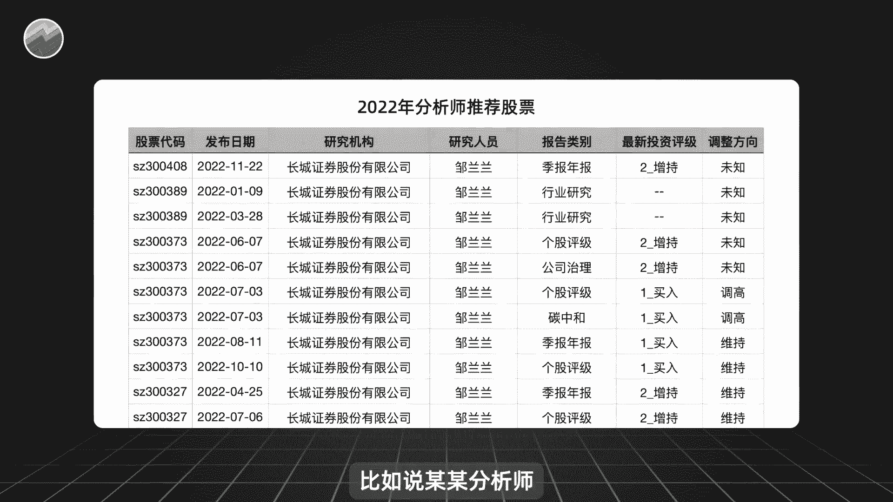

然后呢他在第一次推荐这个股票的时候，是给出了第二档的评级，他第二次推荐的时候，才给出了第一档的最高的评级，那么我们只保留这一行数据研究。

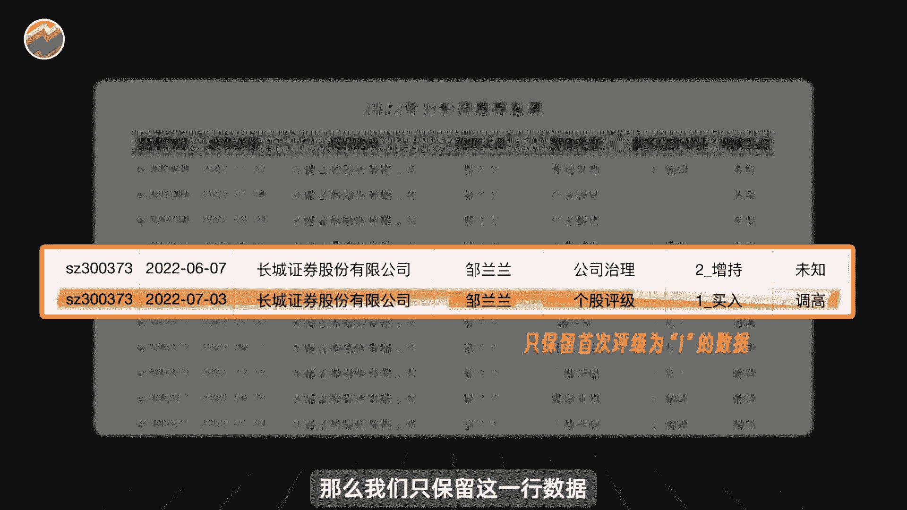

这个分析师在第二次给出最高评级之后，我们这个股票在未来五天，20天，60天以及120天的收益到底如何。

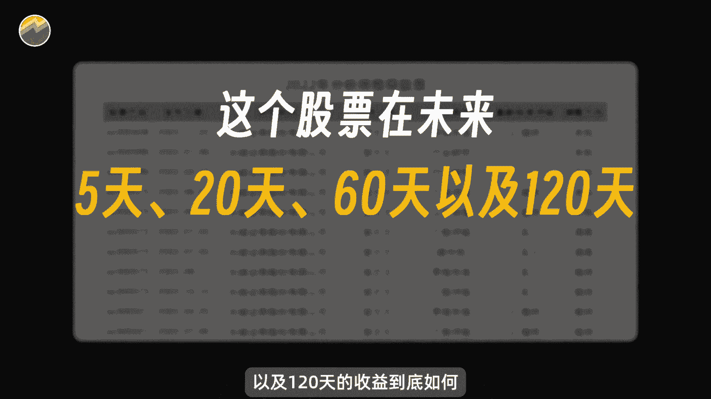

其他的分析师呢我们也会做相同的处理，那么要进行这个统计，你使用excel去完成，当然也可以，但是会比较复杂，我们呢就借助Python代码来实现，去看一看这些新财富分析师们。

在2022年都推荐了哪些股票，这些股票在未来又是涨还是跌。

如果你需要这个数据的话，可以加我抖音的群聊，都是可以直接发给你的好。

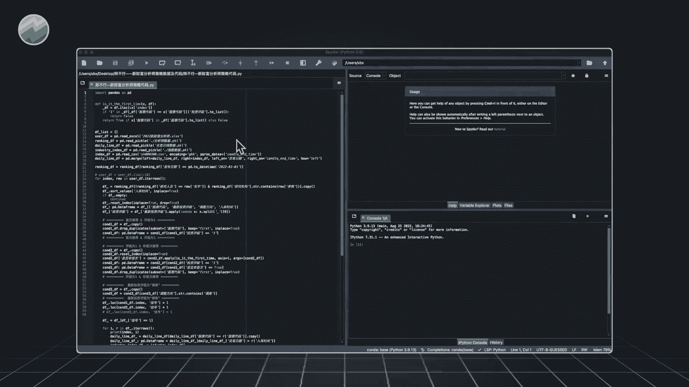

那么我们就来运行一下程序，看一下结果如何，120位新财富分析师当中有97位呢。

在2022年以最高评级推荐过股票，占比81%，其中有46个人啊，在一年当中推进了超过20个以上的股票，甚至还有某位大佬呢堪称劳模。

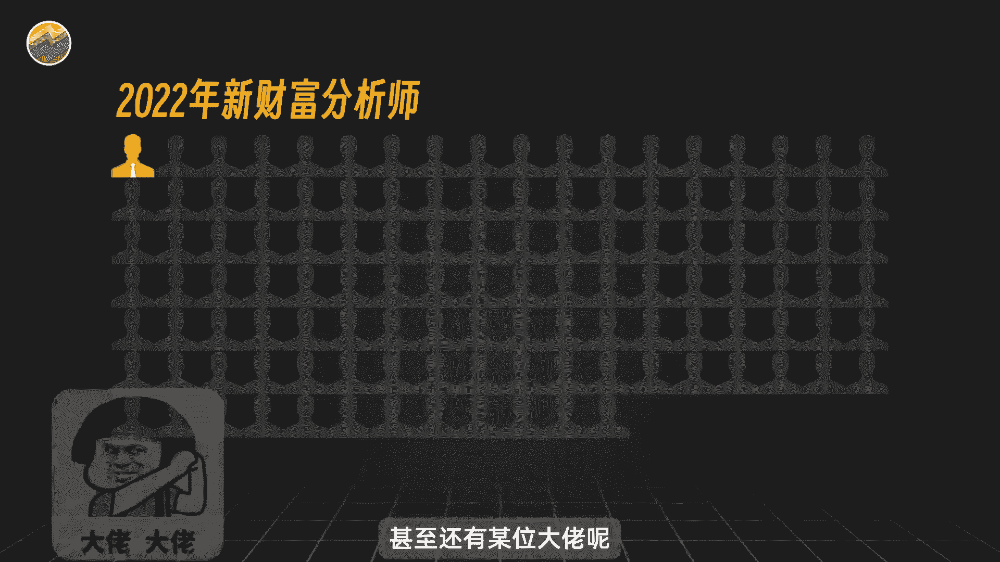

一个人就推荐了102只股票，在职业推荐当中呢，有些人是很成功的。

比如这几位在推荐了股票之后的五天，20天，60天或者120天，股票呢都出现了很高的涨幅，当然也有一些分析师推荐股票之后呢，被啪啪打脸，推荐之后股票一路下跌，但是啊个人的表现呢并不能说明什么。

我们还是要去看这个新财富分析师，整体的表现到底如何，那么我们就来统计这些分析师，在他们推荐股票之后，未来一段时间的一个平均涨幅，具体结果呢就如图所示，我们可以看到，他们在推荐股票的五天和20天之后。

平均涨幅都是下跌的，但是在推荐60天和120天之后呢，是上涨的，并且不管怎么样，他们推荐股票的胜率是远远小于50%的。

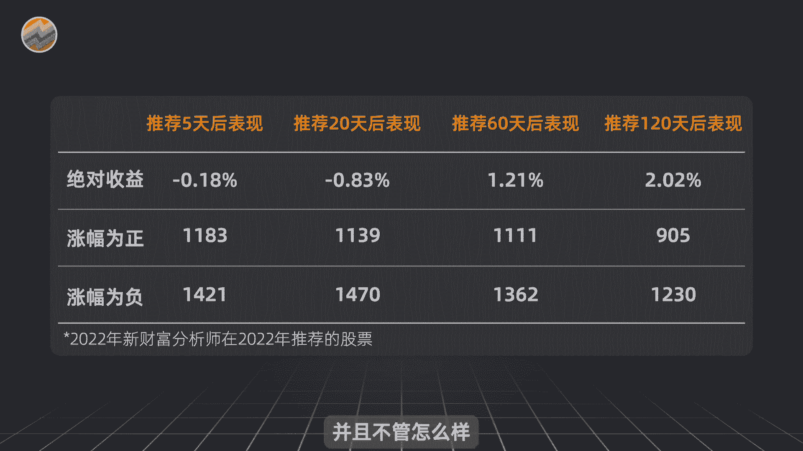

也就是说推荐的股票跌的要比涨的多。

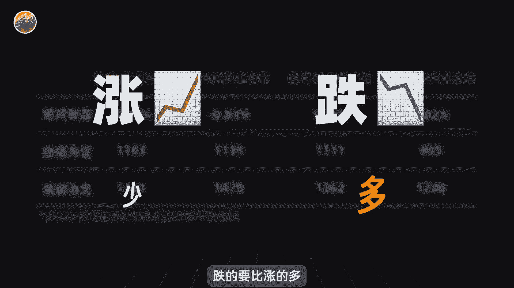

那这样的结果能够说明分析师不给力吗，这显然是不能的，因为呢在2022年代表大盘的沪深300指数，本身就下跌了22%，那么我们要去评价分析师推荐股票的表现，就不能只看这些股票的绝对涨幅。

而是要看推荐的股票，同期相对于大盘的相对表现，也就是说是不是能比大盘少跌一点。

或者多涨一点，那么我们使用程序进行相应计算，就可以得到在分析师推荐股票后的五天，20天，60天以及120天后，这些股票相对大盘的平均收益。

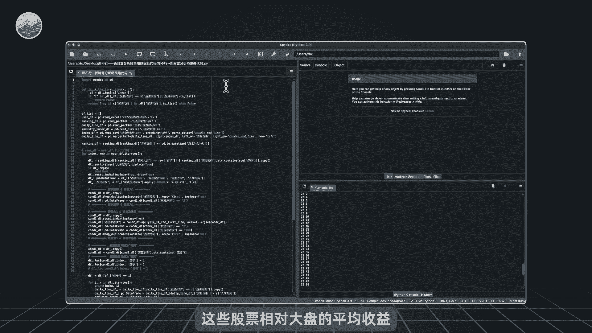

这个结果呢总体来说还是不错的，无论短期还是中长期，这些金牌分析师们推荐的股票，都能够稳定的跑赢大盘，特别是推荐120天之后的表现，相比于大盘有10%的超额收益，说实话我看到这个数据是比较吃惊的。

当然啊也有同学可能会说，这些新财富分析师呢是做行业研究的，他们只会在单一的行业内推荐股票，如果某个行业比大盘涨的多，那么这个行业的分析师也能受益，所以呢我们不能和大盘相比，而是要和相应的行业指数相比。

比如说医药分析师推荐的股票，就应该和医药行业指数相比，那么这个想法是非常正确的，我们呢也找来了行业指数计算的相关的结果，我们可以发现，总体来说，分析师推荐的股票，还是可以跑赢自身行业指数的。

具体结果呢如图所示好，那么至此，我们基本上可以确定，2022年的新财富分析师们，可以算是实至名归了，他们在2022年推荐的股票确实不错，是值得基金经理投票给他们的，那么我们本期视频到此结束。

恭喜还没有离开的同学，因为接下来要讲的才是真正的干货，我们之前的分析都在证明，2022年最优秀的新财富分析师，他们在2022年推荐的股票确实不错，但是大家仔细想一想，这除了帮助新财富。

不证明他们投票选举的分析师不是乱投的以外，对我们实际投资有什么帮助呢，其实并没有帮助，我还是不知道今年2023年应该买什么股票。

只有我通过数据证明，去年的新财富明星分析师，他在今年推荐的股票仍然有超额收益，这才对我们投资者有持续的帮助，就像我发明了一个理论，如果这个理论只能解释过去，但不能帮我们理解未来，那这个理论就毫无意义。

那么当然现在2023年还没有过完，我并不能知道2022年的明星分析师们，在2023年的表现到底如何，但是我可以看2021年的新财富。

明星分析师呀，我可以看看他们在接下来的2022年，推荐的股票表现到底如何呢。

跟我一样好奇的麻烦，点击一个三连，我们接下来就找来2021年的新财富，分析师名单。

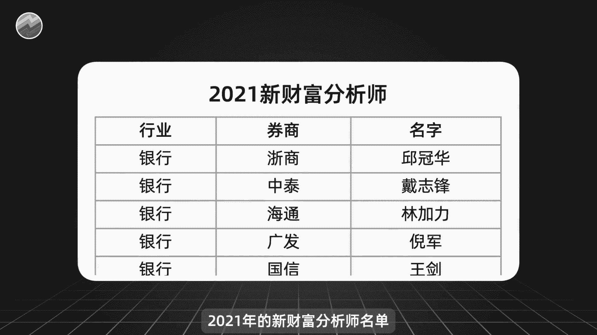

并借助我们之前的数据和代码运行程序，看一看结果到底是否如我们所想的。

如果你需要这个数据和代码的话，可以加我抖音的群聊，都是可以直接发给你的。

那么运行代码之后，具体结果就如图所示，我们可以发现，21年的新财富分析师们在22年推荐的股票，短期内绝对收益也是下跌的，但中长期呢是上涨的，最关键的是，他们推荐的股票确实在任何周期内都跑赢了。

同期的沪深300指数以及自身的行业指数。

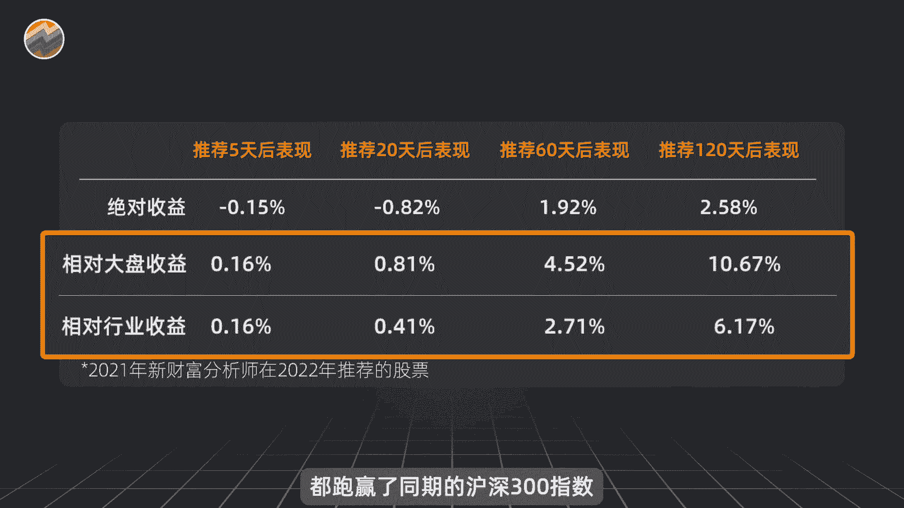

这个数据也证明了，21年的新财富分析师们推荐的股票，确实可以帮助能在22年获得超额收益。

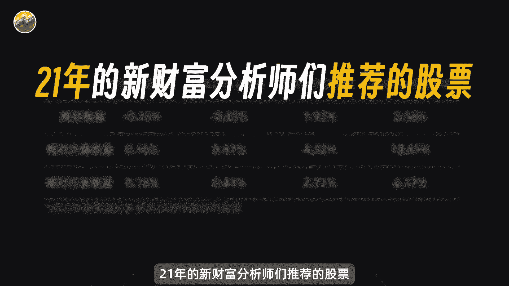

而且说实话这个收益超出我的预期啊，当然我们这里只看了一年的数据，可能具有偶然性，其实我们可以看过去每一年的新财富。

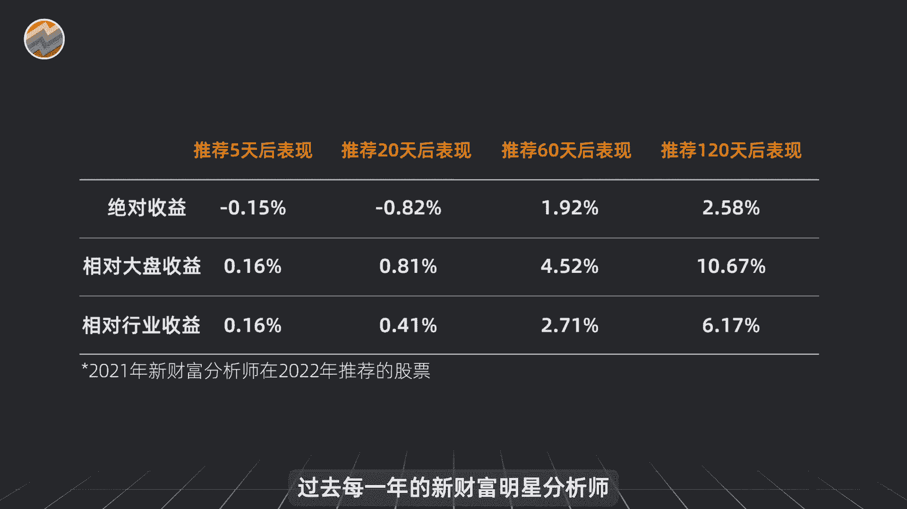

明星分析师在第2年推荐股票的表现，限于视频时长，我们这边就不一一展开了，大家如果感兴趣的话呢，可以多多点赞，点赞破3000的话，我们就做一期视频，展现所有的数据。

并且基于这个结果，给大家介绍一个完整的量化投资策略，这边也可以给大家透露一个小秘密，我们在自己实盘的策略当中，既有一些策略是基于这些分析师推荐的股票。

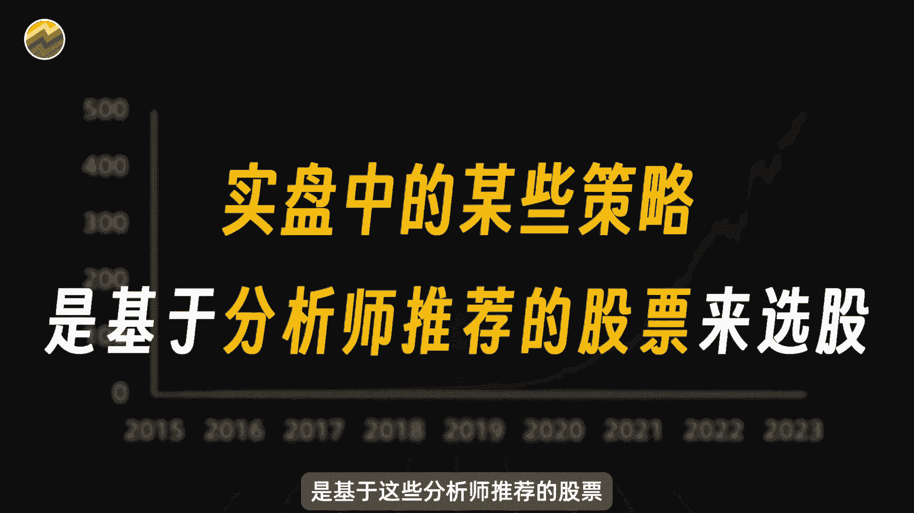

来选股的，大家也可以从中明显感受到，我们量化投资的一个思路。

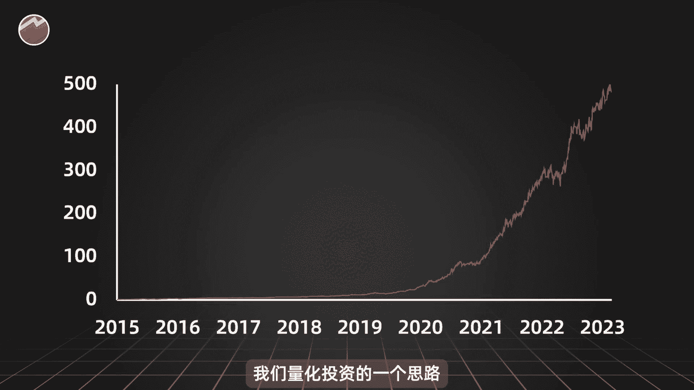

我们有的时候并不需要通过各种财务分析，技术分析来构建模型，知道哪些股票为了来回上涨或者下跌。

而是我们通过量化的方法，找出这个市场上面经常做错的人，跟他反着来，或者找出那些经常做对的人，跟着他来，我不需要保证每个分析师推荐的股票，未来一定会上涨，但我只需要保证他们整体是有效的。

那么同样可以得到一个优秀的投资策略。

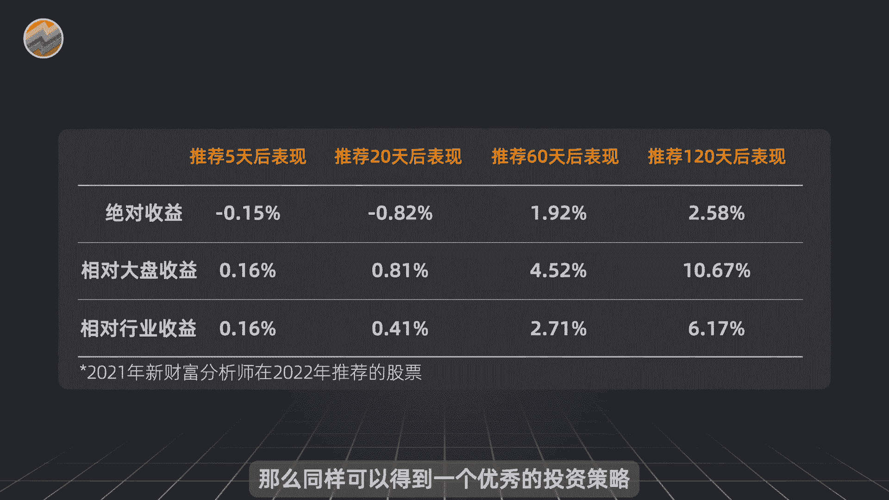

好希望以上的分析呢可以给大家带来一些启发，另外其实啊关于分析师这个行业，还有很多的细节我们可以去了解，也只有了解了这些内容，我们才能更好的基于分析师的荐股数据，来构建量化投资策略。

为此呢我还特地请过分析师的朋友，给我的朋友圈好友，介绍过一些分析师行业的内幕和见闻，比如说我们分析师他如果想推荐某个股票的话。

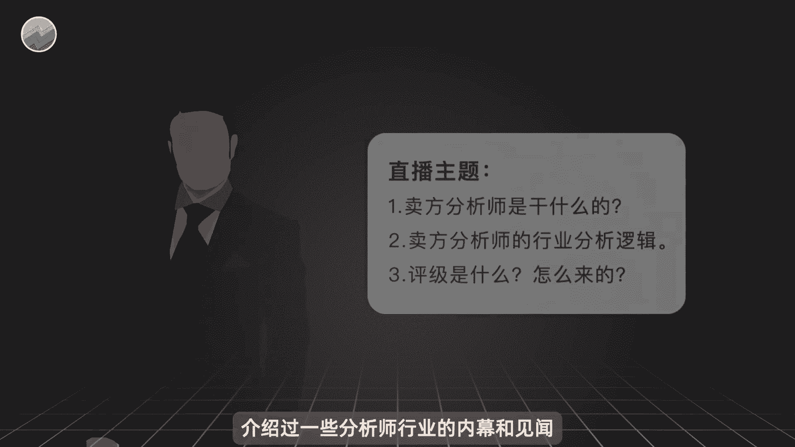

他在第一时间并不会去发布相关的研报，而是优先会在自己的客户交流群里面说，或者直接私信给他服务的基金经理。

甚至呢在和基金经理一起泡脚的时候，就把信息给传递了之后啊，才会发布相关的研报，甚至这些研报都是他们的助理写的，所以说当我们看到研报的时候呢，信息已经有一定的滞后性了。

但即便如此，大家也看到了这样的信息，仍然能够产生超额收益，所以说不要抱怨信息的滞后性，滞后的信息也有价值，关键就看使用这个数据的你到底会不会用，那么关于分析师其实还有很多其他类似的事情。

大家感兴趣的话呢，可以多多点赞，有机会我们可以之后再分享好。

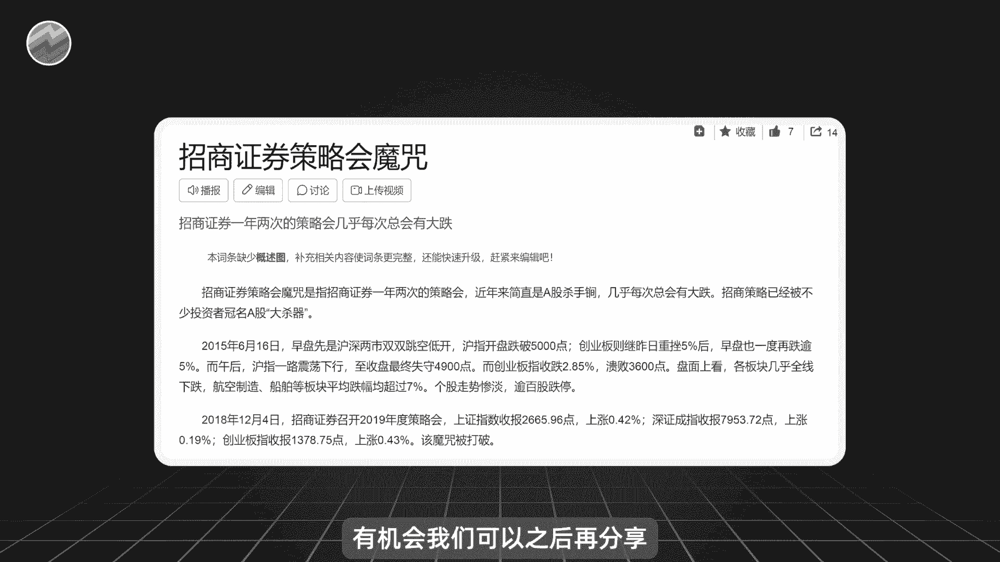

那么本期视频就到此结束，如果觉得视频对你有帮助的话，感谢大家的订阅和点赞。

