# 财务指标别乱用,实盘回测亏成狗？如何量化价值投资？财务指标，多少人用错了？价值投资新阶段：质疑量化，理解量化，拥抱量化？【量化投资邢不行啊】 - P1 - 量化投资邢不行啊 - BV1L4421S7Ju

你是一个坚定的基本面投资战士，在全球最大知识付费平台A股经营多年，坚持学习，早已博古通今，从数字孪生到母猪生产，从AIGC到白酒酿造，从量子通讯到卜卦算字，不艺不精，但你却一直有一个困扰。

明明你觉得你的选股逻辑清晰，在各类财务指标加持下，选股策略也无懈可击，但实盘中却一直亏钱。

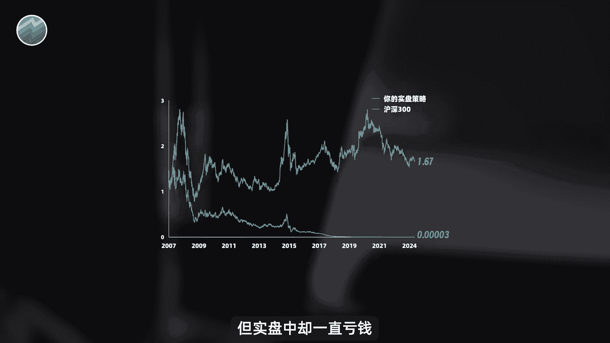

这不最近你选到的行业龙头兼基本面，大蓝筹的股价又腰斩了。

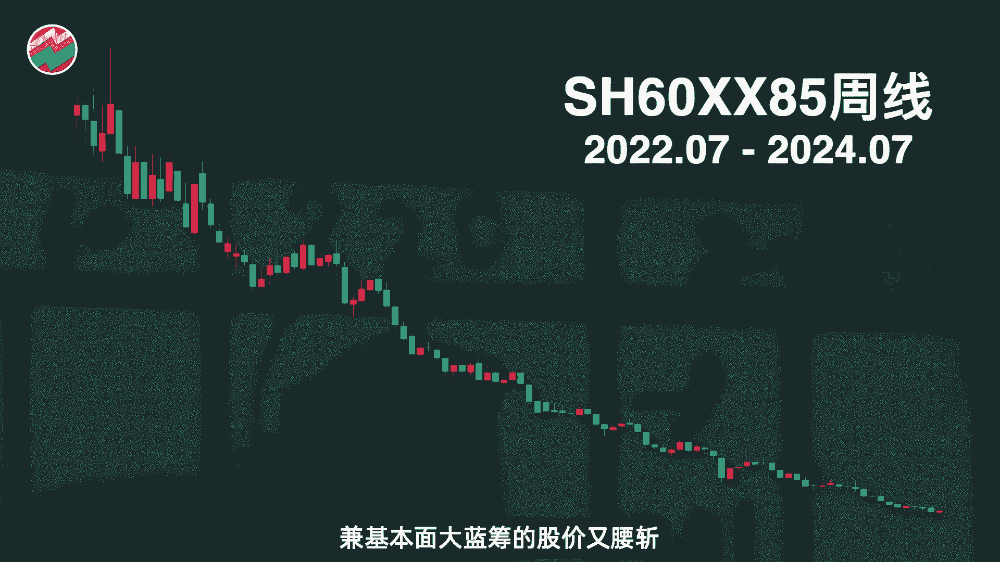

你又又又又亏钱了，这两年送外卖的积蓄都被深深套牢，你百思不得其解，到底为什么会亏。

大家好，我是专注于量化投资的，行不行，做价值投资的朋友，应该都有过和前面类似的赚钱经历吧。

很多时候看股票的基本面明明非常优秀，按照财富指标，把最最最最最优秀的公司都选了出来，但怎么一买还是会亏呢，到底是被庄家盯上了，还是自己学艺不精。

其实啊要提升你策略的成功率很简单，在你投入真金白银去实盘之前去做一下回测，看看你的选股指标，在历史上表现到底是什么样的，如果这个策略在历史上表现都不好，那也就没有实盘的必要了。

甚至你借助一堆财务指标去选股之前，你就应该去做回测，用全部的历史数据去检验，你用的财务指标是否有效，它的规律又是如何的，只有这样，你才能更好的运用你的价值知识，选出真正符合你选股逻辑的股票。

那该如何对财务指标和策略进行回测呢，其实也很简单，没有你想象的那么难。

本期视频呢，我们就会带着大家主要的财务指标类型当中，选出最具有代表性的几个。

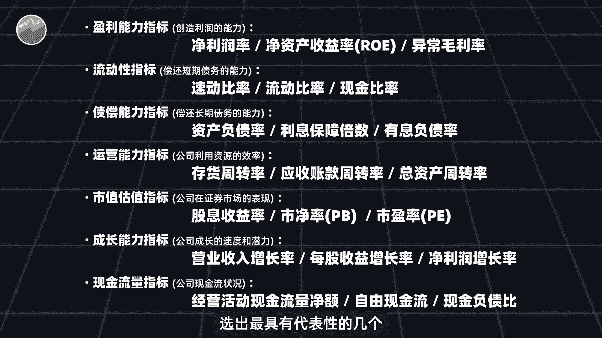

去测试这些指标在选股当中是否有效，揭示他们的正确用法，当然啊，因为时间关系，我们无法在视频当中展示更多的指标测试结果，但我们将其他一些常用的财务指标的效果，也都汇集整理到一张表格上。

上面不仅有每个指标的构成公式和用法，还有他们的选股效果，我们把这张表格和回测，用到的一系列数据和代码，都整理到一个合集当中。

如果你感兴趣的话呢，可以加屏幕右下角或者置顶评论区，我的微信都是可以直接免费发给你的。

那话不多说，让我们开启今天的回测之旅。

首先呢我们在所有指标当中来测试一下，市盈率这个指标。

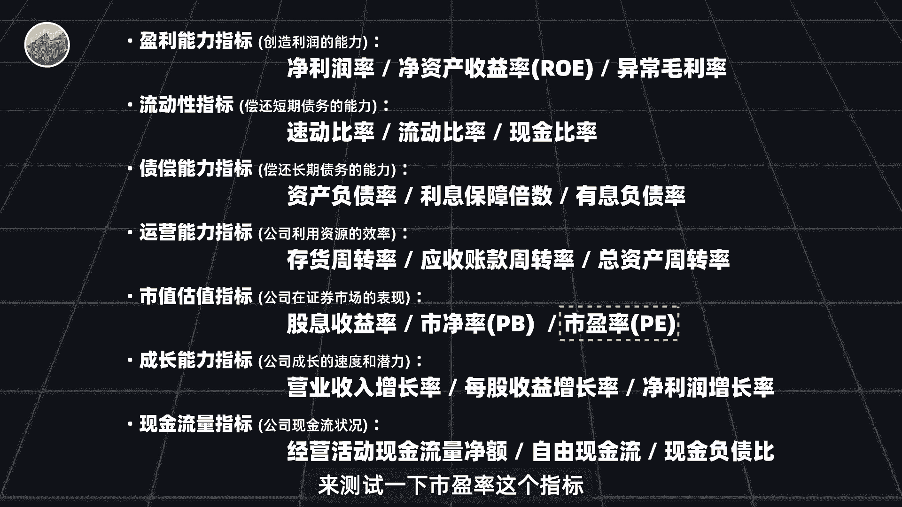

这应该是最重要也是最一个财务指标了，它的计算公式呢是这样的，由市值和净利润构成。

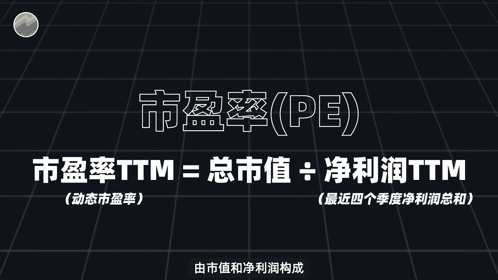

非常的简洁明了，这个指标想必不需要我多做解释了，它真的很常见，默认显示在所有的行情软件当中，99%的价值，投资者都会用它去判断，股票是否被高估或者低估。

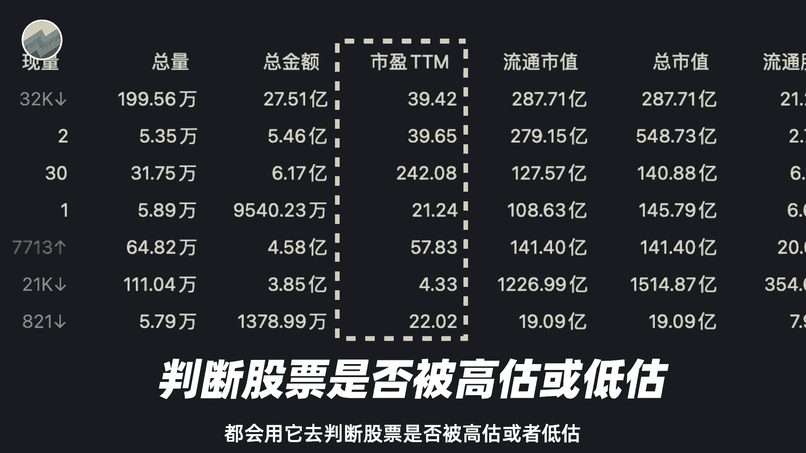

我上学的时候呢，老谢也告诉过我们，率越低的股票代表它的估值越低，它越便宜，那么未来上涨的概率也就越大，那我们呢就可以尝试去构建一个，买市盈率低的股票的量化选股策略，看看低市盈率这个指标。

能不能帮我们选到赚钱的股票。

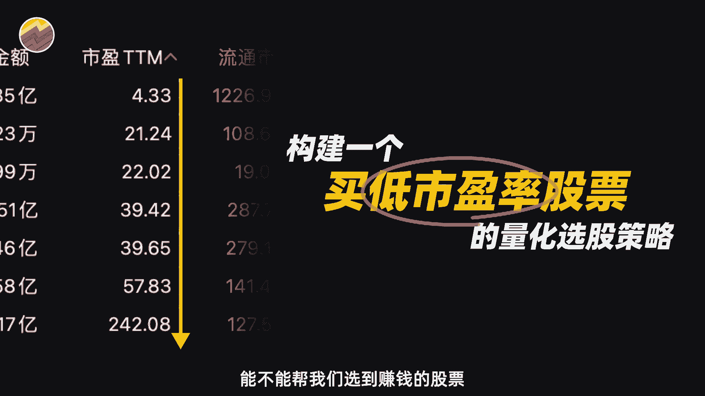

相关策略呢也很简单，假设我们在每个月的最后一个交易日结束之后，计算出每个股票的市盈率的倒数，并且从大到小进行排序，这里我们用倒数呢，是为了避免出现有公司净利润恰好为零的情况，导致无法计算出相应的市盈率。

然后啊，我们删除掉那些当时s st退市或者停牌的股票，上市不满一年的股票呢也删除，再去挑选出此时市盈率倒数，排名最大的十只股票，然后在下个月的第一个交易日的开盘，去均仓买入这十只股票。

并且呢会一直持下个月一整个月，直到下个月的最后一个交易日收盘，把它全部卖出，并重新选择下个月6月市盈率最低的十只股票，并且呢在下下个月的第一个交易日去买入。

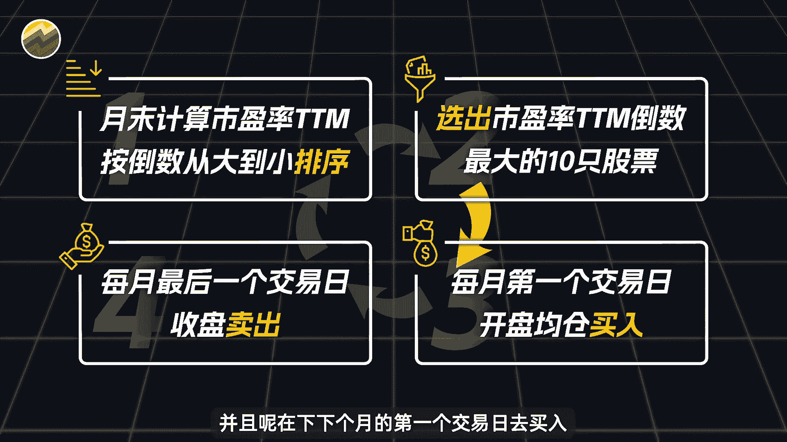

如此循环往复，比如说途中，我在2024年的3月29日这一天，在所有的股票当中选出了这十只，因为他们是在此时此刻率最低的十只股票，那么我就在下个月的第一个交易日，也就是4月1日去买入他们。

并且一直持有到4月30号这一天卖出之后呢，重新选择符合条件的股票，那么就是这样一个简单的量化选股策略。

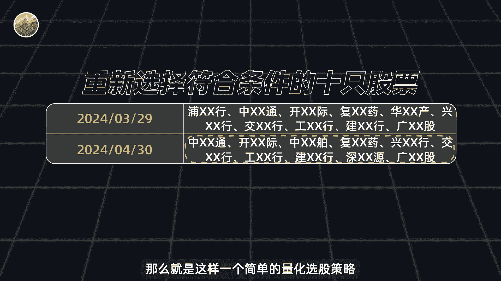

这从一开始我投入一笔钱去交易，这个策略最终是会赚钱呢还是亏钱呢。

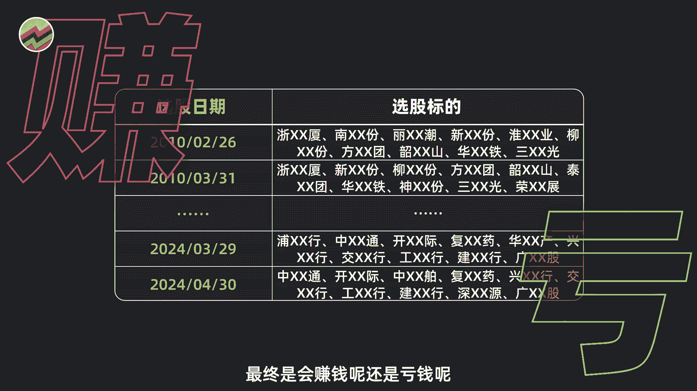

那要验证我们这个实验的想法，就需要借助全部的历史财务数据和Python代码。

那么相关的数据和代码，我都已经帮大家准备好了，你只需要打开这个PY后缀的我文件，点击运行就可以看到结果，如果你需要这个数据和代码的话，可以加屏幕右下角或者置顶评论区。

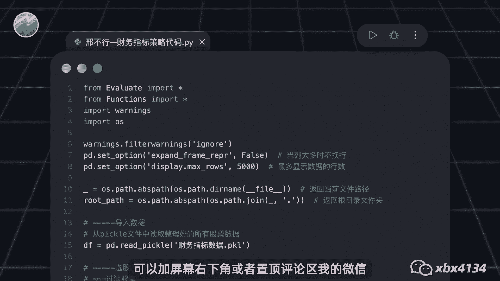

我的微信都是可以直接发给你的，程序运行结果呢就如图所示，代表策略的橙色曲线，从最初的一块钱变成1。9元，年化收益不到5%，仅仅略微跑赢了代表大盘的沪深300指数，并且最近几年啊明显策略表现不佳。

看来啊只通过低市盈率这个原则去炒股。

它的收益更应存款差不多，但是呢风险又极大，非常的不划算，然后呢，既然我们探究市盈率这个指标，就要深入去研究它，所以我们不仅仅构建了上述策略，还测试了每个行业。

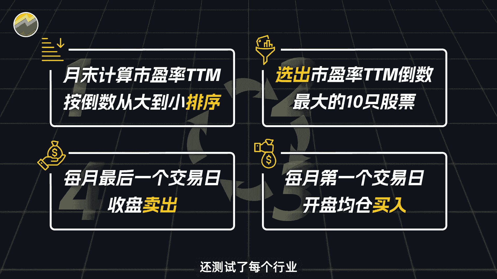

去买市盈率最低的一个股票的策略，结果呢是这样子的，表现也没有好到哪里去。

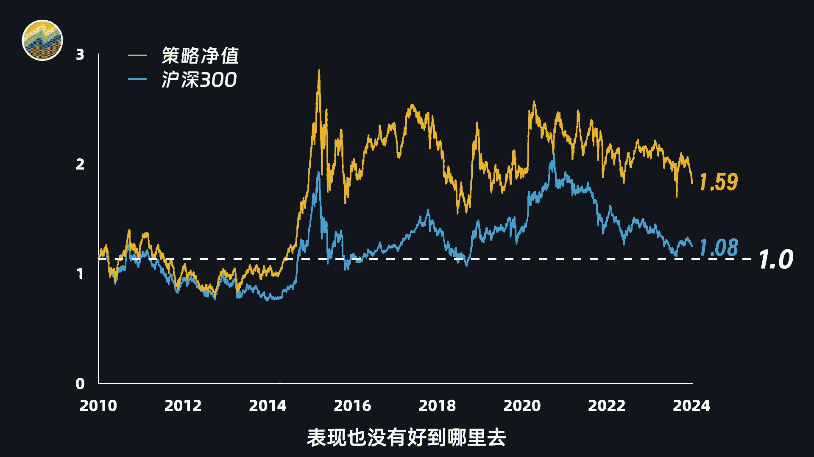

甚至呢我们还按照市盈率的倒数，对股票从大到小进行排序，构建了十个不同的选股策略，分别去买入排名最大的前10%，前10%到20%。

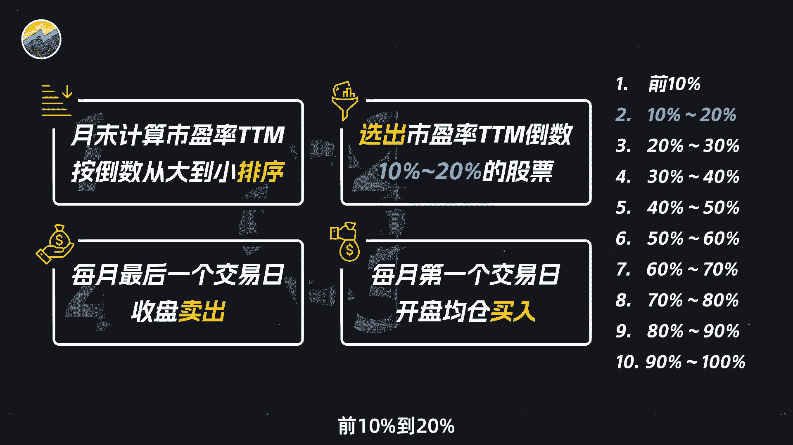

20%到31%，直到90%到100%的股票，借此对比不同市盈率区间的股票的表现。

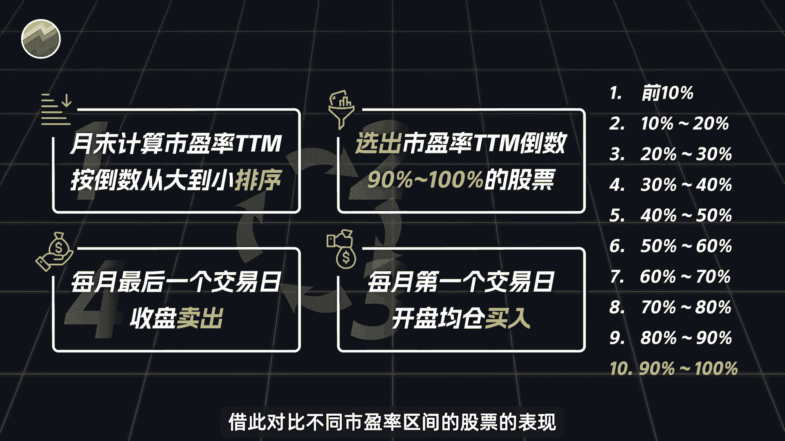

存在什么样的规律，结果是这样的，高市盈率组合的股价表现确实会相对更差，但是市盈率低的股票表现也不是最好的，所以看来一味追求低估值并不可取，只要股票的估值在合理的区间范围内就可以了。

这多少与我们市场上听到的一些前人经验。

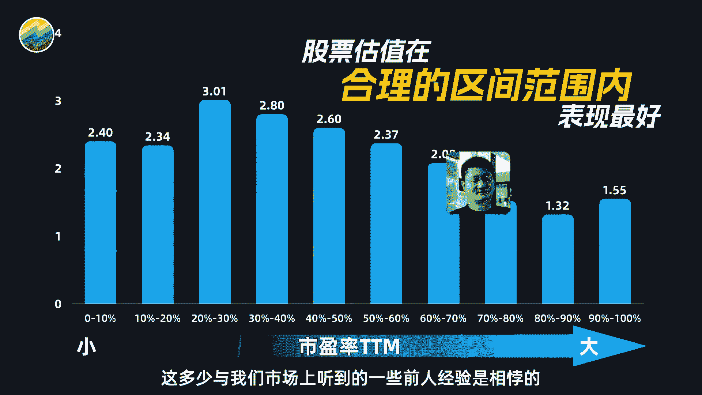

是相比，那么关于市盈率更具体的内容呢，我们之前其实专门出过一期视频聊过。

感兴趣的话呢可以去看一看。

然后除了市盈率之外呢，我们也可以去测试一下，其他价值投资者常用的指标的效果。

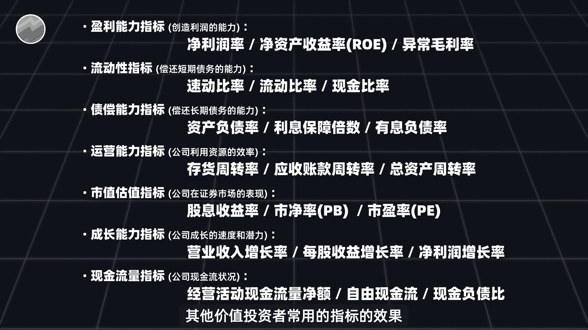

比如说净利润的同比增长率，净利润增长率这个指标想必也不用我多做介绍，只要是炒股的，就没有不知道净利润的吧，所谓净利润呢，就是可以简单地理解为公司扣除成本，交完税之后赚到的所有钱，需要注意的是。

我们这里说的增长率呢是同比数据，也就是说今年的净利润，和去年同期的净利润数据去做对比。

比如今年年报的净利润，对应的是去年年报的净利润数据，接下来呢我们还是和之前的一样。

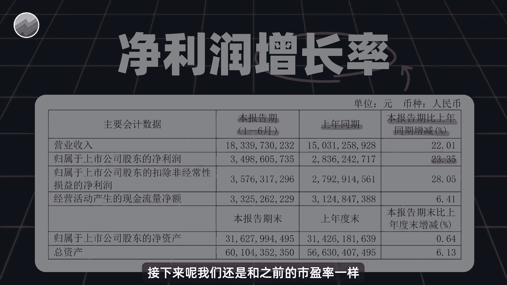

去构建一个相应的选股策略，只不过呢我们在选股条件这里。

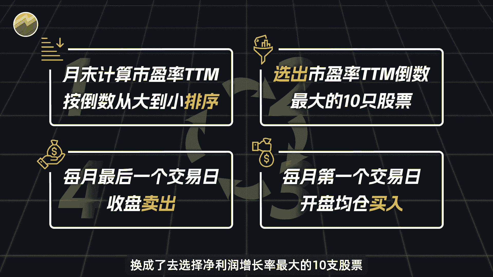

换成了去选择净利润增长率最大的十只股票，其他条件呢则一律不变，同样还是借助之前的Python代码。

只要稍微修改一下，点击运行即可，在看程序运行结果之前。

先插一个题外话，很多人问我小白如何入门量化投资，有什么资料分享，所以呢我特意为大家准备了一个量化投资。

新手学习的大礼包，你打开这个文件，它包含非常多的内容啊，首先这个word文档呢是我们自己总结的，量化投资学习路径很适合零基础的新手，让你知道自己一步一步需要达到什么样的阶段，看完学习路径后呢。

就可以通过我整理的量化文章合集，来更全面的了解量化投资到底是什么，然后呢，我还精选了适合各个学习阶段的策略研报合集，正如我一直说的，量化研报是很好的，量化实践项目，深度研报可以显著提升你的量化水平。

还有这一份代码呢，则适合所有喜欢技术指标的人，你可以跟着教程轻松计算出所有的技术指标，并测试这个指标是否有效，如果你有一定的基础，你还可以尝试回测一些策略，我为你准备好了十几个不同类型的经典策略。

和他们的代码，相信总有一个适合你自己去魔改开发，运用到实盘，当然最后也是最关键的，量化的基础就是准确的历史数据，我会送你一份股历史日线数据和一份财务数据，你可以用它来像我一样。

去测试所有的技术指标和财务指标，以及大部分的策略，所以这个大礼包的内容真的非常的丰富啊，如果你需要的话呢，可以加屏幕右下角或者置顶评论区。

我的微信都是可以直接免费发给你的，好我们回来看程序运行的结果，程序运行结果呢如图所示，代表策略的橙色曲线，甚至连代表大盘的婚300指数都没有跑过。

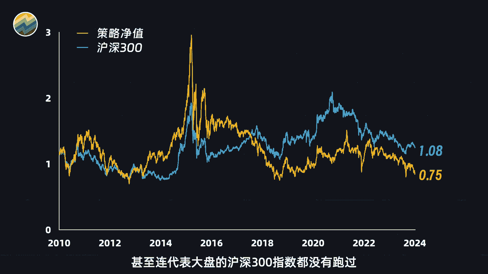

跑了十多年，竟然最终还倒亏了钱，我们也同样测试了选择美行业，买净利润增长率最高的一只股票。

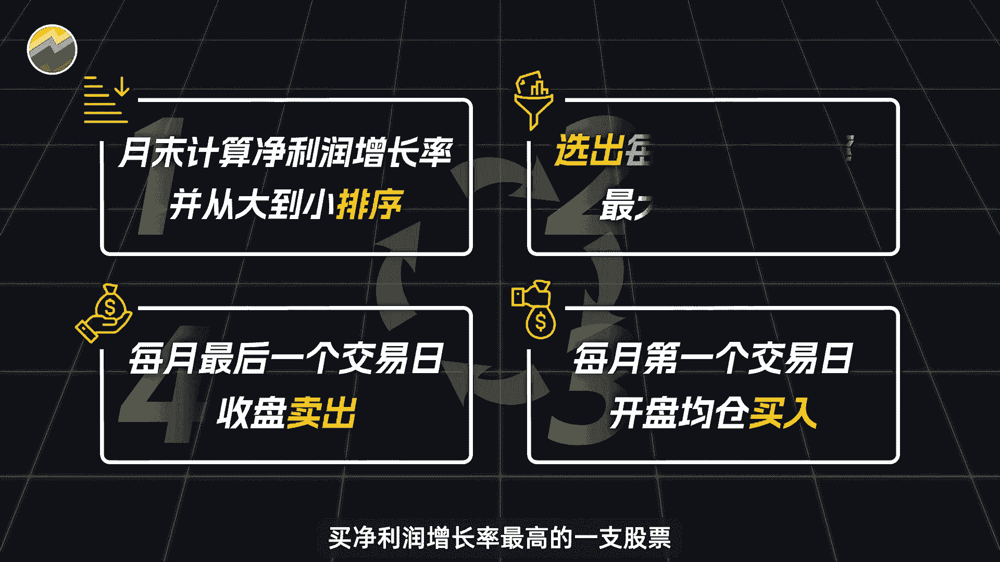

结果呢是这样子的，相比之前啊确实有所改进，也实现了正收益，但年化呢只有3。48%，还是无法令人满意，我们甚至也对净利润增长率做了分组统计，结果是这样的，可以发现，净利润增长率高的组。

确实表现会比低的组要好一点，但他也不是越大越好的，公司的增长率太高，也有可能会被市场所认可，至此呢，我们给大家展示了两个常见的财务指标的测试，结果，发现单单用这两个指标去选股。

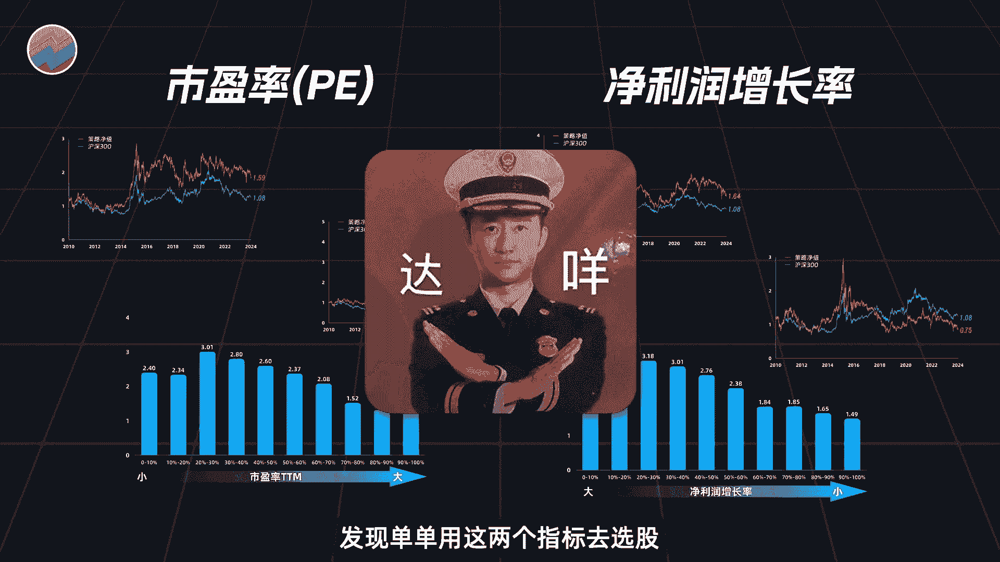

效果都比较一般，但是啊，这并不能说明单一的财务指标就是无效的，我们曾经也分享过一些比较有效的财务指标。

比如说现金比率异常毛利润等，又比如比如说避雷用的有息负债率等。

我们自己实盘策略当中，也会大量使用一些财务指标，往往啊有些财务指标单独使用的效果呢，并不是很好，但当他们和其他财务指标或者其他策略，结合起来的时候，往往就会有奇效，那又该如何将财务指标结合使用呢。

其实也很简单。

我们之前有一个系列视频里面，复现了很多国外投资大师的策略，并将它们移植到A股使用。

就发现这些策略表现大多都是不错的，而这些策略本质上就是通过各种财务指标，来进行基本面的选股，只不过呢他们同时也是一个量化选股策略。

大家可以按照这个策略的思路去尝试复现一下，又或者有一些自己的基本面选股策略，可以尝试着先去量化回测它的历史表现，毕竟啊在历史上面表现现一般的策略，未来表现好的可能性也不大。

在你的策略真金白银开始实盘之前，可以先去进行量化回测。

这样可以帮你避免很多不必要的损失，当然如果你不知道用哪些财务指标，去形成自己的策略，也可以加屏幕右下角或者置顶评论区，我的微信问我要了财务指标的测试汇总表，看看指标们的效果，当你有了自己的策略后。

也可以借助我们资料中的选股代码。

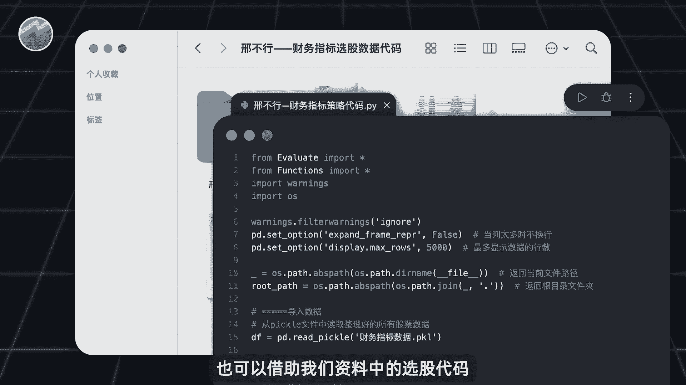

尝试着去回测一下自己策略的效果好，那么本期视频就到此结束，感谢大家的点赞。

收藏投币和转发。