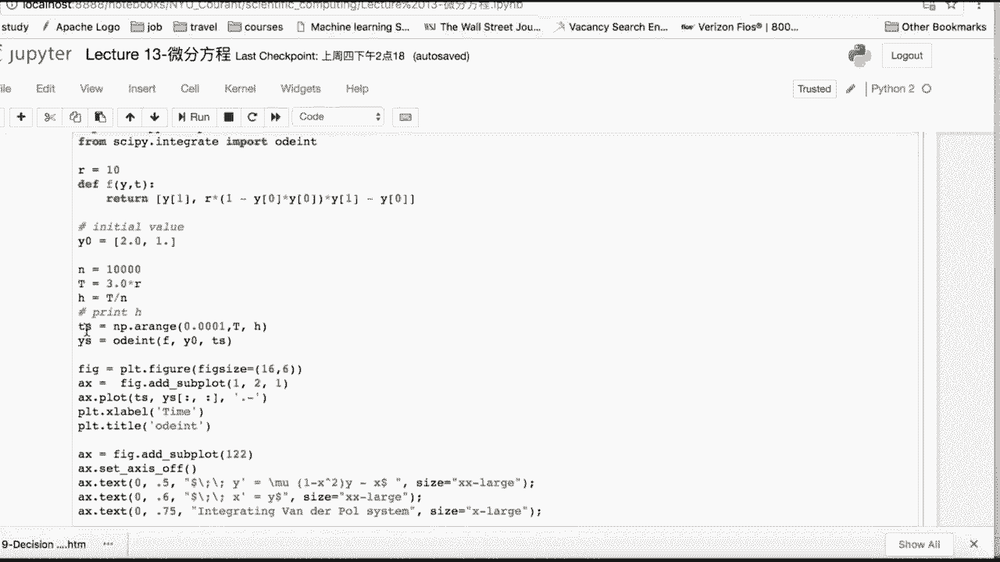

# 吹爆！这可能是B站最完整的（Python＋机器学习＋量化交易）实战教程了，花3小时就能从入门到精通，看完不信你还学不到东西！ - P27：第27节 Python for ODE PDE numerical methods (Python for 偏微分方程数值解) - 凡人修AI - BV1Yx4y1E7LG

大家好，欢迎收听第13节课，Python for微分方程及量化的应用，那么本节课呢是比较独立的一个课程，跟别的课程之间呢是一个先前先后衔接关系，也就是说我们之前讨论完机器学习之后呢。

我们本节课呢我们会使用微分方程来解，我们的啊期权的定价，那么之后的第十四十五节课，两节课呢我们会通过另外一种方法，也就是monte color simulation的方法来进行期权定价。

那么我们本节课呢是通过期权价格的满足的，偏微分方程来推啊，来推导他们的价格。

那么首先呢让我们来看一下本节课的大纲，我们本节课呢介绍呃，偏微分方程和常微分方程的数值解，和在Python上的应用，那我们首先呢，我们会先提出这个ODE的三种方法。

第一个是这个for our selection，那第二个呢是BACKCOURT，那么第三个呢是两个的折中，就是crank nixon方法嗯，也就是向前向后跟CN方法来解ODE。

那么我们第三块呢我们会介绍pd的三种呃解法，那么对应的ODEE的for all BO跟quick nixon，那么我们就有这个显示影视和这个CN方法，QUANNIX啊，来解这个PDE。

那么我们介绍完PDE之后呢，我们主要的目的是为了解这个期权定价的偏，微分方程，所以呢我们第四块，我们会对期权简单的期权进行介绍，包括期权的定义，期权的pay off收益，以及期权的定价公式是怎么来的。

那么第五块呢我们会着重介绍偏微分方程，期权定价的例子，那我们会在Python上实现，我们会利用我们前面这个PDE的三种方法，也就是显示影视跟crack nixon。

来解我们的那个欧式集权以及barrier option，这两种option的这个定价，并且我们会分析解的稳定性。

那让我们来看一下常微分方程解的形式，首先我们有常微分方程，我们首先得有两个东西，第一个呢是它的微分形式，第二个是初值解，那我们来看一下这个微分形式，也就是Y的一阶导呢等于啊变量。

那么变量里面呢可能是这个有行T的，跟Y的共同包含，那有可能呢，这FT逗号Y呢可以直接分解成FT呃，一个GT乘以HY，那如果可以分成这样的形式的话，那么直接把这个HY移项之后。

两边同时积分就再加上这个初始点条件，就可以直接解除这个ode e的显示解，那么在我们理想情况下呢，上述的条件呢，也就啊等同于我们下面的这样的一个表达式，因为我们左右两边如果同时对T求导。

那我们就会得到Y1撇，等于里面对T求导呢就是上面的这个FTY，所以上下这两个式子是等价的，也就是说ft t逗号Y呢，如果跟Y啊是这个独立的，那我们直接这个FY呢，就FFYT就可以变成FT。

那么直接在这个T上积分，这个时候的这个ODE呢就呃非常的好解，那么如果它跟这个T是independent的，我们把这个称为是一个这个自主性的，这个常微分方程，也是常微分方程里最好求解的一种形式。

那如果没有下述这么好的这样的一个情况的话，我们如下呢有几种变体，第一种是如果常数数方程是一个向量的形式，那么我们这个时候就加粗体，那么形式呢跟我们上面这一页slice是一样的，只是上面这是一个标量。

然后我们下面呢这是一个向量的形式，那有时候我们如果要求N阶的这个ODE，我们呢可以把它换成上面的这样的一个，向量形式，我们可以令这个向量Z呢就等于这个gt接，那这个时候限量接其实是Y呢。

从Y自己本身到Y的一阶导，二阶导，so啊sofa sofs直接到这个N减一阶导，那么呢这个JJT呢，就是如下这样的一个表达式，那我们依旧会满足Z的一阶导会等于GZT，那我们对上面的这个变体呢。

再进行这个常微分方程求解即可，那在这个常数方程中呢，我们在finance里对这个black shequation，可以进行求解，special equation呢，也是我们后面要解这个ODE的时候。

大家会看到的这样的一个equation，它的意思就是我们期权价格对时间的导数呢，就会等于这样的一个线性组合，是啊，这个股1/2的这个股票的波动率的平方，那再乘以呢。

我这underlying asset也是这个股票本身，它这个价格的平方，再乘以我这个期权对于这个股价的二阶导，然后呢再加上这个是我们无风险利率乘以股价，乘以呢，我这个期权对股价的一阶导。

再减去无风险利率乘以我这个期权本身的价格，我们会满足这样的一个导数关系的equation，那么这个其实是一个偏微分方程，那是我们可以通过这个拉普拉斯变化，也就是对我们的这个期权价格。

进行一个拉普拉斯变化，就是如下这样的一个乘以一的负载，T在零到正无穷上的一个积分式，那我们就是可以把上面的这个偏微分方程，换成如下的一个这样的一个，常分方程的一个表达形式。

那么对于如下这样的一个表达形式呢，我们在解上面的这个ODE即可，那么解解这样的一个方程，我们要用到的，当然不是我们的这个精确的数学解，因为大部分的长微分方程数学写，要不然非常的麻烦。

要不然是几乎没有办法求出它的解析形式，那我们可以考虑，我们使用我们的这个数值方法嗯。

那在数值方讨论数值方法之前呢，我们得确定我们的解是存在的，那么下面的这个东西只是一个纯粹数学理论，同学们听一听就好了，只是呢就是说有一个basic的一个idea，就什么时候常微分方程解释存在的。

我们有如下这样的一个皮卡德理论，我们说的是呢就是这样的一个函数，那么在这个初值点是我们上面提到过的啊，偏啊，常微分方程数值解的这个B包中，那么如果关于Y呢是这个连续一致，并且满足LIPC制条件离谱。

实际条件说是什么呢，说是它的这个导数啊，它这个导数的两个点，就是当两个点特别靠近的时候，导数对减，取一个这个模会小于等于某一个固定的，一个很小的INSNOW，这就是一个lip c值条件的啊。

那么在满足这个条件的情况下呢，我们的这个平呃常微分方程，就在这个初值点的B包中有唯一的解，那么这是我们皮卡德理论说的一件事情，那我们大部分的这个方选呢，都会满足这个连续抑制里皮质条件。

所以我们大部分的长安分方程。

就是关于这个初值解解呢都是存在的，那我们下面介绍一下，我们这几一些比较常见的，常微分方程的数值方法，那么由于呢我们大部分难以求出我们的解析解，所以呢我们得使用数值方法来求解，我们的常微分方程。

那么在这里我们只讨论这个有限差分法，也就是finite different methods，那么我们还有别的解ODE的方法，比如说这个finite element method。

还有the special method，也就是谱分析，那我们这里呢不考虑这两种解决方法，那其实呢不管是对于这个finally different method，还是这些方法，它们方法之间的唯一区别。

就是每一步迭代的时候应该是如何update的。

那么我们这里介绍一下，我们有限差分法的这个update流程，首先呢我们得生成我们想要查找的解的点，的一个网格，比如说我们我们有两个变量，一个是YY本身，一个是我们上面看到的那个T。

那我们就得生成一个二维的网格，关于Y跟T那我们细分这个网格，我们会利用有限差分来替代，我们偏N分方程中的导数，然后将这个偏分分方程和长而分方程，转换成我们的代数方程组，然后我们利用我们高等代数的知识。

我们求解代数代数这个方程组，当然求解的过程呢不需要我们自己用手算，我们可以调用我们的这个计算机的代码，那么这个有限差分法的好处呢，就是因为我们每一步的这个有限差分，都是可见的，所以我们可以直观的。

而且分析的可以进行检查，并且进行这个sensitivity，也就是敏感性分析等等。

那我们来先看一下我们的这个向前欧拉的方法，也就是最常见的，也最符合我们的这个intuition的一个想法。

首先让我们来看一下向前欧拉方法，那么向前欧拉方法顾名思义呢，就是当我们来替代Y的一阶导数的时候，我们的step是look forward的，首先我们由Y的这个一阶导等于FTY。

那我们把Y的一阶导呢用差分的形式来表示，那就是Y的第N加一个点，减去Y的N个点除以H，那因为H是一个很小的啊，step那因为呢我们这是向前的方法，所以呢我们要保证，当我们把Y的N次方放都放到这个左手。

右手边的时候呢，这边仅留一项Y的N加一，所以我们把FTY呢用第N步的，就是之前这个步步数得到的这个，tn跟YN代入，那我们可以得到如下这样的一个表达式，因为呢我们这个方法呢是显示并且是向前的。

所以我们每一步对YN加一的迭代，我们只需要用到第N步的状态，也就是YN跟tn，所以呢我们是我们这个向前方法是显示解，我们不需要去解方程，所以向前方法呢，在进行这个数值计算的时候是最方便的。

那这边呢我们看一下一个向后方法，就是向后方法呢也称为一个影视方法，因为我们这个左手边对于这个Y的一阶导，我们依旧使用啊，跟这个显示方法一样的差分形式来表示，但是不同的地方是右手边的这个方程里面。

我们不再用第N时刻的状态，我们用的是现在current的状态，就是N加一时刻，所以我们把TN加一和YN加一代入，那我们得到如下这样的表达式，我们可以发现呢等式左右两边都含有YN加一。

所以呢我们要通过YN来得到YN加一的值，进行向前一步的这个计算的话，我们需要解方程，所以对于这个BACKO的方法，也就是implicit影视方法呢，我们呃对于每一步的这个YN的迭代，我们都需要解方程。

所以然后如果这个方程是非线性的，那么解起来呢会更为困难一些，所以这个是它跟这个显示的区别，那么优劣也是显而易见的，那为什么我们解这个BACKCODE这么麻烦，我们依旧有这个BACKCODE的方法呢。

那是因为by code解出来的解，是比这个forward更稳定的，那么我们后面会说，那我们在两种方法之间折中的话，那就是这个crank nixon方法，我们crank nixon方法呢左边跟我们的呃。

这个向前跟向后都是一样的，这样的差分形式，那么右手边呢我们是我们选择对这个显示解，也就是FTNYN和这个影视解，FTN加一和YN加一呢取一个平均，那我们就得到得到如下这样的一个推进式。

那么对于quack nixon来说也是一样的，跟BACKROD都要求这个啊方程组的解，那我们接下来讨论一下我们常微分方程。

这三种方法的这个一致性，稳定性，还有收敛性，因为当我们解了方程之后呢，我们不但是care，我们的这个方程的解在什么位置上，我们依旧需要，我们依旧需要讨论我们这个方程解是否啊稳定。

因为如果方程解不稳定的话，更有可能我们有一个小小的扰动，我们的方程的解就从比如说100变成了1万，那这样的话我们这个解就不robust，也没有任何限制啊，这个就是现实意义了。

所以呢我们要讨论就是我们的这个嗯，Finite difference method，也是有限差分方法，我们的方法到底有多准确，也就是我们跟这个真实的解之间的差距有多少，然后我们的解是否是收敛的。

那为了得到我们的准确的解和收敛的解。

那我们最佳的步长就是前面的这个H。

那应该选择多少呢，首先我们先引入一个截断误差的概念，就截断误差的概念是呢，我们真实的这个嗯欧拉值，就是Y的这个TN加一的值呢，跟我们之前的这个拟合，他的这个值之间的差距到底有多少。

那么截断误差关于这个H的这个无穷小量，如果越高的话，那说明我们的截断误差呢也就越小，那我们在这边呢先把显示解带入，我们知道呢显示解嗯，显式解的F呢，我们带的是TN跟Y的这个T的N次方。

也就是第N步的这个结果，那我们对这个Y的tn加一，可以把它拆成tn加上一个H的一个步长，那我们对它呢在TN处进行泰勒展开，泰勒展开，我们只展到二项嗯，展到二项是因为一项之后呢是可以被消掉的。

二项之后就无法被消除了，所以我们写成嗯H方，这个是第三项，那么第四项呢，我们就写成OH3次方的高正无穷小量，那我们可以发现前面的这两项消除之后，我们可以得到如下这样的一个表达式。

也就说明我们这个显示解的这个阶段误差嗯，是这个H平方的高阶无穷小量，并且呢是一个平方乘以Y的这个二阶导，那这边呢我们通过上面截断误差的分析，我们在这里呢可以啊阐述一次性呃，一致性。

包括我们这个向前的这个方法呃，的一致性是否是充分的，我们可以说呢，这个我们的这个欧拉方法是一致的，当什么情况呢，当我们的这个截断误差是跟我们的step size，是同时趋向于零的。

那我们可以看到前面的这个我们的向前方法，当我们这个H趋于零的时候，我们的截断误差确实是趋于零，然后我们的这个区域零的阶数呢是二。

所以我们可以称我们上面这个向前方法，我们的一致，我们这个一致性的order呢是to，所以我们这个欧拉方法的consistent，都是with second order的，那我们当我们的这个欧拉方程。

满足一致性的时候，是否就满呃，是否就这个完善了呢，嗯结论是否定的，就是说如果我们的Z欧拉方程是consistent的，是一致的，它一旧呢条件不够，为什么，我们来看一下如下这样的一个例子。

非常简单的一个例子，是Y的一阶导等于这个拉姆达乘以YT然后呢，他的这个初值条件给出，那我们来解这个欧拉方程，那我们可以通过这个迭代的这个方法，我们可以解出Y的N次方，是等于一加拉姆达H的这个N次方。

那我们可以发现呢，我们的这个方程解是什么情况下，指数爆炸呢，就是当一加上拉姆达H绝对值大于一的时候，比如说当我们这个拉姆达取负时，H取取取这个0。25，那这个时候呢我们这个方程解的绝对值。

我们这个这个位置绝对值就比一大了，那我们是一个指数爆炸的，但是他的这个拉姆达等于十的这个exact solution，我们知道是YT等于E的拉姆达T，那这个时候把拉姆达等于十代入呢。

其实它只是这个指数递减的，并不是指数爆炸，所以这个答案跟我们这个真实的这个理论，答案呢就相悖了，所以我们有这个一致性，还并不能够满足，我们的这个向前方法呢是稳定的。

所以我们在这里提出这个stability，就是他是什么时候，关于我们这个初值点是稳定的呢，是如下这样的一个条件，这个条件其实跟离普西斯条件非常类似，它是说呢我这个两个点。

那这个点的N次方的这个差的绝对值呢，要小于等于初值点的差的绝对值，再加上呢我们在这一整个区间上，截断误差的最大差值，那么如果我们满足这样的一个条件呢，我们的解呢就是稳定的，那当呃我们对于这个常微分方程。

我们有一套理论，也就是说当我们满足一致性就是consistent，并且呢，我们满足我们之前提到的这样的一个条件，就是稳定性呢，我们常微分方程的解就是收敛的，所以这个时候对于我们的向前欧拉方法。

我们就要求我们的这个一加上拉姆的H，必须小于等于一，也就是拉姆达呢，必须在零到这个负的二分之拉姆达之间，那如果我们的步长满足这样的一个表达式的话，那我们的向前欧拉方法就是稳定的。

所以呢我们可以称我们的这个向前向前，欧拉方法是一个条件条件收敛，也就是说，我们的这个步长必须满足某某一个这样的情况，我们的我们的这个解才是收敛的。

那我们接下来看一下对于绝对稳定性的定义，也就是说绝对稳定性的，比相对稳定性的条件要来得强，它对我们这个步长的要求呢来的比较小，也就是我们缓解这个一加浪达H小于等于一，如果我们解出。

就是说呃什么时候我们称为UN肯定中stable，或者叫做绝对稳定，也就是a stable呢是我解出来之后啊，我这个H的这个值是在一整个负半平面的，也就是说我这个H只要是这个小于零。

那么我这一整个方程就是稳定的，它不像我们之前的这个向前方法，我们H必须在这个正的某一个这个区间内，所以呢绝对稳定性的调解呢，对我们的这个步长的要求就更小了，那我们可以看一下我们的这个向后欧拉方法。

我们的向后欧拉方法呢，跟我们的quick nixon方法一样，这两个方法都是绝对稳定性的，对我们的步长呢的要求呢，比向前欧拉方法来的小得多，我们一样写出它的向后欧拉方法的这个解。

local local这个呃error，也就是截断误差，那么呢我们这边的依旧写出这个YTN加一，减去T的N次方，那么这边减去的呢，就不是F的TN跟Y的TN了，我们这边因为是向后方法。

所以我们是TN加一逗号Y的TN加一啊，像那这个时候我们依旧对TN加一，把它改写，把它改写成了TN加一减去H，然后呢把它进行这个泰勒展开，泰勒展开之后，我们得到如下的表达式。

我们可以通过跟前面向前方法的比较，我们可以发现呢，它跟向前方法的区别是，我们这边这个位置呢变成了一个负号，那么别的没有任何区别，所以说在consistency上呢，向后欧拉方法也是。

这个也是嗯二阶的这个一致性，那我们来看一下它的稳定性，我们依旧用FT等于拉姆达Y，我们把它带入，我们把它带入之后，因为这边是Y的N加一，我们通过反解来解到Y的N加一等于一，除以一减HX的Y的N次方。

那我们要保证我们的解是稳定的，那么非常简单，也就是我们这一项呢必须比一小，那我们比一下，我们可以反解出，只要H比呃零大，因为我们之前的设定就是拉姆达小于零，所以我们只要呢H比零大。

我们的这个解就是稳定的，但是对于步长来说，步长一定是大于零的，所以对于这个向后欧拉方法，我们是a stable，也就是绝对稳定的，那我们来看一下我们的这个crack nixon。

那么quick nixon方法呢，我们在这边的这个F的这个替代呢，就用二分之H的一半的这个向前跟，一半的向后方法，那我们这里呢其实是对tn加一和T的N次方，都进行它的展开，把它写成了加上二嗯T的N次方。

这边就是加上1/2，那这边就是减去1/2呃，加减去二分之1H，那这边呢就是加上二分之1H，它的展开之后，我们会发现二阶项，他们俩展开的时候同时都消除了，所以我们会得到这个三阶项。

所以crack nixon呢是三阶的这个一致性的，那么比向前向后方法的一致性来的高了一截，那我们依旧把我们讨论稳定性的时候呢，把FTY令为拉姆达Y，那我们代入我们前面的方程。

我们通过整理呢得到如下这样的表达式，所以我们要求这一项这一项，这个可以飞选的这个绝对值必须小于等于一，那我们反解处呢它是always satisfy的，就是当这个H大于零的时候。

所以我们的quick nixon也是无条件的这个stable，或者们被称为是绝对的稳定性，所以呢quick nixon跟向后方法，因为他们都有一致性了，所以再加上他们的这个，在任何情况下都是稳定的。

所以quit nixon呢跟向后方法是影视方法，是一定是无条件收敛的，那么对于forward方法呢，它的步长必须在零和负的二分之拉姆达之间，那这样的情况下呢，他才是收敛的，否则它的解呢是发散的。

并且是不稳定的，那我们还有一个叫做容贝格法，也就是long coa method，那raquota method的区别就是呢，我们呃把这边的时候不一定是Y的N加一，那这边是一个Y的一心。

那么Y的一心呢可以取这个呃，我们大家认为的一个嗯比较好的一个值，就不也不是Y的N加一，也不是Y的N次方，那在这边呢，我们classical的这个龙贝格的那个框架呢，是如下所示，我们把每一步的这个Y星呢。

都用这个K0到这个K3哦，我们进行表示，那表示之后呢，是把它们取这样子一个情况的一个啊，Waiting the average，那么得到如下这样的一个表达式，那么嗯龙贝格法呢它是最高的这个ACCURY。

就是四阶，也就他的截断误差呢是H4的四阶无穷小量嗯，那么我们知道前面CN是三阶，那么向前和向后方法呢就是二阶，所以溶贝格法的这个嗯accuracy是最高的。

然后呢但是他呢是conditional stable的，也就是他跟向前方法一样是有条件的收敛的，那么对于这个龙贝格法呢，大家就简单的了解一下就好了，那我们接下来来看一下我们Python的两个例子。

一个是这个范德普系统的积分，一个是劳伦兹系统的积分，那么范德普积分的话是由两个嗯电量XY，所以是一个这样解这个嗯常微分方程组，那么对于这个劳伦兹系统的话，那是这样子三阶呃，三三元的这样的一个方程组。

那么他这个XY呢这边有一个这样的cross项，那么上面的这个X呢有一个二阶项。

那我们来看一下我们这个Python的例子，我们首先呢先import我们需要用到的包，那么在这个积分这边呢，我们用的是这个CPINTEGRAL，用的是这个o d e int这样的一个方法。

那我们首先对于这个范德普系统，我们定义我们的这个微分方程，那么这个Y呢其实是一个这个向量，那么Y1Y2，那么呃Y0Y1。

那么Y0呢其实就是我们这边的X，那Y1呢就是这个Y。

那我们把我们要用的这个圆放到这个位置上，就是嗯定义我们这个FYT，也就是方程右边的这个式子，那我们在这边定义初值，我们定义迭代的这个步数，然后就我们要迭代这个1万次。

那我们来计算我们每一次迭代H的这个步长，那就是三乘以这个二除以这个T除以这个N，那么这个步长呢其实可以自己定义的，那么嗯我们只要保证这个它向前方法是收敛的，就好了，那这个时候我们再细分我们这个ts s。

那么我们带到这个ONT的这个方法里面，第一个位置呢是我们定义的这个方程，那么第二个位置呢是这个初值解，那么第三个位置呢是这个T，我们这个T呢在什么range之下。

那他就解出每一个这个T对应的这个YS的解，所以最后YS跟TS解出来呢都是一个R，然后他们的这个长度呢就是TS的这个长度。

那我们把我们解出来的解呢破出来，也就是如下这样子的一个情况，是一个INTEGR这个范德普的这个系统，然后是这个Y的值呢关于时间值的一个变化，那在这边我们看一下这个劳伦斯，那么劳伦斯呢也是一样的。

我们定义这个F就是定义我们的F方程，那是把它写成一个这个向量。

就是方程组的这个形式，那这边呢我们依旧能定义，我们需要用到的数字解，跟我们的嗯一些我们的一些input的值，像西格玛呀，roll啊，贝塔呀等等等等，那我们用的是这个ODE的sofa。

那我们sofa这个law on system，也是把我们前面的这个定义的这个function给带进去，那带进去之后呢，我们在这边的定义是这样的，就是说如果我们的这个解释存在的时候。

然后才把我们那个解谱present出来，然后对于我们这个sofa，我们定义好sofa之后呢，我们要定义它的初值解，然后再定义它的这个积分方法，那我们用的是这个top top5。

那前面呢还有这个DP853，其实都是一样的方法，就是有只是他们积分的时候呢，就说我对于稳定性的要求不一样，但对于这个我们的这个劳伦斯system来说呢。

这两种方法你实践一下会发现答案是一样的。

那我们劳恩斯system最后解出来的解呢，是如下这样的一个表达式，就是XYZ，每一个点在这个空间中显现的一个。

这样的一个条件是这样，两个螺旋盘交叉的一个这样的一个系统。

那我们接下来呢我们就move forward到偏微分方程。

因为偏微分方程呢，是我们本节课要探讨的主要内容。

接下来让我们来看一下PU微分方程，那么在金融上呢，我们其实大部分金融过程，满足的方程都是偏微分方程，因为呢我们在常微分方程上呢，我们的Y只是单变量因子，它只跟T有关，但是在金融上呢。

我们对于条的这个我们对于一个变量来说，它往往呢是depend中很多变量的情况，而且我们需要研究，它们同时共同作用于这个Y的时候，会有一个什么样的反应，所以呢我们在金融上，大部分应用的还是偏微分方程。

那么偏微分方程呢主要分为以下三类解，那么是双曲线方程，抛物线方程跟椭圆方程，那么在这个呃我们一整个的这个part啊，partial different equation上呢。

我们的通我们通解的形式呢是如下所示，也就是假设我们这个U呢是二元的，那么对于这个二元来说呢，我们有关于这个第一个圆就是T的这个二阶导，然后呢，第一个和T跟第二个这个X的一个cross的导。

那么X2阶导和他们的一阶导，那combine之后呢等于我的某一个这个函数，那就是F那这个时候呢跟这个T自己本身，X还有U呢可以都有关系，U就是呢我们这个被求导的这个函数，那么我们把上面的这个通解方程呢。

就有一些的时候有一些前面的系数项可能是零，那么特殊情况下呢，我们可以分为双曲抛物跟椭圆方程，那么首先让我们先看一个这个双曲方程，双曲方程呢，就是只剩我们的这个本身的二阶项了。

也就是一阶项呢跟cross项，包括F项都不存在了，那么呢我们得满足这个B的平方，减去AC等于大于零才行，那么最经常看到的是这个波的方程，也就是Wi-Fi equation。

我们wife equation呢，就是只有这个时间和这个向前传播距离的这个，平方的关系，那抛物线方程呢是我们有这个T，对于T的一阶项，那么一阶项之后呢，等于这边呢是这个U关于X，也是关于向前传播距离的。

这个二次方的这样的一个导数，那么抛物线方程呢，就是最经常提到的是这个heat equation，那hit equation呢，在金融上的这个ETLEMA积分的时候，我们会经常把一些一些的这个方程。

变成hit equation，因为hit equation呢是有通解的，那这个HEQUATION讲的事情呢，是这个这个热或这些分子的这个密度呢，在这个时间上，在时间上呢其实是衰减的。

那么它这个衰减或者说向前传播，它的这个关于时间的速度是多少呢，是他关于这个速度传播的这个二阶导，其实也就是这个加速度，那么乘以前面的某一个系数，然后接下来最常见的一种是这样的椭圆方程。

那么椭圆方程呢就是嗯它的两个二阶导存在，但是这个时候它并不在等式左边，也就在右边，也就是两个二阶导，是它们都和这个和，那么前面是可以乘上这个系数的，那么它们的这个平啊，二阶导的和呢等于零。

那么它比较常见的是这个泊松逆QUATION，和这个拉普拉斯的这个equation，那在我们这个金融上，我们这个blashon motor呢，额最接近的就是这样的一个椭圆方程。

因为它们这就是二阶项的二次导的，这个式子呢都在等式的这个左边，那在解这个偏微分方程呢，跟我们常微分方程呢有共同的地方，那也有一些小小的区别，就是首先呢是一定要有这个初值条件的，没有初值条件呢。

我们的first step都没有办法开始进展，那么有了初始条件之后，由于偏微分方程的话是至少是二元以上的，所以这个时候只有一个初始点，我们没有办法往前推进，所以这时候我们还多需要一个。

就是叫做boundary condition，也是边界条件，那么边界条件呢，也就是当这个X属于某一个边界的时候呢，它应该满足一个什么样的表达式，就先把X的所有的边上的这个出解解出来，然后再关于T方向。

再往前move forward，然后我们介绍完这个简单的这个PN分方程，之后呢，因为我们PO分方程介绍，包括我们知道怎么样求解，其实final里呢我们得在这个finance上呢有所应用。

那么我们主要讨论的是这个关于期权定价，嗯上呢我们会遇到一个这个偏微分方程，也就是blash or morten equation，那么遇到这个这个方程呢，我们有几种方法来处理它。

那么最简单粗暴的就是直接把这个方程解出来，所以我们要利用到这个偏微分方程的数值解，来解我们的这个期权定价的偏微分方程，解好之后呢，我们自然就知道我们的这个期权，欧式期权的价格。

那我们在介绍pricing model之前呢，我们先简单的介绍一下什么是期权和欧式期权，就防止呢，有一些同学就是对这一块的内容比较陌生，那么我们有对这个期权本身和期权的，这个定价系统。

我们有一个basic idea，首先期权有如下这样的几个啊，参变量第一呢是当前的current stock price，也就是我们的期权都是based on某个underlined的啊。

那么安德拉呢可以是股票，也可以是foreign exchange，外汇，也可以是interest rate，也可以是利率，也可以是commodity期货，那也可以啊，大宗商品也可以是背送期货。

比如说future等等等等，也可以based on option，就是option of option，所以期权是非常灵活的，Underlying asset，一切皆有可能，那我们这边做最简单的假设。

也就是安underlying asset是一个股票的价格stock，那么S0呢是当前价格，那我们在有了这个啊stock之后，我们还得有一个strike，也就是我们之前签在协定里的这个交割价格。

那还有time to exploration是到期时间，就这个我这个期权本身它是有一个期限的，那第四个呢是我这个stock，underlying的那个stock的股价的波动率。

那第五个呢是一个无风险利率R，那么第六个呢是我这个股票分红，我们对于任何的一个期权来说，我们都得知道他之前的这个六个产变量，才能进行期权定价，那到底什么是期权呢，其实顾名思义。

它给它给予我们买期权的人呢，其实是一种权利，就是说如果我买了这个期权，那么期权呢就规定在这个T时间之后，T就是我们的time to exploration，到期时间，也就是在T时间之后呢。

我们可以以我们这个期权这一纸协议上之前，就定好的这个价格，预定价格K也就是strike price呢，买到或者是卖出我的这个安underlying asset s，那么到底是买到还是卖出。

主要是看你是买看涨期权put，还是买这个下跌期权呃，呃上涨期权呃，call呢还是下跌期权put，那来买到或者是卖出我们这个underlying essay，那在这边呢我们把它定义为这个是stock。

也就是说在到期的期时间，我们可以买这个stock，可以卖这个stock，那是以什么的价格买卖呢，就是这个预定的价格k strike，那么说到这里呢，它跟期货都是没有任何区别的。

期货也是在这个规定的某一个exploration之后，我就可以预定的strike来买到，或者是卖出我当前的这个underlying si，但underlying的产品，那么它与期货的区别是呢。

期货到期的时候呢是必须要交割的，就是说我到期了T不管这个时候的股价是多少，我这个人合算或者是不合算，我都必须以这个K的价格买入或者卖出，但是期权呢我可以选择不需要，比如说我买的是一个看涨期权扣。

那么嗯我买到这个期权之后呢，当时间到了大T，我发现这个时候市场上的股价，其实是比这个strike price来的要低的，那就说明我执行了期权，但是我居然会以更高的价格买到这个股票。

所以我就会不要我这个期权废除，我这个期权选择呢不执行，那我就直接去市场上，以比这个k strike price还要低的这个价格，买入这个股票就好了，那如果反之，那个时候市场上的这个价格特别的高。

比K要来的高，那这个时候我一定是选择执行我的期权，因为这个时候呢，我以我能够以比市场价还要低的价格，买入这个股票。

何乐不为，然后这边我们来看一下我们的这个收益，pay off也就是call option，看涨期权跟这个看跌期权，Put option，我们的这个收益。

那么我们假设呢我们是买进一个这个european cup，选择欧式期权of stock，那么这个期权的价格呢是五块钱，因为期权本身肯定是有一个费用的，那么我们的strike k呢，我们是设为100块钱。

那我们通过我们刚才说的话，其实大家已经可以有所感觉，就是我们这个期权的这个啊profit，或者我们称为pay off的分水岭呢，就是在现在的这个股价SS大T吧，我们可以称为S大T呢。

嗯到底跟我这个之前设strike price的这个差，差距是多少，那这个时候如果比这个100来的小，我一定都是直接选择不执行我的期权，而直接去这个市场上，以比这个K就是100来低的价格购入股票。

所以呢我的pay off就是一直是五的，因为我们这个期权本身得有得有得有你，你得付出一定的钱，那如果呢，如果这个时候市场上的这个股价，比这个K来的高的话，那我们的这个收益呢就是MATHEMATZA。

就是S减去K，因为这个时候我可以直接，比如说这个时候市场上是呃110块钱，那我可以以100块钱执行期权，把100块钱买一股，买完一股之后直接在market上卖，那我就赚了十块钱。

那十块钱减去一开始期权的五块钱，那我就是净赚五块钱，所以是一个这样子直线的一个一个这个呃，45度的这样的一个曲线，那对于这个put option，put option的话，是我以K的价格卖出。

那这个时候如果股价越低的话，那我的这个收益一定是越大的，所以他就跟这个call呢是反过来这样的一个情况，配他的pay off呢是maximize k，就是strike减去现在的股价。

当前股价S然后呢跟这个零取这个最大值，那我们可以看一下这个期权定价的几种方法，首先第一种方法呢是这个理论值，也就是嗯期权的价格等于什么呢。

等于收益期望的贴现，那我们的收益呢就是上面的这个对于call呢，就是max s减K，pull呢就是max k减S，那我们这只是111种stock情况的收益，那我们会有。

因为我们不知道未来的股价到底是什么样的。

一个情况，所以我们得对他take一个expectation，也就是期望，所以呢我们是期权价格等于收益，期望就是take expectation，那这个时候呢，它的这个价格呢是停留在T时间的。

那我们想要知道当前价格是要把它贴现，就是跟这个债券bond的bd pricing是一样的，一个想法，就是得discount to current price，那就是用E的负RT进行discount。

就是无风险利率进行DISCUT，那这个时候呢我们求这个expectation，需要知道的是这个S的概率分布，因为这个S其实是不确定的，因为我们现在是站在T等于零时刻，我们要估计的是啊，在这个T时刻。

这个S到底hit到什么的位置，我们不知道，所以我们得take一个期望，那take期望具有S本身的一个概率分布，那我们在这里假设它满足的是对数正态，因为这个对数正态呢。

其实跟S的这个股价是满足这个几何布朗运动，是一一对应的，所以我们会假设它满足对数正态，而不是正态，那我们把对数正态放进去，就是five放进去之后进行一个积分，那么积分的过程比较冗杂。

我们就不在这里present了，那积分之后的结果呢，就是如下这样的一个表达式，以C呢是call，就是这个欧式看涨期权的价格是等于S，零乘以这个NDE减去K的E的负，RT乘以ND2。

那么这个N呢是那个正太，就是零一标准正态的那个CDF分布函数，那第一第二呢就是如下这样的一个表达式，那么对于put来说呢，就是刚好是反过来的这样的一个结果，欧式期权，这是第一个解理论解。

那么第二个呢还可以解除数值解，就是我们通过这个无套利，无，就是说在这个金融市场上的无套利的，这样的一个假设呢，我们可以通过构建portfolio推导出欧式期权价格，会满足如下的这个偏微分方程。

这个就是非常有名的bless shor motequation，那么具体的推导呢也会比较复杂，那我们在这里直接present这样的一个结果，就是这个小F呢其实就是欧式看涨期权的价格。

那么看涨期权关于时间的偏导，加上无风险利率乘以股价，然后再乘以这个嗯，看涨期权的价格对于股价的偏导，再加上1/2，这个是波动率的平方，股价的平方，然后这个是这个call option的价格。

关于股价的二阶导，等于无风险利率乘以这个额期权的价格，那么是这样子如下的一个偏微分方程，那我们待会可以通过数值解呢，直接把负的这个值也就是期权的价格给解出来，那么第三种是蒙特卡洛模拟。

那么蒙特卡洛模拟是应用最为广泛的一种，因为我们不但是可以定义这个欧式期权价格，还可以price各种呃奇异期权，比如说雅思期权等等啊，或者是美式齐全等等，所以蒙特卡洛模拟的应用呢更为广泛。

那么他的想法呢是我们要模拟我们的股价，就从S0到S1直到S这个大T，那我们要模拟非常多条，我们总共模拟N条N，甚至会有时候会在1万或是100万以上，主要是看我们的这个误差对误差的要求，那我们在这里是。

假设这个股价满足几何布朗运动，那我们有了这个几何布朗运动，我们就可以一步一步的这个simply，这个stock的价格，直到这个大T就是时间终点为止。

那我们得到了N条的这个star pass的这个结尾骨架，就是ST下下角标I就是第I条，那么我们并且对每一条的这个结尾股价呢，都计算SSTI减去K的这个最大值，那我们计算好之后呢。

我们对这N个都计算样本均值，然后呢在discount出current price，也就是乘以E的负RT，那么就得到我们的这个期权价格，所以蒙特卡罗模拟呢是非常具有这个intuition的。

那我们接下来看一下这个方法二，就是解这个pressure equation，偏微分方程，我们具体的应该怎么样实现。

让我们来看一下第二种方法的实现，也就是嗯用我们偏微分方程数值解来解，Fleximotion equation，那我们首先呢我们先写出啊black shequation，也就是上面的这个偏微分方程。

然后我们说过就是在做偏微分方程的时候，我们不但得有这个初解，我们还要有这个边界条件，那我们这边的初解呢，就是呃在这个S等于零的时候，那么呢T等于当前时刻的时候呢，它的价格得是零。

因为如果在出发时刻价格不为零的话呢，就可以套利，那么接下来呢是在这个大T时间，就是嗯最最末端的这个maturity时间呢，跟一开始的这个初试时间的这个编制，就是两条边界条件。

那么满足了这两条边界条件之后呢，我们从边界条件开始start。

然后来解我们的这个嗯PDE方程，那我们依旧使用的是跟前面的ODE，就常微分方程一样的这个有限差分法，只是在这里呢我们嗯我们在这个ODE上呢，我们是只差分一个变量，因为我们只有一个变量源。

那在这呢我们是有这个时间T，和这个我们的这个stop price，就是两个的这个差分，那么我们时间上呢有这个delta t，那么我们在这个呃price上呢有这个delta x。

那我们总我们是用这个一整个maturity，除以M就有多少个greed，然后呢，这个delta x呢也是有最大值跟最小值除以，我们有我们想要分多少个点，然后就除以这个N。

然后我们对这个嗯option的价格呢进行离散化，那我们看有限差分的这个网格，我们得如何选取，需要注意的一些时间点，就是说呢统一的一个网格呢，就是说往往不是一个最有效的形式，为什么呢，就是说。

因为呃网格有的地方，是我们的解比较集中的地方，所以说我们要对这个函数变化很大的区域，我们要进行细化，那在函数变化比较小的地方呢，我们的函数呢可以取得这个稍微粗糙一些。

然后呢我们应该在哪些地方要放更多的点呢，就是凭普通情况下，我们如果不用自适应网络，那我们就是在函数变化很大的地方，就是分的比较细，那么平滑缓慢的地方呢，我们就分的稍微粗糙，那如果是智能化的话呢。

就是用这个啊自适应性的这个网格，那么这个方法呢我们现在就不做多做介绍，那么在金融方面的话呢，我们的时间网格要做更多的这个要求，比如说呢有个重要的日期，我们一定要保留网格点啊。

比如说这个cash flow在什么时候配呀，然后合约的日程在什么时候会有这个coupon，payment啊等等等等，那么这些点呢我们都要保留它们，最好要在比较密的这个网格之上。

然后我们来看一下，我们对pd的这个差分的这个阶数，包括这个IK是如何写的，我们先体会一下，首先第一个是对于这个安underlying sx进行求导，那么我们第一个位置就是UII的这个位置呢。

就是我们的这个stop price的这个间隔，所以是I加一的K减去U的IK除以德尔塔X，它是一阶的，那么关于时间的话呢，就是UI的K加一减去UIK除以德尔塔T，因为K第二个位置表示是时间。

那么它在T上呢就是first order，那这边呢还有second order的例子嗯等等等等，那么大家回去呢可以自己再看一下，那么嗯我们先介绍一下最简单的这个显示差分，那么在显示差分中呢。

首先我们先present我们这个black shequation，那么对于这个呃偏U偏NT呢，我们就用上面我们这个表格里，我们定义的是K加一减去这个K在这个位置，那么如果是forward的话。

那我们就是K加一减去K那如果是back CORE的话，就是K减去呢K减一，如果是central就是quick nixon，那我就取一个中间的，那就是从K加一减去K减一，但下面就是除以两倍的德尔塔T。

所以显示差分呢，我们就把我们上面这个表格，就是forward的这些给抽出来，那么我们put到呢，中间这个位置得到一个这个样子的表达式，那为什么叫做显示呢，当我们进行一项整理之后，我们会发现。

K加一时刻的这个UI都是由K时刻的I减一，I跟I加一进行得到的，也就是说我们右边所有的这些U呢，都是DK时间的，我们是在update k加一的时候就已经知道的。

所以我们每一步的更新只要进行这个waited sun，得到这个K加一时刻的这个U的这个解就好了，不需要解方程，但是对于隐私差分来说，由于我们调的其实全部都是这个影视解，所以这边是K1减去这个K减一。

所以我们最后这个整理式子我们会得到呢，由第K步的这些information，我们是得到DK减一步的，所以这个是嗯，我们没有办法直接解出K减一这个时刻，所以这个时候我们要通过这个解方程。

我们解出这个K时间的这个U的update，那么对于折中法的crack nixon的话，都是除以两倍的德尔塔T，跟这个两倍的这个德尔塔X，那折中法的话依旧呢也是要通过解方程，因为没有办法。

就是把这个K加一时刻这个UI完全分离出来，然后左边的就都是K，所以说对于这个影视跟quick nixon，这个折中方法的话，我们都需要解这个方程，然后我们接下来简单介绍一下，分分分方程的这个一致性。

稳定性，还有这个收敛性，我们一样的跟常微分方程，我们要讨论我们的方法到底有多少准确，就是accuracy，那么呢是否收敛，那我们最佳的步长应该选择什么，那么跟这个常微分方程一样。

我们也有一个serum说的是，如果我这个方程就是说嗯，我们的new mile method是consistent的，并且加stable的。

那么呢它就是收敛的，那我们来看显示差分就是如何是这个收敛，然后呢我们可以发现，形式差分的这个trunket error，跟这个ODE推导其实是一样的，最后能推导出呢，他跟安于这个德尔塔X是二阶。

那么关于delta t呢是一阶，但是somehow呢它其实都是consistency的，因为当德尔塔X跟德尔塔T趋于零的时候呢，这个截断误差T也是趋于零的，那接下来我们分析他的的呃stable。

那么它的这个stable呢会比常用方程稍微难一些，我们利用的是这个拉普拉斯这个展开，那我们通过这个拉普拉斯展开呢，最后得到这样如下的一个表达式，那么对于拉普拉斯展开，我们依旧要求它的模。

因为它的范数呢得小于一，这个跟那个常微分方程这边是类似的，那么这个方程小于呢，也就等价于我这个德尔塔T，必须小于如下这样的一个表达式，所以我们依旧称它这个显示方程，关于stable来说呢是一个条件。

Stable，也就是对步长呢有这样如下的一个限定要求，但是对于影视差分来说，Trunk error，就是截断误差跟这个显示是一样的，但是对于这个factor进行这个呃，拉普拉斯变换之后呢。

我们可以得到如下，这样就它等于如下这样的一个表达式，我们可以看出它一定是比一要来的小的，因为是一加上这边其实是一个正数，所以对于影视差分来说呢，它是无条件的，后面我们叫做绝对稳定性。

然后对于crack nixon来说呢，我们最后的这个阶段误差，我们这边推荐出了这个截断误差推导，那么截断误差呢是如下这个样子的一个表达式，所以我们可以看出这个quick nixon嗯的阶段误差呢。

也是X德尔塔X平方和这个德尔塔T1阶的，这个高阶无穷小，所以呢截断误差，它也是也是这个同步X跟T趋于零的，所以它是这个一致性，然后关于这个呃稳定性呢，我们依旧对它进行这个啊拉普拉斯变换。

那我们得到如下这样的一个表达式，那我们可以看到等式的这个右手边呢，一定是比这个一来的小的，所以说我们可以得到呢，这个它的这个变化是小于一，所以crack nixon呢也是一个这个无条件的stable。

所以crack nixson也是一个收敛的，无条件的收敛的一个数字解，那我们接下来看一下，我们这个数字解的这个例子就是Python实现的例子。

那首先呢我们在这边定义，我们的这个black shaw formula，我们是通过第一个方法，就是直接解black shaw的积分，解出这个black sh的formula，我们可以给大家看一下。

他的这个理论解是一个什么样子的情况，那么理论解我们的这个pay off呢，就是如下这样一个表达式，那么analytical solution也是理论解，但这个call呢是call，那么时间是一年。

sigma是0。35，strike是啊100，然后假设呢我们的我们没有这个stock的dividend，那么它如下呢就是这样的一个表达式，那我们先通过解这个显示方程，那么解显示方程的时候呢。

我们主要是在这一步for loop，这边呢是做这个显示方程迭代的这个定义。

就是我们嗯在呃slice，在做这个显示方程的时候的这一步的迭代。

然后就是在这一块的代码实现，然后我们build是这个呃boundary condition，也就是编制条件，那解除片足条件之后呢，我们定义这个server的这个函数。

就是直接解除我们的这个显示写，那我们可以给大家看一下，解出显示解的这个结果，就是对于这个显示方程来说呢，我们的这个一整个这个stock price呢，其实它是有一些的这个劳动的。

他的解呢并不是特别的稳定，那我们这边呢还有一个例子是这个up and out，Barrier co，就是这个call呢它跟EUROPEAN不一样，它是呢我们设上面的一个上限。

比如说有个x max是200，那呃那这边我们设的是120，也就是当这个stock价格，比如说在路上进行这个扰动的时候呢，hit到了120，那么hit到120呢。

我们这个option是强制我们hit out了，就是说我们得结算，那就是说我们超过120，超过120的这个股价，我们的收益率呢就只有120，减去K我们不能得到S减K。

所以嗯他的这个pay off是这个浪派点，clip x减K这样子的一个收益率，那我们就是只改变这边的这个pay off。

我们来看一下这个显示结对他的这个定价。

那么依旧呢，就是说他在这个后面呢，是有这个很强的这个干扰性和劳动性的，那我们换用这个影视解，那么在影视界这边的话。

我们唯一要改变的地方呢，就是啊这边的这个每一步迭代。

这边的每一步迭代呢，我们得使用我们的sofa。

就是缓解我们的这个方程，那反解方程之后呢，我们看一下调用到欧式期权里面。

那我们可以看到我们的解，在这边就已经是稳定的了，那么依旧我们把它套用到这个up and out。

The barrier court，我们可以看到呢，我们的这个解呢依旧是这个稳定的情况。

那么在下面呢，我们还present了这个crank nixon的方法，那么QUANCHNIXON呢跟这个implicit的实现呢。

是几乎一样的，只有在这个就是present这个表达式的时候，它里面的这些可以非选的这个正负号之间，稍微有一点点区别，所以说做这个啊，影视差分跟这个折中侧差差分的时候呢，其实啊。

其实理论上我们的那个迭代是一模一样的，也是先整理成这个UIK减一的这样的表达式。

然后进行方程的反解，那我们最后可以看一下我们这个显示解，解这个嗯，欧式期权跟这个barrier就是up and out的期权，跟我们的这个影视剪的区别，就大家可以看到这个影视剪呢是一定是stable的。

但是显示解呢就是往往呢都是在一些编制上呢，有着很大的扰动，所以这个是这个影视节呢跟显示节，优劣程度的一个这样子的比较，那么我们下后面的两堂课呢，我们会介绍第三种方法来price这个呃，欧式期权。

也就是蒙特卡罗的模拟法，然后我们还会介绍蒙特卡罗模拟，在做这个credit default，也就是这个信用违约上的一些loss的计算。

