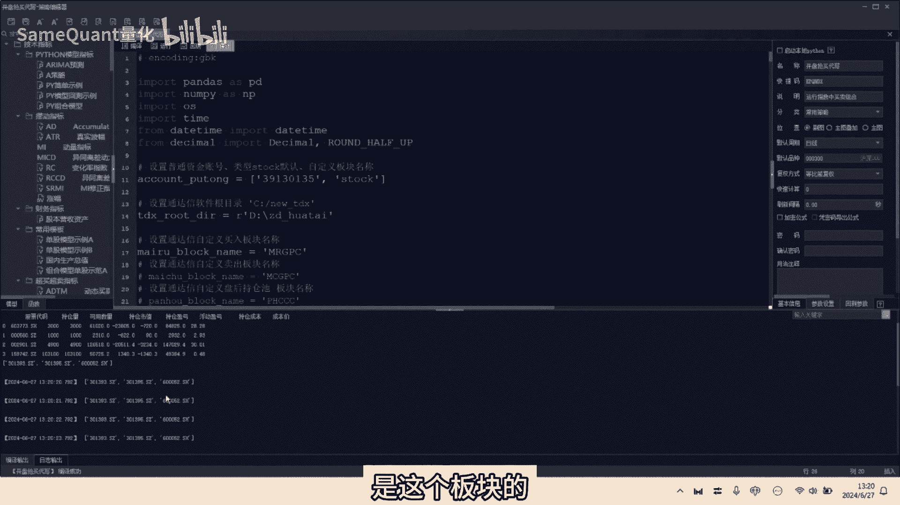
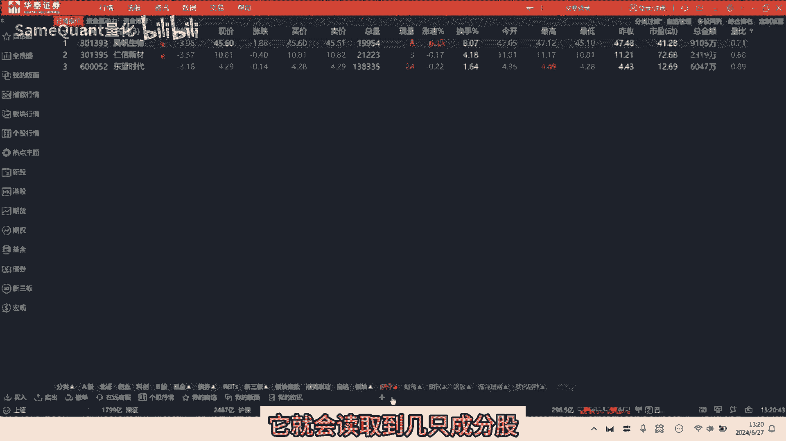
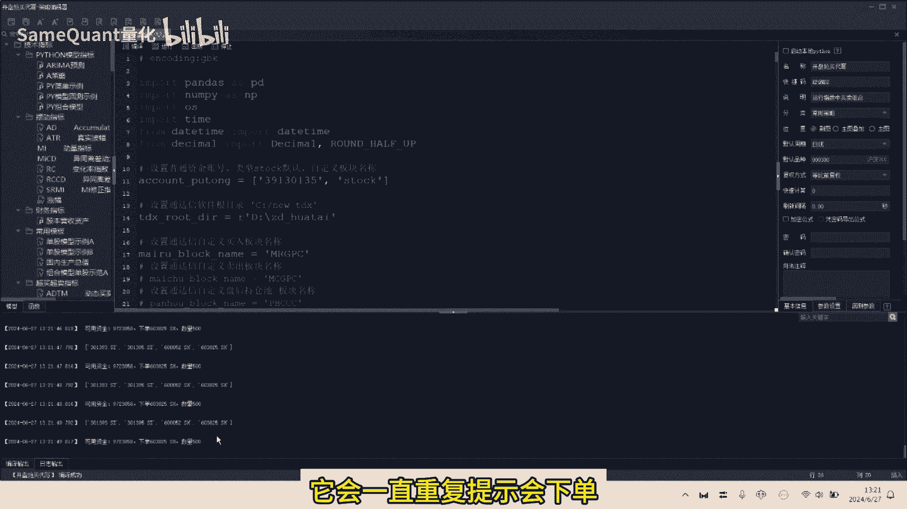
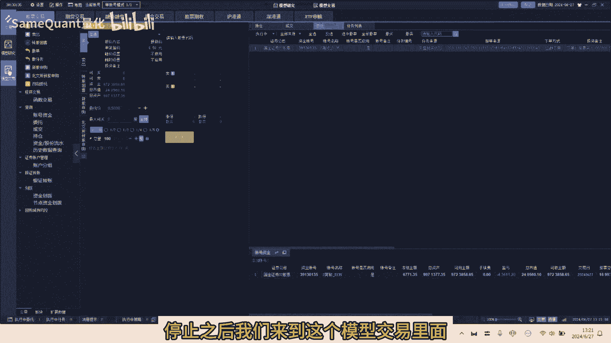
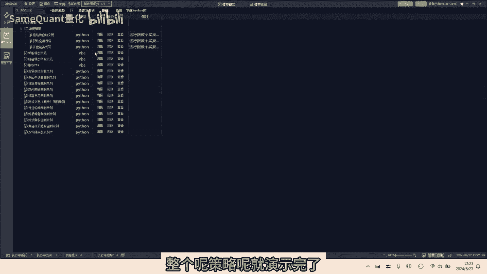
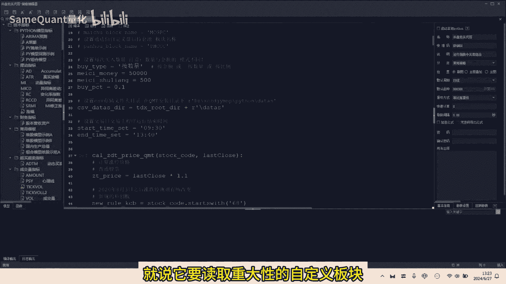
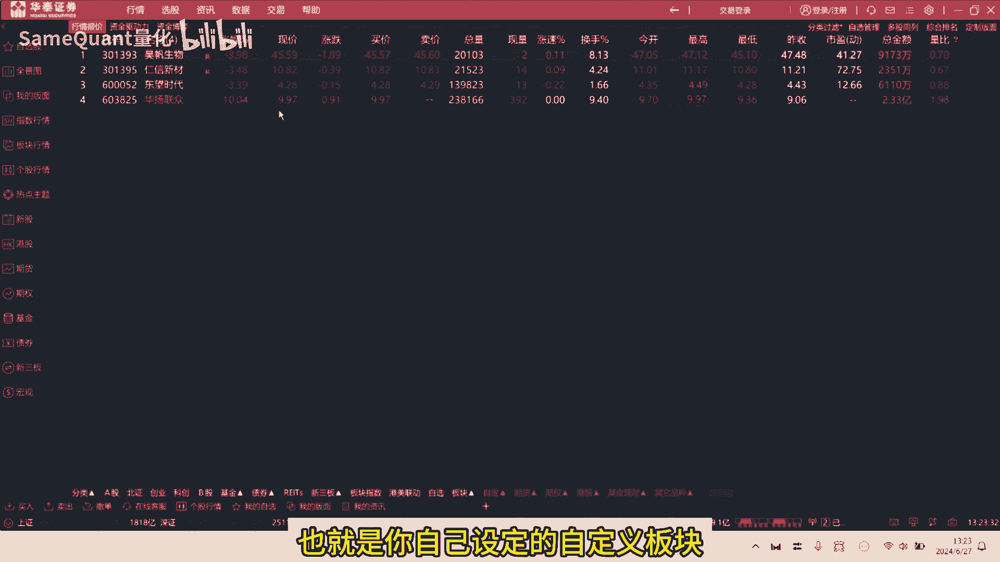
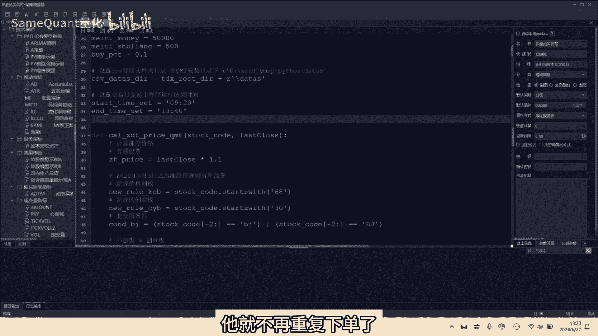

# 券商QMT：读取通达信自定义板块，开盘极速抢买 - P1 - SameQuant量化 - BV1F4421X7Jz

自动交易有一个优势就是快，这期分享开盘自动快速强买策略，这是一个粉丝要求代写的券商QMT策略，主要是解决他手速太慢，无法开盘，手工强买成功的难题啊，策略思路是对于它的啊。

通达性自定义板块股票池开盘后10分钟内，只要某只个股高于开盘价两分钱，就一级以最新价啊高1。5%委托买入，以保证强买成功啊，对于粉丝来说啊，每天他只需将开盘需要强买的股票，加入到通达信的自定义板块即可。

其他的工作全部由券商QMT，自动交易程序完成，下面为大家运行演示一下策略好，我们打开券商的QMT策略的一个编辑器啊，我们可以看到啊，这就是策略的一个源码，首先呢你需要将这个通达信的，安一个安装目录啊。

设置到这里，另外呢你监控的一个通达信的自定义板块的名，称的英文输入到这里，比如说这里是买入股票池哈，输入到这里，另外呢你是需符合条件，你是按数量买入还是按比例或金额，如果是按数量，这里就填按数量。

这里设置按数量的一个，每次的下单的一个股数啊，我们假设是500好，那接着呢啊，给大家可以大概的浏览一下，这个策略的一个源代码哈，我们就运行看一下好，首先它会获取到这个账户里面的一个资金情况。

以及持仓情况，这下面的这三个呢是这个板块的啊。

股票池里面的三只成分股哈，我们来到通达信啊，也就是买入股票池，我们可以看到有三只成分股啊，目前你有几只成分股，它就会读取到几只成分股。

好啊，目前这三只成分股啊，我们可以看到他们的一个啊开盘，他们的最新价都是低于开盘价的，所以说这三只都不符合触发买入的一个条件，所以说他没有触发买入，那么接下来呢我们就找一个符合条件的。

我们可以看一下这个程序会有什么变化，因为程序是一秒钟刷新一次哈，我们毫无疑问你看这支票它是涨停了，它的一个最新价啊，是高于开盘价的啊，所以我们就将它加入到买入股票池差，正常来说加入之后。

我们可以看一下这边有什么变化哈，我们可以看到一加入之后，你看这里的一个股票池列表，立马变成了市值，另外呢这里呢就显示了可用资金下单多少，500送了，也就是说这支票因为满足条件，他已经触发下单了哈。

好由于呢目前这是一个代码编辑环境，它是一个回测环境，所以说呢他会一直重复提示会下单。

但实际上并没有下单哈，我们就停止好，停止之后我们来到这个模型交易里面。

模型交易里面这个是开盘强买这个策略，那我们接下来呢我们要验证，就是说那我们将首先将模拟改为实盘，实盘试盘之后呢，我们点击开始运行，我们哈我们看到诶他这里已经显示，首先你可以看到这里已经显示。

这里已经第一次下单了，下单之后他就不会再重复下单了，因为已经有委托了，重复买入跳过，因为你你下单之后，他每秒刷新一次，你不能一秒刷一次，你就重复下单，所以说到了这个实盘环境之后啊，他就不会重复下单了。

只下单一次就不会重复下单了啊，这就是一个策略，同时呢我们可以看到这个委托里面，你看啊这里委托里面点详细的委托的一个记录，他是已报啊，没有成交，因为本身我们用的账户也是一个测试账户。

所以说他可能他他也没有成交，他这模拟撮合可能出来测试环境，模拟撮合有了问题，然后真正实盘的时候，示范环境是不会有任何问题的啊，好那么我们先暂停一下，整个呢策略呢就演示完了啊。

我们可以看到呢它其实有几个重要的功能啊，第一个就是说他要读取通达信的自定义板块。

自定义板块的一个股票池，也就是你自己设定的自定义板块股票池。

另外呢这个QMT这个代码呢，它需要去循环的去获取行情，去监控你是否满足啊，最新价高于开盘价两分钱，这个条件只要满足之后呢，他就会进行一个触发的买入，那触发一次买入之后呢，他为了避免重复，他会做一个过滤。

就是你已经委托了货，经你已经成交的，或者是你持仓的个股，它就不再重复下单了。

只下单一次，除此之外呢，我们一个完整的电话交易程序，还需要注意处理一些细节啊，比如说啊刚刚讲的不能重复下单，已下单前，你要先过滤掉已持仓的或者是已爆的，或者是已成交的一个代码。

那另外啊这个策略你还要考虑，委托价不能超过涨停价，我们原来的逻辑是，委托价是比最新价高1。5%，那么比最新价高1。5%，就有可能超过涨停价，那么你超过了涨停价，你去下单，他毫无疑问是废单。

所以说呢我们在程序里面还要做一个校验，就说你要判断委托价啊，是否超过了涨停价，如果超过涨停价，那么则应该以涨停价委托，还有呢就是说你比如开盘价与定价，那如果价差小于两分钱的时候，该如何处理呢。

最新价高于开盘价两分钱，理财触发一个买入，那如果说开盘价与涨停价，本身就价差小于两分钱的时候，你整个策略条件就永远无法满足了，所以说极端的这个情况我们也需要做一个处理，比如说我们可以以，那如果说他高。

它的开盘价与涨停价的价差小于两分钱的时候，只要说它的最新价高于开盘价，我们就可以以涨评价委托买入等等一些啊，细节都需要考虑到，细节处理完之后呢，就可以将胜率的程序在QMT里面，先模拟模式运行。

当模拟模式运行测试无误后，就可以切换到一个实盘环境了，好了这期的分享就到这里，对量化自动交易感兴趣的朋友。

