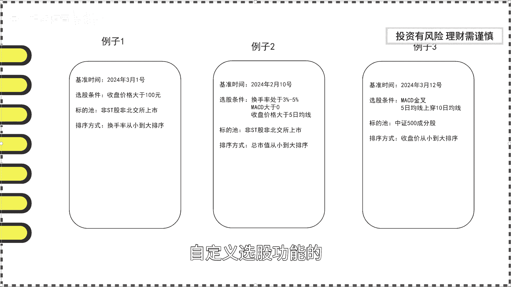

# 功能强大的选股利器，帮忙解决选股烦恼 - P1 - 量化投资阿覃 - BV1dF4m1c781

游资小船永不坏，量化策略定成败，大家好，我是品优量化的阿晴，近期我在私信与粉丝交流时获知，他们在看完我之前量化系列策略分享之后，都感觉不错，而且粉丝们也纷纷对我分享的策略，进行了更深层次的优化。

有些人甚至得到了表现更加优秀的策略，在此要为他们进行鼓励和点赞，没有看过我策略分享视频的小伙伴们，赶紧去我的主页补上观看吧，同时我也收到了一些问的比较多的问题，是已经开发出一些不错的量化策略。

怎么样可以得到这些策略的每天实时选股，结果呢，其实这个疑问，我们之前推荐的量化回测小工具已经解决了，这个问题只是阿晴哥，我还没来得及跟大家详细讲解这个功能，今天这个视频就跟大家详细阐述一下。

我们小工具中的另外一个重要功能才算平台，下面我就给大家介绍一下如何使用吧，首先我给大家演示一下具体的功能，然后再进行详细的讲解，对于新用户而言，如果之前没有自己尝试过使用过我们的平台的。

可以点击这里量化示例，进入后，可以看到，里面已经将我们之前分享过的策略整理好了，我们只需要一键复制，就可以拷贝形成自己的策略了，我具体的演示一下，点击北向日增仓策略，然后点击修改回测条件，可以看到。

我们已经将视力策略的条件全部复制过来了，现在我们只需要根据喜好修改一下策略名称，或者修改一下回撤时间，最后点击开始回撤，那么这个策略就会进入到我们自己的回测结果，列表当中了，好了，做完了前期的铺垫工作。

下面开始演示我们的条件选股功能了，让我们回到数据栏目主页，点击进入才算平台，找到我的策略这一栏目，然后选择北向日增仓优化策略，可以看到其他栏目已经按照这个策略的条件，全部填写完毕了。

这个时候我们只需要选取基准时间，就可以选出基准时间当天的，符合这个策略的全部结果，在此我们选择日期为2024年3月5号，拉到底部，点击查看结果，我们高性能的平台，马上就可以得到该日期符合条件的全部结果。

往右侧拉动，就可以看到每一个回撤条件当天的具体取值，非常的方便，我们返回再重新修改一下基准时间，这次我们选择前一天，2024年3月4号，然后再点击查看结果，查询的速度还是非常可观的，点击返回。

这一次我们换一个策略，选择高融资余额策略，可以看到已经存在的策略小程序，会帮助我们自动填写相应的条件，我们直接点击查看结果，就可以得到这个策略的选股结果了，是不是非常的方便呢，所以总的来说。

只要我们在回撤平台上已经测试过的策略，我们都可以在才算平台上选出该策略，在具体某一天的选股结果，具体对于应用在实盘上呢，我们只需要在当天收盘之后，等待我们的小工具，将当天所有的数据同步到数据库中之后。

我们就可以进行当天的选股了，这是不是非常的方便呢，当然阿晴哥要在此声明一下，尽管在当前数据层面，我们有专门的人员去严格核对，但总不能避免有个别些许数据会发生错误，我们的数据仅供研究参考。

因此不放心的小伙伴，可以将选股结果的数据进行二次核对，确保万无一失，说完了策略选股之后，下面我就给大家介绍一下如何进行自定义选股，要实现自定义选股，就要先搞清楚我们这个才算平台，要填写哪些条件。

现在我们从上往下看，需要填写的主要为三个栏目，分别为选股条件，股票标的词，选股排序，选股条件当中，需要我们选择基准时间以及添加选股条件，股票标的词当中，这里罗列了常见的分类标准，勾选非st股。

则说明st类的股票会排除在选股结果之外，勾选沪深300成分股，则说明选股结果只在沪深300成分股中产生，如果全部都不勾选，则默认选择A股市场中所有的股票，当然这里也可以进行多选。

接下来就是我们的选股排序，这里我们需要选择一个指标，来对我们最终的选股结果进行一个排序，这个排序可以进行升序排序，也可以进行降序排序，打个比方，我们现在选择行情指标中的换手率不复权，然后点击升序。

这意味着我们最终的选股结果，会按照换手率从小到大排序好了，以上就是我们需要填写的全部内容，下面这几个例子是用来给大家具体演示一下。

自定义选股功能的，方便大家更好的理解和使用，第一个例子是选择出日期，在2024年3月1号，收盘价格大于100元，非st股，非北交所上市，按照换手率从小到大排序的全部股票。

我们点击基准时间选择2024年3月1号，点击添加条件，选择行情指标中的收盘价不复权，最小值填写为100股票标的词，勾选非st股，非北交所上市选股排序中，我们选择行情指标中的换手率不复权，选择升序。

全部设置完毕后，点击查看结果，我们可以看到，我们总共选出了70只符合条件的股票，往右侧拉，可以具体看到收盘价格也是大于100元的，同时换手率也是按升序排序，接下来的第二个例子条件更为复杂一点。

我们选择日期为2024年2月10号，换手率处于3%到5%，这个区间MACD大于零，收盘价大于5日均线，非st股，非北交所上市的全部股票，按照总市值从小到大排序，现在我们点击基准时间。

选择2024年2月10号，点击添加条件，选择行情指标中的换手率不复权，最小值填写为三，最大值填写为五，注意一下，我们在最小值及最大值后面都标注了，这个指标的使用单位，以及方框中的灰写数字。

则为默认的最小值和最大值，同理选择技术指标中的MACD最小值填写为零，下一个条件为收盘价大于5日均线，因为这里需要使用到两个指标的组合，所以我们点击添加条件后，要选择自定义选股指标。

这里我要简单的讲解一下这两边的区别，左边的选择选股指标只能选择单一一个指标，然后填写其最大值和最小值范围，这里我们总共有八大类，接近200多个指标可供大家选择，而右边的自定义选股指标。

则用在两个以上单一指标的组合组合的方式，目前支持加减乘除，四则运算，比方说可以支持指标一加指标二，指标一除指标二，也可以支持指标一减指标二，再乘以指标三，现在要求的是收盘价大于5日均线。

其实就相当于收盘价减去5日均线大于零，那么我们在指标一选择行情指标中的收盘价，不复权，指标二，我们这里选择技术指标中的5日均线组合方式，这里需要我们进行首点选择，先点击指标一，然后点击减号。

然后再点击指标二，在下方的最小值中填写为零，确认添加条件后，就可以看到最后的条件表达式，有了这种指标组合方式后，可以非常的灵活，对各式各样的指标进行组合，对我们之后的策略开发有莫大的好处。

当然需要小伙伴们多多使用这款小工具，才能体会其中的妙处，然后股票标的词我们勾选上非st股，非北交所上市选股排序，选择估值指标中的总市值，从小到大排序就选择升序，最后点击查看结果。

就可以看到全部符合条件的股票，最后一个例子，我们选择日期为2024年3月12号，同时满足ACD金叉，5日均线上穿10日均线的中证500成份股，按照收盘价从小到大排序，在开始之前。

MACD金叉和5日均线上穿10日均线，是我们典型的技术形态，常用指标，我们先检查一下我们的形态指标，点击添加条件，选择形态指标，这里目前只支持三均线，多头或空头，即5日线大于10日线，大于20日线。

以及各种新高形态，或许这里会不断更新常见的形态，如MACD背离头肩顶，乌云盖顶等等常见形态，那么ABCD金叉和5日均线上穿10日均线，我们就可以使用组合指标来等价。

表示MACD金叉等价于今天的MACD大于零，昨天的MACD小于零，5日均线上穿10日均线，等价于今天的5日均线，减去今天的10日均线大于零，昨天的10日均线减去昨天的5日均线大于零。

做了简单的等价转换后，剩下的就交给小工具吧，我们选择基准时间为2024年3月12号，点击添加条件，选择技术指标中的MACD最小值填写为零，接着再次选择技术指标中的MACD，这一次我们点击下方的高级选项。

在向前天数中填写为一，这说明我们选择基准日期往前一天的MACD数值，即昨天的数值，同理填写为二，即为前天的数值，这里最大值填写为零，点击添加后就可以看到，这里的表达式为前一天的MACD小于零。

那么这里的MCD两个条件就等价于MACD金叉，同理我们处理一下5日均线上穿10日均线，点击添加条件，点击自定义选股指标，指标一选择技术指标中的5日均线指标，二，选择技术指标中的10日均线。

组合方式为指标一减指标二，最小值填写为零，再点击添加条件，选择自定义指标指标一选择5日均线，同时高级选项中项填天数要填写为一指标，二选择10日均线，同时这里的高级选项向填申诉也要填写为一。

组合方式为指标二减指标一，最小值填写为零，点击添加后，这里的表达式就为前一天的10日均线，减去前一天的5日均线大于零，那么这两个表达式就表达了，5日均线从10日均线的下方，上穿至10日均线的上方。

股票标的时，就选择中证500成份股选股排序，选择行情指标中的收盘价，选择升序，点击查看结果，选出了四个满足条件的股票，往右侧拉动，就可以检查每一个指标的具体取值好了，通过以上三个例子的讲解。

相信大家对这个才算平台的使用方法，已经了熟于心了吧，对于已经回撤过的策略，可以一键选股，同时也可以实现自定义的选股功能，对于想实盘操作的小伙伴，这绝对是一大利器，只需要在下一个交易日开盘之前。

在才算平台上选出符合交易计划的股票，就可以实施自己的买卖计划，这么强大的悬浮剂在市面上绝对是不多见的，更心动的是，这个才算平台是免费开放给大家使用的，小伙伴们一定要勤快起来，每天都尝试使用一下吧。

在这里阿琴哥也要再次强调一下，尽管数据方面我们已经做了严格的把关，但仍不能保证数据不出一点差错，不放心的小伙伴，可以通过别的方式进行二次核对，确保万无一失，我们提供的结果仅供研究参考，好啦。

最后希望大家可以一键三连关注我的栏目，多多鼓励和支持本视频，后续我将为大家持续推出更新更好。