# 加密货币交易机器人 - P1 - 老湾python量化交易 - BV1Yn4y1X7XR

大家好，我是Python量化交易的老湾，欢迎回到我的频道，上次介绍了如何在谷歌的免费Python平台，COLAB上面运行一段加密货币的自动化交易，Python代码。

有些同学刚开始学Python以及程序化交易的时候，那觉得这个内容太难了，另外有些同学因为账户在币安交易所，所以需要能够连上币安的解决方案，今天这期视频提供同学，一套能够连上必安的免费服务器。

也初步讲解程序化交易中几个重要的功能，这套能连上必安的Python服务器是位于欧洲的binder，可以直接连B安的API，这样解决了COLLAB无法连接B安的问题，同学可以在谷歌上同时搜索minor。

tributter notebook这几个关键字，找到这个云平台服务器，google的COLAB跟binder，都是配置好JUPITER的免费Python服务器，这些Python与服务器。

对于学习Python程序化交易的优点之一，在于能够轻松安装一些Python的第三方模块，同学在家里部署Python环境可能会遇到许多问题，用这些免费的Python云平台环境，可以避免这些安装上的问题。

比如说要安装一个工具包，像是有150多种技术指标的PTEIP，这个工具包在程序化中非常有用，但是呢同学如果你在家里安装Python的话。

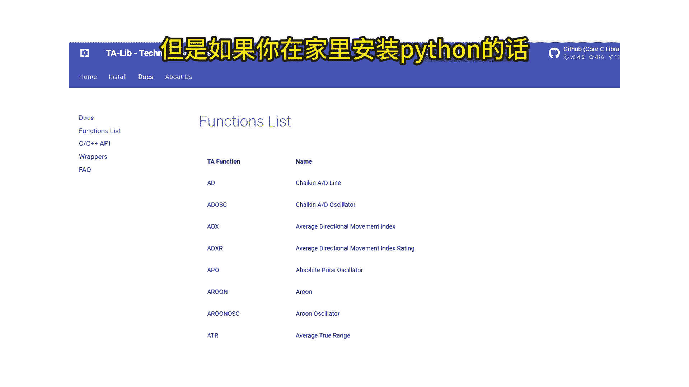

安装tab lab这个三方包其实是很多问题的，但是如果你在COLLAB或者是ma上面安装TAIB，是非常简单的。

在VIDER上面打开jupiter notebook，很简单的，就像家里使用，那看到安装的JPER一样，首先呢我们安装一个python3的notebook，接下来我会演示具体的步骤。

首先运行一段查询服务器公网IP的Python代码，确认一下，我们目前运行的这个服务器的所在位置，透过who is IP能够发现这个IP呢是位于欧洲，通过这种方式，我们可以从欧洲的服务器。

顺利连接到币安交易所的API，接下来是安装CC1XT，这个第三方包命令是type install c c x t，这个三方包能够将目前加密货币，各个交易所的API封装在一起，按同样的Python语法。

就可能够跨交易所的运行策略代码，不管是查询K线数据，持仓或者是可用余额还是未成交订单，或者是你要直接下单交易语法都是一样的，你只要换个入参，就可以换个交易所，继续持续性的运行的Python策略代码。

安装完CCXT之后呢，先重新启动一下NOBOOK，然后导入CCXT这个模块，开始之前呢，建议同学先用DIR查询一下，CCXT有哪些功能，同时呢也确定cc x t安装正确，因为有些同学会跟我反馈。

他的cc xt怎么没有正确的运行，原来发现它没有安装正确，所以低压压就可以看出他的安装真是错误的，待会介绍的各段功能代码，都是从之前COLLAB上面的程序化交易策略代码，抄回来的。

一段完整的程序化交易代码，通常呢只是将这些功能组织起来，前一堂课跟大家介绍整个量化交易策略代码，其实都是这几个功能的组合，实现我们自己对于量化交易策略的一个思路，那首先呢我们先登录B安交易所。

同学已经开好IB安交易所的API的话。

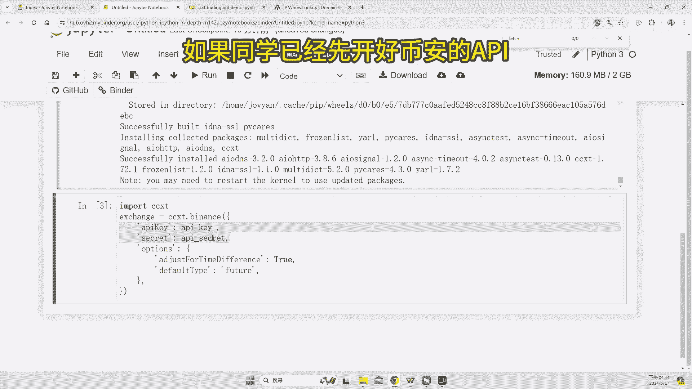

你只要更改代码中的交易所以及API key。

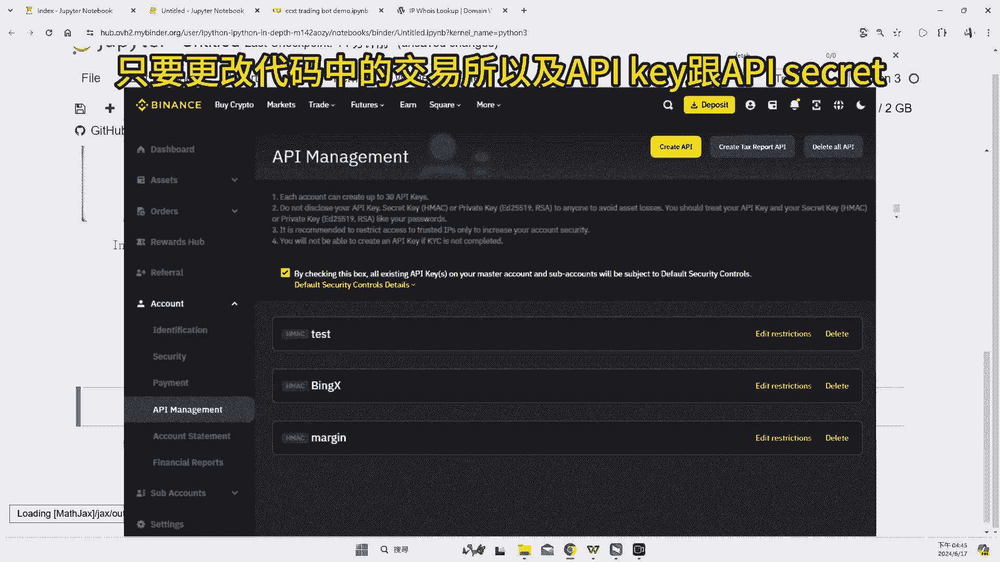

还还有API secret就能够登陆币安交易所，同样的方法能够跟登录各大加密货币交易所。

在开始介绍这些函数之前呢，先给同学介绍一下，学习Python程序化交易流很重要的习惯，无论你是在做加密货币或者是股票或者是期货，或者是你平常在做一些数据的操作。

例如说你要用pandas的data friend的时候。

建议同学一定要建立好查询说明文档的能力。

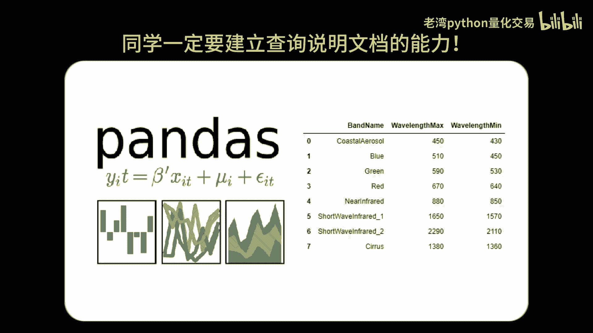

CCXD有数千个功能函数，没有一个系列教程，能够完整的介绍这些所有的功能函数，这边示范一下如何搜寻并查询功能函数的文档，待会有示范的四个功能函数，前面三个是查询功能，最后一个了是下单功能。

K线呢是开盘价，收盘价最高价跟最低价英文字母是open high low close。

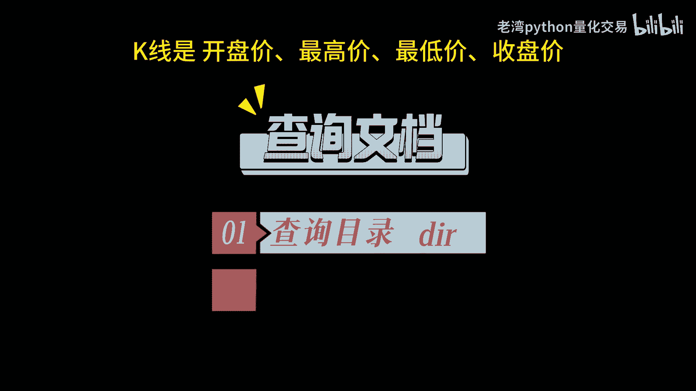

可以在DIR里面找到fetch o h l cb，这个函数如何使用FHOLCV呢，那可以用help后面查询函数名称，就可以找到写入参的写法。

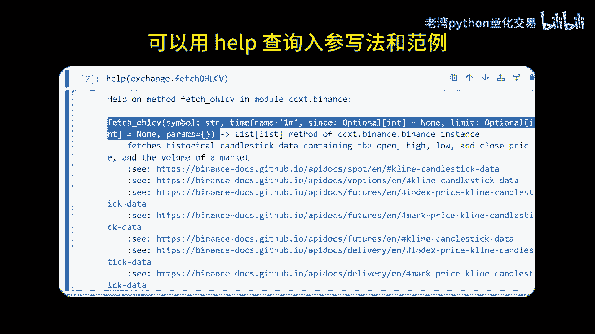

还有范例，获取K线数其实最简单的，这边示范的是取得大饼的5分钟K线，取得K线是不用登录交易所的，用同样的方法可以找到查询额，是用fetch mance函数这里加工一下，我们将查询结果它返回的是字符。

我们把它转换成浮点格式，接下来看一下未成交订单，我们搜寻一下open orders，你就可以轻松的找到CCXD里面呢，fetch open orders查询未成交订单的这个函数，查询的时候呢。

你需要加入加密货币的代码，以上这几个功能都是相对简单的查询函数，加密货币的下单函数会比较复杂一点。

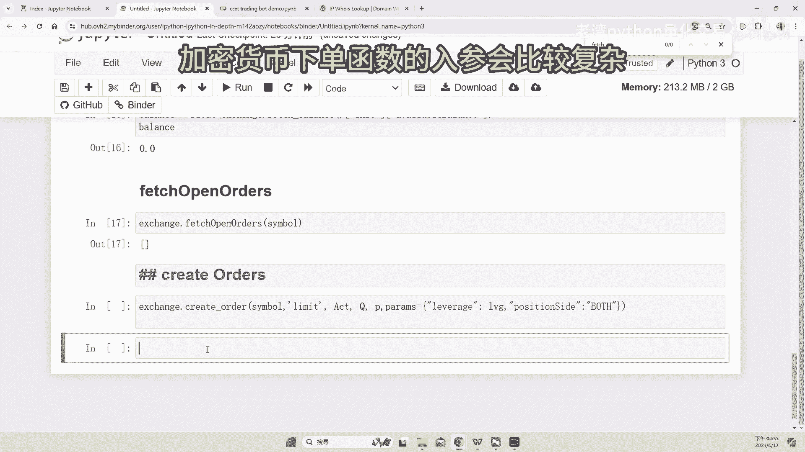

包括了他的入参，还有他的写法，同样的建议同学用help查询一下，下单函数的入参是怎么写的，第一个入参是加密货币的代码，我们这边用大饼，第二个是限价单或者是市价单，第三个入餐呢。

是你要下的方向是买入或者是卖出，合约可以做多，也可以做空，提醒一下加密货币的合约下法会比较复杂一点，这只是做个简单的示范，设定的第四个入差呢是66150，这个限价单我这边设定的杠杆倍数。

合约杠杆倍数是十倍。

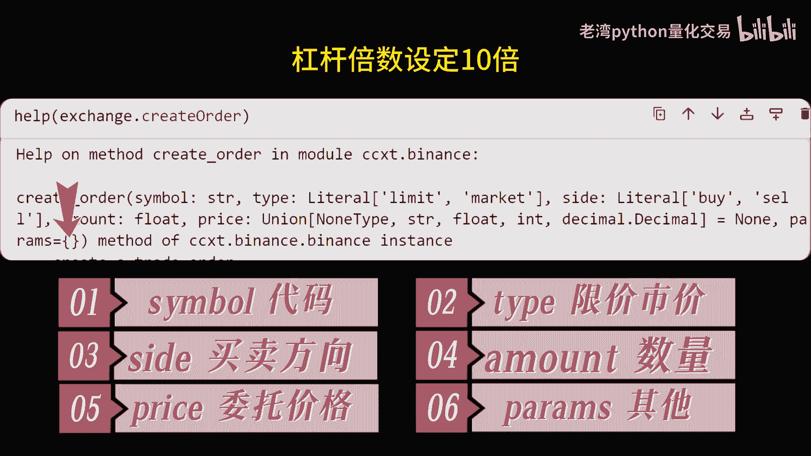

真实下单时呢必然对于IP有严格的限制啊，必然要求锁IP才能进行下单交易，必然不仅会查询你这个服务器的所在位置。

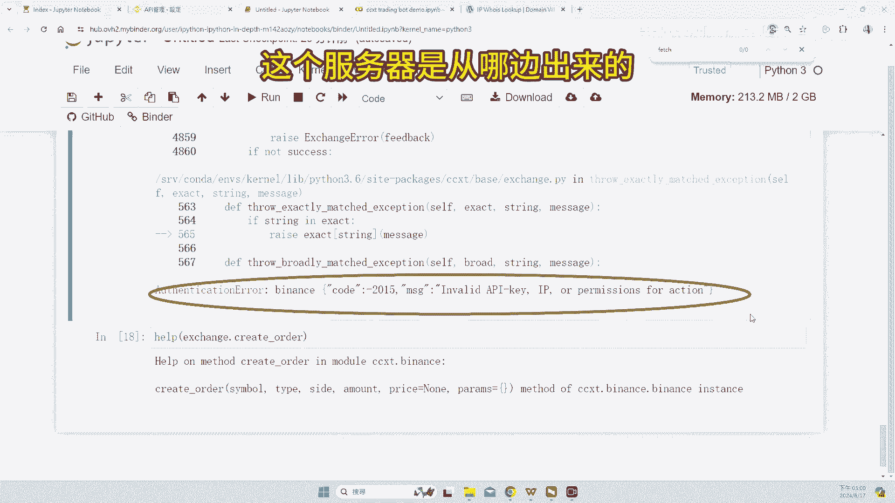

IP也会查询你是不是有使用的梯子，我之前开的i pi。

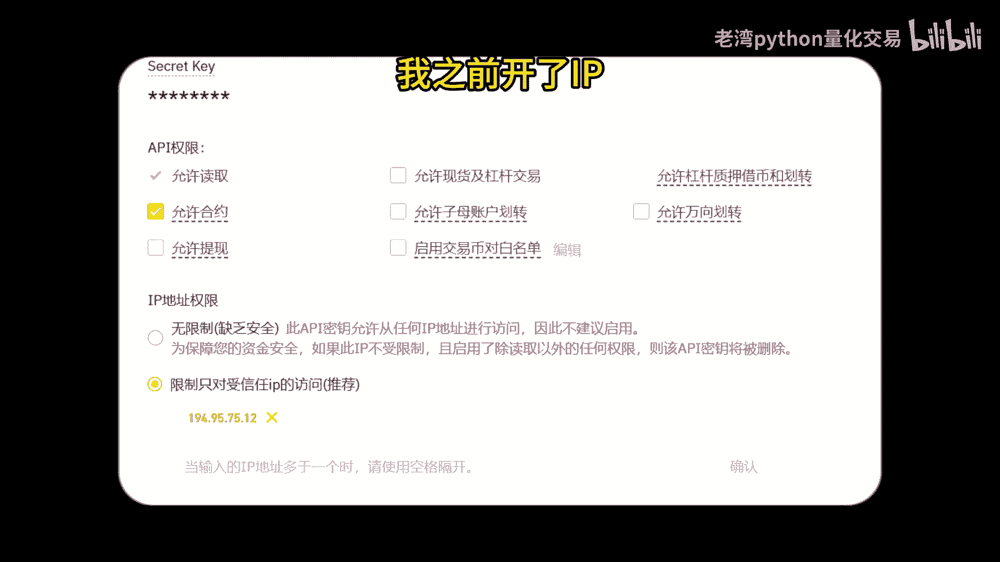

在i pi的约定上能够使用合约交易，那现在运行的时候呢会提醒余额不足，因为我刚刚已经查询了，我目前呢必然是没有入境的，所以他会反馈我现在是余额不足，虽然今天不能完成交易，但也证明了这个交易呢接口是通的。

可以直接在B安呢透过API下单，今天的演示就到这边，谢谢大家的观看。

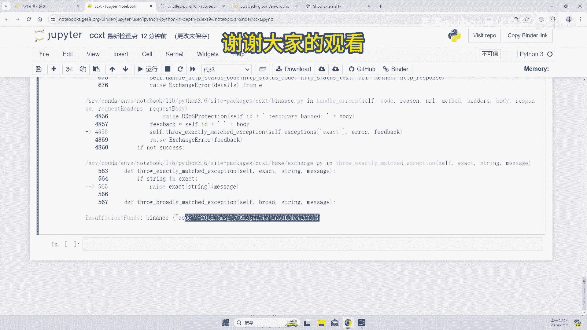

记得订阅哦。