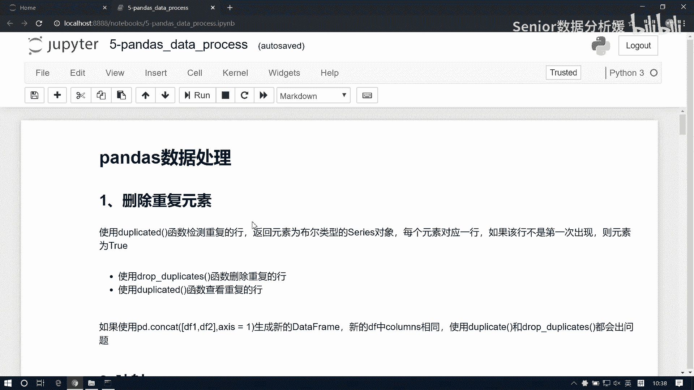
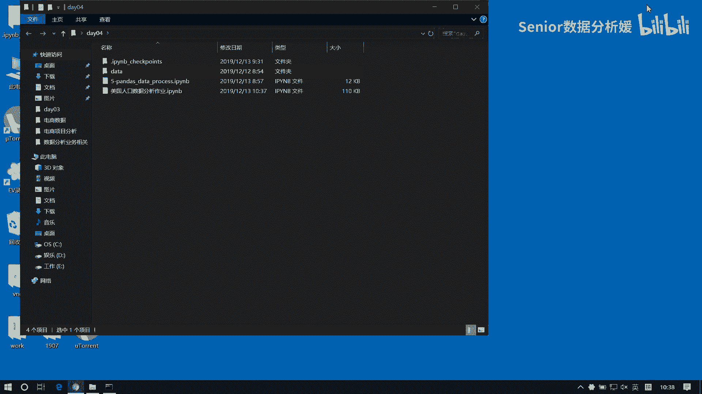
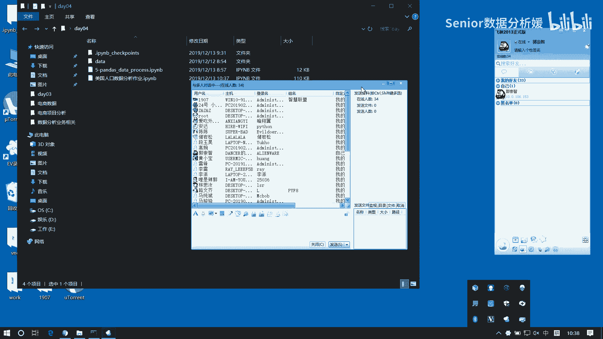
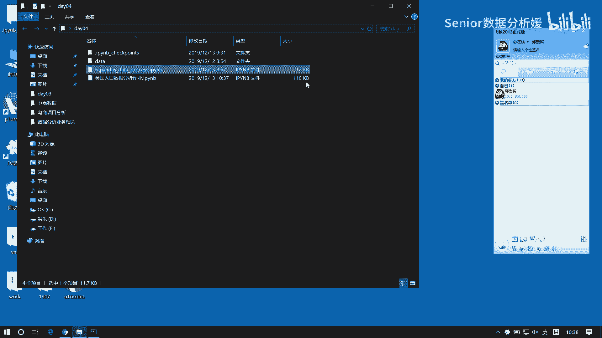
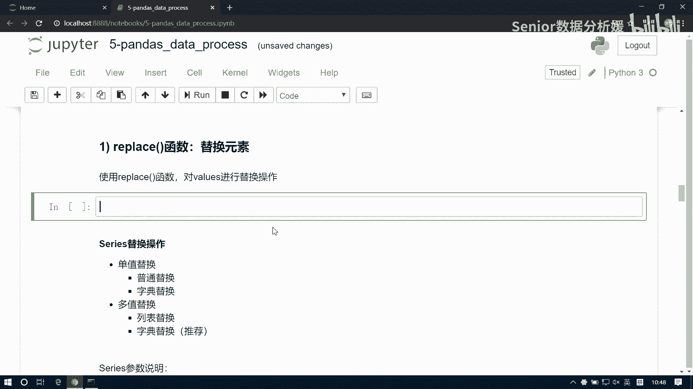
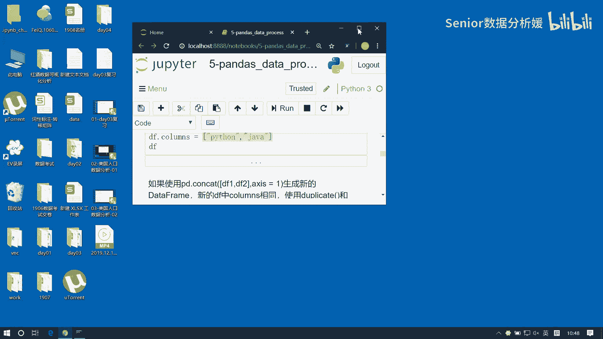
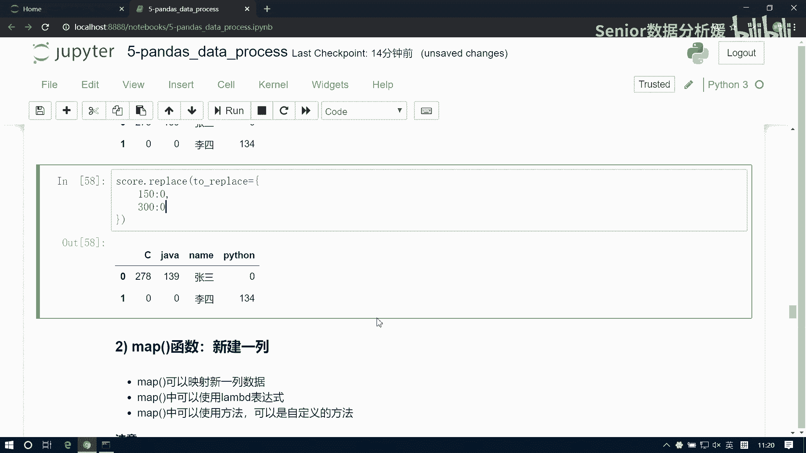

# 数据分析+金融量化+数据清洗，零基础数据分析金融量化从入门到实战课程，带你从金融基础知识到量化项目实战！【入门必备】 - P44：04 重复值处理+替换 - Senior数据分析媛 - BV1Ak61YVEYX

好今天呢我们这个继续讲pandas的数据处理啊，昨天我们说的是这个节联和合并啊，那是汇总技术，那么另外一个呢，就是我们今天要说的这个分组啊，分组技术啊，然后分组呢包括这个group分组。

还有这个交叉和透视啊，除此之外呢还有一些边边角角的，比如说我们这个排序呀，然后随机抽样啊，异常值检测呀，还有一些索引替换的，值替换的啊等等这些操作啊，好那我们先从第一个开始说啊。

把这个文件给大家发一下。

咱们先来看第一个啊，这个删除重复元素，删除重复元素呢，我们主要是两个函数啊，帮我们来处理这件事，一个是查询重复，一个是删除重复，那DP dates，这是删除，然后DLICATED，这个是查询啊。

那我们先生成一组重复元素啊，这个，先来一个NP点date吧，点round int，嗯0~100，然后size等于，这个八行三列，我的我的魔鬼，好这样一组数据啊，那我们现在需要里边有有一些这个重复值啊。

我们去修改一下，呃比如说我们把这个1346啊，给他做一个处理，好我这样写可以吧是吧，这样可以啊，那么这个背后的原因是什么呢，我现在我DF点lock1得到是个啥呀，是一行啊，我得到是一行。

然后我这一行我去跟一个数相加，就全变成101了，是不是广播呀，同样道理我给他做赋值是一个道理啊，是全变成100了对吧好，所以所以是这样是可以赋值的啊，好了，现在重复行是一行三行四行六行好。

那我现在呢想检测我的这个重复数据呢，可以用这个duplicate函数啊，我用这个DF点duplicated，这样我就会得到我重复值的这个索引的哎，一咋没了，哇这变成一了啊，啊这样可以了啊。

刚才串了一下啊，现在一看346是吧，这他帮我们检测出来的这个空行啊，把这个重复行是吧，然后他这个重复呢可以通过一个参数啊，叫keep，我们来控制，我们是保留第一个还是保留最后一个。

就是说你是像这个first就是我保留第一个啊，那如果是这个last就是保留最后一个，啊还可以用last啊，那可以把它改一下，keep等于left加上保留最后一个，也就是说前面设置为true的这种呢。

就都属于这个空数据了啊，然后呢比如说我们用它，我想把这个非空数据给它拿出来，怎么怎么办呢，怎么堵啊，再套一个，这样还不行啊，嗯嗯OPM，这样不写文件，如如果我先直接去点log的话。

我是把这个重复数据拿出来了对吧，重复都拿出来了啊，那我现在如果想拿非重复数据，我是不是可以通过它的index找到这个index，然后把它过滤掉，帐篷是不是，这样就都是非空数据了，对吧啊。

但是这个这个只是我们说咱们就是对，就是就是那个熟练一下啊，其实那我们有更便捷的办法，就直接用它是吧，直接用它啊，它的道理跟这个是一样的，它可以直接帮我们就把这个重复数据给他，直接拿掉了啊。

还是以它为例啊，DF我们直接去DP duplicates啊，这里边参数还是一样的，就是一个keep，我们现在想保留最后一个设置REDUST是吧，直接就拿到这个结果了，0256702567对吧啊。

那他如果是保留第一个呢，就是把第一个保留啊，这边也是一个道理啊，他如果是first，好那它里边呢有一个也有一个这个in place参数，in place place的话呢，默认是false。

如果是true的话，意味着什么，修改内存是吧，就修改内存了啊，那你这个data frame呢，整个这个对象的内存就变了啊，啊但是这个in place这种操作啊，大家那个用的时候就是要注意一下。

就是这东西你别你别多次运行是吧，你别运行完又运行，运行完又运行是吧，这一般就会出问题了啊，就运行一次就别动了，啊然后这个是有一个小小小bug啊，就是以前有的bug，然后这个我也没删啊。

就是现在呢不太不太容易复现了，就是说在吉连的时候呢，在节点的时候会容易出现一些问题啊，所以这个咱咱们用的时候注意一下啊，如果没问题更好啊，如果有问题的话，那就是你知道就是我们这个过滤的时候呢。

它会有一个bug，尽量是把那个索引的给它进行一个重置，会好一些啊，啊这个就不演示了啊，就是我们看下这个这个功能就行了，然后来看这个第二个映射映射处理，映射处理是一个很大的概念。

它包我们先要介绍三种映射啊，一种映射的是我们对元素值的一个替换处理啊，另外一个就是map函数，这个是最重要的，这个我们经常要用的啊，就是我们像就是要给一组数据给它起，比如说起一个那种别名。

像那天我给大家展示一下那个v look up函数，大家记得吗，有没有印象了，就是把这个成绩给它映射成ABCDE，五个成绩，还记得吗，啊其实我们这个map函数呢，它就是这样一个功能啊，所以它非常常用啊。

它非常常用，你像那个，而且他的他的这个就是个功效啊，肯定是比vivlook up要好一些的，VUEGA话你要是做表格的话，肯定就是你肯定要用经常用这个函数，但是好多人用不好啊。

就是他那个东西规则规则不太好，不太好控啊，就是有时候处理不好，但是如果我们用map函数来处理的话，整个代码可以通过自己的逻辑实现，所以它它会比较好用啊，而且也比较常用啊，另外一个是rename函数。

RENEM函数的话，它呢主要是来帮我们解决索引的替换问题啊，你像我们现在，如果你想改变这个data frame的索引的话，方法方法极其的笨拙是吧，我们拿到这个columns是吧，然后给大家做一个赋值啊。

来一个，然后java然后C是吧，这样的话呢我们看这个就复制成功了对吧，如果你只写的少的还不行，对不对，还会报错啊，所以说那如果你这个列标签显示说，你有20多个20多个的话，那这个时候你要再写的话呢。

就显得有点差点意思了是吧好，所以呢我可能我们只是局部替换，我现在只想把B给它变成了这个变成java，或者我们只想把A变成变成C，或者我们想把E1变成什么LUCY变，把五变成汤姆对吧。

我们只是局部的某几个值去做替换的话，那这种情况呢，我们就没有必要这么兴师动众的，把所有的列都重重置一遍啊，所以这时候就可以用第三个函数就是rename啊，这映射也算是一个小重点啊。

好那我们先说第一个replace，它怎么用，我们先生成一组一个数据吧。

啊这个数据呢我们咱们这么干啊。

用字典来构造，这样保证我们可以有各种各样的数据类型啊，Data frame，先来一个name，那name的话肯定是字符串类型啊，来一个LUCY，Marry tom，然后杰克这个我们叫。

啊就叫就叫name吧，然后再来一个order name，曾用名啊，曾用名这个是张狗蛋啊，然后这个是王刚王王小四三，王小三啊，像我们我们上高中，上初中的时候，老师经常训用，我说你们就是玩二小放牛。

不往好道上赶啊，因为我们班主任是语文老师的，他歇后语特别多，他天天歇后语骂我们，骂的我们有的时候云里雾里的都不知道，骂人骂的最高境界是吧，这样机器你就完全不知道，他说以前我不是骂人的。

他说以前我不怕骂人，我以前我就靠打人，他说再有一次我把像我们，那你像咱们上学应该已经没有那种什么，这老师已经不再什么靠暴力来来管管教了对吧，像那个早些年就比我早几届的那些学生啊。

他们还是经常会遭到老师的毒打的，那真是毒打，你知道吧，老是拿手打打嘴打，打脸打疼了啊，把那个那边都有个教鞭，知道把教鞭拎起来，呱呱开始开始抽啊，那抽屁股不疼，是抽手啊，真是毒打。

然后我们我们班主任就厉害了，我们班主任他说他说这种打人方方式，根本就教育不过来，他怎么打，他把那个一一个小伙子从讲台前打到讲台后，从讲台后又打到讲台前哈，后来那小子他不敢来了，你知道吗。

他就是就是怎么都不来了，然后那个就辍学了，回家了，因为我们农村嘛是吧，那学那完了家农村家长也是那会儿文化也不高，说那孩子不想上学就别上了，家里还有还有点地，还有点牛，就出家种地去吧是吧。

这样也家长心也大呃，不上就不上，然后学生说不来就不来了，然后老师老师就得去那个家里面，就得去做家访是吧，哎还得上学啊，是得去疏导教育之类的，他去了之后，他说他说这个学生我就是我去疏导了三天。

我就没疏导回来，他说从此我就立誓我再也不打人了啊，所以说我们就天天挨骂，哈哈哈啊，天天天各种歇后语啊，特别多啊咳，像我你像我这种文化水平，那都是我们语文老师手把手教出来的啊，然后汤姆汤姆的话。

比如叫这个魏淑芬，魏淑芬，然后杰克的话来一个叫铁牛，李铁牛啊，李铁牛，这是他们的他们曾经的这个曾用名啊，然后我们再来一个，来一个啊，来个salary salary啊，那工资工资的话可以用浮点，对不对。

浮点的话我们比如说这个LUCY啊，张口蛋的工资是这个九千八九千八百。6啊，然后这个王小三的工资是几个8000，765块二啊，然后魏淑芬的工资是1万7985点八，然后李铁牛的工资呢是3万5，35。3啊嗯。

额然后再来个什么，再来个年龄吧，来个H啊，有整数整数的话，那这个张某蛋的年龄是28岁啊，然后MARY的年龄是29岁，然后汤姆的年龄呢是32岁，然后杰克的年龄是50岁啊，好然后我们再给一些空值啊。

比如说有这个地址啊，address咳咳咳嗯，然后第一个是这个三里屯啊，这是中国最潮的屯子是吧嗯，中国最小的海是吧，8700啊，有的有的东西是哪是哪，你知道吗，宇宙中心是哪，五道口。

五道口职业技术学院是吧，哦宇宙中心，哈哈啊，上次就是啊跟跟朋友开玩笑是吧，打电话说你在哪呢，我说我在宇宙中心呢，好嘞马上到，我以为他还跟我扯淡呢，啪啪一会打真干真干过来了，然后真跑那地方去了。

哥你真神了啊，李铁然后然后李铁牛在哪呢，祝住昌平吧，啊昌平昌平咱们也别为昌平扳回一局是吧，你家昌平昌平感给人感觉是吧，你像北京，北京这种像这种时尚的聚集地，就是三里屯对吧。

但你像去三里屯玩的都什么什么小网红啊，啊小像创业者呀，或者这是什么金融圈的那些人对吧，都特别潮，哎你看这个你看这个你混昌平的，混西三级圈的这帮人是吧，你要去到五道口就算进进城了，然后啊一去完口哇。

感觉北京真好啊啊，感觉自己每天就住在大农村里边是吧，人他有他会有这个落差，就很奇怪啊，可能就还是跟圈子文化有关，你像你做金融的话，大家都感觉好像超级有范儿，超级有钱。

张口闭口什么tony lucy marry了是吧，然后你看搞互联网的尽头是什么什么铁柱啊，什么什么铁牛啊，都是这种啊，都是这种名字，然后你看各个什么一个完腿牛仔裤，一件一件那个格子衬衫。

加上一个那个什么双肩包对，就那个双肩包你得是有有有点那啥的，就是那个前段时间大家都喜欢背那个，什么瑞士军刀，但我看这两年好像大家都不背了啊，这两天好像大家都开始背那种淘宝了，比那瑞士刀还便宜了啊。

啊不但质量好，然后还稍微有点时尚，你像以前的话，早早几年的话，你像131415年，那几年大家都背那个日记呢，就那个有个红十字花那个东西的，就背那个包，那个包呢那个包跟啥，就是有一个品牌叫保罗。

大家知道吗，就是我觉得他这种品牌啊，他就是靠什么呢，我觉得他们其天天就是靠打折，靠促销来生存的，因为你在大街上，你永远看不到专卖店，你总是能看到各种什么两到三折清仓，什么厂家直销的这种是吧。

你给人感觉好像是名牌，感觉好像质量超级好，但是你永远买不到，买不到那个你看不到那个正儿八经的，就是那个那个门店啊，所以那会儿大家都买喜欢买那种包，就是一般也就是一两百块钱一个。

然后那包那包一背背好几年也不坏啊，就是到最后就是实在脏的不行了，没招了，得换个包了啊，就是不会说因为它坏了，然后然后换一个包，嗯啊诶啊这少个逗号好了，这是我们的一个原始数据啊，有整数有浮点哎。

然后有这个字符串，现在呢我们要这里面做一些替换啊，呃比如说我们先去填几个空值吧，啊比如说这个这个这个他没有曾用名吧，比如它叫他曾用名就是MARY啊，然后比如说李铁牛呢，他他的这个啊微淑芬吧。

微淑芬这个地址呢我们可能没有找到啊，比如说记为一个NP点N，然后这个比如说salary呃，这个这个张狗蛋的工资是空的啊，NB点的，好了，现在这边有一些空值啊，那我先来替换一下啊。

DF我们去replace，replace里边呢有这么几个参数，第一个是叫to replace，第二叫value啊，其实主要就是这俩参数啊，主要是他俩一个一个控制，那它会有有很多变化啊。

这个TURREPLACE呢你可以接单个值，比如说我指定用NP点N，那我就相当于什么呢，我就替换空值，替换空值，我把控制替换成什么呢，那我用value来指定value是我要替换的值。

这个值比如说我替换成100啊，这个salary变成100，然后这个值也变成100对吧啊，但是呢一般来讲我们都不会这么干啊，一般都不会这么干，因为你这么干，它是全局的一个替换。

因为每一列的字段的含义是不一样的对吧，我们很难找到说一些共同的值去填充所有值啊，所以什么比如说分数啊，分数没缺好的我都填零，哎这种情况可以这么干对吧，但是这种应用场景比较少啊，那还有一种情况是什么呢。

就是我们这个这是用普通的值啊，还有我们可以这个就是多个值一块换啊，一起来换，咳咳，那我只需要把这个to replace，替换成一个列表就行了，然后我这个value呢也是一个列表。

比如说我想把这个呃NP点NN，我替换成这个100，然后把这个三里屯我替换成，三里屯我替换成这个，像什么呢，宇宙中心，啊是吧，这样也可以啊，就是我可以通过这种方式啊，去单个对某一个值来进行替换。

那比如说我我想把这个张口袋和未淑芬，给它进行一块替换，我比如说把浆果蛋替换成未数分，未生分替换成钻口袋，这个可以啊，嗯啊DF点replace，张口袋，然后再来一个魏淑芬。

然后我这个value我把它替换成这个啊，但还是别这么干啊，这么干点太浪了，因为比如我把张狗蛋替换成叫狗蛋啊，然后位数分替换成，额数分数分是吧啊，这样会显得我们比较比较亲密是吧，狗蛋儿比较淑芬，咳咳啊。

这是用列表来替换啊，可以指定N个啊，但你要注意就是对应一一对应啊，那还有呢就是我们也可以用字典，字典来进行处理，Replace，字典的话呢也是对这个to replace来进行处理啊，我给他替换成故宫啊。

然后别人把这个昌平，我给他替换成西二旗，那他就不用再去指定value了，因为我这个值值就是我要替换的值，就是我的目标目标值啊，直接这样处理就行了，不用再写value了，写value就冲突了。

它变了它变了啊，这是用这个replace啊，然后还有什么呢，还有这个还有一种情况就是这个字典去这个啊，就是单个字典啊，这个啊指定列标签来替换一个值，比如说我们现在整个这个这个表里面啊，这里面有MARY。

这边也有merry对吧，有两列，如果我们现在去对merry做替换的话呢，他会把两个MARY都都换掉，然后这让我给一个这个to replace，我把merry，我把它替换成大写的marry。

那我这样的话是把什么，把两个迈瑞都替换掉了对吧，比如我现在只想把这个曾用名，给它做一个修改啊，那这是怎么搞呢，这时就要做一个变化了，还是用字典来实现，但是呢，这个字典他的键就不不是我要替换的目标了啊。

而是应该这么写啊，他键是我要写上我这个你要替换的列名称啊，然后值呢是你这一列当中的要替换的目标值啊，然后那我后边要接上这个value，把它变成marry好。

这我就替换的只是这个old name这一列了啊，咳咳啊，注意这种表达方式啊，那这个笔记在这啊，这大大家可以回头看啊，就用字典来处理，先键作为列标签，然后值要写成你要替换的那个值，那除了这种还有什么呢。

还有一种叫使用正则表达式来替换，嗯我看看啊，比如这里边，我想把这个，嗯把这个LU看看啊，我们找点有规律的，比如说这个汤姆，我先这样啊，我先把这个汤姆给他换成这个lucky好吧，变成lucky啊。

那我先替换一次啊，这是二，然后是name，我把它设置为，lucky啊嗯那现在呢我这个DF成这样子了啊，那我比如我现在想把这个LU打头的啊，把他们的都统一替换成替换成一个值好，这时候我就可以用正则了。

是不是我先说正则表达式怎么写啊，那我现在想表达LU打头的话，对正则表达式怎么写啊，刷IU然后后边是就任意多的一个字符呗，对不对，那是不是杠D啊，还不是杠，是杠W啊，是不是啊，是杠W加呀对吧。

正则还记得不得啊，正则是数又忘了有几个正则，有几个表示字符的，一个表示数量的表示数量有什么呀，有加号有星号，对不对，星号什么是零个或任意多个，加号是一个或任意多个对吧，还有什么还有这个。

MN是不是M至少M个，最多N个，是不是啊，这表示数量的，然后像表示那个字符的，有什么有那个杠S杠大S杠W杠大W嗯对吧，还有什么杠D杠大D对吧啊，表示什么空格啊，单词啊，还有这个啊，就这个字母啊。

还有这个数字啊之类的，对吧咳，比如这是一个正则表达式啊，那我们怎么用它用它来处理这个替换呢，也是一样的啊，我们先去哎这里面注释不了啊，Replace，那这个to replace呢。

我们要给它指定为一个正则表达式，那LU打头，然后杠上W加，然后value呢我们替换的值，比如这个我们就随便写一个，我们写成一个孙悟空，孙悟空啊，看下能不能替换成这样的话呢，是没有效果的，发现了是吧。

为什么呢，因为to replace，它默认是以它当一个普通字符串来查找，如果你是要做正则替换的话呢，我们必须要通过一个REGET参数设置为true，来告诉我这个函数，我们现在处理的是正则替换啊。

所以这个参数必须要写进来好，这样就替换成功了对吧，就是说REGUEST啊，这个东西要开，表示把把这个to replace，参数以正则表达式处理，啊，然后那series的替换。

其实跟那个data frame就没什么区别了啊，它反而要简单一些，普通替换字典替换我们写一下吧，比如我们读读出其中一列吧，我把这个address读出来啊，第二步点address。

然后把它保存为address，这是一个series，那我们对它做替换啊，比如说我们现在要把这个空值替换成呃五道口，Replace，To replace，把这个NP一点N。

然后value我们切换成五道口啊，然后那像字典替换啊，还有这个列表替换呢，这道理是一样的啊，但是呢这个series s呢它有一个新增的方式，就是method和limit。

它们可以用相邻的值来替换我们指定的目标值，比如说这里面我想拿这个昌平来来去替换，我这个五道口啊，以这个表为例啊，我想拿这个昌平来替换这个空值啊，那我可以用这个method加limit参数来控制它。

就是我们还是要先指定，就是你要替换的目标是谁，然后呢再给定一个method method，我们看啊，它有几种方式，sir啊，这了有pad f fail和B费用，那这玩意显然也是什么向前和向后呗，对吧。

那pad就是向前，f fail就是向前，B费用就是向后啊，那现在我昌平往往这填这是什么啊，说先后填啊啊，那我把它设置为b file啊，然后另外一个那个limit是来设定填充次数的啊。

那比如说我我现在这个你看啊，我现在如果直接这么这么写，给我写个二，这是没有用的，为啥呢，因为我们要替换的值是什么，它不是NN对吧，所以你指定这个次数没有用，那什么时候有用呢，如果我把中端海给它变成慢了。

这就用了，我可以先这样处理一下啊，我先把这个address点lock1，我把它替换成NP点N，好然后我们对这个address我们现在做这个替换啊，address点replace to replace。

我把空值替换，然后method我们指定为B费用，现在运行是不是全换了，全换了，那我现在可以控制它的次数，比如limit我设置为一，这是替换一次啊，但这个东西我们要注意啊。

这个method呢它只能在series当中使用，而不能在data frame当中用啊，data frame当中一用呢就会报错啊，咱可以再演示一下，我们拿这个DF为例，比如说我现在想拿昌平去替换。

我这个这两个值是吧，那我可以去这个呃replace，然后to value to replace，等于NP点NN，然后这个method我们等于一个b fail是吧，就会报错啊，它不能用啊。

这个method参数不能被data frame对象调用，它一调用就会出错，好了那我们这个把这个练习咱们做一下嗯，下啊这个是张三李四的课表，然后呢有这个啊，我们要做这样一个表是吧，有一个name。

有Python有java有C就这样一张表啊，这四个字段是吧，然后这个只有张三和李四啊，我们写一下啊，那就让我们用一个字典来写吧，scar它等于data frame，然后date等于一个字典。

那第一个是name name，话有这个张三和李四，啊然后就是我们这个成绩是吧，有Python，然后有java啊，那这个场景我们写个比如150，然后写个134，然后再来一个java，写个一百一百三十九。

再来个150啊，再来个C，再来个二百二百七十八，再来个300好，好那对于这样一张表，我们先要去把那个里边的300和150，都替换成零分对吧，那这个有很多种办法，一个比如我们可以用列表来替换DF哦，不不。

Df sce，score点这个replace，那to replace怎么先设置为150和300是吧，然后这个value呢我们都替换成零啊，再来个零，这是一种替换方式，还有没有还可以用字典来处理是吧。

score点replace，我把这个tour place设置为一个字典，那150冒号替换成零，然后300冒号替换成零啊，这样也可以是吧，还有没有了，啊这也没啥了是吧，就这两种方式好了。

