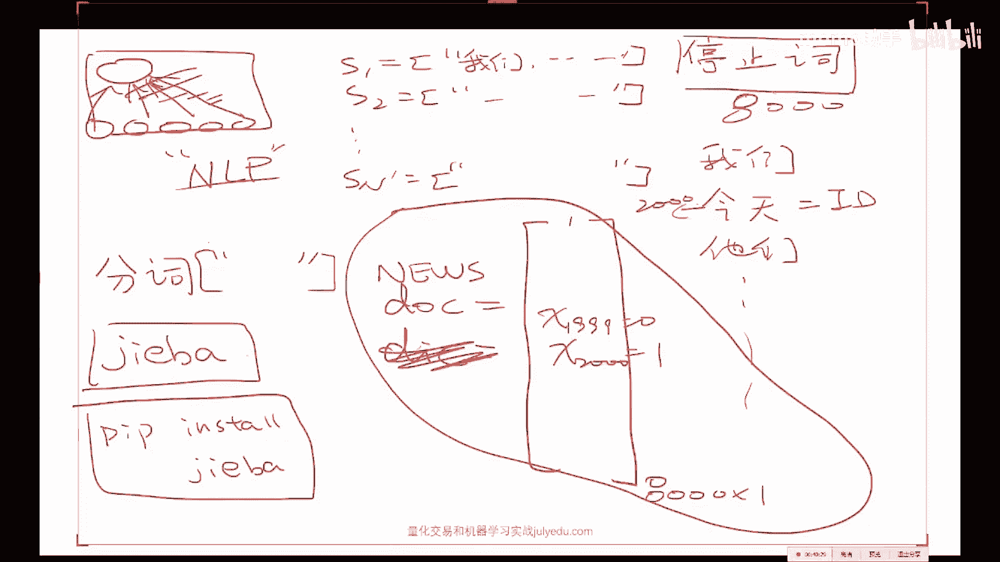
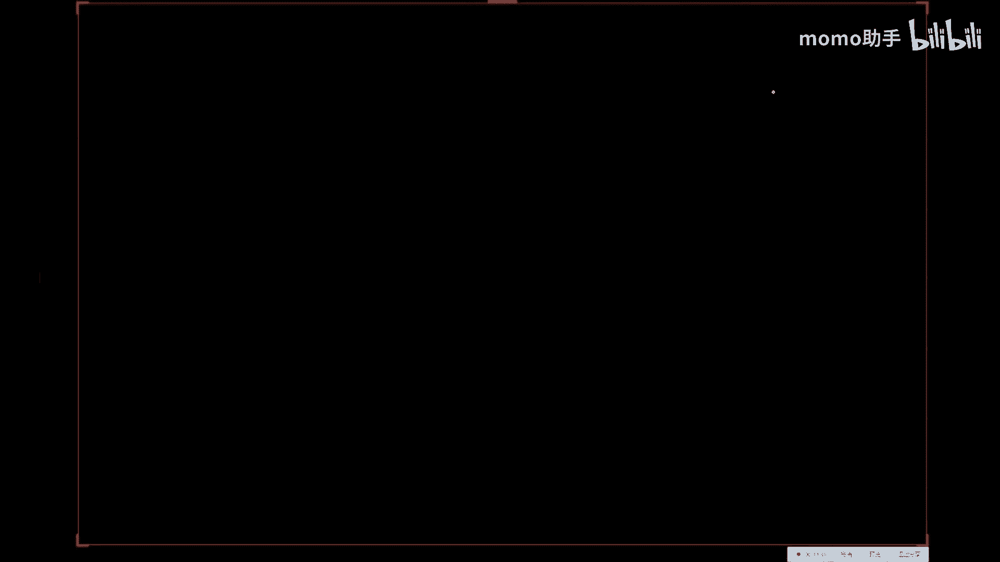
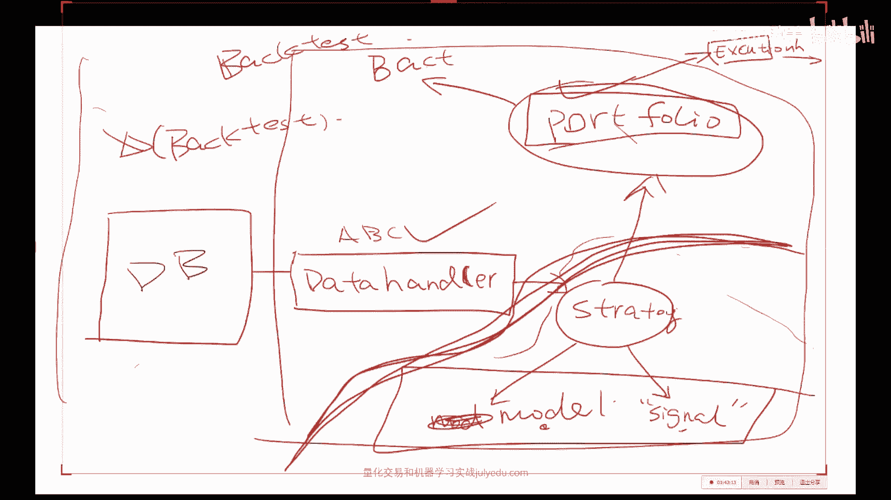
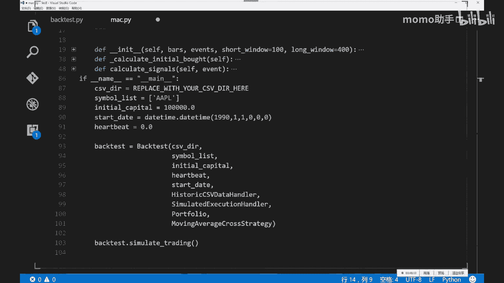
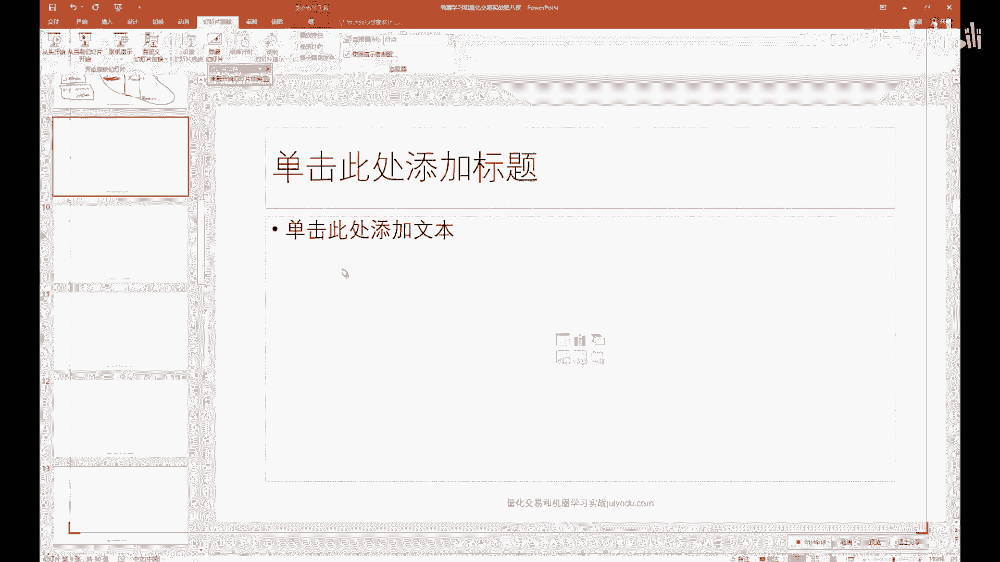
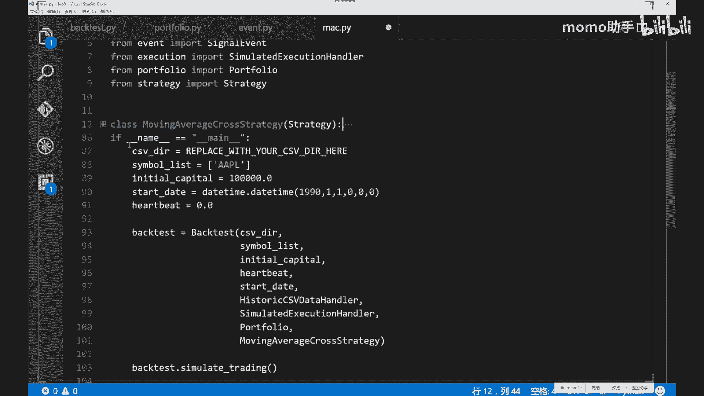
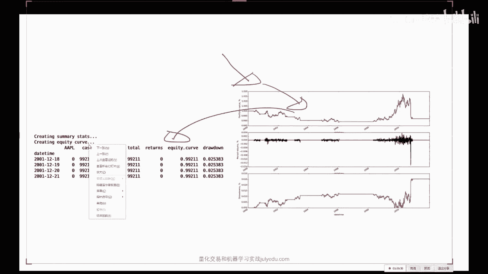
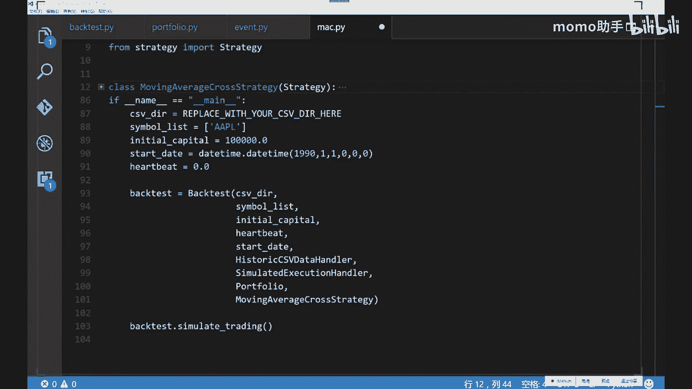

# 吹爆！2024B站公认最系统的Python金融分析与量化交易实战教程，3小时入门AI量化交易，看完还学不会你来打我！人工智能｜机器学习｜时间序列｜股票预测 - P8：第08课_机器学习与量化交易项目班 - momo助手 - BV1oYaoebEEz

好那我们今天开始上车呃，关于呃昨天的那个作业，大家有问题没有，就是嗯有没有做尝试，或者说呃大家在做的过程中有没有啊，关于建模方面的问题，或者说怎么发现，怎么自己所有的模型R方都是负的啊。

这这种情况我嗯希望是嗯不要发生啊，啊呃呃呃呃解压就行了，你你解压啊，用7zip解压之类的，有一个如果你是windows系统的话，有有一个叫7is zip，这个我感觉比win r a r要好用一点。

对这个东西，好看来这个小伙伴还没有在做这个数据，那个数据质量很好啊，那个数据质量嗯，嗯那个数据质量我只能告诉你很好，嗯然后呃大家一定要尝试着做一下，然后另外是这样。

如果你是比如说是大概啊2000棵树左右的，这个呃呃随机森林哦对再说一下哈，随机森林这个这一这一类的模型，有一个在SKLEAR里里头有一个是叫随机森林，random forest啊。

这个REGRESSOR，另外一个叫做extra extra tree啊，哎x tra trace啊，Regression，这两个这这个是叫做这叫做完全随机数啊，就是它其实是比随机森林要呃要出现的晚一点。

随机森林大概是2001年，这个是差不多是04年还是06年，然后他他的这个随机因素呢，比随机森林还要更随机，就是他的这个随随机森林，好歹是我每次选出来了根号N个这个维度，在这根号N的N个维度中。

我进行了一个贪心算法，选择出来最优的这这么一个啊分界面，而这个完全随机数这个叫做呃extremely random，Trees，叫做ex他他的这个论文引自ex dreaming。

就是极度的嗯极度的这个random啊，Trees，那么这种极度的随机数呢，它更能够他对过拟合的这个抗击，过拟合的这个能力，他会更好，为什么它是每一次随机的选择一个维度之后，随机的选择一个点进行分呃。

进行这个呃确定这个分界面，也就是说这样的话，让会它的这个数目，就是呃长得就会特别的不一样，当你每一个树长得特别不一样的时候，你做一个集成，你就肯定会非常的会非常的不一样了。

所以说当你的树要要干得很大的时候，我建议大家用这个啊，sk learn里头的这个这个呃extra trace呃，Regress，它的性能，对对不起啊，它性能一般来说会比随机森林要稍微，好那么一点点。

但是也是取决于不同的任务，所以说你没有任何理由啊，只试验一个随机森林，而不试验这个extra trace regression或者classify，嗯嗯具体的情况还是需要啊，通过具体的实验来做。

嗯SKN出嗯嗯都都是南派啊，我我我建议你用pandas进行IO，然后你再做这个再做呃，在做机器学习的时候，再把它再从pandas是那个data frame，data frame中选择出来。

你所感兴趣的子列，它它本身也就是number派，OK啊，Random forest requiok，他没有什么区别，它就是一个，就就是说根据你的这个呃任务来看的，你的任务是想回归一个实数。

就当你的Y是一个连续的一个数的时候，比如说你要连续的一个实数的时候，那么你就用这个regression，如果你要分类零一分类的话，你就要用这个classifier，就是说他的这个嗯对嗯，还有什么问题吗。

就是sk learn，你要是读他这个源码的话，他就要求大概每一个监督学习分类器，它要么是一个做regression的，要么做一个做分类的，它一般名字后面都是什么regression。

或者这个classifier啊，对对它做regression的时候，它就是将我这个子空间中的所有点，求一个平均值，就就是它的这个做的这个啊regression，然后他这个分类就是说我这个子区域中。

每一个点啊，每各种类别的它它会返回一个distribution，就说我在这个子空间中啊，一类占99%，所以我就预测为一类，然后二类占1%啊，但是你也可以，你也可以把这个叫做就是sk learn里头。

每一个函数啊，大部分的函数都会有个predict，这个predict就predict就是你真实的，你想要的那个Y的那个值，你还应该还可以干一件事。

叫做predict probably proper BO p p p r o b a，Predict probability，就是说predict probability就是你给我一个X。

我给你一个给你个分部，这个分布呢就是说零类占额，零类的可能性是多少，一类的可能性是多少，二类可能性多少，他就会给你这么一个类的这个分布，你在有些问题中，其实你更需要得到一个分布啊，什么啊。

问号是什么意思，在数据上会不会加了很多feature之后，模型预测性能达到一个瓶颈上不去了，是这样，模型的预测瓶颈呃，模型肯定会达到一个瓶颈上不去了，不可能它永远的能够到百分之百。

但是模型到瓶颈的原因有的时候并不是，一般来说不会是你加feature造成的啊，加feature一般来说是好事，而不是坏事，呃如果你想问的是，我目前模型上不去了，怎么办，当你非常呃很嗯什么都往里加的时候。

你最好再再做一种这个特征选择的，这个过程有可能会让你的模型再往上走一点，就是说不管怎么样，你不管加不加feature，你的特征选择这一步啊，最好是要做的是，但是当你选好了之后呢，你就有理由相信啊。

我的这种feature嗯，再减的话肯定是不合理的啊，对，啊R方值的复试的差不多有这么几个原因，一个原因是你忘加这个嗯，嗯这个常数项了，这个截距项了，另外一个是你的模型啊。

under fit它不是特征选择的问题啊，也有可能你的当你的特征是一个极度随机的，这么一个，就是完全跟Y无关的一些一些数的时候，他是有可能的，还有一个可能性是你可以尝试比较一下，M i s e。

就是当你实在是不知道该怎么办的时候，你就想算了啊，因为有可能你数据集中大部分就是你，你所要回归的问题，你的这些Y值它是极度不平衡的，大部分都是零，那么这样的话你就很可能预测的不是很好。

那么在这种情况下呢，你来汇报一下这个MSE啊，也可以嗯，然后这个这个sk learn里头有一个有一个紫的，这个model叫做matrix t tricks，今天好像我在群里说了啊。

这个sk learn点matrix，这个matrix里头他给你实现了各种各样，你能想到的基本上常用的所有的这个函数，包括了这个MS啊，这个R方值啊，这个accuracy。

对于分类来说的accuracy啊等等的东西啊，他都帮你啊在这个里头写好了，所以有的时候你不一定非要用二，防止你用其他的也可以嗯，还有问题吗，关于作业，关于关于作业，我我是非常希望大家啊一定要做一下。

因为呃其实你嗯在，尤其是在这个呃机器学习建模这这件事上，你做的越多，你这个是你能够真正掌握或者说真正进步的，我认为的唯一的途径就是当你做过几遍之后，你再回过头来再看啊，一些机器学习的东西的时候。

或者说再回过头来再听我讲，就是嗯之前的第二讲或者第三讲的时候，你的感受就会非常深，而你没有做这件事的时候，我无论怎么声嘶力竭的强调一些事情，你也很难啊获得共鸣，所以说我非常希望啊大家一定要上手做一下。

嗯这个是嗯应该是唯一的一个途径啊，那么最开始对于初学者，比如说你是从啊金融这边，或者说是从程序员这边转过来的，你对于初学者来说，你嗯把这个pipeline啊走通啊，嗯嗯这个其实就是你的第一境界。

然后然后第一境界之后呢，你就可以不断的逐渐的，让你的这个模型变得复杂一些，然后再加一些你自己的理解，然后在方方面面进行一些改进，同时当你有了比较熟练的这种建模的经验之后。

就是把这条路啊踏踏实实的多走过几遍之后，你就会有意识的去选择一些啊机器学习的啊，材料进行啊钻研，否则一直看的话心里会很虚，会不知道啊这个东西到底能在我的这个经验中，他是地位在哪。

所以说大家一定要做一下啊，深度学习嗯，深度学习的样本是这样，取决于你的这个神经网络的结构，比如说你的接呃，你神经网络层数比较深的时候啊，数据肯定会多，当你只有一层浅层单隐层的时候啊，上千个就能做。

一般来说嗯当然我这么这样回答，你大概不是很满意，我个人建议来说啊，在啊3万个点以上可以考虑深度学习嗯，但是比如说你只有三呃，两两两三千个数据点，然后每个点大概是一两百维的，你做一个三层左右的啊。

神经网络也完全没有问题啊，啊百万数据是可以做的，嗯百万数据你这样你就百万数你最好用的啊，大概啊四块左右的GPU显卡，训练时间大概会在嗯一周左右，啊差不多是嗯嗯20左个20轮左右的迭代。

batch size在128左右的话，每一轮迭代会耗好几个小时，这样OK在使用boost效果不好的时候，分析提升效果流程大概是什么样的，嗯在使用嗯啊这个问题还是比较比较宽泛的。

因为就是嗯当你一个模型出了问题之后啊，该怎么办啊，嗯那么就是说嗯，首先要就是说你要画出这个所谓的，就是你的这个模型性能的，这个就是说你的模型性能的这些相关的图表，因为性能不好嗯。

嗯就是幸福的幸福的模型啊，性能好的模型总是一样的，性能不好的模型是千奇百怪的不一样，你要你要你要学会分析这些模型的啊，各种的呃呃分析的这些呃性能指标的这些图表，比如说所谓的嗯rock啊。

AOC啊什么的嗯，Around the curve，还有这个rock啊，这个大家回去查一下就行，这个很简单的一些指标的图表怎么看啊，以及要分析一下你的积分类器到底是否合适啊，你是你积分类器。

但问题还是你的boost的问题，还是你本身的数据类别不平衡，而你的不，你的这个boss算法并没有考虑到这些因素等等，这些问题来来进行分析啊，CSV数据可以用，嗯我也挺鼓励大家用A英文的嗯。

你们就用这个RU啊，这个激活单元就行，不要用sigma sigmoid，不是很好使，嗯就用我给你那个cos也行，或者你实在你说老师不行，就是不就是不想用，那你用你你就用这个MATLAB。

它有一个图形界面的这么一个，神经网络的一个小工具，但是问题是MATLAB它只有单隐藏，这是第一啊，第2MATLAB它不仅只有单隐层，同时呢它的所有激活单元都是signment id，就是已经是啊。

就是MATLAB的神呃，MATLAB自带的神经网络的这个工具箱，还处在80年代，当然有一个这个matt conv net，这个这个第三方的一个库，这个库呢是别人写了一些MATLAB的一些函函数啊。

而这些函数呢是支持目前主流的各种，深度学习的函数的实现的啊，但是我建议你要费那个劲儿，你还是用Python的cross就行了，大家都走到这一步了啊，sk learn都会用的话，cos应该问题不是很大。

OK最后一个问题如果有的话，大家一定要做这个建模的这个作业，我才好啊，让你嗯给你更更更多的建议，让你嗯获得比较啊，更进一步的这个进步啊，那OK那我们看今天的这个事情，OK今天讲这么几件事情，第一啊。

嗯讲一个极简主义的，NLP与量化建模的这个课程，用我我用我能花费的，我我时间允许允许的最小的时间，告诉大家怎么样用这个新闻数据跟这个框的，把把它的本质教给大家，因为毕竟在目前这个时代啊。

你你参加一些面试啊，或者你要做的一些事情，你跟别人聊的时候，你要是啊不会做这个实在说不过去，毕竟大家啊这个来都来了，那么我这一块作为教学大纲的话，嘶嗯再加上很多同学给我写信的这个呼声。

我觉得好还是加进去吧，这是第一啊，第二的话给他会，这个风控我会分分两次课来讲啊，风控我会分两次课来讲，为什么呢，是因为这个这个代码我是课后就会给大家，基于事件驱动的这么一个量化交易系统。

今天我就会给大家，因为咱们今天是第八次课了，下周是第九次跟第十次就完了，然后呢这里头的这个代码呢，它是最多的是整个一个小系统，那么如果我下次课再讲这个的话，你没有时间来看了，所以我希望大家。

从今天我给你这这些玩意儿之后，你把嗯嗯，你用一周的时间把我讲的这个系统，你彻底消化掉，然后呢风控的第二部分呢，我会在第九次课，基于这个系统，大家往上加，这样的话呢，我认为大家的这个吸收会会好一点。

所以说今天我就是嗯决定啊啊啊嗯嗯，把风控拆开，然后把风控拆开之后，挤出点时间来教大家一点，NLP和怎么处理NLP的各种问题，然后最后呢把这个量化交易系统，这个设计的主要思路。

因为大家在没有花一两天时间认真读代码之前，我说什么你也听不进去，我把主要思路先说一遍啊，然后你们用一周的时间看一看，然后回过头来再听我讲一讲，就是再回过头来看一看录像，然后我们下周啊。

周六周天咱们再把接基于这个系统，我再多讲点深的，最后呢再给大家嗯，我有多少时间我就讲多少这个案例分析啊，差不多接下来的咱们共同度过的时光，就是这么定义的，OK然后这个CN呃嗯这个同学说的并不是很对。

现在CNN啊在NLP中啊用处是很大的，就是说嗯嗯CN跟LSTMRLSTM，就CN跟RN的话，呃他如果你都在都是做这个词嵌入的方法，你做分类任务的话，这两个目前在这个A4LA4。

L就是说这个自然语言处理的国际顶级会议中，这两个现在基本上嗯做的都有，然后在很多的在这个文本的分类任务上，CN做的不表啊，LSMRLSTM差多少好，那么关于我今天要说的事情，大家还还有疑问吗。

啊实在抱歉啊，这个事情我给大家加进去了，但是呢这个这个强化学习我实在沸腾不进去了，强化学习一讲开了两个小时就没了，那么讲不了其他的了，那么这个风控呢跟这个交易系统代码的本质呢，只有不讲不行。

所以说啊强化学习嗯，对不起各位，但是NLP呢我尽我的最大的能量跟大家说一下，嗯啊这个中级班就不知道了，这个看我时间安排吧，我实在是太忙了，今天今天早上这个有有一个triple AI会议。

他一个REBUTTLE嗯，然后再做，然后中午帮一个公司擦了个屁股，然后下午跟大家做这个事情，这个啊不能保证啊，嗯哈OK啊，没有任务的话，咱们就就开始上车啊，好好，那么今天的话啊对再给大家剧透一下。

今天的话你们就能写出来一个回测系统啊，能够画出来这玩意儿啊，然后能够做各种的回测，就相当于今天你们就有自己的一个优矿了啊，嗯嗯好好，那么现在开始先先说一下这个NLP哈，LP是自然语言处理啊。

而自然语言处理呢，他在深度学习之前的一个时代，它主要是什么语法术啊，什么就是分析，就是比较的注重于这个领域知识，就是跟这个呃计算机视觉一样啊，它跟计算机视觉嗯发展的速度都蛮像。

比如说计算机视觉在深度学习这个领域之前，他主要的是非常领域，就是很领域专家的人，他们怎么样来提取一些什么hog啊，还有什么shift啊，就是说他们用了各种各样的奇音技巧。

来对一个图像进行一个feature的一种重表达啊，比如说你搞出一个hog特征来啊，你就牛的不得了了啊，搞一个save啊，就更更牛啊，你基于hod，你做个SVM等等的一些事情，就说就是之前的这个呃呃啊。

计算机视觉跟之前的这个自然语言处理，他们的这些领域知识，比如说他要建立一些语法术啊，还要要运运运用一些，比如说这个这个这个嗯嗯嗯，就是说他有很多就是就是只有自然语言处理，这个嗯这个这个社区的人。

他们很感兴趣的一些问题，而现在呢由于嗯表示的问题，就是一一个文本的一个表示的问题，已经不是很大的问题了，所以大家都在就直接的拿来，就是因为这些你想提取特征，这些这是只是中间步骤。

我们最后的问题归根结底还是什么啊，啊归根结底还是分类或者回归什么意思呢，啊给你一张图片啊，请你告诉我他是哪一类啊，如果是车是什么车分类问题啊，对于文文本来说，我给你一段话，请你告诉我啊。

它的它应该处于什么，它的标签应该是什么，就给你这段话，他这应该是嗯嗯嗯新闻类的还是娱乐类的，或者说给你这段话，请你告诉我他是这个嗯嗯积极的还是消极的，或者说给你一段话。

请你告诉我他是看涨还是看跌的啊等等，当然自然语言处理，还有一个自己的一个独特的任务，就叫做所谓的sequence to sequence learning，就是说我给你段中文。

你给我说一句对应的英文啊等等的一些事情啊，那么但是呢嗯嗯嗯呃，就是说我其实自然语言处理在量化交易中，它其实归根结底啊，是一个分类或者一个回归任务，因为我们其实只会作为机器学习这个角度来讲。

我们只会分类和回归啊，就是我们会的，我们会的和我们想做的啊，中间就是一个所谓的搞机器学习应用算法的人，就是说我们把我们会什么跟我们想想做什么，设计一个情境出来啊，把它中间连起来。

比如说我们会呃会这个SVM啊，这是纯机器学习的人发明出来的，我们想干什么事呢，我们想对这个金融金融数据进行分类，那么专门搞量化的人呢，就从SISVM中把这个模型拿来，把我们想做的事情。

应用上有一个比较不错的一个性能体现，这个就叫做搞应用的，搞理论的是什么人呢，搞理论的是啊，我管你应用是什么，我我来搞一个天下第一的这个模型出来，你爱爱怎么用怎么用啊，所以说啊这这个机器学习啊。

机器学习是这个计算机视觉跟自然语言处理的，所谓的上游学科，就是说就是说上游就是说嗯嗯嗯对对，就是就是上游的意思，然后嗯嗯嗯机器学习的上游学科是什么呢，机器学习学习的上游学科啊，是啊统计学。

所以说机器学习所用到的数学知识，是跳不出统计学的魔掌，所以你要是真正的想做，嗯嗯嗯想做机器学习的话呢，啊啊统呃就就所以说所谓的统计学习啊，就是就打这儿来的，就是因为我们在理论分析中用到的数学工具啊。

不会在统计学之外啊，嗯有问题没有，那OK那我们现在就讲怎么样的，对一个文本进行分类，那么我们现在的归根结底的问题就是什么呢，我们归根结底的问题是，首先啊给你一段新闻，这个新闻你可以嗯嗯一条新闻。

你可以给它变成一个string，对不对，嗯今天早上点点点点给你段新闻，我想知道这个新闻，他对股票是看涨的还是看跌的，就这么简单的一个问题，那么大家想想这是一个什么样的一个问题啊，那么这是一个分类的问题。

那么如果作为机器学习中的一个，监督学习的问题的话，我们第一第一件事是干嘛，第一件事是要有一个好的一个表示，就是我们怎么重新表示这段新闻，这个是一个蛮关键的一个问题，对不对。

那么今天先给大家先介绍一个叫做所谓的嗯，朴素贝叶斯naif夫啊，Naive base，朴素贝叶斯的方法怎么样的，对嗯一段新闻做这个嗯，做这个啊，看涨还是看跌的这个这个分类问题嗯，表示是什么意思呢。

就是说我怎么样呢，因为因为我你所学到的一个SVM，或者你所学到的一个啊线性分类器，他看到的X必须得是一些数值，必必必须得是NUMERACO的，对不对，而我现在看到的是一个string啊。

这string你说我把这个UNICODE给他让他学，那肯定学不出来什么明白玩意啊，那么怎么表示这个玩意呢，这是第一步，第二步，假如说我们会一些表示，第二步我如何如何建立训练集啊。

而且我现在给大家提一个要求，我不想人工标注了我，你能不能自动化的建立一些啊，你想要多少就有多少的一个训练集，我考考大家给大家一分钟的时间思考，如果你现在要干这件事情，你老板给你说。

就是我现在再把任务强调一遍啊，请建立这么一个一个对儿啊，X是一段一个string啊，你先不管他是怎么被encoding的，你先不管它是怎么被表示的，Y是什么呢，Y是啊，零或者一。

你怎么自己啊自动化的来建立这个东西嗯，一分钟时间大家想一想，聚类是一个非监督的方法，但是你聚完类之后，你是不是还要人工干预一下，就是说你还得发现啊，这个聚类中心都是看涨的，这个聚类中心都是看跌的啊。

你能不能啊，完全的自动化，给一些涨跌的WORKBACK是可以，但是我现在就假如说嗯，你我现在要求你去开拓这个啊，泰国的金融市场啊，你泰文不认识啊，找鱼衣库嗯，嗯咱们先来一个全自动化的。

就是你比如说你说OK我这辈子没炒过股啊，我只会机器学习怎么办，嗯啧不是，我现在的意思是你怎么样的找出这个Y来，怎么样确定一个训练，你就是说已经标注好的这么一个结果，那嗯词频分析也不好使。

是因为你没法知道这个词频它对应的是涨，还是对应的是跌，语料库也没有啊，你现在只有一个图share，毕竟没有没有啊，仔细想啊，你们想想，当时你你们的进你们的时序数据是怎么建立的，训练集，啊对。

这个同学说的是，其实如果比如说你没有任何，就是你就是小米加步枪的情况下，你每一个新闻，你每一个新闻，这个S它是不是对应一个时间戳的，你每一个新闻对应一个时间戳，这个时间戳，比如说是201嗯。

16年10月30日，我有这么一个关于啊，美的啊公司的这么一个新闻啊，不要2016年的，比如说是二0115年10月30号，我有一个美的公司的一个新闻，然后我们再看他2015年，2015年10月。

比如说啊这个啊啊啊啊啊，今天是10月最后一天了，那就11月1号到11月5号，他的这个嗯嗯嗯嗯嗯嗯，他的这个嗯美的新闻的呃，呃美的集团的这个股票，它究竟是涨了还是跌了。

那么你就能自己就能建立这么一个非常粗糙的，但是全自动化的一个训练集了，听明白了吗，当你这个数据量特别大的时候啊，这种方式就管用了，就是说嗯它的本质其实是什么呢，本质是每一段新闻其实它是有一个时间的。

每一个时间点我们能获得很多这个新闻，对不对，每一个时间点是有一个新闻的，而这个时间点他对未来的一个影响啊，你如果看历史数据的话，你是能把这两方面的数据进行一个融合的啊，然后你就能建立这么一个新闻。

到股价的一个对应的关系，对了，那么它的噪声肯定是有的，很有可能这个新闻他什么都嗯嗯嗯，一天正负面的新闻有多少条，有多少条是多少条啊，越多越好啊，因为你还没建立学呃学习算法呢。

因为你真正要干的事情是你今天来了呃，一坨新闻啊，你想知道这坨新闻中每一个新闻对，你想计算一个指标出来，放到你的这个feature中啊，或者建立一个纯粹基于嗯嗯嗯，新闻或者公告的这么一个分类机。

啊新闻都是孤立样本，没有没有关系啊，嗯嗯你的标签就是你的这个tag，就是你的这个他对未来股价的一个影响，对，就是说你凡是只要是你有了这么一个对应关系，你机器学习的你你你会干的这些事，跟你想干的这些。

就你会干的机器学习中的所有东西，你就都能加进去了，包括权重啊，包括各种各样的啊一些事情啊，你都可以，你都可以做进去了，这是一大类的一个方法，嗯嗯是这样，这个是一般来说是关于个股的，嗯你这样做是可以的。

比如说关于嗯，就是当你的这个数据量足够大的时候，有的时候比比比如说今天的这个个股，他的负面消息会很多，它负面销售会有很多，会让他的这个啊股价一下下去了，很可能他今天会有一个比较嗯，比较正面的一个东西。

但是它并不能影响，并不能影响这个啊这个下行的这个区这个趋势，当你这个数据量足够大的时候，你今天来了一坨，你就能预测出来它是好是坏的嗯，这是最懒的一个方法，当然如果你嗯呃有人力。

物力能够进行一定量的人工标记，会大幅的提高你的这个分类器的性能，关于这个setup大家还有问题没有好，那么我们现在就看看一个最简单的，一个最简单的一个啊分类器，它是怎么玩的啊，而且非常有效啊。

非常有效啊，嗯等一下我看看嗯，就是说他是这样，嗯嗯诶我把这个你们稍等一下哈，嗯让他永远处于，因为我现在搞了一个这个双屏的，我让他一直在前面，这样的话我能看到你们的这个留言会比较好好，那么naive。

Base，它是什么呢，啊大家有没有接触过图模型啊，啊如果没有的话，嗯如果从图模型的角度来说，它是最简单的一类图模型啊，就是说他的这些每一个X啊，从图模型的角度来看啊，他就是这个玩意儿。

如果你没听说过图模型的话，就没关系，你就当我什么也没什么也没说，那么啊他是这样，他是这样嗯，很很简单很有效啊，很简单很有效，OK嗯嗯首先我们需要建立一个字典，就是说比如说我们的这个嗯一个新闻库吧。

比如说你有S1啊，这是一个新闻啊，有个S2啊，这是一个新闻啊，它里头有什么叫我们啊，啊什么等等等等的一些一些词，然后一直到SN，它这是一个新闻啊，图示里头已经有，对不对，那么你有这个新闻之后呢。

啊你要干的第一件事情，你要先分词，因为尤其是中文，中文的分词很麻烦，就是说你先要把这些玩意儿得，得把这词儿得分开成一个词一个词的，那么那么这个中文的分词本身就是一个嗯。

呃自然语言处理的一个蛮难的一个问题，但是呢有一个啊有一个这个包叫结巴啊，你们就你们就你们就pipe啊，Install，结巴就行，是一个结巴分词的一个东西，什么意思呢，就是说啊这个结这个结巴。

这个玩意儿有他能干什么呢，你给我一个字符串啊，我给你返回这个字符串，分好词之后的一个list啊啊啊，看来有同学是专门吃NLP这碗饭的啊，很很好啊，咱们组的这个背景都非常的，都非常的广泛。

那么就是说我们给他分词之后，我们就会建立一个，然后我们对对这个语料库中，所有出现的可能的词，我们是不是就会有一个字典，这个字字典，比比如说比如说这个字典哈，比如说就是说我们对这个语料库中，我们发现啊。

这这些词儿大概一共有8000个啊，8000个词儿啊，包括了我们啊，包括了这个嗯，今天啊包括了这个啊，他们啊啊等等等啊，大概有8000个词儿，那么我们我们怎么表示啊，怎么表示这么一个表示一个新闻呢。

啊很简单，比如说是一个啊这个啊八纤维的一个词儿哈，如果是一个八纤维的一呃，嗯嗯如果是八纤维的一个词，那么我们就用一个one hot encoder的一个方式，那么就是它是一个8000啊乘以一的一个向量。

如果这个今今天这个词出现在这个新闻里头，那么它它对应的，比如说今天是我们这个字典中的第嗯第2000个，我这个今天的id就是今天的id，如果是这两天，那么它D2000个元素X2000啊，就等于一啊。

如果这个第1999个词，在这8000个词库里头，就是8000个词库里头的第1999个，没有出现，那么X1999就等于零，那么我们就会以一个非常稀疏的一个啊。

一个嗯就predict了一个非常稀疏的一个document啊，来就这个document就这个news啊，你叫news嘛啊，这个news你就能给他呃，表现成为一个8000×1的一个向量啊。

有问题没有啊对吧，那么但是我们要干的啊，当然你这个事情还有一个事情是什么呢，是这8000个词，你要先把一个叫所谓的停止词先去掉啊，什么意思呢，就是在嗯各种语言中，什么DDD呀。

什么嗯就是是啊嗯就是各种的非常常见的，没有任何意义的啊，这个亭子池，你就不要放到这个这个这个特征表达的，这个向量里了，因为嗯每一个文档都会嗯，或多或少的出现这些词儿，而这些词儿呢对一个呃。

呃对你这个呃是否会影响股价这件事情，他是没有任何呃呃积极或者消极的作用的，所以说我们要建立一个这个这个这个文本的，特征表示之前呢，我们要先把这个停停止词给它去掉。

就是说把这些常用的一些词去掉，因为有一个叫做所谓的哎抱歉哈。

因为有一个所谓的叫做这个幂律定律，就是这个幂律定律它说的是什么呢，这个幂律定律它说的是啊，真正啊你你你你一个文档，真正值钱的这些词的词频是非常低的啊，他大致说的是这么一个事儿啊。

哎就是说如果我们要统计统计我们的词频的话，嗯如果我们要统计啊，统计一个语料库的这个词频的话啊，常常见的这些词基本上都是无意义的，而它出现的频率极高，然后一个文档就是一个文档。

真正的这个新闻跟那个新闻不一样的地方，都是在尾巴上的这些词频啊，太不一样了，而前面这些嗯嗯嗯嗯嗯嗯，非常高频的这些东西呢，你把它全砍了都没关系，而真正的有价值的这些东西呢。

往往呢就在那几句话和几个词儿啊，而每个文档呢就是在这几个词上啊，不一样的造成了整个文档的啊，意义上的不一样啊，OKOKOK那么我们现在就会啊，首先我们现在会表示一个X了对吧，这个X就是一个。

的这么一个向量，而每一个向量的这个意义代表的是是否这个词，是否这个word，嗯是否这个word啊啊出现了啊，啊那么我们有了X之后呢，我们就能建立一个啊啊，叫做朴素贝叶斯的一个模型了啊嗯好。

那么我们现在看看这个朴素贝叶斯模型，他说的是什么啊，有问题没有啊，嗯嗯好好，那么比如说假如说我们的这个X是8000维的，没有问题吧，比如说就是就是说我们一共有8000个词啊，假如说我们是X是八纤维的。

其实那么就是我们这个X就能表现成X1啊，X二一直到X8000啊，每一个xi呢它是零或者一的对吧，这是我们刚才你就简单的做一个文本的预处理，我们就会得到这么一个八纤维的这么一个向量。

而这个我们要干的事情是我们要计算一个概率，这个概率是什么呢，这个概率是嗯嗯就是说我们的模型假设啊，这个叫做模型假设，刚刚开始学这个概率图的时候，很多人就会忘了什么是什么。

是什么是假设和什么是嗯甲甲怎么写，甲，模型假设是这样，我们的模型要假设这个如果given一个Y啊，就是说当我们知道了这个Y应该是看涨的啊，就是说Y是我们的这个类别啊，Y是我们的类别。

given我们的Y我们的这个X的概率是是多少，就是说如果就这个叫做所谓的生成式模型，就是given一个Y，就是咱们先想他的这个问题的反面的这个问题，就是说given一个y given一个看涨的一个文档。

那么一个看涨的一个新闻啊，它这个X呃呃出现这些啊，嗯啊就是出现这个X1到X5000啊啊8000啊，这些的概率它应该是多，应应该是多少，那么这个是我们的想求那个数，而这个模型假设它假设的是什么呢。

它假设的是这这8000个变量的这个联合，分布的一个联合呃，一一个条件概基于呃，呃应该叫做conditional啊，Joint probability，就是说啊条件的联合分布模型。

假设成为他们简单的这些基，就是说X1given y乘以probability of x2given y，点点点就是就把这个联合分布拆开，成为了成为了8000个独立分布啊，KNY什么意思呢。

就是说嗯嗯嗯嗯嗯，就是这个公式的意思啊，也不能也不能再简单了啊，嗯他们假设的是什么呢，假设的是X每一个xi跟这个嗯probability of x啊，就是每一个probability i xi。

given y跟given x j就等于probability of xi given y，就是说我的xi跟XJ是条件独立的，就当你given y的时候，如果用概率图模型来表示的话呢，就是嗯。

就这个东西这个是X1，这是X2，这是X啊，N这个是Y就是说当我given y的时候，我的每一个呃呃X它是互相独立的，那么这个为什么是NA义务的呢，其实真实社会中并不是这个样子的。

就是说嗯就是说他们之间是有关，就是他们他们之间其实是呃呃在很多情况下，他们是相关的，但是问题是在啊，很多自然语言处理的这个啊分类任务中，嗯嗯实践啊证明这个的分类效果就已经很好了。

尤其是比如说垃圾邮件的分类器啊，用一个naive base啊，就会啊已就已经很好了，你就不需要再上更加复杂的啊一个模型了，就是说这个条件，这个条件的独立假设是我们的这个assumption啊。

当我们相信这个事情成立的时候，这个这个等式它就成立，而为什么我们要相信这个事情成立呢，是因为我们呢能够大幅减少这个模型的参数，空间啊，立马就本来是啊二的8000次方啊，减一个。

因为你要把这个联合分布写出来，它它需要二的8000次方减一个参数，而现在一下就降到了多少，降到了8000个参数了，你就只需要学这8000个参数就行，什么意思呢，他意思就是说如果如果这个新闻是看涨的。

那么这个啊这个这个这个啊啊这个这个啊，证监局啊，跟这个啊派息这两个词，他们是互相独立的，没有问题吧，好那么如果没有问题的话，那么我们来看一下啊，我们如果知道了这个东西，我们其实我们的终极目标是什么。

我们的终极目标就是我们在做预测的时候，我们想知道的一个东西是，这个东西是我们given一个X，当我们得到了这么一个，当我们得到这么一个文本的时候，我们想知道Y等于一的概率是多少，对不对。

这个是我们想知道的，我们做预测的时候，做做预测的时候，我们是要预测这个概率的，而我们现在嗯模型建立的是什么呢，是反过来的这个东西啊，当我们given y等于一的时候，X的概率，这个我们啊是能求出来的。

怎么求啊，很简单啊，你看一下啊，probability of呃，Y given x，那么我们就简单的在这个嗯，在这个你的这个语料库中数一下就行了，比如说嗯对好，我来在这写一下吧。

probability of x1given y等于一，这个怎么求呢，你比如说你的语料库中一共有N条新闻啊，N条新闻中看涨的一共大概有嗯，不要N了，比如说一共有1万条新闻啊，那么看涨呢大概有三三千条啊。

那么你就你就数一下，在这三天嗯嗯在这个3000个文档中啊，在这3000个看涨的文档中，X1这个词出现的次数是多少，比如说X1IXC这个词出现了300次，那么这个东西就是0。3。

所以说我们就这么简单的做一个，做一个数数的话，我们这个概率是能算出来的，是能额啊，对ml就是叫做嗯你嗯对，是0。1对啊，是0。1，抱歉啊，0。10。1口误啊，数学不大好不好意思，嗯对吧。

那么就是说前面的这个概率，我们是能算出来的，就是能学出来的，你你数据是什么样，我们就我就能给你一个这个东西，对不对，那么我们现在知道的是这个东西，我们是可以认出来的，对不对，他是LEARNABLE的。

我们LEARNABLE这个东西，但是我们做预测的时候，是我们拿到一个新闻数据，我们想知道它它是一的概率是多少，我们怎么办啊，就用传说中的这个贝叶斯定理就行啊，贝叶斯定理他说说的这个东西。

贝叶斯定理他说的是probability of a，given b啊，等于什么等于啊，Probability，Probability of，你把这两个换一下啊，你把这两个换一下。

就是probability of啊B啊，given a啊，乘以啊，probability of啊啊of a啊，除以什么呢，除以probability of b，就用这个贝叶斯定理。

你把这个贝叶斯定理啊进行一个使用啊，你就能你把它你看你，你你就你就能把这两边一交换，那么就是probability of x啊，given啊，Y等于一乘以probability of啊，Y啊等于一啊。

除以什么呢，除以这个probability df x，而这一项是常数项，是因为什么呢，当你要计算probability of y等于零，given x的时候。

它这个它这个分子也是probability of和X，所以说你要你，你比如说你要计算你来了一个新闻文本看涨啊，它的概率跟来一个新闻本看跌，他这个概率你要比较一下，对不对。

你但是你要你你你如果是多分类的话，你就要呃比较哪个概率更大，你就预测为哪个，但是你不管是呃多分类还是单分类，这底下这个分子都都是一样的，所以你只需要计算上面这个东西就行。

也就是说你只需要用用probability of x，given y等于零，或者probability of x啊，given y等于一，然后probability就是计算这两个项它们的值就行。

而我刚才说过了，这两个项怎么计算呢，嗯这两个项怎么计算这个东西啊，很好计算啊，1万个文档中3000个看涨，他就是30%啊，这个东西怎么计算，我刚才说过了啊，就是简单的这么数一下。

把这8000个数乘乘起来就行啊，那个PROPRIATELY等于零怎么计算，其实跟他一样，那么其实就是一减30%就行啊，这个东西怎么计算啊，一样你再把它跑一遍啊，算一下，看一下哪个高预测哪个啊。

听上去很简单啊，简单到令人发指的这么一个模型啊，它在对新闻文本的分类数据上做的是相当不错，尤其是如果你比较勤快一点，标注一些嗯，就是你真正的标注一些，哪些新闻是看涨的的话啊，这样做的啊效果是非常好的。

而且有几个建议，第一啊不要从论坛上趴，论坛上的噪声太大，这第一啊，第二的话呢，嗯如果是一些国家性的这些政策性的文件啊，对于宏观经济的这个走势的，这个判断还是比较准的啊。

关于呃关于呃奶油base有什么问题没有，OK啊，新闻从哪爬，第一图片里头有啊，第二呢啊什么雪球啊，一般来说如果你非要爬这个论坛上的东西的话，目前好像嗯嗯据我所知嗯主要都在雪球网上啊，进行爬。

在其他在微博上，一定不要想微微博上的这个噪声实在是太大了，然后to share上我给你的那个呃金融金融数据上，它有一个有一些呃呃呃呃呃新闻数据啊，就是有一些金融方面的新闻数据。

但是你如果要做一些嗯你自己的事情的话，就可以在其他的一些，其实雅虎金融跟新浪金融也都可以，因为因为我记着图，世界上就是爬的是新浪金融啊，对如果没有，那时候的叫要叫做一个所谓的拉普拉斯平滑。

就是说如果比如说你0÷0了啊，怎么办啊，你硬加个一就行，或者加一个常数就行，这是一个理论上能证明他有些好的性质，但其实是为了事后诸葛亮来解释，这样做你大胆的做吧，不会嗯，出门不会被雷劈了啊。

你就这么做就行，这个是呃文本分类，能够真正的进行商业化应用的第一个好例子，就是我们的每个邮箱的这个垃圾邮件的分类，它是垃圾，它不是垃圾，它是垃圾，它不是垃圾的，第一个最商用的一个很成功的例子。

就是基于贝叶斯呃，继续拿义乌贝叶斯做的，在这个之前好像还不是特别特别著名的嗯，就是嗯嗯所谓的嗯杀手级的应用还不是特别多，好像嗯好，那么稍微简短的再说两句，深度学习怎么玩这个事，深度学。

这样就说我们首先要做要嗯先做word vector啊，这个是非监督的学习啊，这个这个就比较爽了，就是说你当你分词之后啊，当你分词之后，你对语料库中的这些词儿做一个非监督的学习，非监督的学习之后。

你会有这么一个embedding的这么一个呃，一个函数，你可以把它看作一个黑箱，这黑箱能干呢，干嘛呢，输入一个词儿就输入一个xi啊，比如说这个词是什么，输出一个300维的一个向量啊。

当你有了这个向量之后呢，你基于what to啊，vector你就能对，比如说嗯你就能比如说对对一个新闻标题啊，对于额对于一个新闻标题，你就能你就能把一个新闻标题给它，表达成一个矩阵啊，对一对一段文本吧。

表达成一个矩阵，这个矩阵的每一行是一个词啊，这个矩阵的维度啊，行行数，一般来说就是说比如说你可以给它固定规度，就是每句话都得是嗯30个词儿，那么就是30×300维的一个矩阵。

那么如果这句话只有20个词儿，你就剩下的这些词你给它补零啊，那么那么就是说嗯，你你你你现在就会有一个比较比较高级的，这么一个表示的方法，这个里头是每一个词儿，比如说我们啊我们是一个啊300维的向量。

今天这又是个300维的一个向量啊访问，然后这又是一个300维的向量，有了这个之后啊，我们对它做这个卷积神经网络，你就可以把它看做一个图像了，然后对它做检验，神经网络的一个关键就是你这个filter啊。

你这个filter的大小的这个宽度，一定要是你这个词的长度，因为你如果这样做卷积就没有意义了，因为它每一行是一个独立的一个个体，对不对，它每一行是一个独立个体，你要做卷积的时候。

你这个filter必须得是啊一行一行的来，或者一呃两行两行的来，然后你再对这个这句话来做一个深，你就能把模型你就能做深了啊，不是大家先大家先聊这个，先聊课这个沃尔图vector，大家有问题没有。

就是说就是说基于深度学习的这种标注啊，大家有问题没有，这是我要讲的第二种啊，第二种常见的范式啊，OK申啊，其实document to vector。

最简单的document to vector就是一种很naive的呃，一个嗯一个把这些词的一个加权平均啊，比如说这个文档中出现了80个词，我把这80个词的what to vector，我求一个平均数。

那么这个效果不是很好，但是基于深度学习，现在有一个比较好叫skip salt，skip salt t h o u g操，skip soft model啊，这个你可以把它看做一个额黑箱模型。

就是输入任何任意长度的，输入任意长度的一段序列，输出一个四零呃四呃，4800维的一个向量啊，这个就很酷，这个就相当于什么，这个这个就相当于一个嗯科雷奥的word vector，它其实相当于什么。

它其实相当于一个sentence to vector，那你一个sentence，你把一个document看成一个很长的sentence，那么它就是一个document to vector。

我不是很建议用document to vector，因为他的这个性能不是很好，你就直接呃你呃呃但是你要你要你你要用也行，因为嗯嗯嗯就是说你嗯可以首选这个，嗯嗯嗯就是问题的嗯，呃如果你要走深度学习的话。

这个词拼其实是嗯呃他其实考虑的嗯，他其实是有词频的，因为比如说啊这个词出现了一次，这个词在这儿又出现了一次，那么这两行它是完全一样的，那它对，深度学习在这方面的优势，当你的数据量极大的时候。

他的这个分类的这个准确率会高，比如说你有一个非常棒的一个，新闻的一个语料库，你做做深度学习来做嗯，来做这个情感或者分类分析的话，嗯它的效果会好一些，里面的卷积好，里面的卷积怎么了，嗯并不是啊。

建议的是用word to vector，然后用word vector之后，你建立这么一个矩阵，就是把一个一维的这么一嗯，一一些话建立，建立起一个啊二维的这么一个一个矩阵，然后在这个矩阵上。

你把这个矩阵就当做一个图像，你就你就走卷积就行，是类似图像的处理模式，只有一个小trick，就是说我这个filter，我这个卷积的大小，长得要是这种就是长得是必须得啊。

cover掉整个的宽度的唯一一个地方不一样，其他地方都都蛮像的，我回头给大家嗯，嗯上传一篇paper，就是关于怎么做这个的问题，啊不一定这你无所谓，你可以把它，你可以把一条新闻看中一句话。

你把句号全去了，这没这没有问题，然后第三种加人工干预啊，我我说一下现在业界啊业绩怎么加呢，你这样你你要维护一个列表，你维护一个看涨的一个列表，这个是你自己维护的，你自己定义一些词，你问一些老中医啊。

你自己定义这么一个词，你在你在维护一个看跌的一个一个词啊，这个东西啊各家各家都不一样，你有了这么两个嗯，你自己定义的这么一个两个列表之后，你来一个新的一个文档，一个document。

你在只只只只用你这两个列表中的啊，出现的这些词，对这个document做你想做的任意的这种编码，TFADF也可以，用这个one hot也可以啊，然后你再做这个learning的这个过程，是这样啊。

100个字截取前面五个字，是这样，首先要去去，首先要去掉停止词啊，就是说停止，停止词的意思就是说把那些废词全去了，怎么今天上午啊，嗯就是这这这种词儿你要全去了，嗯嗯嗯然后呢嗯嗯注意。

我现在说的这个其实还是蛮重要的，因为我刚才说的那个是全自动化的一个东西，全自动化的肯定是没有，你有一点人工干预的一个事情要好，你们自己维护一个嗯，具有专家知识的这么一个表，你觉得哪个词。

你可以就是说做这个事情其实很简单，你自己挑出来100篇新闻，就你自己挑出来100篇新闻，你请比较好的一些分析师，你让他来说，请你把你认为的关键词儿给我画出来，他就会给你画出来，画上个100篇啊。

你就会你就会有一个蛮丰富的，一个你自己的一个列表了，有了之后呢，你基于你这个列表，再对你的这个document做一个重表示，你在玩这个事情啊，给大家3分钟的时间提问啊，就关于我今天说的呃。

上半嗯嗯嗯是是头一个小时的问题，大家嗯OK我NLP就不讲了，就讲到这了，大家可以提问啊，好人工形成的词表给予更好的权利，不是你只看人工形成的这个词表，就是说你把一个文，比如说你来了一个新闻。

你只把这些是否出现了人工词表中的这些词儿，摘出来，然后把其他所有词全部看作停止词，对这个会有一个这个呃就这个呃，任远航同学问的这个问题，就是说他会有一个每一嗯，嗯如果用你这种处理方法的话。

它它它的长度是变长的，变长情况下要么就是切，就是说你你切掉一些，嗯权重的不同是学出来的矩阵位数过大，会嗯会嗯你可以考虑成一个数，就是说会嗯数据维度高的时候，肯定会有各种的问题。

所以说你们还是可以先从简单的嗯入手，我在最后一节课的时候，会跟大家分享几个别人是怎么做的，嗯的这个报告，就是说我大概最后一课会啊，5分钟分享一个案例啊，分享两个小时啊，把所有的事情争取给大家。

就是让大家多看一看各种各样，别人做的各种各样的方法好，啊你问啊啊是这样，What to vector，是你最好是在一个极大的一个东西上，训练好之后，你就用就行，因为你这个表示。

你毕竟还要再再进行二次的学习，表示只要不是太差就行，而且同时我个人不建议啊，自己就是说在深度学习里头有这么一句话叫，Don't be a hero，就是嗯，就是你别逞强啊。

最好用别人训练好的沃土vector的模型，它并不是就是说一般来说你可以，你在一个很大的一个数据上，你把what to vector训练好之后，你就你就把它当做一个字典就行了，当做一个黑盒就行了啊。

就是有一个词我给你个向量，有一个词给你个向量好，最后肯定会推荐一些好的论文的，然后今天是呃也是刚才在课前按照承诺，我上传了上周呃的那个呃一个关于遗传算法的，非常好的一本小书，网上没有。

大家就别放到网上去了啊，别便宜了，那帮小的中文的有啊，中文的啊，海国纳跟搜狗好像开源了，分别开源了两个，他们自己的中科院的好像也开源了，开源过啊，这个嗯你们查一下，应该应应应该会有的好。

那么我们现在看接下来的这个，接下来的这个这个东西嗯，是这样，接下来大概要讲两个事情哈，一个事情是我们怎么样的定义一些performance，就是说OK你现在你是你牛逼，你预测出来明天涨还是跌了。

但是嗯OK你明天你你你你，你知道你明天呃要涨多少嗯，然后呢，然后你是把你嗯全家身当都压上去呢，还是你甚至在用一定杠杆儿再借点钱，再来再来炒股呢，还是OK我就嗯我就拿出我的百分之啊，30的钱啊来炒股啊。

这个问题怎么回答啊，另外就是说呃你呃如果看涨，你你要买你买多少啊，这种问题呢都属于这个所谓的策略问题，而这个问题呢，嗯如果你不用的这个这个强化学习的话，你这个这个是人工定义的。

嗯就是说如果啊如果啊在在考虑非啊，在非这个reinforcement learning这个setting下，你的这些strategy啊，是是一个嗯嗯user defined的一个东西。

而这个SI就是说嗯他其实嗯嗯，但但是你在做这个实现的时候，其实它是有两个事儿的，一个事儿，所谓的这个model啊，另外一个事就是说嗯，嗯你要所谓的create一个signal啊。

就是说这个买还是卖的这个东西嗯，就是你的这个嗯嗯你的这个你的这个信号啊，跟你这个model它是两回事情，这个事情是蛮积极学习的一个事情，而这个事情呢是满啊金融的一个事情，而我们今天呢先看第一部分。

就是说我们要create signal，我们第一部分我们该怎么弄，然后呢我再介绍一下嗯，嗯我给你的这个平台，然后呢，下一次呢我们再基于这个平台再开发一点，比较有意思的一些事情啊。

接下来的时间我们就这么度过啊，有问题没有，那么首先我们先看这个，就是嗯就是我们怎么样的度量，怎么样我们度量一个策略的好坏呢，一个一个策略策，怎么写一个策略啊，这个其实大家嗯都很清楚。

嗯你在任何的一个在线的量化交易平台中，他都会给你返回各种的策略的度量的方式，而这个策略的度量跟我们模型的预测，是两个事情啊，这个我强调过了，模型的预测会告诉你它以百分之多少的准确率，嗯嗯预测对了。

未来这个是模型模型的度量，而策略的度量就会落实到钱了，嗯就就会落实到，比如说嗯有各种各样的这个这个度量的方式吧，这个PNL啊，就说你的呃这个这个嗯啊这个偷偷啊，perfect loss啊。

还有这个就是等等的，在我在第在第一节课的时候，给大家说了不少的啊这些度度量的方式啊，就包括了这个啊这个loss啊，wind啊，这个ratio啊，还有这个等等的这个啊，比如说这个average啊。

average啊，parent平均的这个pl的这个时间啊等等，还有最重要的一个是risk，我我们怎么样定义我们的一个投资的，一个风险啊，大家一定要记住一个事情啊，在金融领域或者说在量化领域。

风险这个词儿它跟谁是同义词啊，大家想过没有，就是我们数学有一个公式专门刻画风险，OK波动性的数学，它对应的这个数学是什么，Ok uncertainly，它对应的哎对variance说的很对方差。

这两个是同义词，就是说风险就是方差，什么意思呢，就是说因为方差你是有一个期望值的，这个这个是你的期望值期望值，它的这个方差，就是说我我就你承诺你能给我100块钱，但是你的方差很大的话。

就是你有时候给我150，有时候只给我50，那么这种情况下呢就叫做风险大，风险小是什么呢，我说给你100，我一定不会给你101块，我也一定不会给你99块，我一直都在很小的一个区间啊，在做这个事情。

那么这个方差呢刻画的就是说呃，呃如如果用比较文科的一个词，它叫它叫风险，如果用一个比较理科的一个词啊，它就叫封杀，而而大部分的这个就是说，而而而对于就是说对于方差的这个分析呢。

其实是啊我们这个呃呃做这个做做这个呃，就是说做这个啊啊，风风险管理里头一个非常关键的一个指标，各种各样的琴因技巧，其实都是在啊研究方差上做文章啊，就是利用方差做一些嗯一些调整。

比如说你说你的这个回报是嗯15%，但是我要通过一呃你的这个啊啊啊，return的这些方差来进行一个调整，来重新建立我对你的这个return的一种一种信念，嗯啊我不认为这样做是这样定义是好的。

哎咱们慢慢慢慢来看吧，慢慢来看吧，那么比如说你不考虑你不考虑这个风险，就是你并没有你并没有考虑到风险，你风险的一种关于回报的定义，return它应该是什么呢，啊就是return of t。

就是说你还就是说如就你在T时呃，在T时刻你的这个回报的啊，这个定义，其实那么就是你的这个嗯port fielo的这个资产，减去你这个刚开始的时候嗯的这个价值，然后你除以刚开始的这个价值乘以百分之百啊。

这个就是你的return啊，啊这个就是的基金经理A告诉你啊，他的回报率是15%，那就是这么计算的那么一个啊，所谓的这个actic curve啊，他画的其实就这玩意儿啊。

就这个叫做嗯就一般来说都是往上走的啊，啊突然这样，那么如果只看这个所谓的这个嗯，叫做ACCURVE啊，横轴是时间啊，嗯那么这个东西呢，呃它的这个嗯嗯嗯其实大家都大差不差，都是往上走的。

但是嗯你只看这个图呢很难比较不同的嗯，你这个策略的这个表现是因为它在微观尺度上，它长得是很不一样的，但是你看这个趋势一般来说啊都是往上走的，那么就需要有另外一种方式来评价。

你不同的这个啊策略的这个嗯这个性能啊，那么一个呃最经典的一个一个评价指标，就是所谓的这个啊啊啊下啊，叫夏普率是吧，shap ratio啊，他什么意思呢，它比如说你策略A他是15%的回报啊。

额但是你的方差额额，但是你的方差是比如说嗯零点啊，0。5啊，这B的话大概是12%的回报啊，但是它的方差大概是比如0。2啊，那么我们应该选哪个呢，嗯怎么回答这个问题啊，为什么呢。

就是你怎么样的用一个公式来算这个事呢，嗯嗯嗯嗯就很简单了啊，就是用这个所谓的这个嗯嗯return of i减去，return of risk on free除以这个virus啊。

return off i减去这个return of risk free，他的这个根号什么意思呢，就是说呃首先我们这个期望值我们要不要投他，你们要先跟一个无风险的，一个一个产品的这个回报嗯，你先求个差。

比如说呃呃就是说呃，呃比如说国债的这个收益率，你你你的这个收益率跟国债的差不多，那我肯定不我傻呀，我我肯定我就把钱啊，我就存余额宝里了，对吧嗯，我就就是说你要首先要定义一个无风险的，一个产品的一个回报。

然后呢，你的这个回报呢减去无风险的这个产品回报，这个平均值，如果你不考虑风险的话，你就只看这一列，你就能得出一个结论，挑高的来就行，但是呢我们要除以它他的这个方差，就相当于嗯嗯嗯就相当于调整了一下。

就是嗯调整一下我们的这个对，对这个收益的这么一个一个期望，这个值呢是能够更加嗯就是说考虑了风险之后，更加合理的一种评价指标，有问题没有，然后如果你要做这个年化的夏普率，他干的事情你就除以N。

就你前面在额再乘以这个N的根号就行啊，比如说这个是嗯SHP嗯一啊，那么就是嗯S1就行啊，啊这个是我们呃在下一次啊，真正要讲这个怎么应用风控中啊，要干的要额要要要熟练掌握的第一个公式啊。

第二个公式是第二个公公式，回答的是这这个问题啊，第二个公式回答的是什么问题呢，啊就是说比如说OK啊，好比如说我们现在知道你一个产品，它的这个嗯sharp ratio啊，它是嗯大概是比如说嗯百分之嗯。

不比如说是1。2啊，然后你知道你的信心大概是百分之这个信心啊，就是说你嗯你认为他的这个信心大概是，比如说70%啊，你打算把比如说你你有1万块钱啊，你打算放多少钱放到这个产品里头，好有一种计算方式是这样。

有一种计算方式就是叫做啊BP减Q除以B，就是啊这个B呢就是说你你的这个赔率啊，这个P呢就是说你对这个产品的这个信心啊，Q呢它就是一减P啊，这个B呢就是你这个赔率啊，这个是凯利公式的啊，第一种用法啊。

第二种用法是你的这个滋阴的这个LK，这两个事儿等等价的啊，他这个allocation就是说我这个I啊，除以它这个西格玛的这个I就是说啊，嗯我的这个额收益率啊，除以它的这个收益率。

这个方差是比如说我对一个自然组合啊的这个，part fuelo的的这个策略，我所需要给他配的这个权重这么算就行，然后我们所要所要用到的这个嗯，就是我们预期的这个额，预期的这个收益。

就应该等于R加上X平方除以这个2R，就是说这个嗯这个risk free的这么一个啊，的一个interest rate啊，然后这个S是年化的，这个年化的这个sharp ratio嗯。

这个算算出来的这个值呢，这个算出来这个值，就是我们对你整个这个策略的收益的，这么一个期望，嗯啊这个F是strategy，阿look就是说他的这个资产配比啊，嗯这些事情是我们下次做这个嗯。

做这个呃这个这个嗯真正的这个计算啊，风控呃中的这个啊公式的基石啊，因为下次我就嗯，嗯就假设你们这些基础知识就都知道了，然后你们回去需要看的就是一些关于呃，凯利公式的啊一些定义啊。

和夏普率的具体的一些计算啊，这两个你们啊就就差不多，就是我们下次课，我们就假设这些知识大家都会了，嗯嗯哎嗯下次下下次会有，嗯嗯嗯啊，这个G这个G就是说我们这个嗯就是说嗯。

这就是说我们这个体期望谁的期望呢，是这个嗯你的这个你的这个PERFUU，你的这个PERFUU的这个这个增长率啊，of一个port fire，那么其实你是用这个事情是来算杠杆的啊，啊如果嗯嗯对吧。

嗯这个其实你是用来算杠杆的，就比如说如果他是22%的话，那么我们就期望一年之后啊，这个东西应该给我22%的这个收益啊，啊具体怎怎么算这个资产组合管理，这个是我们下节课的任务，然后我们这节课呢。

是因为我们现在如果你没有一个系统的话，你这个算你也塞塞不进去，所以说我觉得还是先先现在开始给大家嗯，把这个台子先搭起来，要不然再写一堆函数，到时候你都不知道，你都不知道怎么塞，塞到哪儿去，嗯嗯嗯嗯好。

那么接下来我们终于啊讲到了一个嗯，一个比较码农的一个事情啊，就说我怎么样写一个叫所谓的event driving，的这么一个啊，在这这个engine的，怎么写一个基于事件驱动的，这个整个的交易系统。

先说motivation啊，先说我们为什么要搞这么一个所谓的事件啊，先说我们为为什么要搞一个，基于基于事件驱动的这么一个引擎啊，因为如果大家啊都做了，之前我给大家留的这些作业了的话，你们就就会发现。

自己有时候写的这些东西有点乱，就是说就是代码很难重复利用，而且你的这个项目也没有一个比较好的呃，一个管理系统，或者说也不是很好扩展，或者说你写的时候也很容易出现bug，因为如果你不是事件驱动的话。

你很容易不小心啊，把未来的一些呃，就是你把未来的数据就是啊发生在未来的事件，你放到此时此刻啊进行了，那么就会有各种各样的嗯嗯问题啊，那么基于事件驱动的这个引擎呢，是目前大家想做量化交易回测也好。

这个实盘也好，大家发现啊，用这种思路来打造你的这个呃建模平台，是一个啊大家的共识，无论是这个国外的这个狂投币，还是这个嗯这个国内的各种各样的，这些在线的平台，他们都是遵循着这个设计逻辑跟这个范式啊。

来进行啊，开发的，就是他们的核心的这个骨架其实是一样的啊，一些关键函数也许是关键函数名不一样，或者说啊它比它多了三个函数，但是呢嗯嗯整个的这个实现逻辑呢啊，其实是一样的，因为大家都都现在的共识是。

如果要啊做这个量化实验的话，嗯你把它放到嗯基于事件驱动的这个角度啊，来写的话，你不管是在做实验还是在做维护啊，都会非常爽啊，OK那我今天呢就给大家一个啊，极简主义的这么一个五脏俱全的这么一个平台。

因为嗯肯定是系统越复杂，你越难看明白，我给大家一个能跑起来的啊，最简单的一个东西啊，但是你能往上能，如果你之前的作业都做的话，你就会非常开心，是因为你就知道怎么样扩展成，你想要扩展的那个样子。

因为每一个嗯个体和单位，他们的需求都是不一样的，相当于给你一个kernel，你往上面自己家里的这些东西好，那么先说什么叫做event driving呢。

event driving其实它就是它就是一个true循环，就是说如果你是while true啊，While true，那么一个无限的一个循环，那么它会有一个这个有一个啊new event啊。

我先说一个伪代码，然后咱下接下来就要看代码了哈，嗯就是说你先get一个event，这个事这个事件有各种各样的事件，待会我会说有什么样的事件，然后呢你就会比如说嗯你就会有有些逻辑，if啊。

这个new event啊，这个新的这个事件啊，等于等于什么，那么我们要做do something啊，然后当我们把这个呃呃，这个事件队列全部清空之后呢，啊这个这轮循环就算结就算结结束了。

我们就走到下一个循环，比如说我在这个事件队列里已经空了，那么我们就就我们就啊take啊，比如说啊，这个这个时间就相当于我们等上500ms，这个这个在量化里头他有个词叫心跳，Heartbeat。

然后这样的话我们就就相当于永不停息的，有有这么一个有有有这么一个触循环，然后不断的呃处理这个嗯任务，队列中的这些任务处理完之后，我们走下一轮啊，有问题没有，就比如说你要玩一个游戏的话。

这永远是一个触循环啊，那么它就监听着你鼠标的行为啊，如果鼠标点哪儿我们就干嘛，如果鼠标点哪儿我们就干嘛，就是把这个很多的这些A关于这个event，全处理完了，那么我们就走下一个循环啊，有问题没有啊。

完全可以啊啊啊呃呃呃这这无无所谓，这个take的这个时间，是取决于你要在什么尺度上做交易，或者要在什么尺，你的这个是取决于你的策略的，你的策略是需要在什么尺度上做的，然后你每过一个tick。

你就要你你的这个数据处理程序，就要进行更新啊，你是想每每一个小时把你的数据库更新一下，还是你是想每500ms把你的数据更更新一下，这个是由你自己的这个，啊不是跳出veil，就是说就进入。

就相当于你等就是说相当于你又等了，就是不要让他立马进入下一轮，他不会跳出去，这块巨偏后端这块，就是说如果今天你没今天东西，我给你的代码你没跑明白的话，你就你就你就你就你就你，你就用狂TOBE这些油矿吧。

啊嗯啊呃你呃那其实是可以的，如果你的频率不是太高的话，嗯啊Python啊好，我现在先说一下嗯，这个主要的这个主要的这个逻辑是什么，好吧，这个接口其实有很多现成的这个嗯什么嗯。

这个其实很多嗯现成的交易系统，它都给你提供了AAPI，你直接跟他接过去就行，比如这个跟IB是不是你就无缝，你就接了啊，但是跟国内的那就不好说了，嗯嗯嗯好，然后咱们这个有些同学这个QQ号比较奇特哈。

80000是是匿名吗，还是什么不太清楚，为什么要匿名呢啊好那么我们现在就就就说哈，其实他就是大概是这么几个事情啊，卧槽原来是真的QQ号啊，啊牛逼啊，久仰久仰啊，这是呃，因为讲一个。

讲一个系统是最最麻烦的一个事情啊，我尝试着呃来把这个能讲清楚好吧，嗯然后待会咱们再看看代码，你这不是你这是有一个数据库的，这是你的dB，你这个dB跟你的这个东西。

要要要跟你的这个我先说说这个上层的逻辑哈，比如说你在开发之前，你你你你需要干的事情，然后再把这样的话，大家在下周在读这个代码过程中，就会不会太痛苦，反正嗯我看一下这你是有个database的啊对吧。

你这database不管是啊CIRCU还是一堆cf，CSV没有关系啊，那么你要干的事情呢，就是说啊，你是需要有这么一个叫做嗯，data handler的一个东西啊，这是一个嗯这是一个这个类。

是一个AABC的一个类啊，就是嗯就是啊抽象的这个呃积累它是要干嘛呢，他是要实现你要从数据库中提取数据，中未给你呃，未给任何需要数据交互的这些啊类的嗯，所有的函数都要实现，包括了嗯。

你嗯就是说嗯咱们之前的各种的特征，提提提取的那些函数，就是只要涉及到了跟数据库嗯，相嗯嗯相交互的这个东西，我们是需要有一个data handler的，OK然后我们还需要有一个什么呢。

我们还需要有一个这个叫做有了这个data handler，他是他一般是会给谁呢，他会有一个叫strategy啊，这个类这个类干两件事情，一个一类事情是建模model嗯，建这个就是。

一类事情是生成一个signal，这个signal是嗯买或者卖啊，或者hold，就是说它会生成这个嗯一些这个sex signal啊，生成这些啊一系列的这个signal，然后呢他给谁呢，这RUA他不干事啊。

他给一个最大的一个类叫做PFU啊，这个类就相当于这个是相当于你的管家类啊，他干所有的就是他接收到啊，就是他接收到这个买或者卖的这些单之后，他来决定是否要啊进行这个嗯back test。

或者是否直接进进行这个通过这个嗯，Execution handler，x cution handler进行实盘的交易，还是我们直接触发这个这个回测，那么而且同时呢我要更新我嗯，就相当于记账一样。

我要更新我的所有的资产，我要计算我的sharp ratio，我要我要进做我的风控，就是我这个相当于一个中控平台好，基本上其实他这个整个的逻辑啊，其实就这么简单啊，然后同时呢我们要再做一个啊。

整个的一个把把它全部封装起来的，这么一套东西啊，把它叫做back test，back啊，回撤啊，B a c k test，而我刚才说的这个基于事件驱动的，这个这个这个循环它在哪呢。

它就在这个back test这个类的实现里头，你就会看到有一个啊，有一个永远为真的这么一个循环，它是在这个里头的，然后当我们这个写好之后，这个写好之后，这基本上就不动了。

我们平时建模呢其实就是在这个里头，我们要呃实现一个strategy，是做就是extend的一个111个strategy，这个类，然后生成每个人不同的这个模型，然后撂给PERFUU，然后进行回测比较。

那么其实我们的那些看到的那个什么优矿啊，什么，他其实就是让你在网页中实现了一个新的，strategy这个类，然后他其他的这些他都帮你写好了，就是说其实你能看到的，就是你用户需要反复写的呢。

就是你不断的extend这个类就行，先说哲学上的这种安排哈，嗯然后再看代码，目前大家有问题没有没有没有好没有，我来，那我我现在就把这个我就把这个我给它打开，我给大家看一下，然后待会就给他发到。

发到咱们这个咱们这个群里啊，嗯稍等能看到吗。

啊心跳监控放到back test里头，他的他的这个想法就是说他的这个想法，就是说我们要等一段的时间来来，就比如说因为你你做交易的时候，它它总是有一个最小的时间间隔的，啊，好来别急，怎么样可还行好。

先看这个最高的上面封装啊，先不看这个，我给大家先看怎么用对，一定要讲一个东西，你要学会造轮子之前，你要先先学会用轮子对吧，假如说我刚才那个系统已经写好了，就是说我这个回测系统已经写好了，没有问题吧。

嘶回测系统写好了，我们平时怎么用呢，啊其实是这么用的，你有了这个回测系统这块，其实就是那个优矿往他们后台所跑的地方，优化网前台他料给你的呢，这个是一个基于啊最简单的啊。

一啊moving average的这这个一个啊啊嗯strategy，他是呃呃实现了这个strategy这个ABC，那么你就需要写的呢，其实就是啊，你需要这个比如说嗯这个函数是一定要有的。

calculate一个signal，就是说你啊你你你你在什么情况下你要买，什么情况下你要卖啊，然后另外呢因为呃呃呃呃呃，因为这个这个movierry strategy，它并不并不并并不涉及啊。

基于历史数据的机器学习，所以它它并并不需要有一个这个build model的，这个函数，但是我们以后要做比较严肃的，这个build model的这个东西呢是你对你自己的。

比如说这个另外一个random forest呃，strategy里头的一个函数是build model，就是你的所有的learn，就是你那电脑一下嗯，跟死了一样，停了有半分钟或者停停了。

有一个小时的那些函数都是在这个类，就是你要实现的这个新类里头，你要你要不断的实现的，当你只需要实现完strategy这个类之后，你就直接把这个strategy，料到这个回测平台里头，它就会产出啊。

你所期待的这个啊，你所期待的这个这个结果呢。

咱们看这个咱们还是看这个代码哈，这个这个大家一定啊回去啊要仔细的看一下我，我今天进我的这个能能，就是说啊就是首先这个最顶层是这个啊，所谓的这个呃back test层，这个back test里头。

它他的这个呃run back test，它就它就是有这么一个触循环啊，只要是真的时候，他就不断的呃呃他就呃呃嗯，他就不断的把这个事件来推入到这个啊，已已问的这个这个队列队列里头去，当这个队列为空的时候。

我们就可以走到下一个循环里头，那么我们这个这个队列的这个呃这个event的type呢，差不多有这么几种一种市场行为啊，市场给你的新的数据，或者是你你你的这个strategy。

给了一个这个signal是买还是卖，然后或者是你啊你的这个POTIFO呃，是呃有一个呃下单啊，然后还有这个这个feel order，或者这个就是说你怎么样的更新你自己的，这个你的这个记账的这个系统。

因为你这个你这个疑问的事件，其实就就都能归结为这四类，就所谓的market signal order跟feel，然后你把这些事件队列里的事件都清空之后呢，你就time sleep就行。

你这个heartbeat是你自己定义的，OK啊没有问题吧，那么这个嗯有问题吗，对这个大家回去一定看一下，因为这你回去嗯对你你你跑一下跑一下就行，嗯嗯啊，然后你这个这个这个呃。

嗯这个这个PARFAO是最最麻烦的一个事情，嗯啊会当然会嗯，我不可能啊，只跟只许看不许摸啊，那咱不干这事啊，嗯然后这个pose pho其实嗯，啊如果同时几个事件过来，这个就比较麻烦了啊。

那就是嗯你只要你只你就是说嗯细节太多了，然后你这跑的FEELLOW是最麻烦的一个一个类，因为你需要对你的这个呃，就是你需要更新你自己的这个你的这个词资产。

同时你你这个port fo要实现你的这个风控管理，来决定是否呃，呃，对你的这个对你的这个资产进行一个资产组合，同时呢你这个PFO的输入是什么，port fo的输入是你的strategy，就是啊是啊。

就是你这个strange是买还是卖，然后你这POTFO根根据你strategy，买跟卖这个信号再结合啊，你自己的风控逻辑来决定是否要下单，如果下下多少，就是都在port fo6里头啊进行啊。

一定程度的这个更新啊，嗯这个里头的就是这个函数，是大家嗯要要做的比较多的一个一个事情，然后呢还有一个类，就是还有一类，还有一个比较重要的一类就是event，就是说所有的event都在这个里头定义啊。

啊不是strategy，不是训练好的啊，strategy要包含训练好的模型，Str，这是你需要不断开发的一个事情，这个疑问的这个类，就是你定义了我刚才说的那四种疑问啊，你都需要有有你自己的一个定义啊。

那么今天的一个作业就是嗯，基于我给你这个平台，然后你你你需要把你之前写的嗯那些个函数，就是计算feature，那些函数选择一种合适的方式，放到这个data handler的这个库里头啊。

其他的不动就改写这个类就开源，你可以没有问题，因为现在有很多人拿了一些，奇奇怪怪的一些东西，就就就就出去，就就不知道要干嘛啊啊啊对，就是说当你有了这个当当你有了这个东西之后。

您只需要只需要写strategy，其他的都不用写，当然你要跟你的这个嗯数据做好对接之后，所以今天的作业就是啊，请基于这套系统跟你自己给的数据库对接好，然后呢成功的跑起这个回测模型来。

这样的话就就就相当于把你之前的这些代码，以一种比较好的一个方式进行一种管理，嗯今天作业听明白了吗，就说假如说你在没有风控的这个前提下，就是以最简单的这个下单的策略，就是如果要买我就买。

如果要卖我就呃我就卖啊，这种策略，这strategy传来的这种策略的前提下，我们能够跑出一个风控模型出来呃，你需要参考的这个函呃，参考的这个就是这个Mac啊，就是啊moving average啊。

crossing这个函数，你你你只需要把这个主函数改成你相应的，你自己的啊，比如说啊啊啊嗯，嗯某一支中国的这个沪深300中的某一只股票，同时呢，你要实现了你自己的这个，机器学习的这个训练模型。

然后我强烈建议呢你把data handler嗯，这个函数可以进行啊部分的扩充，能够更加的自如地来适应你自己的建模过程，也可以是把这个特征提取的这个东西，放到你的strategy这个里头去，这也没问题。

嗯嗯啊实时这个是分尺度的，如果你尺度在几分钟的话，没有什么问题啊，嗯我这不是i id，我这给你们讲课，我专门装了个windows，我天我这个是啊vs studio啊啊code啊，V啊叫vs code啊。

只能用来看，嗯啊我我自己的这个个人的偏好，并不能影响大家，你们就用自己顺手的吧，我就我就不影响你们了，嗯啊anacona Python不是IDE啊，不过anaconda Python。

它里头好像有一个什么spider的这么一个东西，你能够当做IDE风控，不需要有单独类风控，直接放到这个put file这个类里头去啊，你也可以给他写大，你这这玩意儿你没个头的，当你的需求越来越大的时候。

你这玩意儿肯定我，我我这个其实是给大家的一个嗯，啧极简的一个一个，为了理解整个系统逻辑的这么一个小项目，而你真正的要放到一个非常高频的一，个环境中去，那是肯定不可不合适的，但是如果我们上来就学一个啊。

非常工业化优化好的一个东西的话呢，也不现实，嗯所以说从简单的学起吧，嗯strategy model一般你可以有任何多个，比如今天我想做个随机森林，明天我想做个，就是说这个strategy。

strategy里头，model是你每天要做实验的各种各样的东西，嗯啊这个取决于港，因为在一个机构里头来说的话，你并不需要是一个全站工程师啊，你只需要干你分内的事情就行。

那么如果你是一个量化的一个啊这个researcher的话，一个框的researcher的话，一般的工作语言主主要是Python，那么如果你是这个嗯嗯嗯嗯。

这个technology或者这个it内那个部门的话，你主要是要实现极其高效的这个下单，跟这个订单管理系统，那么你一般来说是用C加加的，就去这这岗不一样，那么如果你是一个就是我自己炒股炒着玩儿啊。

那无所谓啊，每天不是每天都改model，每天都会在model上做一些新的实验，来验证你的一些想法，这个系统的入口是不是这个麦克，这个Python相当于一个一个测试啊，就是说嗯相当于对这个系统的一个展示。

就是说它是一个嗯它是有main函数的啊，会响，因为我们在下次课的时候，因为因为你想如果我下次课本来计划的是嗯，下次课把这个代码给大家，但如果下次课给大家的话，大家没有时间消化，就课程结束了啊。

这样的话我怕大家吸收的不够好，所以说这次课给大家，然后下次课咱再接着再讲讲，还有什么问题吗，是今天的作业是部署代码，昨天的作业不要忘了，昨天的作业是干到0。0几来着啊，请回答嗯，应该是0。07嗯。

好好好嗯，今天给的代码，你只要稍微调一下，你把你的这个只要你跟数据对接上你，你如果非常懒的话，你直接跟这个图示对接它的online的数据，如果你不是很懒的话，你跟你本地的数据进行对接，接下来就能跑啊。

啊应该是可以的，我给大家一个一个样例啊，一个HTML的一个文件啊，嗯因为这个平台它相当于一个，就是任何一个交易系统所必备的一个东西，你能往上接着往上涨，任何事情如果你要交易的话。

你会额外写很多很多额外的一些代码，因为跟你的这个是跟你要跟谁接有关的，啊这个跟机构的差异在于这个是用作教学用的，而机构的所有函数，都会自己以非常高效的方式重写，比如说嗯。

首先啊需要呃呃计算密集型的所有函数用session啊，就是一个season，大家应该听过哈，就是嗯同时呢嗯对就是把它往高校写吧，同时能够就是啊，徐啸天同学拼出来的这个东西啊，就是说嗯。

那么这个就是纯纯高性能计算的一个事情，这个嗯主要就是说怎么样的，让我们的系统分析它的这个瓶颈跟热点，让它越来越快，同时能够处理高并发，同时呢还要满足各种各样的交易的需求。

那么这个东西就能无限的嗯丰富下去啊，对现在这个系统最后的输出，嗯嗯嗯我代码给你了，你跑一下你就知道了，嗯就是他这个输出就会print出来，我今天讲课前面的这个东西啊。

给大家看一下，就会输出这些个玩意儿啊，就是如果我们对这个苹果股票，用这个移动移动平均啊的这个策略来跑的话，它就自动会告诉你叭叭叭叭叭，就跟你就跟你要输出那个什么是一模一样的。

就是就跟你要你要你，你在玩这个优优矿网的那个输出是一模一样的，嗯嗯啊对是，啊咱们这个课就剩最后一周了啊，啊非常希望大家嗯嗯嗯嗯嗯不要放弃啊，用最后一周的时间啊，好好的呃把这个呃呃呃再过一遍。

因为我力力求的是嗯是循序渐进，同时呢让大家在最后一次能够，把这前十讲的东西全部能搂起来，所以希望大家嗯在未来的一周啊，把握好这个时间啊，嗯然后我争取在最后的两次课，我尽我的能力啊。

给大家加上四个小时之内，越就是嗯尽可能丰富的这个内容，嗯取决于我的语速啊，那么今天咱们就啊最后再留一个是呃一个，最后再留一分钟，看看有什么最其他的问题啊，是十次课，今天是第八次，所以还剩两次。

但是两次会在一周时间内就连续两天内搞定，这样的话呢，嗯嗯嗯怕大家来不及，比如说下次下次留的作业我就不会改了，嗯嗯啊是没有界面嗯，但是其实嗯，你要是就如果你要图形化的界面的话，嗯对对。

确实是其实也不是很需要，那时，而那个比如说现在现行比较时髦的这些在线的，做矿的这个平台，他其实就是他把这个嗯back test这个结果，用这个JS给你进行了一个渲染跟交互啊，与之前那块儿好。

这个问题我回答一下这个问题哈，之前那块预测分出来分类结果，信心那块是怎么算的呢，啊信息是这样，如果你是贝叶斯学派的人的话，如果你做这个，如果你用的是比如说所谓的高斯过程回归啊。

他这个嗯它每一个预测点它都会给你一个分布，这是第一啊，如果你是就是比如说我跑这个随机森林的话，你一个比较合理的方法，就是你你做一个K折K折的这个交叉验证，然后汇报一下K折，交叉验证上他的这个平均准确率。

这个就应该是你认为你能做对的，一个信心的一个表示，对我会给你一个跟IB接口的，但是跟其他的啊，这个其实啊你们自己自己接就是了，或者对于尤其是如果对于初学者，我强烈建议，如果你是说OK老师。

我就是在家炒股炒着玩，我编程特别强，我记忆学也不错，对于这种的学员呢，我强烈建议你手动下单，你别整这些啊，频率放低点，你手动下吧，一一点也不丢人啊，你每天晚上你下班回来，你跑一下把把这结果你自己定一下。

然后第二天你你做就行啊，刚开始的时候强烈建议不要不要玩火啊，因为这里头涉及到的一些工程量实在太大了，尤其是对于你一个人在家做这个事情的话，嗯嗯你频率肯定也上不去啊，所以说你还是你还是自己来。

比如说嗯我现在认识不少这个，他们是就是自己用一个，就是用这个量化交易的这个模型，机器学习的算法，而且算法是什么我都知道，它收益率还相当不错，因为那些模型是找我弄的，然后他们干的事情就是每天晚上回来。

然后把算法跑一遍，选出来一些股票，然后对资产组合也计算一下，第二天早上起来拿手机下单啊，不丢人啊，所以说如果你们以后如果有一些啊建模的问题，可以可以找我啊，但是你不要嗯嗯不要找我帮你debug什么的。

这种这种问题啊，再跟大家说点能说的哈，我这门课上说的都是能说的，不能说的，我不我都不说，能说的是我嗯嗯给大家点信心，就是嗯有人纯用这个嗯嗯自然语言的方法啊，模型我也知道，因为也是我给的啊。

他在做一个选股的一个事情，做的还不错，至少没亏啊，行好能说的都说了，那么今天抱歉啊，拖堂了20多分钟，是因为呃这个咱们今天晚啊开的有点晚，那么今天我们就先到这呃，大家晚安。

我会在后半夜把这个代码传给大家，你们早上起来早上起来就有了，因为我还有些事情我得赶紧啊。

嗯好啊，咱们今天就先到这里。

