# 吹爆！这绝对2025年讲的最好的Python金融分析与量化交易实战教程！从金融时间序列分析到因子选股实战，全程干货讲解，零基础小白可学！（人工智能丨机器学习） - P51：12-12-回归分析结果 - 迪哥的深度学习课堂 - BV1YFcbe8E8X

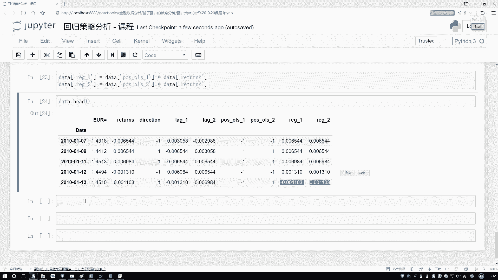

好了，这是现在咱们把这个数据啊已经给它做出来了，那现在好比说我们已经知道了，就是对于每一天来说啊，我们这个报酬率，那之前咱是不是说了，我们对这个数据做了什么样预处理啊，对数操作吧。

对数A加上一个对数B等于什么啊，等于我的对数当中啊，是不是这样的一个操作呀，那现在我们干可以干什么。

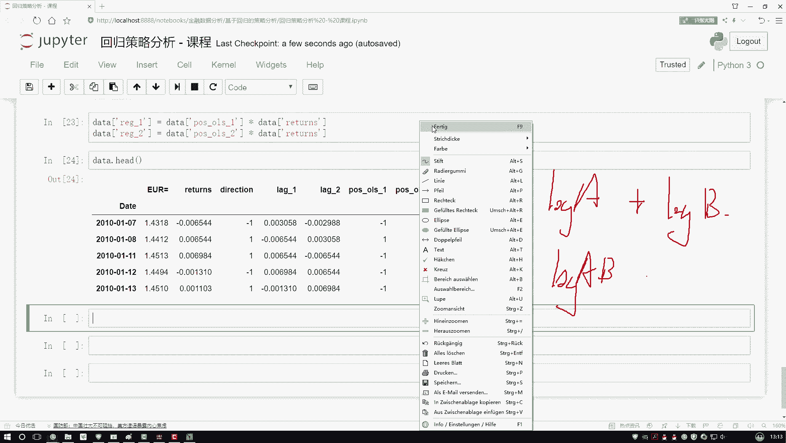

我们可以啊，对有数据啊，做一个就算什么呢，做一个累加操作吧，相当于我想去预测一下哎这样一个值，我们有了两种不同的策略啊，有两种不同的策略，还有呢就是什么都不做，按照它正常的一个走势啊。

这样一个结果对比一下吧，看一看正常情况下呃，从这个10年开始，我这一个一块钱能相当于之前多少，相当于未来多少钱，以及呢我做了两种策略之后啊，我的一个一块钱能相当于原来的多少钱，咱可以做这样一件事吧。

好了来写一下吧，还是啊在这个data当中，把咱们之前啊，需要就是，把咱们现在需要用的几个指标使用出来，第一个是这个returns是吧啊，这是我第一个指标，然后呢第二指标。

第二指标就是我的的第一个回归方程，然后还有我的一个第二个回方程改成一个二，是不是就行了，然后对它干什么，第一步做一个累加是吧，咱之前说了，现在我们是一个每一个点啊，具有一个累加性。

我想求未来最终的一个结果可以做累加吧，累加上之后别忘了做还原，是不是之前取了对数，现在怎么样，你是不是要给它还原回去了，南派点一叉P1下就行了吧。

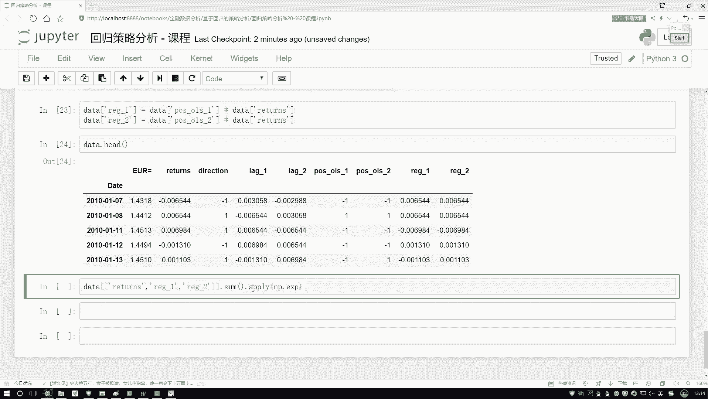

执行下结果看一下吧，这就是当中啊第一个return啊，return什么意思啊，就是原来啊，比如说你有这么一块钱，现在相当于怎么样，你是不是跌了呀，啊现在相当于你这一块钱跌成了八毛钱了，这个意思啊。

反正他是个跌了啊，这样一个结果，然后呢来看第一个策略，第一个策略啊，从这个结果上来说啊，也是跌了，是不是因为它都是小于一了，小于一就比原来少了嘛，比原来少了，那就是跌了吧，因为我们当之前算的。

我们在算对数的时候，用什么都是跟前一天去比的啊，都是跟前一天去比的，所以说我们的基础单位就是一啊，只要最终结果大于一，那相当于是你赚了啊，比如变成二了，你翻了一倍啊，是这样一个意思，然后呢第一回归方程。

我得到这个结果是0。94啊，反正也是跌了哦，但是能比你自己什么都不管，任凭他自己去玩的时候啊，能让你少少亏一点，是不是，然后呢，第二方程诶，第二方程好，通过一些策略啊，什么时候买，什么时候卖。

反而使得哎就是可能要经过好多次交易啊，但是咱们这个任务没考虑到一些手续费啊，没考虑到一些乱七八糟的东西，就是直观上来说啊，咱是怎么样，是不是稍微赚了一点，因为现在我用第二策略的时候。

一块钱相当于什么一块三毛多了，是不是是不是比之前结果要好一些啊，这个是我们通过回归预测啊，就是每一天我到底是要买还是卖，我都是根据前前一天和前两天的结果，要预测一下。

然后呢通过预测值来实际执行这样一个操作吧，啊这是现在我第二策略嗯，反正比之前强诶，我赚了一点钱啊，有这样一件事，那行大家可以看一看，就是呃给大家来看一看吧，就是我们现在预测的跟实际的一个正确情况。

到底怎么样吧，比如这里在这个电脑当中啊，咱们之前是不是有一列叫这个direction是吧，这表示什么实际哎，它是一个涨还是一个跌是吧，然后呢我可以做这样一个判断，就是呃跟我们这个data a当中。

我们的一个预测值吧，来看一看他俩的方向是不一致的，对谁呢，我看这个预测的结果值，哎有这个这是我第一个方程，第一个方程的一个预测结果值，我来看一看呃。

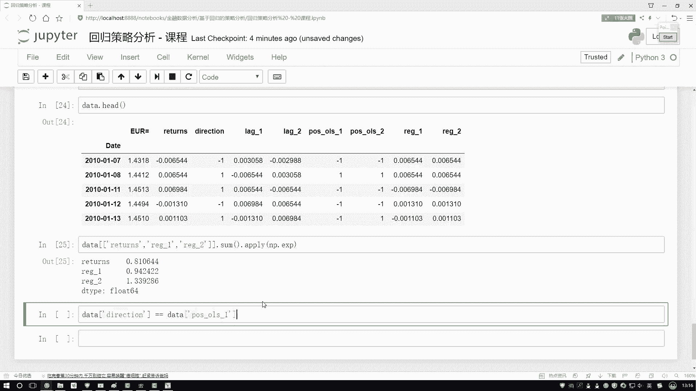

这这个结果指定完之后看什么啊，它是一个true false，除了false，我直接看一下吧，video cos一下，video cos能算一下我对了多少，还有一个就是错了多少是吧。

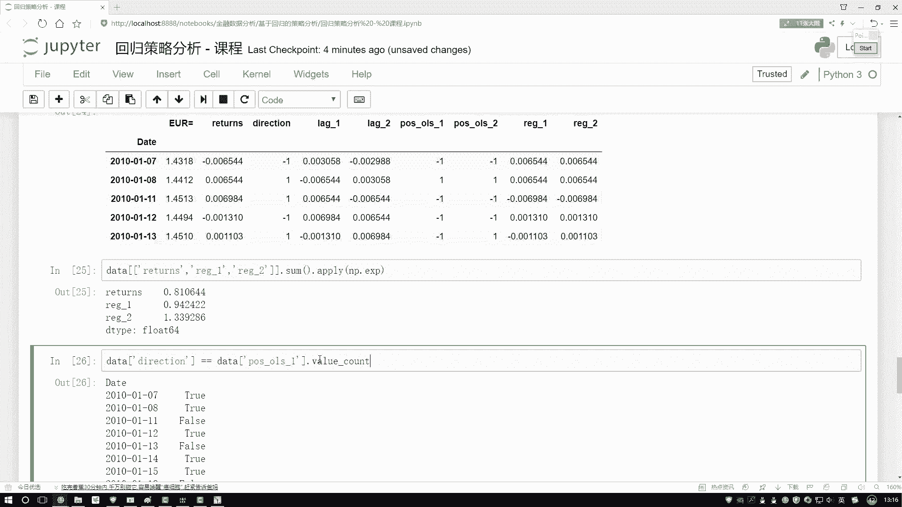

执行一下吧，我看看是不是拼错了video，然后COUNTS这没什么问题啊，哦这块我得把它括号起来，不是单独对右边这个是对这个true false。

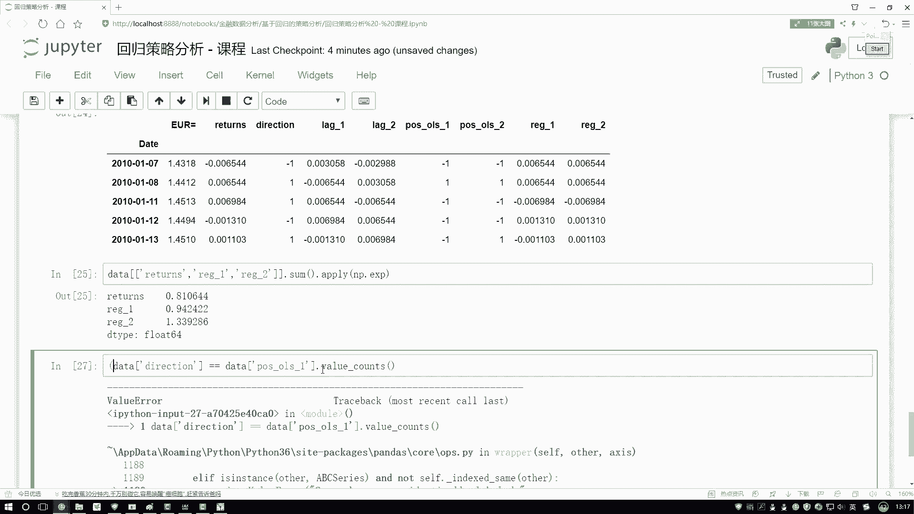

执行一下好了，false啊，你预测错了1093次，预测对了1042次，所以说怎么样啊，所以说咱们还是赔了吧，这是我们第二个，刚刚来看第一个对于啊，这是第一个，然后呢咱们来看第二个就是指定另外一个Y。

用那个涨跌来当做Y了吧。

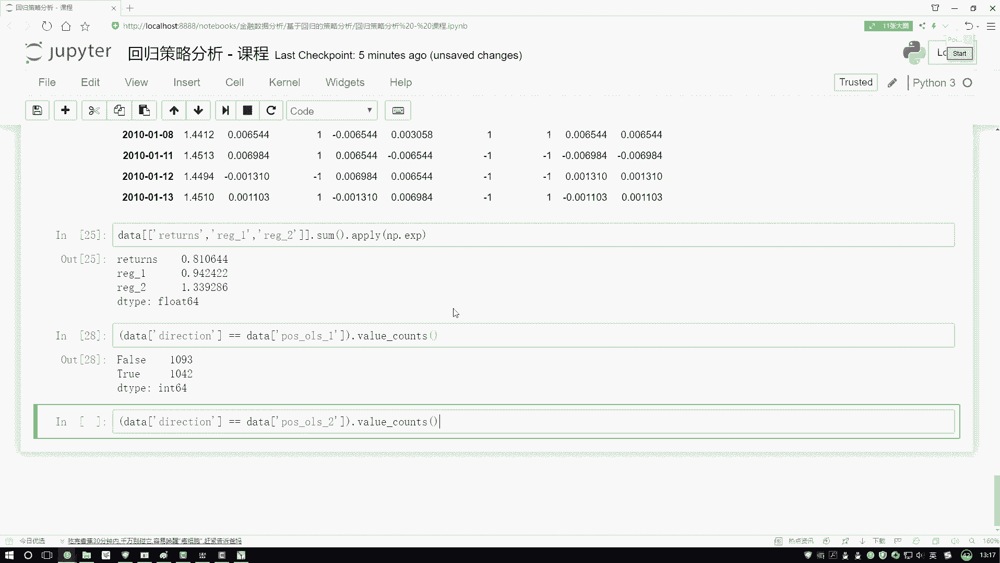

你看这里预测对了1096次，预测错了啊，1039次，这个就是我们第二次稍微赚了一点。

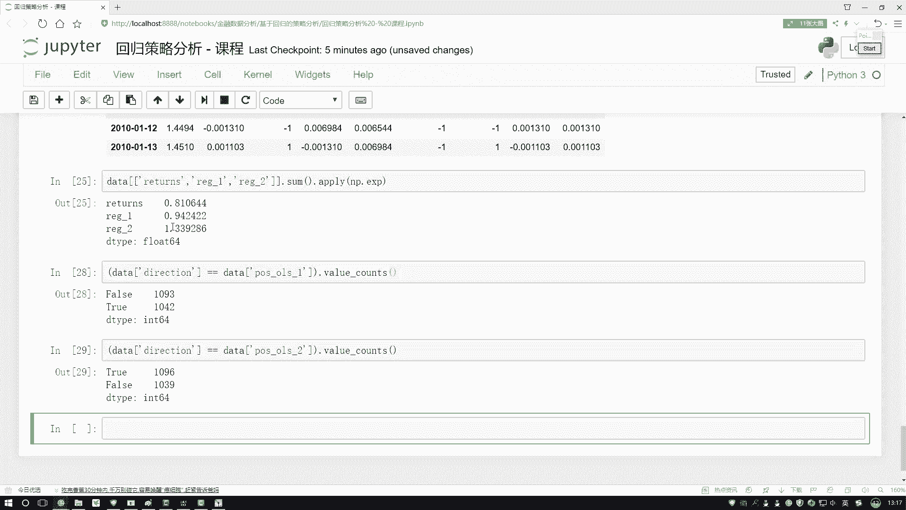

因为什么预测对的结果啊，我们稍微的会比较多了一些吧。

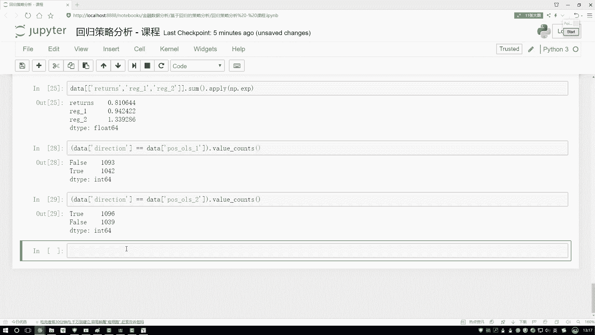

啊有这样一个结果好了，我们来看最后一个问题，最后问题是啊试试水。

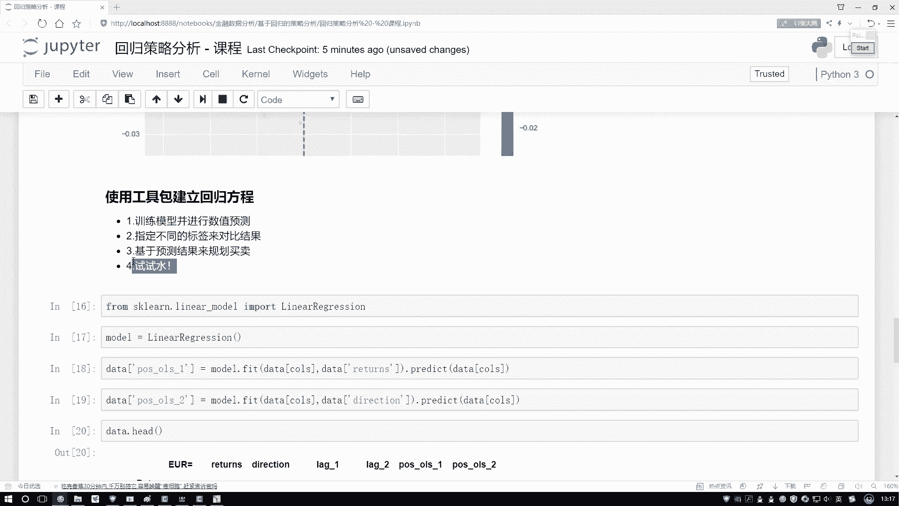

咱设设置完了试试水，最后给大家画个图吧，画个图来展示一下，刚才你是不是说了哎指定三个策略，那你只告solo，我就是哦最后一天就玩到最后一天的结果，你能不能给我画出走势呢，其实画出走势也是一样的。

你说你啊就是呃你要看前十天的结果，在这个任务当中，你是不是把时间序列取个十天加到一起就得了，你想看11天的结果是不是加11个，想看12天的结果，加12个数就行了，所以说这里哎如果说我想看一个走势。

应该用哪个函数啊，咱之前是不是也说过了，叫什么函数，是不是有一个CONSUM函数啊，什么意思啊，哎它是一个累加操作吧，啊第一天的啊就是第一天，第二天的会考虑前面两天，第三天呢是把前面三天加一起。

第十天的是把前面十天加在一起吧。

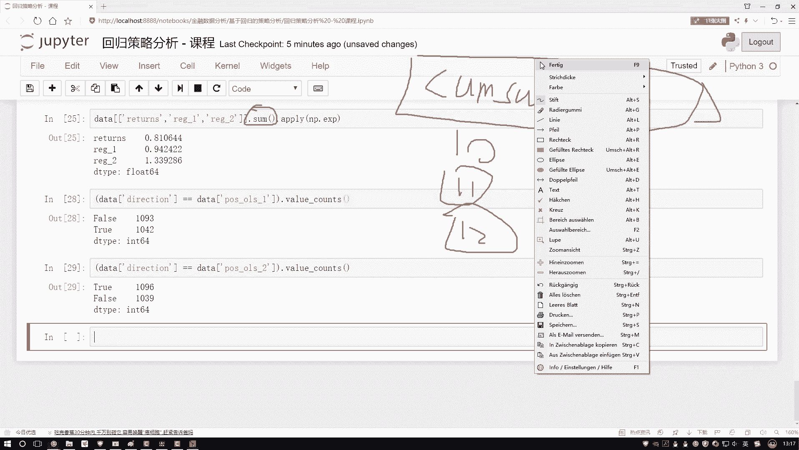

啊，所以说这里啊，咱们来执行我们的一个CONSUM操作好了。

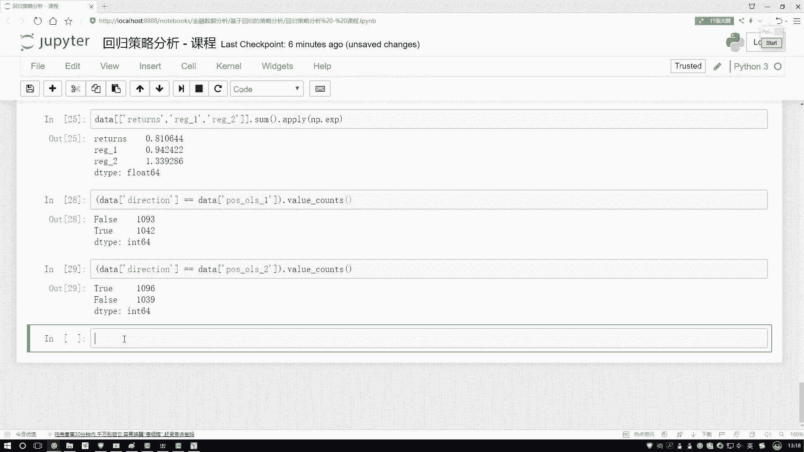

在我的一个电脑当中，然后呢把这几个全拿过来吧。

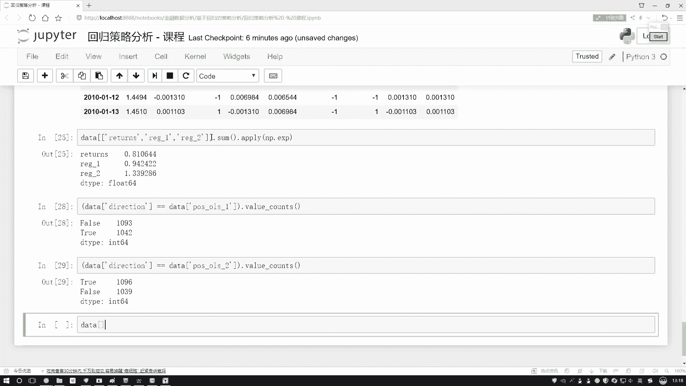

啊就这几个指标值，这几个有对我的一个预测值啊，还有一个实际它这个return值第一步干什么，咱们是不是说了我们这东西具有可加性吧，进行一个com sum操作。

com su完之后哎呀加法完之后还得去apply一下，apply什么，咱们还原回去吧，之前你不是做了这个对数吗，好了还原回去，还回去之后呢，我去有结果了，三条线三条线我PROLOAT一下。

指定一个figure size啊，稍微大1。16，我们来看一下结果。

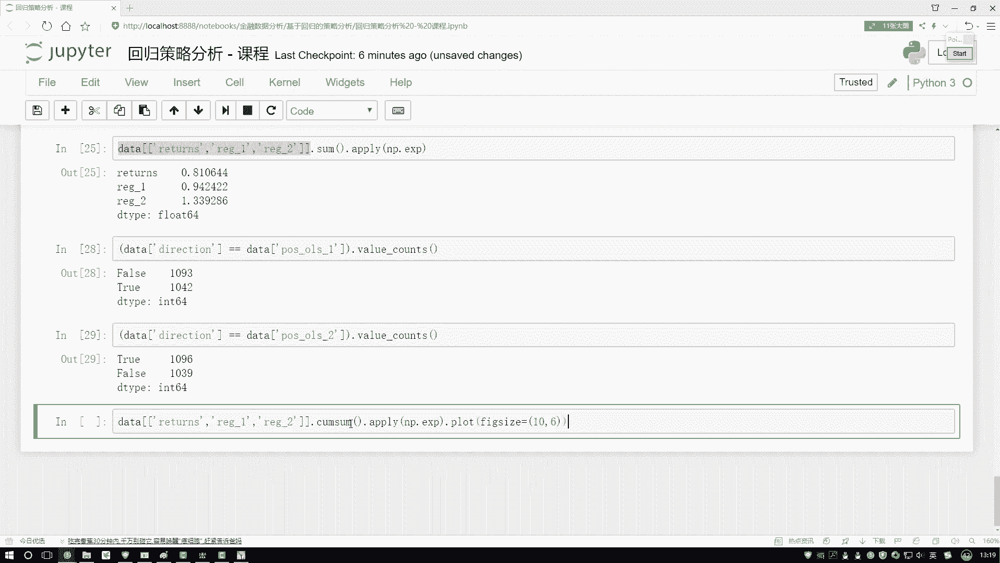

三个走势是不是就给大家画出来了，好啦蓝色是什么啊，蓝色就是实际情况，那确实就是跌了，你看实际它的一个它的一个变化情况，是不是确实又跌了一块钱，跌了多少了，跌成了后续的，你只有八毛了，是不是。

然后呢这个绿色的最后也跌了啊，这是我们预测的走势，你看跟这个蓝色之间差异其实蛮大的吧，然后红色呢就是我们第二个方法啊，第二个方法其实在这一块的时候还赚了挺多，是不是啊。

这块就是对于三个我们的一个走势情况。

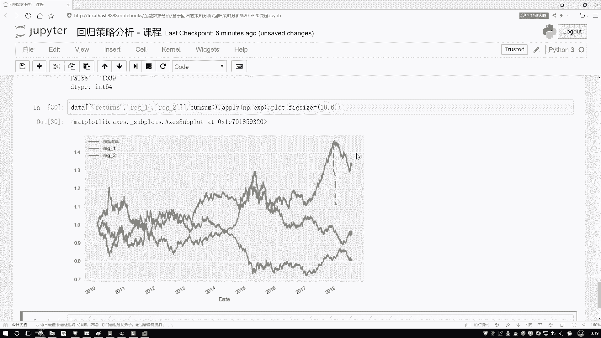

分别给大家做了什么一个分析吧，基于什么去做的，就是一个回归方程啊，我们用前两天结果预测一下啊，接下来第一天到底我们是买还是不买呢，然后把这个测试结果，融入到我们的两种不同的标签当中，做了个对比实验。

主要给大家说什么，其实啊就是数据和标签都会对我，结果产生一些影响吧。

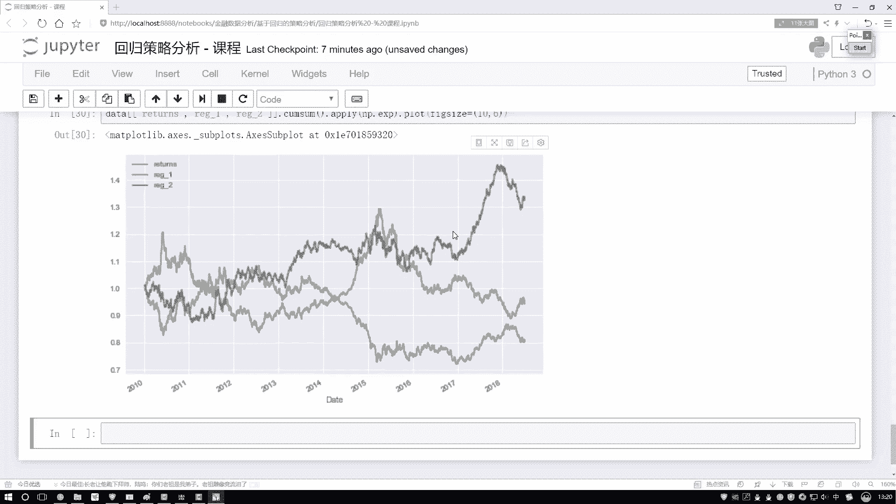

这里还只给大家举个例子啊，就是传统的哎一些最简单的回归方程。

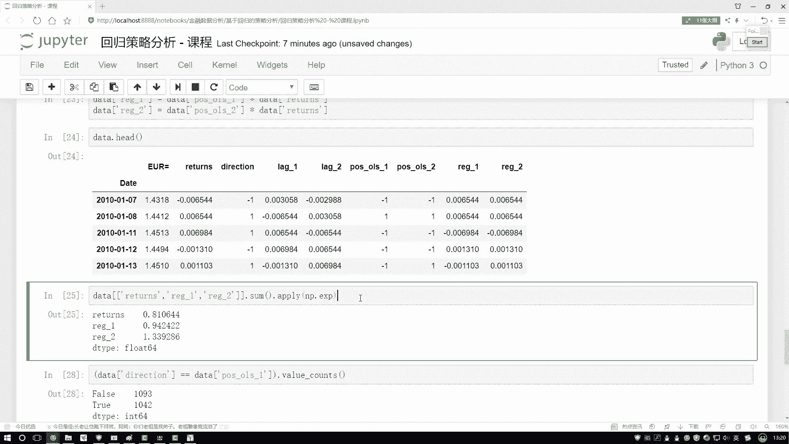

我们该怎么样去做，以及呢怎么样把这个回归任务引入到啊。

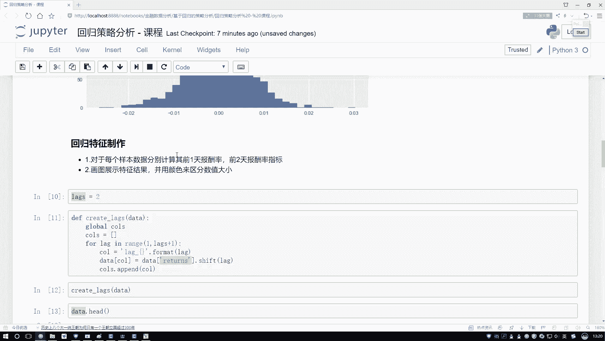

咱们的一个策略当中啊，其实说白了就是一个预测问题啊。

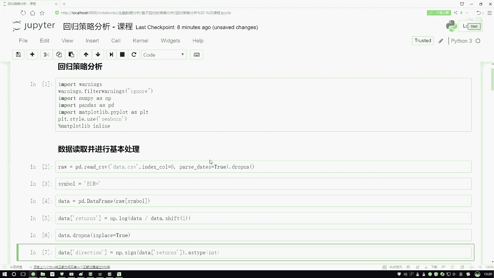

好了这节课咱们就说了一下啊。

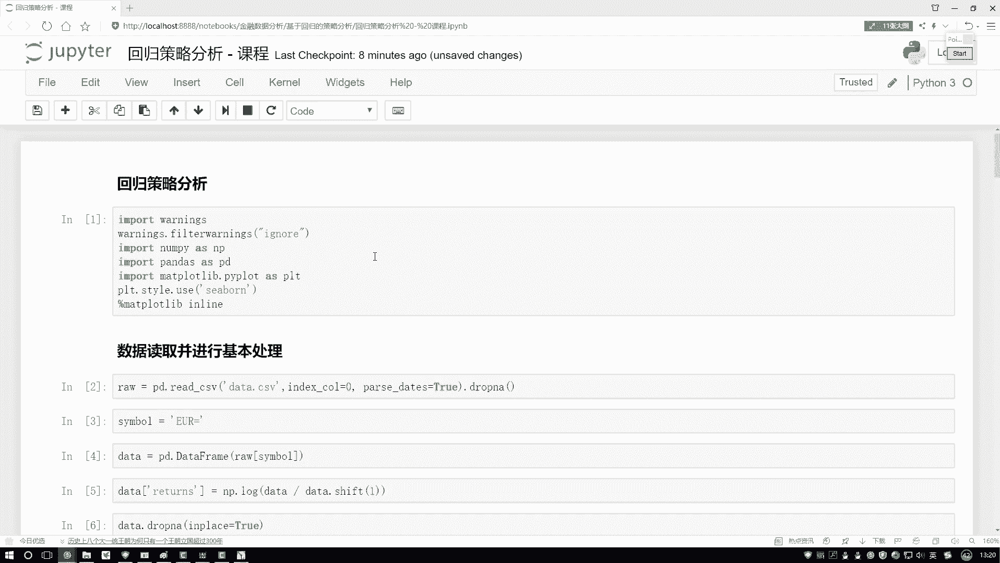