# 吹爆！这绝对2025年讲的最好的Python金融分析与量化交易实战教程！从金融时间序列分析到因子选股实战，全程干货讲解，零基础小白可学！（人工智能丨机器学习） - P60：04-4-多特征预测结果 - 迪哥的深度学习课堂 - BV1YFcbe8E8X

接下来咱们要做一些对比实验啊，之前咱们只是用一个特征来完成，当前的一个预测任务，下面呢咱们来看一下，就是用多的点特征时化效果会比之前更强一些，还把一些跟压强相关的也加进去了。

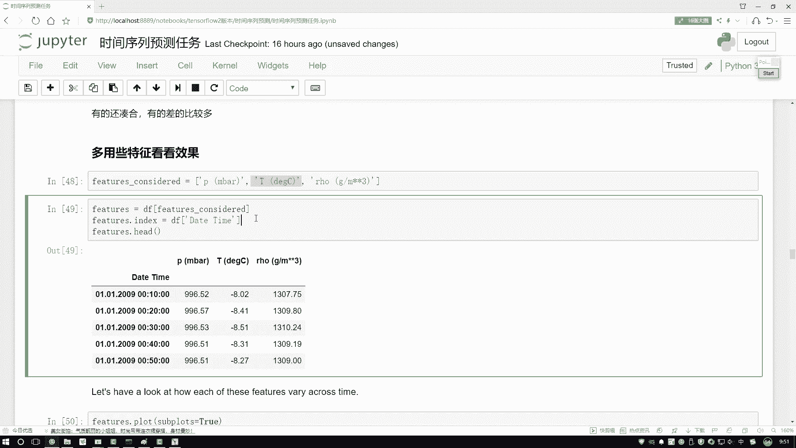

现在这个data frame当中啊，我们有三个不同的指标了啊，就是一会儿咱们特征是有三个的。

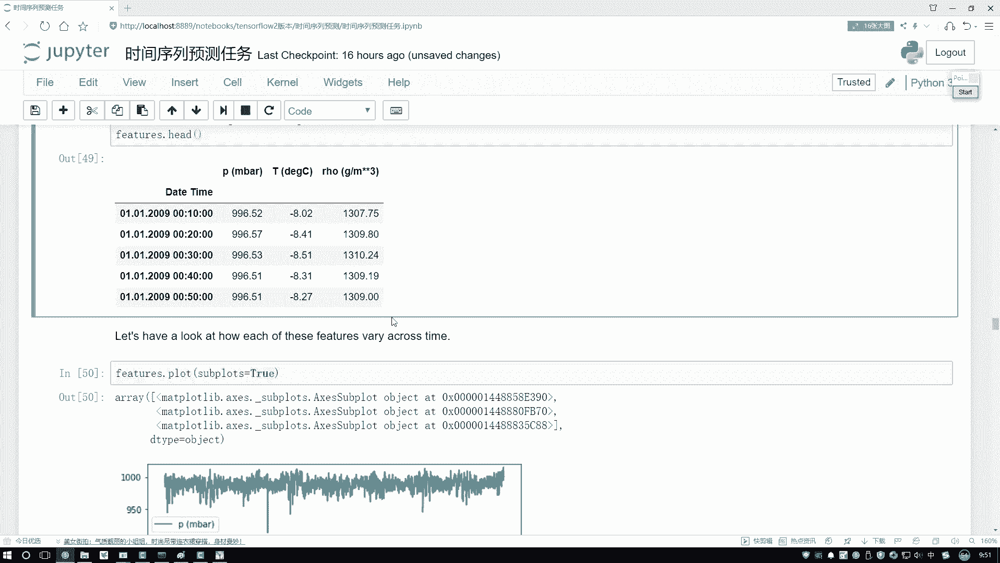

那下面呢我同样把这个图给画出来了，三个特征分别的一个走势可以观察一下，就是它是否跟时间序列是相关的，基本的一个走势，大家可以看到也是跟时间相关的吧。

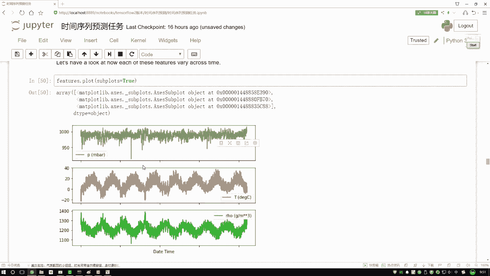

一会儿呢咱们把这三个当做我建模的一个输入。

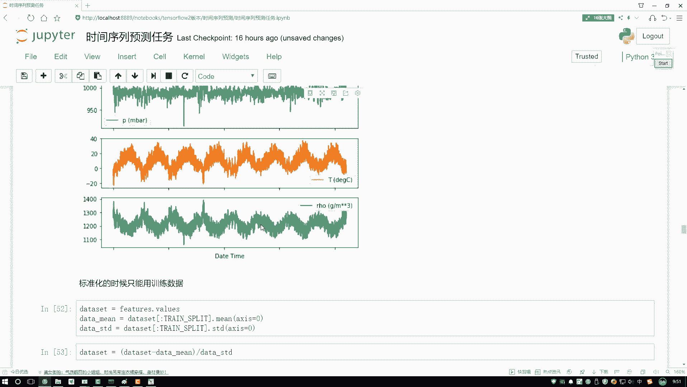

然后下面就是基本的处理方法，跟之前还是一样的，还是让我们对数据先做一个标准化的操作，做标准化的时候大家记住啊，就是呃只能用咱学院节信息啊，验证和测试信息啊，咱通通的不能加进去啊，最后这一块我指定了。

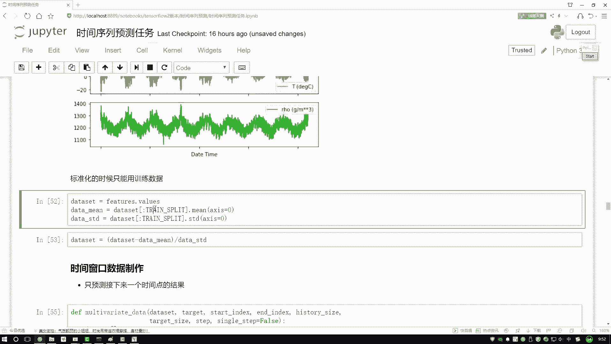

哎咱只用的是选集，那前30万个数据，那接下来呢咱们写个函数。

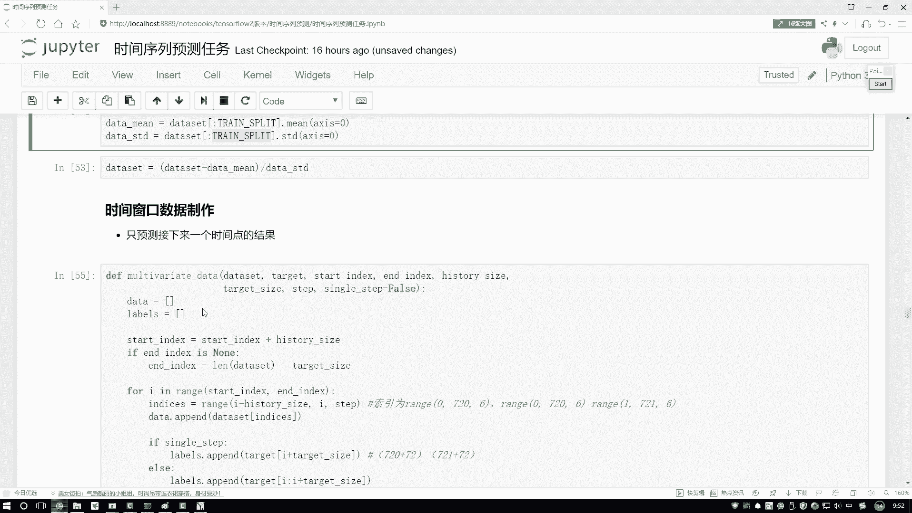

这个函数它有这样两个功能吧，呃一个功能是我可以预测未来某一个时间点，比如说我拿前面这个窗口去预测，然后未来比如说第六天吧，它的一个结果，未来的一个时间点，咱们能预测，并且呢我也可以去预测未来的一个序列。

其实无论是点还是序列方法都是差不多的。

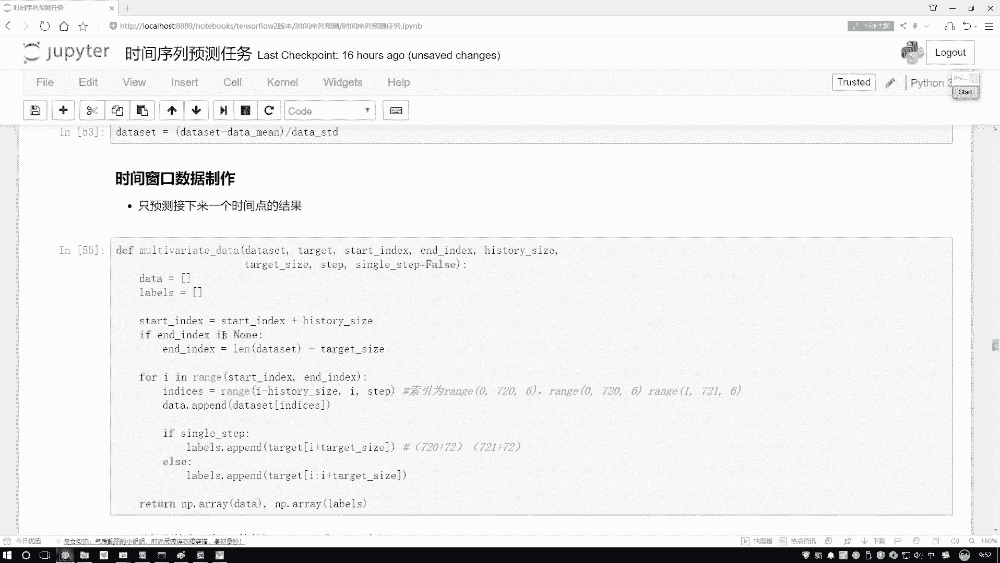

只是你预测的结果是一个还是个多个，再来看一下吧，这其中啊一会儿我会选择的一些参数。

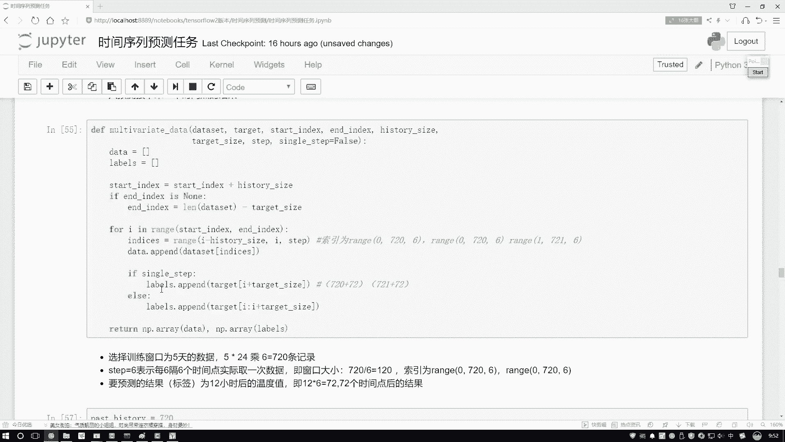

这里呢啊在这里我可以给大家写出来，这是咱选的几个参数。

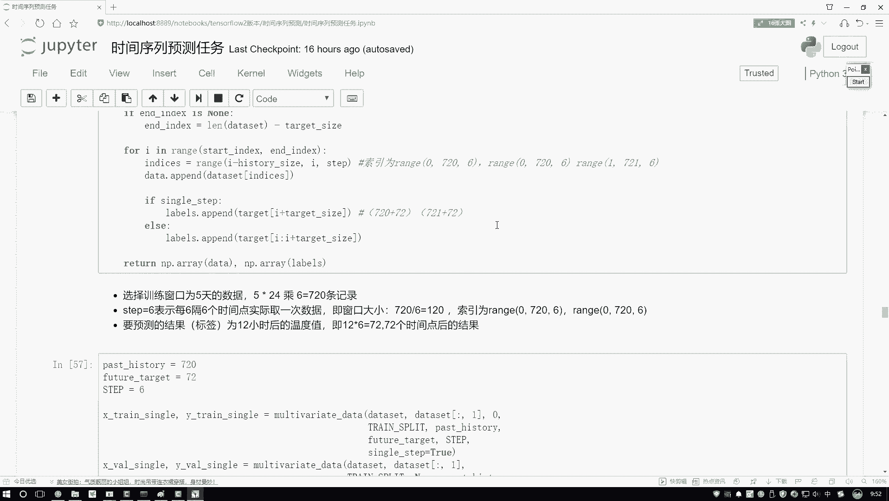

第一个参数，我说咱当前啊一个窗口大小是七百二七百二十，这个意思就是我们有个任务要求，哎，他说用这个以五天啊为时间窗口，做咱们的一个训练的拜日数据，那五天一共会有多少数据啊，咱给算一下，那又应该是一个五。

那每天有24小时，5×1个24是吧，然后呢，接下来，那你说每个小时我是每隔10分钟记录一个样本，那这块应该再乘上一个六吧，所以这里啊它就是等于一个720了，那给我们的感觉啊，就是如果说拿五天为一个窗口。

做成720个数据一次啊，训练输入720数据，看着数点多呀。

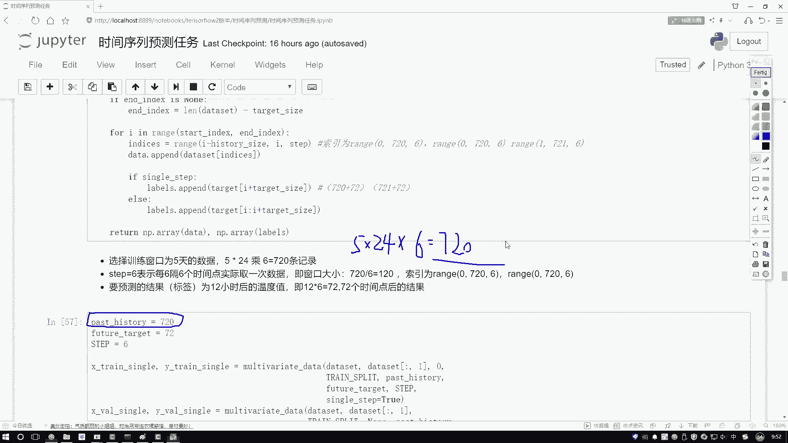

咱可不可以稍微简化一点啊，我们可以来看一下上面的一个走势啊，你说上面这个走势啊，可能你说呃他是每10分钟记录一次，那你说第10分钟的和第20分钟的可可，或者说和第30分钟吧。

它们之间怎么样会非常的接近吧。

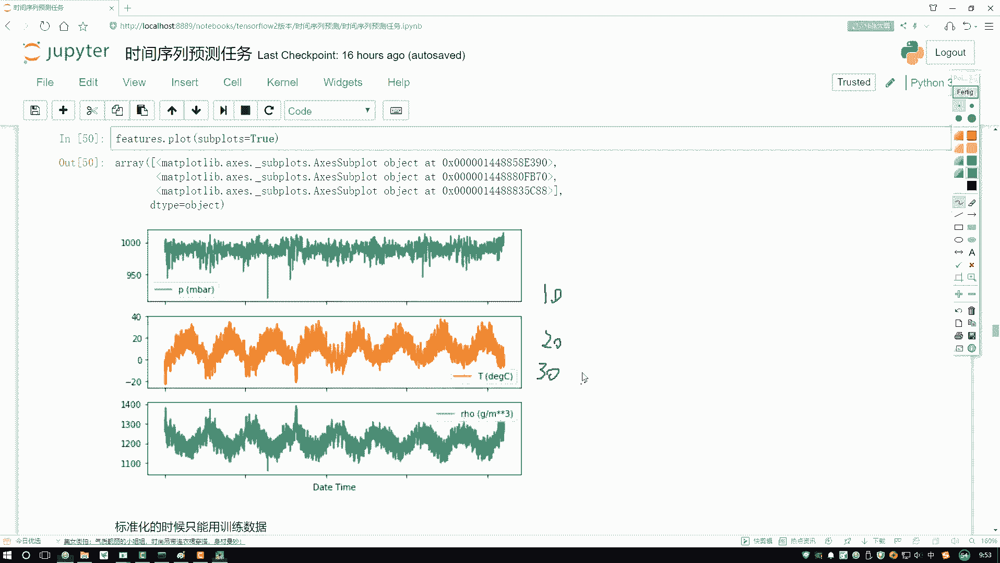

所以说啊在这里我说每隔10分钟啊，看着取得有点太近了。

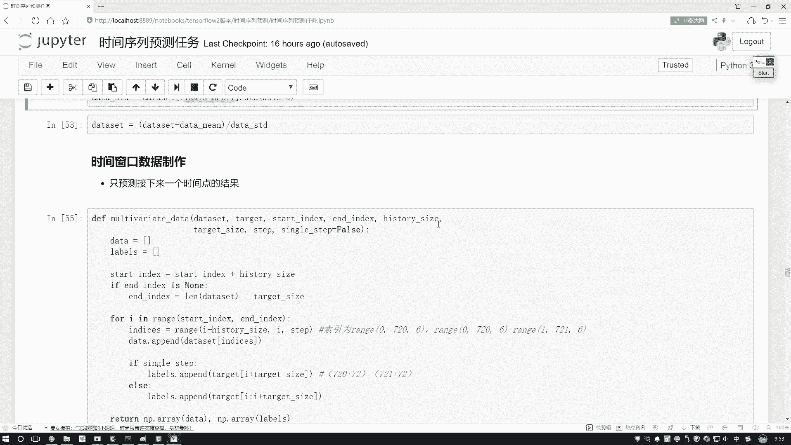

我能不能做一些间隔呢，是不是也可以啊，大家可以看一下，就这里咱们这个range函数啊，多了一个参数，之前呢只是从谁到谁是吧，现在呢加个range呃，先先在这里加了step值，step值啊。

这里我也写出来了，就是咱窗口实际你在训练的时候，它里边这个参数的一个值，你看720，那就是从第零条数据到720条数据，然后面有个六，就是每隔六条数据实际的去取一次，那这一个样本取完之后啊。

它就不是720了，而是多少，720比六相当于只有120个数据，他的意思啊，就是说嗯咱不按照原始数据啊，每10分钟一取了，我说按照我自己的想法，每一小时取一个数据，当做我们训练的一个时间不长，哎这个意思。

那下面呢也是哎这样一个120，这个就是咱这个索引是怎么指定的，这块应该是第二个，应该是一页，然后第二个下第三个应该就是一个二了，这个给大家说了一下，就是跟之前咱说点不同啊。

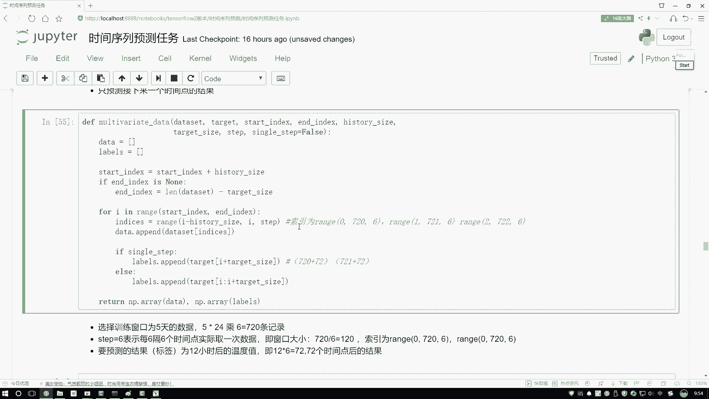

我们取的时间窗口是按照每一个小时为单位的。

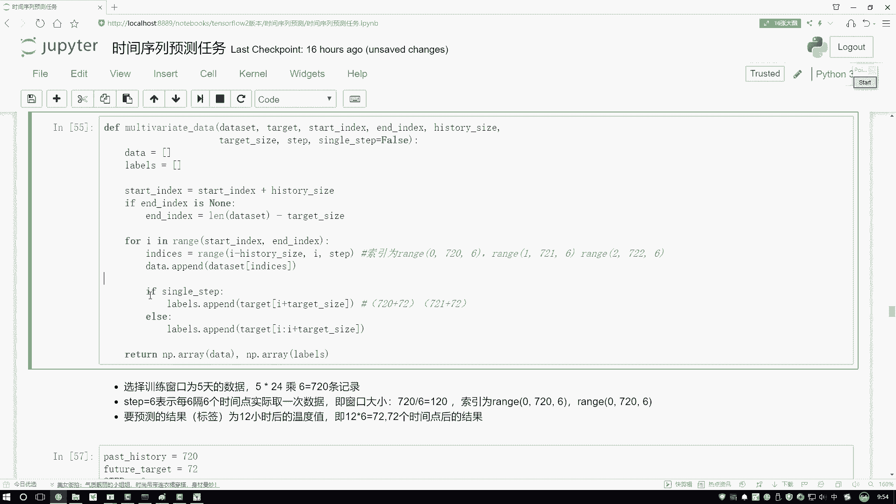

然后这里呢对我们的一个标签啊做了一个判断，而这里就是有一个single step，意思，single step就是说呃，你要预测的结果是未来的某一个时间点吗，若为处值相当于啊要预测的是一个时间点。

再来看一个时间点是什么，那这里边传进来的是实际的一个索引吧，一个索引对应着一个值，比如说第一个索引，那就是你看他说未来哪一天啊，它是未来12小时之后的一个数据，所以说啊就是你这里要加到多少。

那就是根据你这个任务来取吧，看看你就是想预测未来多少时间点之后的，咱就把未来多少时间点之后加过来，你看72，这为什么加了72啊，加72的意思啊，就是说呃咱为预测未来12小时嘛。

那12小时一共间隔了12×6，等于72时间点吧，所以说我要预测的是不是下一个时间点了，而是后12小时之后的一个数据，这个啊就是咱们的一个标签做了这样一个判断，那如果说呢我要预测个序列。

那就是else当中的，再来看看这else当中它传进来的是几个值啊，这个索引里边首先第一个它不是一个索引值，而是什么，而是一个区间吧，就有冒号啊，全来个区间意思是什么，比如说我想预测一下呃。

未来啊不是12小时啊，之后了，而是这12小时区间，每一个时间点是它的一个温度是多少，说白了上边你要预测一个值，这里要预测多少个值啊，未来12小时那就是有72个值了吧，所以说啊这个label是不同的。

第一个label，single step当中label是为一个值，else里边我要预测一个序列，如果预测一个序列的话，它里边是72个值啊，这是咱标签跟之前有些不同。

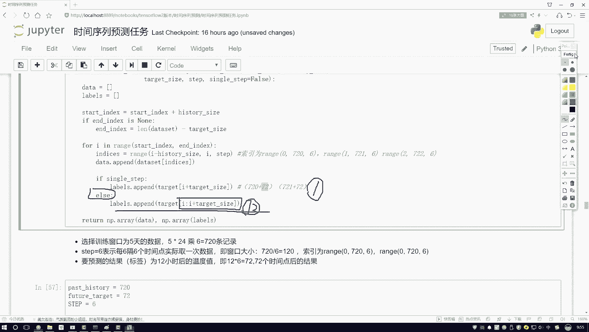

然后这个解释给大家解释完了，来看一下我们构建这个数据集，关于数据集方法跟之前啊都是一模一样的，只是说啊这回咱们传进来的参数有点不同了，第一个时间窗口我是选了是五天的，一共720个。

然后呢预测未来的我选一个72，你可以预测未来一个区间的，或者是预测未来一个新，就是未来一个序列的是吧，这个都行啊，这里咱把这两个值啊全部给执行出来了。

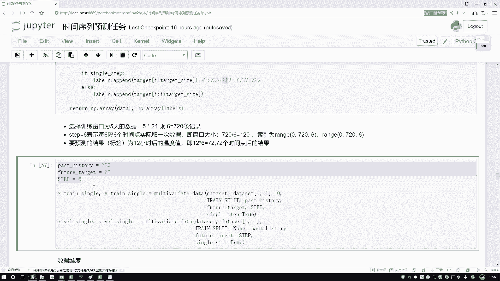

好了第一次第一次咱这样啊，咱是分两个实验，第一次的时候我说我这个co step给指定成处值，相当于是，我只预测未来12小时之后的一个时间点。

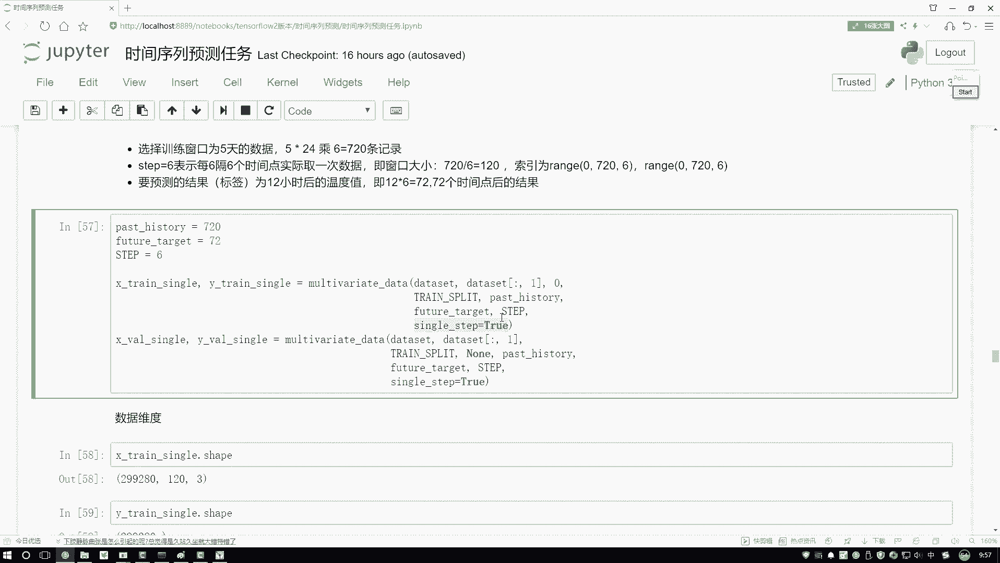

咱先预测一个时间点啊，那看一下吧，就是做完了这个半数呃。

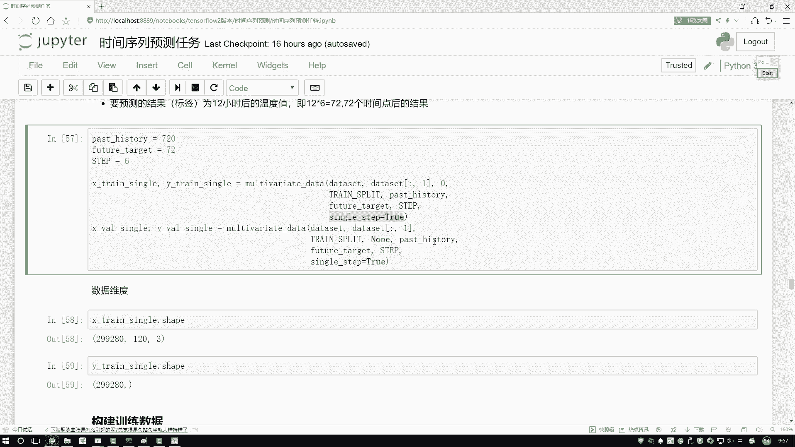

做完了这个数据集之化，咱的一个数据的维度，均电数据维度，这是120×3，120表示是我时间窗口，一共呢是有120个序列的，然后这个三啊就是说每一个序列，每一个时间点上它有三个特征，咱之前不说了吗。

我现在拿到数据当中啊，是有三个特征的，这个就是我们当前训练数据的维度。

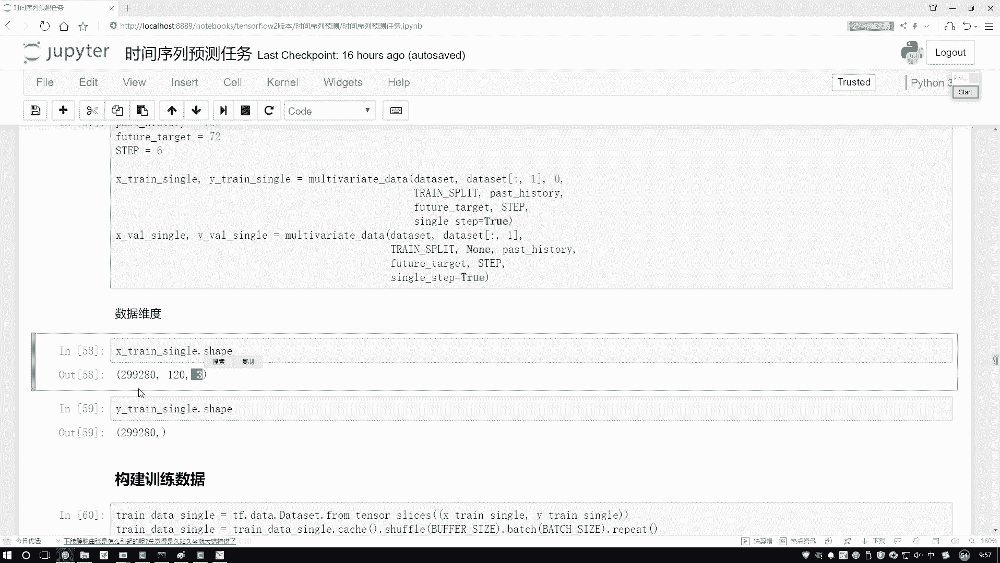

然后下面呢就是我的一个标签的维度，标维度当中啊。

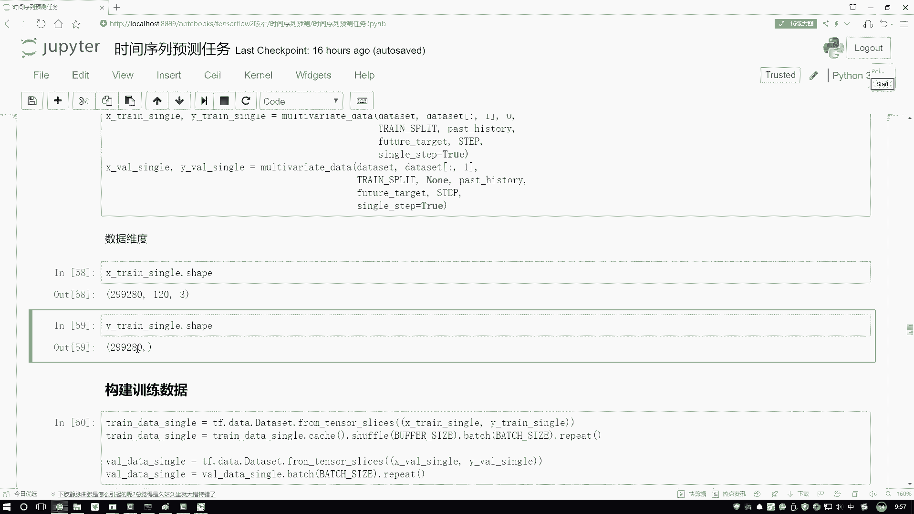

这里它逗号默认没写，就相当于只有一个值吧，那好了，接下来构建咱们的训练数据。

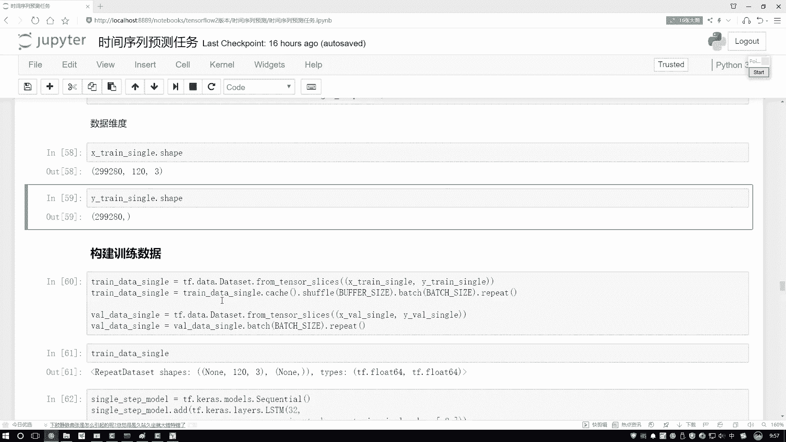

实际的做成一个batch方法，跟之前啊都是一模一样的。

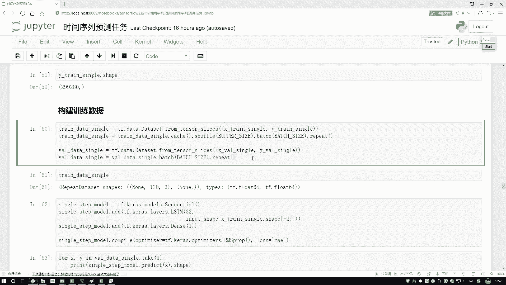

这个就不给大家重复去看了，跟之前咱这个方法都是一样的，然后下面下面这个指定方法也是跟之前一样的，只不过说我把这个隐层神经元啊，稍微的设置了多一点，因为咱现在输入数据更大了一些是吧，好啦隐藏。

因为咱们现在输入特征多了一点吧，把这个啊，那什么隐藏神经元稍微设置大一点。

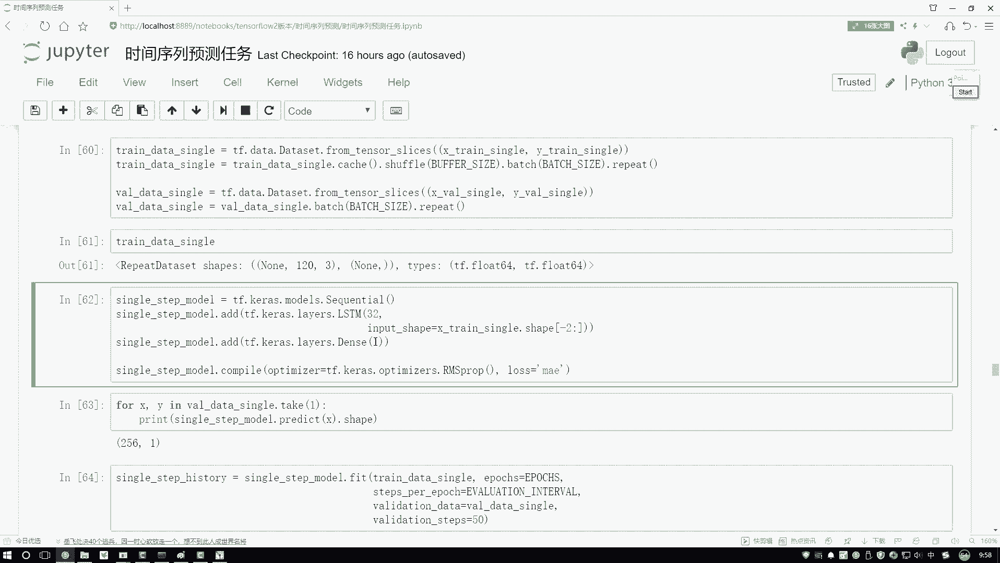

最终呢还是得到一个预测结果值，在下面做这个训练，训练完之后。

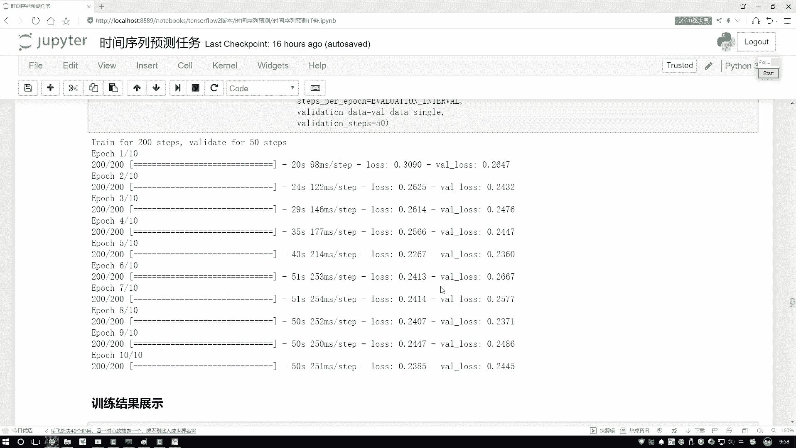

咱可以看一下这个结果，训练操作跟之前一样的，咱就不看了，来看结果吧。

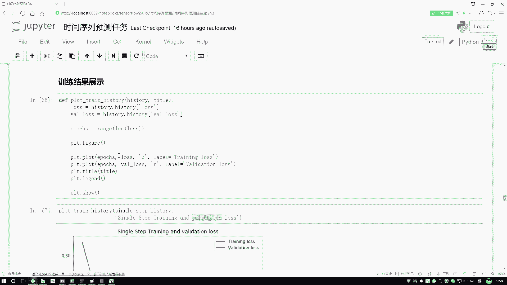

就是当中啊这一块啊，打印了一下当前训练损失下降的一个情况，然后下面呢打印一类。

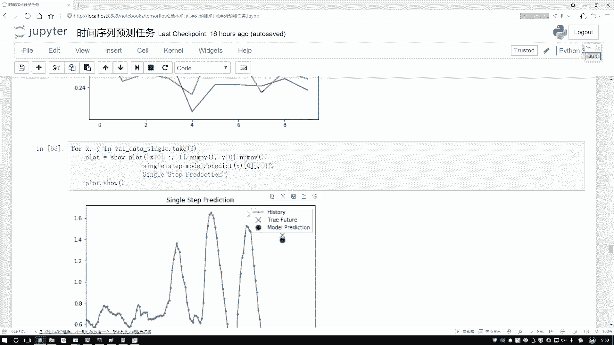

画了一下实际的一个预测结果，这绿色的是我们预测的。

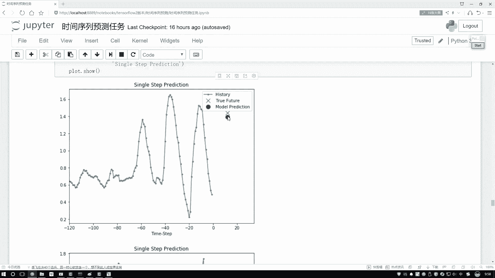

这个差的是实际它的一个结果值哦，看起来好像是还有一点差异是吧。

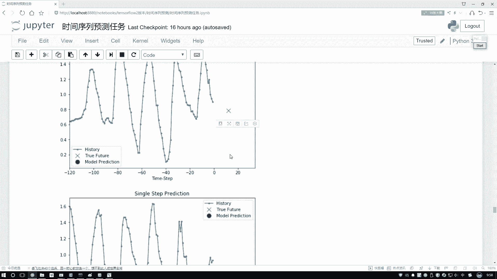

但是可能啊比之前效果要好一些了，这两天跟大家说了一下，就是我们用多个特征，并且呢预测的话我可以任意去选啊，未来的某一个时间点，并不一定是紧接着这个时间点，你可以在标二当中啊。

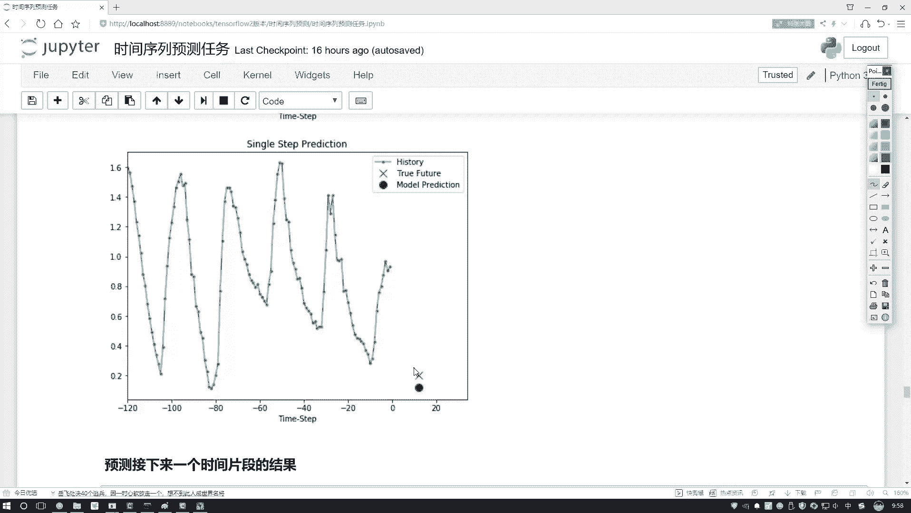

自己去设计，哎，我要预测哪个时间点，这些咱都能是去做到诶。

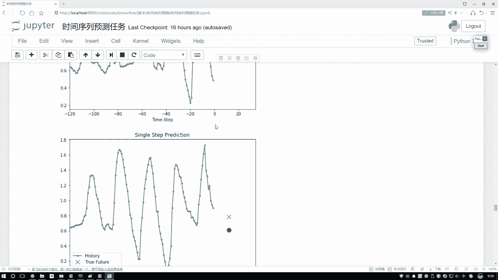

这个是咱预测了未来间隔的一个点的。

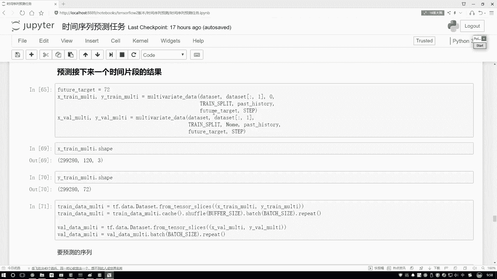