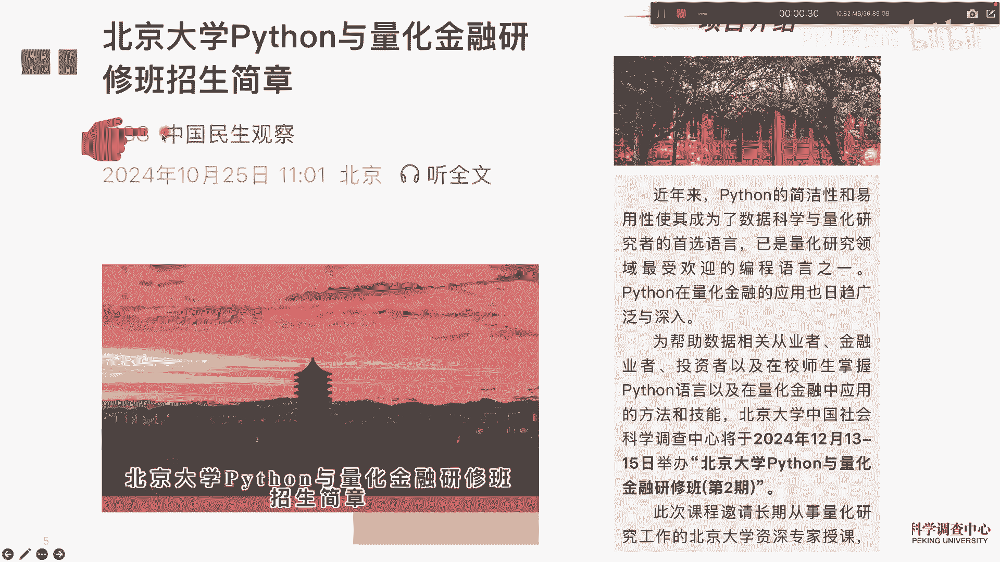
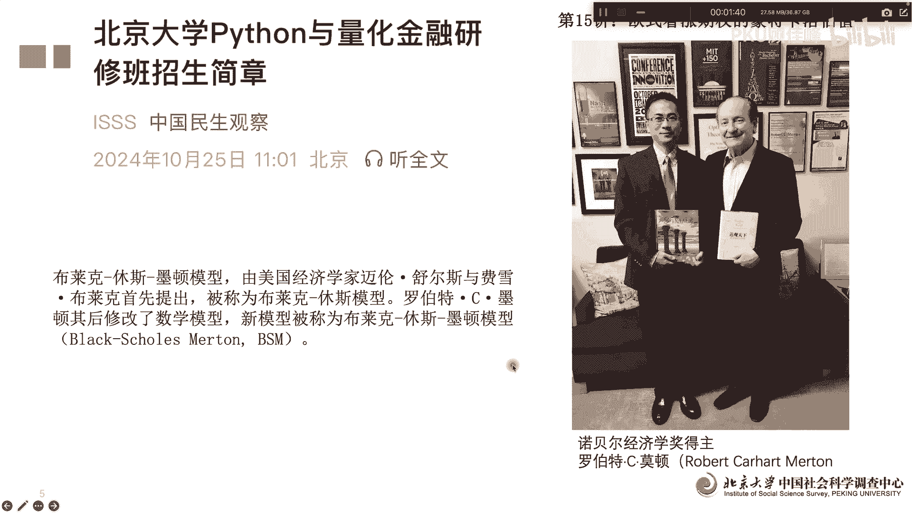
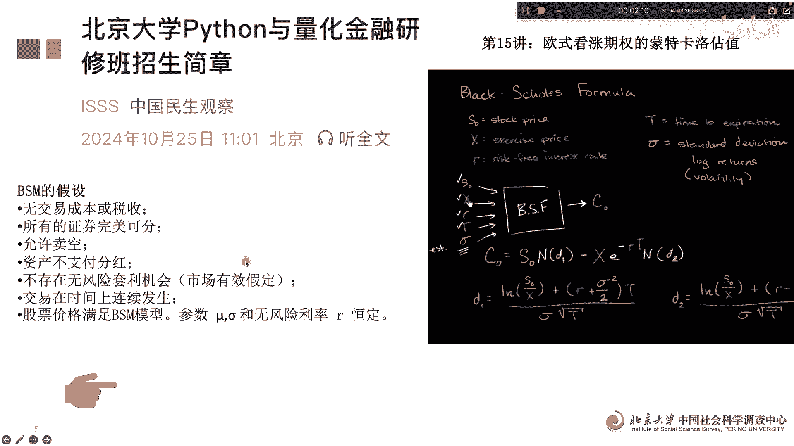
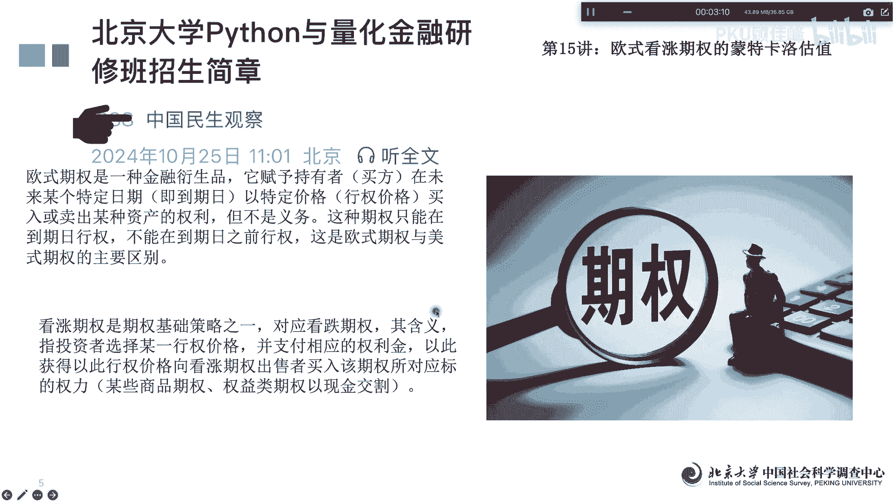
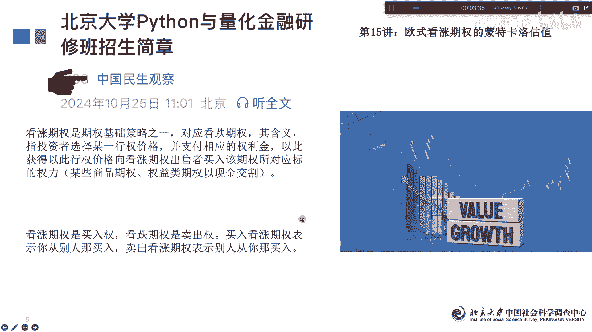
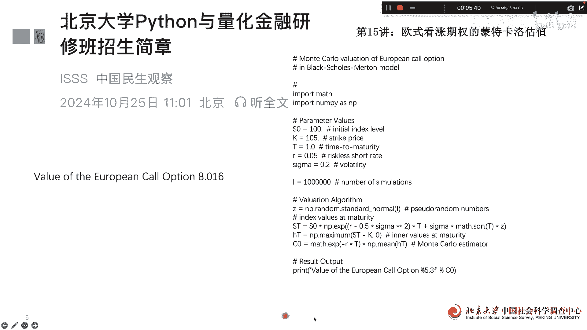

# 北京大学Python量化金融15讲：欧式期权 - P1 - PKU顾佳峰 - BV1EHSuYWEKX

亲爱的同学们，大家好，我是北京大学顾佳峰老师，今天我们继续来讲北大Python量化金融课，今天实际上讲的是第15讲，这个15讲的为什么要讲这门课的时候，北大在下个月12月13至15号，在北京大学举办。

拍摄一量化金融研修班的第二期呃，关于这门课呢，大家可以具体看这个微信公众号里面，有关于这门课的具体介绍。

怎么报名的，大家有兴趣可以去查询一下，那这么今天呢我们第五讲呢，主要讲欧式开涨期权，我们怎么通过蒙特卡洛的方法来估算出，模拟出它的价格，那欧式看涨期权，期权净定价呢在这个量化金融里面呢。

主要采用的是布莱克修斯莫顿模型，它实际上主要是由迈克呃，迈瑞斯舒尔词呃，fancy block他们这个歌提出来的，所以一开始叫布莱克修斯模型，后来呢robert c modern啊，把它修改了。

就变成了这个black这个修斯model模型，这个这个就是罗伯特呃c mod啊，郭老师有幸跟摩登先生就有非常好的交流啊，那他也是他们的都是诺贝尔经济学奖得主，因为这个呃期权定价理论呢。

像诺登得得了诺贝尔经济学奖啊，那今天我们就是以BIC，就是BIC模型为基础来讲，欧式开涨期权，我们怎么去用模特。

模特卡洛方法来模拟它的价格，这个这个非常非常有意思呃，这个呃break呃，说是他们的等式模型，它实际上有比较复杂的推导，我们今天不讲，基本上BAC模型它实际上有一些基本的假设啊，根据这些假设呢。

我们来可以计算或模拟，估算出期权的具体的定价啊，这就是期权定价的基本的理论呃。

关于期权的期权，我们这里面实际上分常用的，欧式期权和美式期权，其中欧式期权呢，它主要是这个买方在未来特定日期到期日呃，以特利价格啊，买入或卖入某种期权的资产的权利啊，但不是义务，也就是说你有这个权利。

但是你也可以不卖啊，不是义务啊，但这种期权呢只能到到期啊，也就是说到期就就那一天到期日才能行驶啊，倒T1之前不能行驶，所以这是欧式曲线重要特征，跟我们市区也不一样，那我们今天的它期权有K涨。

期权跟K跌去期权啊，那主要是投资者选择某一价格，并支付相关的权益金额，与其类对应，此价格向开涨期权出售者买入这个啊，我们知道他有开涨跟开开跌啊。

那有看涨和看跌的，实际上我们怎么区分，在看涨期权其实是买入权，开店确实是卖出钱，然后买入看涨期权表示你从别人那里买入卖出，看涨期权表示别人从你那里买入，所以从买方卖方的角度。

我们可以看看涨期权和看买看跌期权的不同，那接下来呢我们怎么用数据用Python来。

我通过模特卡洛估，来进行欧式看涨期权的具体估值啊，那我们实际上其实用这个BSM模型呢，我们用Python写语言，其实用到主要是mask跟NINI这两个那个算法，这个库啊，我们把它import以后呢。

我们输入相关的变量啊，初始的初始值的变量，然后呢这个strike price k，然后T的时间就是你现在到这个呃，到期日的时间，然后呢二就是这个无风险利率啊，然后西格玛就是变变动率变化。

这些呢都是相关的变量参数啊，BS模M模型的变量参数你都给他事先设定好，当然这些参数你都可以变，变了以后呢，你要设定好，这个是就说这个模拟蒙德伽罗模拟的次数，这边的各是百千万10万，这模拟了10万次。

然后呢具体的算法啊，C值是这个这个是出来，然后ST值ST是用这个公式，然后HT用这个，然后C0呃，这最后呢会输出一个欧式期权的价格啊，会输出来一个啊，我们可以知道小数点三位啊。

这个数数这个具具体就是C0，这个我们输出来这个，你看就这样一个简短的语句，跑出来价格是7。971啊，你这些都可以修改它的参数以后出来都不一样，但我们实际上啊模拟的，这就模拟的次数也会不一样。

对影响我们这个是100万次，从10万次模拟到100万次，其他这些参数都不变啊，情况下我们看出来是8。016，稍微比前面还高一点，所以说因为这个我们用的蒙克蒙特卡洛的，模拟的方法啊。

但具体的这些呢你都可以调整，调整以后你都可以跑一跑，比如说你要投资欧式期权了，你怎么样去买入卖出，那这个呢也就你看不到。

实行的时候，我们就把这个问题给解决了啊，好关于这个这门课呢，大家如果报名还能获得北大的那个证书啊，然后欢迎大家观察参观呃，这个微信公众号，然后了解我们本期的Python与大化金融的课，欢迎大家来报名啊。

瞧这个今天讲到这里。