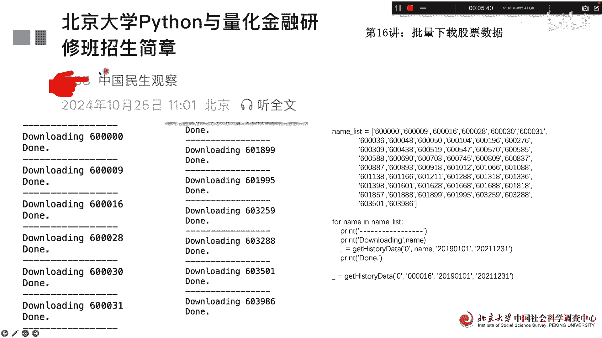

# 北京大学Python量化金融16讲：批量下载股票数据 - P1 - PKU顾佳峰 - BV1dQzAYGEX7

亲爱的同学们，大家好，我是北京大学郭嘉峰老师，今天我们继续来讲北大Python量化金融课第16讲，那我们的时间过得很快，我们下个月的十三十五号将在北大举行，python1代化进入研修班第二期。

欢迎同学们来报名，因为第一期同学们觉得呃很多，觉得下来学没赶上，所以我们在这个下下个月专门开第二期，大家可以关注这个微信公众号，来了解这个课程的具体的信息跟报名。

那我们这个量化金融呢实际上很关键啊，比如像诺贝尔经济学家罗伯特say norden啊，这个他对量化金融研究也非常的多啊，非常的好，他原来提出了这个black shows model模型，就BCM模型。

它实际上是对尤其期权定价量化方面的，做出了非常大的贡献，因此他也获得诺贝尔经济学奖，这个那我们继续呢对这个量化金融啊。

我们来今天讲什么呢，今天讲第16讲，批量下载股票数据，股票交易数据，那个我们就量化研究吧，一个很重要的基础，就是咱们先要从相关的平台去下载，股票的历史交易数据，比如说我们可以从网易财经的个股行情。

这个中心去下载它的相关网络呃，股票的历史交易数据，那我们用相关的这些呃语句就可以了啊，因为他163的，我们就163这边去下载，前面下载一个request，你要安装一下，没安装。

它会提醒你安装pandas，一般都安装过，然后呢下载这些数据都可以，我们这边下载了一个呃，这个股票代码660000，然后呢，时间，我们21年12月1号到12月31号啊，这个做个示例。

实际上这个实际上我们在具体应用中，下载时间可能会更长或更短，这个都可都没问题，你都可以设定啊，比如说我们用好600000这个股票代码，我们这次我已经下载好了，我从我的本地电脑上把它调用出来。

调用出来以后呢，我们要用那个NPLFLAC这个软件这个库，然后不给他做那个K线图，因为K线图是非常经典的，我们他他不说可以看一下这个K线图呃，这个那个交易的量图，我们用这样一个语句就相对比较简单诶。

就可以把它卡画出来啊，这个这个这样一个开盘价，闭盘价，最高价最低价啊，这些我们用一个图大概可以看出来，它实际上是这个数据，其实是19年1月2号到21年嗯，这个NOVEMBER22。

然后呢这个数据我们可以看出来，红的都是往上走的啊，那也有很多往下走的区间，这是浦发银行的数据，那做这个表的时候，他这个Python还会提醒你，提醒你出这样一个题型，他说因为你你这个画的数据有点多啊。

他有时候可能细节看不清楚，画的是那个，所以呢他会告诉你，他的意思是说你可以把时间段分的更细一点，比如说一年一年或者几个月，这样呢，它整个图画前面那个图画可以画的更清楚，当然你也你这个你也可以把这个呃。

嗯所以这个也是Python出来，当然你也可以忽略不计，不用去观察啊，那接下来呢我们来看一下，如果我们要批量的数据是下载，因为前面实际上是下载了一个股票的数据，我们要把所有这些股票数据都给它下载。

如果你手动的一个一个去下载的太慢啊，你就觉得很花时间，那其实你就用这样一个一个命令就可以了，然后呢把它下载，下载以后呢，跨一运行，你可以看到比如说下载这个诶，下载完毕6009，就你写的第二个下载完毕啊。

它就足够足够足够这样去下载了，下载到后面，你看这个下载到要899，有这个这个一直到下载，但下载到386603986啊，60356501啊，一直到下载到他就逐个按照这个顺序去下载，一个一个，这样的话。

而且每个文本到时候下载，你电脑上就是一个这个文本文件啊，所以这一批量就下载了，这样尤其我们在选择这个，因此选择股票的时候，我们需要成批量的下载股票啊，那那如果说这个股票还少也就几十只。

如果你要下载1000只是吧，或者你要把所有交易的股票，都下载到你的本地电脑，那你肯定得要用这种批量下载的方法，而且是自动下载的的方法呃来做，那好我们今手动的肯定忙不过来啊，没那么多时间。

那好我们今天这个欢大家呢，关于我们课要从这个微信公众号去了解。

那还可以获得我们北京大学的结业证书，那我们今天的课讲到在这里，欢迎大家来我们北京大学上12月，这个12号这个这期的量化金融研修课，因这也是我们本学本学本年度最后一次课了啊，好今天讲到这里。

