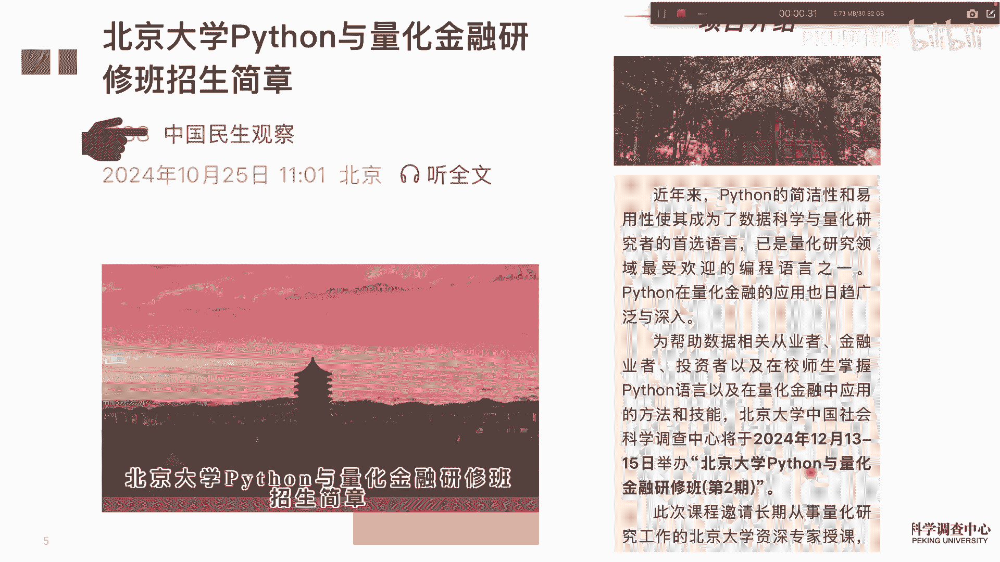
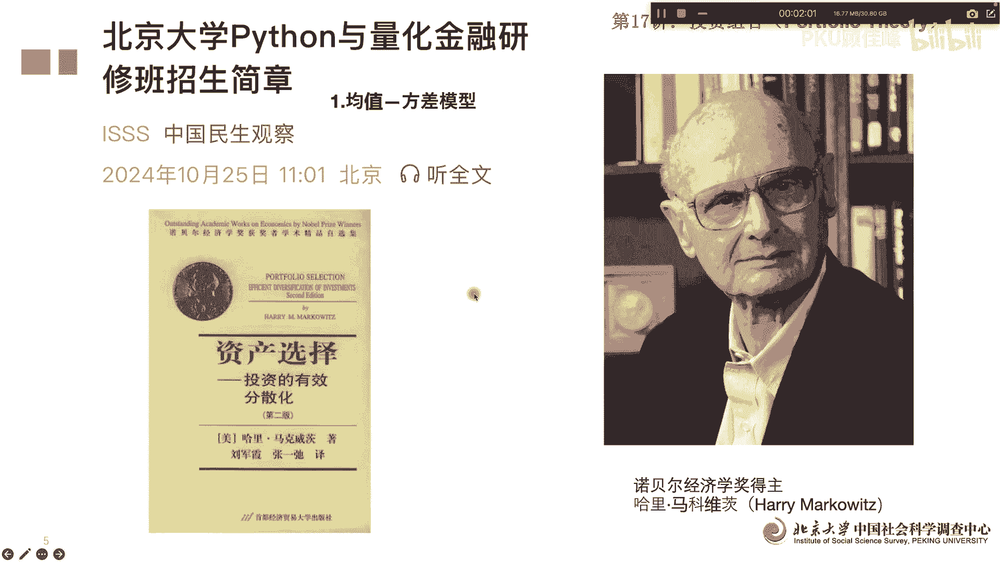
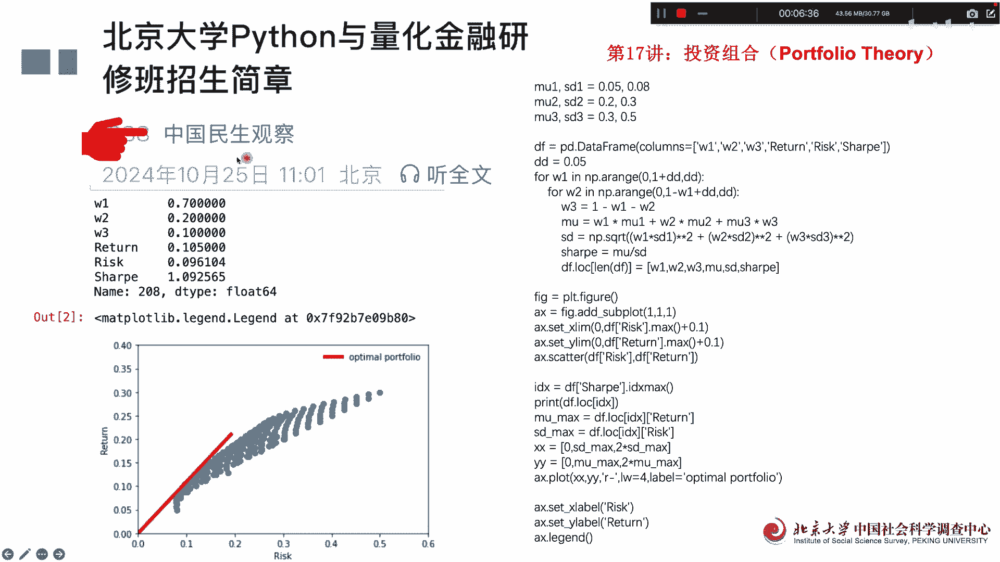

# 北京大学Python量化金融17讲：投资组合 - P1 - PKU顾佳峰 - BV19HBdYSEkp

亲爱的同学们，大家好，我是北京大学顾佳峰老师，今天我们继续来讲，北京大学Python量化金融第17讲，那我们呢这个接下来在12月13到15号，在北京大学举办Python量化金融研究班第二期。

欢迎同学们来报名，因为第一期效果非常好，很多同学没赶上呢，希望我们尽快能开第二期啊，所以我们下个月就要开这个班。

大家有兴趣都可以来北京大学来听课，那今天我们要讲的是什么呢，就是量化金融里面一个非常重要的知识点，非常重要的工具理论就是这个投资组合理论，投资组合理论呢这个是有马可维茨做呃，提出来的。

他因为这个呢也获得了诺贝尔经济学奖，大家去看这本这本书非常的经典，那投资组合理论里面呢，这个马可维茨他主要发现说，比如说几个股票做成一个组合，那它一般的收益率收益呢就是每个股票，单只股票的收益的均值。

这个没有问题，但是他发发现了这个组合后的方差呢，并不是每个单个股票的方差的均值，那所以说这里面呢他觉得就有学问，所以他就找到了一个，他需要找到了一个就是期望收益情况下，发生最小的组合方组。

股票组合方差最小的一个方式，那大家都知道是方差，其实测量的是风险，那所以说他提出比如说均值方差模型，就是指收益跟风险之间一个平衡的模型，那这个模型提出来以后呢，对我们这个做股票组合也非常有帮助。

那我们接下来呢我们可以去看我们怎么用Python，来做这个马科维茨的这个组合理论，我们假设有两个股票啊，一个收益5%，一个收益百分之呃，方差是8%啊，那第二个股票呢收益20%，方差百分呃八呃，这个0。

3就30%，所以呢我们根据这两个股票，我们就去看我们应该拿多少啊，拿就是比如说你要买这个股票，你有100块钱，你要花多少股去买第一只股票，第一支股票要买进多少，第二只股票买进多少，这个组合多少。

然后他们的预预期收益是多少，风险多少，那这个呢我们就通过这个这这个语语句，我们就可以跑出来，主要的W1W2其实是这支股票的权重啊，W20这支股票权重，然后return就是两只股票组合的收益率。

risk就是两只股票组合的风险，那sheep就是夏普比率，夏普比例就是一个风险所对应的收益，收益情况啊，其实就是那个那个收益除以风险，就一单位风险所对应的收益情况，所以我们我们模拟怎么模拟呢。

我们假设这是we1从零，从0。1，从0。0开始一个非常小值，然后呢不断的往上加，最后达到一，然后W2呢就是你的一减去W1，就是减去七，刨去W1的持有，就是W2的磁流，然后后面的这些这个是个额均值。

就是两个股票的均均值，这个是他们的组合方差，这个是shop比例，然后我们通过下面的卡哈进行模拟模拟，做出来以后呢，计算出来以后，这个呃这个就算出来嗯，然后呢我们还要画图把它画出来啊，画出来以后呢。

我们可以看一回车，结果结果就算出来W1是0。78，就是第一只股票，你的持中持股比例是78%，第二只股票持股比例22%啊，然后呢，这两只股票这个组合收益是8。3%啊，然后呢风险是0。09078。

这个夏普比率呢夏普比率呢是这个给除以，这个是0。913啊，然后这个就算出来了，那通过图我们可以画出图，可以看出来这个是风险，这个收益，然后呢这个你要从下面不断的，我这个在这一点吧。

然后这个我持有情况下的收益不断增增加，在风险减少，但是呢往后面呢你收益越高，风险越大啊，所以呢最优的组合比率是哪一个，就是这条线就是这个这个这个曲线的切线啊，这个切线我们可以算出来最优的持股比例呃。

这比例可以算出来啊，所以这个就是马可维茨的一个最简单的应用，那你现在有两个股票，那如果说我们我们情况很多情况，它不光只有两个，可能还有很多，那我们这里呢假设三个股票，三个股票收益风险这个情况。

然后呢那你就要算出三个股票比，重卡这一跑跑出来以后，第一只股票持有率70%，第二只股票持有率20%，第三只股票持有10%，这就是最优持有比率，然后回报率10。5%呃，风险是0。096分，下浮比例是1。

0925，这些就算出来，另外呢三只及以上股票以后呢，就不是一条不是一个曲线了，是个面是个面了，大家可以看到对吧，它跟前面那张图不一样，前面那张图它其实是一个曲线，你要三只股票，四只股票以后都是面啊。

灭了以后，但是你也要找到一个切线，等于这个切线的一切，这个比率呢这个这个就是最优的持股比例啊，所以我们可以通过图也可以看出来，马可维持的这个组合理论的重要性，那我们今天呢通过这两个例子来演示模。

用用Python来模拟啊，呃大家关于我们的课。

大家可以看这个微信公众号去了解，那我们的证书还有证书啊，学完我们课还有证书啊，那欢迎大家来参加我们下个月的这个北京大学，量化Python与量化金融课啊，这个我们今天这堂课先讲到这里。

