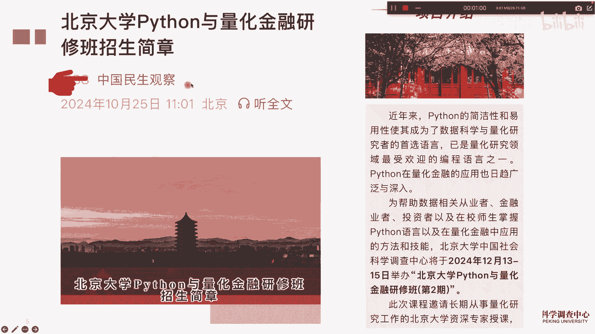
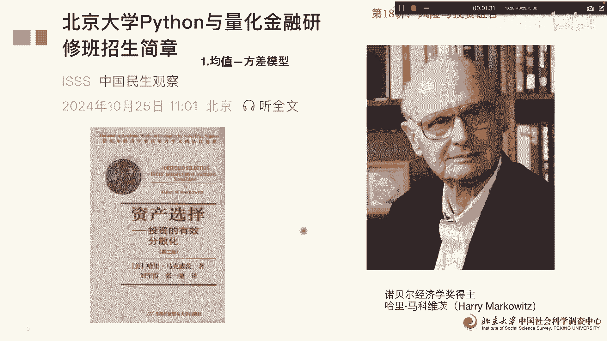
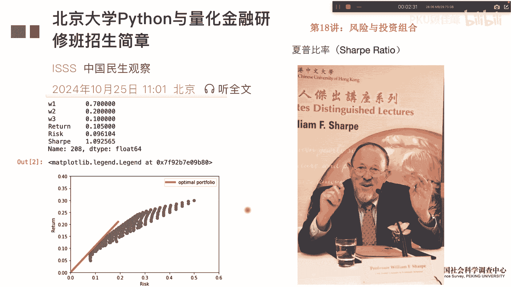
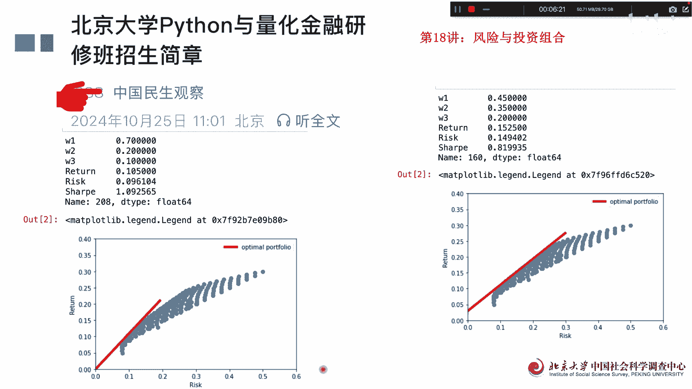

# 北京大学Python量化金融18讲：风险与组合 - P1 - PKU顾佳峰 - BV1YkzBYKENa

啊同学们大家好，我是北京大学顾佳峰老师，今天我们来讲北京大学Python量法进入第18讲呃，之前的顾老师在小红书上传了，打高尔夫球的视频，有同学们，有同学就在下面留言说，郭老师不要练球了。

赶紧那个要更新视频，就是来催更，所以我想还是今天赶紧给大家再来讲一讲，那我们来讲这个课呢，实际上我们北京大学在下个月，12月40八五号举办python1代化金融研修班，第二期，因为第一期举办以后。

很多同学没有机会赶上，所以希望我们赶紧举办第二期再来学习，那欢迎大家来报这个班，关于报名的具体信息，大家可以看这个微信公众号上面。

有关于课程的详细信息，那我们其实今天继续来讲投资组合与风险，我们这个呢紧接着是上堂课，17讲组合风险，投资组合风险的继续往前讲，那这组合风险最有名的贡献最大的，就是这个哈里马可维茨啊。

他这个提出了资产选择理论，对我们的现代的这个整个投资理论，其实是一个基础性的研究成果。

那我们实际上在投资组合里面呢，一个很重要的指数叫夏普比率相sharp ratio，夏普比例，夏普比例，这个也是个牛人啊，叫威廉夏普诶，他也因为在金融方面这些杰出研究，获得了诺贝尔经济学奖啊。

他是1966年10月提出的夏普比例，Shap ratio，那我们上节课呢，实际上第十间讲讲到了，就零风险情况下的资产配置以及下部比例，我们计算出来他们的资产配置比重，回收益率风险呃。

下互比例是我们算出来是这个，其实图图零风险，我们大家一定要知道起点是零，然后呢它跟这些点的一个最大切线，就是这个这个斜率就是就是相互比率，当我们现实中的其实很多情况下不是零风险的。

就是没有零风险的接受风险不可能为零。

所以我们要把这个风险加到里面去，所以我们在上节课的基础上呢，在语句中我们很重要的加上了这个风险，我们假设风险是3%，就现实中的风险是3%，已经不是零了啊，然后其他的那个收益率啊。

什么这些跟就跟昨天呃上一讲一样一样啊，然后呢我们这个把语句这么写出来以后，我们可以看出来额3%风险情况下，我们也可以算出来呃，这样这个是他们资产的配置比重额收益率，因为风险有风险，收益率就高。

变成了15%，收风险也高，下普比例变成了0。819了啊，但这个夏普比例我们可以看，这个时候他不是从零点开始，是这个有个0。3的这个风险，然后呢他再去做这个最大的切面切线，就是这条线跟这个最大的切面的。

它的斜率就更要变平一点啊，所以我们这个是这个是就说真实事件中，有风险的情况下的投资组合时的夏普比例啊，投资组组合的这个资产配置率，我们可以看看出来，所以他还是有不一样的，那我们再把两个比起来。

大家可以看这个是无风险的投资组合，这个是风险为3%的这个投资组合，我们可以看到无风险情况下，W1额0。7就是资产一配置的0。7，有风险的他明显就降低了，变成了0。45，45%。

然后第二只股票有风险没风险，配置20%，有风险情况下配置35%，也就风险提高了，第二只配置比重提高，然后第三只股票从10%配置到20%，也比重提高，但我们可以看到说，从零风险到有风险情况下的第一只股票。

配重减减降低，然后第二次第三次股票的配比比重提高，那收益率呢零风险的情况下，收益率是10。5%，有风险情况下收益15。25%，这个大家都知道高收益意味着高风险，所以呢风险提高自然会提高。

然后风险呢你看他这个是0。096，提高了0。3以后呢，就提高了不少啊，然后下部比例呢这个大家看这个直线，这个直线比这个更加陡峭，这个更加平缓，所以他下铺比例是1。092565，这个比例是0。

819935啊，导致这个很重要的一个品质，一个区别呢，他的这条直线的起点是从零起点，这个直线起点是0。3起点，然后呢下部比率呢就是最优配置呢，就是直线要跟上面的这些点形成，最大的一个切面啊。

那所以随着它这个这个点往上越往上，他肯定我们可以预见到这个这个这个下铺，这条曲线直线越来越平缓，解就下浮比例会越来越低，比如说如果是0。510。1的话，他这个值线就这么走了啊，这么平更平缓了啊。

所以我们但从这个图中我们也可以看到，这个风险对于资产配置的影响和作用。

好呃呃今天我们课就讲到这里啊，欢迎同学们来报名参加我们这门课，因为这个呃下个月马上就要开这门课了啊，截止日期也快报到了，大家要报名参加的，要抓紧报名了。

