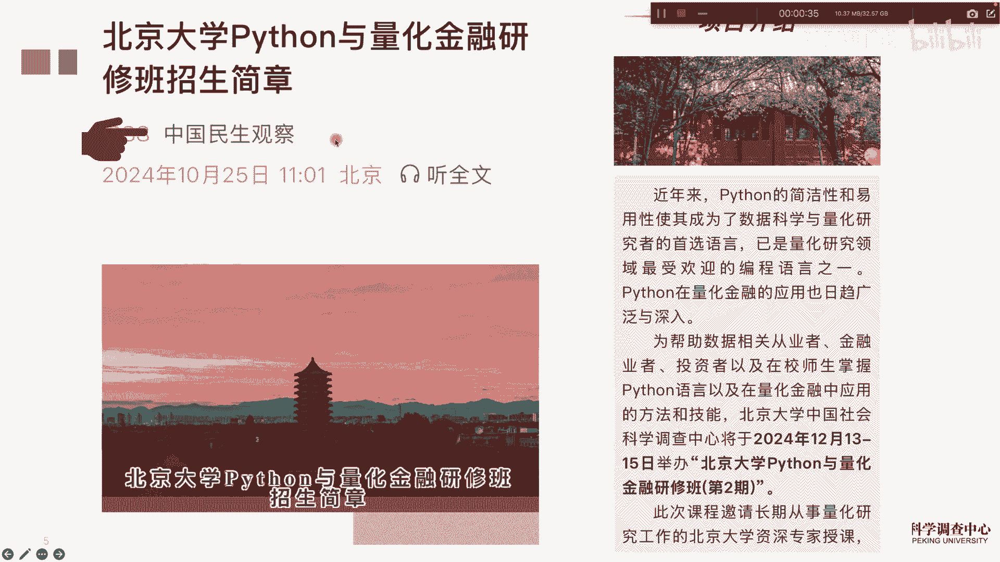
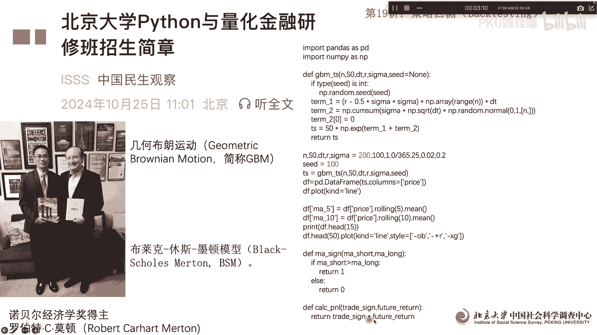
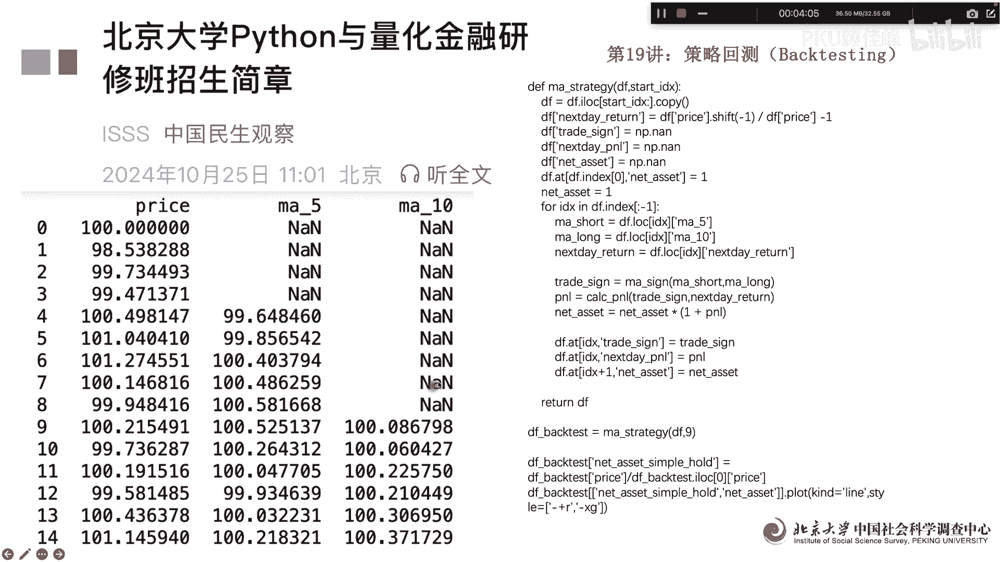
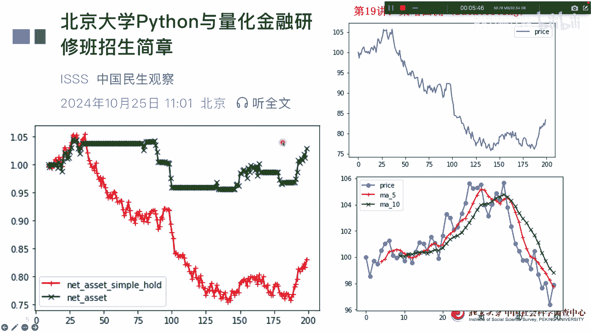

# 北京大学Python量化金融19讲：策略回测 - P1 - PKU顾佳峰 - BV1SyzsY4EGN

亲爱的同学们，大家好，我是北京大学顾佳峰老师，我们今天继续来讲Python量化金融第19讲，那我们在12月13到15号，就，下个月我们在北京大学举办Python量化金融研修班，第二期。

那些有兴趣的同学可以报名，因为我们举办第一期，很多同学都没来得及参加，说希望继续学，所以我们呢在下个月就开办第二期，具体报名信息，大家可以看这个微信公众号，上面呢有课程的详细信息跟报名。

那今天我们来讲第19讲，策略回撤啊，Bg testing，为什么要要策略回撤呢，我们在用量Python写量化金融代码，实施量化金融策略的时候呢，我们做出来之后呢，要看一看，如果说在不同的样本里面。

这个策略是不是合理有效，所以呢我们就要用回测的方法，就是用样本外的方法呃，这样本呃来重新来对策略进行估计，来看一看它的有效性，那我们一般做量化金融策略做完以后呢，通过回撤，回撤做完以后才是做模拟盘。

模拟盘做完以后才是进行实盘操作，所以这个灰色非常重要，那我们今天用一个简单的例子来做策略，回测的具体的演示，那首先呢我们用几何波浪运动，就是GBM这个几何布朗运动呢，我们来模拟一个股票交易。

股票的价格走势数据，那几何布朗运动实际上是很常用的，在那个BSM模型里面啊，我们金融研究一般常用的就是用几何布朗运动，来模拟股票价格走势啊，那BSMM里面实际上就是这个，罗伯特C诺诺顿诺顿。

他也是因为这个模型获得诺贝尔经济学奖啊，是个非常有影响力的教授，那我们呢这些用BGGBM做出来以后呢，我们定义一个简单的策略是什么呢，我们下面就要计算它的，比如说这个短期收益和长期收益。

短期收益我们用就是滞后五期的五，就五个交易期的平均收益来计算，长期收益，用十个交易期的平均收益来计算，所以呢这个就是语句啊，用ROLIN这个就可以写，写出来以后呢，这个我们后面定义策略。

定义策略是什么呢，只要短期的价格大于长期的价格，回归信号给的是一，也就是我们要买入买入呃，如果是短期，否则的话，短期的价格小于等于长期价格，我们的做空不买入啊，所以这是这样一个111111个一个策略。

那下面的信号回归啊。

我们做出来做出来以后呢，然后呢我们把这个策略具体的给他写好啊，这my strategy策略写好以后呢，我们就通过策略来回撤来跑啊，用bag test回车来跑一跑就可以了。

跑出来以后我们可以看首先计算的价，这个是用这个几何布朗运动模拟出来的价格，走指数走势啊，然后这个是五期的额平均价格收益，这个是17的平均价格收益啊，这个我们知道他前五期的话，前四期倒是没有为嗯。

为就是没有计算缺失值，到第五第五期的时候才开始有计算啊，然后十期平均的话到第十期才开始有计算，所以这个这个这个就是我们可以看到三列数据。

三列数据呢根据这个三列数据我们可以算出来，这个呢就是我们的第一类数据，就是用结合波浪运动模拟出来的，股票价格走势啊，是这个样子的，你看这个是200个啊，我然后呢，这个呢里面的这个我们可以看到这个呃。

这个是价格价格的波动嗯，然后呢这个是红色的，是武器平均至，然后额这个颜色的是17平均值，我们可以看到价格波动5G平均值是啊，这个这个然后呢我们可以看，如果说这个大于这个时候我们买入啊，否则的话做空。

那这个时候呢，我们整个再来看一下这个资产的走势嗯，这个红线呢就是我是我不动，就是只简单持有，我不买卖啊，那就是价格走势是这样，价值走势是这样子，这个颜色呢我根据这个策略啊，进行买卖制行为啊。

然后我们可以看到这个收益，明显高于这个收益啊，也就是说你根据这个策略进行买卖交易的呃，投资收益啊明显高于你什么都不做呃，维持在那边嗯，放在那边的叫呃这个行为。

所以我们可以看这个用那个bad testing呃，做出来的这个回撤的策略，回测的一个简单的结构。

我们演示给大家看啊，那我们这个量化金融课呢，大家可以获得结业证书，在北京大学百发的呃，我们这个坑呢12月下个月中就要开开始，大家要报名的，抓紧了啊，好我们这堂课讲到这里。

